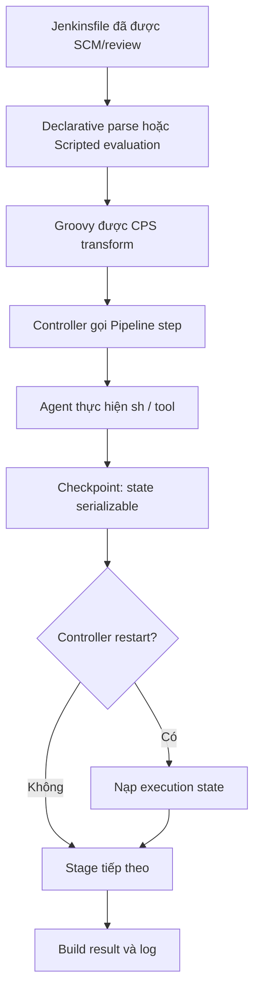

Groovy giúp Jenkinsfile biểu đạt điều kiện, collections và closures, nhưng Pipeline không phải một Groovy process thông thường. Code còn phải đi qua parser của Declarative, CPS runtime, checkpoint có thể khôi phục và ranh giới bảo mật của Jenkins. Trang này tập trung vào các giới hạn đó để Pipeline vừa dễ đọc vừa bền vững.

## Mục lục

- [Phạm vi, phiên bản và mô hình tin cậy](#phạm-vi-phiên-bản-và-mô-hình-tin-cậy)
- [Groovy runtime và hai kiểu Pipeline](#groovy-runtime-và-hai-kiểu-pipeline)
  - [Declarative và khối script](#declarative-và-khối-script)
  - [Scripted Pipeline](#scripted-pipeline)
  - [Parse-time và runtime](#parse-time-và-runtime)
- [CPS, checkpoint và serialization](#cps-checkpoint-và-serialization)
  - [Sơ đồ thực thi](#sơ-đồ-thực-thi)
  - [Đối tượng nên và không nên giữ](#đối-tượng-nên-và-không-nên-giữ)
  - [Dùng @NonCPS đúng chỗ](#dùng-noncps-đúng-chỗ)
- [Groovy thực dụng trong Jenkinsfile](#groovy-thực-dụng-trong-jenkinsfile)
  - [Collections, closures và retry](#collections-closures-và-retry)
  - [Input và command injection](#input-và-command-injection)
- [Sandbox, Script Approval và code đáng tin](#sandbox-script-approval-và-code-đáng-tin)
  - [Ranh giới quyền](#ranh-giới-quyền)
  - [Dependency, classloader và review](#dependency-classloader-và-review)
- [Lab: Pipeline sandbox nhỏ](#lab-pipeline-sandbox-nhỏ)
- [Khắc phục sự cố](#khắc-phục-sự-cố)
- [Checklist trước khi merge](#checklist-trước-khi-merge)
- [Đọc tiếp](#đọc-tiếp)
- [Nguồn chính thức](#nguồn-chính-thức)

## Phạm vi, phiên bản và mô hình tin cậy

Ví dụ giả định Jenkins LTS hiện hành có bộ plugin Pipeline cơ bản, gồm **Pipeline: Groovy** (workflow-cps), **Pipeline: Basic Steps** và **Pipeline: Declarative** khi dùng cú pháp `pipeline {}`. Lab dùng agent Unix với `sh`; thay bằng step tương đương nếu controller chỉ có Windows agent. Khả năng và thông báo lỗi phụ thuộc phiên bản Jenkins, plugin, cấu hình sandbox và authorization strategy, nên hãy xác nhận trong **Manage Jenkins → Plugin Manager** và [Quản lý Jenkins plugins](/docs/administration/plugin-management) trước khi chuẩn hóa cho đội.

<Callout type="warn" title="Không biến ví dụ thành quyền production">
  Jenkinsfile từ repository là input có thể bị thay đổi qua pull request. Không chạy script chưa được review trên production, không phê duyệt chữ ký Script Approval theo yêu cầu của một build, và không tắt sandbox để "cho chạy nhanh". Không có credential, endpoint production hay thao tác triển khai trong các ví dụ dưới đây.
</Callout>

## Groovy runtime và hai kiểu Pipeline

Jenkins chạy Pipeline Groovy trong controller qua plugin Pipeline: Groovy. Các step như `sh`, `checkout`, `retry` và `error` là Pipeline DSL do plugin cung cấp, không phải API Groovy chuẩn. Khi step cần agent, controller điều phối việc chạy rồi lưu trạng thái Pipeline để có thể tiếp tục sau restart. Xem bức tranh controller–agent trong [Kiến trúc Jenkins](/docs/getting-started/architecture) và mô hình durability trong [Tổng quan Jenkins Pipeline](/docs/pipelines/overview).

### Declarative và khối `script`

Declarative Pipeline có cấu trúc `pipeline {}` được parser/model validator kiểm tra trước khi build thực thi. Phần Groovy linh hoạt đặt trong `script {}` bên trong `steps`; khối này **không** loại bỏ sandbox hay CPS. Chỉ đưa logic tính toán nhỏ vào đó; giữ stage, agent, `post` và policy ở Declarative để người review thấy luồng chính.

```groovy
pipeline {
  agent any

  stages {
    stage('Chọn mục tiêu') {
      steps {
        script {
          def allowedTargets = ['unit', 'lint']
          def requested = params.TARGET ?: 'unit'
          if (!allowedTargets.contains(requested)) {
            error("TARGET không hợp lệ: ${requested}")
          }
          env.CHECK_TARGET = requested
        }
        echo "Sẽ chạy ${env.CHECK_TARGET}"
      }
    }
  }
}
```

`params.TARGET` cần được khai báo bằng `parameters` trong Jenkinsfile hoặc job. Giá trị được kiểm tra bằng allowlist trước khi dùng; không dùng input đó làm Groovy source, tên method hay chuỗi shell. Cú pháp đầy đủ xem [Declarative Pipeline](/docs/pipelines/declarative) và cách đặt Jenkinsfile xem [Jenkinsfile](/docs/pipelines/jenkinsfile).

### Scripted Pipeline

Scripted Pipeline là Groovy DSL tự do hơn: `node`, `stage` và `try/catch` tạo luồng ở runtime. Nó hợp lý khi số nhánh hoặc stage phải tính từ dữ liệu đã được kiểm soát. Đổi lại, cấu trúc ít được Declarative validator dẫn đường, nên hãy giữ hàm nhỏ, dữ liệu đơn giản và kiểm tra mọi input.

```groovy
node('linux') {
  stage('Kiểm tra') {
    def checks = ['unit', 'lint']
    checks.each { checkName ->
      echo "Kiểm tra đã được review: ${checkName}"
    }
  }
}
```

Không trộn hai kiểu bằng cách bọc `node {}` hay `stage {}` Scripted tùy ý vào thân Declarative. Khi cần chọn, ưu tiên cấu trúc Declarative cho luồng thông thường và đọc [Scripted Pipeline](/docs/pipelines/scripted) khi luồng động là yêu cầu thật.

### Parse-time và runtime

| Thời điểm | Jenkins làm gì | Ví dụ lỗi | Cách xử lý |
| --- | --- | --- | --- |
| Parse-time / model validation | Đọc Jenkinsfile, kiểm tra cú pháp Declarative và cấu trúc directive. | `steps` đặt ngoài `stage`, hoặc `script` ở vị trí không hợp lệ. | Sửa Jenkinsfile, dùng Pipeline Syntax/linter phù hợp phiên bản plugin. |
| Runtime | Cấp agent, đánh giá Groovy/CPS, gọi step và chạy process. | Không có label agent, sandbox từ chối method, `sh` trả exit code khác 0. | Xem Console Output, log controller/agent và xử lý lỗi có chủ đích. |

Lỗi parse-time thường chưa tạo stage thực thi. Lỗi runtime có thể xảy ra sau một checkpoint; vì vậy tên stage, log ngắn gọn và xử lý lỗi nên nói rõ ngữ cảnh. Hướng dẫn `retry`, `timeout` và kết quả build có tại [Xử lý lỗi và Retry](/docs/pipelines/error-handling); cách quan sát lỗi có tại [Logs & Diagnostics](/docs/administration/logs).

## CPS, checkpoint và serialization

Pipeline: Groovy biến đổi phần lớn Pipeline Groovy bằng **CPS** (Continuation-Passing Style). Có thể hiểu CPS là runtime tách công việc thành các đoạn có thể dừng và tiếp tục. Khi Pipeline đi qua một Pipeline step phù hợp, Jenkins có thể lưu execution state; sau restart controller, nó nạp state rồi tiếp tục từ điểm bền gần nhất thay vì chạy lại toàn bộ Groovy từ đầu.

### Sơ đồ thực thi



Sơ đồ dùng Mermaid; repository này đã có remark plugin chuyển fenced block `mermaid` thành component hiển thị. Checkpoint không phải lời hứa rằng mọi câu lệnh Groovy đều được lưu ngay lập tức. Thiết kế đúng là để state sống qua step có thể serialization được và để mỗi bước có thể quan sát lại qua log/artifact.

### Đối tượng nên và không nên giữ

Ưu tiên `String`, number, boolean, `List`/`Map` chứa các kiểu đó, hoặc dữ liệu đơn giản có thể tạo lại. Hãy lấy dữ liệu cần thiết thành primitive sớm và chỉ mang dữ liệu ấy qua `sh`, `sleep`, `input`, `retry` hoặc step có thể tạm dừng.

Tránh giữ qua Pipeline step các đối tượng như `java.io.File`, stream, socket, `Iterator`, `Matcher`, client SDK, thread, closure phức tạp hoặc object Jenkins/plugin không được thiết kế để serialize. Chúng thường gây `NotSerializableException` khi Pipeline cố lưu continuation.

```groovy
// Tốt: chỉ giữ tên và trạng thái đơn giản qua Pipeline step.
def results = ['unit': 'pending', 'lint': 'pending']
results.keySet().each { name ->
  echo "Bắt đầu ${name}"
  results[name] = 'done'
}
sleep time: 1, unit: 'SECONDS'
echo "Kết quả: ${results}"
```

Đừng né lỗi bằng cách tắt khả năng resume/durability hoặc bằng cách biến cả Pipeline thành `@NonCPS`. Cách đó làm giảm khả năng khôi phục sau restart và che giấu thiết kế state chưa đúng. Thay vào đó, lưu output nhỏ vào biến serializable, file workspace hoặc artifact theo nhu cầu vận hành.

### Dùng `@NonCPS` đúng chỗ

`@NonCPS` bỏ qua CPS transformation cho **một hàm Groovy thuần, chạy ngắn và đồng bộ**. Đây là lựa chọn phù hợp cho phép biến đổi dữ liệu cục bộ không cần gọi Jenkins. Giá trị trả về vẫn phải serializable nếu được giữ sau đó.

```groovy
@NonCPS
def normalizeNames(List names) {
  names
    .findAll { it instanceof String }
    .collect { it.trim().toLowerCase() }
    .findAll { it }
    .unique()
    .sort()
}

node('linux') {
  def names = normalizeNames([' Unit ', 'lint', 'unit', null])
  echo "Checks: ${names.join(', ')}"
}
```

Trong hàm `@NonCPS`, **không gọi** `sh`, `echo`, `sleep`, `build`, `node`, `stage`, `parallel`, `error` hay Pipeline step khác. Cũng không truyền CPS closure vào API non-CPS hoặc gọi method non-CPS với closure có gọi Pipeline step; đó là nguồn phổ biến của cảnh báo `expected to call ... but wound up catching ...` (CPS method mismatch). Không dùng `@NonCPS` cho I/O dài, HTTP, polling hoặc thao tác cần survive restart. Giữ việc đó trong Pipeline step hay integration plugin được quản trị.

## Groovy thực dụng trong Jenkinsfile

### Collections, closures và retry

Collections/closures làm code ngắn, nhưng closure chạy trong Pipeline cần ít side effect và không nắm object ngoại lai. Ví dụ sau chỉ lặp dữ liệu tĩnh, ghi log và retry một step xác định; `retry` không được dùng để che lỗi cấu hình hoặc lỗi quyền.

```groovy
node('linux') {
  def checks = [
    [name: 'unit', command: 'printf "running unit\\n"'],
    [name: 'lint', command: 'printf "running lint\\n"']
  ]

  checks.each { check ->
    stage("Check: ${check.name}") {
      try {
        retry(2) {
          // Command đã cố định trong Jenkinsfile, không ghép input người dùng.
          sh check.command
        }
      } catch (Exception ex) {
        echo "${check.name} thất bại: ${ex.class.simpleName}"
        error("Dừng vì check ${check.name} không hoàn tất")
      }
    }
  }
}
```

Dù `checkName` ở đây đến từ list literal đã review, shell quoting vẫn có thể trở thành rủi ro khi nguồn dữ liệu đổi. Nếu command cần tham số, dùng allowlist để chọn **toàn bộ command cố định**, hoặc truyền dữ liệu qua file/step có API cấu trúc; không ghép chuỗi từ parameter, branch name, commit message hay webhook payload. Tham số và environment có phạm vi riêng, không phải cơ chế cấp quyền; xem [Environment & Parameters](/docs/pipelines/environment-parameters).

### Input và command injection

Không dùng `evaluate`, `GroovyShell`, `Class.forName` theo tên từ input, reflection động, `load` file do người dùng chỉ định, hay `sh "... ${params.VALUE} ..."`. Chúng biến input thành code hoặc lệnh. Sandbox không phải bộ lọc đủ để hợp thức hóa pattern này.

Thay vì vậy, ánh xạ một lựa chọn đã validate sang hành động cố định:

```groovy
script {
  def commands = [
    unit: 'printf "run unit\\n"',
    lint: 'printf "run lint\\n"'
  ]
  def selected = params.TARGET ?: 'unit'
  def command = commands[selected]

  if (command == null) {
    error('TARGET chỉ được là unit hoặc lint')
  }
  sh command
}
```

Ví dụ chỉ dùng `printf` vô hại. Với build thật, review command cố định, quyền của agent và dữ liệu đầu vào trước khi chạy. Nếu command cần credential, dùng credential đã được quản trị và theo hướng dẫn [Credentials trong Pipeline](/docs/pipelines/credentials), không in secret vào log hay Groovy interpolation.

## Sandbox, Script Approval và code đáng tin

Sandbox giới hạn các method, constructor và field mà Pipeline Groovy không đáng tin có thể gọi. Khi một lời gọi bị chặn, Jenkins hiển thị yêu cầu trong **Manage Jenkins → In-process Script Approval** cho người có quyền phù hợp. Script Approval là cơ chế allowlist chữ ký ở controller, không phải cơ chế sửa lỗi build tự động.

### Ranh giới quyền

| Nguồn code | Mặc định an toàn nên áp dụng | Quyết định vận hành |
| --- | --- | --- |
| Jenkinsfile trong repository/PR | Chạy sandbox; coi branch và thay đổi SCM là untrusted cho đến khi review. | Yêu cầu review, branch protection và quyền Job/Configure/Build tối thiểu. |
| Global Shared Library được đánh dấu trusted | Có thể gọi API rộng hơn và có thể vượt sandbox. | Chỉ quản trị viên duy trì; version pin, review như privileged code và giới hạn người được sửa library. |
| Shared code untrusted hoặc `vars/` dùng bởi repo | Vẫn chịu sandbox khi gọi từ Pipeline sandbox. | Thiết kế API nhỏ, dữ liệu đơn giản; không hứa quyền cao hơn Jenkinsfile. |

Trusted shared library không phải chỗ để bọc một `eval`, một shell từ input hay một API Jenkins tùy ý. Quyền của library là quyền của controller trong ngữ cảnh đó; sai sót có thể thành đường leo thang đặc quyền. Tách policy privileged nhỏ, review độc lập và giữ Jenkinsfile/repository code ở sandbox khi có thể.

Với authorization strategy có ACL (Access Control List), đánh giá signature theo **quyền thực tế của caller và tác động dữ liệu**, không chỉ theo việc build đang thất bại. Một method có kiểm tra quyền có thể an toàn với người dùng này nhưng nguy hiểm nếu được duyệt theo cách bỏ qua ACL. Không phê duyệt hàng loạt, không cấp `Overall/Administer` hoặc quyền Script Approval chỉ để dập cảnh báo. Ghi nhận owner, lý do, phạm vi và cách rollback cho mỗi thay đổi; đối chiếu cấu hình quyền tại [Cấu hình hệ thống Jenkins](/docs/administration/system-configuration).

<Callout type="error" title="Xử lý yêu cầu approval">
  Không bấm **Approve** cho signature thật theo tài liệu này. Hãy xác định Jenkinsfile/library nào gọi nó, đọc API và quyền mà lời gọi mở ra, kiểm tra thay đổi SCM đã review, rồi chọn sửa về API sandbox-safe hoặc thực hiện quy trình phê duyệt có owner. Nếu không chứng minh được an toàn, từ chối approval.
</Callout>

### Dependency, classloader và review

Controller/plugin classloader không phải dependency manager cho Jenkinsfile. Không dùng `@Grab` để tải dependency lúc build, không tải JAR từ URL động, và không để repository chọn class hay version để nạp. Các cách đó phá vỡ tính tái lập, tăng rủi ro supply-chain và thường mâu thuẫn sandbox/CPS.

Khi thật sự cần integration, chọn plugin được quản trị, tương thích Jenkins LTS và có nguồn phát hành rõ; hoặc đóng gói dependency/version đã review trong shared library theo quy trình đội. Kiểm thử trên controller staging, đọc release note và theo dõi security advisory trước khi đổi plugin. Review phải bao gồm Jenkinsfile, library, thay đổi dependency, lệnh shell, đường đi input, quyền job/agent và dấu vết Script Approval. Hướng dẫn vận hành liên quan: [Quản lý Jenkins plugins](/docs/administration/plugin-management) và [Logs & Diagnostics](/docs/administration/logs).

## Lab: Pipeline sandbox nhỏ

Lab này xác nhận Groovy cơ bản chạy trong sandbox mà không cần credential hay Script Approval. Dùng Jenkins thử nghiệm hoặc folder không chứa job production; không chạy script chưa review trên controller production.

1. Tạo một Pipeline job mới, chọn **Pipeline script** và bật **Use Groovy Sandbox**.
2. Dán Jenkinsfile dưới đây. Agent `linux` phải tồn tại; nếu không có, thay bằng label an toàn của lab.
3. Chạy **Build Now**, mở Console Output và xác nhận kết quả.
4. Xóa job lab sau khi quan sát xong. Không giữ Script Approval nào và không thay đổi global security để lab chạy.

```groovy
pipeline {
  agent { label 'linux' }

  parameters {
    choice(name: 'TARGET', choices: ['unit', 'lint'], description: 'Check cố định cho lab')
  }

  stages {
    stage('Validate') {
      steps {
        script {
          def allowed = ['unit', 'lint']
          if (!allowed.contains(params.TARGET)) {
            error('TARGET không hợp lệ')
          }
          env.LAB_TARGET = params.TARGET
        }
      }
    }

    stage('Run') {
      steps {
        sh 'printf "sandbox target: %s\\n" "$LAB_TARGET" > sandbox-result.txt'
        sh 'cat sandbox-result.txt'
      }
    }
  }

  post {
    always {
      archiveArtifacts artifacts: 'sandbox-result.txt', allowEmptyArchive: true
      deleteDir()
    }
  }
}
```

**Kết quả mong đợi:** build `SUCCESS`; Console Output có dòng `sandbox target: unit` hoặc `sandbox target: lint`; artifact chứa đúng một dòng tương ứng. `deleteDir()` dọn workspace sau archive. Nếu label thiếu, build chờ trong queue thay vì kiểm tra sandbox; sửa label trong môi trường lab, không nới quyền controller.

<Callout type="idea" title="Mở rộng lab an toàn">
  Thử thay `TARGET` bằng một giá trị không hợp lệ chỉ khi job cho phép, rồi xác nhận stage `Validate` dừng bằng `error`. Không thử các API bị sandbox chặn chỉ để tạo approval request, và không copy signature từ Internet vào Script Approval.
</Callout>

## Khắc phục sự cố

| Triệu chứng | Nguyên nhân thường gặp | Hướng xử lý an toàn |
| --- | --- | --- |
| Declarative báo lỗi trước stage đầu | Directive hoặc `script {}` sai vị trí. | Sửa cấu trúc theo validator và [Declarative Pipeline](/docs/pipelines/declarative); không đổi sang sandbox-off. |
| `NotSerializableException` sau `sleep`/step | Biến sống qua checkpoint giữ stream, matcher, iterator hoặc object plugin. | Chỉ giữ `String`/`List`/`Map` đơn giản; trích dữ liệu cần thiết trước step. |
| `expected to call ... but wound up catching ...` | CPS method mismatch, thường do closure CPS đi vào method non-CPS hoặc step trong `@NonCPS`. | Tách hàm thuần `@NonCPS`; để Pipeline step ở phần CPS. |
| `Scripts not permitted to use ...` | Sandbox chặn signature. | Truy vết nguồn gọi, chọn API an toàn hơn; chỉ review approval theo quy trình có owner. |
| Build treo ở queue | Agent label/executor không phù hợp, không phải Groovy lỗi. | Kiểm tra queue, node và log theo [Kiến trúc Jenkins](/docs/getting-started/architecture) và [Logs & Diagnostics](/docs/administration/logs). |
| Command nhận giá trị lạ | Parameter/SCM/webhook được ghép vào shell. | Dừng chạy; allowlist hành động cố định, bỏ interpolation và review quyền agent. |

## Checklist trước khi merge

- [ ] Declarative dùng `script {}` chỉ cho logic nhỏ; Scripted được chọn vì luồng động có lý do rõ ràng.
- [ ] Mọi state đi qua Pipeline step là kiểu đơn giản, serializable; không dùng `@NonCPS` để né CPS hay giảm durability.
- [ ] Hàm `@NonCPS` chỉ biến đổi dữ liệu đồng bộ, không gọi Pipeline step và không trả object ngoại lai.
- [ ] Input từ parameters, SCM, webhook và environment không trở thành Groovy, class name hay shell command; hành động nhạy cảm dùng allowlist.
- [ ] Jenkinsfile/repository code chạy sandbox; trusted library có owner, version, review và phạm vi privileged tối thiểu.
- [ ] Không có signature Script Approval nào được phê duyệt mù; đánh giá ACL và đường quyền trước khi thay đổi controller.
- [ ] Plugin/dependency đã tương thích và được review; không dùng `@Grab`, dynamic JAR hoặc dynamic class loading.
- [ ] Error handling giữ tín hiệu thất bại, log không chứa secret, và cleanup chỉ đụng workspace của build.

## Đọc tiếp

<Cards>
  <Card title="Tổng quan Pipeline" href="/docs/pipelines/overview" description="Nắm vòng đời, durability và cấu trúc Pipeline." />
  <Card title="Declarative Pipeline" href="/docs/pipelines/declarative" description="Dùng cú pháp khai báo cho luồng CI/CD rõ ràng." />
  <Card title="Scripted Pipeline" href="/docs/pipelines/scripted" description="Thiết kế luồng Groovy DSL động có kiểm soát." />
  <Card title="Credentials trong Pipeline" href="/docs/pipelines/credentials" description="Dùng credential đã quản trị mà không đưa secret vào code." />
</Cards>

## Nguồn chính thức

- [Jenkins Pipeline CPS Method Mismatches](https://www.jenkins.io/doc/book/pipeline/cps-method-mismatches/)
- [Jenkins Pipeline Groovy syntax](https://www.jenkins.io/doc/book/pipeline/syntax/)
- [Jenkins Using a Jenkinsfile](https://www.jenkins.io/doc/book/pipeline/jenkinsfile/)
- [Jenkins In-process Script Approval](https://www.jenkins.io/doc/book/managing/script-approval/)
- [Jenkins Pipeline Shared Groovy Libraries](https://www.jenkins.io/doc/book/pipeline/shared-libraries/)
- [Groovy documentation](https://groovy-lang.org/documentation.html)
