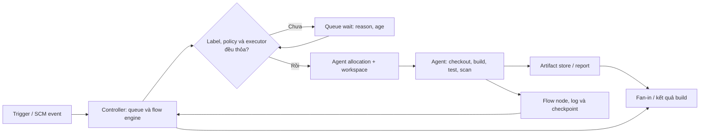

Một Pipeline nhanh là Pipeline hoàn tất nhiều công việc đúng hơn trong cùng năng lực, đồng thời phản hồi sớm cho thay đổi quan trọng. Đừng quy mọi thời gian chờ cho Jenkins: controller điều phối flow và lưu trạng thái, còn agent chạy lệnh, giữ workspace và chạm vào SCM, registry hoặc service bên ngoài. Trang này dùng cách **đo trước, tinh chỉnh sau** để giảm latency mà không làm mất evidence, giảm recovery hoặc nới quyền truy cập.

<Callout type="info" title="Phạm vi, phiên bản và an toàn">
  Các ví dụ giả định Jenkins LTS, Pipeline: Groovy và Pipeline: Declarative tương thích với LTS đó, cùng agent Linux có `sh`. `lock` cần Lockable Resources Plugin; throttling và Artifact Manager là khả năng plugin/cấu hình có thể khác giữa các instance. Xác nhận Pipeline Syntax, Global Variable Reference và phiên bản plugin trên controller sandbox trước khi chuẩn hóa Jenkinsfile. Không benchmark production, không đưa secret, URL nội bộ, metrics export hay Console Output vào tài liệu/chia sẻ công khai.
</Callout>

## Mục lục

- [Mục tiêu và ngôn ngữ đo](#mục-tiêu-và-ngôn-ngữ-đo)
  - [Throughput không phải latency](#throughput-không-phải-latency)
  - [Baseline trước mọi thay đổi](#baseline-trước-mọi-thay-đổi)
- [Đường đi của một Pipeline](#đường-đi-của-một-pipeline)
  - [Controller, agent và critical path](#controller-agent-và-critical-path)
  - [Queue, executor và allocation](#queue-executor-và-allocation)
- [Chi phí flow graph, CPS và durability](#chi-phí-flow-graph-cps-và-durability)
  - [Giữ Groovy nhỏ và dữ liệu tuần tự hóa nhỏ](#giữ-groovy-nhỏ-và-dữ-liệu-tuần-tự-hóa-nhỏ)
  - [`@NonCPS` là ranh giới, không phải tăng tốc miễn phí](#noncps-là-ranh-giới-không-phải-tăng-tốc-miễn-phí)
  - [Chọn durability theo recovery objective](#chọn-durability-theo-recovery-objective)
- [Rút ngắn critical path với stage và agent](#rút-ngắn-critical-path-với-stage-và-agent)
  - [Declarative và Scripted: semantics cần biết](#declarative-và-scripted-semantics-cần-biết)
  - [Parallel, matrix và `failFast`](#parallel-matrix-và-failfast)
  - [Timeout, retry và credentials không phải nút chỉnh tốc độ](#timeout-retry-và-credentials-không-phải-nút-chỉnh-tốc-độ)
- [Điều tiết concurrency và tài nguyên dùng chung](#điều-tiết-concurrency-và-tài-nguyên-dùng-chung)
  - [Throttle theo pool, không theo cảm tính](#throttle-theo-pool-không-theo-cảm-tính)
  - [Lock ngắn, timeout rõ, cleanup idempotent](#lock-ngắn-timeout-rõ-cleanup-idempotent)
- [Dữ liệu, workspace, log và scan](#dữ-liệu-workspace-log-và-scan)
  - [`stash`, `archiveArtifacts` và Artifact Manager](#stash-archiveartifacts-và-artifact-manager)
  - [Cleanup, cache và retention](#cleanup-cache-và-retention)
  - [Log, fingerprint và security scan](#log-fingerprint-và-security-scan)
- [Vòng lặp tuning an toàn](#vòng-lặp-tuning-an-toàn)
  - [Giả thuyết, thay đổi nhỏ và rollback](#giả-thuyết-thay-đổi-nhỏ-và-rollback)
  - [Query minh họa và cách đọc](#query-minh-họa-và-cách-đọc)
- [Jenkinsfile mẫu: tối ưu có kiểm soát](#jenkinsfile-mẫu-tối-ưu-có-kiểm-soát)
- [Lab sandbox: queue và fan-out mock](#lab-sandbox-queue-và-fan-out-mock)
  - [Chuẩn bị và chạy](#chuẩn-bị-và-chạy)
  - [Kết quả mong đợi và cleanup](#kết-quả-mong-đợi-và-cleanup)
- [Troubleshooting](#troubleshooting)
- [Checklist trước khi áp dụng](#checklist-trước-khi-áp-dụng)
- [Nguồn Jenkins chính thức](#nguồn-jenkins-chính-thức)
- [Đọc tiếp](#đọc-tiếp)

## Mục tiêu và ngôn ngữ đo

### Throughput không phải latency

**Throughput** là số build hoặc revision hoàn tất trong một khoảng thời gian. **Latency** là thời gian một build cụ thể phải chờ và chạy. Một thay đổi tăng throughput có thể vẫn làm p95 latency xấu đi nếu nó tạo tranh chấp CPU, disk hoặc một dịch vụ test dùng chung.

Tách thời gian của build thành các phần có thể hành động:

| Thành phần | Câu hỏi cần trả lời | Nơi thường là bottleneck |
| --- | --- | --- |
| Queue wait | Vì sao build chưa nhận được executor? | Label không khớp, agent offline, throttle, lock, quota provisioner. |
| Agent allocation | Mất bao lâu để cấp pod/VM hoặc workspace? | Cloud quota, image pull, launcher, disk/network agent. |
| Stage latency | Stage nào nằm trên critical path và chậm đi? | Test, checkout, upload artifact, scan hoặc service ngoài. |
| Controller overhead | Flow/UI/queue có chậm khi workload tăng không? | CPS, flow graph, log, plugin, JVM hay `JENKINS_HOME` I/O. |
| Agent resource | Lệnh có thực sự chạy nhanh khi concurrency tăng? | CPU, RAM/swap, disk/inode/I/O, network, registry hoặc license. |

**Critical path** là chuỗi chặng quyết định lúc build hoàn tất. Một `lint` dài 20 giây nằm song song với test 15 phút không làm build ngắn hơn khi giảm xuống 5 giây; test 15 phút mới là ứng viên ưu tiên. Ngược lại, một stage tuần tự chỉ để chờ `input` mà vẫn giữ agent có thể làm queue của mọi build khác dài hơn dù nó không nằm trong lệnh test.

### Baseline trước mọi thay đổi

Chọn một cửa sổ đại diện: phân nhóm theo job class, pool label, cache warm/cold và giờ cao điểm. Ghi core Jenkins LTS, Java, image agent, plugin và cấu hình durability đang dùng. Không trộn nightly nặng với pull request nhỏ rồi lấy trung bình để kết luận.

Baseline tối thiểu cần có:

- **Throughput:** số build hoàn tất theo giờ, kết quả và số build bị hủy/timeout.
- **Queue/executor:** queue wait p50/p95, lý do chờ, tuổi item, `busy / online` theo **từng** pool label.
- **Pipeline:** wall-clock time p50/p95, latency từng stage, fan-out và tỉ lệ retry/failure.
- **Controller:** CPU, JVM heap/GC, threads, HTTP/UI latency và bytes/inodes/I/O của `JENKINS_HOME`.
- **Agent:** CPU, RAM/swap/OOM, disk/inodes/I/O wait, workspace/cache size, network/SCM/registry latency.

Metrics cho biết tín hiệu tổng quát; đối chiếu timestamp của chúng với Build Queue, node và log của một vài build đại diện mới cho biết nguyên nhân. Hãy tham khảo [Monitoring & Metrics](/docs/administration/monitoring) để thiết kế dashboard, [Logs & Diagnostics](/docs/administration/logs) để thu thập evidence đúng quyền, và [Hiệu năng Jenkins](/docs/administration/performance) cho tuning mức controller/agent.

## Đường đi của một Pipeline

### Controller, agent và critical path

Controller nhận trigger, xếp queue, diễn giải Pipeline, lưu flow state và phục vụ UI/API. Agent nhận allocation rồi chạy `checkout`, compiler, test, scan và upload từ workspace. Không chuyển vòng lặp xử lý dữ liệu lớn về Groovy trên controller chỉ vì lệnh có thể viết trong Jenkinsfile.



Sơ đồ mô tả control path, không có nghĩa source hay artifact luôn đi qua controller. Với Artifact Manager được cấu hình, agent có thể truyền artifact trực tiếp tới storage đích; controller vẫn giữ metadata và điều phối. Sơ đồ Mermaid này được dự án cấu hình để render.

### Queue, executor và allocation

Queue wait xảy ra **trước** khi stage có executor và workspace. Vì vậy một build chờ `linux && docker` không thể được chữa bằng dọn workspace của một agent `windows` đang rảnh. Đọc nguyên văn lý do queue, expression label, trạng thái agent và policy concurrency trước khi sửa Jenkinsfile.

Executor là slot scheduler, không phải CPU core hay dung lượng RAM. Tăng từ một lên bốn executors trên agent chạy browser test có thể tăng throughput khi host còn headroom, nhưng cũng có thể tạo swap, OOM, I/O wait và runtime p95 dài hơn. Năng lực đúng pool và cách đọc queue/executor được trình bày tại [Labels & Executors](/docs/agents/labels-executors) và [Chọn agent cho Pipeline](/docs/pipelines/agents).

`agent none` ở cấp Declarative Pipeline giúp không giữ executor xuyên qua điều kiện, approval hoặc điều phối thuần túy. Mỗi stage cần chạy lệnh phải xin agent riêng; hệ quả là stage sau có thể nhận workspace khác. Chuyển output qua artifact store hoặc `stash` có giới hạn, thay vì dựa vào filesystem ngầm định.

## Chi phí flow graph, CPS và durability

Pipeline engine ghi **flow graph** gồm node cho stage, step, block, nhánh song song và điểm resume. Flow graph làm stage UI, log navigation và recovery khả thi. Nhưng hàng nghìn step nhỏ, branch quá rộng hay log lớn đều tạo thêm metadata, serialization và I/O trên controller.

CPS (Continuation Passing Style) là cơ chế Pipeline Groovy dùng để lưu continuation — trạng thái cần để Pipeline có thể tiếp tục sau gián đoạn. Một `sh` dài trên agent thường là một step phù hợp; thay nó bằng vòng lặp Groovy gọi hàng nghìn `sh 'echo ...'` làm flow graph, checkpoint và load controller tăng đáng kể. Tối ưu trước hết là giảm **độ lặt vặt có thể quan sát vô ích**, không phải gộp mọi thứ vào một shell script mất khả năng chẩn đoán.

### Giữ Groovy nhỏ và dữ liệu tuần tự hóa nhỏ

Không giữ response API lớn, cây JSON đầy đủ, file binary, stream, client SDK hay object plugin phức tạp trong biến Pipeline sống qua một step có thể suspend. Các object này có thể không serializable, làm CPS serialization chậm hoặc thất bại khi checkpoint/restart.

Thay vào đó:

- Để tool trên agent xử lý file lớn; xuất ra summary nhỏ, exit code hoặc report đã được lọc.
- Giữ trong Pipeline các kiểu đơn giản như `String`, số, boolean, map/list nhỏ với dữ liệu nguyên thủy.
- Lưu output cần chuyển agent vào artifact store hoặc `stash` nhỏ, không nhét base64/binary vào biến Groovy.
- Gom các thao tác rất nhỏ liên tiếp thành một command/script trên agent **khi** điều đó không làm mất boundary log, timeout hay gate cần quan sát.

Ví dụ không nên làm:

```groovy
// Tránh: tạo rất nhiều flow nodes và giữ dữ liệu lớn trong CPS state.
def allRows = readJSON(file: 'large-report.json')
allRows.each { row ->
  sh "echo ${row.id}"
}
```

Thay bằng xử lý stream/file trên agent và chỉ trả summary đã kiểm soát. Không nội suy dữ liệu không tin cậy vào shell; truyền qua file input được validate hoặc dùng quoting phù hợp.

```groovy
sh '''#!/usr/bin/env sh
  set -eu
  # Ví dụ mock: chỉ tạo summary; tool thật phải validate input riêng.
  awk 'END { print "records=" NR }' large-report.json > report-summary.txt
  test -s report-summary.txt
'''
```

### `@NonCPS` là ranh giới, không phải tăng tốc miễn phí

`@NonCPS` có thể dùng cho helper Groovy thuần túy, ngắn và chạy nhanh, ví dụ chuyển đổi một list/map nhỏ thành chuỗi. Hàm đó không được checkpoint giữa chừng và không được gọi Pipeline steps như `sh`, `echo`, `checkout`, `sleep`, `stash` hoặc `node`. Nó cũng không nên trả về object không serializable để CPS code giữ qua một step.

```groovy
@NonCPS
def summarize(List values) {
  return "count=${values.size()}"
}

node('linux') {
  stage('Summary') {
    def message = summarize(['unit', 'contract'])
    echo message
  }
}
```

Đừng dùng `@NonCPS` để bọc I/O, network, tính toán lâu hay plugin API với hy vọng Pipeline nhanh hơn. Một hàm dài không checkpoint có thể làm controller kém phản hồi và không resume tại giữa hàm khi restart. CPS/non-CPS method mismatch còn có thể tạo warning hoặc hành vi khó đoán khi closure CPS đi vào API Groovy không mong đợi. Giữ helper thuần, deterministic, nhỏ; chuyển tính toán nặng sang process agent hoặc Shared Library đã được kiểm thử.

### Chọn durability theo recovery objective

Durability quyết định mức độ/tần suất Pipeline persist tiến trình để có cơ hội tiếp tục sau khi controller bị gián đoạn. Nhiều checkpoint hơn thường tăng I/O và metadata controller; ít hơn giảm overhead nhưng có thể mất nhiều tiến trình gần nhất hoặc khó recovery hơn sau shutdown không sạch.

Chọn preset durability theo **recovery objective** của job, không theo mong muốn “nhanh nhất”: Pipeline phát hành dài, có approval hay side effect cần evidence/recovery đáng tin hơn Pipeline kiểm tra ngắn, tái chạy vô hại. Tên preset, phạm vi global/job và behavior chính xác phụ thuộc Pipeline: Job/plugin version. Xác minh trên Jenkins LTS đang dùng, chụp lại cấu hình cũ, chạy restart simulation **chỉ trong sandbox**, rồi mới cân nhắc thay đổi.

<Callout type="warn" title="Không hy sinh recovery để lấy vài mili giây chưa đo">
  Durability thấp hơn không sửa queue do thiếu agent, cũng không thay backup của `JENKINS_HOME`. Không đổi setting toàn cục để cứu một job; rollback ngay nếu test sandbox cho thấy resume, log hoặc kết quả không còn đáp ứng recovery objective.
</Callout>

## Rút ngắn critical path với stage và agent

### Declarative và Scripted: semantics cần biết

Declarative mô tả cấu trúc `pipeline { stages { ... } }` có validator; mỗi stage có `steps`, `parallel`, `matrix` hoặc sequential `stages` theo giới hạn cú pháp của plugin. Scripted là Groovy linh hoạt hơn, thường cấp agent bằng `node('label')`. Cả hai đều chạy trên Pipeline engine CPS và đều chịu queue/executor, flow graph, durability và plugin version.

| Ý định hiệu năng | Declarative | Scripted | Caveat |
| --- | --- | --- | --- |
| Không giữ agent ngoài phần cần lệnh | `agent none`, rồi stage `agent` | Thu hẹp block `node` | Workspace có thể khác giữa stage/block. |
| Fan-out kiểm tra độc lập | `parallel { stage(...) { ... } }` hoặc `matrix` | `parallel unit: { ... }, contract: { ... }` | Cần capacity, isolation và fan-in rõ. |
| Hủy sibling khi lỗi gate | `failFast true` hoặc `parallelsAlwaysFailFast()` | `parallel failFast: true, ...` | Không che log/failure gốc. |
| Logic động | `script {}` nhỏ, hoặc Shared Library | Groovy có kiểm soát | Không biến controller thành data processor. |

Đặt stage theo outcome cần quan sát như `Checkout`, `Unit test`, `Package`, `Publish report`; không tạo stage cho từng `echo`, cũng không dồn toàn bộ CI vào `Build`. Stage boundary tốt giúp đo latency, đặt timeout, cấp agent và tìm critical path mà không cần tăng parallel vô hạn. Cú pháp nền tảng nằm tại [Declarative Pipeline](/docs/pipelines/declarative), [Thiết kế Stages & Steps](/docs/pipelines/stages-steps) và [Tổng quan Pipeline](/docs/pipelines/overview).

### Parallel, matrix và `failFast`

Song song hóa chỉ rút ngắn wall-clock khi nhánh độc lập về dữ liệu, tài nguyên và chất lượng gate, đồng thời có executor/CPU/RAM/I/O/network tương ứng. Một matrix 12 cells trên pool chỉ có hai executor chủ yếu tạo queue nội bộ; nó không tự tạo capacity.

Chọn `parallel` khi các loại công việc khác nhau, chẳng hạn lint/unit/contract. Chọn `matrix` khi cùng một test chạy theo tổ hợp axis có giới hạn như OS và JDK. Tính tổng fan-out của **mọi** job cùng dùng pool, không chỉ số branch của Jenkinsfile đang sửa. Xem chi tiết tại [Parallel Stages có kiểm soát](/docs/pipelines/parallel) và [Matrix Pipeline](/docs/pipelines/matrix).

`failFast` hủy các sibling còn chạy sau khi một nhánh trong fan-out fail. Nó giảm thời gian giữ agent và feedback latency khi một gate bắt buộc đã thất bại. Nhánh lỗi gốc vẫn là `FAILURE`; sibling bị hủy có thể là `ABORTED`. Không dùng `failFast` để che lỗi, và không giả định process bên ngoài dừng ngay lập tức. Mỗi branch cần timeout, cleanup idempotent và report/log riêng.

### Timeout, retry và credentials không phải nút chỉnh tốc độ

`timeout` giới hạn thời gian chờ nhằm giải phóng capacity bị treo; đặt nó tại step, branch hoặc stage có lý do cụ thể. Nó không làm test vốn chạy 20 phút nhanh hơn. `retry(n)` chỉ dành cho thao tác idempotent có evidence là lỗi tạm thời và phải có số lần hữu hạn. Không bọc test gate, scan bảo mật, migration, publish hay deploy bằng retry mù để dashboard xanh.

Khi dùng `credentials`, cấp secret trong scope nhỏ nhất cho step thật sự cần nó. Không in environment, command line có token hay payload lên log. Không kéo credential vào stage chỉ để checkout hoặc `sleep`, và không cấp credential release cho branch PR/fork hay agent không tin cậy để tăng tốc. Semantics của retry, timeout, interruption và result được giải thích tại [Xử lý lỗi và Retry](/docs/pipelines/error-handling); parameters/condition cần được kiểm soát tại [Environment & Parameters](/docs/pipelines/environment-parameters).

## Điều tiết concurrency và tài nguyên dùng chung

### Throttle theo pool, không theo cảm tính

Khi demand lớn hơn capacity bền vững, throttle là policy bảo vệ latency và độ tin cậy, không phải thất bại. Có thể dùng `disableConcurrentBuilds()` cho cùng một job ghi vào trạng thái không thể chia sẻ, hoặc Throttle Concurrent Builds Plugin để giới hạn theo job/category/node nếu plugin/version đã được phê duyệt.

Đặt giới hạn dựa trên baseline của pool: queue p95, runtime p95, CPU, RAM, I/O, network, license và service đích. Ví dụ, giới hạn hai Docker build đồng thời vì Docker daemon và disk là nút thắt đã đo, không phải vì agent có bốn executors. Khi throttle tăng queue, phân biệt policy này với controller failure; ghi owner, lý do, threshold và tiêu chí xem xét lại.

Không tăng parallel hay executor để “vượt” throttle. Nếu workload quan trọng bị starve, tách pool/label, ưu tiên hợp lý hoặc thêm agent sau sandbox load test. Thực hành sizing và queue nằm tại [Labels & Executors](/docs/agents/labels-executors).

### Lock ngắn, timeout rõ, cleanup idempotent

Lock bảo vệ resource singleton như test device, license hoặc môi trường integration không thể nhân bản. Nó không làm resource nhanh hơn; lock quá rộng biến checkout, download dependency và scan thành thời gian chờ tuần tự không cần thiết. Lock chỉ bao đoạn sử dụng tài nguyên chung, có owner và timeout chờ.

```groovy
// Cần Lockable Resources Plugin và resource sandbox đã được quản trị.
timeout(time: 5, unit: 'MINUTES') {
  lock(resource: 'sandbox-integration-db') {
    sh './run-integration-check --target=sandbox'
  }
}
```

Đặt `timeout` ngoài `lock` khi cần giới hạn cả thời gian chờ resource. Cleanup trong `post { cleanup { ... } }` hoặc `finally` chỉ được xóa process/file/namespace do build đó sở hữu, và phải chạy lặp lại an toàn sau success, failure hoặc interruption. Không lock toàn bộ Pipeline, không cleanup path tùy ý và không dùng lock để biến thao tác không idempotent thành an toàn.

## Dữ liệu, workspace, log và scan

### `stash`, `archiveArtifacts` và Artifact Manager

Ba cơ chế có mục đích khác nhau. Chọn sai cơ chế có thể đẩy file lớn qua controller, làm `JENKINS_HOME` đầy hoặc khiến Pipeline phụ thuộc workspace không tồn tại.

| Cơ chế | Dùng khi | Tác động hiệu năng và ràng buộc |
| --- | --- | --- |
| `stash` / `unstash` | Chuyển tập file **nhỏ** giữa stage/agent của cùng một run, ví dụ manifest hoặc binary lab. | Có nén/truyền/lưu tạm; không phải artifact store cho archive lớn. Giới hạn include, đặt tên rõ, đo trước khi dùng với file lớn. |
| `archiveArtifacts` | Giữ artifact/report như output của build để tải/trace theo retention. | Có thể tạo I/O và storage pressure; chỉ archive pattern cần thiết, exclude secret/cache và đặt build retention. |
| Artifact Manager | Storage backend cho artifact tùy plugin/cấu hình, thường object storage. | Có thể giảm tải controller/`JENKINS_HOME` và cho agent upload trực tiếp, nhưng vẫn có latency, egress, credential, lifecycle và version assumptions cần đo. |

Ví dụ sau chỉ chuyển một file text nhỏ giữa hai stage. Nó không archive dependency cache, không dùng credential và không giả định hai stages có chung workspace.

```groovy
stage('Create small handoff') {
  steps {
    sh 'printf "revision=%s\\n" "$BUILD_TAG" > handoff.txt'
    stash name: 'handoff', includes: 'handoff.txt', useDefaultExcludes: true
  }
}

stage('Consume small handoff') {
  steps {
    deleteDir()
    unstash 'handoff'
    test -s handoff.txt
  }
}
```

Archive report sau khi nó được tạo và trước cleanup; không archive toàn bộ workspace bằng `**/*` theo mặc định. Với artifact lớn hoặc cần lưu/tải lâu, dùng repository/object store đã được đội vận hành phê duyệt. Xác minh quyền ghi tối thiểu, encryption, retention/lifecycle, checksum/provenance và behavior của Artifact Manager plugin trên sandbox. Không coi storage ngoài là lý do bỏ audit hoặc nới quyền bucket.

### Cleanup, cache và retention

Workspace là local state của agent. Dynamic agent có thể mất workspace khi pod/VM kết thúc; agent tĩnh có thể giữ file cũ. Cleanup làm disk/inode và checkout ổn định hơn, nhưng không được xóa output chưa archive hoặc workspace của build khác.

- Chỉ dùng `deleteDir()` trong workspace Jenkins đã cấp và sau khi report/artifact cần giữ được publish.
- Tách cache immutable/read-only theo lockfile, OS và toolchain; cache mutable cần single-writer/ownership để tránh corruption hay cache poisoning.
- Đặt quota, TTL và retention cho workspace, cache, build history, artifact và log theo nhu cầu audit/restore.
- Không để source PR không tin cậy đọc/ghi cache hoặc workspace của release. Cache nhanh hơn không được đánh đổi boundary tin cậy.

### Log, fingerprint và security scan

Console Output quá lớn làm tăng I/O, network, storage và UI render, đặc biệt khi nhiều branch song song. Giữ marker có thể hành động như revision, stage, tool version, exit code và summary. Giảm progress lặp vô ích ở tool; không tắt log/report cần cho audit, điều tra hoặc quality gate.

Fingerprint chỉ nên dùng cho artifact cần truy vết. Fingerprint toàn bộ tree, dependency cache hay output lớn có thể tạo scan/metadata cost đáng kể trên controller. Security, license hoặc quality scan cũng cần nằm trên critical path theo policy: đo thời gian download database, cache hit/miss, upload report và service latency trước khi bỏ qua scan hoặc chạy nó vô hạn song song. Scan bắt buộc không được chuyển thành “best effort” chỉ để giảm p95.

<Callout type="warn" title="Evidence và secret quan trọng hơn log ngắn">
  Không log environment, credential, request/response nhạy cảm, nguyên payload scan hay đường dẫn nội bộ. Redact và giới hạn quyền/retention cho log, report và metrics export. Khi cần chẩn đoán sâu, thu thập theo quy trình riêng ở [Logs & Diagnostics](/docs/administration/logs), không tăng global debug trên production.
</Callout>

## Vòng lặp tuning an toàn

### Giả thuyết, thay đổi nhỏ và rollback

Dùng cùng một vòng lặp cho Jenkinsfile, agent capacity, storage backend và durability:

1. **Chốt baseline.** Ghi scope, cửa sổ, version, cache state và số đo throughput, queue wait, stage latency, CPU/RAM/disk/network.
2. **Viết giả thuyết kiểm chứng được.** Ví dụ: “queue p95 của `linux && docker` tăng vì hai Docker build cạnh tranh disk; runtime stage cũng tăng khi hai executor bận.” Không viết “cần thêm executors”.
3. **Đổi đúng một biến nhỏ, đảo ngược được.** Ví dụ thêm một agent sandbox cùng label, tách stage chờ bằng `agent none`, hoặc giảm output verbose của một tool.
4. **Load test trong sandbox.** Dùng workload mock/đại diện và concurrency/cache state tương ứng. Không dùng production release hoặc customer workload làm benchmark.
5. **So sánh rồi verify hoặc rollback.** So p50/p95, throughput, error/timeout, CPU/RAM/I/O, network và recovery behavior. Rollback nếu SLI xấu đi, headroom mất, correctness/security/recovery bị ảnh hưởng; lưu lại cả giả thuyết sai.

Một cải thiện chỉ được chấp nhận khi output, quality gate, credential boundary và retention vẫn đúng. “Nhanh hơn” nhưng bỏ scan, retry test đến khi xanh, giữ secret rộng hơn, hoặc hạ durability mà không chứng minh recovery là regression, không phải tuning.

### Query minh họa và cách đọc

Query dưới chỉ là khởi điểm cho Prometheus Metrics Plugin/exporter đã được cấu hình **trong sandbox**. Tên metric và label không phải API chung; hãy xem endpoint metrics của chính instance, đặt namespace thực tế và không công bố endpoint/dữ liệu nội bộ.

```text
# Saturation executor theo pool nếu exporter có label pool.
sum by (pool) (ci_jenkins_executors_busy)
/ clamp_min(sum by (pool) (ci_jenkins_executors_online), 1)

# Độ dài queue hiện tại theo pool, chỉ dùng khi metric/label thực sự tồn tại.
sum by (pool) (ci_jenkins_executors_queue_length)

# Throughput thành công 15 phút nếu series là counter hợp lệ.
sum(increase(ci_jenkins_builds_successful_build_count[15m]))
```

Đọc query cùng stage timing và queue reason. Saturation cao + queue p95 cao nhưng runtime ổn định là giả thuyết capacity/routing. Saturation cao + runtime/timeout/OOM tăng là dấu hiệu oversubscription: thêm concurrency có thể làm tổng latency xấu hơn. CPU controller thấp không phủ nhận `JENKINS_HOME` I/O, thread hay plugin overhead; agent CPU thấp cũng không phủ nhận registry/network/lock đang chờ.

## Jenkinsfile mẫu: tối ưu có kiểm soát

Mẫu Declarative này giới hạn Pipeline ở agent cần thiết, parallel hóa hai kiểm tra độc lập, timeout từng branch và chuyển một summary nhỏ qua `stash`. Nó không dùng credential, network, deploy, cache chung hay resource production. Cần agent Linux label `linux`; `disableConcurrentBuilds()` là policy tùy chọn khi hai run của **cùng job** không được cùng ghi dữ liệu đã biết là dùng chung.

```groovy
pipeline {
  agent none

  options {
    skipDefaultCheckout(true)
    timeout(time: 10, unit: 'MINUTES')
    disableConcurrentBuilds()
  }

  stages {
    stage('Checkout once') {
      agent { label 'linux' }
      steps {
        checkout scm
        sh '''#!/usr/bin/env sh
          set -eu
          test -f Jenkinsfile
          printf 'build=%s\\n' "$BUILD_NUMBER" > build-summary.txt
        '''
        stash name: 'build-summary', includes: 'build-summary.txt', useDefaultExcludes: true
      }
      post {
        cleanup {
          deleteDir()
        }
      }
    }

    stage('Independent checks') {
      failFast true
      parallel {
        stage('Unit mock') {
          agent { label 'linux' }
          options { timeout(time: 2, unit: 'MINUTES') }
          steps {
            deleteDir()
            unstash 'build-summary'
            sh 'grep -q "^build=" build-summary.txt && echo "unit mock: PASS"'
          }
          post {
            cleanup {
              deleteDir()
            }
          }
        }

        stage('Lint mock') {
          agent { label 'linux' }
          options { timeout(time: 2, unit: 'MINUTES') }
          steps {
            deleteDir()
            unstash 'build-summary'
            sh 'test -s build-summary.txt && echo "lint mock: PASS"'
          }
          post {
            cleanup {
              deleteDir()
            }
          }
        }
      }
    }

    stage('Archive small evidence') {
      agent { label 'linux' }
      steps {
        deleteDir()
        unstash 'build-summary'
        archiveArtifacts artifacts: 'build-summary.txt', fingerprint: false
      }
      post {
        cleanup {
          deleteDir()
        }
      }
    }
  }

  post {
    always {
      echo "Build result: ${currentBuild.currentResult}"
    }
  }
}
```

Mỗi branch có thể nhận agent/workspace khác, nên ví dụ dọn workspace Jenkins đã cấp rồi mới `unstash`; không tìm `build-summary.txt` trước bước chuyển dữ liệu. Mỗi stage có `agent` cũng có `post { cleanup { deleteDir() } }`, nên cleanup chạy trong workspace của chính stage thay vì `post` cấp Pipeline — nơi không có `FilePath` khi top-level là `agent none`. `disableConcurrentBuilds()` không thay thế lock cho database/license dùng chung giữa nhiều job. Nếu cần lock, bọc chính xác step chạm resource như phần trên và xác minh plugin/version.

## Lab sandbox: queue và fan-out mock

Lab chứng minh mối quan hệ giữa capacity, queue và fan-out mà không gọi repository, secret, database hay deployment. Cần Jenkins sandbox, agent Linux tách controller có label `linux` và `perf-lab`, một executor, cùng quyền tạo Pipeline job. Không chạy trên built-in node production.

### Chuẩn bị và chạy

1. Ghi baseline: số executor, agent online, queue trống, CPU/RAM/disk/inodes agent và controller. Tạo Pipeline job tạm tên `pipeline-performance-lab` với Jenkinsfile dưới đây.
2. Trigger build `#1`. Khi log hiện `holding executor`, trigger build `#2` ngay. Không thay executor/label trong lúc quan sát.
3. Ghi queue wait, lý do queue của `#2`, busy/online executor, stage latency và CPU/RAM/disk. Workload `sleep` phải gần như không tăng CPU; đây là cách phân biệt thiếu slot với thiếu CPU.
4. Chỉ trên sandbox, thêm một executor **hoặc** một agent tương đương cùng label, lặp lại một lần rồi so các số với baseline. Trả cấu hình về trước khi kết thúc lab.

```groovy
pipeline {
  agent none

  stages {
    stage('Mock fan-out') {
      failFast true
      parallel {
        stage('Hold executor') {
          agent { label 'linux && perf-lab' }
          options { timeout(time: 90, unit: 'SECONDS') }
          steps {
            sh 'echo "holding executor"; sleep 45; echo "hold: PASS"'
          }
          post {
            cleanup {
              deleteDir()
            }
          }
        }
        stage('Small independent check') {
          agent { label 'linux && perf-lab' }
          options { timeout(time: 90, unit: 'SECONDS') }
          steps {
            sh 'echo "small check: PASS"'
          }
          post {
            cleanup {
              deleteDir()
            }
          }
        }
      }
    }
  }

  post {
    always {
      echo "Lab result: ${currentBuild.currentResult}"
    }
  }
}
```

### Kết quả mong đợi và cleanup

Với đúng một executor, `Hold executor` giữ slot khoảng 45 giây. `Small independent check` và/hoặc build `#2` phải chờ queue; thứ tự chính xác phụ thuộc scheduler nhưng không có hai allocation cùng chạy trên một slot. CPU và disk hầu như giữ baseline vì `sleep` không mô phỏng workload nặng. Đây chứng minh queue có thể là capacity, **không** chứng minh nên tăng executors cho workload thật.

Sau khi thêm slot hợp lệ trên sandbox, hai allocation có thể chồng thời gian và throughput cải thiện. Mỗi branch dọn đúng workspace do stage agent của nó cấp trong `post { cleanup }`, kể cả khi nhánh sibling bị `failFast` hủy; không có cleanup cấp Pipeline vì Pipeline dùng `agent none`. Chỉ giữ thay đổi nếu runtime, error rate, CPU/RAM/I/O/network và queue p95 đều đạt tiêu chí đặt trước. Cleanup vận hành: đợi lab kết thúc hoặc abort **chỉ build lab**, xóa job `pipeline-performance-lab`, trả executor/label về giá trị đã ghi, kiểm tra queue không còn item lab và không export Console Output/metrics nội bộ.

<Callout type="idea" title="Mở rộng lab theo một biến">
  Sau `sleep`, thay một branch bằng test nhỏ trên repository mock đã được phép hoặc upload artifact giả. Mỗi lần chỉ đổi concurrency, cache warm/cold hoặc kích thước artifact. Giữ timeout, retention và cleanup để lab không chiếm pool hoặc để lại dữ liệu vô hạn.
</Callout>

## Troubleshooting

| Triệu chứng | Bằng chứng cần phân biệt | Hành động an toàn |
| --- | --- | --- |
| Queue p95 tăng, runtime ổn định | Queue reason, label, agent online, executor bận, lock/throttle/provisioning | Khôi phục capability đúng pool hoặc thử thêm một slot trong sandbox; không tăng toàn hệ thống. |
| Queue ổn định, stage runtime tăng | Stage log, CPU/RAM/swap, disk/inode/I/O, SCM/registry/service latency | Khoanh stage/agent/dependency, giảm contention và test một thay đổi nhỏ. |
| Controller chậm khi Pipeline fan-out | Heap/GC, threads, `JENKINS_HOME` I/O, số flow node/log, plugin/version | Giảm step/branch lặt vặt, xem durability/plugin, đo sandbox; không chạy build trên controller. |
| `NotSerializableException` hoặc resume lỗi | Object lớn/non-serializable giữ qua Pipeline step, CPS warning | Giữ state primitive nhỏ, xử lý dữ liệu trên agent; dùng `@NonCPS` chỉ cho helper thuần và ngắn. |
| `stash`/archive chậm hoặc controller disk tăng | Kích thước file, I/O, artifact manager route, retention | Giới hạn includes, dùng artifact backend đã phê duyệt và kiểm tra lifecycle/permission. |
| Thêm executors làm build chậm/lỗi | Runtime p95, OOM/swap, I/O wait, registry/license throttling | Rollback concurrency, tách pool hoặc thêm agent sau khi xác nhận headroom. |
| `failFast` để lại tài nguyên | Log interruption, cleanup scope, resource ownership | Đặt timeout/cleanup idempotent, lock scope hẹp và TTL cho resource sandbox ngoài Jenkins. |
| Scan/log giảm làm thiếu evidence | Quality gate, report, audit/incident requirements | Khôi phục evidence cần thiết; tối ưu verbosity, cache hay storage thay vì bỏ control. |

## Checklist trước khi áp dụng

- [ ] Baseline ghi throughput, queue wait, stage latency, CPU/RAM/disk/network, controller/agent scope, cache state và Jenkins/Java/plugin versions.
- [ ] Tôi xác định critical path và queue reason trước khi đề xuất parallel, executor, durability hay plugin change.
- [ ] Controller chỉ điều phối/lưu flow; build, xử lý dữ liệu lớn và tool nặng chạy trên agent tách biệt.
- [ ] Jenkinsfile tránh loop CPS tạo hàng nghìn step, giữ object serializable nhỏ và dùng `@NonCPS` đúng ranh giới.
- [ ] Durability được chọn theo recovery objective, đã thử restart sandbox và có cấu hình rollback.
- [ ] Parallel/matrix chỉ chạy nhánh độc lập, có capacity thật, timeout, report, isolation workspace/port/cache và `failFast` policy rõ ràng.
- [ ] Executor, throttle và lock được sizing theo pool/tài nguyên đích; không tăng concurrency vô hạn hoặc vượt policy.
- [ ] Retry chỉ bao thao tác tạm thời/idempotent có giới hạn; timeout/abort không bị nuốt; credential có scope tối thiểu và không lộ log.
- [ ] `stash` nhỏ và theo run; artifact/archive/Artifact Manager có retention, quyền, lifecycle và tải I/O đã đo.
- [ ] Cleanup chỉ tác động workspace/tài nguyên của build, sau khi archive evidence; cache, log, fingerprint và scan không làm giảm correctness/security.
- [ ] Thay đổi đi qua đo → giả thuyết → một thay đổi nhỏ → load test sandbox → verify hoặc rollback; không benchmark production.

## Nguồn Jenkins chính thức

- [Pipeline scalability best practices](https://www.jenkins.io/doc/book/pipeline/pipeline-best-practices/) — CPS, large objects, controller work và console log.
- [Pipeline durability settings](https://www.jenkins.io/doc/book/pipeline/scaling-pipeline/) — durability, checkpoint và recovery trade-off.
- [Pipeline Syntax](https://www.jenkins.io/doc/book/pipeline/syntax/) — Declarative `agent`, `parallel`, `matrix`, `options`, `post` và `failFast`.
- [Using Jenkins agents](https://www.jenkins.io/doc/book/using/using-agents/) — agent, executor, workspace và controller isolation.
- [Pipeline: Basic Steps](https://www.jenkins.io/doc/pipeline/steps/workflow-basic-steps/) — `stash`, `unstash`, `timeout`, `retry`, `deleteDir` và `archiveArtifacts`.
- [Artifact Manager on S3 plugin](https://plugins.jenkins.io/artifact-manager-s3/) — ví dụ Artifact Manager backend; xác minh backend được tổ chức phê duyệt.
- [Lockable Resources plugin](https://plugins.jenkins.io/lockable-resources/) — resource locking và step `lock`.
- [Throttle Concurrent Builds plugin](https://plugins.jenkins.io/throttle-concurrents/) — giới hạn concurrent builds theo plugin/version.
- [Jenkins Monitoring](https://www.jenkins.io/doc/book/managing/monitoring/) — tín hiệu giám sát Jenkins và cách vận hành metrics.

## Đọc tiếp

<Cards>
  <Card title="Tổng quan Pipeline" href="/docs/pipelines/overview" description="Ôn flow execution, stage, step và durability." />
  <Card title="Parallel Stages" href="/docs/pipelines/parallel" description="Thiết kế fan-out, fan-in và failFast có kiểm soát." />
  <Card title="Chọn agent" href="/docs/pipelines/agents" description="Đặt agent và workspace đúng pool năng lực." />
  <Card title="Stages & Steps" href="/docs/pipelines/stages-steps" description="Tạo stage có latency và evidence dễ đọc." />
  <Card title="Xử lý lỗi" href="/docs/pipelines/error-handling" description="Dùng timeout, retry và cleanup mà không che failure." />
  <Card title="Environment & Parameters" href="/docs/pipelines/environment-parameters" description="Giữ input Pipeline có kiểm soát." />
  <Card title="Matrix" href="/docs/pipelines/matrix" description="Giới hạn fan-out theo tổ hợp test." />
  <Card title="Declarative Pipeline" href="/docs/pipelines/declarative" description="Tra semantics của agent, options và post." />
  <Card title="Hiệu năng Jenkins" href="/docs/administration/performance" description="Tuning controller, agent và capacity theo baseline." />
  <Card title="Monitoring & Metrics" href="/docs/administration/monitoring" description="Thiết kế dashboard và SLI có thể hành động." />
  <Card title="Logs & Diagnostics" href="/docs/administration/logs" description="Thu thập evidence và diagnostic an toàn." />
  <Card title="Labels & Executors" href="/docs/agents/labels-executors" description="Phân biệt queue, label, executor và capacity." />
</Cards>
