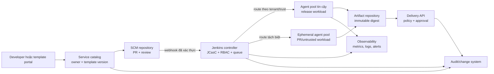
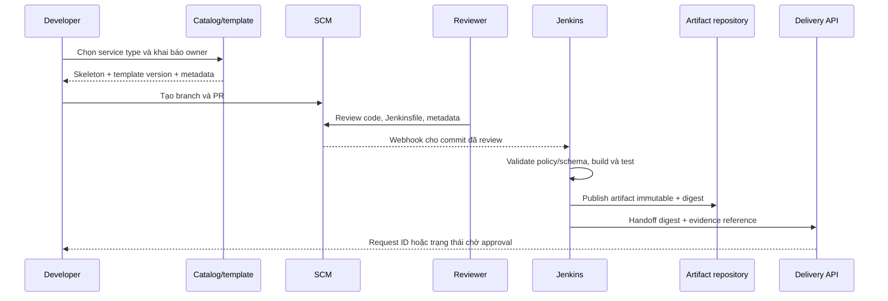

Jenkins có thể là một phần của **internal developer platform**: một sản phẩm nội bộ giúp đội giao phần mềm theo cách lặp lại, dễ tìm và an toàn hơn. Mục tiêu không phải gom mọi công cụ, chính sách hay quyết định bảo mật vào Jenkins. Mục tiêu là tạo một đường đi mặc định tốt, kết nối Jenkins với SCM, kho artifact, hệ thống triển khai và các control của tổ chức.

## Mục lục

- [Platform team vận hành như đội sản phẩm](#platform-team-vận-hành-như-đội-sản-phẩm)
  - [Personas và lời hứa dịch vụ](#personas-và-lời-hứa-dịch-vụ)
  - [Ranh giới: Jenkins không phải nơi chứa mọi policy](#ranh-giới-jenkins-không-phải-nơi-chứa-mọi-policy)
- [Golden path và service catalog](#golden-path-và-service-catalog)
  - [Paved road, golden path và các lựa chọn](#paved-road-golden-path-và-các-lựa-chọn)
  - [Catalog, template và self-service](#catalog-template-và-self-service)
  - [Versioning, phát hành và ownership](#versioning-phát-hành-và-ownership)
- [Guardrails có thể vận hành](#guardrails-có-thể-vận-hành)
  - [API boundary và mô hình quyền](#api-boundary-và-mô-hình-quyền)
  - [Secure defaults, approval, audit và exception](#secure-defaults-approval-audit-và-exception)
  - [Các giả định Jenkins và dependency](#các-giả-định-jenkins-và-dependency)
- [Reference architecture đa tenant](#reference-architecture-đa-tenant)
  - [Luồng và ranh giới thành phần](#luồng-và-ranh-giới-thành-phần)
  - [Cô lập tenant, capacity và SLO](#cô-lập-tenant-capacity-và-slo)
  - [Build, buy và plugin dependency](#build-buy-và-plugin-dependency)
- [Onboard một service qua golden path](#onboard-một-service-qua-golden-path)
  - [Workflow từ template đến handoff](#workflow-từ-template-đến-handoff)
  - [Hợp đồng template tối thiểu](#hợp-đồng-template-tối-thiểu)
- [Lab: mô phỏng catalog và pipeline local](#lab-mô-phỏng-catalog-và-pipeline-local)
  - [Chuẩn bị sandbox](#chuẩn-bị-sandbox)
  - [Tạo service mẫu và kiểm tra](#tạo-service-mẫu-và-kiểm-tra)
  - [Kết quả mong đợi và cleanup](#kết-quả-mong-đợi-và-cleanup)
- [Troubleshooting](#troubleshooting)
- [Checklist đưa golden path vào sử dụng](#checklist-đưa-golden-path-vào-sử-dụng)
- [Đo adoption và đóng feedback loop](#đo-adoption-và-đóng-feedback-loop)
- [Nguồn Jenkins chính thức](#nguồn-jenkins-chính-thức)
- [Đọc tiếp](#đọc-tiếp)

## Platform team vận hành như đội sản phẩm

Platform team cung cấp một sản phẩm cho developer, không chỉ quản trị controller hay xử lý ticket. Sản phẩm đó có người dùng, backlog, tài liệu, phiên bản, mức dịch vụ và cách đo kết quả. Ví dụ, thay vì nhận yêu cầu thủ công “hãy tạo một pipeline”, team cung cấp template đã có test, metadata ownership, luồng artifact và hướng dẫn rõ ai phê duyệt thay đổi ngoại lệ.

Product mindset bắt đầu bằng một vấn đề người dùng đo được: thời gian từ repository mới đến build xanh, số lần phải hỏi cách lấy credential, hoặc thời gian khôi phục một template lỗi. Ưu tiên cải tiến theo bằng chứng này, thay vì chỉ theo số job Jenkins đã tạo.

### Personas và lời hứa dịch vụ

| Persona                 | Việc cần hoàn tất                                 | Platform cung cấp                                              | Không hứa thay                                                |
| ----------------------- | ------------------------------------------------- | -------------------------------------------------------------- | ------------------------------------------------------------- |
| Developer               | Tạo service, chạy CI và nhận feedback nhanh.      | Template, tài liệu, pipeline chuẩn và log có liên kết runbook. | Review kiến trúc hoặc quyết định release thay đội sản phẩm.   |
| Tech lead/service owner | Chọn owner, version và cách phát hành service.    | Catalog, metadata, lifecycle template và dữ liệu adoption.     | Sở hữu chất lượng, backlog hay on-call của service.           |
| Release/operations      | Nhận artifact và bằng chứng trước khi triển khai. | Handoff có version, digest, test result và audit reference.    | Tự động cấp quyền production chỉ vì build xanh.               |
| Security/compliance     | Đặt control có thể kiểm tra và truy vết.          | Điểm tích hợp cho identity, scanner, approval và audit.        | Là chủ sở hữu duy nhất mọi rủi ro của đội sản phẩm.           |
| Platform engineer       | Phát hành capability ổn định.                     | Configuration as code, telemetry, SLO và rollback plan.        | Quyền vô hạn trên mọi tenant hoặc mọi hệ thống ngoài Jenkins. |

Mỗi capability nên có một **service owner** (chịu trách nhiệm outcome và roadmap), một **technical owner** (duy trì code/configuration), version được hỗ trợ, kênh hỗ trợ và tiêu chí deprecation. Owner của template không mặc nhiên là owner của service được tạo từ template; service mới phải khai báo owner riêng ngay trong catalog.

### Ranh giới: Jenkins không phải nơi chứa mọi policy

Jenkins điều phối build và có thể thực thi những guardrail gần pipeline, như chỉ route workload tin cậy vào agent phù hợp hoặc yêu cầu evidence trước handoff. Tuy nhiên, Jenkins không nên là policy engine duy nhất. Quyền truy cập repository thuộc SCM/identity provider; admission vào cluster thuộc nền tảng triển khai; quét artifact và retention thuộc artifact/security tooling; phê duyệt thay đổi có thể thuộc change-management system.

Tách như vậy tránh hai lỗi: copy policy vào nhiều Jenkinsfile rồi drift, hoặc trao cho controller quyền gọi mọi hệ thống để “tự động hóa”. Jenkins chỉ nhận các quyết định qua API/hợp đồng hẹp và lưu evidence hoặc reference đến hệ thống nguồn. Xem nền tảng controller–agent tại [Kiến trúc Jenkins](/docs/getting-started/architecture) và cách Pipeline-as-Code được review tại [Tổng quan Jenkins Pipeline](/docs/pipelines/overview).

<Callout type="warn" title="Không biến parameter thành quyền">
  Một parameter như `TARGET=production` chỉ là input. Quyền triển khai phải được kiểm tra độc lập ở hệ thống đích, theo identity, môi trường, artifact và approval phù hợp. Không dùng parameter, tên branch hay masking secret làm security boundary.
</Callout>

## Golden path và service catalog

### Paved road, golden path và các lựa chọn

**Paved road** là năng lực đã được platform làm sẵn và hỗ trợ, chẳng hạn agent Linux chuẩn, kho artifact chuẩn hay Jenkinsfile linter. **Golden path** là luồng khuyến nghị kết hợp các năng lực đó cho một use case cụ thể: service HTTP mới dùng template, chạy test, tạo artifact có provenance và handoff sang delivery system.

Golden path cần nhanh hơn đường tự làm, không phải bắt buộc mọi service giống nhau. Nó nêu rõ điều gì là mặc định, điều gì có thể cấu hình và điểm nào cần exception. Một service legacy có thể đi paved road riêng; đừng ép nó giả làm service mới chỉ để dashboard đẹp.

| Loại quyết định | Golden default                                         | Lựa chọn có kiểm soát                                | Khi cần exception                                       |
| --------------- | ------------------------------------------------------ | ---------------------------------------------------- | ------------------------------------------------------- |
| CI              | `Jenkinsfile` từ SCM, stage test và artifact metadata. | Toolchain/agent label được catalog cho phép.         | Build cần phần cứng hay license chuyên biệt.            |
| Artifact        | Version bất biến và digest được ghi ở handoff.         | Kho artifact theo loại package.                      | Registry bắt buộc của đối tác.                          |
| Deploy handoff  | Gửi manifest/reference sang delivery API.              | Môi trường non-production tự phục vụ trong boundary. | Production cần change record hoặc approver ngoài luồng. |
| Observability   | Log build, queue/capacity và outcome được đo.          | Dashboard theo tenant/service.                       | Metric có dữ liệu nhạy cảm hoặc cardinality quá cao.    |

### Catalog, template và self-service

**Service catalog** là nguồn tìm kiếm và ownership cho các service/capability. Một entry tối thiểu gồm tên service, repository, team owner, tier, lifecycle, template version, kênh hỗ trợ và liên kết tới runbook. Catalog có thể nằm ở một portal hoặc repository metadata; Jenkins không cần là UI catalog.

**Template** là contract được version hóa, không chỉ là bộ file khởi tạo. Nó có thể tạo skeleton repository, `Jenkinsfile`, file metadata, test smoke và cấu hình handoff. **Self-service** nghĩa là developer có thể yêu cầu hoặc tạo service qua giao diện/API đã định nghĩa, nhận kết quả lặp lại mà không cần quyền quản trị Jenkins. Nó không có nghĩa là người dùng được chạy Groovy, tạo credential hoặc chọn URL deploy tùy ý.

Một request self-service nên kiểm tra schema metadata, tên/namespace, owner hợp lệ và template version trước khi tạo pull request. Sau khi merge, webhook/SCM discovery mới có thể tạo hoặc cập nhật job trong folder tenant. [Jenkinsfile](/docs/pipelines/jenkinsfile) là nơi phù hợp để mô tả flow build của service; [Job DSL](/docs/administration/job-dsl) chỉ phù hợp khi platform cần quản lý folder/job sinh ra bằng seed có scope hẹp.

### Versioning, phát hành và ownership

Gắn template với version bất biến, ví dụ `service-java@2.3.0`, và ghi version đó vào catalog lẫn build metadata. Sử dụng semantic versioning khi có thể: patch sửa lỗi tương thích, minor thêm khả năng tùy chọn, major thay đổi contract như tên artifact hoặc stage bắt buộc. Một template release cần changelog, migration note, owner, compatibility window và cách rollback về bản trước.

Không tự ghi đè template mới vào hàng trăm service. Hãy tạo PR nâng cấp có diff rõ, validation chạy trên branch và rollout theo cohort. Platform team chịu trách nhiệm template/release; service owner chịu trách nhiệm chấp nhận ảnh hưởng đến code và SLO của service. Khi template bị deprecate, công bố deadline, cách migrate và lối hỗ trợ thay vì âm thầm làm build thất bại.

## Guardrails có thể vận hành

Guardrail tốt có ba tính chất: thực thi được, giải thích được và có đường exception. Ví dụ, một allowlist agent label được kiểm ở template lẫn controller configuration; thông báo lỗi nêu label được phép và link runbook; request khác chuẩn được đánh giá có thời hạn. Chỉ viết “hãy an toàn” trong README không phải guardrail.

### API boundary và mô hình quyền

Đặt API boundary theo trách nhiệm. Template service có thể gọi catalog API để đăng ký metadata; Jenkins chỉ nhận webhook từ SCM và đẩy artifact reference; delivery system nhận một handoff chứa digest, môi trường được phép và reference đến evidence. Không cấp Jenkins credential có thể tạo repository, sửa RBAC và deploy production chỉ để hoàn tất một luồng tiện lợi.

| Boundary                      | Input được tin cậy                                        | Quyền tối thiểu                        | Evidence trả về                              |
| ----------------------------- | --------------------------------------------------------- | -------------------------------------- | -------------------------------------------- |
| SCM → Jenkins                 | Webhook đã xác thực, commit/PR reference.                 | Đọc repository cho job cụ thể.         | Build URL, commit SHA, test outcome.         |
| Jenkins → artifact repository | Package và metadata từ build tin cậy.                     | Ghi vào namespace của service.         | Version, checksum/digest, retention class.   |
| Jenkins → delivery system     | Artifact digest, environment allowlist, change reference. | Tạo handoff, không phải admin cluster. | Deployment request ID và trạng thái handoff. |
| Jenkins → observability       | Metrics/log đã lọc.                                       | Ghi telemetry hoặc scrape read-only.   | Dashboard/trace link, không chứa secret.     |

Áp dụng RBAC theo folder/tenant và capability: developer xem/chạy job của team; maintainer sửa job trong phạm vi; platform operator quản lý controller/plugin; security auditor đọc audit evidence. Credentials phải ở scope folder/job phù hợp và token cần đúng quyền API nhỏ nhất. Thực hành binding, masking và ranh giới của secret được trình bày ở [Credentials trong Pipeline](/docs/pipelines/credentials); input runtime được giới hạn bằng allowlist theo [Environment & Parameters](/docs/pipelines/environment-parameters).

### Secure defaults, approval, audit và exception

Secure default nên làm đường đúng là đường ngắn nhất: controller built-in node có `0` executor; agent ephemeral cho code chưa tin cậy; network/egress hạn chế; artifact immutable; credentials không xuất hiện trong repository; environment production không phải default. Approval đặt tại ranh giới rủi ro, chẳng hạn delivery system kiểm tra artifact digest và change record trước production, thay vì để một `input` step chung chung cấp quyền.

Mọi thay đổi template, JCasC, Job DSL, plugin và exception cần có PR/review, actor, thời điểm, phiên bản trước/sau và kết quả validation. Audit trail có thể nối SCM commit, build URL, artifact digest và change/request ID. Không log token, nội dung secret hoặc dữ liệu khách hàng vào console chỉ để “có audit”.

Exception process tối thiểu gồm: mô tả nhu cầu, owner/risk owner, phạm vi tenant/service, control bù trừ, approver, ngày hết hạn và review định kỳ. Platform phải từ chối hoặc tự expire exception không còn lý do. Sau vài exception giống nhau, đánh giá xem golden path đang thiếu capability nào.

<Callout type="idea" title="Approval là evidence, không phải nghi thức">
  Hãy yêu cầu approver nhìn thấy commit, test result, artifact digest và phạm vi thay đổi. Một nút approve không gắn với đối tượng bất biến dễ phê duyệt nhầm artifact khác hoặc build cũ.
</Callout>

### Các giả định Jenkins và dependency

Jenkins golden path nên công khai các giả định sau trước khi team dùng nó:

- **JCasC** quản lý configuration controller/plugin mà plugin hỗ trợ; YAML, Jenkins core và plugin list phải tương thích. Không coi UI state hoặc secret interpolation là nguồn cấu hình duy nhất. Tham khảo [JCasC](/docs/administration/jcasc).
- **Job DSL** là code sinh item qua seed job. Chỉ seed đáng tin cậy, sandbox/approval phù hợp và giới hạn folder ownership; không để một seed quản lý lẫn tenant hay xóa item hàng loạt. Tham khảo [Job DSL](/docs/administration/job-dsl).
- **Plugin** là code chạy trên controller. Pin version, kiểm thử dependency graph trên sandbox, có release owner và rollback plan. Danh sách capability không được dựa vào plugin “có vẻ phổ biến”. Xem [Quản lý Jenkins plugins](/docs/administration/plugin-management).
- **Shared library** nếu được dùng là API nội bộ có version, compatibility policy, test và owner. Chỉ expose step ổn định; không biến library thành nơi chạy Groovy không review hoặc nơi chứa secret. Template cần pin release/tag đã được phê duyệt thay vì lấy mặc định trôi nổi.

## Reference architecture đa tenant

### Luồng và ranh giới thành phần

Kiến trúc tham chiếu dưới đây tách control plane Jenkins khỏi workload plane và các hệ thống sở hữu policy riêng. Tên công cụ cụ thể có thể thay đổi, nhưng ranh giới và evidence cần giữ nguyên.



Controller giữ queue, job configuration và build state; nó không chạy workload thông thường. Agent thực thi checkout/build/test trong pool có label và trust level rõ ràng. SCM vẫn là nơi review source/Jenkinsfile. Artifact repository là nơi sở hữu artifact immutable. Delivery API và policy engine quyết định quyền triển khai; observability thu tín hiệu thay vì nhận secret.

### Cô lập tenant, capacity và SLO

Tenant isolation bắt đầu bằng folder/namespace, RBAC, credential scope, agent label và artifact namespace. Đội `payments` không nên xem log/credential hay dùng executor `identity` chỉ vì cùng một controller. Với code từ fork hoặc nguồn ít tin cậy, dùng agent ephemeral riêng, không mount secret và xóa workspace sau run. Cô lập container hữu ích nhưng không tự bảo đảm isolation nếu Docker socket, host path hoặc credential chung còn được cấp. Đọc thiết kế pool và trust boundary tại [Tổng quan Jenkins Agent](/docs/agents/overview).

Capacity là bài toán workload, không phải số executor. Đo queue age theo tenant/pool, utilization CPU/RAM/disk, thời gian provisioning agent và build duration theo template version. Đặt quota/concurrency theo pool để một monorepo không làm đói service khác; cũng tránh quota cứng khiến CI thường xuyên chờ dù còn năng lực.

| SLO/guardrail           | Ví dụ tín hiệu                                  | Hành động khi vi phạm                                   |
| ----------------------- | ----------------------------------------------- | ------------------------------------------------------- |
| Controller availability | Tỷ lệ probe/API thành công trong cửa sổ đo.     | On-call điều tra controller, không kết luận agent khỏe. |
| Start latency           | P95 thời gian webhook đến executor theo pool.   | Tăng/điều chỉnh pool, quota hoặc loại workload lệch.    |
| Build feedback          | P90 thời gian template CI đến test result.      | Tối ưu cache/test, không giảm coverage chỉ để xanh.     |
| Handoff integrity       | Tỷ lệ handoff có commit, test result và digest. | Chặn handoff thiếu evidence; sửa contract/template.     |

Metrics, dashboard và alert phải có owner/runbook, đồng thời kiểm tra tên metric trên plugin đang cài. Xem [Monitoring & Metrics](/docs/administration/monitoring) để phân biệt health, availability và capacity.

### Build, buy và plugin dependency

Ưu tiên capability Jenkins core hoặc integration đã được vận hành tốt trước khi viết plugin/library riêng. **Buy/adopt** plugin giảm thời gian đầu nhưng thêm dependency graph, compatibility, security advisory và nguy cơ abandonment. **Build** một service/template nội bộ cho phép contract chính xác nhưng tạo nghĩa vụ support, release và vá lỗi dài hạn.

Quyết định cần ghi rõ: use case, options đã xét, owner, version/core compatibility, dữ liệu/quyền cần cấp, chi phí vận hành, exit plan và rollback. Một plugin mới không phải chi phí một lần: nó có thể kéo plugin chuyển tiếp, thay schema JCasC hoặc đổi behavior Pipeline sau upgrade. Thử nghiệm trên controller sandbox với danh sách plugin pin trước, rồi rollout theo cohort.

## Onboard một service qua golden path

### Workflow từ template đến handoff

Luồng dưới đây giữ thay đổi quan trọng ở SCM và chỉ chuyển artifact/evidence qua boundary. Việc deploy thực tế nằm ở delivery system; Jenkins hoàn tất handoff chứ không mặc nhiên sở hữu production.



1. Developer chọn template đã phát hành, tên service và team owner trong catalog. Template tạo repository/skeleton nhưng không tạo credential thật.
2. Developer mở PR chứa code, `Jenkinsfile`, metadata và, nếu cần, request capability. Reviewer kiểm tra contract template, ownership và rủi ro thay đổi.
3. Validation chạy schema metadata, static/lint test, unit test và policy checks phù hợp với revision. PR từ nguồn không tin cậy không nhận credentials release.
4. Sau merge hoặc rule được phê duyệt, Jenkins build trên agent đúng trust tier, publish artifact có version/digest và lưu build evidence.
5. Jenkins gọi delivery API bằng quyền tạo handoff hẹp. Delivery system kiểm tra policy/approval của môi trường, sau đó trả request ID; service owner theo dõi quá trình tiếp theo ở hệ thống đó.

### Hợp đồng template tối thiểu

Một template tốt công khai inputs và outputs. Ví dụ, input gồm `serviceName`, `owner`, `runtime`, `tier`, `templateVersion`; output gồm repository URL, catalog entry, build URL, artifact digest và handoff request ID. Thêm trường tùy ý chỉ khi có consumer và validation rõ ràng.

```text
service-template/
├── Jenkinsfile              # CI contract, không chứa secret
├── catalog-info.yaml        # owner, tier, lifecycle, template version
├── README.md                # local commands và support channel
├── scripts/validate.sh      # kiểm tra metadata cục bộ
└── src/                     # implementation của service
```

Pipeline nên ghi stage tên rõ và kết quả test có thể đọc được. Chọn stage/step và static validation theo [Jenkinsfile](/docs/pipelines/jenkinsfile); đưa test report và cách xử lý flaky test theo [Tự động hóa kiểm thử](/docs/delivery/test-automation). Handoff chỉ mang artifact reference, không đóng gói secret hay kubeconfig vào workspace.

## Lab: mô phỏng catalog và pipeline local

Lab này không cần Jenkins, plugin, credential hay deploy thật. Nó mô phỏng contract của template trên thư mục tạm để kiểm tra metadata trước khi tạo PR. Nếu muốn nối với controller sandbox sau lab, chỉ dùng agent local cô lập và xem lại giả định Pipeline ở [Tổng quan Jenkins Pipeline](/docs/pipelines/overview).

<Callout type="info" title="An toàn lab">
  Dùng tên service mẫu, thư mục tạm và URL giả. Không chạy `docker`, không provision controller, không gọi SCM/artifact/delivery API và không đưa secret vào file hay biến môi trường.
</Callout>

### Chuẩn bị sandbox

Trong terminal local, tạo một thư mục tạm và script validation tối thiểu:

```bash
SANDBOX="$(mktemp -d)"
mkdir -p "$SANDBOX/catalog-demo/scripts"
cd "$SANDBOX/catalog-demo"

cat > scripts/validate.sh <<'SH'
#!/usr/bin/env sh
set -eu
for key in name owner templateVersion lifecycle; do
  grep -q "^${key}: [^[:space:]]" catalog-info.yaml || {
    echo "missing required field: ${key}" >&2
    exit 1
  }
done
grep -q '^templateVersion: service-shell@1.0.0$' catalog-info.yaml
grep -q "agent { label 'sandbox' }" Jenkinsfile
echo "catalog contract: valid"
SH
chmod +x scripts/validate.sh
```

### Tạo service mẫu và kiểm tra

Tạo metadata và Jenkinsfile chỉ in thông tin không nhạy cảm. `agent { label 'sandbox' }` là một contract minh họa; nó không tự tạo agent hay quyền chạy build.

```bash
cat > catalog-info.yaml <<'YAML'
name: catalog-demo
owner: team-example
templateVersion: service-shell@1.0.0
lifecycle: experimental
YAML

cat > Jenkinsfile <<'GROOVY'
pipeline {
  agent { label 'sandbox' }
  stages {
    stage('Validate metadata') {
      steps { sh './scripts/validate.sh' }
    }
    stage('Build handoff preview') {
      steps { echo 'would publish catalog-demo:local with a generated digest' }
    }
  }
}
GROOVY

./scripts/validate.sh
grep -n "would publish" Jenkinsfile
```

Kết quả mong đợi là dòng `catalog contract: valid` và vị trí của handoff preview. Thử bỏ dòng `owner` khỏi `catalog-info.yaml`, chạy lại script và xác nhận nó thất bại với `missing required field: owner`; sau đó khôi phục dòng này. Đây là ví dụ validation trước PR, không phải policy engine production.

### Kết quả mong đợi và cleanup

Không có job Jenkins, artifact, deployment, credential hay network request nào được tạo. Kết thúc lab bằng cách rời thư mục và xóa đúng sandbox do lệnh đầu tiên tạo:

```bash
cd /
rm -rf "$SANDBOX"
unset SANDBOX
```

Chỉ chạy lệnh cleanup khi `SANDBOX` còn là đường dẫn tạm vừa tạo và đã kiểm tra nó không rỗng. Không thay biến này bằng đường dẫn làm việc, home directory hoặc đường dẫn production.

## Troubleshooting

| Dấu hiệu                                        | Nguyên nhân thường gặp                                                                    | Cách xử lý an toàn                                                                                 |
| ----------------------------------------------- | ----------------------------------------------------------------------------------------- | -------------------------------------------------------------------------------------------------- |
| Developer vẫn cần ticket để có pipeline cơ bản. | Template thiếu capability hoặc catalog không rõ entry point.                              | Đo thời gian/request, làm rõ contract và tự động hóa phần lặp lại; không cấp admin Jenkins.        |
| Seed tạo/sửa job ngoài tenant.                  | `lookupStrategy`, folder scope hoặc ownership không rõ.                                   | Dừng rollout, đối chiếu generated items với owner, giới hạn seed vào folder sandbox và review DSL. |
| Build chờ lâu dù controller xanh.               | Thiếu agent label, quota/pool sai hoặc executor bị bão hòa.                               | Đọc queue age theo pool, kiểm tra capacity trước khi tăng executor.                                |
| Template upgrade làm nhiều service lỗi.         | Không pin version hoặc rollout đồng loạt.                                                 | Roll back template release, mở PR nâng cấp theo cohort, bổ sung compatibility test.                |
| Handoff bị từ chối.                             | Thiếu digest/evidence, environment không được phép hoặc approval ở hệ thống đích chưa có. | Đọc request ID và policy response; sửa evidence/flow, không thêm token rộng cho Jenkins.           |
| Plugin mới làm controller không khởi động.      | Dependency hoặc core compatibility chưa được kiểm trên tổ hợp thực tế.                    | Dùng rollback plan đã thử ở sandbox và rà release record; không cài hotfix không rõ nguồn.         |

## Checklist đưa golden path vào sử dụng

- [ ] Capability có problem statement, personas, product owner, technical owner và support channel.
- [ ] Catalog entry có service owner, lifecycle, template version và liên kết repository/runbook.
- [ ] Template có schema validation, version pin, changelog, migration và rollback path.
- [ ] Jenkinsfile ở SCM, thay đổi qua PR/review và code không tin cậy không nhận release credential.
- [ ] JCasC, Job DSL, plugin và shared library có owner, version/compatibility policy và sandbox validation.
- [ ] Folder/tenant, agent pool, artifact namespace và credential scope áp dụng least privilege.
- [ ] Controller không chạy workload thường; agent phù hợp trust tier và có cleanup workspace.
- [ ] Handoff chứa commit, test evidence và artifact digest; production policy/approval nằm ở boundary phù hợp.
- [ ] Audit trail nối được request, PR, build, artifact và delivery/change record mà không lộ secret.
- [ ] Exception có risk owner, control bù trừ, approver, expiry và review định kỳ.
- [ ] SLO có dashboard, alert owner, runbook và capacity/cost được xem theo tenant/pool.

## Đo adoption và đóng feedback loop

Đo adoption bằng outcome thay vì vanity metric. Các chỉ số khởi điểm gồm: tỷ lệ service mới chọn golden path, median/P90 từ scaffold đến build xanh đầu tiên, tỷ lệ template upgrade thành công, tỷ lệ handoff đủ evidence, queue wait theo tenant và số exception còn hiệu lực. Đặt baseline trước rollout, phân tách theo service tier để một đội lớn không che vấn đề của đội nhỏ.

Bổ sung dữ liệu định tính: phỏng vấn developer sau onboarding, lý do bypass template, ticket lặp lại và postmortem khi guardrail gây chặn nhầm. Platform team xem metric và feedback theo nhịp cố định, chọn một friction có ảnh hưởng lớn, thử nghiệm trên cohort nhỏ rồi phát hành template/capability mới. Công bố quyết định và kết quả để người dùng thấy feedback biến thành cải tiến.

Chi phí cũng là một signal: chi phí agent-minute, cache hit rate, artifact retention và tỷ lệ executor nhàn rỗi nên được phân bổ theo pool/team ở mức phù hợp. Không dùng cost dashboard để đổ lỗi; dùng nó để chọn sizing, quota và retention hợp lý mà vẫn giữ SLO phản hồi.

## Nguồn Jenkins chính thức

- [Jenkins User Documentation](https://www.jenkins.io/doc/)
- [Jenkins Pipeline documentation](https://www.jenkins.io/doc/book/pipeline/)
- [Using a Jenkinsfile](https://www.jenkins.io/doc/book/pipeline/jenkinsfile/)
- [Managing Jenkins](https://www.jenkins.io/doc/book/managing/)
- [Jenkins Configuration as Code plugin](https://plugins.jenkins.io/configuration-as-code/)
- [Job DSL plugin](https://plugins.jenkins.io/job-dsl/)
- [Jenkins Plugin Installation Manager Tool](https://github.com/jenkinsci/plugin-installation-manager-tool)

## Đọc tiếp

<Cards>
  <Card title="Kiến trúc Jenkins" href="/docs/getting-started/architecture" description="Ôn controller, queue, executor và agent." />
  <Card title="JCasC" href="/docs/administration/jcasc" description="Quản lý configuration controller bằng YAML có review." />
  <Card title="Tổng quan Jenkins Agent" href="/docs/agents/overview" description="Thiết kế pool agent, capacity và trust boundary." />
</Cards>
