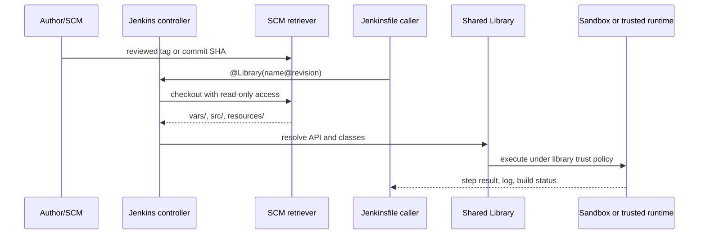

<Callout type="info" title="Phạm vi và nguyên tắc an toàn">
  Shared Library là code thực thi trong Pipeline, không phải chỉ là nơi lưu snippet. Bài này dùng ví dụ không có credential, endpoint hay thao tác phát hành thật. Hãy thử trên Jenkins lab cô lập, với repository mẫu và agent không có quyền production.
</Callout>

Shared Library giúp nhiều `Jenkinsfile` dùng chung một hợp đồng thay vì copy Groovy. Giá trị đó chỉ bền vững khi API nhỏ, revision có thể truy vết và người có quyền ghi library được xem là người có khả năng thay đổi hành vi Pipeline. Trang này phân biệt rõ sự tiện dụng của `vars/` với ranh giới bảo mật thực sự.

## Mục lục

- [Mô hình và cấu trúc thư viện](#mô-hình-và-cấu-trúc-thư-viện)
  - [Ba vùng mã nguồn](#ba-vùng-mã-nguồn)
  - [Nạp library: `@Library`, implicit loading và retriever](#nạp-library-library-implicit-loading-và-retriever)
- [Trust boundary và quyền truy cập](#trust-boundary-và-quyền-truy-cập)
  - [Trusted global library](#trusted-global-library)
  - [Untrusted và folder library](#untrusted-và-folder-library)
  - [ACL, approval, review và secret](#acl-approval-review-và-secret)
- [Thiết kế API cho Pipeline bền vững](#thiết-kế-api-cho-pipeline-bền-vững)
  - [Ví dụ API an toàn](#ví-dụ-api-an-toàn)
  - [Ranh giới CPS và `@NonCPS`](#ranh-giới-cps-và-noncps)
- [Versioning, tương thích và phát hành](#versioning-tương-thích-và-phát-hành)
  - [Chọn revision cho consumer](#chọn-revision-cho-consumer)
  - [Deprecation và migration](#deprecation-và-migration)
- [Contract, kiểm thử và chiến lược release](#contract-kiểm-thử-và-chiến-lược-release)
- [Luồng gọi và điểm kiểm soát](#luồng-gọi-và-điểm-kiểm-soát)
- [Lab local mock không có secret](#lab-local-mock-không-có-secret)
  - [Tạo repository mẫu](#tạo-repository-mẫu)
  - [Cấu hình và chạy job lab](#cấu-hình-và-chạy-job-lab)
  - [Kết quả và dọn dẹp](#kết-quả-và-dọn-dẹp)
- [Khắc phục sự cố](#khắc-phục-sự-cố)
- [Checklist trước khi phát hành](#checklist-trước-khi-phát-hành)
- [Nguồn Jenkins chính thức](#nguồn-jenkins-chính-thức)
- [Đọc tiếp](#đọc-tiếp)

## Mô hình và cấu trúc thư viện

Một Shared Library thường là một repository SCM độc lập. Jenkins lấy revision được cấu hình, sau đó đưa `vars/` thành Pipeline global variables và nạp class trong `src/` khi Pipeline cần. `resources/` giữ dữ liệu tĩnh mà Pipeline đọc qua `libraryResource`.

```text
ci-library/
├── vars/
│   └── safeBuild.groovy          # entry point: safeBuild(...)
├── src/
│   └── org/acme/ci/BuildPlan.groovy
└── resources/
    └── org/acme/ci/banner.txt
```

### Ba vùng mã nguồn

| Vùng | Mục đích | Nên đặt gì | Không nên dùng làm |
| --- | --- | --- | --- |
| `vars/` | API Groovy thân thiện với Jenkinsfile. File `vars/safeBuild.groovy` cung cấp biến/hàm `safeBuild`. | Adapter mỏng: nhận input, gọi step, chuyển dữ liệu cho class. | Ranh giới quyền hoặc nơi giấu toàn bộ logic nghiệp vụ. |
| `src/` | Class Groovy theo package, tái sử dụng và dễ unit test hơn. | Validation, model dữ liệu, quy tắc thuần Groovy nhỏ. | Nơi gọi Pipeline step từ constructor hoặc static method. |
| `resources/` | File tĩnh theo đường dẫn package. | Template, thông điệp, cấu hình không nhạy cảm đọc bằng `libraryResource`. | Kho secret, private key, token hoặc dữ liệu môi trường bí mật. |

`vars/` chỉ là **convention và load mechanism cho API**: nó làm lời gọi đẹp hơn, ví dụ `safeBuild(checks: ['unit'])`. Nó không tạo sandbox, không hạ quyền và không tách quyền giữa `vars/` và `src/`. Trust của library quyết định cả hai vùng, cùng với resource mà code có thể đọc.

### Nạp library: `@Library`, implicit loading và retriever

Khai báo tường minh giúp reviewer biết Jenkinsfile phụ thuộc library nào:

```groovy
@Library('ci-standards@v1.4.0') _

pipeline {
  agent any
  stages {
    stage('Verify') {
      steps {
        safeBuild(checks: ['unit', 'lint'])
      }
    }
  }
}
```

Dấu `_` đưa các global variable trong `vars/` vào script. Nếu cần `import` class từ `src/`, đặt `@Library('ci-standards@v1.4.0')` trước `import`; library phải được biết khi Jenkins biên dịch script. `library` step phù hợp khi version chỉ xác định ở runtime, nhưng không thay thế được import compile-time.

Quản trị viên có thể cấu hình **global library** ở cấp controller, đặt default version, cho hoặc không cho consumer ghi đè version, và bật **Load implicitly**. Implicit loading giảm dòng khai báo trong mọi Jenkinsfile, nhưng che dependency và revision; chỉ dùng cho API nền tảng ổn định, có owner rõ ràng. Mặc định nên khai báo `@Library` tường minh.

**Folder library** được cấu hình ở một Folder và áp dụng cho job bên trong cây Folder đó. Nó giúp cô lập ownership theo nhóm, nhưng không có nghĩa code trong folder tự trở nên trusted. Một **repository library** là repository SCM chứa cấu trúc trên; nó có thể được dùng bởi global/folder definition hoặc được nạp động tùy cấu hình. Retriever là cơ chế Jenkins lấy revision từ SCM: ưu tiên **Modern SCM** để plugin SCM hiểu branch/tag/revision; **Legacy SCM** là phương án tương thích khi không có retriever hiện đại. Controller cần quyền đọc repository và chỉ nên được cấp credential đọc tối thiểu cho retriever.

## Trust boundary và quyền truy cập

### Trusted global library

Global library được đánh dấu **trusted** chạy với quyền đầy đủ, ngoài Groovy sandbox. Điều này áp dụng cho *mọi code* library gọi được, gồm `vars/`, `src/` và các dependency/hành vi chúng kích hoạt; không phải chỉ class trong `src/`. Nó có thể gọi API Jenkins và Java không bị sandbox chặn, nên một commit độc hại hoặc sai sót có thể tác động rộng hơn Jenkinsfile caller.

Chỉ đặt vào trusted global library các capability platform thật sự cần đặc quyền, chẳng hạn adapter được review để gọi API Jenkins quản trị. Tách capability đó thành API rất hẹp; consumer không được truyền closure, class name, shell text hoặc URL tùy ý để library thực thi. Quyền ghi repository trusted, quyền thay retriever và quyền cấu hình global library đều là quyền nhạy cảm tương đương thay đổi code thực thi.

### Untrusted và folder library

Library không trusted, bao gồm folder-level library, chạy trong Groovy sandbox như Pipeline caller. Quy tắc này vẫn áp dụng cho `vars/`; chuyển logic vào `vars/` không né sandbox. Sandbox có thể từ chối method/signature chưa được phép. Người gọi vẫn chịu authorization của job, Folder, agent và credential scope; sandbox không cấp credential hay quyền item cho họ.

Khi một thao tác sandbox cần approval, quản trị viên phải xem chính xác signature, code và lý do nghiệp vụ trước khi phê duyệt. Approval làm một chữ ký khả dụng cho script sandbox phù hợp, không phải sự bảo đảm rằng mọi caller hoặc mọi input an toàn. Nếu capability cần quyền cao, thiết kế lại API trusted hẹp và review riêng thay vì chấp thuận chữ ký rộng.

### ACL, approval, review và secret

Thiết kế access control theo nhiều lớp:

- **ACL/authorization:** giới hạn ai được `Job/Configure`, tạo job/folder, sửa cấu hình global/folder library, xem cấu hình và dùng credential. Với API kiểm tra quyền người dùng, hiểu ngữ cảnh ACL trước khi approve các method “ACL-aware”; không cho phép một script giả định có quyền hệ thống.
- **SCM:** bật protected branch/tag, review bắt buộc, CODEOWNERS và audit cho repository library. Jenkins chỉ có deploy key hoặc token **read-only** để retriever checkout; không dùng credential ghi nếu không cần.
- **Script Approval:** coi pending signature là tín hiệu cần điều tra. Không approve theo log, theo yêu cầu PR, hoặc để “mở khóa build” mà không có owner chịu trách nhiệm.
- **Credentials:** không đặt secret trong `vars/`, `src/`, `resources/`, Git history, default parameter hay test fixture. Library chỉ nhận credential ID hoặc để Jenkinsfile bind credential trong scope nhỏ; code library không được echo, serialize hay archive giá trị secret.

<Callout type="warn" title="Folder không phải một trust label">
  Folder giới hạn phạm vi cấu hình và có thể giúp phân quyền, nhưng folder library vẫn là untrusted. Ngược lại, global trusted library không an toàn chỉ vì `Jenkinsfile` gọi nó là sandboxed: code library đã vượt sandbox.
</Callout>

## Thiết kế API cho Pipeline bền vững

Thiết kế `vars/` như façade mỏng và ổn định. Chọn tên theo ý định (`safeBuild`, `publishReport`) thay vì lộ implementation (`runShell`). Nhận `Map` có key allowlist, đặt default rõ ràng, validate sớm và trả về dữ liệu đơn giản. Đưa quy tắc thuần Groovy vào class `src/` có kiểu dữ liệu rõ để unit test độc lập.

### Ví dụ API an toàn

`vars/safeBuild.groovy` chỉ điều phối Pipeline step và giữ output có thể quan sát:

```groovy
import org.acme.ci.BuildPlan

def call(Map options = [:]) {
  BuildPlan plan = BuildPlan.from(options)
  echo libraryResource('org/acme/ci/banner.txt').trim()
  plan.checks.each { String check ->
    echo "requested-check=${check}"
  }
}
```

`src/org/acme/ci/BuildPlan.groovy` giữ data contract. Class không nhận `steps`, không gọi `sh` và không giữ handle Jenkins:

```groovy
package org.acme.ci

class BuildPlan implements Serializable {
  final List<String> checks

  private BuildPlan(List<String> checks) {
    this.checks = checks
  }

  static BuildPlan from(Map options) {
    def allowed = ['unit', 'lint']
    def selected = (options.checks ?: ['unit']) as List
    if (!selected.every { it instanceof String && allowed.contains(it) }) {
      throw new IllegalArgumentException('checks must be unit or lint')
    }
    new BuildPlan(selected.collect { it as String })
  }
}
```

API này không nhận command string, không chạy shell và không chứa secret. Production API có thể gọi tool đã cố định sau validation, nhưng không ghép input người dùng thành Groovy hay shell. Cú pháp Pipeline và cách tách Declarative/Scripted xem [Declarative Pipeline](/docs/pipelines/declarative), [Scripted Pipeline](/docs/pipelines/scripted) và [Jenkinsfile](/docs/pipelines/jenkinsfile).

### Ranh giới CPS và `@NonCPS`

Pipeline Groovy dùng CPS để Jenkins có thể checkpoint và tiếp tục sau restart. Vì vậy dữ liệu sống qua `echo`, `sh`, `sleep`, `input` hoặc step có thể dừng cần serializable: `String`, number, boolean, `List`/`Map` chỉ chứa các kiểu đó, hoặc object `Serializable` đơn giản như `BuildPlan`. Không giữ stream, socket, `File`, iterator, matcher, client SDK, thread hay object Jenkins/plugin qua một step.

`@NonCPS` chỉ dành cho hàm Groovy thuần, ngắn, đồng bộ như sort/normalize một list cục bộ. Hàm đó không được gọi `echo`, `sh`, `node`, `stage`, `sleep`, `error` hay Pipeline step nào; cũng không phù hợp I/O dài hoặc polling vì không resume qua restart. Giá trị trả về vẫn phải serializable nếu Pipeline giữ nó sau đó. Xem giải thích và cảnh báo CPS chi tiết tại [Groovy trong Jenkins Pipeline](/docs/advanced/groovy).

## Versioning, tương thích và phát hành

### Chọn revision cho consumer

| Cách nạp | Khi phù hợp | Rủi ro và quy ước |
| --- | --- | --- |
| `@Library('ci-standards@v1.4.0')` | Hợp đồng đã release, cần build tái lập. | Ưu tiên tag bất biến, SemVer và changelog. |
| `@Library('ci-standards@main')` | Lab hoặc integration canary có kiểm soát. | Branch di động; commit hôm nay và ngày mai có thể khác. Không dùng làm mặc định production. |
| `@Library('ci-standards@a1b2c3d4')` | Cần audit/reproduce chính xác revision. | Pin commit SHA đầy đủ khi retriever/SCM hỗ trợ; quản lý cập nhật pin bằng PR. |

Default version của cấu hình global/folder là fallback, không phải lời hứa về reproducibility. Nếu administrator khóa override default version, consumer không thể tự pin khác; đó là policy cần công bố. Không di chuyển tag release đã công bố. Để cập nhật an toàn, tạo PR đổi version ở consumer, chạy matrix tương thích rồi merge như thay đổi dependency.

### Deprecation và migration

Dùng SemVer theo contract công khai: patch sửa lỗi không đổi API, minor thêm API tương thích, major cho breaking change. Ghi rõ support window, version thay thế, ngày loại bỏ và ví dụ migration trong release notes. Giữ wrapper cũ trong ít nhất một minor khi hợp lý, phát `echo` warning không lộ dữ liệu, rồi xóa ở major đã báo trước.

Ví dụ, thay vì đổi im lặng `safeBuild(checks: ...)`, thêm `verify(checks: ...)`, để `safeBuild` gọi wrapper mới trong `v1`, và cho consumer chuyển từng repository. Trước `v2`, tìm consumer bằng khai báo `@Library` và lời gọi API, mở PR migration, chạy test của họ và chỉ bỏ wrapper khi danh sách owner xác nhận. Xử lý thay đổi Pipeline có lỗi rõ ràng tại [Xử lý lỗi và Retry](/docs/pipelines/error-handling).

## Contract, kiểm thử và chiến lược release

Đừng chỉ test branch library. Test contract tại revision mà consumer thực sự pin, trên Jenkins/plugin versions được hỗ trợ. Pipeline unit test có thể mock `echo`/`libraryResource` để kiểm tra `vars/`; class `src/` test như Groovy thuần. Sau đó chạy integration trên controller lab cô lập để phát hiện classloading, sandbox, retriever và CPS khác với mock.

| Lớp | Contract cần chứng minh | Fixture/kỳ vọng |
| --- | --- | --- |
| Unit `src/` | Allowlist và default không đổi. | `['unit']` hợp lệ; `['deploy']` ném lỗi rõ ràng. |
| Unit `vars/` | Façade gọi đúng step, không thực thi shell. | Mock nhận banner và hai dòng `requested-check`. |
| Contract consumer | `Jenkinsfile` tại tag pin biên dịch/gọi đúng API. | Consumer mẫu dùng `v1.4.0` chạy xanh. |
| Integration lab | Retriever, sandbox/CPS và resource hoạt động theo policy. | Job không có approval mới, không dùng credential, log đúng. |
| Release/canary | Upgrade không phá consumer được chọn. | Matrix Jenkins LTS/plugin đã hỗ trợ; rollback bằng pin tag cũ. |

Quy trình release nên là: merge qua review → test revision commit → tạo tag bất biến và changelog → chạy consumer canary → công bố upgrade/migration → theo dõi lỗi → mở rộng. Không release thẳng từ branch cá nhân. Test automation và bằng chứng build xem tại [Tự động hóa kiểm thử](/docs/delivery/test-automation).

## Luồng gọi và điểm kiểm soát



Điểm quyết định nằm trước khi code chạy: SCM review bảo vệ revision; retriever access bảo vệ việc đọc source; cấu hình library quyết định global/folder và trust; authorization/Script Approval giới hạn capability. Sau đó, log và build result là evidence của lần gọi, không thay thế cho các kiểm soát trước đó. Mô hình execution chung xem [Tổng quan Jenkins Pipeline](/docs/pipelines/overview) và cấu hình controller xem [Cấu hình hệ thống Jenkins](/docs/administration/system-configuration).

## Lab local mock không có secret

### Tạo repository mẫu

Trên máy lab riêng, tạo repository local; không dùng remote production, credential hoặc controller dùng chung:

```bash
export LAB_ROOT=/tmp/jenkins-shared-library-lab
rm -rf "$LAB_ROOT"
mkdir -p "$LAB_ROOT/ci-lib"/{vars,src/org/acme/ci,resources/org/acme/ci}
cd "$LAB_ROOT/ci-lib"
git init -b main
git config user.name 'Lab User'
git config user.email 'lab@example.invalid'
cat > vars/safeBuild.groovy <<'EOF'
import org.acme.ci.BuildPlan

def call(Map options = [:]) {
  BuildPlan plan = BuildPlan.from(options)
  echo libraryResource('org/acme/ci/banner.txt').trim()
  plan.checks.each { String check -> echo "requested-check=${check}" }
}
EOF
cat > src/org/acme/ci/BuildPlan.groovy <<'EOF'
package org.acme.ci

class BuildPlan implements Serializable {
  final List<String> checks
  private BuildPlan(List<String> checks) { this.checks = checks }
  static BuildPlan from(Map options) {
    def allowed = ['unit', 'lint']
    def selected = (options.checks ?: ['unit']) as List
    if (!selected.every { it instanceof String && allowed.contains(it) }) {
      throw new IllegalArgumentException('checks must be unit or lint')
    }
    new BuildPlan(selected.collect { it as String })
  }
}
EOF
printf 'Shared Library local mock\n' > resources/org/acme/ci/banner.txt
git add . && git commit -m 'Add safe lab library'
git tag v0.1.0
```

### Cấu hình và chạy job lab

Trong một Jenkins lab cô lập có plugin Pipeline và SCM retriever phù hợp, tạo global library tên `ci-lib` **không trusted**, tắt implicit loading và trỏ Git retriever tới đường dẫn local của repository. Không thêm credential. Tạo Pipeline job với Jenkinsfile sau; agent chỉ cần chạy `echo` và không có secret.

```groovy
@Library('ci-lib@v0.1.0') _

pipeline {
  agent any
  stages {
    stage('Library contract') {
      steps {
        safeBuild(checks: ['unit', 'lint'])
      }
    }
  }
}
```

Không biến lab thành lý do bật trusted hoặc approve signature. Nếu setup sandbox yêu cầu approval ngoài dự kiến, dừng build, đọc signature và xem lại API; ví dụ này không cần mở quyền đặc biệt.

### Kết quả và dọn dẹp

Console Output dự kiến có `Shared Library local mock`, `requested-check=unit`, `requested-check=lint` và build `SUCCESS`. Lỗi allowlist, retriever hoặc sandbox phải làm build thất bại có log rõ, không được sửa bằng cách tắt sandbox.

Sau khi ghi lại kết quả, xóa job/configuration library trong Jenkins lab, xóa workspace của job nếu policy lab cho phép, rồi xóa repository mock:

```bash
rm -rf /tmp/jenkins-shared-library-lab
```

Xác nhận không còn global/folder library `ci-lib`, credential hay approval được tạo cho lab. Lệnh dọn dẹp chỉ dành cho thư mục `/tmp` vừa tạo, không áp dụng cho repository hay workspace không thuộc lab.

## Khắc phục sự cố

| Dấu hiệu | Nguyên nhân thường gặp | Cách xử lý an toàn |
| --- | --- | --- |
| `No such global variable` | Sai tên library/`vars` hoặc chưa khai báo `@Library`. | Kiểm tra cấu hình scope, tên file và revision; không bật implicit loading chỉ để che dependency. |
| Không import được class `src/` | `@Library` không ở đầu Jenkinsfile hoặc package/đường dẫn sai. | Đưa annotation trước `import`, đối chiếu `src/org/...` với `package`. |
| Sandbox từ chối signature | API untrusted gọi capability không được cho phép. | Thu hẹp API, tìm alternative sandbox-safe; review signature trước mọi approval. |
| `NotSerializableException` hoặc CPS mismatch | Giữ object không serializable qua step, hoặc gọi step trong `@NonCPS`. | Chuyển thành data đơn giản, tách hàm thuần và giữ Pipeline step ngoài `@NonCPS`. |
| Consumer đổi hành vi sau build | Dùng branch/default di động. | Pin tag hoặc commit SHA, audit cấu hình cho phép override và tạo PR upgrade. |
| Retriever checkout thất bại | URL, revision hoặc quyền đọc SCM sai. | Xác minh tag tồn tại và Jenkins có access read-only; không thêm token ghi để “thử nhanh”. |

## Checklist trước khi phát hành

- [ ] `vars/` chỉ là façade mỏng; logic thuần nằm trong `src/` và resource không chứa dữ liệu nhạy cảm.
- [ ] Input có allowlist/validation; API không nhận code, command hoặc closure tùy ý để thực thi.
- [ ] Data qua Pipeline step là serializable; `@NonCPS` không gọi Pipeline step và không làm I/O dài.
- [ ] Global trusted capability được tách nhỏ, có owner; folder/untrusted library vẫn được kiểm tra sandbox.
- [ ] ACL, quyền ghi SCM, retriever read-only và Script Approval đã được review như một trust boundary.
- [ ] Không có secret trong library, test fixture, log, resource, tag hay Git history; credential chỉ bind ở scope tối thiểu của consumer.
- [ ] Tag release bất biến, changelog/migration rõ, consumer pin revision và có rollback pin cũ.
- [ ] Unit, contract, integration lab và canary matrix đều có evidence trước khi công bố.

## Nguồn Jenkins chính thức

- [Using shared libraries](https://www.jenkins.io/doc/book/pipeline/shared-libraries/)
- [Pipeline CPS method mismatches](https://www.jenkins.io/doc/book/pipeline/cps-method-mismatches/)
- [In-process Script Approval](https://www.jenkins.io/doc/book/managing/script-approval/)
- [Access control](https://www.jenkins.io/doc/book/security/access-control/)
- [Using a Jenkinsfile](https://www.jenkins.io/doc/book/pipeline/jenkinsfile/)

## Đọc tiếp

<Cards>
  <Card title="Tổng quan Pipeline" href="/docs/pipelines/overview" description="Ôn execution model, build evidence và controller/agent." />
  <Card title="Declarative Pipeline" href="/docs/pipelines/declarative" description="Dùng cấu trúc Pipeline dễ review cho consumer." />
  <Card title="Scripted Pipeline" href="/docs/pipelines/scripted" description="Hiểu Groovy DSL khi cần luồng động." />
  <Card title="Credentials trong Pipeline" href="/docs/pipelines/credentials" description="Giữ credential ngoài library và bind trong scope hẹp." />
  <Card title="Groovy trong Jenkins Pipeline" href="/docs/advanced/groovy" description="Đào sâu CPS, sandbox và Script Approval." />
  <Card title="Quản lý Jenkins plugins" href="/docs/administration/plugin-management" description="Kiểm tra plugin retriever và Pipeline trên controller." />
  <Card title="Tự động hóa kiểm thử" href="/docs/delivery/test-automation" description="Thiết kế evidence và test strategy cho release." />
</Cards>
