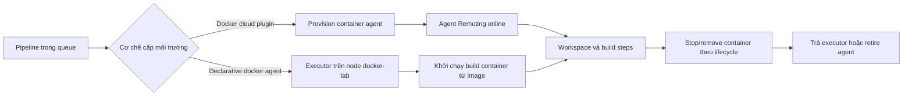

Docker agent đóng gói toolchain của một build vào container để giảm drift giữa các máy chạy. Cách này chỉ cô lập tốt khi Docker daemon, image, volume, mạng và credential cũng được thiết kế theo trust boundary. Trang này phân biệt rõ container **agent** do cloud provisioner tạo với container **build** do Declarative Pipeline khởi chạy.

## Mục lục

- [Mô hình và phạm vi](#mô-hình-và-phạm-vi)
  - [Hai cơ chế Docker không hoán đổi cho nhau](#hai-cơ-chế-docker-không-hoán-đổi-cho-nhau)
  - [Vòng đời agent container và build container](#vòng-đời-agent-container-và-build-container)
- [Image template, tag và provenance](#image-template-tag-và-provenance)
  - [Image template của Docker cloud](#image-template-của-docker-cloud)
  - [Pin image và xác thực registry](#pin-image-và-xác-thực-registry)
- [Labels, executor và resource limits](#labels-executor-và-resource-limits)
- [Jenkinsfile Declarative an toàn](#jenkinsfile-declarative-an-toàn)
- [Workspace, volume, cache và cleanup](#workspace-volume-cache-và-cleanup)
  - [Ownership và dữ liệu tồn dư](#ownership-và-dữ-liệu-tồn-dư)
- [Network, credential và workload không tin cậy](#network-credential-và-workload-không-tin-cậy)
  - [Docker socket là quyền đặc biệt](#docker-socket-là-quyền-đặc-biệt)
- [Chọn kiến trúc build container](#chọn-kiến-trúc-build-container)
  - [So sánh Docker-outside-of-Docker, DinD và lựa chọn khác](#so-sánh-docker-outside-of-docker-dind-và-lựa-chọn-khác)
- [Lab Docker local sandbox](#lab-docker-local-sandbox)
  - [Điều kiện lab](#điều-kiện-lab)
  - [Các bước](#các-bước)
  - [Kết quả mong đợi và cleanup](#kết-quả-mong-đợi-và-cleanup)
- [Troubleshooting](#troubleshooting)
- [Checklist trước khi vận hành](#checklist-trước-khi-vận-hành)
- [Nguồn Jenkins chính thức](#nguồn-jenkins-chính-thức)
- [Đọc tiếp](#đọc-tiếp)

## Mô hình và phạm vi

Docker không thay Jenkins controller thành một build server. Controller vẫn xếp queue, cấp executor và giữ cấu hình; một Docker-capable agent hoặc Docker cloud mới là nơi nói chuyện với Docker daemon. Bắt đầu từ mô hình controller–agent tại [Tổng quan Jenkins](/docs/getting-started/overview), [Kiến trúc Jenkins](/docs/getting-started/architecture) và [Tổng quan Jenkins Agent](/docs/agents/overview).



Sơ đồ Mermaid cần renderer Mermaid của dự án. Khi đưa tài liệu này sang một Fumadocs khác, hãy cấu hình renderer tương đương trước khi kỳ vọng sơ đồ được vẽ.

### Hai cơ chế Docker không hoán đổi cho nhau

| Cơ chế | Ai provision? | Container biểu diễn gì? | Điều kiện chính |
| --- | --- | --- | --- |
| **Docker cloud / Docker plugin provisioner** | Jenkins Docker plugin qua một Docker cloud đã cấu hình. | Một Jenkins agent động, thường chạy Remoting và nhận executor sau khi kết nối. | Docker plugin, endpoint daemon đã quản trị, template, network đến controller và quota daemon. |
| **Declarative `agent { docker { ... } }`** | Docker Pipeline plugin, từ một node/executor Jenkins đã được chọn. | Container chạy toolchain cho một Pipeline hoặc stage; không thay node Jenkins thành cloud agent. | Pipeline: Declarative, Docker Pipeline plugin, node có Docker CLI/daemon được phê duyệt và image pull được. |

Docker cloud phù hợp khi cần thêm/bớt **agent capacity** theo queue. Template đặt image agent, remote filesystem, labels, connector/launcher, số executor, environment và policy idle/retention. Declarative Docker agent phù hợp khi một stage cần một toolchain đóng gói, ví dụ Node.js hay Maven, trên một pool Docker đã tồn tại.

<Callout type="warn" title="Giả định plugin và phiên bản">
  Docker cloud, template fields, connector, retention strategy và `agent { docker { ... } }` là khả năng của plugin, không phải Jenkins core. Xác nhận Jenkins LTS, Docker plugin, Docker Pipeline plugin và Pipeline: Declarative đã được phê duyệt trên controller của bạn. Tên trường và lifecycle chi tiết có thể khác giữa phiên bản plugin.
</Callout>

### Vòng đời agent container và build container

Với Docker cloud, controller yêu cầu provision khi queue cần một label mà cloud đáp ứng. Provisioner tạo container agent từ template, container kết nối về controller, nhận trạng thái `Online`, rồi mới có executor hữu ích. Sau thời gian idle hoặc khi policy retire áp dụng, agent được drain, container bị xóa và workspace cục bộ có thể mất. Nếu image pull, daemon, DNS/TLS hoặc kết nối Remoting lỗi, build vẫn chờ hoặc provision thất bại.

Với Declarative Docker agent, Jenkins trước hết chọn một executor trên node thỏa label. Plugin pull image khi cần, tạo build container, mount workspace theo cách plugin hỗ trợ, rồi chạy các `steps` trong container. Khi allocation kết thúc, container thường được stop và remove; **image layer, host workspace và named volume không tự biến mất**. `reuseNode true` ưu tiên dùng workspace của node hiện tại; với stage-level agent khác, đừng suy ra các stage luôn cùng node hoặc cùng filesystem.

## Image template, tag và provenance

Image là một dependency thực thi được. Nó phải có owner, toolchain được biết, lịch vá và nguồn registry đáng tin cậy; tên image đẹp không chứng minh nội dung bên trong an toàn.

### Image template của Docker cloud

Một Docker cloud template nên là contract tối thiểu, không phải danh sách option để container “chạy được bằng mọi giá”. Xác định rõ:

- **labels** như `linux`, `docker-ci` hoặc `untrusted-pr`; labels mô tả năng lực scheduler chứ không là ACL;
- image agent do tổ chức quản lý, Java/Remoting tương thích và user không phải root nếu không thật sự cần;
- remote filesystem và workspace tạm nằm trên storage có quota, ownership và lifecycle rõ;
- số executor thận trọng; một agent container thường bắt đầu với một executor cho build nặng;
- resource limit, network/egress policy và thời gian idle/retention phù hợp với trust tier;
- endpoint Docker daemon, TLS/authentication và quyền provision chỉ dành cho quản trị viên.

Không lấy một image ứng dụng bất kỳ làm image agent nếu nó không có Java/agent launcher mà template cần. Ngược lại, image trong Declarative `docker` là image **toolchain build**, không nhất thiết là image Remoting agent. Tách hai loại image giúp review rõ trách nhiệm và lịch vá.

### Pin image và xác thực registry

Tag phiên bản, ví dụ `node:22.14.0-alpine3.21`, tốt hơn `latest` vì review thấy toolchain dự kiến. Tuy vậy tag vẫn có thể bị registry thay đổi. Build cần tái lập hoặc thuộc trust tier cao nên dùng một tham chiếu digest bất biến đã được đội xác minh, lấy từ registry sau khi pull/inspect image đã pin.

```bash
IMAGE_TAG='node:22.14.0-alpine3.21'
docker pull "$IMAGE_TAG"
docker image inspect "$IMAGE_TAG" \
  --format '{{range .RepoDigests}}{{println .}}{{end}}'
```

Lưu `RepoDigests` đã review vào catalog image hoặc cấu hình template; review digest cùng SBOM, kết quả scan, chữ ký/provenance nếu tổ chức dùng chúng, license và kiến trúc cần chạy. Khi cập nhật, tạo change mới thay vì âm thầm repull tag cũ. Không tự chép một digest từ tài liệu hoặc từ môi trường khác mà chưa xác minh manifest và registry đích.

Registry private có thể cần `registryUrl` và `registryCredentialsId` trong Docker Pipeline, hoặc credential pull do Docker cloud/template quản lý. Credential ID không phải secret, nhưng token phía sau phải chỉ có quyền pull tối thiểu, scope theo folder/pool và không được ghi vào Jenkinsfile, image layer, cache hay console log. Chỉ cấp credential pull cho một Pipeline tin cậy khi image không public; xem cách thu hẹp scope tại [Credentials trong Pipeline](/docs/pipelines/credentials).

## Labels, executor và resource limits

Đặt label theo capability lẫn trust tier, ví dụ `linux && docker-ci && untrusted-pr` hoặc `linux && docker-ci && trusted-release`. Không chia cùng Docker host, writable cache hoặc registry token ghi giữa hai tier chỉ vì label khác nhau. [Labels & Executors](/docs/agents/labels-executors) giải thích vì sao executor là slot scheduler, không phải một CPU core.

Resource limits bảo vệ host trước khi tăng concurrency. Với Docker cloud, đặt CPU, memory, PID và storage limit ở template/daemon policy nếu runtime hỗ trợ. Với Declarative Docker agent, `args` truyền Docker run options; những option được daemon, plugin và platform cho phép phải được kiểm thử trên pool riêng. Bắt đầu một executor cho image build nặng, đo CPU/RAM/disk/I/O và queue theo label, rồi mới tăng capacity.

Ví dụ `args` trong phần kế tiếp minh họa `--cpus`, `--memory`, `--pids-limit`, drop capability và `no-new-privileges`. Các flag này không thay thế quota Docker host, cgroup policy, disk monitoring, ulimit phù hợp hoặc network policy. Đừng dùng `--privileged` để sửa lỗi thiếu quyền mà chưa xác định đúng yêu cầu.

## Jenkinsfile Declarative an toàn

Mẫu lab này không checkout SCM, không dùng credential, không gọi registry private và không mount Docker socket vào controller. Nó cần một **agent Linux lab có sẵn** với label `docker-lab`; Docker CLI trên agent đó đã được vận hành viên cho phép nói chuyện với daemon lab. Tag được pin theo version cho lab; trước production, thay bằng digest đã review theo quy trình ở trên.

```groovy
pipeline {
  agent none

  options {
    skipDefaultCheckout(true)
    timeout(time: 3, unit: 'MINUTES')
  }

  stages {
    stage('Kiểm tra toolchain trong container') {
      agent {
        docker {
          label 'linux && docker-lab && !trusted-release'
          image 'node:22.14.0-alpine3.21'
          reuseNode true
          args '--cpus=1 --memory=512m --pids-limit=128 --cap-drop=ALL --security-opt=no-new-privileges'
        }
      }
      steps {
        sh '''
          set -eu
          printf 'node=%s\nworkspace=%s\n' "$NODE_NAME" "$WORKSPACE"
          node --version
          npm --version
          test -w "$WORKSPACE"
        '''
      }
    }
  }
}
```

`reuseNode true` làm container dùng workspace của node Docker đã cấp stage. Điều đó tiện cho checkout cùng stage, nhưng đồng nghĩa quyền file giữa user trên host và user trong image phải tương thích. Nếu stage khác có agent khác, hãy checkout lại hoặc chuyển artifact qua kho phù hợp; không dùng `reuseNode` như một cơ chế truyền file giữa agents. Cú pháp `agent` cấp stage và Declarative được trình bày tại [Chọn agent cho Pipeline](/docs/pipelines/agents) và [Declarative Pipeline](/docs/pipelines/declarative).

<Callout type="info" title="Không có secret trong Jenkinsfile lab">
  Registry credential không cần cho image public của lab. Trong Pipeline thật, tránh `docker login` với password trong shell. Dùng integration/plugin đã được review hoặc binding có scope hẹp trên stage tin cậy; đừng cấp credential registry ghi cho PR/fork chỉ để pull image.
</Callout>

## Workspace, volume, cache và cleanup

Container bị xóa không có nghĩa mọi dữ liệu build biến mất. Docker Pipeline có thể tạo/mount workspace trên node, còn Docker cloud có remote filesystem do template/agent quản lý. Image cache nằm trên Docker host. Bind mount, named volume và cache service có lifecycle khác container và phải được review riêng.

| Dữ liệu | Nơi nên đặt | Ownership và cleanup |
| --- | --- | --- |
| Source/workspace tạm | Workspace riêng theo job/build trên agent hoặc storage ephemeral của agent container. | User chạy container phải ghi được; dọn theo policy sau build, đặc biệt với untrusted workload. |
| Artifact cần giữ | Artifact repository hoặc Jenkins archive theo retention. | Không coi workspace/volume của agent ephemeral là kho phát hành. |
| Dependency cache | Named volume hoặc cache service dành riêng cho project/trust tier. | Key theo project/branch/tool version; quota, TTL, quét và owner rõ ràng. |
| Docker image layer | Docker host hoặc registry mirror được quản trị. | Theo dõi disk, retention và provenance; không chạy prune diện rộng để giải phóng gấp. |

### Ownership và dữ liệu tồn dư

Image có thể chạy UID khác user Jenkins trên host. Khi container ghi vào bind-mounted workspace bằng root, build sau có thể gặp `Permission denied` hoặc, tệ hơn, đọc được file của build trước. Chọn UID/GID trong image hoặc cấu hình runtime khớp ownership của workspace; xác minh bằng job sandbox trước khi dùng cache. Không chữa bằng `chmod -R 777`, `chown -R` trên workspace dùng chung hay chạy container root mặc định.

Cache tăng tốc nhưng cũng là input cho build. Cache ghi được dùng chung có thể bị dependency poisoning hoặc giữ token/file cấu hình vô tình. Tách cache của PR/fork khỏi cache release, không mount toàn bộ home directory, chỉ mount đúng đường dẫn cache cần thiết và không đặt file secret vào cache. Với agent cloud ephemeral, ưu tiên cache remote có kiểm soát hoặc chấp nhận cold cache thay vì kéo volume host không rõ ownership vào mọi build.

Cleanup cần nhắm đúng dữ liệu của lab/job. Sau build, dọn workspace bằng policy của Jenkins/agent và chỉ xóa container, volume hoặc network mang tên dành riêng cho lab sau khi inspect. Tránh `docker system prune`, `docker volume prune`, `docker compose down --volumes` hoặc wildcard trên host có workload khác: chúng có thể ảnh hưởng image, cache và volume không thuộc job này.

## Network, credential và workload không tin cậy

Docker daemon cần outbound tối thiểu tới registry đã cho phép; build container có thể cần SCM, package registry, artifact repository hoặc dịch vụ test. Tạo egress allowlist theo pool thay vì dùng network host hoặc mở Internet rộng. Một Docker cloud agent còn cần đường kết nối về Jenkins controller theo launcher/Remoting đã chọn; DNS, TLS, proxy và firewall phải được kiểm thử trước khi đưa pool vào queue.

PR từ fork, dependency do contributor kiểm soát và `Jenkinsfile` chưa được tin cậy là workload không tin cậy. Route chúng sang Docker host/agent hoặc cloud template riêng, ephemeral khi có thể, không có credential deploy, token registry ghi, Docker socket, mount hostPath hay network production. Repository nội bộ cũng không mặc nhiên trusted: áp dụng stage/branch policy và review trước khi cấp credential. Cách giới hạn secret được giải thích tại [Credentials trong Pipeline](/docs/pipelines/credentials).

### Docker socket là quyền đặc biệt

Docker socket gần như trao quyền điều khiển Docker host: client có thể tạo container privileged hoặc mount filesystem host qua API. Mount socket read-only không làm Docker API read-only. Vì vậy, **không mặc định mount `/var/run/docker.sock` vào Jenkins controller** và không đưa socket vào build container của PR/fork.

Docker-outside-of-Docker chỉ chấp nhận được khi Docker CLI chạy trên **agent riêng, tin cậy**, nói chuyện với daemon đã được cô lập và job được authorization. Có thể dùng daemon remote qua TLS/mTLS thay vì socket local, nhưng remote endpoint vẫn là tài sản đặc quyền cần authorization, audit và network segmentation. Đọc baseline controller tại [Chạy Jenkins với Docker](/docs/installation/docker) và yêu cầu network/storage tại [Yêu cầu hệ thống](/docs/getting-started/requirements).

<Callout type="error" title="Container không tự là security boundary">
  `--privileged`, Docker socket, host network, bind mount nhạy cảm và user root làm giảm hoặc phá vỡ cô lập container. Đối với release hoặc code có secret giá trị cao, dùng pool/VM/identity riêng và network policy; labels chỉ hỗ trợ routing, không thay thế isolation.
</Callout>

## Chọn kiến trúc build container

Chọn dựa trên việc build chỉ cần **chạy toolchain** hay cần **tạo image Docker**, cùng trust tier và boundary phải bảo vệ. Không giả định mọi giải pháp đều có cùng semantics về cache, network, UID, layer reuse hoặc plugin support.

### So sánh Docker-outside-of-Docker, DinD và lựa chọn khác

| Lựa chọn | Cách hoạt động | Lợi ích | Trade-off và khi phù hợp |
| --- | --- | --- | --- |
| Docker-outside-of-Docker (DooD) | Docker CLI trên agent/build gọi daemon host hoặc remote. | Cache layer nhanh, tương thích Docker workflow quen thuộc. | Socket local là đặc quyền host; remote daemon vẫn cần TLS/authz. Chỉ dùng trên pool tin cậy, tách controller và untrusted PR. |
| Docker-in-Docker (DinD) | Daemon Docker riêng chạy trong container, thường cần quyền/capability cao hoặc storage riêng. | Tách daemon state khỏi host daemon, dễ tạo môi trường lab ngắn hạn. | Nặng, phức tạp storage/network, thường giảm isolation do `--privileged`. Không đặt cạnh controller hoặc xem là sandbox mặc định. |
| Remote builder | Agent gửi build tới daemon/service từ xa qua TLS/mTLS và policy riêng. | Tách compute/build cache khỏi agent, audit/scale rõ hơn. | Phụ thuộc endpoint, certificate, authorization, latency và quota; service cần phân tách theo trust tier. |
| Rootless BuildKit | BuildKit chạy rootless, không cần Docker daemon đặc quyền theo mô hình phù hợp. | Giảm bề mặt quyền host, cache/export linh hoạt. | Cần kiểm thử driver, filesystem, network và feature tương thích; rootless không tự làm untrusted source an toàn. |
| BuildKit/Kaniko hoặc nền tảng build chuyên dụng | Builder thực hiện OCI build không cần Docker socket của agent. | Phù hợp Kubernetes/remote build và policy registry tập trung. | Semantics Dockerfile, cache, privilege, plugin/CLI và hỗ trợ version khác nhau; xác minh trước khi thay thế Docker build. |

DooD không phải là “an toàn hơn” DinD một cách tuyệt đối: nó tiện nhưng daemon host là blast radius lớn. DinD không phải “cô lập hơn” một cách tự động: quyền privileged và mount storage có thể làm boundary yếu đi. Với untrusted PR, ưu tiên không build image đặc quyền; nếu bắt buộc, dùng builder/pool ephemeral tách biệt, không có secret và có egress/IAM tối thiểu.

## Lab Docker local sandbox

Lab này quan sát Declarative Docker agent trên một Jenkins lab cục bộ. Nó chỉ in version toolchain và đường dẫn workspace; không checkout repository, không dùng secret, không build/push image và không động vào controller production. Nếu chưa có controller lab, chuẩn bị theo [Chạy Jenkins với Docker](/docs/installation/docker); dùng cài đặt [Linux](/docs/installation/linux) hoặc [Kubernetes](/docs/installation/kubernetes) khi đó là môi trường agent thực tế của bạn.

### Điều kiện lab

- Jenkins LTS lab có Pipeline: Declarative và Docker Pipeline plugin tương thích; controller/built-in node production vẫn đặt `0` executor.
- Một agent Linux **dành riêng cho lab** có Docker Engine/CLI do admin cài, label `linux docker-lab`, một executor và đủ disk. Docker daemon thuộc host agent, không phải controller và không được chia cho release/PR.
- Agent có thể pull `node:22.14.0-alpine3.21` từ registry public, hoặc image mirror nội bộ đã được review. Không cấu hình credential registry trong lab này.
- Workspace lab nằm trong remote root riêng. Không dùng host mount, `--privileged`, Docker socket trong build container hay `--network host`.

### Các bước

1. Trên agent lab, xác minh Docker daemon và dung lượng trước khi tạo job:

   ```bash
   docker version
   docker info --format 'Server={{.ServerVersion}} Rootless={{.SecurityOptions}}'
   df -h "${JENKINS_AGENT_WORKDIR:-$HOME}"
   ```

   Kết quả cần có Docker server phản hồi và filesystem workspace còn chỗ trống. Nếu user agent không có quyền Docker, nhờ quản trị viên cấu hình đúng pool; không thêm user vào nhóm `docker` trên controller để chữa lỗi.

2. Trong **Manage Jenkins → Nodes**, xác nhận agent lab `Online`, có đúng labels `linux docker-lab`, chỉ một executor và remote root dành riêng cho lab. Tên node thực tế có thể khác; label mới là contract của Jenkinsfile.

3. Tạo Pipeline job tạm tên `docker-agent-sandbox`, chọn **Pipeline script**, dán Jenkinsfile ở [Jenkinsfile Declarative an toàn](#jenkinsfile-declarative-an-toàn), rồi chọn **Build Now**.

4. Mở **Console Output** và trang node. Xác nhận log có `node=`, `workspace=`, một phiên bản Node.js `v22.14.0` và npm version. Trong lúc chạy, Docker host có thể thấy build container tạm; container đó sẽ được plugin dừng/xóa sau stage.

5. Chạy lại job một lần. Nếu lần hai nhanh hơn, đó có thể là image layer đã cache trên Docker host, không phải bằng chứng workspace/cache dự án được chia sẻ an toàn. Ghi nhận dung lượng Docker bằng lệnh sau, không xóa gì:

   ```bash
   docker system df
   ```

### Kết quả mong đợi và cleanup

| Quan sát | Kết quả đúng | Nếu không đúng |
| --- | --- | --- |
| Queue/node | Stage được cấp trên agent `docker-lab`, không phải controller. | Kiểm tra label, agent `Online`, executor và Docker Pipeline plugin. |
| Console Output | Có Node.js `v22.14.0`, npm version và workspace không rỗng. | Kiểm tra image pull, quyền workspace hoặc sự tương thích của `args` với daemon. |
| Sau build | Build container tạm không còn chạy; image layer có thể vẫn cache. | Đọc console/daemon log trước; không prune toàn host. |
| Không có secret | Không có `withCredentials`, `docker login`, token hay push registry. | Xóa job lab nếu đã thêm dữ liệu nhạy cảm, thu hồi theo policy và điều tra log/cache. |

Kết thúc bằng cách xóa **job `docker-agent-sandbox`** trong Jenkins UI và dọn workspace của chính job đó theo policy lab. Nếu bạn đã tự tạo một named volume chỉ cho lab, inspect đúng tên và xác nhận nó không được container khác dùng trước khi xóa. Lab ở đây không cần volume riêng, nên cleanup an toàn nhất là không chạy lệnh xóa Docker global nào.

## Troubleshooting

| Triệu chứng | Kiểm tra theo thứ tự | Hướng xử lý an toàn |
| --- | --- | --- |
| Build chờ “no node with label” | Label Jenkinsfile, labels node, trạng thái `Online`, executor. | Sửa contract label hoặc provision đúng pool; không đổi sang `agent any` hay controller. |
| `docker: not found` hoặc không kết nối daemon | Docker CLI, service daemon, quyền user agent và endpoint Docker trên **agent**. | Sửa image/host agent hoặc remote daemon được phê duyệt; không mount socket vào controller. |
| Pull image `denied` | Tên registry/repository, network/DNS, policy image và credential pull scope. | Dùng image public/mirror cho lab; production dùng credential pull tối thiểu ở pool trusted. |
| `Permission denied` trong workspace/cache | UID/GID image, owner workspace, mount và `reuseNode`. | Khớp user/ownership ở pool sandbox; không `chmod 777` hay `chown -R` thư mục dùng chung. |
| Container bị OOM hoặc PID limit | Docker inspect/event, `--memory`, `--pids-limit`, CPU/RAM/disk host. | Tuning từ số liệu hoặc giảm concurrency; không bỏ limit ngay để che lỗi. |
| Docker cloud không provision | Docker cloud endpoint TLS, template label/image, quota daemon, log plugin và đường Remoting. | Sửa template/endpoint rồi chạy canary; xác nhận plugin/version assumption trước retry. |
| PR có thể đọc cache/secret | Mounts, cache key, credential scope, pool labels và egress. | Drain pool ảnh hưởng, tách cache/host/identity, thu hồi secret nếu có dấu hiệu lộ. |

## Checklist trước khi vận hành

- [ ] Controller/built-in node production có `0` executor; không mount Docker socket vào controller.
- [ ] Đã chọn đúng cơ chế: Docker cloud để provision agent capacity, Declarative `docker` để chạy toolchain trong node đã cấp.
- [ ] Docker plugin, Docker Pipeline plugin, Pipeline: Declarative, Docker runtime và Jenkins LTS đã được kiểm tra tương thích.
- [ ] Cloud template có image agent, labels, executor, remote filesystem, idle retention, quota/resource limit và network rõ ràng.
- [ ] Image build/agent có owner, provenance, scan/SBOM theo policy, tag phiên bản hoặc digest đã review; không dùng `latest` cho build cần tái lập.
- [ ] Registry authentication dùng credential pull tối thiểu; không có credential thật trong Jenkinsfile, image, cache, log hoặc PR/fork.
- [ ] Workspace, volume, cache và image layers có ownership, quota, retention và cleanup; cache writable được tách theo project/trust tier.
- [ ] CPU, memory, PID, disk và executor sizing dựa trên metric theo label; không dùng `--privileged` để vượt lỗi.
- [ ] Network egress chỉ mở tới dependency cần thiết; Docker cloud/agent có DNS, TLS và Remoting flow được kiểm thử.
- [ ] PR/fork chỉ dùng pool/builder riêng, ephemeral khi phù hợp, không secret deploy, socket, host mount hay access production.
- [ ] DooD, DinD, remote builder hoặc rootless/BuildKit được chọn sau khi đánh giá blast radius, cache, isolation và version support.

## Nguồn Jenkins chính thức

- [Using Docker with Pipeline](https://www.jenkins.io/doc/book/pipeline/docker/) — Docker Pipeline, `agent { docker { ... } }`, workspace và registry.
- [Pipeline Syntax — agent](https://www.jenkins.io/doc/book/pipeline/syntax/#agent) — cú pháp Declarative và các option agent.
- [Docker plugin](https://plugins.jenkins.io/docker-plugin/) — Docker cloud, agent template và provisioning.
- [Docker Pipeline plugin](https://plugins.jenkins.io/docker-workflow/) — plugin thực hiện Docker Pipeline.
- [Using Jenkins agents](https://www.jenkins.io/doc/book/using/using-agents/) — agent, node, executor và workspace.
- [Jenkins controller isolation](https://www.jenkins.io/doc/book/security/controller-isolation/) — tách workload khỏi controller.
- [Jenkins credentials](https://www.jenkins.io/doc/book/using/using-credentials/) — nguyên tắc dùng credential.
- [Jenkins security](https://www.jenkins.io/doc/book/security/) — hardening và authorization.

## Đọc tiếp

<Cards>
  <Card title="Kiến trúc Jenkins" href="/docs/getting-started/architecture" description="Ôn controller, queue, executor và workspace trước khi chọn Docker pool." />
  <Card title="Yêu cầu hệ thống" href="/docs/getting-started/requirements" description="Đánh giá Java, storage, network và capacity cho agent." />
  <Card title="Chọn agent cho Pipeline" href="/docs/pipelines/agents" description="So sánh label, Docker và Kubernetes agent trong Jenkinsfile." />
  <Card title="Credentials trong Pipeline" href="/docs/pipelines/credentials" description="Thu hẹp scope credential và tránh lộ secret trong build." />
  <Card title="Labels & Executors" href="/docs/agents/labels-executors" description="Định tuyến workload và sizing capacity theo pool." />
</Cards>
