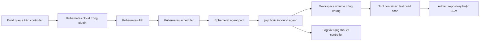

Jenkins có thể cấp một pod ngắn hạn cho đúng một Pipeline hoặc stage, thay vì giữ máy build tồn tại lâu. Cách này giảm drift toolchain và dữ liệu còn sót, đồng thời scale theo queue của từng loại workload. Nó không biến controller thành nơi chạy build: controller vẫn điều phối queue, node và log; lệnh checkout, test và build chạy trong pod agent.

<Callout type="warn" title="Phạm vi tin cậy">
  Ephemeral chỉ nói pod có vòng đời ngắn. `Jenkinsfile`, dependency và mã từ pull request vẫn có thể không tin cậy. Không cấp cùng ServiceAccount, Secret, network hoặc pod template release cho PR/fork.
</Callout>

## Mục lục

- [Bối cảnh và phạm vi](#bối-cảnh-và-phạm-vi)
- [Kiến trúc và vòng đời](#kiến-trúc-và-vòng-đời)
  - [Thành phần và ranh giới trách nhiệm](#thành-phần-và-ranh-giới-trách-nhiệm)
  - [Vòng đời một pod agent](#vòng-đời-một-pod-agent)
- [Kubernetes cloud và pod template](#kubernetes-cloud-và-pod-template)
  - [Kubernetes cloud là cấu hình plugin](#kubernetes-cloud-là-cấu-hình-plugin)
  - [Pod template, inheritance và label](#pod-template-inheritance-và-label)
  - [Cú pháp core, Pipeline và plugin](#cú-pháp-core-pipeline-và-plugin)
- [Pod đa container và workspace](#pod-đa-container-và-workspace)
  - [Container `jnlp` và tool container](#container-jnlp-và-tool-container)
  - [Chạy lệnh bằng `container('name')`](#chạy-lệnh-bằng-containername)
  - [Workspace volume, checkout và dữ liệu bền](#workspace-volume-checkout-và-dữ-liệu-bền)
- [Bảo mật và chuỗi cung ứng image](#bảo-mật-và-chuỗi-cung-ứng-image)
  - [Image pin và provenance](#image-pin-và-provenance)
  - [ServiceAccount, RBAC và network boundary](#serviceaccount-rbac-và-network-boundary)
  - [Secret, pull request và fork](#secret-pull-request-và-fork)
- [Capacity, tài nguyên và retention](#capacity-tài-nguyên-và-retention)
  - [Requests, limits, QoS và eviction](#requests-limits-qos-và-eviction)
  - [Node capacity, quota và thời gian chờ](#node-capacity-quota-và-thời-gian-chờ)
  - [Pod retention và cleanup](#pod-retention-và-cleanup)
- [Jenkinsfile pod template mẫu](#jenkinsfile-pod-template-mẫu)
- [Lab sandbox và manifest dry-run](#lab-sandbox-và-manifest-dry-run)
  - [Điều kiện lab](#điều-kiện-lab)
  - [Manifest policy tối thiểu](#manifest-policy-tối-thiểu)
  - [Các bước dry-run và kết quả mong đợi](#các-bước-dry-run-và-kết-quả-mong-đợi)
- [Chẩn đoán failure](#chẩn-đoán-failure)
- [Checklist trước khi vận hành](#checklist-trước-khi-vận-hành)
- [Nguồn chính thức](#nguồn-chính-thức)
- [Đọc tiếp](#đọc-tiếp)

## Bối cảnh và phạm vi

Một Kubernetes agent là một **dynamic Jenkins agent**. Khi queue cần một executor mang label hoặc pod template phù hợp, Kubernetes plugin yêu cầu Kubernetes API tạo pod. Khi agent kết nối và nhận allocation, Pipeline chạy trong workspace của pod. Kết thúc allocation, plugin dọn pod theo policy. Nếu Kubernetes scheduler không đặt được pod hoặc image không pull được, Jenkins không có executor hữu ích dù cluster vẫn đang chạy.

Mô hình này phù hợp cho test, build và scan có toolchain chuẩn hóa hoặc lưu lượng biến động. Không dùng nó như lý do để đưa mọi đặc quyền vào một YAML: build image đặc quyền, deploy production và mã fork cần pool, identity và network riêng. Nền tảng controller–agent, queue và executor được giải thích tại [Kiến trúc Jenkins](/docs/getting-started/architecture) và [Tổng quan Jenkins Agent](/docs/agents/overview).

## Kiến trúc và vòng đời

### Thành phần và ranh giới trách nhiệm



Controller giữ Pipeline definition, build queue, credential policy, trạng thái và log. Nó gọi plugin để provision nhưng **không tự là build executor**; production nên đặt số executor của built-in node bằng `0`. Kubernetes API xác thực và tạo object; scheduler chọn node theo request, affinity, taint, quota và capacity; kubelet mới kéo image và chạy container. Pod agent chỉ là nơi thực thi tạm thời, không phải kho artifact hay nơi lưu Secret lâu dài.

Sơ đồ là Mermaid. Dự án cần renderer Mermaid đã cấu hình để hiển thị sơ đồ; nếu sao chép sang Fumadocs khác, hãy thêm `fumadocs-mermaid` hoặc renderer tương đương.

### Vòng đời một pod agent

1. **Queue và provision:** Pipeline yêu cầu pod template/label. Kubernetes plugin xét `containerCap`, template và cloud, rồi gọi API bằng identity của controller.
2. **Scheduling và khởi tạo:** pod có thể `Pending` vì quota, request không vừa node, taint, affinity hoặc PVC. Khi được đặt, kubelet pull image, tạo volume và khởi động containers.
3. **Kết nối inbound:** container agent `jnlp` (inbound agent) kết nối Jenkins Remoting về controller. Pod chỉ nhận build khi agent online; `Running` không tự chứng minh Jenkins đã kết nối.
4. **Thực thi:** Jenkins cấp executor, tạo/chọn workspace, checkout và chạy steps. Tool container dùng chung workspace với `jnlp` nhưng không mặc nhiên dùng chung process, home directory hay quyền.
5. **Kết thúc:** Pipeline trả executor. Plugin xóa pod hoặc giữ lại theo `podRetention` để chẩn đoán. `emptyDir` bị mất khi pod bị xóa; artifact cần publish trước thời điểm đó.

<Callout type="info" title="Pod bị mất giữa build">
  Node bị drain, eviction, image/runtime lỗi hoặc lỗi mạng có thể làm pod biến mất. Pipeline durability hay retry không thay thế tính idempotent của build. Hãy lưu artifact trung gian ra kho phù hợp và đặt timeout/retry có giới hạn cho thao tác ngoài.
</Callout>

## Kubernetes cloud và pod template

### Kubernetes cloud là cấu hình plugin

**Kubernetes cloud** là cấu hình của **Kubernetes plugin** trên controller: endpoint/credential Kubernetes API, namespace mặc định, URL để agent liên lạc với controller, giới hạn pod và template. Jenkins core không biết cách tạo `Pod`, không cung cấp Kubernetes scheduler, RBAC, CNI hay container runtime.

Cloud có thể được cấu hình trong UI hoặc Configuration as Code bởi quản trị viên. Credential của cloud là quyền để **controller** tạo, xem, xóa pod trong namespace agent; nó không nên được mount vào pod build. Xác minh từng cloud có namespace và quota riêng, controller URL có DNS/TLS hợp lệ từ pod, và plugin/Jenkins LTS được kiểm thử cùng Kubernetes version của tổ chức. Hướng cài controller nằm ở [Triển khai Jenkins trên Kubernetes](/docs/installation/kubernetes); điều kiện Java, storage và network cơ sở xem tại [Yêu cầu hệ thống](/docs/getting-started/requirements).

### Pod template, inheritance và label

Pod template là contract cho một lớp workload: containers, image, resource, volume, ServiceAccount, node selector, security context và labels Jenkins. Một template có thể nằm trong Kubernetes cloud hoặc do Pipeline khai báo. `inheritFrom 'ci-base'` giúp kế thừa baseline đã review; template Pipeline chỉ nên bổ sung toolchain/stage-specific field cần thiết.

Đặt tên template và Jenkins label theo năng lực lẫn trust tier, chẳng hạn `linux-maven-untrusted` hoặc `release-signing`. Label giúp scheduler Jenkins route workload; nó **không** là ACL Kubernetes. Không dùng cùng template cho PR untrusted và release chỉ vì hai job đều cần Maven.

| Lựa chọn | Ý nghĩa | Quy tắc an toàn |
| --- | --- | --- |
| Template base | Baseline `jnlp`, workspace, security context, request/limit. | Khóa thay đổi bằng review và có owner. |
| Template tool | Bổ sung image Maven, Node hoặc scanner cho một workload. | Kế thừa base thay vì copy nhiều YAML drift. |
| Jenkins label | Điều kiện chọn agent trong queue. | Mô tả capability/trust kiểm chứng được, không thay RBAC. |
| Kubernetes label | Metadata để policy, cost hoặc observability chọn pod. | Không đặt secret hoặc dữ liệu người dùng vào label. |

### Cú pháp core, Pipeline và plugin

Đây là điểm dễ gây lỗi khi nâng cấp. `pipeline`, `stages`, `agent none`, `options`, `timeout` và `skipDefaultCheckout` thuộc Declarative Pipeline (và các plugin Pipeline liên quan), không phải Kubernetes API. `agent { kubernetes { ... } }`, `inheritFrom`, `cloud`, `defaultContainer`, `yaml`, `container('tools')` và `podRetention` là extension của Kubernetes plugin. Pod YAML bên trong trường `yaml` là Kubernetes `PodSpec`, nhưng plugin có thể inject hoặc merge container `jnlp` và workspace mặc định.

Mẫu dưới đây giả định Jenkins LTS hiện hành đã cài **Kubernetes plugin** và Declarative Pipeline, cloud `kubernetes-lab` cùng template `untrusted-base` đã tồn tại, và plugin version hỗ trợ Declarative Kubernetes agent. Tên DSL/field merge có thể đổi giữa plugin releases; đối chiếu [Pipeline Syntax](/docs/pipelines/declarative), trang step của plugin và release đã được phê duyệt trước khi rollout. Không suy ra rằng một `PodSpec` hợp lệ tự trở thành Jenkins agent nếu plugin/cloud chưa cấu hình.

## Pod đa container và workspace

### Container `jnlp` và tool container

Một pod thường có ít nhất hai vai trò:

- `jnlp` là inbound agent container. Nó chạy Jenkins Remoting, nhận lệnh từ controller và thường được plugin tạo/inject. Nếu override image `jnlp`, giữ tên container là `jnlp` và không tự ghi đè command/arguments mà plugin cần để kết nối, trừ khi tài liệu đúng version cho phép.
- Tool container như `maven`, `node` hoặc `scanner` chứa CLI của workload. Nó thường chạy `cat` với `tty: true` để sống trong suốt Pipeline; shell step được gửi vào container này.

Các container chia sẻ network namespace của pod. Do đó `localhost` của tool container có thể nhìn sidecar cùng pod, nhưng không nên thêm database, Docker daemon hay proxy đặc quyền chỉ để tiện. Chúng cũng chỉ chia sẻ filesystem khi cùng mount volume; việc `jnlp` nhìn thấy workspace không nghĩa tool container tự thấy bất kỳ đường dẫn nào khác.

### Chạy lệnh bằng `container('name')`

Kubernetes plugin cung cấp step `container('name')`. Bọc `sh` hoặc `checkout` trong block để chọn tool container rõ ràng; nếu không, step có thể chạy ở `defaultContainer` hoặc `jnlp` tùy cấu hình. Tên phải đúng với `spec.containers[].name` sau khi template được merge.

```groovy
container('tools') {
  sh 'mvn --version'
  sh './mvnw -B -ntp test'
}
```

`container('tools')` không tạo một container mới và không tăng executor. Nó chỉ chuyển execution context của Pipeline vào container đã có trong pod agent. Nếu một stage cần toolchain hoặc trust boundary khác, dùng pod template/pool khác thay vì cài binary vào `jnlp` lúc runtime.

### Workspace volume, checkout và dữ liệu bền

Kubernetes plugin thường tạo workspace volume `emptyDir` dùng chung giữa agent container và tool containers. Nó hợp với source, output tạm và checkout của một allocation: nhanh, bị xóa cùng pod và không cần PVC. Một `emptyDir` có thể nằm trên disk node hoặc memory tùy cấu hình; `medium: Memory` tiêu thụ memory của node/pod, không phải RAM miễn phí.

`defaultContainer 'tools'` làm các step shell mặc định chạy trong tool container, nhưng `checkout scm` vẫn cần được kiểm thử với template của bạn. Dùng `skipDefaultCheckout(true)` rồi checkout có chủ đích ở nơi có tool/credential phù hợp. Mỗi stage có pod agent riêng có thể nhận workspace khác; truyền artifact bằng archive/stash trong phạm vi phù hợp hoặc publish vào artifact repository, thay vì hy vọng `/home/jenkins/agent/workspace` tồn tại ở pod kế tiếp.

| Dữ liệu | Nơi phù hợp | Lưu ý |
| --- | --- | --- |
| Source và output tạm | Workspace `emptyDir`. | Mất khi pod bị xóa; không dùng làm artifact store. |
| Artifact cần giữ | Artifact repository hoặc Jenkins archive theo retention. | Cấp token upload tối thiểu và không publish Secret. |
| Dependency cache | PVC/cache service có scope theo project và trust tier. | Cache ghi được có thể bị poisoning; đặt quota, ownership và cleanup. |
| Secret ngắn hạn | Credential binding hoặc projected Secret tối thiểu. | Tránh cache, archive, log và volume dùng chung ngoài nhu cầu. |

## Bảo mật và chuỗi cung ứng image

### Image pin và provenance

Không dùng `latest`. Pin image tool và inbound agent theo digest bất biến từ registry do tổ chức quản lý, ví dụ `registry.example.invalid/ci/maven@sha256:aaaaaaaaaaaaaaaaaaaaaaaaaaaaaaaaaaaaaaaaaaaaaaaaaaaaaaaaaaaaaaaa`. Digest làm input build tái lập; tag như `maven:3` có thể trỏ image khác theo thời gian.

Pin không tự chứng minh image an toàn. Quy trình provenance nên xác minh nguồn build, SBOM, chữ ký/attestation theo policy, scan CVE và allowlist registry trước khi digest được đưa vào template. Image CI nên chứa toolchain đã review; không `curl | sh` trong Pipeline chỉ vì image thiếu một tool. Theo dõi digest đang dùng và rebuild/review khi base image có bản vá.

<Callout type="error" title="Không cấp Docker socket để giải quyết build image">
  Mount Docker socket hoặc chạy `privileged` có thể đưa mã Pipeline tới quyền node. Không cấp chúng cho PR/fork. Nếu cần build image, dùng builder rootless hoặc dịch vụ build do platform phê duyệt, trong namespace/pool riêng và với quyền registry tối thiểu.
</Callout>

### ServiceAccount, RBAC và network boundary

Có hai identity cần tách:

1. **Controller ServiceAccount/credential cloud** cần verbs tối thiểu để Kubernetes plugin quản lý pod agent trong namespace được chỉ định, chẳng hạn tạo/get/list/watch/delete pod và đọc event cần chẩn đoán. Không cấp `cluster-admin`, không mở quyền toàn cluster chỉ để sửa lỗi provision.
2. **Pod ServiceAccount** là identity mà mã trong container dùng khi gọi Kubernetes API. Phần lớn build test không cần gọi API, vì vậy dùng ServiceAccount không có Role hoặc tắt token automount khi tương thích. Deploy cần ServiceAccount riêng, namespace riêng và Role chỉ cho resource/action cần thiết.

RBAC không kiểm soát network. Dùng NetworkPolicy được CNI enforce để giới hạn ingress/egress riêng cho pool: DNS, controller, SCM, registry và artifact repository là các luồng cần thiết điển hình. Egress của PR/fork không nên đi đến control plane, metadata service, mạng nội bộ nhạy cảm hoặc endpoint deploy. Kiểm tra cả policy lẫn DNS; NetworkPolicy object tồn tại không có nghĩa CNI đang enforce.

`serviceAccountName`, `automountServiceAccountToken: false`, `runAsNonRoot`, bỏ Linux capabilities và `allowPrivilegeEscalation: false` là các guardrail có ích nhưng không thay cho RBAC/NetworkPolicy. Tránh `hostNetwork`, `hostPath`, privileged container và namespace dùng chung giữa trust tier nếu không có threat model được review.

### Secret, pull request và fork

Jenkins Credentials, Kubernetes Secret và token ServiceAccount đều có thể bị script trong build đọc nếu được inject/mount. Masking console log không ngăn script gửi secret ra ngoài. Giữ credential ngoài Jenkinsfile, pod YAML, image layer, command line và artifact; inject đúng stage đáng tin cậy với scope tối thiểu rồi dọn dữ liệu tạm.

PR/fork phải được coi là untrusted. Route chúng vào cloud/template/namespace `untrusted`, không cấp secret deploy, registry write, kubeconfig production, Docker socket, PVC cache chung với release hay egress rộng. Pipeline của nhánh tin cậy mới được xin credential release sau review/policy. Tham khảo [Labels và Executors](/docs/agents/labels-executors) để tách contract pool và [Tổng quan Pipeline](/docs/pipelines/overview) để tổ chức stage/credential rõ ràng.

## Capacity, tài nguyên và retention

### Requests, limits, QoS và eviction

Kubernetes scheduler dùng **requests** CPU/memory để quyết định pod có vừa node hay không. CPU `limit` bị throttling khi vượt; memory vượt `limit` thường dẫn đến `OOMKilled`. Đặt cả request và limit cho **mọi** container, gồm `jnlp` và tool container; request của pod là tổng requests containers (cộng overhead nếu cluster cấu hình), không chỉ tool container đang chạy `mvn`.

QoS phụ thuộc cách request/limit được khai báo trên tất cả containers. Pod `Guaranteed` cần request bằng limit cho CPU và memory ở từng container; `Burstable` có ít nhất một request/limit nhưng không thỏa Guaranteed; `BestEffort` không có request/limit. Khi node chịu memory/disk pressure, BestEffort thường bị eviction trước, nhưng QoS không bảo đảm pod không bị evict. Đừng đặt request thấp giả tạo để pod được schedule: node overcommit sẽ biến queue thành runtime failure.

Ví dụ sizing ban đầu phải đo workload thật. Một test Maven có thể cần `tools` request `500m`/`1Gi`, limit `2`/`2Gi` và `jnlp` request `100m`/`256Mi`, limit `500m`/`512Mi`; đây chỉ là điểm đo lab, không phải giá trị chung. Đo peak với cache cold/warm, số process con, disk ephemeral và image pull trước khi đặt production.

### Node capacity, quota và thời gian chờ

Node có allocatable CPU, memory, ephemeral storage và giới hạn pod; không dùng tổng capacity trên dashboard làm lời hứa cho agent. Scheduler còn xét node selector, affinity, taint/toleration, topology, ResourceQuota, LimitRange, PVC topology và image availability. Matrix/parallel fan-out có thể tạo nhiều pod cùng lúc, vì vậy tính capacity theo template/label và giới hạn fan-out; xem [Pipeline Matrix](/docs/pipelines/matrix) trước khi mở rộng song song.

Đặt các timeout ở nhiều tầng, với mục tiêu rõ ràng:

- `timeout` của Declarative bao quanh stage/Pipeline để release executor và phát hiện pod startup/build treo.
- Timeout của tool như Maven, test runner hoặc SCM tránh process ngoài treo vô hạn.
- Kubernetes plugin/cloud có thời gian chờ provision/connect riêng theo version; kiểm tra cấu hình đang chạy thay vì đoán tên field.
- `activeDeadlineSeconds` của Pod, nếu dùng, có thể cắt build; đặt nó lớn hơn timeout Jenkins có chừa thời gian cleanup, hoặc tránh dùng khi semantics chưa được kiểm thử.

Timeout không sửa được capacity. Nếu pod `Pending`, đọc event và queue reason trước; tăng timeout chỉ kéo dài thời gian chờ khi request không vừa node hoặc quota đã đầy.

### Pod retention và cleanup

`podRetention` là policy của Kubernetes plugin về pod sau khi build kết thúc, không phải Kubernetes garbage collection tổng quát. `Never`/xóa sau run thường là lựa chọn production cho ephemeral workload. Policy giữ pod khi lỗi giúp điều tra `CrashLoopBackOff`, `ImagePullBackOff` hoặc filesystem, nhưng tăng chi phí và rủi ro source/Secret tạm còn tồn tại; đặt TTL/cleanup ngoài plugin theo policy platform nếu giữ pod.

Cleanup cần có hai lớp: plugin xóa pod và Pipeline xóa dữ liệu không còn cần trong workspace/cache. `post { always { ... } }` có thể publish log/metadata không nhạy cảm hoặc thực hiện cleanup plugin đã phê duyệt, nhưng không được che lỗi gốc bằng lệnh xóa bừa. Dọn PVC cache theo lifecycle riêng; xóa pod không xóa PVC độc lập.

## Jenkinsfile pod template mẫu

Ví dụ lab này dùng giá trị minh họa hợp lệ về cấu trúc nhưng không trỏ tới registry/cluster thật. Thay `kubernetes-lab`, `untrusted-base` và digest bằng giá trị đã được review trong sandbox. Pod YAML khai báo rõ cả `jnlp` inbound agent và tool container; Kubernetes plugin sẽ merge template base và quản lý connection arguments của `jnlp`. Không tự đặt command/arguments cho `jnlp` nếu chưa đối chiếu tài liệu đúng plugin version.

```groovy
pipeline {
  agent none

  options {
    skipDefaultCheckout(true)
    timeout(time: 12, unit: 'MINUTES')
  }

  stages {
    stage('Kiểm tra toolchain trong pod ephemeral') {
      agent {
        kubernetes {
          cloud 'kubernetes-lab'
          inheritFrom 'untrusted-base'
          defaultContainer 'tools'
          yaml '''
apiVersion: v1
kind: Pod
metadata:
  labels:
    ci.example.com/trust-tier: untrusted
spec:
  serviceAccountName: jenkins-agent-untrusted
  automountServiceAccountToken: false
  restartPolicy: Never
  securityContext:
    runAsNonRoot: true
  containers:
    - name: jnlp
      image: registry.example.invalid/ci/jenkins-inbound-agent@sha256:bbbbbbbbbbbbbbbbbbbbbbbbbbbbbbbbbbbbbbbbbbbbbbbbbbbbbbbbbbbbbbbb
      resources:
        requests:
          cpu: "100m"
          memory: "256Mi"
        limits:
          cpu: "500m"
          memory: "512Mi"
      securityContext:
        allowPrivilegeEscalation: false
        capabilities:
          drop: ["ALL"]
    - name: tools
      image: registry.example.invalid/ci/maven@sha256:aaaaaaaaaaaaaaaaaaaaaaaaaaaaaaaaaaaaaaaaaaaaaaaaaaaaaaaaaaaaaaaa
      command: ["cat"]
      tty: true
      resources:
        requests:
          cpu: "500m"
          memory: "1Gi"
        limits:
          cpu: "2"
          memory: "2Gi"
      securityContext:
        allowPrivilegeEscalation: false
        capabilities:
          drop: ["ALL"]
'''
        }
      }
      steps {
        container('tools') {
          sh '''
            set -eu
            printf 'node=%s\\nworkspace=%s\\n' "$NODE_NAME" "$WORKSPACE"
            mvn --version
            test -n "$WORKSPACE"
          '''
        }
      }
    }
  }
}
```

Không có checkout hay credential trong mẫu vì mục tiêu là xác minh provisioning. Khi thêm checkout, giữ `skipDefaultCheckout(true)` và dùng `checkout scm` chỉ trong stage/container có đúng trust boundary. Workspace mặc định của plugin là volume tạm dùng chung; nếu template base thay nó bằng PVC, review owner, quota, mount path, quyền file và rủi ro cache poisoning trước.

## Lab sandbox và manifest dry-run

### Điều kiện lab

Lab chỉ hợp lệ trong cluster sandbox do đội platform cho phép. Không dùng kubeconfig production, registry production, SCM thật, Secret thật hay namespace mặc định. Cần một Jenkins lab với controller built-in node `0` executor, Kubernetes plugin đã cài, một cloud trỏ namespace sandbox và policy cho phép controller tạo pod agent. Image trong Jenkinsfile phải được thay bằng image CI đã pin, pull được từ sandbox.

Mục tiêu lab là xác nhận **schema và quyền** trước, sau đó mới chạy Pipeline vô hại. Không áp dụng manifest bên dưới ngoài namespace sandbox đã được phê duyệt.

### Manifest policy tối thiểu

Trước lab, platform owner phải tạo sẵn namespace sandbox `jenkins-agent-lab` qua quy trình được phê duyệt. Namespace không nằm trong manifest này: `kubectl apply --dry-run=server` không persist Namespace, nên không thể làm namespace tồn tại cho các object namespaced theo sau. Lưu manifest **chỉ gồm object namespaced** sau thành `agent-lab-policy.yaml` trên máy lab. Nó minh họa pod identity không có quyền Kubernetes mặc định, quota nhỏ và LimitRange bắt buộc khai báo resource. `Role` cho controller không nằm ở đây vì đó là quyền cloud cấp riêng, phải được platform review theo namespace.

```yaml
apiVersion: v1
kind: ServiceAccount
metadata:
  name: jenkins-agent-untrusted
  namespace: jenkins-agent-lab
automountServiceAccountToken: false
---
apiVersion: v1
kind: ResourceQuota
metadata:
  name: agent-lab-quota
  namespace: jenkins-agent-lab
spec:
  hard:
    requests.cpu: "2"
    requests.memory: 4Gi
    limits.cpu: "4"
    limits.memory: 8Gi
    pods: "4"
---
apiVersion: v1
kind: LimitRange
metadata:
  name: agent-lab-limits
  namespace: jenkins-agent-lab
spec:
  limits:
    - type: Container
      defaultRequest:
        cpu: 100m
        memory: 128Mi
      default:
        cpu: "1"
        memory: 1Gi
```

### Các bước dry-run và kết quả mong đợi

1. Kiểm tra context hiển thị đúng tên sandbox. Nếu không đúng, dừng lại; lệnh tiếp theo không được chạy trên cluster khác.

   ```bash
   kubectl config current-context
   kubectl cluster-info
   ```

   **Kết quả mong đợi:** context và endpoint được đội lab xác nhận, không phải production.

2. Xác minh platform đã tạo sẵn **đúng namespace sandbox** và namespace ở trạng thái `Active`. Đây là điều kiện bắt buộc trước server dry-run; không dùng dry-run để tạo namespace.

   ```bash
   kubectl get namespace jenkins-agent-lab
   ```

   **Kết quả mong đợi:** namespace `jenkins-agent-lab` tồn tại và có `STATUS` là `Active`. Nếu không tồn tại, dừng lab và yêu cầu platform owner tạo nó theo quy trình sandbox; không chạy server dry-run file namespaced trên namespace mới.

3. Kiểm tra cấu trúc chỉ của ServiceAccount, ResourceQuota và LimitRange hoàn toàn ở client; lệnh này không tạo object nào.

   ```bash
   kubectl apply --dry-run=client -f agent-lab-policy.yaml
   ```

   **Kết quả mong đợi:** ba object namespaced báo `configured (dry run)` hoặc `created (dry run)`; lỗi YAML/schema phải được sửa trước.

4. Chỉ trong sandbox được phê duyệt, dùng API server để kiểm tra admission, quota và policy của **các object namespaced trong namespace đã tồn tại**, mà không persist object.

   ```bash
   kubectl apply --dry-run=server -f agent-lab-policy.yaml
   ```

   **Kết quả mong đợi:** server chấp nhận ba object hoặc trả lỗi cụ thể về admission/quota/policy. Không có ServiceAccount, ResourceQuota hay LimitRange nào được tạo sau lệnh. Nếu báo `namespaces "jenkins-agent-lab" not found`, quay lại bước 2; không thay dry-run bằng apply.

5. Sau khi platform đã apply manifest trong sandbox theo quy trình riêng, kiểm tra pod identity không có quyền đọc Secret hoặc tạo Pod. Tên ServiceAccount được dùng qua impersonation, không in token.

   ```bash
   kubectl auth can-i get secrets \
     --as=system:serviceaccount:jenkins-agent-lab:jenkins-agent-untrusted \
     -n jenkins-agent-lab
   kubectl auth can-i create pods \
     --as=system:serviceaccount:jenkins-agent-lab:jenkins-agent-untrusted \
     -n jenkins-agent-lab
   ```

   **Kết quả mong đợi:** cả hai lệnh trả `no` cho template test không cần Kubernetes API. Nếu deploy workflow cần một quyền, tạo Role/RoleBinding riêng, namespaced và review được thay vì mở quyền này cho template test.

6. Cập nhật cloud Jenkins lab để dùng namespace và ServiceAccount này, thay image minh họa bằng digest đã được allowlist, rồi chạy Jenkinsfile mẫu một lần. Console chỉ nên in `NODE_NAME`, `WORKSPACE` và Maven version; không checkout, không credential, không deploy. Xem pod/event trong namespace sandbox để xác nhận request/limit, image digest, `runAsNonRoot` và cleanup sau build.

## Chẩn đoán failure

Bắt đầu từ trạng thái có bằng chứng: Jenkins queue, console, log Kubernetes plugin, `Pod.status` và Events. Đừng xóa pod hoặc tăng quyền trước khi biết failure xảy ra ở queue, API, scheduler, image, Remoting hay tool container.

| Triệu chứng | Kiểm tra theo thứ tự | Hướng xử lý an toàn |
| --- | --- | --- |
| Queue chờ, không có agent | Label/template, `containerCap`, cloud name, plugin log. | Sửa contract/template hoặc capacity đúng pool; không bật executor controller. |
| Pod `Pending` | `kubectl describe pod`, Events, requests, quota, taint/affinity, PVC. | Điều chỉnh request/capacity hoặc quota sandbox sau khi đo; không hạ request giả tạo. |
| `ImagePullBackOff` | Image reference/digest, registry DNS/credential, NetworkPolicy, event. | Sửa allowlist/provenance hoặc registry access; không đổi sang `latest`. |
| Pod `Running` nhưng Jenkins chưa online | Log `jnlp`, Jenkins URL/TLS, proxy WebSocket, plugin compatibility. | Sửa endpoint/CA/version; không tự ghi đè `jnlp` arguments. |
| `OOMKilled` hoặc eviction | Container exit reason, requests/limits, node memory/disk pressure, workload peak. | Tối ưu/resize sau khi đo, tách workload hoặc thêm node headroom. |
| `container('tools')` không tìm thấy | Tên container sau merge, `defaultContainer`, YAML indent/plugin version. | Đối chiếu rendered template và dùng tên chính xác. |
| Artifact mất ở stage sau | Lifecycle pod/workspace, `emptyDir`, allocation boundary. | Archive/publish artifact hoặc checkout lại; không dựa vào pod cũ. |
| Lỗi `Forbidden` API | Controller identity hay pod ServiceAccount, namespace RoleBinding, `kubectl auth can-i`. | Cấp verb/resource namespaced nhỏ nhất cho đúng identity. |

Các lệnh quan sát chỉ chạy trong sandbox/context đã xác nhận:

```bash
kubectl get pods -n jenkins-agent-lab
kubectl get events -n jenkins-agent-lab --sort-by=.lastTimestamp
kubectl describe pod <agent-pod-name> -n jenkins-agent-lab
kubectl logs <agent-pod-name> -n jenkins-agent-lab -c jnlp
kubectl logs <agent-pod-name> -n jenkins-agent-lab -c tools
```

Khi `podRetention` xóa pod quá nhanh, lấy Kubernetes plugin log và event collector trước, hoặc bật retention-on-failure tạm thời trong sandbox với TTL rõ ràng. Không biến giữ pod lỗi thành policy production vô thời hạn.

## Checklist trước khi vận hành

- [ ] Controller/built-in node có `0` executor; Kubernetes agent là nơi chạy code build.
- [ ] Jenkins LTS, Kubernetes plugin, Declarative Pipeline và cluster version đã được kiểm thử như một bộ; DSL plugin không bị coi là Jenkins core.
- [ ] Mỗi Kubernetes cloud có namespace, quota, `containerCap`, controller URL/TLS và identity tối thiểu đã review.
- [ ] Pod template có owner, inheritance rõ, Jenkins label theo capability/trust và không dùng label như ACL.
- [ ] `jnlp`/inbound agent và tool containers có trách nhiệm riêng; `container('name')` dùng đúng container name sau merge.
- [ ] Workspace ephemeral dùng volume tạm; artifact, cache và PVC có lifecycle, ownership, quota và trust scope riêng.
- [ ] Image tool/inbound agent được pin digest, provenance/scan/allowlist đã xác minh; không có `latest`, Docker socket hay privileged container cho untrusted build.
- [ ] Controller identity và pod ServiceAccount được tách; RBAC namespaced tối thiểu, token automount và Secret mount bị hạn chế.
- [ ] NetworkPolicy được CNI enforce, allowlist DNS/controller/SCM/registry/artifact và chặn đường đi không cần thiết, nhất là PR/fork.
- [ ] Mọi container có request/limit đã đo; QoS, eviction, node allocatable, quota và parallel/matrix fan-out được tính cùng nhau.
- [ ] Pipeline/tool/provision timeout và `podRetention` có semantics được kiểm thử; pod/workspace/cache cleanup có TTL hoặc owner.
- [ ] Runbook có queue reason, plugin log, pod Events, container logs, exit reason và quy trình thu hồi/rotate credential khi nghi ngờ lộ secret.

## Nguồn chính thức

- [Jenkins Kubernetes plugin](https://plugins.jenkins.io/kubernetes/) — cài plugin, cloud, pod template và các giới hạn vận hành.
- [Kubernetes plugin Pipeline steps](https://www.jenkins.io/doc/pipeline/steps/kubernetes/) — `podTemplate`, `container` và DSL phụ thuộc plugin.
- [Jenkins Pipeline Syntax](https://www.jenkins.io/doc/book/pipeline/syntax/) — phân biệt cấu trúc Declarative Pipeline với extension plugin.
- [Using Jenkins agents](https://www.jenkins.io/doc/book/using/using-agents/) — controller, agent, executor và workspace.
- [Kubernetes Pods](https://kubernetes.io/docs/concepts/workloads/pods/) — lifecycle và cấu trúc pod.
- [Kubernetes resource management](https://kubernetes.io/docs/concepts/configuration/manage-resources-containers/) — requests, limits và QoS.
- [Kubernetes Pod lifecycle](https://kubernetes.io/docs/concepts/workloads/pods/pod-lifecycle/) — phase, eviction và container state.
- [Kubernetes RBAC](https://kubernetes.io/docs/reference/access-authn-authz/rbac/) — Role, RoleBinding và least privilege.
- [Kubernetes NetworkPolicy](https://kubernetes.io/docs/concepts/services-networking/network-policies/) — điều kiện CNI và network boundary.
- [Kubernetes Secrets](https://kubernetes.io/docs/concepts/configuration/secret/) — giới hạn và cách xử lý Secret.

## Đọc tiếp

<Cards>
  <Card title="Tổng quan Jenkins" href="/docs/getting-started/overview" description="Ôn vai trò controller, Pipeline và agent trước khi scale build." />
  <Card title="Kiến trúc Jenkins" href="/docs/getting-started/architecture" description="Xem queue, executor và đường đi của một build." />
  <Card title="Triển khai Jenkins trên Kubernetes" href="/docs/installation/kubernetes" description="Chuẩn bị controller stateful, Helm, RBAC và NetworkPolicy." />
  <Card title="Chọn agent cho Pipeline" href="/docs/pipelines/agents" description="Chọn agent theo stage, label, Docker hoặc Kubernetes." />
</Cards>
