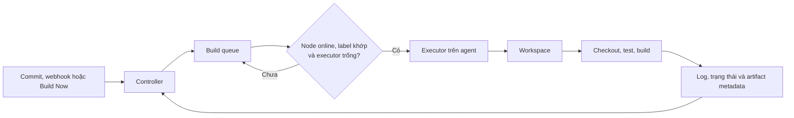

Jenkins tách nơi **điều phối** khỏi nơi **thực thi** để một controller có thể xếp lịch nhiều loại build trên các môi trường phù hợp. Trang này dùng từ _agent_ cho phía chạy workload và _controller_ cho phía giữ trạng thái, queue và chính sách. Mục tiêu là biết chọn agent theo năng lực và trust boundary, không phải biến mọi máy có thể kết nối thành build worker.

<Callout type="warn" title="Nguyên tắc production">
  Không chạy build thông thường, repository không tin cậy hoặc build từ pull request fork trên built-in node của controller. Đặt executor của controller bằng `0`, sau đó route workload sang agent có toolchain và trust boundary phù hợp.
</Callout>

## Mục lục

- [Vai trò và giới hạn](#vai-trò-và-giới-hạn)
- [Mô hình controller và agent](#mô-hình-controller-và-agent)
  - [Đường đi của một workload](#đường-đi-của-một-workload)
  - [Controller điều phối và agent thực thi](#controller-điều-phối-và-agent-thực-thi)
- [Queue executor và workspace](#queue-executor-và-workspace)
  - [Queue và routing bằng labels](#queue-và-routing-bằng-labels)
  - [Executor không phải CPU](#executor-không-phải-cpu)
  - [Workspace và sự cô lập](#workspace-và-sự-cô-lập)
- [Kiểu agent và vòng đời](#kiểu-agent-và-vòng-đời)
  - [Static permanent inbound và dynamic](#static-permanent-inbound-và-dynamic)
  - [Online offline provision retire và reconnect](#online-offline-provision-retire-và-reconnect)
  - [Giả định về transport plugin và mạng](#giả-định-về-transport-plugin-và-mạng)
- [Capacity và cô lập workload](#capacity-và-cô-lập-workload)
  - [Sizing theo pool workload](#sizing-theo-pool-workload)
  - [Bảng trade-off](#bảng-trade-off)
  - [Controller không nhận workload](#controller-không-nhận-workload)
- [Trust boundary và bảo mật](#trust-boundary-và-bảo-mật)
  - [Credential secret và pull request fork](#credential-secret-và-pull-request-fork)
  - [Container VM và rủi ro agent dùng chung](#container-vm-và-rủi-ro-agent-dùng-chung)
- [Jenkinsfile route an toàn](#jenkinsfile-route-an-toàn)
- [Lab sandbox quan sát queue](#lab-sandbox-quan-sát-queue)
  - [Điều kiện lab](#điều-kiện-lab)
  - [Các bước thực hiện](#các-bước-thực-hiện)
  - [Kết quả mong đợi](#kết-quả-mong-đợi)
- [Quan sát và xử lý sự cố](#quan-sát-và-xử-lý-sự-cố)
  - [Tín hiệu cần theo dõi](#tín-hiệu-cần-theo-dõi)
  - [Triage queue và agent offline](#triage-queue-và-agent-offline)
- [Checklist trước khi vận hành](#checklist-trước-khi-vận-hành)
- [Nguồn Jenkins chính thức](#nguồn-jenkins-chính-thức)
- [Đọc tiếp](#đọc-tiếp)

## Vai trò và giới hạn

Controller là dịch vụ Jenkins trung tâm. Nó nhận webhook hoặc lịch chạy, lưu cấu hình job và lịch sử build, giữ build queue, cấp executor, hiển thị log và áp dụng các policy mà Jenkins/plugin hỗ trợ. Agent là máy hoặc môi trường chạy lệnh của Pipeline: checkout source, test, tạo artifact và gửi log/trạng thái về controller.

Sự tách vai trò này không tự tạo bảo mật. Một Pipeline có quyền chạy shell thì source code, dependency và `Jenkinsfile` có thể tác động đến agent được cấp. Vì vậy, điều cần thiết là xác định rõ workload nào được phép vào pool nào, credential nào được cấp và cách dọn sạch môi trường sau khi chạy. Xem bức tranh nền tảng tại [Tổng quan về Jenkins](/docs/getting-started/overview) và [Kiến trúc Jenkins](/docs/getting-started/architecture).

## Mô hình controller và agent

### Đường đi của một workload



Một build đã được trigger vẫn có thể đứng trong queue. Controller chỉ cấp nó khi có agent `Online`, thỏa biểu thức label và còn executor. Nếu dự án cần `linux && docker`, executor rảnh trên agent chỉ có label `windows` không phải là capacity có thể dùng cho build đó.

Sơ đồ dùng Mermaid; dự án này cần renderer Mermaid đã được cấu hình để vẽ sơ đồ. Khi sao chép sang một Fumadocs khác, hãy cấu hình `fumadocs-mermaid` hoặc một renderer tương đương; nếu không, sơ đồ chỉ hiện như code block.

### Controller điều phối và agent thực thi

| Thành phần      | Trách nhiệm chính                                                                              | Không nên dùng để làm gì                                       |
| --------------- | ---------------------------------------------------------------------------------------------- | -------------------------------------------------------------- |
| Controller      | Lưu cấu hình, nhận trigger, giữ queue, chọn node, tổng hợp log/trạng thái và quản trị Jenkins. | Chạy build nặng hoặc code không tin cậy trên built-in node.    |
| Agent hoặc node | Cung cấp OS, toolchain, network policy, executor và workspace để chạy step.                    | Là kho secret lâu dài hoặc một endpoint không được quản trị.   |
| Executor        | Một khe Jenkins cấp cho một allocation tại một thời điểm trên node.                            | Đại diện cho một CPU core hay một VM riêng.                    |
| Workspace       | Thư mục làm việc local của build trên agent.                                                   | Ranh giới bảo mật đầy đủ hoặc nơi lưu artifact/secret dài hạn. |

Trong UI, **node** là cấu hình có tên, labels, remote root directory và số executor. **Agent** là tiến trình kết nối vào node để nhận công việc. Hai từ thường được dùng thay nhau, nhưng phân biệt này giúp khi đọc lỗi: node có thể tồn tại trong cấu hình dù tiến trình agent đang offline.

## Queue executor và workspace

### Queue và routing bằng labels

Queue là danh sách build đã được yêu cầu nhưng chưa được cấp executor. Controller xét sự sẵn sàng của agent, label expression, executor, quiet period và các giới hạn đồng thời trước khi chạy. Queue là cơ chế bảo vệ: không có node phù hợp thì Jenkins chờ thay vì chạy nhầm môi trường.

Labels mô tả năng lực hoặc trust tier có thể kiểm chứng, chẳng hạn `linux`, `arm64`, `java21`, `docker`, `ci-sandbox`, `trusted-release`. Hãy đặt tên theo thuộc tính, không theo tên một máy như `builder-01`; pool có thể mở rộng và thay thế khi labels mô tả yêu cầu thay vì một host duy nhất.

```groovy
agent { label 'linux && ci-sandbox && !trusted-release' }
```

Biểu thức trên route workload vào Linux sandbox và loại trừ pool release. Label chỉ là điều kiện scheduler, **không** là authorization: agent sandbox vẫn cần quyền OS, network policy, credential scope và cấu hình container phù hợp. Cú pháp, `agent any`, `agent none` và các biểu thức label được giải thích sâu hơn tại [Chọn agent cho Pipeline](/docs/pipelines/agents).

### Executor không phải CPU

Một executor là khe Jenkins, không phải CPU core. Agent 4 vCPU có `4` executors không mặc nhiên chạy bốn build nhanh hơn; bốn build Java có thể cùng tranh CPU, RAM, disk, network, cache hoặc Docker daemon. Ngược lại, một build phần lớn chờ I/O có thể sử dụng CPU thấp nhưng vẫn giữ một executor.

Bắt đầu với số executor thận trọng theo loại workload, rồi đo thời lượng, CPU/RAM peak, I/O wait, disk workspace và tỷ lệ queue. Chỉ tăng executor khi tài nguyên còn headroom và build vẫn đạt thời lượng chấp nhận được. Nếu RAM hết hoặc I/O bão hòa, tăng executor sẽ kéo dài mọi build và có thể làm agent mất kết nối.

Ví dụ, pool `linux-java` có 3 agent, mỗi agent 2 executors, có capacity scheduler tối đa 6 allocations. Con số 6 không nói pool có 6 CPU hay chịu được 6 build Gradle nặng. Nếu một build trung bình mất 12 phút và có 10 build đến mỗi 10 phút, nhu cầu đồng thời xấp xỉ 12 build đang chạy hoặc chờ; đó là tín hiệu đo đạc để tách workload, thêm agent hoặc giảm thời lượng, không phải lý do đặt 12 executor trên một máy.

### Workspace và sự cô lập

Sau khi có executor, agent tạo hoặc tái sử dụng workspace để checkout và chạy step. Workspace thường nằm dưới remote root của agent. Nó có thể còn source, cache, file tạm hoặc artifact từ build cũ tùy loại agent và chính sách cleanup.

Workspace của các job khác nhau có đường dẫn khác nhau, nhưng đó không phải sandbox an ninh nếu chúng cùng tài khoản OS hoặc filesystem. Build chạy đồng thời của cùng job cũng có thể nhận workspace có hậu tố khác. Đừng dựa vào tên thư mục để ngăn đọc chéo; quyền file, user/namespace, volume, cleanup và pool riêng mới là các kiểm soát cần thiết.

Thực hành tối thiểu:

- checkout và tạo file chỉ trong `WORKSPACE`; không dùng thư mục dùng chung tùy tiện;
- dọn workspace theo policy sau build, nhất là pool nhận code không tin cậy;
- đặt cache có ownership và key theo dự án/trust tier; không chia cache ghi được giữa untrusted và release;
- publish artifact sang kho được kiểm soát thay vì dùng workspace làm kho lưu trữ;
- khi stage dùng agent khác, truyền artifact qua cơ chế rõ ràng hoặc checkout lại; không giả định cùng filesystem.

## Kiểu agent và vòng đời

### Static permanent inbound và dynamic

Các thuật ngữ dưới đây mô tả hai chiều khác nhau: **lifecycle hạ tầng** và **cách kết nối**. Vì vậy, một agent có thể vừa permanent vừa inbound.

| Kiểu      | Cách hoạt động                                                                                                                   | Phù hợp                                                              | Trade-off chính                                                          |
| --------- | -------------------------------------------------------------------------------------------------------------------------------- | -------------------------------------------------------------------- | ------------------------------------------------------------------------ |
| Static    | Host tồn tại lâu, được cấu hình như node cố định với labels và remote root ổn định.                                              | Toolchain đặc biệt, hardware riêng hoặc cache cần quản trị.          | Patch, disk cleanup và drift cấu hình là trách nhiệm thường xuyên.       |
| Permanent | Static agent được giữ trong Jenkins để phục vụ lặp lại, thay vì tạo cho một build rồi xóa.                                       | Pool nền ổn định, số lượng nhỏ và predictable.                       | Capacity hữu hạn; node lỗi/offline làm queue nếu không có node thay thế. |
| Inbound   | Tiến trình agent chủ động kết nối đến controller bằng Jenkins Remoting; đây là transport/launch direction, không phải lifecycle. | Agent sau NAT/firewall hoặc controller không được phép SSH vào host. | Phải bảo vệ URL/controller identity, agent secret và đường kết nối.      |
| Dynamic   | Cloud/plugin provision một VM, container hoặc pod khi có nhu cầu, rồi thu hồi theo policy.                                       | Workload thay đổi mạnh, cần môi trường sạch hoặc scale theo queue.   | Cần cloud/plugin, image, quota, startup time và observability tốt.       |

Một agent SSH-launched thường là static/permanent nhưng controller mở kết nối đến nó. Một Kubernetes pod do plugin tạo thường là dynamic; pod có thể kết nối inbound về controller. Không nên suy ra mức trust chỉ từ tên kiểu agent: đánh giá image, identity, network và quyền thực tế của workload.

### Online offline provision retire và reconnect

Vòng đời là quá trình vận hành, không chỉ trạng thái xanh/đỏ trong UI.

1. **Provision:** tạo host/pod hoặc node configuration, gán labels, remote root, số executor và launch method. Xác nhận Java, DNS/TLS, disk, toolchain và quyền tối thiểu trước khi nhận workload.
2. **Online:** agent kết nối, controller nhận heartbeat/channel và node có thể nhận allocation nếu không bị tạm dừng. Đây là lúc capacity của node mới có ích cho queue.
3. **Offline:** mất network, Java process dừng, credential launch hết hiệu lực hoặc controller không liên lạc được sẽ làm node offline. Chế độ tạm offline có chủ đích ngăn allocation mới để bảo trì; hành vi build đang chạy cần được quan sát theo loại launcher, plugin và Pipeline durability, không được giả định là luôn tiếp tục an toàn.
4. **Reconnect:** launcher/service hoặc agent process có thể kết nối lại tự động. Sau reconnect, kiểm tra log node, version Java, labels, disk và một build canary trước khi coi node bình thường. Reconnect không chứng minh workspace cũ còn nguyên hoặc build bị gián đoạn đã có thể khôi phục.
5. **Retire:** drain node bằng cách ngăn allocation mới, chờ workload hợp lệ kết thúc hoặc xử lý chúng theo quy trình, thu hồi credential/quyền, lưu dấu vết cần thiết rồi mới xóa node và hạ tầng. Không xóa node đang có build mà không đánh giá tác động.

<Callout type="idea" title="Dùng reconnect như một tín hiệu, không phải một cách chữa lỗi">
  Agent reconnect lặp lại thường chỉ ra network, DNS, TLS/reverse proxy, Java process, resource exhaustion hoặc controller load. Ghi thời điểm và lý do trong node log, sau đó sửa nguyên nhân thay vì tăng retry vô hạn.
</Callout>

### Giả định về transport plugin và mạng

Jenkins agent Java dùng Remoting và `agent.jar`. Cách đưa tiến trình đó lên host phụ thuộc launcher: inbound agent thường chủ động gọi về controller; SSH launch cần plugin SSH Build Agents và quyền SSH phù hợp; cloud agent cần plugin/cloud tương ứng. Docker hoặc Kubernetes agent trong Pipeline cũng cần plugin và runtime/cluster đã được quản trị — Jenkins core không tự tạo Docker daemon hay Kubernetes cluster.

Trước khi dùng một mẫu cấu hình, xác nhận các giả định sau:

- Jenkins LTS, Java của controller/agent và plugin launcher tương thích với policy của phiên bản đang chạy.
- Controller URL có DNS và HTTPS/TLS đúng từ agent. Nếu dùng WebSocket qua reverse proxy, proxy phải cho phép upgrade WebSocket và timeout phù hợp.
- Firewall chỉ mở luồng cần thiết. Với inbound/WebSocket, agent cần đến controller; SSH launch đảo chiều luồng này. Không mở rộng network chỉ để “cho chạy”.
- Image hoặc host agent có toolchain được pin/versioned, account service không có quyền admin mặc định và remote root có quota/cleanup.
- Plugin là mã chạy trên controller. Cập nhật, tương thích và quyền của plugin cần được review như một thay đổi production.

Tham khảo đường cài đặt phù hợp tại [Docker](/docs/installation/docker), [Linux](/docs/installation/linux) hoặc [Kubernetes](/docs/installation/kubernetes). Baseline Java, network và storage nằm ở [Yêu cầu hệ thống](/docs/getting-started/requirements).

## Capacity và cô lập workload

### Sizing theo pool workload

Capacity tốt được tính **theo pool label và loại workload**, không phải tổng executor toàn Jenkins. Một executor `gpu` không thay thế executor `linux && docker`; một pool release không nên bị dùng để hấp thụ queue của PR.

Quy trình sizing lặp lại:

1. Liệt kê pool và trust tier: ví dụ `ci-sandbox`, `linux-java`, `docker-build`, `trusted-release`.
2. Đo mỗi pool: số build đến trong một khoảng, thời lượng p50/p95, thời gian queue, tỷ lệ failure/hủy, CPU/RAM peak, disk và I/O wait.
3. So sánh số allocation đồng thời cần với executor rảnh **cùng label**. Queue dài chỉ ở `docker-build` chỉ ra thiếu/đắt ở pool đó, không chứng minh pool `linux-java` thiếu capacity.
4. Chọn hành động nhỏ nhất có dữ liệu hỗ trợ: tối ưu test/cache an toàn, thêm node cùng pool, tăng kích thước VM, hoặc tăng executor sau khi kiểm thử tải.
5. Giữ headroom cho retry, maintenance và burst. Đo lại sau mọi thay đổi plugin, toolchain, dependency hoặc mức parallelism.

Tách workload nặng như build image, Android, scan bảo mật hoặc matrix lớn khỏi test nhanh. [Pipeline song song](/docs/pipelines/parallel) và [Pipeline matrix](/docs/pipelines/matrix) có thể giảm thời gian phản hồi, nhưng chúng tăng allocations đồng thời; sizing phải tính cả fan-out đó.

### Bảng trade-off

| Lựa chọn                      | Lợi ích                                                             | Chi phí hoặc rủi ro                                                         | Khi nên chọn                                                    |
| ----------------------------- | ------------------------------------------------------------------- | --------------------------------------------------------------------------- | --------------------------------------------------------------- |
| Nhiều executor trên một agent | Giảm queue khi build nhẹ và host còn dư tài nguyên.                 | CPU/RAM/I/O tranh chấp; một host lỗi làm mất nhiều allocation.              | Đã đo workload nhẹ và có giới hạn tài nguyên rõ ràng.           |
| Thêm agent cùng label         | Scale theo pool, giảm single point of capacity và dễ drain.         | Tốn vận hành/image/patching; cần labels nhất quán.                          | Queue kéo dài ở một pool và workload cần song song thật.        |
| Static/permanent agent        | Startup nhanh, toolchain/cache ổn định.                             | Drift, dữ liệu tồn dư và maintenance dài hạn.                               | Có hardware/toolchain đặc thù, owner và cleanup tốt.            |
| Dynamic agent                 | Môi trường mới, scale linh hoạt, dễ thu hồi sau build.              | Provision chậm, phụ thuộc cloud/plugin/image/quota.                         | Burst workload hoặc code không tin cậy cần môi trường ngắn hạn. |
| Container agent               | Đóng gói toolchain, khởi tạo nhanh.                                 | Không phải boundary mạnh nếu privileged, mount hostPath hoặc Docker socket. | Toolchain chuẩn hóa với quyền runtime tối thiểu.                |
| VM riêng                      | Boundary mạnh hơn container thông thường, dễ tách network/identity. | Chậm/tốn kém hơn, vẫn cần patch và IAM tối thiểu.                           | Release, secret nhạy cảm hoặc workload khác trust tier.         |

### Controller không nhận workload

Built-in node dùng chung process host, disk và ranh giới bảo mật với controller. Để controller tập trung vào queue, UI, state và plugin, đặt số executor của nó thành `0`. Cấu hình as code có thể biểu diễn ý định này như sau:

```yaml
jenkins:
  numExecutors: 0
```

Trong UI, đối chiếu giá trị **Number of executors** của controller/built-in node với policy của tổ chức. `numExecutors: 0` không làm controller ngừng điều phối; nó chỉ ngăn scheduler cấp build executor trên controller. Một job thiếu label sau thay đổi này sẽ chờ queue, đây là dấu hiệu cần route job đến agent thay vì bật lại executor controller cho tiện.

## Trust boundary và bảo mật

### Credential secret và pull request fork

Credential được quản lý tại Jenkins nhưng khi Pipeline sử dụng credential, giá trị hoặc file credential có thể hiện diện trong process/môi trường/workspace của agent trong thời gian ngắn. Masking log chỉ giảm việc lộ tình cờ; nó không ngăn script độc hại đọc biến, sao chép file hoặc gửi dữ liệu ra network.

Áp dụng các nguyên tắc sau:

- Cấp credential theo folder/job/environment tối thiểu và chỉ inject vào stage đáng tin cậy cần nó. Không ghi secret trong Jenkinsfile, command line, artifact, cache hay console output.
- Tách pool `trusted-release` khỏi pool chạy PR/fork. Build từ fork hoặc mã do người ngoài đóng góp phải được coi là untrusted, kể cả khi chỉ “chạy test”.
- Không cho PR/fork đọc credential deploy, token registry ghi, kubeconfig production hoặc network nội bộ nhạy cảm. Cấu hình SCM/Multibranch có thể khác giữa provider/plugin; kiểm tra chính sách fork và thực hiện review trước khi bật build tự động.
- Không chạy build untrusted trên controller. Hạn chế script approval, quyền Docker và quyền sudo; một Jenkinsfile được review không làm dependency bên dưới trở nên tin cậy.
- Dùng identity, network egress và IAM riêng cho từng trust tier. Labels hỗ trợ routing nhưng không thay thế các kiểm soát này.

### Container VM và rủi ro agent dùng chung

Container tạo packaging tốt cho toolchain nhưng không mặc định là boundary đủ mạnh. Container `privileged`, mount Docker socket, mount hostPath, chạy root hoặc có service account quá quyền có thể dẫn workload đến quyền host/cluster. Một VM tách biệt thường cho ranh giới mạnh hơn, đặc biệt khi kèm network segment, IAM tối thiểu, image được vá và không chia disk; tuy vậy VM cũng không an toàn nếu identity hoặc network quá rộng.

Agent dùng chung giữa các dự án hoặc trust tier có các rủi ro thực tế: đọc workspace/cache còn sót, process nền của build trước, tranh disk, poisoning dependency cache, lộ metadata network và leo thang qua daemon chung. Chọn một trong các cách giảm rủi ro: agent ephemeral cho untrusted build, VM/pool riêng cho release, user/namespace/volume riêng, cache read-only hoặc key phân vùng, và cleanup đã kiểm chứng. Không gán `docker` hay `trusted-release` cho pool chung chỉ để giảm queue.

## Jenkinsfile route an toàn

Jenkinsfile Declarative dưới đây chỉ chạy trên pool sandbox có label rõ ràng, tắt checkout mặc định, không dùng credential và chỉ in metadata không nhạy cảm. `sleep` tạo một cửa sổ để quan sát allocation; bỏ nó trong Pipeline bình thường.

```groovy
pipeline {
  agent none

  options {
    skipDefaultCheckout(true)
    timeout(time: 3, unit: 'MINUTES')
  }

  stages {
    stage('Quan sát sandbox') {
      agent { label 'linux && ci-sandbox && !trusted-release' }

      steps {
        sh '''
          printf 'node=%s\n' "$NODE_NAME"
          printf 'workspace=%s\n' "$WORKSPACE"
          test -n "$WORKSPACE"
          sleep 90
        '''
      }
    }
  }
}
```

`agent none` ở cấp Pipeline giúp không giữ executor ngoài stage cần chạy. Label loại trừ release pool là một guardrail routing, còn an toàn thật phụ thuộc vào pool `ci-sandbox` không có credential/egress/quyền đặc biệt. Xem cấu trúc Pipeline tại [Tổng quan Pipeline](/docs/pipelines/overview) và [Declarative Pipeline](/docs/pipelines/declarative).

## Lab sandbox quan sát queue

Lab này tạo **một agent sandbox tạm thời** hoặc dùng một agent lab đã được cô lập. Nó không yêu cầu hạ tầng production, repository thật, credential thật, Docker socket hay truy cập môi trường triển khai. Mục tiêu là thấy queue, executor và workspace bằng một Pipeline vô hại.

### Điều kiện lab

- Một Jenkins lab riêng hoặc controller học tập; built-in node vẫn để `numExecutors: 0`.
- Một host Linux disposable cho lab, có Java tương thích Jenkins, disk trống và chỉ quyền user thường. Có thể là VM/container lab nếu cách chạy đó không cấp privileged mode, host mount hay Docker socket.
- Host chỉ mang labels `linux ci-sandbox`; không gán `trusted-release`, `docker`, credential hoặc route mạng production.
- Plugin Pipeline: Declarative đã có để chạy Jenkinsfile. Nếu chọn inbound/WebSocket, controller URL và reverse proxy của lab phải hỗ trợ transport đó.

### Các bước thực hiện

1. Trong **Manage Jenkins → Nodes**, tạo node permanent tên `lab-linux`, remote root dành riêng cho lab và **1 executor**. Gán labels `linux ci-sandbox`. Chọn launch method inbound cho host sandbox, rồi thực hiện đúng lệnh khởi động agent mà trang node của Jenkins lab hiển thị. Giữ agent secret ngoài Jenkinsfile, shell history và log.
2. Chờ node hiển thị `Online`. Mở log node và xác nhận Java/transport kết nối thành công. Nếu node không online, chưa tạo job để “thử may mắn”; xử lý DNS/TLS, Java hoặc firewall trước.
3. Tạo một Pipeline job trong UI, không liên kết SCM, dán Jenkinsfile ở mục [Jenkinsfile route an toàn](#jenkinsfile-route-an-toàn), sau đó chọn **Build Now** lần thứ nhất.
4. Trong lúc build đầu đang `sleep 90`, chọn **Build Now** lần thứ hai. Vì `lab-linux` chỉ có một executor, build thứ hai phải ở Build Queue thay vì chạy trên controller.
5. Mở **Build Queue**, trang node `lab-linux` và **Console Output** của cả hai build. Sau khi build đầu kết thúc, xác nhận build thứ hai được cấp cùng pool và chạy tiếp.
6. Kết thúc lab: đặt node tạm offline để không nhận build mới, chờ hai build kết thúc, dừng tiến trình agent và xóa node/host sandbox theo quy trình lab. Không tái sử dụng workspace sandbox cho release.

### Kết quả mong đợi

| Quan sát      | Kết quả đúng                                                                                   | Nếu khác kỳ vọng                                                             |
| ------------- | ---------------------------------------------------------------------------------------------- | ---------------------------------------------------------------------------- |
| Node          | `lab-linux` là `Online`, có label `linux ci-sandbox` và 1 executor.                            | Xem node log, Java, DNS/TLS và launch method.                                |
| Build đầu     | Chạy trên `lab-linux`; console in `NODE_NAME` và `WORKSPACE`.                                  | Kiểm tra label Jenkinsfile và job có bị sửa checkout/agent không.            |
| Build thứ hai | Hiện trong queue với lý do tương đương không còn executor phù hợp; không chạy trên controller. | Xác nhận controller có 0 executor và node sandbox thật sự chỉ có 1 executor. |
| Sau 90 giây   | Build đầu trả executor, build thứ hai bắt đầu.                                                 | Kiểm tra giới hạn đồng thời, offline state và lỗi step của build đầu.        |

## Quan sát và xử lý sự cố

### Tín hiệu cần theo dõi

Quan sát controller và từng pool agent, không chỉ trạng thái `SUCCESS`:

- độ dài queue và thời gian chờ theo label/job; lý do Jenkins hiển thị cho mục queue;
- số agent `Online`/offline, reconnect count, thời gian provision và executor bận/rảnh;
- p50/p95 duration, failure/abort rate, retry và thời gian giữ executor của từng loại workload;
- CPU, RAM, disk free, inode, I/O wait, network errors và process agent trên host;
- kích thước workspace/cache, tốc độ cleanup, artifact retention và dung lượng `JENKINS_HOME`;
- log controller, node log, audit log và thay đổi plugin/configuration gần thời điểm lỗi.

Jenkins core hiển thị queue, node và console log. Metrics dashboard, log aggregation hay alert cụ thể thường cần plugin hoặc nền tảng observability ngoài; kiểm tra plugin đó được hỗ trợ và có owner trước khi coi số liệu là nguồn chính thức.

### Triage queue và agent offline

| Triệu chứng                           | Kiểm tra theo thứ tự                                                                    | Hướng xử lý an toàn                                                                                  |
| ------------------------------------- | --------------------------------------------------------------------------------------- | ---------------------------------------------------------------------------------------------------- |
| Queue dài, không có node phù hợp      | Label trong Jenkinsfile, labels node, trạng thái online.                                | Sửa label hoặc provision đúng pool; không chuyển build sang controller.                              |
| Mọi executor cùng label bận           | Queue reason, duration, CPU/RAM/I/O và giới hạn concurrent builds.                      | Tối ưu workload hoặc thêm capacity cùng pool; chỉ tăng executor sau khi đo.                          |
| Agent offline hoặc reconnect liên tục | Node log, service/process agent, DNS/TLS, proxy WebSocket, Java và resource exhaustion. | Sửa network/process/version, chạy canary sau reconnect.                                              |
| Build sai toolchain                   | Label, image/host version, PATH và tool configuration.                                  | Pin/chuẩn hóa image hoặc tạo pool label đúng năng lực.                                               |
| File lạ hoặc cache gây lỗi            | Workspace, ownership, cache key, cleanup và agent sharing.                              | Isolate pool/cache, cleanup và dùng agent ephemeral cho untrusted workload.                          |
| Có dấu hiệu secret lộ                 | Console log, artifact, process/workspace access và credential scope.                    | Thu hồi/rotate secret theo quy trình, dừng cấp cho pool bị ảnh hưởng và điều tra trước khi chạy lại. |

## Checklist trước khi vận hành

- [ ] Controller/built-in node có `numExecutors: 0`; không có workload untrusted chạy trên controller.
- [ ] Mỗi pool có labels theo năng lực và trust tier, không dùng tên host làm requirement mặc định.
- [ ] Số executor được chọn từ số liệu CPU, RAM, I/O, disk và queue theo từng label, không từ số CPU core đơn lẻ.
- [ ] Agent có lifecycle rõ: provision, health check, reconnect, drain/retire và owner vận hành.
- [ ] Transport, Java compatibility, TLS/DNS, firewall và plugin launcher đã được kiểm tra trong môi trường tương ứng.
- [ ] Workspace, cache, artifact và cleanup có ownership/retention; không coi workspace là security boundary.
- [ ] PR/fork và workload untrusted chỉ vào sandbox riêng, không có credential deploy hay access production.
- [ ] Container không privileged và không có host mount/Docker socket khi không thật sự cần; release có boundary mạnh hơn.
- [ ] Queue, node log, resource saturation và thay đổi plugin/config được quan sát, có runbook triage.

## Nguồn Jenkins chính thức

- [Using Jenkins agents](https://www.jenkins.io/doc/book/using/using-agents/) — khái niệm node, executor và phân tán build.
- [Managing nodes](https://www.jenkins.io/doc/book/managing/nodes/) — cấu hình và quản trị node/agent.
- [Distributed builds](https://www.jenkins.io/doc/book/scaling/architecting-for-scale/) — các cân nhắc khi mở rộng controller và agent.
- [Pipeline Syntax](https://www.jenkins.io/doc/book/pipeline/syntax/) — cú pháp `agent`, labels và Declarative Pipeline.
- [Jenkins Security](https://www.jenkins.io/doc/book/security/) — mô hình bảo mật và hardening Jenkins.
- [Java Support Policy](https://www.jenkins.io/doc/book/platform-information/support-policy-java/) — đối chiếu Java với Jenkins LTS.
- [Jenkins Plugins](https://plugins.jenkins.io/) — kiểm tra plugin launcher, cloud và Pipeline trước khi áp dụng.

## Đọc tiếp

<Cards>
  <Card title="Kiến trúc Jenkins" href="/docs/getting-started/architecture" description="Xem queue, executor và luồng build từ trigger đến kết quả." />
  <Card title="Yêu cầu hệ thống" href="/docs/getting-started/requirements" description="Chuẩn bị Java, network, storage và baseline capacity." />
  <Card title="Chọn agent cho Pipeline" href="/docs/pipelines/agents" description="Dùng agent, label, Docker và Kubernetes agent trong Jenkinsfile." />
  <Card title="Declarative Pipeline" href="/docs/pipelines/declarative" description="Tổ chức Jenkinsfile với stage, policy và agent rõ ràng." />
</Cards>
