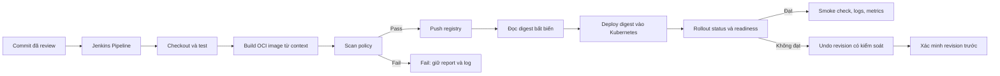

<Callout type="info" title="Phạm vi">
  Đây là một case study cho ứng dụng HTTP nhỏ tên `web-api`. Local lab chỉ tạo và kiểm tra file trong thư mục tạm; Docker, Jenkins và Kubernetes là runtime tùy chọn, không được giả định đang chạy. Ví dụ production là design cần được đội platform review, không phải lệnh áp dụng vào cluster đang vận hành.
</Callout>

Một commit chỉ đáng tin để triển khai khi source, image, quyền và bằng chứng rollout đều truy vết được. Case study này nối các phần đó trong một Jenkins Pipeline: agent build tạo image, scanner kiểm tra policy, registry lưu artifact, còn một identity Kubernetes chỉ được cập nhật đúng workload trong namespace đích.

## Mục lục

- [Bối cảnh và mục tiêu](#bối-cảnh-và-mục-tiêu)
  - [Kết quả học được](#kết-quả-học-được)
  - [Phân biệt local lab và production](#phân-biệt-local-lab-và-production)
- [Kiến trúc và luồng phát hành](#kiến-trúc-và-luồng-phát-hành)
  - [Thành phần và ranh giới](#thành-phần-và-ranh-giới)
  - [Luồng commit đến rollback](#luồng-commit-đến-rollback)
- [Hợp đồng artifact và quyền](#hợp-đồng-artifact-và-quyền)
  - [Build context, tag và digest](#build-context-tag-và-digest)
  - [Credentials và identity](#credentials-và-identity)
- [Jenkinsfile tham chiếu](#jenkinsfile-tham-chiếu)
  - [Điều kiện agent và plugin](#điều-kiện-agent-và-plugin)
  - [Các stage và quality gate](#các-stage-và-quality-gate)
  - [Jenkinsfile](#jenkinsfile)
- [Dockerfile và build context](#dockerfile-và-build-context)
  - [Dockerfile mẫu](#dockerfile-mẫu)
  - [.dockerignore và secret](#dockerignore-và-secret)
- [Kubernetes: workload sẵn sàng để rollout](#kubernetes-workload-sẵn-sàng-để-rollout)
  - [Deployment và Service](#deployment-và-service)
  - [ServiceAccount và RBAC tối thiểu](#serviceaccount-và-rbac-tối-thiểu)
  - [Namespace và network boundary](#namespace-và-network-boundary)
- [Registry, scan và provenance](#registry-scan-và-provenance)
  - [Quét trước khi push](#quét-trước-khi-push)
  - [Push, digest và ký](#push-digest-và-ký)
- [Rollout, quan sát và rollback](#rollout-quan-sát-và-rollback)
  - [Readiness và bằng chứng triển khai](#readiness-và-bằng-chứng-triển-khai)
  - [Rollback có kiểm soát](#rollback-có-kiểm-soát)
- [Local lab tái lập, không cần runtime](#local-lab-tái-lập-không-cần-runtime)
  - [Điều kiện và guard](#điều-kiện-và-guard)
  - [Tạo fixture và static validation](#tạo-fixture-và-static-validation)
  - [Tùy chọn chạy Docker hoặc Kubernetes](#tùy-chọn-chạy-docker-hoặc-kubernetes)
  - [Cleanup có guard](#cleanup-có-guard)
- [Phân biệt các mức validation](#phân-biệt-các-mức-validation)
- [Troubleshooting](#troubleshooting)
- [Trade-offs và quyết định production](#trade-offs-và-quyết-định-production)
- [Checklist release](#checklist-release)
- [Bài tập và bằng chứng mong đợi](#bài-tập-và-bằng-chứng-mong-đợi)
- [Nguồn chính thức và đọc tiếp](#nguồn-chính-thức-và-đọc-tiếp)

## Bối cảnh và mục tiêu

`web-api` là một service stateless. Mỗi merge vào nhánh phát hành tạo một OCI image, quét image đó, đưa nó vào registry nội bộ và cập nhật một `Deployment` trong namespace `web-api-staging`. Pipeline không deploy từ pull request hoặc branch chưa được bảo vệ. Pull request chỉ nhận các stage không có registry-write hay kubeconfig deploy.

### Kết quả học được

Sau case study này, bạn có thể:

- tách Jenkins controller khỏi agent build/deploy và chọn label theo năng lực lẫn mức tin cậy;
- biến commit thành image tag duy nhất, ghi lại digest registry bất biến, rồi deploy bằng digest;
- giữ registry credential và kubeconfig trong Jenkins Credentials, chỉ nạp ở stage tin cậy cần dùng;
- thiết kế `Deployment` có readiness probe, Service, ServiceAccount và quyền Kubernetes namespaced nhỏ nhất;
- đọc rollout, pod events, logs và metrics trước khi rollback một revision đã biết;
- tạo local fixture bằng `mktemp` có marker/parent guard, kể cả khi máy không có Docker, Jenkins hay Kubernetes.

### Phân biệt local lab và production

| Nội dung | Local lab trong bài | Thiết kế production |
| --- | --- | --- |
| Jenkins | Có thể không cài; chỉ kiểm tra file mẫu. | Controller có persistent state, built-in node đặt `0` executor và agent tách biệt. |
| Build image | Có thể chỉ kiểm tra Dockerfile. | Builder/agent riêng, version tool đã pin, quota và cache theo trust tier. |
| Registry | Không push. | Repository riêng, token write tối thiểu, retention, scan và policy provenance. |
| Kubernetes | Có thể dùng `--dry-run=client` nếu có `kubectl`. | Namespace riêng, RBAC namespaced, NetworkPolicy được CNI enforce và audit. |
| Cleanup | Chỉ xóa thư mục tạm có marker. | Theo runbook owner; không chạy dọn dẹp toàn cluster, toàn Docker host hay registry. |

<Callout type="warn" title="Không coi lab là production">
  Docker socket và container `privileged` không xuất hiện trong thiết kế này. Nếu builder cần đặc quyền, cô lập nó trên pool/VM riêng; đừng mount socket vào Jenkins controller hoặc cấp nó cho workload pull request. Xem thêm [Docker Agents](/docs/agents/docker-agents) và [Kubernetes Ephemeral Agents](/docs/agents/kubernetes-agents).
</Callout>

## Kiến trúc và luồng phát hành

### Thành phần và ranh giới

Controller chỉ điều phối queue, trạng thái và credential policy. Build/scan chạy trên agent `linux && image-builder` không nhận credential publish; push/deploy chạy trên agent `trusted-release` có label tool tương ứng. Labels không phải ACL, nhưng giúp không route stage release sang controller hoặc pool pull request.

```text
Git repository ──commit──> Jenkins controller
                              │ điều phối, không build
              ┌───────────────┴────────────────┐
              ▼                                ▼
  agent image-builder                  agent trusted-release
  build + scan + OCI archive                   │ push + kubeconfig deploy tối thiểu
              │                               ▼
              ▼                       Registry và namespace staging
     artifact đã quét                       Deployment + Service
     tag duy nhất + digest                       │
              │                                  ▼
              └──────────── evidence ──> logs, events, metrics
```

Agent image-builder chỉ lấy source, kéo base image, build/scan và tạo OCI archive; nó không có token publish. Agent trusted-release mới push đúng repository rồi gọi API Kubernetes cho namespace/revision đích; agent deploy không cần Docker daemon. Build của fork không có credential registry write hoặc kubeconfig deploy; nếu có pool `untrusted-pr` riêng, route build/scan vào pool đó theo policy Jenkins.

### Luồng commit đến rollback



Repository này đã cấu hình renderer cho Mermaid. Sơ đồ mô tả control flow; image layer và artifact nên đi trực tiếp giữa agent, registry và Kubernetes thay vì qua controller khi hạ tầng hỗ trợ.

## Hợp đồng artifact và quyền

### Build context, tag và digest

**Build context** là toàn bộ file Docker client gửi cho builder. Context quá rộng vừa làm build chậm vừa có thể đưa `.git`, file cấu hình hay secret vào cache. Chỉ gửi source, lockfile và file cần thiết qua `.dockerignore`.

Một tag duy nhất như `registry.example.invalid/team/web-api:git-a1b2c3d4e5f6-build-42` hữu ích để con người tìm build. Nó không phải identity bất biến: registry có thể bị cấu hình để ghi đè tag. Sau push, Pipeline phải lấy **digest** và deploy tham chiếu `repository@sha256:...`; digest mới là nội dung đã được registry xác nhận.

| Dữ liệu cần lưu | Ví dụ không nhạy cảm | Mục đích |
| --- | --- | --- |
| Source revision | `a1b2c3d4e5f6` | Liên kết image với commit. |
| Tag build | `git-a1b2c3d4e5f6-build-42` | Tra cứu dễ đọc và retention. |
| Digest | `sha256:<64-hex>` | Deploy/rollback đúng nội dung. |
| Kết quả scan | `reports/trivy.json` | Bằng chứng quality gate. |
| Rollout revision | `deployment.apps/web-api=7` | Liên kết deploy với trạng thái Kubernetes. |

### Credentials và identity

Không đặt token trong `Jenkinsfile`, Dockerfile, manifest, URL, command line hay log. Trong ví dụ:

- `registry-publish` là credential username/password có quyền push **một** repository release. `docker login --password-stdin` đọc password từ stdin, không dùng `--password`.
- `kubeconfig-web-api-staging-deployer` là credential file chỉ chứa identity deploy namespaced. Nó không phải `cluster-admin` và không được dùng để provision cluster.
- Ký image, nếu policy yêu cầu, dùng identity workload federation hoặc key từ secret manager trong stage release. Không tạo private key trong Git hay cố in nó để debug.

`withCredentials` giữ credential trong closure ngắn. Nó vẫn không biến script chạy trong closure thành an toàn; code, agent và egress của stage đó phải được tin cậy. Xem [Credentials trong Pipeline](/docs/pipelines/credentials) để chọn binding và tránh lộ secret.

## Jenkinsfile tham chiếu

### Điều kiện agent và plugin

Mẫu giả định Jenkins LTS đã có Declarative Pipeline, Git, Credentials Binding, **Timestamper** cho directive `timestamps()` và agent Linux phù hợp. Xác minh phiên bản plugin tương thích Jenkins LTS trên controller đang chạy trước khi dùng directive/step; plugin không phải Jenkins core. Agent image-builder có Docker CLI/BuildKit, `gzip`, `trivy` `0.58.1`, `syft` `1.20.0` và `cosign` `2.4.1` được platform cài hoặc đóng gói trong image agent đã review. Agent deploy có `kubectl` `1.31.4`; Kubernetes API server phải nằm trong skew version mà tổ chức hỗ trợ.

Đây là version pin của ví dụ để review. Khi nâng, thay đổi catalog tool/image bằng pull request, kiểm tra changelog và thử trên sandbox trước. Đọc cấu trúc Declarative tại [Jenkinsfile](/docs/pipelines/jenkinsfile) và quy tắc chọn executor tại [Chọn agent cho Pipeline](/docs/pipelines/agents).

### Các stage và quality gate

| Stage | Đầu vào | Kết quả/pass condition | Quyền cần có |
| --- | --- | --- | --- |
| `Checkout và test` | Commit được Jenkins chọn | Test pass, report không nhạy cảm | Đọc SCM |
| `Build và scan image` | Dockerfile, context nhỏ và image local | Policy scan pass, SBOM, OCI archive | Builder không có registry write |
| `Push registry và lấy digest` | OCI archive đã quét, chỉ `main` không phải PR | Digest registry và tag build | Builder `trusted-release`, registry write tối thiểu |
| `Deploy staging` | Digest đã push, chỉ `main` không phải PR | Deployment dùng đúng digest | Patch deployment namespaced |
| `Verify rollout` | Revision mới | Rollout/readiness pass, evidence lưu | Get/list/watch/log namespaced |

`Scan image` đứng trước `Push` để chặn artifact không qua policy. Tổ chức có thể cần scan lại digest sau push, admission policy tại cluster và kiểm tra chữ ký ở cả deploy time; một scanner trong CI không thay thế các lớp đó.

### Jenkinsfile

```groovy
pipeline {
  agent none

  options {
    skipDefaultCheckout(true)
    timestamps()
    disableConcurrentBuilds()
    timeout(time: 30, unit: 'MINUTES')
  }

  environment {
    REGISTRY = 'registry.example.invalid'
    IMAGE_REPOSITORY = 'team/web-api'
    KUBE_NAMESPACE = 'web-api-staging'
    KUBE_DEPLOYMENT = 'web-api'
  }

  stages {
    stage('Checkout và test') {
      agent { label 'linux && node22' }
      steps {
        checkout scm
        sh '''
          set -eu
          node --version
          npm ci
          npm test
        '''
      }
      post {
        always {
          junit allowEmptyResults: true, testResults: 'reports/junit.xml'
        }
        cleanup {
          deleteDir()
        }
      }
    }

    stage('Build và scan image') {
      agent { label 'linux && image-builder' }
      steps {
        checkout scm
        sh '''
          set -eu
          SHORT_SHA="$(git rev-parse --short=12 HEAD)"
          IMAGE_TAG="${REGISTRY}/${IMAGE_REPOSITORY}:git-${SHORT_SHA}-build-${BUILD_NUMBER}"
          printf '%s' "$IMAGE_TAG" > image-tag.txt
          DOCKER_BUILDKIT=1 docker build --pull --tag "$IMAGE_TAG" .
          mkdir -p reports
          trivy image --version
          trivy image --exit-code 1 --severity HIGH,CRITICAL \
            --ignore-unfixed --format json --output reports/trivy.json "$IMAGE_TAG"
          syft "${IMAGE_TAG}" --output cyclonedx-json > reports/sbom.cdx.json
          docker image save "$IMAGE_TAG" | gzip > image-oci.tar.gz
        '''
        stash includes: 'image-tag.txt,image-oci.tar.gz', name: 'scanned-image'
      }
      post {
        always {
          archiveArtifacts artifacts: 'reports/*.json', allowEmptyArchive: true, fingerprint: true
        }
        cleanup {
          deleteDir()
        }
      }
    }

    stage('Push registry và lấy digest') {
      when {
        beforeAgent true
        allOf {
          branch 'main'
          not { changeRequest() }
        }
      }
      agent { label 'linux && image-builder && trusted-release' }
      steps {
        unstash 'scanned-image'
        sh '''
          set -eu
          IMAGE_TAG="$(cat image-tag.txt)"
          gzip --stdout --decompress image-oci.tar.gz | docker image load
          docker image inspect "$IMAGE_TAG" >/dev/null
        '''
        withCredentials([
          usernamePassword(
            credentialsId: 'registry-publish',
            usernameVariable: 'REGISTRY_USER',
            passwordVariable: 'REGISTRY_PASSWORD'
          )
        ]) {
          sh '''
            set -eu
            set +x
            IMAGE_TAG="$(cat image-tag.txt)"
            printf '%s' "$REGISTRY_PASSWORD" | docker login "$REGISTRY" \
              --username "$REGISTRY_USER" --password-stdin
            docker push "$IMAGE_TAG"
            DIGEST="$(docker buildx imagetools inspect "$IMAGE_TAG" --format '{{.Digest}}')"
            test -n "$DIGEST"
            printf '%s@%s' "${REGISTRY}/${IMAGE_REPOSITORY}" "$DIGEST" > image-digest.txt
            docker logout "$REGISTRY"
          '''
        }
        archiveArtifacts artifacts: 'image-tag.txt,image-digest.txt', fingerprint: true
        stash includes: 'image-digest.txt', name: 'release-image'
      }
      post {
        cleanup {
          deleteDir()
        }
      }
    }

    stage('Deploy staging') {
      when {
        beforeAgent true
        allOf {
          branch 'main'
          not { changeRequest() }
        }
      }
      agent { label 'linux && kubectl && trusted-release' }
      steps {
        unstash 'release-image'
        withCredentials([
          file(credentialsId: 'kubeconfig-web-api-staging-deployer', variable: 'KUBECONFIG_FILE')
        ]) {
          sh '''
            set -eu
            set +x
            IMAGE_REF="$(cat image-digest.txt)"
            kubectl --kubeconfig "$KUBECONFIG_FILE" -n "$KUBE_NAMESPACE" \
              set image deployment/"$KUBE_DEPLOYMENT" web-api="$IMAGE_REF" \
              --record=false
          '''
        }
      }
      post {
        cleanup {
          deleteDir()
        }
      }
    }

    stage('Verify rollout') {
      when {
        beforeAgent true
        allOf {
          branch 'main'
          not { changeRequest() }
        }
      }
      agent { label 'linux && kubectl && trusted-release' }
      steps {
        withCredentials([
          file(credentialsId: 'kubeconfig-web-api-staging-deployer', variable: 'KUBECONFIG_FILE')
        ]) {
          sh '''
            set -eu
            set +x
            kubectl --kubeconfig "$KUBECONFIG_FILE" -n "$KUBE_NAMESPACE" \
              rollout status deployment/"$KUBE_DEPLOYMENT" --timeout=180s
            kubectl --kubeconfig "$KUBECONFIG_FILE" -n "$KUBE_NAMESPACE" \
              get deployment/"$KUBE_DEPLOYMENT" -o json > rollout-deployment.json
            kubectl --kubeconfig "$KUBECONFIG_FILE" -n "$KUBE_NAMESPACE" \
              get pods -l app.kubernetes.io/name=web-api -o wide > rollout-pods.txt
          '''
        }
        archiveArtifacts artifacts: 'rollout-deployment.json,rollout-pods.txt', fingerprint: true
      }
      post {
        cleanup {
          deleteDir()
        }
      }
    }
  }
}
```

`checkout scm` được lặp ở stage dùng agent khác vì stage-level agent có thể là máy khác. `Build và scan image` không nạp credential publish, nên vẫn chạy cho pull request. `Push registry và lấy digest` chỉ được xét trước khi cấp agent khi source là branch `main` và không phải `changeRequest`; branch protection của SCM/Jenkins phải bảo đảm chỉ source đã review mới có thể vào `main`. Vì `withCredentials(registry-publish)` nằm bên trong stage đã gate, PR không bind token registry. Image được chuyển qua OCI archive có chủ đích; với image lớn, không stash qua controller mà dùng artifact manager hoặc cơ chế transfer đã review. `junit` chạy trong `post { always }` của stage test, còn mỗi `deleteDir()` chạy trong `post { cleanup }` của stage có agent; report/artefact được publish trước cleanup và Pipeline cấp cao `agent none` không giả định workspace. Deploy chỉ nhận `image-digest.txt` qua `stash`, không cần Docker daemon hay workspace build. Production vẫn nên scan lại digest sau push vào registry để tránh chỉ tin kết quả trên daemon local.

<Callout type="warn" title="Plugin và CLI có semantics riêng">
  `docker buildx imagetools inspect` cần Buildx có trong agent. `--record` của `kubectl set image` không phải audit trail đáng tin cậy; thay vào đó Pipeline archive digest, revision và event. Xác nhận option trên phiên bản CLI/plugin đang được platform phê duyệt trước rollout.
</Callout>

## Dockerfile và build context

### Dockerfile mẫu

Ví dụ Node.js dùng multi-stage build để dependency build không nằm trong runtime image. Base image được pin theo version; production có thể pin tiếp theo digest đã review trong registry mirror.

```dockerfile
# syntax=docker/dockerfile:1.7.0
FROM node:22.14.0-alpine3.21 AS dependencies
WORKDIR /app
COPY package.json package-lock.json ./
RUN npm ci --omit=dev

FROM node:22.14.0-alpine3.21 AS build
WORKDIR /app
COPY package.json package-lock.json ./
RUN npm ci
COPY src ./src
COPY tsconfig.json ./
RUN npm run build

FROM node:22.14.0-alpine3.21
WORKDIR /app
ENV NODE_ENV=production
COPY --from=dependencies /app/node_modules ./node_modules
COPY --from=build /app/dist ./dist
USER node
EXPOSE 3000
CMD ["node", "dist/server.js"]
```

`npm ci` cần lockfile và cho dependency tree tái lập hơn `npm install`. Nếu ứng dụng cần native module, hãy kiểm tra runtime library/architecture thực tế; đừng copy nguyên một filesystem build sang runtime chỉ để build qua.

### .dockerignore và secret

```gitignore
.git
node_modules
reports
coverage
.env
.env.*
*.pem
*.key
image-tag.txt
image-digest.txt
```

`.dockerignore` giảm context nhưng không thay secret management. Một file secret đã được `COPY` vào layer hoặc ghi trong build log có thể còn trong cache/registry. Với build cần credential package riêng, dùng BuildKit secret mount trên builder được kiểm soát, scope ngắn và xác minh output/cache không chứa secret; không truyền token qua `ARG` hoặc `ENV`.

## Kubernetes: workload sẵn sàng để rollout

### Deployment và Service

Manifest dưới là baseline staging. Ban đầu `image` là một tham chiếu digest đã được registry kiểm chứng; Pipeline sau đó thay nó bằng digest của build. `readinessProbe` ngăn Service gửi traffic đến pod chưa sẵn sàng, còn `livenessProbe` chỉ giúp kubelet xử lý process kẹt. Hai probe không chứng minh toàn bộ dependency bên ngoài khỏe.

```yaml
apiVersion: apps/v1
kind: Deployment
metadata:
  name: web-api
  namespace: web-api-staging
  labels:
    app.kubernetes.io/name: web-api
spec:
  replicas: 2
  revisionHistoryLimit: 5
  strategy:
    type: RollingUpdate
    rollingUpdate:
      maxUnavailable: 0
      maxSurge: 1
  selector:
    matchLabels:
      app.kubernetes.io/name: web-api
  template:
    metadata:
      labels:
        app.kubernetes.io/name: web-api
    spec:
      serviceAccountName: web-api-runtime
      automountServiceAccountToken: false
      securityContext:
        runAsNonRoot: true
        seccompProfile:
          type: RuntimeDefault
      containers:
        - name: web-api
          image: registry.example.invalid/team/web-api@sha256:aaaaaaaaaaaaaaaaaaaaaaaaaaaaaaaaaaaaaaaaaaaaaaaaaaaaaaaaaaaaaaaa
          imagePullPolicy: IfNotPresent
          ports:
            - containerPort: 3000
              name: http
          resources:
            requests:
              cpu: 100m
              memory: 128Mi
            limits:
              cpu: 500m
              memory: 256Mi
          securityContext:
            allowPrivilegeEscalation: false
            readOnlyRootFilesystem: true
            capabilities:
              drop: ["ALL"]
          readinessProbe:
            httpGet:
              path: /ready
              port: http
            initialDelaySeconds: 3
            periodSeconds: 5
            timeoutSeconds: 2
            failureThreshold: 6
          livenessProbe:
            httpGet:
              path: /healthz
              port: http
            initialDelaySeconds: 10
            periodSeconds: 10
            timeoutSeconds: 2
            failureThreshold: 3
---
apiVersion: v1
kind: Service
metadata:
  name: web-api
  namespace: web-api-staging
spec:
  selector:
    app.kubernetes.io/name: web-api
  ports:
    - name: http
      port: 80
      targetPort: http
  type: ClusterIP
```

Nếu image cần ghi file tạm, thêm một `emptyDir` kích thước giới hạn vào đúng path thay vì nới `readOnlyRootFilesystem`. Requests/limits là điểm bắt đầu phải đo; chúng không phải sizing chung.

### ServiceAccount và RBAC tối thiểu

Runtime service không gọi Kubernetes API nên token automount bị tắt. Identity **deployer** là identity khác, được kubeconfig Jenkins dùng, và chỉ cần quan sát/cập nhật rollout của `web-api` trong một namespace. Nếu Pipeline dùng `kubectl logs`, quyền `pods/log` là cần thiết; bỏ resource này nếu policy không cho phép đọc logs từ CI.

```yaml
apiVersion: v1
kind: ServiceAccount
metadata:
  name: web-api-runtime
  namespace: web-api-staging
---
apiVersion: v1
kind: ServiceAccount
metadata:
  name: jenkins-web-api-deployer
  namespace: web-api-staging
---
apiVersion: rbac.authorization.k8s.io/v1
kind: Role
metadata:
  name: jenkins-web-api-deployer
  namespace: web-api-staging
rules:
  - apiGroups: ["apps"]
    resources: ["deployments"]
    resourceNames: ["web-api"]
    verbs: ["get", "patch", "watch"]
  - apiGroups: ["apps"]
    resources: ["replicasets"]
    verbs: ["get", "list", "watch"]
  - apiGroups: [""]
    resources: ["pods"]
    verbs: ["get", "list", "watch"]
  - apiGroups: [""]
    resources: ["pods/log"]
    verbs: ["get"]
---
apiVersion: rbac.authorization.k8s.io/v1
kind: RoleBinding
metadata:
  name: jenkins-web-api-deployer
  namespace: web-api-staging
subjects:
  - kind: ServiceAccount
    name: jenkins-web-api-deployer
    namespace: web-api-staging
roleRef:
  apiGroup: rbac.authorization.k8s.io
  kind: Role
  name: jenkins-web-api-deployer
```

`kubectl rollout status` quan sát trạng thái Deployment nên Role cấp thêm `watch`, vẫn giới hạn `resourceNames: ["web-api"]`; `kubectl rollout undo` cập nhật Deployment qua `patch`. Hãy xác minh `get`, `patch` và `watch` bằng `kubectl auth can-i` với identity thật vì client, API server và authorizer có thể khác theo cluster. Không thêm `create`, `delete`, wildcard resource hay `cluster-admin` để vượt `Forbidden` mà chưa biết API request nào bị chặn.

### Namespace và network boundary

Dùng namespace `web-api-staging` riêng với quota, LimitRange, RBAC và log retention riêng. Namespace không phải security boundary duy nhất: NetworkPolicy cần CNI hỗ trợ enforcement, còn registry pull, DNS và ingress controller có luồng network riêng phải được allowlist theo topology thực tế.

Policy ý niệm tối thiểu là:

- ingress vào pod chỉ từ ingress gateway/namespace đã gắn label tin cậy, port `3000`;
- egress từ ứng dụng chỉ đến DNS và dependency business đã định danh; không mở API server, metadata service hay mạng quản trị;
- pod build/deploy ở namespace/pool khác workload runtime; pull request không cùng ServiceAccount, PVC cache hoặc network path release.

Trước khi áp dụng, kiểm tra CNI thực sự enforce NetworkPolicy và test DNS/registry/health endpoint trong sandbox. [Kubernetes Ephemeral Agents](/docs/agents/kubernetes-agents) trình bày tách identity controller, agent pod và workload.

## Registry, scan và provenance

### Quét trước khi push

`trivy image --exit-code 1` biến finding vượt ngưỡng thành pipeline failure. Chọn ngưỡng severity, policy `--ignore-unfixed`, exception có expiry và owner theo risk policy của tổ chức; không im lặng bỏ qua mọi CVE để pipeline xanh. SBOM CycloneDX của `syft` là inventory dependency/image layer, không phải bằng chứng image đã an toàn.

Trivy chỉ nhìn image build local trong mẫu. Production nên thêm:

1. scan Dockerfile/IaC và dependency source trước build;
2. scan image theo digest ở registry sau push;
3. admission policy kiểm digest, registry allowlist và chữ ký trước khi cluster pull image;
4. theo dõi CVE mới xuất hiện sau ngày phát hành để rebuild/revoke image bị ảnh hưởng.

### Push, digest và ký

Sau `docker push`, `docker buildx imagetools inspect` đọc manifest digest từ registry. Archive `image-digest.txt` và SBOM theo Jenkins build retention; digest trở thành input của deploy, không tính lại từ tag ở stage sau.

Ký bằng `cosign` chỉ nên chạy sau khi đã xác định digest. Mẫu lệnh sau dùng keyless identity do tổ chức cấu hình; nó không chạy được chỉ vì được chép vào Jenkinsfile:

```bash
IMAGE_REF='registry.example.invalid/team/web-api@sha256:aaaaaaaaaaaaaaaaaaaaaaaaaaaaaaaaaaaaaaaaaaaaaaaaaaaaaaaaaaaaaaaa'
cosign sign --yes "$IMAGE_REF"
cosign verify "$IMAGE_REF"
```

Thiết kế production cần xác định issuer, subject, Rekor/tlog policy nếu dùng, nơi lưu attestation và admission verifier. Chữ ký không bù lại token registry có quyền quá rộng, builder bị compromise hoặc digest không được deploy.

## Rollout, quan sát và rollback

### Readiness và bằng chứng triển khai

`kubectl rollout status deployment/web-api --timeout=180s` chờ Deployment hoàn thành theo điều kiện Kubernetes. Nếu timeout, đừng chạy lại mù quáng. Lưu/đọc bằng chứng theo thứ tự:

```bash
# Chỉ dùng trên sandbox hoặc context/namespace đã được xác nhận.
kubectl -n web-api-staging rollout status deployment/web-api --timeout=180s
kubectl -n web-api-staging get deployment/web-api -o wide
kubectl -n web-api-staging get pods -l app.kubernetes.io/name=web-api -o wide
kubectl -n web-api-staging get events --sort-by=.lastTimestamp
kubectl -n web-api-staging logs deployment/web-api --all-containers --tail=100
```

Kết quả tốt cần cho thấy replica mới `Available`, image của pod trùng digest artifact, readiness pass và smoke check theo đường user-facing đã định nghĩa. Metrics nên bao gồm tỷ lệ request lỗi, latency, restart count, CPU/memory và saturation của dependency; một rollout xanh không chứng minh SLO ứng dụng.

### Rollback có kiểm soát

Rollback chỉ an toàn khi revision trước tương thích dữ liệu và config hiện tại. Với thay đổi database, triển khai theo hướng expand/contract, feature flag hoặc migration có rollback plan; `rollout undo` không tự đảo schema.

```bash
# Chỉ sau khi đã xác nhận context, namespace và Deployment đích.
kubectl -n web-api-staging rollout history deployment/web-api
kubectl -n web-api-staging rollout undo deployment/web-api
kubectl -n web-api-staging rollout status deployment/web-api --timeout=180s
kubectl -n web-api-staging get deployment/web-api -o jsonpath='{.spec.template.spec.containers[0].image}{"\n"}'
```

Trong production, giới hạn rollback ở stage có approval/on-call ownership. Ghi incident ID, digest lỗi, digest phục hồi, revision, event và metric trước/sau. Không rollback production chỉ vì một lệnh probe đơn lẻ mà chưa xác định blast radius.

## Local lab tái lập, không cần runtime

### Điều kiện và guard

Phần này dùng POSIX shell, `mktemp`, `find`, `grep` và Python 3. Nó chỉ tạo file dưới `$TMPDIR` (mặc định `/tmp`) và không gọi Docker, Jenkins hay Kubernetes. Không chạy bằng `sudo`.

```bash
set -eu
LAB_PARENT="$(cd "${TMPDIR:-/tmp}" && pwd -P)"
LAB_ROOT="$(mktemp -d "$LAB_PARENT/jenkins-docker-kubernetes-lab.XXXXXXXX")"
MARKER="$LAB_ROOT/.jenkins-docker-kubernetes-lab"
printf '%s\n' 'owned-by-jenkins-docker-kubernetes-case-study' > "$MARKER"

case "$LAB_ROOT" in
  "$LAB_PARENT"/jenkins-docker-kubernetes-lab.*) ;;
  *) printf '%s\n' 'Refuse: lab path is outside expected parent/prefix' >&2; exit 1 ;;
esac
test "$(dirname "$LAB_ROOT")" = "$LAB_PARENT"
test "$(cat "$MARKER")" = 'owned-by-jenkins-docker-kubernetes-case-study'
printf 'LAB_ROOT=%s\n' "$LAB_ROOT"
```

`LAB_ROOT` được sinh ngẫu nhiên, prefix xác định ownership và marker chứng minh thư mục do lab tạo. Giữ biến trong cùng shell cho toàn bộ phần lab; không thay nó bằng một path tự gõ khi cleanup.

### Tạo fixture và static validation

Tạo fixture tối thiểu. Các digest dưới đây chỉ là chuỗi schema hợp lệ cho static check, không trỏ image có thể pull.

```bash
mkdir -p "$LAB_ROOT/app/src" "$LAB_ROOT/k8s"
cat > "$LAB_ROOT/app/package.json" <<'EOF'
{"name":"web-api","version":"1.0.0","scripts":{"test":"node -e \"process.exit(0)\"","build":"mkdir -p dist && cp src/server.js dist/server.js"}}
EOF
printf '%s\n' '{"name":"web-api","version":"1.0.0","lockfileVersion":3,"requires":true,"packages":{"":{"name":"web-api","version":"1.0.0"}}}' > "$LAB_ROOT/app/package-lock.json"
printf 'console.log("web-api")\n' > "$LAB_ROOT/app/src/server.js"
cat > "$LAB_ROOT/app/Dockerfile" <<'EOF'
FROM node:22.14.0-alpine3.21
WORKDIR /app
COPY package.json package-lock.json ./
RUN npm ci --omit=dev
COPY src ./src
USER node
CMD ["node", "src/server.js"]
EOF
cat > "$LAB_ROOT/app/.dockerignore" <<'EOF'
.git
node_modules
.env
*.pem
*.key
EOF
cat > "$LAB_ROOT/k8s/deployment.yaml" <<'EOF'
apiVersion: apps/v1
kind: Deployment
metadata:
  name: web-api
  namespace: web-api-staging
spec:
  selector:
    matchLabels:
      app: web-api
  template:
    metadata:
      labels:
        app: web-api
    spec:
      containers:
        - name: web-api
          image: registry.example.invalid/team/web-api@sha256:aaaaaaaaaaaaaaaaaaaaaaaaaaaaaaaaaaaaaaaaaaaaaaaaaaaaaaaaaaaaaaaa
EOF

test -f "$LAB_ROOT/app/Dockerfile"
grep -q '^\.env$' "$LAB_ROOT/app/.dockerignore"
grep -q '@sha256:' "$LAB_ROOT/k8s/deployment.yaml"
python3 - <<'PY' "$LAB_ROOT/k8s/deployment.yaml"
from pathlib import Path
import sys
p = Path(sys.argv[1])
text = p.read_text(encoding='utf-8')
assert 'kind: Deployment' in text
assert 'namespace: web-api-staging' in text
assert '@sha256:' in text
print('static fixture validation: PASS')
PY
```

Kết quả mong đợi là một `LAB_ROOT=...` nằm ngay dưới parent và dòng `static fixture validation: PASS`. Đây là validation cấu trúc, không chứng minh Docker build, registry push, RBAC hay rollout.

### Tùy chọn chạy Docker hoặc Kubernetes

Chỉ chạy từng phần khi runtime đã được cài và sandbox đã được owner cho phép. Các lệnh không tự tạo cluster, không push registry và không apply object:

```bash
# Docker tùy chọn: build cục bộ, không push.
if command -v docker >/dev/null 2>&1; then
  docker version
  DOCKER_BUILDKIT=1 docker build --tag web-api-lab:1.0.0 "$LAB_ROOT/app"
else
  printf '%s\n' 'Docker không có; chỉ static validation đã chạy.'
fi

# Kubernetes tùy chọn: chỉ parse client-side, không gọi API server.
if command -v kubectl >/dev/null 2>&1; then
  kubectl apply --dry-run=client -f "$LAB_ROOT/k8s/deployment.yaml"
else
  printf '%s\n' 'kubectl không có; chỉ static validation đã chạy.'
fi
```

Docker build xác minh Dockerfile/build context trên daemon local, nhưng không scan hay push. `kubectl --dry-run=client` chỉ kiểm cấu trúc client biết; nó không xác minh namespace tồn tại, RBAC, admission, image pull hay NetworkPolicy. Jenkins runtime chỉ được xác minh khi Jenkins lab có đúng plugin, labels, credentials sandbox và Pipeline được chạy.

### Cleanup có guard

Chỉ cleanup sau khi đã lấy evidence cần giữ. Hàm dùng prefix, parent và marker trước khi `find -delete`; nó không dùng `rm -rf`, wildcard hay path production.

```bash
cleanup_lab() {
  test -n "${LAB_ROOT:-}"
  test -n "${LAB_PARENT:-}"
  case "$LAB_ROOT" in
    "$LAB_PARENT"/jenkins-docker-kubernetes-lab.*) ;;
    *) printf '%s\n' 'Refuse: unexpected cleanup path' >&2; return 1 ;;
  esac
  test "$(dirname "$LAB_ROOT")" = "$LAB_PARENT"
  test -f "$LAB_ROOT/.jenkins-docker-kubernetes-lab"
  test "$(cat "$LAB_ROOT/.jenkins-docker-kubernetes-lab")" = 'owned-by-jenkins-docker-kubernetes-case-study'
  find "$LAB_ROOT" -depth -delete
}
cleanup_lab
```

Sau cleanup, `test ! -e "$LAB_ROOT"` phải thành công. Nếu một guard thất bại, dừng và kiểm tra path; không sửa guard để ép xóa.

## Phân biệt các mức validation

| Mức | Có thể kết luận | Không thể kết luận |
| --- | --- | --- |
| Static file check | Frontmatter, digest reference, manifest/Dockerfile có shape mong muốn. | CLI/plugin, registry, RBAC hay runtime health hoạt động. |
| Docker build local | Docker daemon build được context cụ thể. | Scan policy, push, registry digest hoặc Kubernetes pull được image. |
| `kubectl --dry-run=client` | Client parse được manifest cơ bản. | API admission, namespace, RBAC, quota, CNI policy hay rollout. |
| Jenkins lab run | Agent/plugin/credential sandbox và Pipeline stage có thể tích hợp. | Production capacity, egress, SLO và change approval đã đủ. |
| Staging rollout | Deployment/readiness/observable evidence ở staging. | Production data compatibility hoặc failure mode chưa diễn tập. |

## Troubleshooting

| Triệu chứng | Kiểm tra có bằng chứng | Hướng xử lý an toàn |
| --- | --- | --- |
| Build chờ agent | Queue reason, labels, executor, agent online. | Sửa label/capacity của pool; không đổi thành `agent any` hoặc bật executor controller. |
| `docker build` gửi context lớn | Kích thước context, `.dockerignore`, file source thực sự cần. | Thu nhỏ context và xác minh secret không ở layer/cache; không bỏ `.dockerignore`. |
| Scan fail | Trivy report, base image digest, exception policy/expiry. | Vá/rebuild hoặc exception có owner; không tắt exit code toàn cục. |
| Registry trả `denied` | Repository path, DNS/TLS, scope token, stage/branch trust. | Dùng token push một repository trên agent release; không in token hay cấp admin. |
| Không lấy được digest | Output `docker push`, Buildx version, manifest registry. | Xác minh Buildx/tool version và registry; không deploy lại tag có thể đổi. |
| `Forbidden` khi deploy | `kubectl auth can-i`, resource/verb/namespace và identity kubeconfig. | Thêm đúng verb namespaced sau review; không cấp wildcard hay `cluster-admin`. |
| Rollout timeout | Deployment condition, ReplicaSet, pod events, image pull, readiness logs. | Sửa image/config/probe hoặc rollback revision đã kiểm; không tăng timeout vô hạn. |
| Pod Running nhưng Service không route | EndpointSlice, selector/labels, readiness, NetworkPolicy và ingress. | Sửa mismatch/policy sau khi xác minh CNI; không mở mọi ingress/egress. |
| Rollback không phục hồi | Digest/revision trước, config/schema compatibility, metrics. | Dừng rollout, theo runbook dữ liệu/feature flag và báo owner; không lặp undo. |

## Trade-offs và quyết định production

- **Docker daemon trên agent riêng:** tương thích Dockerfile/cache tốt nhưng daemon là boundary đặc quyền. Rootless BuildKit, remote builder hoặc nền tảng build chuyên dụng giảm quyền socket theo use case; vẫn phải tách workload không tin cậy.
- **Tag duy nhất và digest:** tag dễ tra cứu; digest không đổi nội dung. Giữ cả hai trong metadata nhưng Kubernetes chỉ deploy digest.
- **Push rồi scan registry:** scan local chặn sớm; scan digest sau push phản ánh artifact registry. Môi trường rủi ro cao nên làm cả hai và có admission control.
- **`kubectl set image` và GitOps:** Jenkins gọi API trực tiếp đơn giản cho case study, nhưng credential deploy nằm ở CI. GitOps tách reconcile khỏi Jenkins và tạo audit qua Git, đổi lại cần controller/repo policy riêng. Chọn một ownership model rõ ràng, không để hai hệ cùng ghi cùng Deployment.
- **RBAC theo resource name:** rất hẹp cho một service, nhưng cần Role/RoleBinding mới khi thêm workload. Đó là chi phí có chủ đích để quyền không mở rộng âm thầm.

## Checklist release

- [ ] Controller không chạy build; agent build/deploy tách với pool pull request và có label/trust boundary rõ.
- [ ] Dockerfile, base image/tool version, lockfile và build context đã review; `.dockerignore` chặn file nhạy cảm.
- [ ] Không có Docker socket trên controller, `privileged`, `hostNetwork` hay secret thật trong source/manifest/log.
- [ ] Scan policy, SBOM, exception expiry và evidence của image đã được lưu.
- [ ] Registry credential chỉ có quyền repository cần push, được nạp ngắn hạn bằng `withCredentials` và dùng stdin.
- [ ] Tag build duy nhất đã được map sang digest registry; manifest/deploy chỉ dùng digest.
- [ ] Namespace, runtime ServiceAccount và deployer identity tách nhau; RBAC chỉ có resource/verb namespaced cần thiết.
- [ ] Request/limit, readiness/liveness, Service selector và NetworkPolicy/CNI enforcement đã được kiểm thử staging.
- [ ] Pipeline chỉ deploy từ branch/trust condition đã review; kubeconfig production không đi vào PR/fork.
- [ ] Rollout status, pod/event/log, smoke test và metrics là evidence trước khi đánh dấu release thành công.
- [ ] Rollback có owner, revision/digest trước và plan tương thích config/database; đã diễn tập ngoài production.

## Bài tập và bằng chứng mong đợi

1. **Tạo local fixture.** Chạy phần static lab và lưu `LAB_ROOT` cùng output `static fixture validation: PASS`. Bằng chứng không được chứa secret.
2. **Mô phỏng quality gate.** Trên Docker sandbox được phép, thêm dependency có CVE đã biết vào fixture rồi chạy Trivy phiên bản đã pin. Bằng chứng là JSON report và exit status fail; sau đó gỡ dependency hoặc tạo exception có expiry trong policy lab.
3. **Kiểm tra RBAC.** Trong cluster sandbox, impersonate `jenkins-web-api-deployer` và chạy `kubectl auth can-i patch deployments/web-api -n web-api-staging` cùng một kiểm tra `create pods`. Bằng chứng mong đợi: quyền patch cần thiết là `yes`, quyền create pod không cần thiết là `no`.
4. **Diễn tập rollback staging.** Deploy hai digest đã review, cố ý làm readiness của bản thứ hai fail trong sandbox, thu events/logs rồi rollback. Bằng chứng gồm digest lỗi, revision phục hồi, output rollout status và metric/smoke check sau phục hồi.

Không dùng registry, token, kubeconfig, namespace hoặc cluster production cho bài tập. Nếu một prerequisite thiếu, ghi nhận phần runtime chưa chạy thay vì bịa evidence.

## Nguồn chính thức và đọc tiếp

- [Jenkins — Using Docker with Pipeline](https://www.jenkins.io/doc/book/pipeline/docker/)
- [Jenkins — Using a Jenkinsfile](https://www.jenkins.io/doc/book/pipeline/jenkinsfile/)
- [Jenkins — Using credentials](https://www.jenkins.io/doc/book/using/using-credentials/)
- [Docker — Build context](https://docs.docker.com/build/concepts/context/)
- [Docker — Build secrets](https://docs.docker.com/build/building/secrets/)
- [Kubernetes — Deployments](https://kubernetes.io/docs/concepts/workloads/controllers/deployment/)
- [Kubernetes — RBAC](https://kubernetes.io/docs/reference/access-authn-authz/rbac/)
- [Kubernetes — NetworkPolicy](https://kubernetes.io/docs/concepts/services-networking/network-policies/)
- [Trivy documentation](https://trivy.dev/docs/)
- [Sigstore Cosign](https://docs.sigstore.dev/cosign/)

<Cards>
  <Card title="Jenkinsfile" href="/docs/pipelines/jenkinsfile" description="Kiểm tra cấu trúc, linter và review Pipeline-as-code." />
  <Card title="Credentials trong Pipeline" href="/docs/pipelines/credentials" description="Thu hẹp scope credential và tránh lộ secret." />
  <Card title="Docker Agents" href="/docs/agents/docker-agents" description="Chọn builder và đánh giá rủi ro Docker daemon." />
  <Card title="Kubernetes Ephemeral Agents" href="/docs/agents/kubernetes-agents" description="Tách pod agent, RBAC, workspace và network boundary." />
</Cards>
