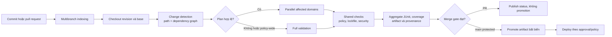

<Callout type="info" title="Phạm vi">
  Case study này dùng Jenkins Multibranch Pipeline, agent Linux và một repository có script xác định ảnh hưởng do chính đội dự án sở hữu. Jenkins điều phối checkout, fan-out, evidence và gate; công cụ monorepo quyết định đồ thị dependency. Hãy xác minh plugin, SCM source, label agent và câu lệnh của repository trên controller lab trước khi áp dụng.
</Callout>

Một monorepo chứa nhiều ứng dụng trong cùng revision Git. Lợi ích là thay đổi một package chung có thể được kiểm tra cùng các consumer; chi phí là một commit nhỏ có thể kích hoạt quá nhiều build nếu Pipeline không biết phạm vi ảnh hưởng. Mục tiêu không phải “chỉ chạy thứ vừa sửa”, mà là chạy tập kiểm tra nhỏ nhất vẫn đủ bằng chứng để merge an toàn.

## Mục lục

- [Kết quả cần đạt](#kết-quả-cần-đạt)
- [Mô hình monorepo và ownership](#mô-hình-monorepo-và-ownership)
  - [Layout và dependency graph](#layout-và-dependency-graph)
  - [Định nghĩa thay đổi ảnh hưởng](#định-nghĩa-thay-đổi-ảnh-hưởng)
- [Luồng Jenkins từ commit đến promotion](#luồng-jenkins-từ-commit-đến-promotion)
  - [Multibranch, pull request và trust](#multibranch-pull-request-và-trust)
  - [Agent, workspace và fan-out](#agent-workspace-và-fan-out)
- [Phát hiện thay đổi một cách bảo thủ](#phát-hiện-thay-đổi-một-cách-bảo-thủ)
  - [Base revision, path filter và change set](#base-revision-path-filter-và-change-set)
  - [Rename, delete và file sinh ra](#rename-delete-và-file-sinh-ra)
  - [Targeted validation và full validation](#targeted-validation-và-full-validation)
- [Jenkinsfile tham chiếu](#jenkinsfile-tham-chiếu)
  - [Declarative parallel, matrix và công cụ monorepo](#declarative-parallel-matrix-và-công-cụ-monorepo)
  - [Contract của script repository](#contract-của-script-repository)
- [Cache, concurrency và evidence](#cache-concurrency-và-evidence)
  - [Cache key và invalidation](#cache-key-và-invalidation)
  - [Cancellation, failure policy và merge gate](#cancellation-failure-policy-và-merge-gate)
  - [Report, artifact và quan sát](#report-artifact-và-quan-sát)
- [Mở rộng, promotion và rollback](#mở-rộng-promotion-và-rollback)
- [Lab local tái lập không chạm repository thật](#lab-local-tái-lập-không-chạm-repository-thật)
  - [Tạo fixture có guard](#tạo-fixture-có-guard)
  - [Chạy detector và đọc evidence](#chạy-detector-và-đọc-evidence)
  - [Dọn sandbox có guard](#dọn-sandbox-có-guard)
- [Khắc phục sự cố](#khắc-phục-sự-cố)
- [Checklist áp dụng](#checklist-áp-dụng)
- [Nguồn chính thức](#nguồn-chính-thức)
- [Đọc tiếp](#đọc-tiếp)

## Kết quả cần đạt

Sau bài này, bạn có thể thiết kế một Pipeline có các thuộc tính sau:

- mô tả được `apps/`, `packages/` và `services/`, owner của từng vùng, cùng dependency graph có version;
- tính tập project bị ảnh hưởng từ change set, sau đó đóng mapping sang các check bắt buộc thay vì chỉ lọc theo đường dẫn;
- chạy các domain độc lập song song, tổng hợp JUnit, coverage và artifact ở fan-in mà không giả định filesystem giữa agent là chung;
- chọn full validation khi detector thiếu bằng chứng hoặc chạm ranh giới rủi ro;
- giữ cache, workspace, credential, artifact và promotion tách theo trust boundary;
- lưu revision, base revision, affected set, thời gian stage và kết quả gate để điều tra hoặc rollback.

## Mô hình monorepo và ownership

### Layout và dependency graph

Một layout đơn giản nhưng có ranh giới rõ ràng:

```text
workspace/
├── apps/
│   ├── storefront/          # ứng dụng web, owner: web-team
│   └── backoffice/          # ứng dụng nội bộ, owner: ops-product
├── packages/
│   ├── ui-kit/              # thư viện dùng chung, owner: design-system
│   └── contracts/           # schema/API contract, owner: platform-api
├── services/
│   ├── catalog/             # service triển khai độc lập, owner: catalog-team
│   └── payments/            # service nhạy cảm, owner: payments-team
├── ci/
│   ├── affected-plan.sh     # tạo plan JSON đã kiểm tra
│   └── run-domain-check.sh  # thực thi một domain theo plan
├── package-lock.json        # hoặc lockfile tương đương
└── Jenkinsfile
```

Ownership không chỉ là tên đội. Nó cần có mapping được review, chẳng hạn `packages/contracts` thay đổi thì owner platform-api phải review, các service import contract phải được validate, và một thay đổi policy dưới `ci/` phải có owner CI duyệt. Có thể biểu diễn mapping bằng `CODEOWNERS`, manifest monorepo hoặc một file policy riêng; detector phải đọc cùng nguồn dữ liệu mà người review dùng.

Dependency graph là đồ thị có hướng: `storefront → ui-kit`, `catalog → contracts`, còn `payments → contracts`. Khi `packages/contracts` đổi, tập ảnh hưởng gồm chính package đó **và toàn bộ consumer đi ngược graph**. Chỉ chạy `packages/contracts` sẽ bỏ sót lỗi tương thích trong `catalog` hay `payments`.

| Vùng thay đổi | Check tối thiểu | Lý do |
| --- | --- | --- |
| `apps/storefront/**` | lint, unit, build storefront | Consumer cục bộ thay đổi. |
| `packages/ui-kit/**` | ui-kit và mọi app import nó | Public API của package có thể phá consumer. |
| `services/catalog/**` | unit/catalog, contract consumer liên quan | Service có vòng đời riêng nhưng vẫn dùng contract chung. |
| `packages/contracts/**` | contract producer, tất cả service consumer, compatibility test | Thay đổi schema lan theo dependency graph. |
| root lockfile, manifest workspace, `ci/**`, toolchain | full validation | Thay đổi có thể làm mọi project hoặc chính detector không còn đáng tin. |

### Định nghĩa thay đổi ảnh hưởng

**Change set** là danh sách trạng thái và path giữa base revision với revision đang build. Nó cần giữ cả `A`, `M`, `D` và cặp path rename; chỉ lấy danh sách file còn tồn tại là không đủ. **Affected project** là project có source, manifest, cấu hình hoặc dependency transitively bị ảnh hưởng theo policy.

Một detector đáng tin trả về hai thứ: `affected` và `reason`. Ví dụ `catalog` có thể mang reason `direct-path:services/catalog/src/...`; `payments` mang `reverse-dependency:packages/contracts`. Reason là evidence cho reviewer, không phải log trang trí.

Đừng để mapping nằm rải rác trong Jenkinsfile. Công cụ workspace như Nx, Turborepo, Bazel, Gradle composite build hoặc script nội bộ có thể tính graph theo cách riêng. Jenkins chỉ nên gọi một interface ổn định, pin toolchain bằng lockfile/image và xác minh output. Nếu graph không parse được, policy mặc định phải là full validation, không phải affected set rỗng.

## Luồng Jenkins từ commit đến promotion



Diagram Mermaid được project này chuyển thành component qua cấu hình MDX; nó vẫn là mô tả luồng, không phải cấu hình Jenkins.

### Multibranch, pull request và trust

Multibranch Pipeline quét SCM source, phát hiện branch và pull request (PR), rồi lấy `Jenkinsfile` tại revision mà job đang build. Điều này làm policy CI được review cùng code. Cấu hình source cần xác định rõ discovery strategy của branch/PR và revision PR mà provider hỗ trợ: head của PR, merge preview, hoặc cả hai theo policy.

PR từ fork hoặc source không tin cậy có thể sửa Jenkinsfile, script detector và dependency. Vì vậy lane PR chỉ dùng agent không đặc quyền, network tối thiểu và credential đọc source nếu cần. Nó không được có credential publish, deploy, signing, Docker socket đặc quyền hay cache ghi dùng chung với release. Promotion chỉ chạy sau merge vào branch được bảo vệ, bằng revision đã được kiểm tra và policy đã phê duyệt.

Không suy ra trust từ tên branch. Trust đến từ SCM source, folder/job permission, branch protection, agent pool, credential scope và điều kiện Jenkinsfile. Xem thêm [Jenkinsfile](/docs/pipelines/jenkinsfile) và [Credentials trong Pipeline](/docs/pipelines/credentials).

### Agent, workspace và fan-out

Dùng `agent none` ở cấp Pipeline để stage chỉ giữ executor khi thực sự chạy. `Checkout` có thể stash source nhỏ hoặc mỗi nhánh checkout lại cùng revision; lựa chọn phụ thuộc kích thước source, network và Artifact Manager. Không giả định workspace của `affected-apps` là filesystem của `affected-services`: hai branch có thể ở agent, pod hoặc workspace khác nhau.

| Ranh giới | Chính sách |
| --- | --- |
| PR và branch đã merge | Pool agent khác nhau; PR không nhận credential release. |
| Mỗi nhánh parallel | Workspace, report directory, port, namespace test và tên artifact riêng. |
| Cache dependency | Key bất biến; PR chỉ đọc hoặc ghi namespace cô lập, có quota. |
| Fan-in | Nhận JUnit/artifact đã publish hoặc `stash` nhỏ; không đọc path local của sibling. |
| Controller | Chỉ điều phối; không chạy build nặng hay lưu cache tùy tiện. |

`parallel` phù hợp khi domain có workflow khác nhau, ví dụ app, service và package. `matrix` phù hợp khi **cùng** workflow lặp trên các trục như runtime hoặc hệ điều hành. Không tạo Matrix từ danh sách affected động trong Declarative; số cell của Matrix là khai báo tĩnh. Thay vào đó, dùng một số branch domain tĩnh, để công cụ monorepo trong mỗi branch quyết định project nào cần chạy.

## Phát hiện thay đổi một cách bảo thủ

### Base revision, path filter và change set

Base revision phải phản ánh câu hỏi đang trả lời:

- **PR:** merge base với target branch hoặc merge preview do SCM source cung cấp. Controller phải checkout đủ history/ref cần dùng; shallow clone thiếu base thì detector phải báo `full`.
- **Branch đã merge:** previous successful revision có thể tối ưu incremental CI, nhưng build đầu tiên, history đã bị prune hoặc commit bị bỏ qua phải quay về baseline được công bố hay full validation.
- **Release:** so với tag/revision release đã phê duyệt để lập release note và phạm vi regression, không tái sử dụng mù quáng base của build CI.

Path filter là bước đầu rẻ: `apps/storefront/**` gợi ý storefront. Sau đó graph resolver thêm reverse dependency. Change set cần được lưu như artifact nhỏ, chẳng hạn `evidence/changes.tsv`, chứa status và path. Không dùng `git diff --name-only` làm bằng chứng duy nhất vì nó làm mất delete và rename metadata.

### Rename, delete và file sinh ra

| Trường hợp | Rủi ro nếu chỉ lọc path hiện tại | Policy an toàn |
| --- | --- | --- |
| Rename | Path cũ có owner/consumer khác path mới. | Đọc cả old và new path từ name-status; nếu tool không nhận diện chắc chắn, full validation. |
| Delete | File không còn tồn tại nên glob không thấy nó. | Map path bị xóa về project cũ; chạy consumer/contract cần thiết. |
| Lockfile hoặc workspace manifest | Một dependency có thể đổi cho nhiều project. | Full validation và cache key mới. |
| File sinh ra | Output local che thay đổi source hoặc bị commit nhầm. | Không dùng generated output làm nguồn graph; tạo lại từ source, kiểm tra drift theo policy. |
| Thay đổi `ci/`, container image, config test | Chính detector/test environment đổi nghĩa. | Full validation, owner CI review và evidence phiên bản toolchain. |

Git có heuristic rename; kết quả có thể khác theo history, ngưỡng similarity và shallow checkout. Đừng dựa vào rename detection để giảm check mà không có fallback. Tương tự, `git diff` không biết quan hệ dependency được tạo bởi codegen, dynamic import hay config runtime nếu manifest không mô tả chúng. Hãy khai báo edge quan trọng trong manifest hoặc đánh dấu vùng đó là full-validation boundary.

### Targeted validation và full validation

Targeted validation là lane phản hồi nhanh cho PR. Nó cần chạy test trực tiếp của project, test của reverse dependency và các shared check áp dụng cho mọi revision: format, policy, lockfile integrity, detector schema và scan phù hợp. Nó không phải giấy phép bỏ mọi integration test.

Full validation chạy tất cả project/check bắt buộc, hoặc ít nhất set rộng đã được policy phê duyệt. Dùng full khi:

1. detector lỗi, output không đúng schema, base không tồn tại hoặc affected set không có reason;
2. change set chạm root manifest, lockfile, build configuration, shared library, CI, code generator hay policy-wide path;
3. thay đổi vượt ngưỡng số project, graph quá cũ hoặc có edge không mô tả được;
4. theo lịch/nightly để phát hiện drift, hoặc trước promotion có mức rủi ro cao.

Giữ tỷ lệ full builds, false-negative của detector và thời gian feedback làm metric. Nếu full build thường xuyên tìm lỗi mà targeted không bắt được, thu hẹp path filter không phải lời giải; graph, ownership hoặc policy đang thiếu edge.

<Callout type="warn" title="Không để set rỗng tự động thành xanh">
  `affected=[]` chỉ có nghĩa không có project bị ảnh hưởng khi detector đã xác minh base, change set, schema và policy paths. Khi bất kỳ điều kiện nào chưa chứng minh được, hãy chọn full validation hoặc fail rõ ràng theo merge policy.
</Callout>

## Jenkinsfile tham chiếu

Mẫu dưới đây là Declarative Pipeline hợp lệ về cấu trúc, nhưng cần repository cung cấp hai script trong contract ở phần sau. Nó chỉ dùng Pipeline steps cơ bản (`checkout`, `stash`, `unstash`, `sh`, `junit`, `archiveArtifacts`, `deleteDir`) và không giả định API plugin ngoài các step đó. `disableConcurrentBuilds(abortPrevious: true)` là chính sách hủy build cũ của **cùng job**; xác minh plugin Pipeline: Declarative trên controller trước khi chuẩn hóa.

```groovy
pipeline {
  agent none

  options {
    skipDefaultCheckout(true)
    disableConcurrentBuilds(abortPrevious: true)
    timeout(time: 45, unit: 'MINUTES')
    buildDiscarder(logRotator(
      daysToKeepStr: '21',
      numToKeepStr: '40',
      artifactDaysToKeepStr: '14',
      artifactNumToKeepStr: '20'
    ))
  }

  stages {
    stage('Checkout and source snapshot') {
      agent { label 'linux && monorepo-ci' }
      steps {
        checkout scm
        sh '''#!/bin/sh
          set -eu
          git rev-parse HEAD > evidence-revision.txt
          test -f ci/affected-plan.sh
          test -f ci/run-domain-check.sh
        '''
        stash includes: '**', name: 'source', useDefaultExcludes: false
      }
    }

    stage('Detect change plan') {
      agent { label 'linux && monorepo-ci' }
      steps {
        deleteDir()
        unstash 'source'
        sh '''#!/bin/sh
          set -eu
          mkdir -p evidence
          if [ -n "${CHANGE_TARGET:-}" ] && \
             git rev-parse --verify "origin/$CHANGE_TARGET" >/dev/null 2>&1; then
            base="origin/$CHANGE_TARGET"
          elif git rev-parse --verify HEAD^ >/dev/null 2>&1; then
            base='HEAD^'
          else
            base='HEAD'
          fi
          git diff --name-status --find-renames "$base" HEAD > evidence/changes.tsv
          ci/affected-plan.sh --base "$base" --changes evidence/changes.tsv \
            --output evidence/plan.json
          test -s evidence/plan.json
          grep -Eq '"mode":"(targeted|full)"' evidence/plan.json
        '''
        stash includes: 'evidence/**', name: 'plan', useDefaultExcludes: false
      }
    }

    stage('Affected domains') {
      failFast true
      parallel {
        stage('Applications') {
          agent { label 'linux && monorepo-ci' }
          options { timeout(time: 20, unit: 'MINUTES') }
          steps {
            deleteDir()
            unstash 'source'
            unstash 'plan'
            sh 'ci/run-domain-check.sh --plan evidence/plan.json --domain apps --reports reports/apps'
          }
          post {
            always {
              junit testResults: 'reports/apps/**/*.xml', allowEmptyResults: true
              archiveArtifacts artifacts: 'reports/apps/**,evidence/plan.json', allowEmptyArchive: true
            }
            cleanup { deleteDir() }
          }
        }
        stage('Packages') {
          agent { label 'linux && monorepo-ci' }
          options { timeout(time: 20, unit: 'MINUTES') }
          steps {
            deleteDir()
            unstash 'source'
            unstash 'plan'
            sh 'ci/run-domain-check.sh --plan evidence/plan.json --domain packages --reports reports/packages'
          }
          post {
            always {
              junit testResults: 'reports/packages/**/*.xml', allowEmptyResults: true
              archiveArtifacts artifacts: 'reports/packages/**,evidence/plan.json', allowEmptyArchive: true
            }
            cleanup { deleteDir() }
          }
        }
        stage('Services') {
          agent { label 'linux && monorepo-ci' }
          options { timeout(time: 25, unit: 'MINUTES') }
          steps {
            deleteDir()
            unstash 'source'
            unstash 'plan'
            sh 'ci/run-domain-check.sh --plan evidence/plan.json --domain services --reports reports/services'
          }
          post {
            always {
              junit testResults: 'reports/services/**/*.xml', allowEmptyResults: true
              archiveArtifacts artifacts: 'reports/services/**,evidence/plan.json', allowEmptyArchive: true
            }
            cleanup { deleteDir() }
          }
        }
      }
    }

    stage('Shared merge checks') {
      agent { label 'linux && monorepo-ci' }
      steps {
        deleteDir()
        unstash 'source'
        unstash 'plan'
        sh '''#!/bin/sh
          set -eu
          ci/run-domain-check.sh --plan evidence/plan.json --domain shared --reports reports/shared
          test -s evidence/plan.json
        '''
        junit testResults: 'reports/shared/**/*.xml', allowEmptyResults: true
        archiveArtifacts artifacts: 'evidence/**,reports/shared/**', allowEmptyArchive: false
      }
      post { cleanup { deleteDir() } }
    }

    stage('Promotion gate') {
      when {
        beforeAgent true
        branch 'main'
      }
      agent { label 'linux && trusted-release' }
      steps {
        echo 'Only a protected main build that passed required checks may promote immutable artifacts.'
      }
    }
  }

  post {
    failure {
      echo 'Inspect the first failed domain, plan.json, changes.tsv, reports, and agent label before rerun.'
    }
    aborted {
      echo 'A newer build or a user interruption cancelled this run; inspect the cancellation source.'
    }
  }
}
```

### Declarative parallel, matrix và công cụ monorepo

Declarative `parallel` tạo ba branch tĩnh để Jenkins hiển thị, cấp agent, timeout và thu report theo domain. Nó không tự suy ra project. `ci/run-domain-check.sh` đọc plan và gọi công cụ của workspace với danh sách đã tính. Nếu domain không có project affected, script phải in reason `no-affected-projects`, tạo evidence và trả `0`; nó không được tự bỏ qua khi plan là `full`.

Một Matrix có thể kiểm tra cùng affected set trên `NODE_VERSION` hoặc OS đã hỗ trợ. Ví dụ, `apps` chạy cùng lệnh test trên hai runtime là Matrix; `apps`, `packages` và `services` là `parallel`. Đặt compatibility Matrix ở stage cùng cấp với domain fan-out nếu cần; đừng lồng Matrix vào branch `parallel`.

Danh sách branch được tạo động từ JSON cần Scripted Pipeline hoặc Shared Library được review, cùng bề mặt CPS/sandbox lớn hơn. Chỉ dùng khi số domain thay đổi thật sự và đã có integration test; không đổi sang Groovy động chỉ để tránh một branch tĩnh chạy nhanh rồi kết thúc.

### Contract của script repository

`ci/affected-plan.sh` cần là executable versioned trong repository và có contract tối thiểu sau:

| Input hoặc output | Yêu cầu |
| --- | --- |
| `--base` | Revision Git đã được `rev-parse` xác minh. |
| `--changes` | File `name-status` giữ add, modify, delete và rename. |
| `--output` | JSON được ghi atomically; không chứa secret hay path máy agent. |
| `mode` | Chỉ `targeted` hoặc `full`; mọi lỗi parsing/base thiếu chọn `full` hoặc exit non-zero theo policy. |
| `affected` | Mỗi item có project ID, domain, reasons và command key từ allowlist. |
| `policyReasons` | Nêu lockfile, CI, generated boundary, graph stale hay điều kiện khiến full. |

`ci/run-domain-check.sh` chỉ nhận `--domain` thuộc allowlist `apps`, `packages`, `services`, `shared`. Nó không `eval` command từ JSON, không ghép project ID chưa chuẩn hóa vào shell, và không nhận URL/token từ change set. Nó map project ID đã xác minh sang command cố định của tool monorepo. Command dùng dấu nháy đơn ở Jenkins để shell, không phải Groovy, mở rộng biến; Pipeline không truyền secret qua argv.

## Cache, concurrency và evidence

### Cache key và invalidation

Cache dependency làm build nhanh hơn khi nội dung đầu vào giống nhau. Nó không phải artifact phát hành và không được là nguồn tin cậy giữa PR không tin cậy với release. Key tối thiểu nên gồm:

```text
<ecosystem>-<os>-<architecture>-<tool-version>-<lockfile-sha256>-<cache-schema>
```

Ví dụ `node-linux-amd64-node20-<lockfile-sha256>-v3` tách cache Node theo OS, CPU, version runtime, lockfile và schema cache. Thêm compiler version, build flag hoặc registry identity khi chúng đổi output. Không key theo branch name hay một khóa “shared” mutable nếu cache có binary/native module khác platform.

Invalidate khi lockfile, toolchain image/digest, cache schema, registry policy hoặc format output đổi. Khi phát hiện cache corrupt, xóa đúng namespace/key theo runbook và build lại; không xóa directory mơ hồ trên agent. PR chỉ nên đọc cache immutable đã kiểm tra hoặc ghi namespace cách ly có TTL. Release cache cần writer policy rõ ràng để tránh cache poisoning.

### Cancellation, failure policy và merge gate

`disableConcurrentBuilds(abortPrevious: true)` ưu tiên revision mới trong cùng job và giảm queue cũ. Nó không hủy build của branch/job khác, không bảo đảm process ngoài Jenkins dừng tức thì, và không thay thế workspace isolation. Mỗi branch có timeout, cleanup idempotent và không được giữ lock trong lúc download/cache.

Dùng `failFast true` cho affected-domain checks khi một failure xác định làm mọi kết quả còn lại vô ích. Branch gây lỗi vẫn là `FAILURE`; sibling bị hủy có thể là `ABORTED`. Đừng đổi failure thành `UNSTABLE` để promotion chạy. Với test flaky, giữ seed, revision, toolchain, report và thời gian; sửa hoặc cô lập nguyên nhân trước khi thêm retry.

Merge gate nên yêu cầu rõ:

1. detector đã tạo plan hợp lệ và full fallback đã chạy nếu policy yêu cầu;
2. shared check cùng mọi domain affected bắt buộc đều pass;
3. JUnit/coverage/quality threshold đạt policy, không chỉ có exit code xanh;
4. status gắn đúng PR revision/merge preview mà provider quy định;
5. review ownership cho vùng nhạy cảm đã hoàn tất.

PR gate không publish hay promote. Sau merge, main build tạo hoặc lấy **cùng artifact bất biến** đã có checksum/provenance, rồi mới đi tới approval môi trường. Không rebuild cùng version bằng source mới trong promotion lane.

### Report, artifact và quan sát

Tên evidence cần có revision ngắn, build number và domain, ví dụ `reports/services/<revision>-<build>-services-junit.xml` và `artifacts/<revision>-<build>-catalog.tar.gz`. Nếu framework tự đặt tên report, đặt report dưới directory domain riêng để tránh ghi đè. Archive chỉ pattern hẹp: plan, change set, JUnit, coverage summary, checksum và provenance; không archive toàn workspace, cache, `.git` hay file binding credential.

| Tín hiệu | Câu hỏi vận hành |
| --- | --- |
| `affected_count`, `mode`, `policyReasons` | Detector có đang fallback nhiều hoặc bỏ sót reason không? |
| Queue time và duration theo domain | Capacity/agent label có là nút thắt không? |
| Pass, failure, unstable, aborted | Failure gốc là gì; cancellation có che symptom không? |
| Cache hit, miss, restore time, corruption | Cache có nhanh và đáng tin hay chỉ thêm I/O? |
| Full-to-targeted ratio | Chính sách và graph có đủ chính xác không? |
| Artifact checksum, producer revision, promotion event | Môi trường đang nhận đúng bytes nào? |

Console log là evidence gốc của build, nhưng dashboard cần aggregation theo domain, branch class và pool agent. Không dùng commit SHA, PR title, workspace path, token hay parameter tùy ý làm metric label có cardinality cao. Xem [Build Artifacts](/docs/jobs/artifacts), [Kiểm thử Jenkinsfile](/docs/pipelines/testing) và [Monitoring & Metrics](/docs/administration/monitoring).

## Mở rộng, promotion và rollback

Bắt đầu với ba domain và vài check đáng giá; đo queue, runtime p95, CPU, RAM, disk, network và controller flow-node load trước khi tăng fan-out. Khi monorepo lớn, tách pool agent theo toolchain/trust, dùng agent ephemeral, cache immutable gần workload, Artifact Manager hoặc repository ngoài cho artifact lớn, và đặt quota/concurrency per domain. Nhiều executor không đồng nghĩa nhiều CPU/RAM; tăng fan-out khi capacity đã được chứng minh.

Promotion phải tham chiếu artifact có version bất biến và checksum đã xác minh. Metadata release tối thiểu gồm revision source, plan mode, toolchain, artifact coordinate, SHA-256, report/gate và người hoặc policy đã duyệt. Promotion không chạy từ PR; credential publish/deploy chỉ bind ở stage trusted có scope hẹp.

Rollback là một quyết định release, không phải “chạy lại build cũ”. Giữ bản artifact trước đó, compatibility database và evidence deploy. Khi incident xảy ra: dừng promotion, xác định artifact/revision đang chạy, chọn version đã biết tốt, xác minh checksum và deploy qua đường đã phê duyệt. Nếu schema không backward compatible, rollback code có thể không đủ; rollout cần migration expand/contract và feature flag. Tái lập affected plan của revision lỗi giúp truy ra consumer cần regression test trước khi mở lại gate.

## Lab local tái lập không chạm repository thật

Lab tạo một Git fixture trong temporary sandbox. Nó không sửa, xóa, checkout hay dùng remote của repository hiện tại; không dùng credential, network hay Jenkins controller. Cần shell POSIX và Git. Detector dưới đây đơn giản theo path để minh họa evidence; nó không thay thế graph resolver production.

### Tạo fixture có guard

```bash
set -eu
umask 077

readonly LAB_PARENT="${TMPDIR:-/tmp}"
readonly LAB_PREFIX='jenkins-monorepo-lab.'
LAB_ROOT="$(mktemp -d "${LAB_PARENT}/${LAB_PREFIX}XXXXXX")"
readonly LAB_ROOT
readonly LAB_MARKER="${LAB_ROOT}/.jenkins-monorepo-lab-marker"
readonly LAB_REPO="${LAB_ROOT}/fixture"

case "$LAB_ROOT" in
  "$LAB_PARENT"/"$LAB_PREFIX"*) ;;
  *) printf >&2 'Refuse lab: unexpected prefix.\n'; exit 1 ;;
esac
[ "$(dirname -- "$LAB_ROOT")" = "$LAB_PARENT" ] || {
  printf >&2 'Refuse lab: sandbox is not a direct child.\n'; exit 1;
}
printf '%s\n' 'jenkins-monorepo-lab-v1' > "$LAB_MARKER"
mkdir -p "$LAB_REPO"/{apps/storefront,packages/ui-kit,services/catalog,ci,evidence}
cd "$LAB_REPO"
git init -b main
git config user.name 'Lab User'
git config user.email 'lab@example.invalid'
printf 'export const button = 1;\n' > packages/ui-kit/index.js
printf 'import "../../packages/ui-kit/index.js";\n' > apps/storefront/index.js
printf 'export const catalog = true;\n' > services/catalog/index.js
printf 'lockfileVersion: 1\n' > workspace.lock
cat > ci/affected-plan.sh <<'EOF'
#!/bin/sh
set -eu
base=''
changes=''
output=''
while [ "$#" -gt 0 ]; do
  case "$1" in
    --base) base=$2; shift 2 ;;
    --changes) changes=$2; shift 2 ;;
    --output) output=$2; shift 2 ;;
    *) printf >&2 'unsupported argument: %s\n' "$1"; exit 2 ;;
  esac
done
test -n "$base" && test -f "$changes" && test -n "$output"
mode='targeted'
projects=''
reasons=''
if grep -Eq '(^|[[:space:]])(workspace.lock|ci/)' "$changes"; then
  mode='full'
  reasons='policy-wide-path'
elif grep -Eq 'packages/ui-kit/' "$changes"; then
  projects='ui-kit,storefront'
  reasons='direct-package-and-reverse-dependency'
elif grep -Eq 'apps/storefront/' "$changes"; then
  projects='storefront'
  reasons='direct-path'
elif grep -Eq 'services/catalog/' "$changes"; then
  projects='catalog'
  reasons='direct-path'
else
  reasons='no-mapped-project'
fi
mkdir -p "$(dirname -- "$output")"
printf '{"base":"%s","mode":"%s","affected":"%s","reason":"%s"}\n' \
  "$base" "$mode" "$projects" "$reasons" > "$output"
EOF
chmod 700 ci/affected-plan.sh
git add .
git commit -m 'Create guarded monorepo fixture'
git branch feature/ui-change
printf 'Lab fixture: %s\n' "$LAB_REPO"
```

### Chạy detector và đọc evidence

Tạo một thay đổi thư viện để thấy reverse dependency, rồi chạy detector. Mọi path được tạo trong `$LAB_ROOT` và command từ script fixture, không từ repository thật.

```bash
set -eu
cd "$LAB_REPO"
git switch feature/ui-change
printf 'export const button = 2;\n' > packages/ui-kit/index.js
git add packages/ui-kit/index.js
git commit -m 'Change shared UI package'

base="$(git merge-base main HEAD)"
git diff --name-status --find-renames "$base" HEAD > evidence/changes.tsv
ci/affected-plan.sh --base "$base" --changes evidence/changes.tsv \
  --output evidence/plan.json

test -s evidence/changes.tsv
grep -Fx 'M	packages/ui-kit/index.js' evidence/changes.tsv
grep -F '"mode":"targeted"' evidence/plan.json
grep -F '"affected":"ui-kit,storefront"' evidence/plan.json
printf 'Targeted plan evidence is present.\n'
```

Kết quả mong đợi là `changes.tsv` có path package, còn `plan.json` nêu `ui-kit,storefront` và reason reverse dependency. Để kiểm tra fallback, sửa `workspace.lock`, commit, chạy lại cùng block detector và xác nhận `"mode":"full"`. Fixture không có test runner hay Jenkins; success chỉ chứng minh guard, Git diff và contract script mẫu.

### Dọn sandbox có guard

Chạy trong cùng shell đã tạo lab. Hàm từ chối xóa nếu biến, parent, prefix, quan hệ child, marker hoặc repository fixture không đúng.

```bash
cleanup_lab() {
  local expected_marker='jenkins-monorepo-lab-v1'

  if [ -z "${LAB_PARENT:-}" ] || [ -z "${LAB_PREFIX:-}" ] || \
     [ -z "${LAB_ROOT:-}" ] || [ -z "${LAB_MARKER:-}" ] || \
     [ -z "${LAB_REPO:-}" ]; then
    printf >&2 'Refuse cleanup: missing lab variables.\n'
    return 1
  fi

  case "$LAB_ROOT" in
    "$LAB_PARENT"/"$LAB_PREFIX"*) ;;
    *) printf >&2 'Refuse cleanup: invalid prefix.\n'; return 1 ;;
  esac

  if [ "$(dirname -- "$LAB_ROOT")" != "$LAB_PARENT" ] || \
     [ "$LAB_REPO" != "$LAB_ROOT/fixture" ] || \
     [ "$LAB_MARKER" != "$LAB_ROOT/.jenkins-monorepo-lab-marker" ] || \
     [ ! -d "$LAB_ROOT" ] || [ ! -d "$LAB_REPO" ] || \
     [ ! -f "$LAB_MARKER" ] || \
     [ "$(cat -- "$LAB_MARKER")" != "$expected_marker" ]; then
    printf >&2 'Refuse cleanup: parent, child, or marker guard failed.\n'
    return 1
  fi

  cd / || return 1
  rm -rf -- "$LAB_ROOT"
}

cleanup_lab
```

## Khắc phục sự cố

| Dấu hiệu | Nguyên nhân thường gặp | Hướng xử lý an toàn |
| --- | --- | --- |
| Affected set rỗng sau đổi lockfile | Path filter thiếu policy-wide rule hoặc base sai. | Fail detector hoặc chọn full; lưu change set và base để sửa mapping. |
| Consumer lỗi sau package change nhưng không chạy | Graph chỉ lấy direct path hoặc manifest thiếu edge. | Thêm reverse dependency/ownership edge, tạo regression fixture, chạy full trước merge. |
| Rename không kích hoạt check cũ | Chỉ dùng `--name-only` hoặc checkout nông. | Lưu name-status với rename, lấy đủ base/history hoặc fallback full. |
| Branch parallel không thấy report của nhau | Các agent/workspace khác nhau. | Publish JUnit/archive trong branch hoặc transfer file nhỏ bằng stash; fan-in không đọc path sibling. |
| Build chờ lâu dù có parallel | Không đủ executor đúng label, hoặc cache/network saturate. | Đo queue/capacity theo pool; không tăng executor trước khi kiểm tra CPU, RAM, disk và quota. |
| Cache làm test sai hoặc corrupt | Key thiếu OS/toolchain/lockfile, nhiều writer hoặc PR poison cache. | Tăng specificity key, dùng immutable/read-only cache, cô lập namespace PR và dọn đúng key. |
| PR có quyền promotion | Credential/agent trusted được cấp quá rộng hoặc `when` không chặn source. | Tách job/folder/pool/credential theo trust, release chỉ sau merge protected. |
| Full build quá chậm | Fan-out quá lớn, artifact/cache dùng sai, test không phân tầng. | Đo stage duration, tách quick PR và full scheduled, tối ưu graph/capacity trước khi nới gate. |
| Pipeline bị hủy khó đọc | `abortPrevious` hoặc fail-fast hủy sibling. | Tìm branch `FAILURE` đầu tiên, revision mới hơn hoặc actor abort; không gọi sibling aborted là nguyên nhân gốc. |

## Checklist áp dụng

- [ ] Layout `apps/`, `packages/`, `services/`, ownership và graph có nguồn versioned được review.
- [ ] Change set giữ add/modify/delete/rename; base revision phù hợp PR, branch và release, có fallback khi history thiếu.
- [ ] Detector xuất plan có schema, `mode`, affected project và reason; lỗi/uncertainty không biến thành set rỗng xanh.
- [ ] Path policy bao lockfile, workspace manifest, CI, codegen và generated boundary; các vùng đó kích hoạt full validation.
- [ ] Targeted validation chạy direct project, reverse dependency và shared checks; full validation có trigger theo policy/lịch/rủi ro.
- [ ] Declarative `parallel` dùng cho domain khác nhau; Matrix chỉ cho cùng workflow trên axes tĩnh; dynamic execution đã được review/test riêng nếu cần.
- [ ] Mỗi branch có agent, timeout, workspace/report/port/namespace riêng; fan-in không giả định filesystem chung.
- [ ] PR không tin cậy không nhận credential release, agent đặc quyền, Docker socket hay cache ghi dùng chung.
- [ ] Cache key gồm OS, architecture, toolchain, lockfile và schema; invalidation, writer, TTL/quota và poison policy rõ ràng.
- [ ] `abortPrevious`, fail-fast, retry, timeout và cleanup có phạm vi; failure gốc không bị đổi thành tín hiệu xanh.
- [ ] Artifact, test report, coverage, plan, change set, checksum và provenance có tên/retention rõ; không archive workspace/cache/secret.
- [ ] Merge gate, promotion artifact bất biến, approval và rollback đã có owner/evidence; runtime test chạy trên Jenkins lab trước rollout.

## Nguồn chính thức

- [Jenkins Pipeline Syntax](https://www.jenkins.io/doc/book/pipeline/syntax/) — Declarative Pipeline, `parallel`, Matrix, `when`, `options` và `post`.
- [Using a Jenkinsfile](https://www.jenkins.io/doc/book/pipeline/jenkinsfile/) — Pipeline as Code, branch/PR và credential boundary.
- [Using Jenkins agents](https://www.jenkins.io/doc/book/using/using-agents/) — agent, executor, workspace và queue.
- [Pipeline: Basic Steps](https://www.jenkins.io/doc/pipeline/steps/workflow-basic-steps/) — `stash`, `unstash`, `deleteDir`, `timeout` và step cơ bản.
- [Jenkins Multibranch Pipeline](https://www.jenkins.io/doc/book/pipeline/multibranch/) — discovery branch/PR và Jenkinsfile theo revision.
- [Jenkins SCM API](https://www.jenkins.io/doc/developer/extensions/scm-api/) — mô hình source, head và revision của SCM integration.
- [Jenkins Credentials](https://www.jenkins.io/doc/book/using/using-credentials/) — scope, permission và sử dụng credential an toàn.
- [Jenkins Fingerprints](https://www.jenkins.io/doc/book/using/fingerprints/) — truy vết artifact giữa build producer/consumer.

## Đọc tiếp

<Cards>
  <Card title="Jenkinsfile" href="/docs/pipelines/jenkinsfile" description="Đặt Pipeline as Code trong repository và kiểm tra syntax đúng giới hạn." />
  <Card title="Parallel Stages" href="/docs/pipelines/parallel" description="Thiết kế fan-out, fail-fast, fan-in và isolation cho các domain." />
  <Card title="Declarative Matrix" href="/docs/pipelines/matrix" description="Chạy cùng một affected set trên các runtime hoặc hệ điều hành hỗ trợ." />
  <Card title="Multibranch Pipeline" href="/docs/jobs/multibranch" description="Cấu hình discovery branch và pull request theo SCM source." />
  <Card title="Build Artifacts" href="/docs/jobs/artifacts" description="Archive, fingerprint, retention và provenance cho evidence build." />
  <Card title="Kiểm thử Jenkinsfile" href="/docs/pipelines/testing" description="Kết hợp lint, unit, contract và controller lab trước merge." />
</Cards>
