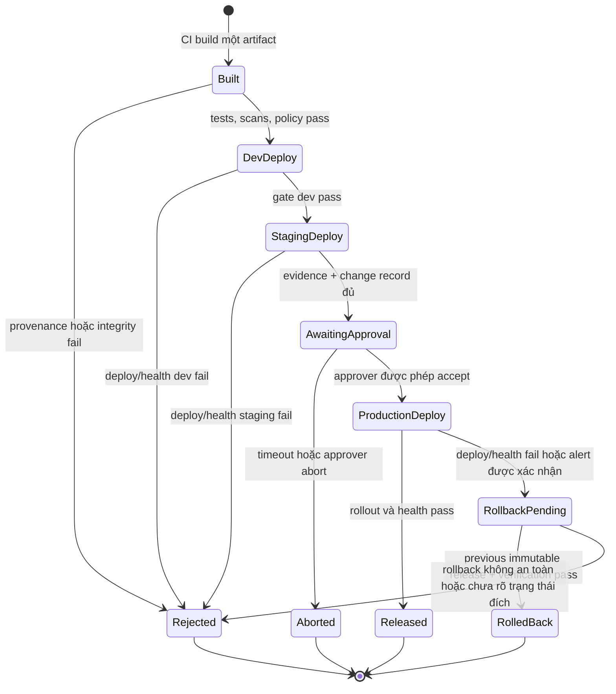

<Callout type="info" title="Phạm vi và giả định">
  Case study này mô tả policy phát hành và một Pipeline Declarative tham khảo. Nó giả định Jenkins LTS có Pipeline: Declarative, Pipeline: Basic Steps, Credentials Binding và agent Linux tin cậy. Stage dùng <code>lock</code> còn cần Lockable Resources plugin. Tên agent, credential ID, repository artifact và script trong bài đều là contract minh họa; xác minh plugin, quyền và behavior trên controller sandbox trước khi áp dụng cho hệ thống thật.
</Callout>

Một release đáng tin cậy không phải là “build lại ở production”. Nó là cùng một artifact có định danh bất biến, đã có evidence, đi qua các gate phù hợp để lần lượt được phép chạy ở dev, staging và production. Jenkins điều phối quyết định này; repository artifact, hệ thống đích, authorization và audit store vẫn là các ranh giới độc lập.

## Mục lục

- [Mục tiêu và ranh giới](#mục-tiêu-và-ranh-giới)
- [Mô hình promote một lần build](#mô-hình-promote-một-lần-build)
  - [Build once, promote many](#build-once-promote-many)
  - [Cấu hình môi trường không làm đổi artifact](#cấu-hình-môi-trường-không-làm-đổi-artifact)
  - [Danh tính deployment và quyền tối thiểu](#danh-tính-deployment-và-quyền-tối-thiểu)
- [Luồng release và các trạng thái](#luồng-release-và-các-trạng-thái)
- [Gate, approval và quản lý thay đổi](#gate-approval-và-quản-lý-thay-đổi)
  - [Gate tự động và evidence](#gate-tự-động-và-evidence)
  - [Approval thủ công có chủ đích](#approval-thủ-công-có-chủ-đích)
  - [Concurrency, lock và change window](#concurrency-lock-và-change-window)
- [Jenkinsfile tham khảo](#jenkinsfile-tham-khảo)
  - [Giả định runtime và contract script](#giả-định-runtime-và-contract-script)
  - [Pipeline Declarative](#pipeline-declarative)
  - [Đọc policy trong Pipeline](#đọc-policy-trong-pipeline)
- [Rollback có kiểm soát](#rollback-có-kiểm-soát)
- [Lựa chọn GitOps](#lựa-chọn-gitops)
- [Lab local, tái lập và có thể hủy](#lab-local-tái-lập-và-có-thể-hủy)
  - [Chuẩn bị](#chuẩn-bị)
  - [Jenkinsfile lab](#jenkinsfile-lab)
  - [Kết quả và evidence mong đợi](#kết-quả-và-evidence-mong-đợi)
- [Troubleshooting](#troubleshooting)
- [Checklist trước production](#checklist-trước-production)
- [Bài tập tự kiểm tra](#bài-tập-tự-kiểm-tra)
- [Nguồn chính thức](#nguồn-chính-thức)
- [Đọc tiếp](#đọc-tiếp)

## Mục tiêu và ranh giới

Sau case study này, bạn có thể thiết kế một release promotion có thể trả lời được năm câu hỏi: **byte nào** được deploy, **đã qua gate nào**, **ai** phê duyệt, **identity nào** thực hiện thay đổi và **cách quay lui nào** đã được chọn. Mục tiêu không phải là biến Jenkins thành nơi giữ mọi bí mật hay thay thế kiểm soát ở artifact repository, cloud hoặc Kubernetes.

Một release record tối thiểu nên liên kết các dữ liệu sau mà không chứa secret:

| Nhóm evidence | Ví dụ cần lưu | Mục đích |
| --- | --- | --- |
| Provenance | commit SHA, source repository, build URL/number, toolchain đã duyệt | Liên kết artifact với revision và build tạo ra nó. |
| Artifact | coordinate/version bất biến, SHA-256, chữ ký nếu tổ chức dùng, SBOM | Xác nhận byte được promote không bị đổi. |
| Quality | unit/integration test report, coverage policy, SAST/dependency/container scan, kết quả policy | Chứng minh gate tự động đã pass hoặc exception nào được chấp thuận. |
| Release | môi trường, thời điểm, change ID, approver, Pipeline run, deployment identity | Tạo audit trail cho quyết định và thao tác. |
| Runtime | target logical name, rollout/health result, dashboard/alert reference, rollback decision | Chứng minh trạng thái sau deploy và hỗ trợ điều tra. |

Không ghi token, password, cookie, private key, kubeconfig, URL có thông tin xác thực hay raw environment vào record này. Một checksum không thay cho chữ ký hoặc policy; approval không thay authorization; build xanh không tự chứng minh workload production khỏe.

## Mô hình promote một lần build

### Build once, promote many

**Build once, promote many** nghĩa là CI tạo, kiểm thử, quét và publish *một* artifact release. Dev, staging và production chỉ resolve đúng immutable reference đó, kiểm checksum/chữ ký theo policy, rồi cung cấp cấu hình/secret riêng của môi trường lúc runtime.

Ví dụ một image có digest `sha256:4d7e…` hoặc package `catalog-api@2.4.1+build.381` kèm SHA-256 là đối tượng được promote. Nhãn con người đọc như `candidate-381` có thể trỏ tới digest đó để tiện xem, nhưng deployment manifest và release record phải giữ digest/coordinate bất biến. Repository phải từ chối ghi đè release version đã publish.

| Thiết kế | Điều diễn ra | Rủi ro hoặc lợi ích |
| --- | --- | --- |
| **Build once, promote many** | CI build một lần, publish manifest/checksum, rồi cùng byte đi qua các môi trường. | Có thể tái hiện evidence và so sánh hành vi môi trường. Đây là lựa chọn mặc định cho release. |
| Rebuild mỗi môi trường | Dev, staging, production mỗi nơi lại checkout và build source. | Toolchain, dependency registry, thời điểm resolve hoặc source ref có thể khác; evidence dev không còn chứng minh byte production. |
| Dùng tag di động | Deployment chỉ tham chiếu một tag có thể bị đổi. | Không thể biết chắc byte nào đã chạy; rollback và điều tra trở nên mơ hồ. |

<Callout type="warn" title="Không promote source branch">
  Một branch hoặc commit là input của build, không phải artifact đã kiểm thử. Production cần digest hoặc coordinate bất biến, evidence và policy release của artifact đó; không checkout branch rồi build lại trong stage production.
</Callout>

### Cấu hình môi trường không làm đổi artifact

Artifact nên chứa code và default an toàn, không chứa endpoint production, token hoặc cấu hình bí mật. **Environment-specific configuration** được inject bằng cơ chế cấu hình runtime đã được review: config map/parameter store cho dữ liệu không nhạy cảm, secret manager hoặc Jenkins Credentials cho secret, và logical target được allowlist trong code đáng tin cậy.

| Dữ liệu | Ví dụ | Nơi phù hợp | Không được làm |
| --- | --- | --- | --- |
| Artifact bất biến | image digest, package, SBOM, migration bundle đã review | artifact repository/registry | Sửa byte hay ghi đè version khi promote. |
| Cấu hình không nhạy cảm | replica count, feature flag name, logical region | repo cấu hình có review hoặc configuration store | Nhúng production hostname vào Jenkinsfile. |
| Secret | token deploy, database password, signing key | secret manager hoặc Jenkins credential scoped hẹp | Commit, truyền qua argv/URL, in log hay archive. |
| Runtime identity | service account/OIDC workload identity của môi trường | hệ thống đích và IAM | Dùng một tài khoản admin chung cho mọi môi trường. |

Một environment overlay có thể đổi replica count hoặc bật feature flag, nhưng không được đổi digest mà release record đã phê duyệt. Nếu config thay đổi hành vi nghiệp vụ đáng kể, coi nó là change riêng: review, test ở staging, liên kết vào release record và quyết định rollback tương ứng.

### Danh tính deployment và quyền tối thiểu

Tách capability theo môi trường và nhiệm vụ. Identity publish artifact không cần deploy; identity staging không cần quyền production; approver không cần xem secret; người có quyền chạy job không mặc nhiên có quyền sửa Jenkinsfile hay policy.

| Persona/identity | Quyền tối thiểu | Không nên có |
| --- | --- | --- |
| CI build identity | Ghi immutable artifact vào namespace release, gửi metadata/report | Deploy vào môi trường, xóa release đã publish. |
| Dev deploy identity | Deploy đúng namespace dev, đọc artifact đã approve | Credential production hoặc quyền thay đổi RBAC. |
| Staging deploy identity | Deploy namespace staging, đọc telemetry staging | Quyền production. |
| Production deploy identity | Chỉ deploy/rollback workload đã allowlist trong production | Quyền quản trị cloud/cluster toàn cục hay đọc secret không cần thiết. |
| Release manager | Approve gate và tạo/đóng change record | Sửa Pipeline rồi tự duyệt cùng thay đổi. |

Jenkins Credential ID có thể xuất hiện trong Jenkinsfile, nhưng giá trị chỉ được binding ở stage cần thiết. `withCredentials` cần scope ngắn, shell không tracing và một client/script nhận secret qua environment hoặc cơ chế credential-aware — không qua command-line argument. Đọc [Credentials trong Pipeline](/docs/pipelines/credentials) và [Authorization & RBAC](/docs/security/authorization) trước khi cấp capability phát hành.

## Luồng release và các trạng thái

Sơ đồ trạng thái bên dưới làm rõ các đường không được “đi tiếp”: quality fail không được vào approval, abort không tự deploy, và rollback chỉ bắt đầu khi có bằng chứng trạng thái đích cùng quyết định đã ghi nhận.



`Rejected`, `Aborted` và `RolledBack` là các kết quả có giá trị audit, không phải trạng thái để chỉnh thành `SUCCESS`. Giữ build URL, stage/log reference đã redact, artifact digest, decision và owner để lần release sau có thể phân tích nguyên nhân.

## Gate, approval và quản lý thay đổi

### Gate tự động và evidence

Một gate tốt có điều kiện rõ, owner, evidence machine-readable và cách xử lý fail. Không dùng một số coverage hay severity cố định từ ví dụ làm policy phổ quát; giá trị threshold phải do owner rủi ro chọn và version-control.

| Gate | Trước môi trường nào | Evidence tối thiểu | Khi fail |
| --- | --- | --- | --- |
| Provenance/integrity | Trước dev | commit, artifact SHA-256/digest, signature/provenance nếu có | Chặn toàn bộ promotion; không publish lại cùng version. |
| Unit, integration, contract test | Trước dev hoặc staging | report, version test suite, pass/fail | Chặn promotion của artifact đó. |
| Security và license policy | Trước staging | scan report/SBOM, policy version, exception reference có expiry | Chặn hoặc xử lý exception theo policy, không chỉ suppress log. |
| Deploy verification | Sau từng deploy | release digest, target logical name, rollout/health check, telemetry window | Dừng ở môi trường hiện tại; đánh giá rollback. |
| Change readiness | Trước production | change ID, risk/impact, rollback owner, approver set, schedule | Không mở approval nếu record thiếu. |

Fingerprint Jenkins hữu ích để nối build producer/consumer nhưng không phải chữ ký mật mã. Dùng SHA-256 hoặc cơ chế ký/provenance do tổ chức chọn để kiểm byte trước deploy; xem [Build Artifacts](/docs/jobs/artifacts) để hiểu giới hạn fingerprint, retention và artifact repository.

### Approval thủ công có chủ đích

Approval production phải nói người duyệt đang xác nhận điều gì: artifact digest, change ID, kết quả gate, target logical name, tác động dự kiến, window và rollback candidate. Bước `input` giới hạn `submitter`, có timeout, chạy sau gate tự động, và để lại người duyệt/build reference theo retention policy.

Approval **không** thay thế branch protection, authorization ở Jenkins, IAM ở hệ thống đích hay review source. Không để cùng người vừa đổi Jenkinsfile deploy vừa là approver duy nhất của thay đổi đó. Khi team nhỏ không thể tách hoàn toàn, ghi exception, compensating control, owner và ngày review.

Với Declarative Pipeline, đặt `agent none` ở cấp pipeline và stage approval trước stage deploy để không giữ executor trong lúc chờ. `when { beforeInput true }` bảo đảm stage không đúng policy không mở hộp approval. Đặt timeout ở stage để abort có trạng thái rõ ràng thay vì chờ vô hạn; chi tiết có tại [Điều kiện when và phê duyệt input](/docs/pipelines/when-input).

### Concurrency, lock và change window

Hai promotion production cho cùng workload có thể race: release A health check chậm trong khi B đã đổi target; rollback A có thể ghi đè B. Giải quyết bằng một combination gồm concurrency policy, lock hẹp theo *môi trường + application*, idempotent deploy API và release state ở hệ thống đích.

- `disableConcurrentBuilds()` phù hợp để không cho hai run của **cùng job** chồng nhau, nhưng không khóa job khác deploy cùng target.
- Step `lock('production-catalog-api')` cần Lockable Resources plugin và chỉ giữ từ ngay trước deploy đến khi verification/record hoàn tất. Không giữ lock trong build/test/approval.
- Change window, maintenance freeze và allowlist phải được kiểm tra trước approval; không mã hóa một URL production trong Jenkinsfile.
- Retry chỉ hợp với thao tác đã chứng minh idempotent. Với timeout/agent loss, query release state bằng identity đọc hẹp trước khi gửi deploy lại.

`lock` là một plugin/runtime assumption; controller phải có resource đúng tên, quyền policy phù hợp và timeout được test trong sandbox. Lock trong Jenkins không thay distributed lock hoặc optimistic concurrency control do deployment platform cung cấp.

## Jenkinsfile tham khảo

### Giả định runtime và contract script

Pipeline này là **Multibranch release job**: SCM source chỉ cho phép branch `main` đã được bảo vệ đi vào các stage release. Build pull request, fork hoặc branch khác phải chạy một CI không đặc quyền riêng; chúng không đi tới stage có credential deploy. Pipeline không chứa endpoint, credential value hoặc URL production. Các script `ci/*` là contract nội bộ phải được review và kiểm thử riêng:

- `publish-immutable-artifact` tạo artifact, SBOM, SHA-256 và `release/evidence.json`; nó từ chối ghi đè coordinate release.
- `verify-release-evidence` đọc manifest, kiểm artifact digest, report, policy và revision SCM đang checkout; nó không in secret.
- `deploy-release` nhận `--environment` từ allowlist và `--digest`; credential được nó đọc từ environment, không từ argv. Script phải map logical environment sang cấu hình/endpoint đã được quản trị ngoài Jenkinsfile.
- `verify-deployment` kiểm rollout/health bằng digest và logical environment, sau đó ghi evidence đã redact.
- `record-release-event` gửi metadata không nhạy cảm vào audit/change system; việc gửi thất bại phải được policy phân loại rõ, không được im lặng bỏ qua production record.

`stash` trong mẫu chỉ chứa `release/evidence.json` đã được kiểm tra, không chứa source, artifact lớn, credential hay output nhạy cảm. Vì `agent none` cho phép mỗi stage nhận workspace khác, mọi stage release đều `checkout scm` đúng revision rồi `unstash` manifest trước khi gọi script. Ví dụ dùng agent label `trusted-release-linux`; label chỉ route scheduler, không phải security boundary. Tách agent, filesystem, network egress và service identity của release khỏi build pull request không tin cậy.

### Pipeline Declarative

```groovy
pipeline {
  agent none

  options {
    disableConcurrentBuilds()
    skipDefaultCheckout(true)
    timeout(time: 60, unit: 'MINUTES')
  }

  environment {
    RELEASE_NAME = 'catalog-api'
    ARTIFACT_DIGEST = ''
  }

  stages {
    stage('Build and publish immutable artifact') {
      when {
        beforeAgent true
        branch 'main'
      }
      agent { label 'build-linux' }
      steps {
        checkout scm
        sh '''#!/bin/sh
          set -eu
          ./ci/run-required-tests
          ./ci/run-security-policy
          ./ci/publish-immutable-artifact --output release/evidence.json
          test -s release/evidence.json
        '''
        archiveArtifacts artifacts: 'release/evidence.json', fingerprint: true
        stash name: 'release-evidence', includes: 'release/evidence.json', useDefaultExcludes: true
      }
    }

    stage('Verify evidence') {
      when {
        beforeAgent true
        branch 'main'
      }
      agent { label 'trusted-release-linux' }
      steps {
        checkout scm
        unstash 'release-evidence'
        script {
          env.ARTIFACT_DIGEST = sh(
            returnStdout: true,
            script: './ci/read-release-digest release/evidence.json'
          ).trim()
          if (!(env.ARTIFACT_DIGEST ==~ /^sha256:[0-9a-f]{64}$/)) {
            error 'Release manifest did not contain an allowed SHA-256 digest'
          }
        }
        sh './ci/verify-release-evidence --manifest release/evidence.json'
      }
    }

    stage('Promote to dev') {
      when {
        beforeAgent true
        branch 'main'
      }
      agent { label 'trusted-release-linux' }
      steps {
        checkout scm
        unstash 'release-evidence'
        sh './ci/verify-release-evidence --manifest release/evidence.json'
        script {
          env.ARTIFACT_DIGEST = sh(
            returnStdout: true,
            script: './ci/read-release-digest release/evidence.json'
          ).trim()
          if (!(env.ARTIFACT_DIGEST ==~ /^sha256:[0-9a-f]{64}$/)) {
            error 'Release manifest did not contain an allowed SHA-256 digest'
          }
        }
        withCredentials([string(credentialsId: 'dev-deploy-token', variable: 'DEPLOY_TOKEN')]) {
          sh '''#!/bin/sh
            set -eu
            set +x
            ./ci/deploy-release --environment dev --digest "$ARTIFACT_DIGEST"
            ./ci/verify-deployment --environment dev --digest "$ARTIFACT_DIGEST"
          '''
        }
      }
    }

    stage('Promote to staging') {
      when {
        beforeAgent true
        branch 'main'
      }
      agent { label 'trusted-release-linux' }
      steps {
        checkout scm
        unstash 'release-evidence'
        sh './ci/verify-release-evidence --manifest release/evidence.json'
        script {
          env.ARTIFACT_DIGEST = sh(
            returnStdout: true,
            script: './ci/read-release-digest release/evidence.json'
          ).trim()
          if (!(env.ARTIFACT_DIGEST ==~ /^sha256:[0-9a-f]{64}$/)) {
            error 'Release manifest did not contain an allowed SHA-256 digest'
          }
        }
        withCredentials([string(credentialsId: 'staging-deploy-token', variable: 'DEPLOY_TOKEN')]) {
          sh '''#!/bin/sh
            set -eu
            set +x
            ./ci/deploy-release --environment staging --digest "$ARTIFACT_DIGEST"
            ./ci/verify-deployment --environment staging --digest "$ARTIFACT_DIGEST"
          '''
        }
      }
    }

    stage('Approve production promotion') {
      options { timeout(time: 20, unit: 'MINUTES') }
      when {
        beforeInput true
        branch 'main'
      }
      input {
        message 'Approve the recorded artifact and gates for production promotion?'
        ok 'Approve promotion'
        submitter 'release-managers'
        submitterParameter 'PRODUCTION_APPROVER'
      }
      agent { label 'trusted-release-linux' }
      steps {
        checkout scm
        unstash 'release-evidence'
        sh './ci/verify-release-evidence --manifest release/evidence.json'
        script {
          env.ARTIFACT_DIGEST = sh(
            returnStdout: true,
            script: './ci/read-release-digest release/evidence.json'
          ).trim()
          if (!(env.ARTIFACT_DIGEST ==~ /^sha256:[0-9a-f]{64}$/)) {
            error 'Release manifest did not contain an allowed SHA-256 digest'
          }
        }
        sh '''#!/bin/sh
          set -eu
          ./ci/record-release-event \
            --event approval \
            --environment production \
            --digest "$ARTIFACT_DIGEST" \
            --approver "$PRODUCTION_APPROVER"
        '''
      }
    }

    stage('Promote to production') {
      when {
        beforeAgent true
        branch 'main'
      }
      agent { label 'trusted-release-linux' }
      steps {
        checkout scm
        unstash 'release-evidence'
        sh './ci/verify-release-evidence --manifest release/evidence.json'
        script {
          env.ARTIFACT_DIGEST = sh(
            returnStdout: true,
            script: './ci/read-release-digest release/evidence.json'
          ).trim()
          if (!(env.ARTIFACT_DIGEST ==~ /^sha256:[0-9a-f]{64}$/)) {
            error 'Release manifest did not contain an allowed SHA-256 digest'
          }
        }
        lock(resource: 'production-catalog-api') {
          withCredentials([string(credentialsId: 'production-deploy-token', variable: 'DEPLOY_TOKEN')]) {
            sh '''#!/bin/sh
              set -eu
              set +x
              ./ci/deploy-release --environment production --digest "$ARTIFACT_DIGEST"
              ./ci/verify-deployment --environment production --digest "$ARTIFACT_DIGEST"
              ./ci/record-release-event \
                --event deployed \
                --environment production \
                --digest "$ARTIFACT_DIGEST"
            '''
          }
        }
      }
    }
  }

  post {
    always {
      echo "Release ${env.RELEASE_NAME}, build ${env.BUILD_NUMBER}: ${currentBuild.currentResult}"
    }
    aborted {
      echo 'Promotion was aborted or approval timed out; no automatic rollback decision is made.'
    }
    failure {
      echo 'Preserve evidence, verify target state, then follow the approved rollback decision.'
    }
  }
}
```

### Đọc policy trong Pipeline

- Mọi stage release dùng `when { branch 'main' }`. Đây là control của Multibranch Pipeline, nên chỉ có giá trị khi SCM branch protection và branch-discovery policy đã được kiểm tra; PR/fork bị skip trước khi agent hay credential deploy được cấp.
- CI checkout revision, tạo `release/evidence.json`, archive và `stash` đúng một manifest. Mỗi stage trusted sau đó `checkout scm` đúng revision và `unstash 'release-evidence'`; không stage nào dựa vào workspace của agent trước hoặc checkout source để rebuild.
- Mỗi stage dev, staging và production chạy `verify-release-evidence` cùng kiểm digest **trước** `withCredentials`. `DEPLOY_TOKEN` chỉ tồn tại trong closure sau gate này. Shell dùng single-quoted block để shell mở rộng environment; token không nằm trong Groovy interpolation, URL hay argv. Mỗi credential ID cần folder/job scope và quyền deploy riêng.
- Approval có timeout, `submitter`, trusted agent/workspace và verification manifest trước khi ghi event; `submitterParameter` thêm approver vào event. Build record có thể bị hết retention, vì vậy `record-release-event` phải đi đến audit/change system theo policy.
- `archiveArtifacts` chỉ archive manifest đã biết trên build agent, không chạy trong Pipeline `post` không có workspace. Manifest phải được review để không nhét secret, raw response hoặc file credential vào artifact Jenkins.
- `lock` chỉ bao production deploy và verification. Nếu `verify-deployment` fail, `post { failure }` không tự rollback: automation trước hết phải biết deploy đã tạo state nào. Người chịu trách nhiệm theo runbook chọn rollback, forward-fix hoặc dừng rollout.

<Callout type="warn" title="Ví dụ cần validation runtime">
  Jenkinsfile có thể parse nhưng vẫn fail nếu label, Credentials Binding, Lockable Resources, credential ID, script contract hoặc permission khác thực tế. Dùng Pipeline Syntax/Declarative linter và một controller sandbox; static review không chứng minh IAM, DNS, TLS, artifact repository hay deployment target vận hành đúng.
</Callout>

## Rollback có kiểm soát

Rollback là release mới đưa **previous known-good immutable artifact** vào target, không phải “xóa những gì vừa deploy” một cách mù quáng. Trước khi hành động, xác minh current digest ở target, digest rollback candidate, trạng thái rollout/migration, owner và change record. Nếu deployment trước bị timeout, không suy ra target không đổi: query state bằng identity read-only trước.

| Tình huống | Quyết định an toàn | Evidence trước/sau |
| --- | --- | --- |
| Health check fail ngay, previous release tương thích | Lock target, deploy previous digest, kiểm rollout/health | current/previous digest, timestamp, reason, verification result. |
| Deploy dở dang hoặc agent mất kết nối | Dừng promotion, query target state, quyết định theo runbook | deployment platform event, lock owner, revision/digest thực tế. |
| Migration database backward-incompatible | Không tự rollback binary nếu schema không hỗ trợ; dùng forward-fix hoặc restore đã phê duyệt | migration version, backup/restore evidence, DBA/owner approval. |
| Lỗi được feature flag che an toàn | Tắt flag theo control plane, giữ artifact để điều tra | flag change record, telemetry trước/sau, expiry của workaround. |

Thiết kế schema theo expand/contract: release đầu thêm schema tương thích ngược, release sau chuyển consumer, release sau nữa mới bỏ field cũ. Diễn tập rollback trong staging bằng digest cũ và migration representative; một runbook chưa thử chỉ là giả thuyết. Đọc [Rollback Strategy](/docs/delivery/rollback) để mở rộng chiến lược database, feature flag và drill.

## Lựa chọn GitOps

Jenkins không nhất thiết là process gọi deployment API trực tiếp. Với GitOps, Jenkins vẫn build/publish artifact bất biến, chạy gate và tạo evidence, nhưng stage promote tạo pull request hoặc commit reviewable vào repository cấu hình. A deployment controller như Argo CD hoặc Flux với identity riêng reconcile digest đã approve vào từng môi trường.

| Direct deployment từ Jenkins | GitOps promotion |
| --- | --- |
| Jenkins giữ credential/identity để gọi deployment platform. | Jenkins chỉ cần quyền tạo change hẹp trong repo config; controller đích giữ identity deploy. |
| Audit nằm ở Jenkins, deployment platform và change system. | Commit/PR config trở thành desired state/audit bổ sung; controller ghi reconcile state. |
| Lock Jenkins hữu ích nhưng không thay target concurrency control. | Git branch protection, PR approval và controller reconciliation giảm tranh chấp desired state. |
| Phù hợp khi platform chưa có GitOps controller hoặc deploy API đã được quản trị tốt. | Phù hợp khi manifest/desired state cần review và reconciliation liên tục. |

Dù chọn cách nào, nguyên tắc không đổi: manifest phải pin digest, approval không merge hay deploy một tag di động, secret không nằm trong Git, và rollback là thay desired state về digest known-good có evidence. Xem [Jenkins & GitOps](/docs/delivery/gitops) để thiết kế repository manifest và pull request promotion.

## Lab local, tái lập và có thể hủy

### Chuẩn bị

Lab chỉ tạo file marker và digest giả trong workspace Jenkins. Nó không checkout repository, không dùng credential, không gọi network, không deploy, không tạo container/cluster và không chạm artifact repository. Cần controller sandbox có Pipeline: Declarative và một agent Linux mang label `promotion-lab`; việc agent/label tồn tại là xác minh runtime, không phải điều mà Jenkinsfile tĩnh chứng minh.

Tạo Pipeline job sandbox tên `promotion-lab-local`, chọn **Pipeline script** và dán file dưới đây. Tham số là choice allowlist, không đi vào command shell. Tất cả file lab ở dưới `promotion-lab-<BUILD_NUMBER>` và cleanup chỉ chạy sau khi kiểm prefix, parent workspace và marker do lab tạo.

### Jenkinsfile lab

```groovy
pipeline {
  agent { label 'promotion-lab' }

  parameters {
    choice(
      name: 'SCENARIO',
      choices: ['success', 'gate-fail', 'approval-abort', 'rollback-simulated'],
      description: 'Only controls harmless local evidence files.'
    )
  }

  stages {
    stage('Create immutable training artifact') {
      steps {
        sh '''#!/bin/sh
          set -eu
          LAB_ROOT="$WORKSPACE/promotion-lab-$BUILD_NUMBER"
          case "$LAB_ROOT" in
            "$WORKSPACE"/promotion-lab-*) ;;
            *) printf '%s\n' 'Refuse unexpected lab path.' >&2; exit 1 ;;
          esac
          mkdir -p "$LAB_ROOT/release"
          : > "$LAB_ROOT/.lab-owned"
          printf 'training-artifact-v1\n' > "$LAB_ROOT/release/catalog-api.training"
          sha256sum "$LAB_ROOT/release/catalog-api.training" > "$LAB_ROOT/release/SHA256SUMS"
          DIGEST="sha256:$(awk '{print $1}' "$LAB_ROOT/release/SHA256SUMS")"
          printf '{"artifact":"catalog-api.training","digest":"%s","tests":"pass","security":"pass"}\n' "$DIGEST" > "$LAB_ROOT/release/evidence.json"
          test -s "$LAB_ROOT/release/evidence.json"
        '''
      }
    }

    stage('Evaluate simulated gate') {
      steps {
        script {
          if (params.SCENARIO == 'gate-fail') {
            error 'Intentional local quality-gate failure; no deployment was attempted.'
          }
        }
        sh '''#!/bin/sh
          set -eu
          test -f "$WORKSPACE/promotion-lab-$BUILD_NUMBER/.lab-owned"
          grep -F '"tests":"pass"' "$WORKSPACE/promotion-lab-$BUILD_NUMBER/release/evidence.json"
        '''
      }
    }

    stage('Record simulated promotion') {
      steps {
        script {
          if (params.SCENARIO == 'approval-abort') {
            currentBuild.result = 'ABORTED'
            error 'Intentional approval abort; no deployment was attempted.'
          }
        }
        sh '''#!/bin/sh
          set -eu
          LAB_ROOT="$WORKSPACE/promotion-lab-$BUILD_NUMBER"
          for environment in dev staging production; do
            printf 'promotion=%s digest=' "$environment" >> "$LAB_ROOT/release/promotion.log"
            awk -F'"' '/digest/ { print $8 }' "$LAB_ROOT/release/evidence.json" >> "$LAB_ROOT/release/promotion.log"
          done
          if [ "$SCENARIO" = 'rollback-simulated' ]; then
            printf '%s\n' 'rollback=simulated previous-digest=training-only' >> "$LAB_ROOT/release/promotion.log"
          fi
        '''
      }
    }

    stage('Verify local evidence') {
      steps {
        sh '''#!/bin/sh
          set -eu
          LAB_ROOT="$WORKSPACE/promotion-lab-$BUILD_NUMBER"
          test -f "$LAB_ROOT/.lab-owned"
          test "$(grep -c '^promotion=' "$LAB_ROOT/release/promotion.log")" -eq 3
          test -s "$LAB_ROOT/release/SHA256SUMS"
          sha256sum -c "$LAB_ROOT/release/SHA256SUMS"
        '''
        archiveArtifacts artifacts: "promotion-lab-${env.BUILD_NUMBER}/release/evidence.json,promotion-lab-${env.BUILD_NUMBER}/release/SHA256SUMS,promotion-lab-${env.BUILD_NUMBER}/release/promotion.log", allowEmptyArchive: true
      }
    }
  }

  post {
    always {
      sh '''#!/bin/sh
        set -eu
        LAB_ROOT="$WORKSPACE/promotion-lab-$BUILD_NUMBER"
        case "$LAB_ROOT" in
          "$WORKSPACE"/promotion-lab-*)
            test -f "$LAB_ROOT/.lab-owned"
            rm -rf -- "$LAB_ROOT"
            ;;
          *)
            printf '%s\n' 'Refuse cleanup outside the owned lab prefix.' >&2
            exit 1
            ;;
        esac
      '''
    }
  }
}
```

### Kết quả và evidence mong đợi

| `SCENARIO` | Kết quả mong đợi | Evidence cần xem |
| --- | --- | --- |
| `success` | `SUCCESS`; ba dòng promotion cùng digest giả. | `evidence.json`, `SHA256SUMS`, `promotion.log`, `sha256sum: OK`. |
| `gate-fail` | `FAILURE` tại gate; không có stage promotion. | Dòng intentional failure và artifact evidence nếu đã archive. |
| `approval-abort` | Kết quả hiện hành được đánh dấu abort/failure theo behavior runtime của Pipeline; không có deployment. | Console output, stage dừng và việc cleanup chạy có guard. |
| `rollback-simulated` | `SUCCESS`; log có marker rollback giả. | `promotion.log` cho biết đây chỉ là simulation, không phải rollback target thật. |

Static review có thể xác minh allowlist, marker, prefix và parent guard trong Jenkinsfile. Chỉ chạy lab mới xác minh được agent label, plugin, shell, archive behavior, UI state của abort và cleanup trên Jenkins/runtime cụ thể. Không diễn giải artifact local hay marker rollback là bằng chứng một deployment production đã xảy ra.

## Troubleshooting

| Triệu chứng | Kiểm tra có evidence | Hành động an toàn |
| --- | --- | --- |
| Staging dùng digest khác dev | Manifest, artifact repository metadata, deployment record và checksum | Dừng promotion, tìm nguồn đã đổi reference; không rebuild production để “khớp lại”. |
| Approval không hiện hoặc người duyệt bị từ chối | `when`/stage ordering, timeout, `submitter`, security realm và Job permission | Kiểm tra policy/runtime; không bỏ `submitter` để qua gate. |
| Production stage chờ lock | Tên resource, build đang giữ lock, change window và target state | Đọc lock owner/queue, không tăng executor hay xóa lock tùy tiện. |
| Deploy timeout | Audit/platform event, current digest/rollout status, agent/network log đã redact | Giữ lock nếu policy cần, query state bằng identity read-only rồi quyết định retry/rollback. |
| Credential binding fail | Credential ID/type, folder scope, plugin version, job permission và expiry | Không in environment hay thêm credential Global; sửa scope/owner theo least privilege. |
| Artifact publish báo đã tồn tại | Coordinate, digest và repository immutability policy | Chỉ coi là idempotent khi metadata xác nhận đúng bytes; nếu khác thì dừng điều tra. |
| Rollback thất bại vì database | Schema version, migration compatibility, backup/restore evidence và DBA decision | Không ép deploy digest cũ; dùng expand/contract hoặc forward-fix theo runbook. |
| Build xanh nhưng không có audit event | `record-release-event` result, audit system availability, retention và policy fail-open/closed | Ghi evidence gap và dừng release capability nhạy cảm theo policy; không gọi event là đã tồn tại. |

## Checklist trước production

- [ ] Một artifact release có coordinate/digest bất biến, SHA-256 hoặc chữ ký theo policy, SBOM/provenance và repository từ chối ghi đè.
- [ ] Dev, staging và production resolve đúng cùng digest; không có rebuild per environment, tag di động hay source branch deploy.
- [ ] Config không nhạy cảm, secret và runtime identity được tách; artifact/Jenkinsfile không chứa URL production hay credential thật.
- [ ] CI build, artifact publisher, từng deploy identity và approver có quyền tối thiểu, scope hẹp và owner/rotation rõ.
- [ ] Gate tự động có policy version, evidence, owner và hành vi fail rõ; quality/security exception có approver và expiry.
- [ ] Approval production có change ID, digest, target logical name, timeout, submitter, separation of duties và audit reference.
- [ ] Concurrency được kiểm soát bằng job policy, lock hẹp và state/idempotency của deployment platform; timeout không gây deploy lặp mù quáng.
- [ ] Rollback candidate là digest known-good; database compatibility, feature flag, telemetry, owner và rollback drill đã được kiểm tra.
- [ ] Plugin, Jenkins core, agent/toolchain, label, credential binding, lock resource và script contract đã được xác minh trên sandbox/runtime.
- [ ] Log, artifact, audit event, report và notification không chứa secret; retention và quyền đọc evidence đã được xác định.
- [ ] Lab chỉ dùng marker/dữ liệu giả, prefix/parent guard và cleanup scoped; static validation được phân biệt với runtime verification.

## Bài tập tự kiểm tra

1. Chọn một application giả và viết release manifest gồm digest, commit, SBOM reference, test/security report reference và previous known-good digest. Trường nào không được chứa secret?
2. Sửa Pipeline để staging có integration gate riêng. Giải thích tại sao gate đó không được rebuild artifact, và evidence nào phải có trước approval production.
3. Thiết kế một ma trận quyền cho CI publisher, staging deployer, production deployer và approver. Ai được phép `Job/Configure`, ai được dùng credential production, và vì sao?
4. Mô phỏng production deploy bị timeout sau khi request đã gửi. Viết decision tree gồm bước query state, lock ownership, retry idempotent và tiêu chí rollback.
5. Chuyển flow sang GitOps: manifest repository pin digest ở đâu, PR nào cần approval, deployment controller dùng identity nào, và audit trail đi qua những hệ thống nào?

## Nguồn chính thức

- [Jenkins Pipeline Syntax](https://www.jenkins.io/doc/book/pipeline/syntax/) — Declarative Pipeline, `input`, `options`, `post` và directive hợp lệ.
- [Using a Jenkinsfile](https://www.jenkins.io/doc/book/pipeline/jenkinsfile/) — Pipeline as Code, environment và credentials.
- [Pipeline: Input Step](https://www.jenkins.io/doc/pipeline/steps/pipeline-input-step/) — approval, submitter và timeout.
- [Credentials Binding plugin](https://plugins.jenkins.io/credentials-binding/) — binding scope, masking và lưu ý về secret trên agent.
- [Lockable Resources plugin](https://plugins.jenkins.io/lockable-resources/) — lock resource và concurrency phụ thuộc plugin.
- [Jenkins fingerprints](https://www.jenkins.io/doc/book/using/fingerprints/) — truy vết artifact giữa các build.
- [Jenkins Pipeline steps](https://www.jenkins.io/doc/pipeline/steps/) — xác minh step theo plugin đang cài.
- [Jenkins Security: Controller Isolation](https://www.jenkins.io/doc/book/security/controller-isolation/) — tách controller khỏi workload build/deploy.

## Đọc tiếp

<Cards>
  <Card title="Jenkinsfile" href="/docs/pipelines/jenkinsfile" description="Đặt release policy vào Pipeline as Code và validate cú pháp." />
  <Card title="Credentials trong Pipeline" href="/docs/pipelines/credentials" description="Nạp secret ở scope ngắn, không qua log hoặc argv." />
  <Card title="Điều kiện và phê duyệt input" href="/docs/pipelines/when-input" description="Thiết kế gate thủ công có timeout và submitter." />
  <Card title="Xử lý lỗi và Retry" href="/docs/pipelines/error-handling" description="Giữ failure, abort và retry idempotent trung thực." />
  <Card title="Build Artifacts" href="/docs/jobs/artifacts" description="Archive, fingerprint, checksum và retention cho release evidence." />
  <Card title="Credentials & Secrets" href="/docs/security/credentials-secrets" description="Thiết kế scope, rotation và trust boundary cho capability deploy." />
  <Card title="Authorization & RBAC" href="/docs/security/authorization" description="Áp dụng least privilege và separation of duties cho Jenkins." />
  <Card title="Audit & Compliance" href="/docs/security/audit-compliance" description="Bảo quản audit trail và evidence đã redact." />
  <Card title="Jenkins & GitOps" href="/docs/delivery/gitops" description="Dùng desired state và deployment controller thay direct deployment." />
  <Card title="Rollback Strategy" href="/docs/delivery/rollback" description="Thiết kế rollback application, database và drill an toàn." />
</Cards>
