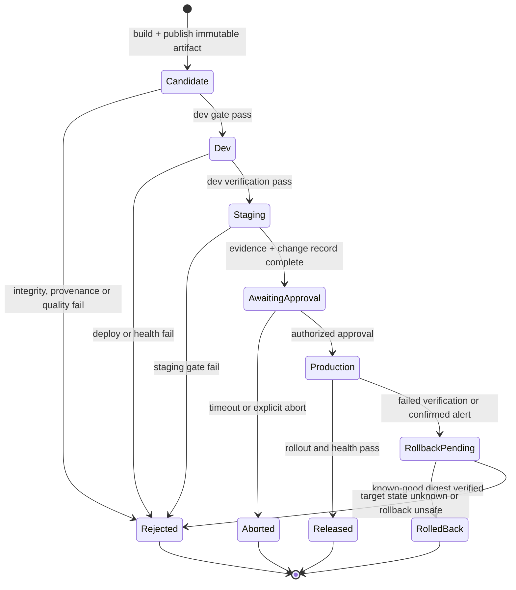

<Callout type="info" title="Phạm vi và giả định runtime">
  Hướng dẫn dùng Declarative Pipeline trên Jenkins LTS, Multibranch Pipeline, Pipeline: Basic Steps, Credentials Binding và agent Linux tách theo mức tin cậy. Ví dụ production còn cần Lockable Resources plugin, artifact repository có version bất biến, các script <code>ci/*</code> đã được review, cùng hệ thống đích có API deploy idempotent. Xác minh tên plugin, version, credential ID, label, IAM và cú pháp bằng Pipeline Syntax trên controller sandbox trước khi áp dụng.
</Callout>

Promotion đáng tin cậy không phải là build lại source ở mỗi môi trường. CI tạo một artifact release duy nhất, gắn provenance và evidence, rồi dev, staging, production lần lượt xác minh và chạy đúng bytes đó với cấu hình riêng. Jenkins điều phối luồng; artifact repository, secret manager, hệ thống đích và audit store vẫn là các ranh giới kiểm soát độc lập.

## Mục lục

- [Mục tiêu và nguyên tắc](#mục-tiêu-và-nguyên-tắc)
  - [Build once, promote many](#build-once-promote-many)
  - [Artifact, metadata và provenance](#artifact-metadata-và-provenance)
  - [Cấu hình, secret và quyền tối thiểu](#cấu-hình-secret-và-quyền-tối-thiểu)
- [Luồng promotion và gate](#luồng-promotion-và-gate)
  - [Dev, staging và production](#dev-staging-và-production)
  - [Approval, change management và phân tách nhiệm vụ](#approval-change-management-và-phân-tách-nhiệm-vụ)
  - [Concurrency, lock và timeout](#concurrency-lock-và-timeout)
- [Chiến lược promotion](#chiến-lược-promotion)
- [Jenkinsfile tham khảo](#jenkinsfile-tham-khảo)
  - [Contract và trust boundary](#contract-và-trust-boundary)
  - [Pipeline Declarative](#pipeline-declarative)
  - [Đọc các control trong pipeline](#đọc-các-control-trong-pipeline)
- [Failure, abort, retry và rollback](#failure-abort-retry-và-rollback)
- [Evidence, retention và khả năng phục hồi](#evidence-retention-và-khả-năng-phục-hồi)
- [Lab local tái lập, chỉ dùng dữ liệu giả](#lab-local-tái-lập-chỉ-dùng-dữ-liệu-giả)
  - [Điều kiện và Jenkinsfile lab](#điều-kiện-và-jenkinsfile-lab)
  - [Kết quả và giới hạn xác minh](#kết-quả-và-giới-hạn-xác-minh)
- [Troubleshooting](#troubleshooting)
- [Checklist trước khi phát hành](#checklist-trước-khi-phát-hành)
- [Nguồn chính thức](#nguồn-chính-thức)
- [Đọc tiếp](#đọc-tiếp)

## Mục tiêu và nguyên tắc

Sau bài này, bạn có thể trả lời cho một release: **bytes nào** đã chạy, **revision nào** tạo nó, **gate nào** đã pass, **ai** phê duyệt, **identity nào** deploy, và **digest known-good nào** có thể quay lui. Mục tiêu không phải biến Jenkins thành nơi giữ toàn bộ bí mật hoặc thành nguồn chuẩn duy nhất của audit.

### Build once, promote many

**Build once, promote many** nghĩa là một build tin cậy tạo, test, quét và publish đúng một artifact release. Các môi trường sau chỉ resolve immutable reference đó, xác minh integrity/provenance, rồi inject cấu hình và secret runtime của môi trường.

Ví dụ, `catalog-api@2.8.0+build.417` có thể được định danh bởi image digest `sha256:...`. Manifest deployment và release record giữ digest, không chỉ giữ tên tag cho người đọc. Repository phải từ chối ghi đè coordinate release đã publish.

| Thiết kế | Hệ quả | Quyết định thực hành |
| --- | --- | --- |
| Build một lần, promote nhiều lần | Cùng bytes đi qua dev, staging, production; evidence có thể đối chiếu. | Mặc định cho release. |
| Build lại từng môi trường | Toolchain, dependency, thời điểm resolve hoặc source ref có thể đổi. | Không dùng evidence dev để suy ra bytes production. |
| Deploy tag di động | Không xác định chắc bytes đang chạy; rollback và điều tra mơ hồ. | Pin digest hoặc coordinate bất biến. |

<Callout type="warn" title="Commit không phải artifact đã kiểm thử">
  Commit SHA là input và provenance của build. Production không checkout branch rồi build lại: nó nhận artifact đã publish, manifest và evidence tương ứng. Một branch được bảo vệ vẫn không thay thế checksum, policy scan hay authorization deploy.
</Callout>

### Artifact, metadata và provenance

Artifact bất biến là file/package/image mà nội dung không đổi sau publish. Một digest SHA-256 xác định bytes; chữ ký hoặc attestation, khi policy tổ chức dùng, tăng niềm tin về producer. Jenkins fingerprint hữu ích để nối build producer/consumer nhưng dùng MD5 lịch sử, nên không thay checksum mạnh hoặc chữ ký.

Release manifest tối thiểu không chứa secret và liên kết các evidence sau:

| Nhóm | Trường hoặc reference tối thiểu | Câu hỏi trả lời |
| --- | --- | --- |
| Artifact | coordinate, digest SHA-256, SBOM, chữ ký/attestation nếu có | Chính xác bytes nào được chạy? |
| Provenance | repository source, commit SHA, build URL/number, toolchain/policy version | Ai và quy trình nào đã tạo bytes đó? |
| Quality | test report, scan SAST/dependency/container, exception có expiry | Gate tự động nào đã pass hoặc được chấp nhận ngoại lệ? |
| Release | target logical, change ID, approver, thời gian, deployment identity | Ai cho phép và ai thực hiện thay đổi? |
| Runtime | rollout/health result, telemetry window, current/previous digest | Kết quả deploy và khả năng quay lui là gì? |

Manifest cần được verify trước mỗi deploy. Chỉ hash một file sau khi tải không đủ nếu manifest cũng bị đổi: lấy manifest/chữ ký từ repository hoặc control plane được quản trị, kiểm policy và ghi kết quả verification vào evidence. Không archive token, raw environment, kubeconfig, URL có thông tin xác thực hay response chưa redact.

Đọc [Build Artifacts](/docs/jobs/artifacts) để phân biệt workspace, `stash`, Jenkins archive, fingerprint và artifact repository.

### Cấu hình, secret và quyền tối thiểu

Promotion đổi **môi trường chạy**, không sửa artifact. Ví dụ overlay staging có thể đổi replica count; nó không được thay digest đã được phê duyệt. Nếu thay đổi config ảnh hưởng nghiệp vụ đáng kể, coi đó là change riêng: review, test staging, liên kết release record và xác định rollback.

| Dữ liệu | Nơi phù hợp | Không được làm |
| --- | --- | --- |
| Code, package, image, SBOM | Artifact repository/registry có immutability | Sửa bytes hoặc ghi đè release. |
| Cấu hình không nhạy cảm | Repo cấu hình reviewed hoặc configuration store | Hard-code hostname production trong Jenkinsfile. |
| Secret | Secret manager hoặc Jenkins credential scoped hẹp | Commit, in log, đưa vào argv/URL/report. |
| Identity deploy | Service account/OIDC riêng cho từng môi trường | Dùng một token admin cho mọi môi trường. |

Tách publisher artifact, deployer dev, deployer staging, deployer production và approver. Credential ID có thể hiện trong Jenkinsfile, nhưng giá trị chỉ bind trong closure ngắn sau trust/gate phù hợp. Agent label chỉ chọn scheduler; nó không phải security boundary. PR/fork không tin cậy phải chạy trên agent không đặc quyền, không nhận credential publish/deploy, và không dùng chung filesystem hay process identity với release agent.

Xem [Credentials trong Pipeline](/docs/pipelines/credentials) và [Authorization & RBAC](/docs/security/authorization) trước khi cấp capability phát hành.

## Luồng promotion và gate



`Rejected`, `Aborted` và `RolledBack` là evidence có giá trị. Không biến chúng thành `SUCCESS` chỉ để dashboard đẹp. Giữ release reference, stage/result, decision owner và log đã redact theo retention policy.

### Dev, staging và production

Gate tốt có điều kiện rõ, owner, evidence machine-readable, cách xử lý fail và policy version. Threshold coverage hoặc severity không phải số sao chép phổ quát; owner rủi ro quyết định và version-control chúng.

| Gate | Trước hoặc sau | Evidence tối thiểu | Khi không đạt |
| --- | --- | --- | --- |
| Source trust | Trước credential release | branch protection, SCM revision, Multibranch context | Skip/chặn release path của PR/fork. |
| Integrity/provenance | Trước dev và lặp lại trước deploy | manifest, digest, signature/attestation theo policy | Dừng promotion; không publish lại cùng version. |
| Test/quality | Trước dev hoặc staging | unit/integration/contract reports, policy result | Chặn artifact đó. |
| Security/license | Trước staging | SBOM, scan report, exception reference có expiry | Chặn hoặc áp exception đã duyệt. |
| Runtime verification | Sau mỗi deploy | target logical, actual digest, rollout/health/telemetry | Dừng ở môi trường hiện tại; đánh giá rollback. |
| Change readiness | Trước production | change ID, impact, window, approver, rollback candidate | Không mở approval. |

Dev cung cấp phản hồi nhanh với artifact thật. Staging phải đại diện các integration, data shape và observability quan trọng, không nhất thiết là bản sao hoàn hảo của production. Production có gate bổ sung cho impact, maintenance window, ownership và monitoring. Không tự suy ra staging pass là production khỏe.

### Approval, change management và phân tách nhiệm vụ

Approval production nên nêu rõ digest, change ID, target logical, kết quả gate, impact, change window và digest rollback candidate. Đặt `input` sau mọi gate tự động, giới hạn `submitter`, đặt timeout và lưu approver vào release event. `input` không thay authorization Jenkins/IAM, review source, quality gate hoặc rollback.

| Vai trò | Quyền tối thiểu | Không nên đồng thời là |
| --- | --- | --- |
| Tác giả thay đổi | Tạo PR và cung cấp evidence | Approver production duy nhất cho thay đổi của mình. |
| CI publisher | Ghi artifact vào namespace release | Deployer production hoặc quản trị repository. |
| Production deployer | Deploy/rollback workload allowlist | Quyền cloud/cluster toàn cục. |
| Release manager | Duyệt release/change theo policy | Người tự cấp credential/deploy permission cho chính mình. |
| Audit/records owner | Đọc evidence đã redact và quản lý retention | Người có thể xóa/sửa toàn bộ evidence không giám sát. |

Đó là **segregation of duties**: tách đề xuất, cấp quyền, approve và thực thi khi tổ chức có đủ người. Nếu đội nhỏ không thể tách hoàn toàn, ghi ngoại lệ, compensating control, owner và ngày review; approval một người vô thời hạn không phải control đủ mạnh. Chi tiết `when`, `beforeInput` và `input` có tại [Điều kiện when và phê duyệt input](/docs/pipelines/when-input).

### Concurrency, lock và timeout

Hai promotion có thể race trên cùng workload: release A health check chậm trong khi B đã đổi target, rồi rollback A ghi đè B. Kết hợp nhiều control:

- `disableConcurrentBuilds()` tuần tự hóa run của **một job**, không khóa job khác chạm cùng target.
- `lock('production-catalog-api')` chỉ giữ từ deploy đến verification/event; nó cần Lockable Resources plugin và resource đã được quản trị.
- Hệ thống đích vẫn cần optimistic concurrency, idempotency key hoặc release-state check riêng. Lock Jenkins không thay distributed lock của platform.
- Timeout approval tạo kết quả abort rõ. Timeout/deploy interruption phải dẫn đến query target state, không suy ra deploy chưa xảy ra.
- Change window và maintenance freeze được kiểm trước approval. Không dùng URL production trong Jenkinsfile như cách “kiểm tra target”.

Không giữ executor hay lock khi chờ approval. Dùng `agent none` ở cấp pipeline; stage `input` xảy ra trước stage agent. Retry chỉ hợp với thao tác đã chứng minh idempotent và lỗi tạm thời được phân loại; xem [Xử lý lỗi và Retry](/docs/pipelines/error-handling).

## Chiến lược promotion

| Chiến lược | Jenkins làm gì | Identity deploy và audit | Trade-off |
| --- | --- | --- | --- |
| Pipeline direct promotion | Verify artifact rồi gọi API deploy theo logical environment | Jenkins deploy identity riêng từng môi trường; audit còn ở platform/change system | Ít thành phần nhưng Jenkins chạm deployment API và cần lock/state control tốt. |
| Repository promotion | Copy/promote metadata giữa repository/channel hoặc cấp policy consume cho digest | Repository policy/audit quyết định artifact nào được visible; deployer chỉ đọc channel đã duyệt | Hợp với package registry, nhưng vẫn cần manifest pin digest và gate runtime. |
| GitOps promotion | Jenkins tạo PR/commit reviewed đổi digest trong repo config | Deployment controller riêng reconcile; Git/PR và controller thêm audit trail | Desired state reviewable và tách Jenkins khỏi deploy credential, đổi lại có độ trễ reconcile và thêm control plane. |

Với GitOps, Jenkins vẫn build/publish immutable artifact và evidence, nhưng production promotion có thể là merge một PR config pin digest. Controller như Argo CD/Flux dùng identity riêng để reconcile. Không commit secret vào manifest repo, không merge tag di động, và rollback bằng commit đổi về digest known-good. Xem [Jenkins & GitOps](/docs/delivery/gitops).

## Jenkinsfile tham khảo

### Contract và trust boundary

Mẫu sau là **Multibranch release pipeline**. PR/fork chỉ chạy `Untrusted CI`, không có credential và không đi vào mọi stage release. Branch `main` phải được bảo vệ ở SCM; điều đó là giả định runtime, không phải điều Jenkinsfile tự chứng minh.

Các script nội bộ là contract cần review/test riêng:

- `ci/run-untrusted-tests` không cần credential và không gọi deploy API.
- `ci/build-and-publish-release` tạo artifact, SBOM, SHA-256 và `release/manifest.json`; repository từ chối ghi đè coordinate release.
- `ci/verify-release-manifest` xác minh schema, provenance, digest, policy evidence và signature/attestation khi policy yêu cầu; không in secret.
- `ci/fetch-release` tải đúng digest vào workspace cô lập, rồi `ci/verify-downloaded-artifact` kiểm checksum trước deploy.
- `ci/deploy-release`, `ci/verify-deployment` và `ci/record-release-event` chỉ nhận logical environment allowlist và digest. Mapping target/endpoint nằm ngoài Jenkinsfile; token được đọc từ environment trong process, không từ argv.

`stash` ở đây chỉ chuyển manifest nhỏ, đã rà soát không secret, giữa các stage của cùng run. Artifact chuẩn vẫn ở repository. Label `trusted-release-linux` phải là pool agent tách khỏi agent PR; label đơn lẻ không tạo isolation nếu OS, workspace, credential hoặc network vẫn bị chia sẻ.

### Pipeline Declarative

```groovy
pipeline {
  agent none

  options {
    disableConcurrentBuilds()
    skipDefaultCheckout(true)
    timeout(time: 75, unit: 'MINUTES')
  }

  environment {
    RELEASE_NAME = 'catalog-api'
    ARTIFACT_DIGEST = ''
  }

  stages {
    stage('Untrusted CI') {
      when {
        beforeAgent true
        changeRequest()
      }
      agent { label 'untrusted-ci-linux' }
      steps {
        checkout scm
        sh '''#!/bin/sh
          set -eu
          ./ci/run-untrusted-tests
        '''
      }
    }

    stage('Authorize release source') {
      when {
        beforeAgent true
        branch 'main'
      }
      agent { label 'trusted-release-linux' }
      steps {
        checkout scm
        sh '''#!/bin/sh
          set -eu
          ./ci/verify-release-source --branch main --revision "$GIT_COMMIT"
        '''
      }
    }

    stage('Build and publish immutable artifact') {
      when {
        beforeAgent true
        branch 'main'
      }
      agent { label 'trusted-release-linux' }
      steps {
        checkout scm
        sh '''#!/bin/sh
          set -eu
          ./ci/run-required-tests
          ./ci/run-security-policy
        '''
        withCredentials([
          string(credentialsId: 'artifact-release-publisher', variable: 'ARTIFACT_PUBLISH_TOKEN')
        ]) {
          sh '''#!/bin/sh
            set -eu
            set +x
            ./ci/build-and-publish-release --output release/manifest.json
            test -s release/manifest.json
          '''
        }
        sh './ci/verify-release-manifest --manifest release/manifest.json'
        archiveArtifacts artifacts: 'release/manifest.json', fingerprint: true
        stash name: 'release-manifest', includes: 'release/manifest.json', useDefaultExcludes: true
      }
    }

    stage('Verify candidate') {
      when {
        beforeAgent true
        branch 'main'
      }
      agent { label 'trusted-release-linux' }
      steps {
        checkout scm
        unstash 'release-manifest'
        script {
          env.ARTIFACT_DIGEST = sh(
            returnStdout: true,
            script: './ci/read-release-digest release/manifest.json'
          ).trim()
          if (!(env.ARTIFACT_DIGEST ==~ /^sha256:[0-9a-f]{64}$/)) {
            error 'Release manifest does not contain an allowed SHA-256 digest'
          }
        }
        sh './ci/verify-release-manifest --manifest release/manifest.json'
      }
    }

    stage('Promote to dev') {
      when {
        beforeAgent true
        branch 'main'
      }
      agent { label 'trusted-release-linux' }
      steps {
        checkout scm
        unstash 'release-manifest'
        sh './ci/verify-release-manifest --manifest release/manifest.json'
        script {
          env.ARTIFACT_DIGEST = sh(returnStdout: true, script: './ci/read-release-digest release/manifest.json').trim()
          if (!(env.ARTIFACT_DIGEST ==~ /^sha256:[0-9a-f]{64}$/)) {
            error 'Invalid digest before dev promotion'
          }
        }
        withCredentials([string(credentialsId: 'artifact-release-reader', variable: 'ARTIFACT_READ_TOKEN')]) {
          sh '''#!/bin/sh
            set -eu
            set +x
            ./ci/fetch-release --digest "$ARTIFACT_DIGEST" --destination .release-input
            ./ci/verify-downloaded-artifact --digest "$ARTIFACT_DIGEST" --directory .release-input
          '''
        }
        withCredentials([string(credentialsId: 'dev-deployer', variable: 'DEPLOY_TOKEN')]) {
          sh '''#!/bin/sh
            set -eu
            set +x
            ./ci/deploy-release --environment dev --digest "$ARTIFACT_DIGEST"
            ./ci/verify-deployment --environment dev --digest "$ARTIFACT_DIGEST"
          '''
        }
      }
    }

    stage('Promote to staging') {
      when {
        beforeAgent true
        branch 'main'
      }
      agent { label 'trusted-release-linux' }
      steps {
        checkout scm
        unstash 'release-manifest'
        sh './ci/verify-release-manifest --manifest release/manifest.json'
        script {
          env.ARTIFACT_DIGEST = sh(returnStdout: true, script: './ci/read-release-digest release/manifest.json').trim()
          if (!(env.ARTIFACT_DIGEST ==~ /^sha256:[0-9a-f]{64}$/)) {
            error 'Invalid digest before staging promotion'
          }
        }
        withCredentials([string(credentialsId: 'artifact-release-reader', variable: 'ARTIFACT_READ_TOKEN')]) {
          sh '''#!/bin/sh
            set -eu
            set +x
            ./ci/fetch-release --digest "$ARTIFACT_DIGEST" --destination .release-input
            ./ci/verify-downloaded-artifact --digest "$ARTIFACT_DIGEST" --directory .release-input
            ./ci/run-staging-integration-gate --digest "$ARTIFACT_DIGEST"
          '''
        }
        withCredentials([string(credentialsId: 'staging-deployer', variable: 'DEPLOY_TOKEN')]) {
          sh '''#!/bin/sh
            set -eu
            set +x
            ./ci/deploy-release --environment staging --digest "$ARTIFACT_DIGEST"
            ./ci/verify-deployment --environment staging --digest "$ARTIFACT_DIGEST"
          '''
        }
      }
    }

    stage('Approve production promotion') {
      options { timeout(time: 20, unit: 'MINUTES') }
      when {
        beforeInput true
        branch 'main'
      }
      input {
        message 'Approve the verified digest, change record and rollback candidate for production?'
        ok 'Approve production promotion'
        submitter 'release-managers'
        submitterParameter 'PRODUCTION_APPROVER'
      }
      agent { label 'trusted-release-linux' }
      steps {
        checkout scm
        unstash 'release-manifest'
        sh './ci/verify-release-manifest --manifest release/manifest.json'
        script {
          env.ARTIFACT_DIGEST = sh(returnStdout: true, script: './ci/read-release-digest release/manifest.json').trim()
          if (!(env.ARTIFACT_DIGEST ==~ /^sha256:[0-9a-f]{64}$/)) {
            error 'Invalid digest before production approval evidence'
          }
        }
        sh '''#!/bin/sh
          set -eu
          ./ci/record-release-event \
            --event approval \
            --environment production \
            --digest "$ARTIFACT_DIGEST" \
            --approver "$PRODUCTION_APPROVER"
        '''
      }
    }

    stage('Promote to production') {
      when {
        beforeAgent true
        branch 'main'
      }
      agent { label 'trusted-release-linux' }
      steps {
        checkout scm
        unstash 'release-manifest'
        sh './ci/verify-release-manifest --manifest release/manifest.json'
        script {
          env.ARTIFACT_DIGEST = sh(returnStdout: true, script: './ci/read-release-digest release/manifest.json').trim()
          if (!(env.ARTIFACT_DIGEST ==~ /^sha256:[0-9a-f]{64}$/)) {
            error 'Invalid digest before production promotion'
          }
        }
        lock(resource: 'production-catalog-api') {
          withCredentials([string(credentialsId: 'artifact-release-reader', variable: 'ARTIFACT_READ_TOKEN')]) {
            sh '''#!/bin/sh
              set -eu
              set +x
              ./ci/fetch-release --digest "$ARTIFACT_DIGEST" --destination .release-input
              ./ci/verify-downloaded-artifact --digest "$ARTIFACT_DIGEST" --directory .release-input
            '''
          }
          withCredentials([string(credentialsId: 'production-deployer', variable: 'DEPLOY_TOKEN')]) {
            sh '''#!/bin/sh
              set -eu
              set +x
              ./ci/deploy-release --environment production --digest "$ARTIFACT_DIGEST"
              ./ci/verify-deployment --environment production --digest "$ARTIFACT_DIGEST"
              ./ci/record-release-event \
                --event deployed \
                --environment production \
                --digest "$ARTIFACT_DIGEST"
            '''
          }
        }
      }
    }
  }

  post {
    always {
      echo "Release ${env.RELEASE_NAME}, build ${env.BUILD_NUMBER}: ${currentBuild.currentResult}"
    }
    aborted {
      echo 'Promotion was aborted or approval timed out; no automatic rollback is chosen.'
    }
    failure {
      echo 'Preserve evidence, query target state, then use the approved rollback decision.'
    }
  }
}
```

### Đọc các control trong pipeline

- `Untrusted CI` là đường duy nhất cho change request và không bind credential. Mọi release stage đều lặp `branch 'main'`; stage `Authorize release source` diễn đạt rõ trust gate trước bất kỳ credential release nào. Điều này chỉ đáng tin khi Multibranch discovery, branch protection và quyền sửa Jenkinsfile được review ở runtime.
- `withCredentials` luôn xuất hiện sau `when`/trust gate và có closure hẹp. Shell dùng single-quoted block, `set +x`, không Groovy-interpolate token và không đưa token vào URL/argv. `artifact-release-reader` chỉ có quyền đọc; từng deployer chỉ có quyền môi trường của nó.
- Mỗi môi trường đọc manifest, kiểm digest format, verify provenance, tải artifact theo digest và verify file tải **trước** deploy. Không stage nào rebuild source để “đồng bộ”. Khi repository yêu cầu credential đọc, credential đó chỉ được bind trên trusted release stage.
- Approval timeout trả về interruption/abort thay vì cho pipeline chờ vô hạn. `beforeInput true` ngăn branch không phù hợp mở hộp input. `submitterParameter` giúp record identity, nhưng audit store còn phải giữ change ID, build reference và kết quả verification.
- `disableConcurrentBuilds()` không bảo vệ nhiều job; `lock` chỉ ôm production fetch/deploy/verify để tránh race cho cùng workload. Không giữ lock lúc build, staging hoặc approval.
- Mẫu không tự rollback ở `post { failure }`. Một timeout có thể xảy ra sau khi API đích đã nhận request. Automation phải biết actual target state rồi mới chọn retry, rollback hay forward-fix.

<Callout type="warn" title="Cần xác minh ngoài static review">
  Pipeline có thể parse nhưng vẫn fail vì plugin, agent label, credential scope, lock resource, DNS/TLS, repository immutability, IAM, script contract hoặc API đích. Declarative linter kiểm cú pháp; một controller sandbox và test integration mới xác minh behavior runtime.
</Callout>

## Failure, abort, retry và rollback

| Tình huống | Hành động an toàn | Không được làm |
| --- | --- | --- |
| Quality/integrity fail | Chặn promotion, giữ report/manifest và điều tra. | Bỏ qua gate hoặc build lại production để “sửa” evidence. |
| Approval timeout hoặc Abort | Ghi `ABORTED`; xác nhận production stage chưa chạy trước khi đóng change. | Tự coi approval là đã pass hoặc tự rollback khi chưa biết state. |
| Fetch/deploy timeout | Giữ lock khi policy cần; query current digest/rollout bằng identity read-only. | Gửi lại deploy mù quáng. |
| Retryable read/API lỗi tạm | Retry giới hạn chỉ sau khi script/API chứng minh idempotency và có timeout. | Bọc test, publish hay deploy production bằng retry để làm xanh. |
| Health fail sau deploy | So current digest, previous known-good, migration state và telemetry; quyết định rollback/forward-fix. | Xóa deployment hoặc ép digest cũ khi schema không tương thích. |

Rollback là release có kiểm soát của **previous known-good immutable digest**, không phải lệnh xóa mù quáng. Evidence tối thiểu trước/sau gồm current/previous digest, target logical, rollout state, reason, decision owner, timestamp và health result.

Database migration có thể làm binary rollback không an toàn. Dùng expand/contract: thêm schema tương thích ngược, chuyển consumer, rồi mới xóa field cũ ở release sau. Feature flag có thể giảm tác động nếu control plane được quản trị và thay đổi flag cũng có audit/expiry; nó không thay artifact rollback. Đọc [Rollback Strategy](/docs/delivery/rollback).

## Evidence, retention và khả năng phục hồi

Build history Jenkins, console log và fingerprint rất hữu ích nhưng retention có thể xóa chúng. Gửi release event đã redact vào audit/change store theo policy và liên kết nó với manifest, build URL/ref, digest, approval, deployment identity, result và rollback decision. Không coi “build xanh” là bằng chứng đầy đủ rằng thay đổi được ủy quyền.

| Loại evidence | Owner | Retention/custody cần quyết định |
| --- | --- | --- |
| Artifact, checksum, SBOM, provenance | Artifact/release owner | Repository immutable, ACL đọc/ghi, lifecycle và restore/read test. |
| Test/scan/policy result | Quality/security owner | Liên kết policy version, exception expiry và release reference. |
| Approval/change/deployment event | Release/audit owner | Audit store ngoài controller, redaction, access review và legal hold nếu có. |
| Jenkins log/build metadata | Jenkins owner | Build discard policy tách với audit/artifact retention. |
| Backup/restore record | Platform/backup owner | Backup ID, checksum, quyền restore và drill định kỳ. |

**RPO** là lượng dữ liệu evidence/artifact tối đa có thể mất chấp nhận được; **RTO** là thời gian khôi phục khả năng dùng evidence hoặc release service. Hai giá trị do business/policy quyết định, không do Jenkins tự đặt. Đo chúng qua drill: restore hoặc read manifest/artifact đã chọn, verify checksum/quyền, truy vấn audit record và ghi thời gian thực. Một backup thành công không chứng minh restore được.

Xem [Audit & Compliance](/docs/security/audit-compliance) để thiết kế retention, chain of custody và RPO/RTO mà không nhầm log vận hành với audit trail.

## Lab local tái lập, chỉ dùng dữ liệu giả

### Điều kiện và Jenkinsfile lab

Lab không checkout SCM, không gọi network, không bind credential, không deploy và không tạo container/cluster. Nó chỉ tạo artifact text và manifest giả dưới workspace của build. Cần Jenkins LTS có Declarative Pipeline, agent Linux label `promotion-lab`, `sha256sum` và quyền tạo Pipeline job. Đây là assumptions runtime; file tĩnh không chứng minh label hoặc plugin hiện diện.

Tạo job sandbox `promotion-lab-local`, chọn **Pipeline script**, rồi dán Jenkinsfile này. Mọi path dọn dẹp phải qua parent, prefix và marker do lab tạo; không thay path bằng input người dùng.

```groovy
pipeline {
  agent { label 'promotion-lab' }

  parameters {
    choice(
      name: 'SCENARIO',
      choices: ['success', 'gate-fail', 'approval-abort', 'rollback-simulated'],
      description: 'Only controls harmless local training evidence.'
    )
  }

  stages {
    stage('Create fake immutable artifact') {
      steps {
        sh '''#!/bin/sh
          set -eu
          LAB_ROOT="$WORKSPACE/promotion-lab-$BUILD_NUMBER"
          case "$LAB_ROOT" in
            "$WORKSPACE"/promotion-lab-*) ;;
            *) printf '%s\n' 'Refuse unexpected lab path.' >&2; exit 1 ;;
          esac
          mkdir -p "$LAB_ROOT/release"
          : > "$LAB_ROOT/.lab-owned"
          printf 'training-artifact-v1\n' > "$LAB_ROOT/release/catalog-api.training"
          sha256sum "$LAB_ROOT/release/catalog-api.training" > "$LAB_ROOT/release/SHA256SUMS"
          DIGEST="sha256:$(awk '{print $1}' "$LAB_ROOT/release/SHA256SUMS")"
          printf '{"artifact":"catalog-api.training","digest":"%s","quality":"pass"}\n' "$DIGEST" \
            > "$LAB_ROOT/release/manifest.json"
          test -s "$LAB_ROOT/release/manifest.json"
        '''
      }
    }

    stage('Evaluate fake gate') {
      steps {
        script {
          if (params.SCENARIO == 'gate-fail') {
            error 'Intentional local quality-gate failure; no deployment was attempted.'
          }
        }
        sh '''#!/bin/sh
          set -eu
          LAB_ROOT="$WORKSPACE/promotion-lab-$BUILD_NUMBER"
          test -f "$LAB_ROOT/.lab-owned"
          grep -F '"quality":"pass"' "$LAB_ROOT/release/manifest.json"
        '''
      }
    }

    stage('Record fake promotion') {
      steps {
        script {
          if (params.SCENARIO == 'approval-abort') {
            currentBuild.result = 'ABORTED'
            error 'Intentional approval abort; no deployment was attempted.'
          }
        }
        sh '''#!/bin/sh
          set -eu
          LAB_ROOT="$WORKSPACE/promotion-lab-$BUILD_NUMBER"
          DIGEST="$(awk -F'"' '/digest/ { print $8 }' "$LAB_ROOT/release/manifest.json")"
          for environment in dev staging production; do
            printf 'promotion=%s digest=%s\n' "$environment" "$DIGEST" >> "$LAB_ROOT/release/promotion.log"
          done
          if [ "${SCENARIO:-}" = 'rollback-simulated' ]; then
            printf '%s\n' 'rollback=simulated previous-digest=training-only' >> "$LAB_ROOT/release/promotion.log"
          fi
        '''
      }
    }

    stage('Verify fake evidence') {
      steps {
        sh '''#!/bin/sh
          set -eu
          LAB_ROOT="$WORKSPACE/promotion-lab-$BUILD_NUMBER"
          test -f "$LAB_ROOT/.lab-owned"
          test "$(grep -c '^promotion=' "$LAB_ROOT/release/promotion.log")" -eq 3
          sha256sum -c "$LAB_ROOT/release/SHA256SUMS"
        '''
        archiveArtifacts artifacts: "promotion-lab-${env.BUILD_NUMBER}/release/manifest.json,promotion-lab-${env.BUILD_NUMBER}/release/SHA256SUMS,promotion-lab-${env.BUILD_NUMBER}/release/promotion.log", allowEmptyArchive: true
      }
    }
  }

  post {
    always {
      sh '''#!/bin/sh
        set -eu
        LAB_ROOT="$WORKSPACE/promotion-lab-$BUILD_NUMBER"
        case "$LAB_ROOT" in
          "$WORKSPACE"/promotion-lab-*)
            WORKSPACE_REAL="$(cd -P -- "$WORKSPACE" && pwd)"
            LAB_PARENT="$(dirname -- "$LAB_ROOT")"
            LAB_PARENT_REAL="$(cd -P -- "$LAB_PARENT" && pwd)"
            if [ "$LAB_PARENT_REAL" != "$WORKSPACE_REAL" ]; then
              printf '%s\n' 'Refuse cleanup outside the direct workspace child.' >&2
              exit 1
            fi
            test -f "$LAB_ROOT/.lab-owned"
            rm -rf -- "$LAB_ROOT"
            ;;
          *)
            printf '%s\n' 'Refuse cleanup outside the owned lab prefix.' >&2
            exit 1
            ;;
        esac
      '''
    }
  }
}
```

### Kết quả và giới hạn xác minh

| `SCENARIO` | Kết quả mong đợi | Evidence xem được |
| --- | --- | --- |
| `success` | `SUCCESS`; log có ba marker promotion với cùng digest giả. | `manifest.json`, `SHA256SUMS`, `promotion.log`, checksum `OK`. |
| `gate-fail` | `FAILURE` tại gate; stage promotion không chạy. | Console output và cleanup guard. |
| `approval-abort` | Build dừng với tín hiệu abort/failure theo runtime Pipeline; không có deployment. | Console output, stage dừng, cleanup guard. |
| `rollback-simulated` | `SUCCESS`; log có marker rollback giả. | `promotion.log` nói rõ đây là simulation. |

Static review xác minh được choice allowlist, prefix, parent/marker guard và không có lệnh network/deploy trong Jenkinsfile. Chỉ runtime sandbox mới xác minh được agent label, plugin, `sh`, archive behavior, UI/result của abort và cleanup thực thi. File artifact hay marker của lab không phải evidence một deployment thật đã xảy ra.

## Troubleshooting

| Triệu chứng | Kiểm tra bằng evidence | Hành động an toàn |
| --- | --- | --- |
| Dev và staging dùng digest khác nhau | Manifest, metadata repository, release record, digest từ target | Dừng promotion, tìm nơi reference bị đổi; không rebuild production. |
| PR mở được deploy credential | Multibranch discovery, `when`, Jenkinsfile revision, agent/credential scope | Dừng release path, tách untrusted CI và rotate credential nếu có dấu hiệu lộ. |
| Approval không hiện hoặc approver bị từ chối | `when`, `beforeInput`, timeout, `submitter`, security realm và job permission | Sửa policy/runtime; không xóa `submitter` để qua gate. |
| Production chờ lock | Resource name, lock owner/queue, change window, actual target state | Chờ/điều phối owner; không xóa lock hoặc tăng executor tùy tiện. |
| Deploy timeout | Platform event, current digest, rollout state, agent/network log đã redact | Query read-only state trước retry/rollback; giữ decision owner. |
| Publish báo coordinate đã tồn tại | Coordinate, repository immutability, manifest checksum | Chỉ coi idempotent khi metadata xác nhận cùng bytes; khác bytes thì điều tra. |
| Credential binding fail | Credential ID/type, folder scope, plugin version, permission, expiry | Không in environment hoặc thêm secret Global; sửa owner/scope theo least privilege. |
| Rollback fail vì database | Schema/migration version, compatibility, backup/restore evidence, DBA decision | Không ép artifact cũ; dùng forward-fix hoặc restore đã phê duyệt. |
| Build xanh nhưng thiếu audit event | Event delivery result, audit store, retention, policy fail-open/closed | Ghi evidence gap và dừng capability nhạy cảm theo policy; không suy đoán event tồn tại. |

## Checklist trước khi phát hành

- [ ] Artifact release có coordinate/digest bất biến, SHA-256 hoặc chữ ký theo policy, SBOM/provenance và repository từ chối ghi đè.
- [ ] Dev, staging, production resolve cùng digest; không rebuild per environment, deploy source branch hay dùng tag di động.
- [ ] Manifest được verify và artifact tải về được kiểm checksum trước từng deploy.
- [ ] Config, secret và runtime identity được tách; Jenkinsfile/artifact/evidence không chứa secret hay endpoint production.
- [ ] PR/fork không tin cậy bị chặn trước credential/publish/deploy và chạy trên agent tách biệt.
- [ ] Mỗi gate có owner, policy version, evidence, handling fail và exception expiry rõ ràng.
- [ ] Approval production có digest, change ID, target logical, timeout, submitter, SoD và audit reference.
- [ ] Job concurrency, lock hẹp, idempotency/state check của target và change window đã được thiết kế; retry không che test/deploy failure.
- [ ] Rollback candidate là digest known-good; migration compatibility, feature flag, telemetry, owner và rollback drill đã được kiểm tra.
- [ ] Artifact, audit, log và backup có owner, access/retention, RPO/RTO và restore/read drill theo policy.
- [ ] Jenkins core/plugin, agent/toolchain, credential binding, lock resource, script contract và IAM đã được test trên sandbox/runtime.
- [ ] Lab chỉ dùng marker/dữ liệu giả, prefix/parent guard và cleanup scoped; static validation được phân biệt khỏi runtime verification.

## Nguồn chính thức

- [Jenkins Pipeline Syntax](https://www.jenkins.io/doc/book/pipeline/syntax/) — Declarative syntax, `when`, `input`, `options` và `post`.
- [Using a Jenkinsfile](https://www.jenkins.io/doc/book/pipeline/jenkinsfile/) — Pipeline as Code, credential và build metadata.
- [Multibranch Pipeline](https://www.jenkins.io/doc/book/pipeline/multibranch/) — branch/change request discovery và Jenkinsfile theo revision.
- [Pipeline: Input Step](https://www.jenkins.io/doc/pipeline/steps/pipeline-input-step/) — approval, submitter và parameters.
- [Pipeline: Basic Steps](https://www.jenkins.io/doc/pipeline/steps/workflow-basic-steps/) — `timeout`, `retry`, `stash` và xử lý interruption.
- [Credentials Binding plugin](https://plugins.jenkins.io/credentials-binding/) — scope binding, masking và lưu ý secret trên agent.
- [Lockable Resources plugin](https://plugins.jenkins.io/lockable-resources/) — lock resource và hành vi phụ thuộc plugin.
- [Jenkins fingerprints](https://www.jenkins.io/doc/book/using/fingerprints/) — truy vết artifact giữa các build.
- [Jenkins Controller Isolation](https://www.jenkins.io/doc/book/security/controller-isolation/) — tách controller/agent và workload không tin cậy.

## Đọc tiếp

<Cards>
  <Card title="Điều kiện và phê duyệt input" href="/docs/pipelines/when-input" description="Đặt trust gate và approval có timeout đúng thứ tự." />
  <Card title="Credentials trong Pipeline" href="/docs/pipelines/credentials" description="Bind secret trong scope hẹp, không đưa vào log hay argv." />
  <Card title="Xử lý lỗi và Retry" href="/docs/pipelines/error-handling" description="Giữ failure/abort trung thực và chỉ retry thao tác idempotent." />
  <Card title="Build Artifacts" href="/docs/jobs/artifacts" description="Thiết kế checksum, provenance, fingerprint và retention cho artifact." />
  <Card title="Authorization & RBAC" href="/docs/security/authorization" description="Áp dụng least privilege và separation of duties trên Jenkins." />
  <Card title="Audit & Compliance" href="/docs/security/audit-compliance" description="Giữ evidence đã redact, retention và restore drill." />
  <Card title="Jenkins & GitOps" href="/docs/delivery/gitops" description="Promote digest qua desired state và controller riêng." />
  <Card title="Rollback Strategy" href="/docs/delivery/rollback" description="Quay lui artifact, database và feature flag có kiểm soát." />
</Cards>
