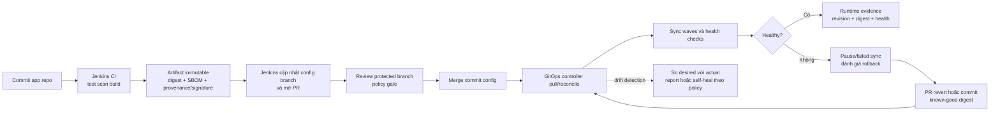

<Callout type="info" title="Phạm vi và giả định">
  Bài này dùng Argo CD và Flux làm ví dụ về GitOps controller, không giả định chúng đã được cài. Jenkins được giả định có Pipeline: Declarative, Git plugin và Credentials Binding; khả năng tạo pull request (PR) còn phụ thuộc SCM integration hoặc API client đã được tổ chức phê duyệt. Xác minh phiên bản plugin, controller, RBAC và policy trên sandbox trước khi dùng cho môi trường thật.
</Callout>

GitOps đặt Git ở vị trí **source of truth** cho desired state: trạng thái mà hệ thống được phép chạy. Jenkins vẫn là CI: build, test, quét, ký và tạo thay đổi có review cho repository cấu hình. Một controller có identity riêng mới reconcile commit đã được chấp thuận vào cluster. Cách tách này giữ Jenkins khỏi quyền cluster rộng khi công việc của nó chỉ là tạo một PR cấu hình.

## Mục lục

- [Mục tiêu và mô hình](#mục-tiêu-và-mô-hình)
  - [Desired state và reconciliation](#desired-state-và-reconciliation)
  - [Ranh giới CI CD](#ranh-giới-ci-cd)
- [Kiến trúc và luồng thay đổi](#kiến-trúc-và-luồng-thay-đổi)
  - [Pull so với push](#pull-so-với-push)
  - [Repository ứng dụng và repository cấu hình](#repository-ứng-dụng-và-repository-cấu-hình)
  - [Promotion bằng commit và digest](#promotion-bằng-commit-và-digest)
- [Manifest có thể review](#manifest-có-thể-review)
  - [Base YAML và Kustomize overlay](#base-yaml-và-kustomize-overlay)
  - [Helm values và JSON patch](#helm-values-và-json-patch)
- [Jenkins tạo change cấu hình](#jenkins-tạo-change-cấu-hình)
  - [Webhook SCM, branch protection và provenance](#webhook-scm-branch-protection-và-provenance)
  - [Jenkinsfile tham khảo](#jenkinsfile-tham-khảo)
- [Controller, policy và vận hành cluster](#controller-policy-và-vận-hành-cluster)
  - [RBAC, secrets và multi-cluster](#rbac-secrets-và-multi-cluster)
  - [Drift sync wave health và outage](#drift-sync-wave-health-và-outage)
  - [Failure và rollback](#failure-và-rollback)
- [Lab local không deployment](#lab-local-không-deployment)
  - [Chuẩn bị fixture](#chuẩn-bị-fixture)
  - [Kiểm tra tĩnh và runtime tùy chọn](#kiểm-tra-tĩnh-và-runtime-tùy-chọn)
  - [Evidence mong đợi và cleanup có guard](#evidence-mong-đợi-và-cleanup-có-guard)
- [Troubleshooting](#troubleshooting)
- [Checklist trước khi áp dụng](#checklist-trước-khi-áp-dụng)
- [Trade-offs](#trade-offs)
- [Nguồn chính thức](#nguồn-chính-thức)
- [Đọc tiếp](#đọc-tiếp)

## Mục tiêu và mô hình

Sau bài này, bạn có thể tách CI khỏi hành động deploy: Jenkins phát hành một image bất biến, còn thay đổi cấu hình được review trong Git và controller đích áp dụng. Bạn cũng có thể chỉ ra digest nào đang được mong muốn, commit nào đã phê duyệt nó, identity nào reconcile và cách quay lại digest đã biết tốt.

### Desired state và reconciliation

**Desired state** là khai báo version-control của workload, ví dụ `Deployment`, Helm values hoặc Kustomize overlay pin image bằng digest. **Actual state** là những gì API Kubernetes hiện trả về. Reconciliation là vòng lặp controller đọc desired state, so sánh với actual state, rồi thực hiện thay đổi được RBAC cho phép để hội tụ hai trạng thái.

Git không tự deploy. Một controller như Argo CD hoặc Flux cần được cài, có quyền đọc repository cấu hình và có identity đến cluster. Nếu controller không chạy hoặc không đọc được Git, commit vẫn là desired state đã review, nhưng actual state không tự đổi. Vì vậy dashboard/controller status là evidence runtime riêng với PR/commit evidence.

<Callout type="warn" title="Không cấp cluster-admin theo quán tính">
  Jenkins không cần `cluster-admin` hay kubeconfig cluster khi pipeline chỉ build, ký image và tạo PR config. Credential rộng biến code CI, agent và plugin thành đường vào cluster. Cấp Jenkins một credential SCM scoped hẹp để tạo branch/PR; cấp controller service account quyền tối thiểu theo namespace và resource mà nó reconcile.
</Callout>

### Ranh giới CI CD

| Thành phần | Trách nhiệm | Capability tối thiểu | Không nên có |
| --- | --- | --- | --- |
| Jenkins CI | Checkout commit tin cậy, test, scan, build, publish digest, tạo attestation/chữ ký, cập nhật config branch | Đọc app repo; ghi immutable artifact; tạo branch/PR config | Kubeconfig production, `cluster-admin`, secret runtime production |
| SCM config | Lưu manifest, PR review, protected branch, commit history | Quyền review/merge theo policy | Secret plaintext hoặc image tag di động |
| GitOps controller | Pull revision đã merge, render, policy-aware sync và health reporting | Đọc config repo; RBAC namespace/cluster đã allowlist | Quyền vô hạn cho mọi cluster nếu không cần |
| Kubernetes và secret manager | Chạy workload, giữ runtime secret, phát event | Workload identity nhỏ nhất | Token Jenkins dùng chung làm runtime secret |

CI kết thúc khi evidence tạo artifact và config change đã có. CD theo GitOps là controller reconcile một revision được chấp thuận. Approval Jenkins, review PR, admission policy và RBAC là các control bổ sung, không control nào thay control nào.

## Kiến trúc và luồng thay đổi

Luồng dưới pin một digest xuyên suốt. Digest trong ví dụ là giá trị minh họa hợp lệ về hình dạng; thay bằng digest do registry và evidence của chính build tạo ra.



Fumadocs không render Mermaid mặc định. Site cần `fumadocs-mermaid` hoặc cấu hình Mermaid tương đương để sơ đồ hiển thị thay vì một code block; điều này không ảnh hưởng nội dung flow.

### Pull so với push

| Mô hình | Ai kết nối tới cluster? | Điểm mạnh | Rủi ro/cần kiểm soát |
| --- | --- | --- | --- |
| Push từ Jenkins | Jenkins agent gọi Kubernetes API | Dễ bắt đầu khi chưa có controller | Jenkins giữ network path, kubeconfig và blast radius của deploy |
| Pull GitOps | Controller trong/được tin cậy bởi môi trường pull Git rồi gọi API | Desired state, drift và reconcile rõ; Jenkins không giữ credential cluster | Cần vận hành controller, repository access và quan sát controller |

Pull không có nghĩa controller luôn tự sửa mọi khác biệt. Chọn policy rõ: phát hiện và báo drift, hay self-heal resource đã allowlist. Với resource có thay đổi khẩn cấp ngoài Git, first response có thể là pause sync, ghi incident và đưa thay đổi về Git thay vì để hai nguồn cùng sửa mãi.

### Repository ứng dụng và repository cấu hình

Tách repository giảm quyền và làm review có ngữ cảnh:

```text
catalog-api/                       # app repo
├── Jenkinsfile
├── src/
└── deploy-contract/               # schema/đường dẫn mà CI được phép sửa

catalog-fleet-config/              # config repo
├── apps/catalog-api/base/
├── apps/catalog-api/overlays/dev/
├── apps/catalog-api/overlays/staging/
└── apps/catalog-api/overlays/production/
```

- App repo chứa source, Jenkinsfile và test. Branch merge của nó phải được bảo vệ; CI release chỉ chạy revision đã merge.
- Config repo chứa desired state không nhạy cảm. `main` hoặc branch môi trường phải protected: required review, status check, signed-commit policy nếu tổ chức dùng, và quyền merge tách với Jenkins bot khi phù hợp.
- Jenkins bot chỉ được tạo branch với prefix như `ci/promotion-`; không nên được bypass protection hoặc push thẳng protected branch. PR title, commit và evidence record phải nêu app commit, config base commit, digest, SBOM/provenance reference và policy result.
- Không commit secret. Dùng Secret manager và External Secrets Operator hoặc cơ chế tương đương **nếu tổ chức đã cài và xác minh**. Controller GitOps và External Secrets là hai controller khác nhau với identity, RBAC, failure mode và audit riêng.

### Promotion bằng commit và digest

Promotion không rebuild source. Jenkins tạo một artifact một lần, rồi dev, staging và production lần lượt chọn cùng `image@sha256:...`. Promote là PR/commit thay overlay môi trường từ digest cũ sang digest đã có evidence. Để rollback, tạo PR mới trỏ đến previous known-good digest; không di chuyển tag.

| Evidence | Phải liên kết với | Không đưa vào |
| --- | --- | --- |
| Artifact | digest, image repository logical name, SBOM, checksum | Registry password, URL chứa token |
| Provenance/chữ ký | app commit, builder identity, thời điểm, policy verify | Private signing key |
| Config change | config commit, PR, reviewers, base revision, digest before/after | Secret runtime |
| Runtime | controller application revision, sync result, health result, namespace/cluster logical name | Kubeconfig hoặc raw secret |

Signed commit chứng minh/ghi nhận author theo cơ chế SCM/Git đã chọn; provenance hoặc image signature liên kết artifact với builder. Hai loại không thay nhau. Admission policy có thể yêu cầu digest, signature hoặc provenance trước khi workload được nhận, nhưng capability này phải được triển khai và thử ở cluster sandbox, không suy ra từ YAML tĩnh.

## Manifest có thể review

### Base YAML và Kustomize overlay

Base dưới chỉ nêu workload. Digest được pin trong overlay để review promotion thành diff nhỏ. Namespace là logical training namespace, không phải endpoint thật.

```yaml title="apps/catalog-api/base/deployment.yaml"
apiVersion: apps/v1
kind: Deployment
metadata:
  name: catalog-api
  labels:
    app.kubernetes.io/name: catalog-api
spec:
  replicas: 2
  selector:
    matchLabels:
      app.kubernetes.io/name: catalog-api
  template:
    metadata:
      labels:
        app.kubernetes.io/name: catalog-api
    spec:
      containers:
        - name: api
          image: registry.training.invalid/catalog-api@sha256:7f83b1657ff1fc53b92dc18148a1d65dfa135014e6e2f9bc4e5f7b7c7a0b42a9
          ports:
            - containerPort: 8080
          readinessProbe:
            httpGet:
              path: /healthz
              port: 8080
          securityContext:
            allowPrivilegeEscalation: false
            readOnlyRootFilesystem: true
```

```yaml title="apps/catalog-api/overlays/staging/kustomization.yaml"
apiVersion: kustomize.config.k8s.io/v1beta1
kind: Kustomization
namespace: catalog-staging
resources:
  - ../../base
images:
  - name: registry.training.invalid/catalog-api
    digest: sha256:7f83b1657ff1fc53b92dc18148a1d65dfa135014e6e2f9bc4e5f7b7c7a0b42a9
patches:
  - path: replicas.patch.yaml
```

```yaml title="apps/catalog-api/overlays/staging/replicas.patch.yaml"
apiVersion: apps/v1
kind: Deployment
metadata:
  name: catalog-api
spec:
  replicas: 3
```

Kustomize cần được version/pin theo toolchain controller hoặc render lane. Render output là static evidence: nó chứng minh syntax/tool output trong version đã chạy, không chứng minh controller credential, RBAC, admission, image pull hay health runtime.

### Helm values và JSON patch

Nếu chart là interface đã được review, pin chart version/digest theo policy và chỉ thay values cần thiết. Không để `--set image.tag=...` trong Jenkins command vì value vừa khó audit vừa khuyến khích tag di động.

```yaml title="apps/catalog-api/overlays/production/values.yaml"
image:
  repository: registry.training.invalid/catalog-api
  digest: sha256:7f83b1657ff1fc53b92dc18148a1d65dfa135014e6e2f9bc4e5f7b7c7a0b42a9
  pullPolicy: IfNotPresent
replicaCount: 4
```

Một updater chỉ được sửa trường digest đã allowlist có thể tạo JSON Patch sau; policy CI phải từ chối patch sửa namespace, service account, RBAC, URL hoặc bất kỳ path nào ngoài hợp đồng promotion.

```json title="promotion.patch.json"
[
  {
    "op": "replace",
    "path": "/image/digest",
    "value": "sha256:7f83b1657ff1fc53b92dc18148a1d65dfa135014e6e2f9bc4e5f7b7c7a0b42a9"
  }
]
```

## Jenkins tạo change cấu hình

### Webhook SCM, branch protection và provenance

Webhook từ GitHub, GitLab hoặc Git server khác chỉ là trigger. Xác minh signature/secret webhook ở reverse proxy hoặc integration đã phê duyệt, hạn chế nguồn gửi và deduplicate delivery ID; webhook không phải bằng chứng rằng branch được phép release. Với Multibranch Pipeline, CI của PR/fork không nhận credential publish, signing hay config write. Release chỉ khởi động từ commit đã merge của protected branch sau khi SCM status/check yêu cầu đã đạt.

Credential SCM tách theo nhiệm vụ: read-only để checkout app/config; publisher immutable để push artifact; bot config có quyền tạo branch/PR trong config repo. Dùng GitHub App, GitLab project/group token hoặc deploy key tùy platform và policy, với scope/repository nhỏ nhất. Nạp credential trong closure ngắn; không đặt token vào remote URL, argv, log, artifact hoặc commit message. Xem [Credentials trong Pipeline](/docs/pipelines/credentials) để áp dụng binding an toàn.

Trước khi bot mở PR, CI cần:

1. kiểm commit source đúng protected branch/revision và verify commit signature theo SCM/Git policy;
2. chạy test bắt buộc, scan dependency/container và policy; lưu report đã redact;
3. publish image immutable, lấy digest từ registry response, tạo SBOM/provenance và ký/verify nếu policy yêu cầu;
4. checkout config repo ở base commit đã biết, chỉ cập nhật path environment được allowlist, render/lint và kiểm diff;
5. push branch bot, mở PR chứa digest/evidence references; PR policy và reviewer quyết định merge.

### Jenkinsfile tham khảo

Ví dụ Declarative này gọi script đã được review. Script nhận token từ environment, không từ argv. Nó không gọi Kubernetes API, không dùng kubeconfig và không sync controller. `create-config-pr` phải kiểm allowlist path/digest, ký commit khi policy yêu cầu và từ chối push protected branch.

```groovy
pipeline {
  agent none

  options {
    skipDefaultCheckout(true)
    disableConcurrentBuilds()
    timeout(time: 45, unit: 'MINUTES')
  }

  stages {
    stage('Build, test, scan, and publish') {
      when { beforeAgent true; branch 'main' }
      agent { label 'trusted-build-linux' }
      steps {
        checkout scm
        sh '''#!/bin/sh
          set -eu
          ./ci/test-required
          ./ci/scan-policy
          ./ci/publish-immutable-image --evidence release/evidence.json
          ./ci/verify-provenance --evidence release/evidence.json
          test -s release/evidence.json
        '''
        stash name: 'release-evidence', includes: 'release/evidence.json'
      }
    }

    stage('Create reviewed config change') {
      when { beforeAgent true; branch 'main' }
      agent { label 'trusted-config-linux' }
      steps {
        checkout scm
        unstash 'release-evidence'
        withCredentials([
          string(credentialsId: 'config-pr-bot-token', variable: 'CONFIG_PR_TOKEN')
        ]) {
          sh '''#!/bin/sh
            set -eu
            set +x
            ./ci/create-config-pr \
              --evidence release/evidence.json \
              --environment staging
          '''
        }
      }
    }
  }
}
```

`config-pr-bot-token` là ID minh họa, không phải secret. Jenkins/agent/plugin, checkout trust, branch detection, credentials binding và behavior API SCM là runtime assumptions. Validate bằng Declarative linter và controller lab, rồi chạy một PR sandbox; [Kiểm thử Jenkinsfile](/docs/pipelines/testing) giải thích vì sao lint không chứng minh runtime.

## Controller, policy và vận hành cluster

### RBAC, secrets và multi-cluster

Controller dùng một service account riêng cho từng trust boundary. Start với `Role`/`RoleBinding` namespace-scoped cho workload namespace; chỉ dùng `ClusterRole` khi resource thực sự cluster-scoped và đã được review. Không cấp quyền sửa RBAC, CRD, admission webhook hoặc namespace cho một application controller nếu nó không cần.

Multi-cluster có thể tổ chức theo repo/branch/path hoặc controller instance riêng. Dù chọn topology nào, giữ cluster logical name, namespace, controller identity, repository permission và promotion policy tách rõ. Một config commit được phép cho staging không nên tự có route sang production. Production branch/path cần protected review và controller credential độc lập.

Secret runtime không ở manifest Git. External Secrets Operator, Secrets Store CSI Driver hay adapter secret manager là lựa chọn kiến trúc, không phải requirement mặc định của GitOps. Với mỗi lựa chọn, xác minh source of truth, workload/controller identity, RBAC path/field, TLS/egress, refresh/rotation, audit, failure mode và recovery. Controller không đọc được secret manager phải làm secret dependency rõ ràng thay vì khiến application khởi động với cấu hình mơ hồ.

Policy gate có thể xuất hiện ở CI render/scan, PR required status, admission controller hoặc controller policy integration. Chúng phải nhất quán về rule version và exception có owner/expiry. Admission deny sau merge là evidence runtime hữu ích; đừng bypass bằng cách cấp controller quyền cao hơn.

### Drift sync wave health và outage

- **Drift detection:** controller so desired revision với actual resources và báo `OutOfSync`/tương đương. Nếu bật self-heal, scope resource và cách xử lý manual hotfix phải được policy quy định.
- **Sync waves/depends-on:** áp dụng CRD, namespace, policy/secret dependency rồi workload theo thứ tự controller hỗ trợ. Đây là capability controller-specific; ghi annotation/field đúng controller đã chọn và thử trong sandbox.
- **Health:** sync thành công chỉ có nghĩa request apply đã được xử lý. Chờ health/rollout đủ thời gian, kiểm readiness, event và telemetry theo SLO trước khi coi promotion thành công.
- **Controller hoặc SCM outage:** desired state đã merge không mất, nhưng reconciliation có thể chậm hoặc dừng. Không dùng Jenkins push trực tiếp làm đường tắt. Alert on controller/repository access, freeze promotion khi cần và follow runbook recovery của controller/SCM.

Audit cần nối SCM PR/commit, Jenkins build, artifact/provenance, controller revision/sync/health, admission event và change decision. Console log Jenkins không tự là audit trail đầy đủ; xem [Audit & Compliance](/docs/security/audit-compliance) để thiết kế retention, redaction và evidence custody.

### Failure và rollback

Khi health fail, đầu tiên xác định actual state: revision nào controller đã apply, digest nào pod đã resolve, sync đang running hay failed, database/schema có tương thích rollback hay không. Pause promotion/auto-sync theo runbook nếu cần để tránh controller lập lại thay đổi trong lúc điều tra.

Rollback GitOps là một commit/PR đã review đưa manifest về **known-good digest**, rồi controller reconcile và health check lại. Không xóa resource mù quáng, không đổi tag và không rebuild artifact. Nếu migration database không tương thích ngược, chọn forward-fix, expand/contract hoặc restore đã được phê duyệt thay vì ép binary cũ chạy trên schema mới. Đọc [Rollback Strategy](/docs/delivery/rollback) cho decision theo artifact, feature flag và database.

| Tình huống | Hành động an toàn | Evidence |
| --- | --- | --- |
| PR policy fail | Không merge; sửa config/evidence rồi tạo review mới | status check, policy revision, PR discussion |
| Controller không đọc Git | Không push từ Jenkins để vượt qua | alert, controller log đã redact, last successful revision |
| Sync fail | Dừng promotion, đọc diff/event/RBAC, quyết định retry idempotent hoặc rollback | sync result, rendered revision, admission event |
| Health fail sau sync | Giữ current/previous digest, kiểm telemetry và compatibility | health status, rollout events, decision owner |
| Drift do hotfix | Ghi incident, quyết định revert hotfix hoặc cập nhật Git | actual diff, commit/PR, remediation outcome |

## Lab local không deployment

Lab chỉ tạo hai Git repository local và render text fixture. Nó không gọi registry, SCM bên ngoài, Jenkins, GitOps controller, Kubernetes API, `kubectl apply`, sync hay deploy. Tất cả names/digests là training data. Chạy trong shell có Git; `kustomize` chỉ là kiểm tra static nếu đã được cài.

### Chuẩn bị fixture

```bash
set -eu

LAB_PARENT="${TMPDIR:-/tmp}"
LAB_PREFIX='gitops-jenkins-lab.'
LAB_ROOT="$(mktemp -d "${LAB_PARENT%/}/${LAB_PREFIX}XXXXXX")"

case "$LAB_ROOT" in
  "${LAB_PARENT%/}/${LAB_PREFIX}"*) ;;
  *) printf '%s\n' 'Refuse unexpected lab path.' >&2; exit 1 ;;
esac
[ "$(dirname -- "$LAB_ROOT")" = "${LAB_PARENT%/}" ] || {
  printf '%s\n' 'Refuse non-direct lab child.' >&2; exit 1;
}
: > "$LAB_ROOT/.lab-owned"

mkdir -p "$LAB_ROOT/app" "$LAB_ROOT/config/apps/catalog-api/overlays/staging"
git -C "$LAB_ROOT/app" init -q
git -C "$LAB_ROOT/config" init -q
printf '%s\n' 'training source only' > "$LAB_ROOT/app/README.md"
printf '%s\n' 'sha256:7f83b1657ff1fc53b92dc18148a1d65dfa135014e6e2f9bc4e5f7b7c7a0b42a9' \
  > "$LAB_ROOT/app/release.digest"
cat > "$LAB_ROOT/config/apps/catalog-api/overlays/staging/values.yaml" <<'EOF'
image:
  repository: registry.training.invalid/catalog-api
  digest: sha256:7f83b1657ff1fc53b92dc18148a1d65dfa135014e6e2f9bc4e5f7b7c7a0b42a9
EOF

git -C "$LAB_ROOT/app" add README.md release.digest
git -C "$LAB_ROOT/app" -c user.name='Training CI' -c user.email='ci@training.invalid' \
  commit -qm 'training: record immutable digest'
git -C "$LAB_ROOT/config" add apps/catalog-api/overlays/staging/values.yaml
git -C "$LAB_ROOT/config" -c user.name='Training Config' -c user.email='config@training.invalid' \
  commit -qm 'training: pin staging digest'
printf 'Lab root: %s\n' "$LAB_ROOT"
```

Local commits are not signed; that is intentional for a static fixture. A real workflow verifies signed commits/provenance according to organization policy, not by treating this lab marker as release evidence.

### Kiểm tra tĩnh và runtime tùy chọn

Static checks inspect only fixture files and Git history. They do not verify Jenkins plugin behavior, signature enforcement, registry signing, controller RBAC, a real cluster, admission policy or application health.

```bash
set -eu
: "${LAB_ROOT:?Run the setup block in the same shell}"
test -f "$LAB_ROOT/.lab-owned"
DIGEST="$(cat "$LAB_ROOT/app/release.digest")"
grep -Fqx "  digest: $DIGEST" \
  "$LAB_ROOT/config/apps/catalog-api/overlays/staging/values.yaml"
git -C "$LAB_ROOT/app" log -1 --format='%H %s'
git -C "$LAB_ROOT/config" diff --check HEAD~1 HEAD
printf '%s\n' 'Static fixture checks passed; no controller or cluster was contacted.'
```

Nếu đã có kind hoặc minikube **sandbox riêng**, dùng nó chỉ để chuẩn bị controller test theo runbook của đội. Không lấy kubeconfig production, không trỏ controller tới repo thật và không bật auto-sync trong lab này. Runtime test chỉ được coi là pass khi controller sandbox đã reconcile một repo sandbox, health/evidence đã được thu, và cleanup policy của cluster đã được owner duyệt; các bước đó nằm ngoài fixture tĩnh ở đây.

### Evidence mong đợi và cleanup có guard

Evidence static mong đợi gồm đường dẫn lab, hai commit SHA local, digest giống nhau ở app/config và `git diff --check` pass. Nó chứng minh fixture/guard, không chứng minh deployment.

Chỉ cleanup sau khi đã đọc evidence. Guard kiểm parent, prefix, marker và child trực tiếp trước khi xóa directory mà lab vừa tạo.

```bash
set -eu
: "${LAB_ROOT:?LAB_ROOT is required}"
LAB_PARENT="${TMPDIR:-/tmp}"
LAB_PREFIX='gitops-jenkins-lab.'
case "$LAB_ROOT" in
  "${LAB_PARENT%/}/${LAB_PREFIX}"*)
    [ "$(dirname -- "$LAB_ROOT")" = "${LAB_PARENT%/}" ] &&
    test -f "$LAB_ROOT/.lab-owned" || {
      printf '%s\n' 'Refuse cleanup: parent or marker guard failed.' >&2; exit 1;
    }
    rm -rf -- "$LAB_ROOT"
    printf '%s\n' 'Removed only the guarded training fixture.'
    ;;
  *) printf '%s\n' 'Refuse cleanup outside lab prefix.' >&2; exit 1 ;;
esac
```

## Troubleshooting

| Dấu hiệu | Kiểm tra có evidence | Hành động an toàn |
| --- | --- | --- |
| Jenkins PR không xuất hiện | Webhook delivery ID, Multibranch scan, bot scope, branch/PR policy | Replay qua cơ chế SCM sandbox sau khi deduplicate; không cấp bot quyền bypass branch protection |
| PR chứa digest khác evidence | Artifact manifest, config diff, base SHA, updater allowlist | Close PR, điều tra source; không sửa digest trực tiếp trên protected branch |
| Controller `OutOfSync` | Desired revision, actual resource diff, ownership field, manual change record | Quyết định revert hotfix hoặc update Git; chỉ bật self-heal khi policy cho resource đó |
| Sync fail `Forbidden` | Controller service account, namespace, API event, rendered manifest | Sửa RBAC hẹp hoặc manifest; không cấp `cluster-admin` để qua lỗi |
| Image pull hoặc signature policy fail | Digest, registry permission, signature/provenance verification event | Dừng promotion, xác minh artifact/policy; không thay bằng tag di động |
| Health fail sau sync | Controller health, rollout status, dependency/telemetry, schema version | Pause, xác định current state rồi rollback PR/commit hoặc forward-fix có owner |
| Secret không xuất hiện | External secret controller status, identity/RBAC, secret manager audit, app event | Khôi phục dependency theo runbook; không commit secret vào config repo |
| Controller/SCM outage | Last synced revision, queue/error, alert, recovery runbook | Freeze release nếu policy cần; không dùng Jenkins direct deploy làm bypass |

## Checklist trước khi áp dụng

- [ ] Desired state nằm trong config repo reviewable; app repo và config repo có owner, protected branch và policy rõ.
- [ ] Jenkins build một lần, publish artifact immutable, pin digest trong config và không rebuild khi promote.
- [ ] Jenkins chỉ có SCM/artifact/signing capability cần thiết; không có kubeconfig hay quyền cluster rộng nếu không thực sự deploy.
- [ ] PR bot chỉ tạo branch/PR scoped, không bypass protection; webhook được xác minh và PR/fork không nhận release credential.
- [ ] Commit signing, artifact provenance/chữ ký, SBOM và verify policy được phân biệt; exception có owner và expiry.
- [ ] Kustomize/Helm/JSON patch chỉ sửa field/path allowlist; render, diff và policy check chạy trước PR.
- [ ] Controller, plugin/adapter, repo access, RBAC, sync, health và failure behavior được ghi là assumptions và thử trên sandbox.
- [ ] Namespace/cluster/controller identity tách theo môi trường; multi-cluster không dùng credential chung không cần thiết.
- [ ] Secrets ở secret manager/External Secrets integration đã review, có IAM/TLS/audit/rotation/fail-closed behavior; không nằm trong Git.
- [ ] Drift, sync order, health, rollback commit, database compatibility, alert và outage runbook có owner/evidence.
- [ ] Audit nối được app commit, artifact digest, config PR/commit, controller revision, health và decision mà không chứa secret.
- [ ] Lab dùng repo giả, marker/prefix/parent guard; static evidence và runtime evidence không bị lẫn.

## Trade-offs

| Lựa chọn | Lợi ích | Chi phí/giới hạn |
| --- | --- | --- |
| GitOps pull | Giảm credential cluster ở Jenkins, desired state/audit rõ, phát hiện drift | Vận hành controller, repo access và observability; reconcile không tức thời |
| Một config repo chung | Dễ chuẩn hóa policy và thấy promotion diff | Có thể tạo contention; cần ownership/path protection nghiêm |
| Repo config theo team/môi trường | Blast radius và quyền nhỏ hơn | Nhiều controller/PR policy/inventory hơn |
| Auto-sync/self-heal | Hội tụ nhanh với desired state | Có thể ghi đè hotfix; cần allowlist, alert và pause procedure |
| PR promotion | Review, SoD và evidence tốt | Chậm hơn direct change; cần SLA reviewer và automation an toàn |

## Nguồn chính thức

- [Jenkins Pipeline](https://www.jenkins.io/doc/book/pipeline/) — Pipeline as Code, agents và stages.
- [Jenkins: Using credentials](https://www.jenkins.io/doc/book/using/using-credentials/) — scope và permission credential.
- [Credentials Binding plugin](https://plugins.jenkins.io/credentials-binding/) — binding ngắn và giới hạn masking.
- [Argo CD documentation](https://argo-cd.readthedocs.io/) — application reconciliation, sync và health theo phiên bản đang vận hành.
- [Flux documentation](https://fluxcd.io/flux/) — reconciliation của GitOps Toolkit và dependency theo phiên bản đang vận hành.
- [Kubernetes RBAC](https://kubernetes.io/docs/reference/access-authn-authz/rbac/) — Role, ClusterRole và least privilege.
- [Kubernetes Deployments](https://kubernetes.io/docs/concepts/workloads/controllers/deployment/) — rollout và trạng thái workload.
- [Kustomize](https://kustomize.io/) — base, overlay và transform configuration.
- [Helm chart template guide](https://helm.sh/docs/chart_template_guide/) — values và template chart.
- [Sigstore Cosign](https://docs.sigstore.dev/cosign/) — ký và verify artifact theo policy tổ chức.
- [SLSA](https://slsa.dev/) — provenance và supply-chain levels.
- [External Secrets Operator](https://external-secrets.io/) — integration secret manager cần review riêng.

## Đọc tiếp

<Cards>
  <Card title="Jenkinsfile" href="/docs/pipelines/jenkinsfile" description="Đặt CI policy trong SCM và validate đúng giới hạn." />
  <Card title="Credentials trong Pipeline" href="/docs/pipelines/credentials" description="Bind secret scope ngắn, không qua log hoặc argv." />
  <Card title="Kiểm thử Jenkinsfile" href="/docs/pipelines/testing" description="Tách lint, mock và runtime controller sandbox." />
  <Card title="Environment Promotion" href="/docs/case-studies/multi-environment" description="Promote cùng artifact bất biến qua các môi trường." />
  <Card title="Rollback Strategy" href="/docs/delivery/rollback" description="Quyết định rollback application và database có kiểm soát." />
  <Card title="Audit & Compliance" href="/docs/security/audit-compliance" description="Thiết kế evidence, retention và audit trail đã redact." />
</Cards>
