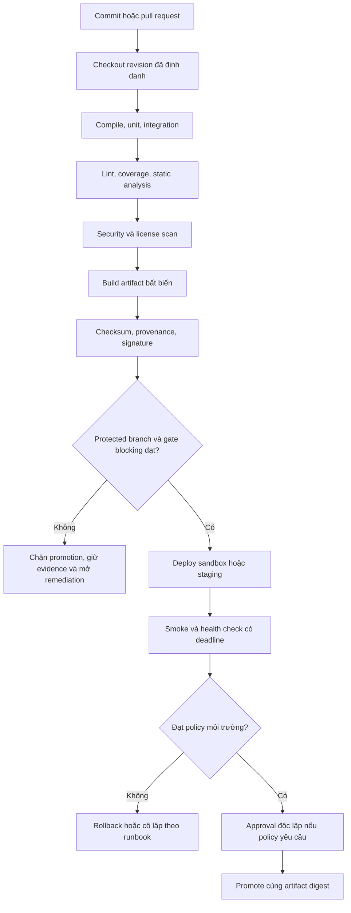

<Callout type="info" title="Phạm vi">
  Quality gate là quyết định có chủ đích dựa trên bằng chứng của một revision và artifact xác định. Jenkins điều phối các bước, còn scanner, test runner, repository và hệ thống deploy mới tạo tín hiệu. Ví dụ chỉ dùng dữ liệu lab; phải xác minh Jenkins core, plugin, toolchain và policy của tổ chức trước khi áp dụng.
</Callout>

Một pipeline đáng tin cậy không chỉ có stage tên `Quality`. Nó biết tín hiệu nào chặn tiến trình, tín hiệu nào chỉ cảnh báo, ngưỡng nào áp dụng cho revision nào và bằng chứng được giữ ở đâu. Trang này giúp thiết kế gate theo tầng, từ biên dịch đến xác nhận sau deploy, mà không biến failure thành build xanh giả.

## Mục lục

- [Mục tiêu và nguyên tắc](#mục-tiêu-và-nguyên-tắc)
  - [Định nghĩa và ranh giới](#định-nghĩa-và-ranh-giới)
  - [Advisory và blocking](#advisory-và-blocking)
- [Luồng quyết định và ma trận gate](#luồng-quyết-định-và-ma-trận-gate)
  - [Luồng evidence](#luồng-evidence)
  - [Ma trận theo tầng](#ma-trận-theo-tầng)
- [Thiết kế policy có thể kiểm toán](#thiết-kế-policy-có-thể-kiểm-toán)
  - [Ngưỡng, version và evidence](#ngưỡng-version-và-evidence)
  - [Branch, pull request và trust](#branch-pull-request-và-trust)
  - [Waiver và flaky test quarantine](#waiver-và-flaky-test-quarantine)
- [Tín hiệu kiểm thử và chất lượng mã](#tín-hiệu-kiểm-thử-và-chất-lượng-mã)
  - [Compile, unit và integration](#compile-unit-và-integration)
  - [Lint, coverage và static analysis](#lint-coverage-và-static-analysis)
- [Security, license và artifact provenance](#security-license-và-artifact-provenance)
  - [Các scan theo rủi ro](#các-scan-theo-rủi-ro)
  - [Provenance, checksum và chữ ký](#provenance-checksum-và-chữ-ký)
- [Jenkinsfile mẫu: gate chặn và evidence](#jenkinsfile-mẫu-gate-chặn-và-evidence)
  - [Plugin và runtime caveat](#plugin-và-runtime-caveat)
  - [Vì sao failure không bị nuốt](#vì-sao-failure-không-bị-nuốt)
- [Gate deploy, approval và rollback](#gate-deploy-approval-và-rollback)
  - [Smoke và health check](#smoke-và-health-check)
  - [Phê duyệt và separation of duties](#phê-duyệt-và-separation-of-duties)
  - [Failure sau deploy](#failure-sau-deploy)
- [Timeout, retry và abort](#timeout-retry-và-abort)
- [Lưu giữ evidence và vận hành](#lưu-giữ-evidence-và-vận-hành)
- [Lab local với kết quả giả](#lab-local-với-kết-quả-giả)
  - [Tạo evidence tái lập](#tạo-evidence-tái-lập)
  - [Đọc kết quả và dọn dẹp có guard](#đọc-kết-quả-và-dọn-dẹp-có-guard)
- [Troubleshooting](#troubleshooting)
- [Checklist áp dụng](#checklist-áp-dụng)
- [Trade-off cần quyết định](#trade-off-cần-quyết-định)
- [Nguồn chính thức](#nguồn-chính-thức)
- [Đọc tiếp](#đọc-tiếp)

## Mục tiêu và nguyên tắc

Sau bài này, bạn có thể lập policy gate cho một Jenkins Pipeline: đặt ngưỡng theo rủi ro, gắn revision và artifact vào evidence, phân biệt cảnh báo với điều kiện chặn, quản lý ngoại lệ có hạn, và xử lý failure sau deploy mà vẫn giữ đường rollback. Điểm bắt đầu về vòng phản hồi CI/CD là [Nền tảng CI/CD](/docs/getting-started/ci-cd-fundamentals); cách tổ chức test nằm ở [Tự động hóa kiểm thử](/docs/delivery/test-automation).

### Định nghĩa và ranh giới

**Quality gate** là một quy tắc quyết định có input, ngưỡng, outcome và owner rõ ràng. Ví dụ: “unit test XML của commit hiện tại không có failure” là gate; “đã chạy stage Test” không phải gate. Một gate tốt luôn trả lời được năm câu hỏi:

1. **Kiểm tra gì?** Ví dụ compiler, test, linter, scanner, checksum hoặc smoke endpoint.
2. **Áp dụng cho đâu?** Revision SCM, branch/PR, artifact digest và môi trường cụ thể.
3. **Ngưỡng nào?** Ví dụ coverage trên mã mới không dưới 80%, không có vulnerability mức `critical`, hoặc health check trả mã mong đợi.
4. **Quyết định nào?** `blocking`, `advisory`, hoặc cần owner review; không suy luận từ màu giao diện.
5. **Bằng chứng và owner ở đâu?** Report thô, build URL, policy version, người chịu trách nhiệm và retention.

Phân biệt rõ các lớp sau:

| Lớp | Trả lời câu hỏi | Không tự chứng minh |
| --- | --- | --- |
| Static check | File, lockfile, XML/JSON report hay rule có đúng cấu trúc/ngưỡng không? | Jenkins controller, plugin, agent hoặc service bên ngoài hoạt động. |
| Test/scanner runtime | Tool đã chạy trên agent với input xác định và trả exit code/report gì? | Artifact đã được ký, deploy đúng, hay production khỏe. |
| Jenkins/plugin runtime | Step Pipeline và plugin đã thực thi theo version/cấu hình controller hiện tại? | Policy nghiệp vụ hay trust của source đã đúng. |
| Release gate | Artifact đã được phép đi tới môi trường tiếp theo? | Monitoring sau deploy sẽ luôn phát hiện mọi lỗi. |

Không để parser report thay thế command tạo report. `junit` chỉ đọc XML JUnit; nó không chạy test. Tương tự, `recordIssues` chỉ có khi plugin tương ứng được cài và cấu hình; nó không chạy linter hay scanner.

### Advisory và blocking

Gate **blocking** dừng promotion hoặc deploy khi không đạt. Dùng cho tín hiệu liên quan trực tiếp đến correctness, security hoặc release integrity đã đủ tin cậy: compile failure, test bắt buộc lỗi, artifact thiếu checksum, policy release branch không đạt, hay health check sau deploy thất bại.

Gate **advisory** vẫn lưu và thông báo evidence nhưng không một mình chặn. Nó phù hợp cho rule mới đang được baseline, style issue có owner, scan chưa có khả năng sửa trong thời gian ngắn, hoặc diagnostics phụ trợ. Advisory không được gọi là “pass”; outcome nên là `UNSTABLE`, review bắt buộc hoặc một trạng thái do policy quy định, không phải `SUCCESS` giả.

| Tình huống | Mặc định hợp lý | Điều kiện đổi quyết định |
| --- | --- | --- |
| Compile hoặc unit test required lỗi | Blocking | Chỉ được tách test đã xác nhận flaky sang quarantine có expiry. |
| Lint rule mới | Advisory trong thời gian baseline | Chuyển blocking khi owner, false-positive rate và remediation path đã rõ. |
| Coverage trên mã mới giảm dưới ngưỡng | Blocking cho protected branch/release | Có waiver được phê duyệt, scope hẹp và ngày hết hạn. |
| Medium finding từ dependency scan | Advisory hoặc blocking theo exploitability/policy | Chuyển blocking khi package được reachable, có fix hoặc thuộc asset nhạy cảm. |
| Critical finding, chữ ký artifact không hợp lệ | Blocking | Không dùng waiver thường quy; theo incident/exception policy cao hơn. |
| Upload diagnostics phụ trợ lỗi | Advisory, nhưng báo rõ evidence thiếu | Không để việc này che failure của gate bắt buộc. |

<Callout type="warn" title="Không dùng màu build làm policy">
  `UNSTABLE`, stage màu vàng hay report được publish không có nghĩa release được phép. Policy phát hành phải kiểm tra outcome của các gate blocking, waiver còn hiệu lực, artifact digest và approval cần thiết.
</Callout>

## Luồng quyết định và ma trận gate

### Luồng evidence



Mermaid cần được project cấu hình renderer để hiển thị; nếu chưa có, Fumadocs sẽ hiển thị block mã. Sơ đồ mô tả policy mong muốn, không khẳng định Jenkins core tự có scanner, signer, repository hay cơ chế rollback.

### Ma trận theo tầng

Ngưỡng dưới là **mẫu để thảo luận**, không phải số liệu phổ quát. Owner sản phẩm, security và release phải chấp thuận rule, version policy và thời hạn review.

| Tầng gate | Tín hiệu/evidence tối thiểu | Mẫu ngưỡng hoặc quyết định | PR/branch thường | Protected release | Owner |
| --- | --- | --- | --- | --- | --- |
| Compile | Exit code, compiler log đã redact, revision | Exit code `0` | Blocking | Blocking | Team phát triển |
| Unit test | XML JUnit, số test/failure, command exit code | `0` failure; report phải tồn tại | Blocking | Blocking | Team phát triển |
| Integration test | XML/report, ID sandbox, duration | Bộ bắt buộc pass; deadline rõ | Blocking khi đủ ổn định | Blocking | Service owner |
| Lint/static rule | Report versioned, rule set/version tool | Không có rule blocking; debt mới theo baseline | Advisory hoặc blocking | Blocking cho rule đã mature | Code owner |
| Coverage | Report coverage, baseline/revision | Mã mới ≥ 80%; không giảm baseline quá policy | Blocking hoặc advisory theo maturity | Blocking | Code owner |
| SAST | Report, rule pack/version, triage ref | Không có finding severity policy cấm | Blocking cho critical/high đã triage | Blocking | Security + team |
| Dependency/license | SBOM, scan report, policy version | Không có license cấm hoặc package severity cấm | Advisory/Blocking theo risk | Blocking | Security/legal owner |
| Container scan | Image digest, scan DB timestamp, report | Không có finding severity cấm ở image digest | Advisory nếu image không release | Blocking | Platform + team |
| Provenance/signature | Digest, attestation/signature verification | Digest khớp; signature/identity hợp lệ | Không cần nếu chưa publish | Blocking | Release owner |
| Deploy smoke/health | Deploy revision/digest, probe log, monitoring link | Route/health expected; deadline không vượt | Sandbox lane | Blocking trước promote | Environment owner |
| Manual approval | Approver, timestamp, change/waiver ref | Approver độc lập và policy còn hiệu lực | Không mặc định | Blocking khi risk yêu cầu | Release approver |

Một gate không thể đánh giá phải có outcome riêng như **inconclusive** hoặc **infrastructure failure**, owner và deadline xử lý. Với release, “scanner không chạy được” thường phải fail closed nếu scanner là blocking; không tự đổi sang pass vì service scan tạm không sẵn sàng.

## Thiết kế policy có thể kiểm toán

### Ngưỡng, version và evidence

Lưu policy như code hoặc một record reviewable. Mỗi thay đổi ngưỡng phải có lý do, người duyệt và revision policy. Tránh một dashboard chỉ giữ giá trị hiện tại vì bạn sẽ không biết build cũ được xét theo rule nào.

| Thuộc tính | Ví dụ evidence | Vì sao cần |
| --- | --- | --- |
| Subject | commit SHA, source URL đã redact, PR/branch ref | Chống nhầm report của revision khác. |
| Artifact | tên, version bất biến, SHA-256 hoặc image digest | Promotion dùng đúng bytes đã kiểm tra. |
| Policy | `quality-policy` revision, rule pack, scanner/tool version | Tái hiện quyết định khi threshold đổi. |
| Outcome | pass/fail/advisory/inconclusive, exit code | Không suy luận từ console màu sắc. |
| Evidence reference | JUnit XML, SARIF/JSON, SBOM, log, build URL | Điều tra được kết luận mà không dump secret. |
| Decision | waiver/approval ID, approver, expiry | Chứng minh ngoại lệ không trở thành mặc định. |
| Retention | class, storage ref, expiry/legal hold | Report và artifact có vòng đời tách biệt. |

Coverage có giá trị nhất khi đo **mã mới** và có test meaningful. Một tổng coverage cao có thể che module mới không test; ngược lại, ép coverage toàn repository tăng ngay có thể khuyến khích test nông. Ghi rõ scope, ví dụ line/branch coverage, excluded generated code, tool version và baseline. Không hạ ngưỡng để một pull request cụ thể qua gate mà không review policy.

### Branch, pull request và trust

Jenkinsfile của PR là code có thể sửa command, agent label, artifact và đường dẫn upload. Do đó trust của source quyết định credential, agent và gate nào được chạy.

- **PR từ fork hoặc source không tin cậy:** chỉ chạy compile, unit, lint và scan không có secret trên agent cô lập. Không publish artifact release, không ký, không deploy, không dùng credential registry/production và không nhận approval như một cách cấp capability.
- **PR nội bộ đã review:** có thể chạy thêm integration sandbox nếu dependency, data, egress và agent trust phù hợp. Credential sandbox vẫn phải scope hẹp và không truyền qua argv/log.
- **`main` hoặc protected branch sau merge:** chạy gate release candidate, tạo artifact digest, provenance/signature và deploy vào môi trường được policy cho phép.
- **Release branch/tag được bảo vệ:** chỉ promote artifact đã build từ revision đã xét; yêu cầu status check bắt buộc, approver độc lập và xác minh artifact digest. Không rebuild cùng version bằng source khác rồi gọi đó là cùng release.

Branch protection ở SCM và authorization ở Jenkins là các control khác nhau. Cả hai đều cần: branch protection bảo vệ review/merge, còn Jenkins folder/job/credential/agent policy bảo vệ capability thực thi. Đọc [Authorization & RBAC](/docs/security/authorization) và [Credentials & Secrets](/docs/security/credentials-secrets) trước khi đưa release secret vào Pipeline.

### Waiver và flaky test quarantine

**Waiver** là ngoại lệ với một gate, không phải comment “đã biết”. Record waiver cần chứa rule/finding hoặc test cụ thể, scope revision/artifact/môi trường, lý do và mitigation, owner chịu trách nhiệm, approver độc lập, ngày bắt đầu, **expiry**, ticket/evidence reference và tiêu chí đóng. Automation phải kiểm tra expiry; waiver hết hạn phải chặn như rule gốc hoặc chuyển đến policy đã nêu, không âm thầm gia hạn.

Không dùng waiver rộng cho `critical` security finding, signature failure hoặc control pháp lý nếu policy tổ chức không cho phép. Những trường hợp này cần luồng exception/incident có cấp phê duyệt cao hơn và compensating controls cụ thể.

Flaky test là test cho kết quả không xác định với cùng source, input và môi trường tương đương. Không retry toàn bộ test command để biến lần đỏ đầu thành xanh. Quy trình quarantine tối thiểu:

1. Lưu commit, build URL, JUnit XML, log, duration, sandbox ID và dấu hiệu tái hiện.
2. Tạo ticket có owner, giả thuyết nguyên nhân, ngày review và tiêu chí đưa test trở lại gate.
3. Chỉ sau khi xác nhận flaky, tách test vào quarantine lane vẫn chạy và publish report; failure của lane này là advisory có thể quan sát.
4. Đặt expiry ngắn. Khi hết hạn, test quay lại blocking hoặc owner phải gia hạn bằng evidence mới.
5. Sửa nguyên nhân và chạy lặp trên cùng revision/môi trường trước khi đóng ticket.

Quarantine không được dùng để bỏ qua test fail chưa điều tra, và dashboard phải tách số failure quarantined khỏi bộ gate bắt buộc.

## Tín hiệu kiểm thử và chất lượng mã

### Compile, unit và integration

Đặt các check rẻ, xác định ở đầu critical path. Compile xác nhận source/dependency có thể tạo output. Unit test xác minh logic cô lập nhanh. Integration test xác minh ranh giới database, queue hoặc service trên sandbox có dữ liệu/capacity riêng. [Tự động hóa kiểm thử](/docs/delivery/test-automation) giải thích cách xuất JUnit và cô lập tài nguyên theo build.

`junit allowEmptyResults: false` phù hợp khi report là evidence bắt buộc: report thiếu trở thành lỗi cấu hình hoặc lỗi test runner cần sửa. Đặt publish vào `post { always { ... } }` để report vẫn được lưu sau test failure; command test vẫn phải trả lỗi để Pipeline dừng. Không dùng `|| true`, `catchError` hoặc `allowEmptyResults: true` để lách required test.

### Lint, coverage và static analysis

Lint và static analysis đọc source hoặc output để tìm format, bug pattern, code smell hay vi phạm rule. Chúng khác test runtime: linter pass không chứng minh application chạy được; test pass không chứng minh rule security/style đã được kiểm tra.

Với Jenkins, chọn một trong các đường sau sau khi đã xác minh runtime:

- Tool tự chạy trong `sh` và trả exit code khi rule blocking vi phạm. Đây là source of truth của gate.
- [Warnings Next Generation plugin](https://plugins.jenkins.io/warnings-ng/) có thể cung cấp `recordIssues` để publish issues/trend. Step, tool adapter và quality-gate parameters là **plugin-specific**; lấy snippet từ Pipeline Syntax trên controller tương ứng, pin/review plugin và không giả định nó đã cài.
- [SonarQube Scanner for Jenkins plugin](https://plugins.jenkins.io/sonar/) có thể cung cấp `withSonarQubeEnv` và `waitForQualityGate`. Đây là integration với server SonarQube, không phải capability Jenkins core.

Một linter report có thể được archive làm evidence ngay cả khi tool đã fail. Điều đó không biến issues thành non-blocking: policy và exit code quyết định. Nếu dùng `recordIssues`, tránh đặt chất lượng dựa trên report parser khi scanner command không được chạy hoặc report path có thể còn từ workspace cũ.

## Security, license và artifact provenance

### Các scan theo rủi ro

Không có một “security scan” thay thế các lớp sau. Mỗi scanner có coverage, false positive, database/rule version và failure mode riêng.

| Kiểm tra | Input điển hình | Gate cần xác định | Lưu ý |
| --- | --- | --- | --- |
| SAST | Source, build metadata | Severity/rule nào chặn; baseline và triage | Không chứng minh dependency hoặc image không có CVE. |
| Dependency scan | Lockfile, manifest, SBOM | Severity, reachability, fix availability, exception expiry | Database advisory thay đổi theo thời gian; ghi timestamp/version. |
| License scan | Dependency graph/SBOM | License cấm, review obligation, legal owner | Security severity không thay thế license policy. |
| Container scan | Image **digest**, OS/package inventory | Severity, base-image age, exception policy | Scan tag di động có thể kiểm tra bytes khác artifact release. |
| Secret scan | Source/history theo policy | Finding credibility và revoke path | Không in secret tìm thấy vào console/evidence. |

Tất cả scan phải chạy với input đã định danh và không truyền token qua command line. Cho registry, SonarQube hoặc API scanner, dùng credential scope ngắn theo plugin/client đã review; không echo environment, không bật `set -x`, không đưa secret vào URL/header argv. Khi PR không tin cậy, không cấp credential release để “đủ dữ liệu scan”.

### Provenance, checksum và chữ ký

Một artifact có version dễ đọc nhưng vẫn có thể bị thay bytes. Release gate nên gắn identity bất biến:

- **Digest/checksum:** hash của output, ví dụ SHA-256 hoặc OCI image digest; xác minh bytes trước deploy/promotion.
- **Provenance/attestation:** record ai/automation nào build artifact từ source revision, với builder/policy version và input cần thiết theo standard tổ chức.
- **Signature:** chứng minh identity ký đã được trust policy chấp nhận; verification phải kiểm tra signature, identity/key reference và artifact digest, không chỉ file signature tồn tại.
- **SBOM:** inventory component của artifact/digest xác định; dùng cho vulnerability và license review.

Jenkins `fingerprint` giúp liên kết file giữa jobs trong Jenkins, nhưng không thay checksum verification ở kho ngoài hay artifact signature. Repository, signer và verifier đều là runtime integrations cần owner, IAM, audit và test sandbox. [Artifact Repositories](/docs/integrations/artifact-repositories) là nơi thiết kế publish/retention; không publish từ PR không tin cậy.

## Jenkinsfile mẫu: gate chặn và evidence

Mẫu dưới dùng Maven để minh họa. Nó cần agent `trusted-linux-maven` có JDK/Maven và dự án thật có report paths tương ứng. `junit`, `archiveArtifacts`, `withSonarQubeEnv` và `waitForQualityGate` là Pipeline/plugin steps; xác minh plugin, version, global configuration và agent toolchain trên controller sandbox trước khi dùng.

```groovy
pipeline {
  agent { label 'trusted-linux-maven' }

  options {
    timestamps()
    skipDefaultCheckout(true)
    timeout(time: 30, unit: 'MINUTES')
  }

  stages {
    stage('Checkout') {
      steps {
        checkout scm
        sh 'mkdir -p evidence && git rev-parse HEAD > evidence/source-revision.txt'
      }
    }

    stage('Compile and unit test') {
      steps {
        sh 'mvn -B -ntp test'
      }
      post {
        always {
          junit allowEmptyResults: false,
            testResults: 'target/surefire-reports/*.xml'
          archiveArtifacts allowEmptyArchive: true,
            artifacts: 'target/surefire-reports/**,evidence/source-revision.txt',
            fingerprint: true
        }
      }
    }

    stage('Integration test') {
      options {
        timeout(time: 12, unit: 'MINUTES')
      }
      steps {
        sh 'mvn -B -ntp -Pintegration verify'
      }
      post {
        always {
          junit allowEmptyResults: false,
            testResults: 'target/failsafe-reports/*.xml'
          archiveArtifacts allowEmptyArchive: true,
            artifacts: 'target/failsafe-reports/**', fingerprint: true
        }
      }
    }

    stage('Static analysis') {
      steps {
        withSonarQubeEnv('sonarqube-sandbox') {
          sh 'mvn -B -ntp sonar:sonar'
        }
      }
    }

    stage('Sonar quality gate') {
      options {
        timeout(time: 8, unit: 'MINUTES')
      }
      steps {
        waitForQualityGate abortPipeline: true
      }
    }

    stage('Package and manifest') {
      steps {
        sh 'mvn -B -ntp -DskipTests package'
        sh 'sha256sum target/*.jar > evidence/artifact.sha256'
        archiveArtifacts artifacts: 'target/*.jar,evidence/*.txt,evidence/*.sha256',
          fingerprint: true
      }
    }
  }

  post {
    always {
      archiveArtifacts allowEmptyArchive: true,
        artifacts: 'evidence/**', fingerprint: true
    }
  }
}
```

### Plugin và runtime caveat

`withSonarQubeEnv('sonarqube-sandbox')` lấy cấu hình server tên đó từ Jenkins và đưa environment cần thiết vào closure. Nó không tự cài scanner, tạo project hay cho phép network. `waitForQualityGate abortPipeline: true` yêu cầu integration plugin/server hoạt động và webhook từ SonarQube quay về endpoint Jenkins của plugin. Khi quality gate Sonar báo không đạt, `abortPipeline: true` làm Pipeline dừng theo semantics plugin; không bọc nó bằng `catchError` để deploy tiếp.

`waitForQualityGate` không phải polling vô hạn. Pipeline chờ webhook; `timeout` bao stage là deadline rõ ràng cho webhook hoặc lỗi integration. Nếu webhook sai URL, proxy chặn callback, plugin không tương thích hoặc server không thể gửi kết quả, build phải hết hạn/fail theo policy thay vì được coi là quality pass. Kiểm tra exact webhook URL, TLS, plugin version và response trong sandbox. Không kết nối SonarQube thật từ lab local ở bài này.

Nếu controller không có Sonar plugin hoặc tổ chức dùng scanner khác, thay cả hai stage bằng command/report gate đã được review; không thêm plugin chỉ để Jenkinsfile mẫu parse. Với `recordIssues`, chỉ thêm stage publish sau khi Warnings Next Generation plugin và adapter/tool parser đã được xác minh. Static report parsing không thay thế `withSonarQubeEnv` hay quality gate webhook, và ngược lại.

### Vì sao failure không bị nuốt

- `sh` mặc định ném lỗi khi command trả exit code khác `0`, nên compile/test/scanner failure chặn stage.
- `post { always { junit ... } }` chỉ thu thập JUnit/artifact để điều tra sau failure. Nó không đổi status test.
- `allowEmptyResults: false` khiến report required bị thiếu là failure, tránh pass khi test runner không sinh evidence.
- `timeout` tạo interruption khi vượt deadline. Không catch rồi bỏ qua interruption; abort/timeout cần dừng pipeline và giữ result thực tế.
- Không dùng `retry` quanh unit, integration, scanner blocking, ký artifact hoặc deploy. Retry chỉ dành cho một thao tác idempotent đã chứng minh lỗi tạm thời, với số attempt và deadline hữu hạn.

Xem [Xử lý lỗi và Retry](/docs/pipelines/error-handling) để hiểu `timeout`, `retry`, `catchError`, exit code và abort. Dùng [Kiểm thử Jenkinsfile](/docs/pipelines/testing) để tách lint/mock tĩnh khỏi runtime controller/plugin test.

## Gate deploy, approval và rollback

### Smoke và health check

Sau deploy, verify chính artifact digest đã được gate trước đó. Smoke test kiểm tra một journey nhỏ, có rủi ro cao: endpoint health, migration compatibility, đọc một resource sandbox hoặc một request synthetic. Health check phải có URL/environment allowlist, expected status/body không nhạy cảm, timeout, retry policy riêng và evidence như deploy ID, digest, timestamp, probe result và monitoring link.

Không gọi production từ một PR/lab chỉ để “kiểm tra thật”. Release lane chạy trên agent/network được phép, dùng identity scope hẹp và log không chứa header/token. Retry chỉ áp dụng cho probe read-only/idempotent đã biết transient; nếu hết retry, gate phải fail. Deployment không được retry mù vì có thể đã tạo side effect; trước hết kiểm tra trạng thái đích theo runbook.

### Phê duyệt và separation of duties

Manual approval là gate về trách nhiệm, không phải thay thế test/security/provenance. Dùng `input` hoặc hệ change-management đã review chỉ sau các gate tự động bắt buộc; bao nó bằng timeout để không giữ executor/luồng vô hạn. Record phải gắn release revision/digest, environment, request/change ID, risk summary, approver identity, timestamp, decision và waiver còn hiệu lực.

Tách vai trò khi rủi ro yêu cầu: người thay Jenkinsfile hoặc build artifact không tự là approver duy nhất cho production; người quản lý credential/authorization không tự phê duyệt quyền mình vừa cấp. Approval Jenkins không thay authorization tại Jenkins, artifact repository hay nền tảng deploy. [Audit & Compliance](/docs/security/audit-compliance) và [Authorization & RBAC](/docs/security/authorization) trình bày owner, SoD và evidence review chi tiết.

### Failure sau deploy

Một gate sau deploy fail có nghĩa release chưa hoàn tất, dù artifact và approval trước đó từng đạt. Trước khi rollback, ghi digest/revision hiện hành, môi trường, health evidence, thời điểm, change ID và owner; dừng promotion sang môi trường kế tiếp. Sau đó áp dụng runbook đã diễn tập:

1. Xác định trạng thái deploy thực, tránh suy đoán từ Jenkins console duy nhất.
2. Cô lập traffic hoặc tắt feature theo thiết kế nếu đó là cách giảm tác động an toàn.
3. Roll back tới artifact digest đã biết tốt, không rebuild từ branch hiện tại để “quay lại”.
4. Chạy smoke/health cho bản rollback và xác nhận monitoring theo cửa sổ policy.
5. Giữ release failed, evidence và incident/change record để điều tra; không đổi build sang xanh sau rollback.

Rollback ứng dụng và database cần compatible contract/migration riêng; xem [Rollback Strategy](/docs/delivery/rollback) và [Environment Promotion](/docs/delivery/environment-promotion). Nếu hai trang đang ở giai đoạn bổ sung nội dung trong series, hãy dùng runbook được tổ chức phê duyệt thay vì suy luận một command rollback từ Jenkinsfile này.

## Timeout, retry và abort

Đặt timeout gần nguyên nhân: timeout scanner cho webhook, timeout integration cho service sandbox, timeout `input` cho approval và một giới hạn tổng cho build. Ghi scope vì stage-level timeout có thể bao cả thời gian chờ agent tùy Declarative Pipeline/version. Timeout không chứng minh process đích đã dừng hoàn toàn; cleanup và tài nguyên bên ngoài vẫn cần TTL/collector.

| Trường hợp | Quy tắc | Evidence cần giữ |
| --- | --- | --- |
| Download metadata sandbox bị `429` đã xác nhận | Retry tối đa nhỏ, chỉ command read-only/idempotent; có deadline | Attempt, status, timestamp, endpoint đã redact. |
| Unit/integration test fail | Không retry để đánh bóng kết quả; điều tra/quarantine theo policy | XML JUnit, commit, duration, logs. |
| Quality webhook không về | Timeout và fail/inconclusive theo release policy; sửa integration | Plugin/server version, webhook URL đã redact, timeout log. |
| Người dùng abort | Lan truyền interruption; cleanup hẹp có thể chạy | Actor/event nếu có, build result, resource IDs. |
| Deploy bị gián đoạn | Không gửi deploy lần nữa mù quáng; kiểm tra trạng thái đích và rollback/forward theo runbook | Deploy ID, digest, trạng thái platform, owner decision. |

`post { always { ... } }` và `finally` dùng để archive evidence/dọn output thuộc build, không để đổi `FAILURE`/`ABORTED` thành `SUCCESS`. Cleanup phải idempotent, kiểm tra parent/prefix/marker hoặc resource ID trước khi xóa, và không dùng production credential.

## Lưu giữ evidence và vận hành

Lưu artifact binary, report thô, log, metadata audit và approval theo **các lớp retention khác nhau**. Retention không có một con số đúng cho mọi tổ chức; policy, legal hold, sensitivity, storage cost và nhu cầu điều tra quyết định thời hạn. Không archive toàn workspace vì có thể kéo theo credential file, cache hoặc dữ liệu không cần thiết.

| Lớp evidence | Nội dung tối thiểu | Bảo vệ/retention |
| --- | --- | --- |
| Build gate | Revision, policy/tool version, outcome, report reference | ACL theo team/reviewer; giữ đủ cho review và release traceability. |
| Test/scan report | JUnit/SARIF/JSON/SBOM đã rà soát | Retention theo data classification; không chứa secret/PII không cần thiết. |
| Artifact/provenance | Digest, checksum, signature/attestation reference | Kho artifact riêng, IAM tối thiểu, immutability khi policy cần. |
| Approval/waiver | Approver, scope, decision, expiry, change/ticket ref | Audit store tách quyền chỉnh sửa với release executor khi phù hợp. |
| Deploy/rollback | Environment, digest, health result, rollback decision | Giữ cùng change/incident record; redact endpoint internals nhạy cảm. |

Xem lại gate định kỳ: false-positive rate, failure escape, thời lượng critical path, waiver quá hạn, flaky quarantine age, scan database freshness, plugin advisory và access của người đọc evidence. Notification nên gửi link/build/digest/outcome cho owner thay vì đẩy report hoặc secret vào chat; xem [Notifications](/docs/integrations/notifications) khi thiết kế routing.

## Lab local với kết quả giả

Lab tạo JUnit XML, scan JSON, checksum và policy text **giả** ở directory tạm. Nó không cần Jenkins, SonarQube, registry, signer, Docker, network hoặc credential. Lab minh họa static check file/report; nó không xác minh Jenkins/plugin runtime, scanner thật, webhook, ký artifact hay deploy production.

### Tạo evidence tái lập

Chạy toàn bộ block trong một shell. Nó tạo parent bằng `mktemp`, từ chối path không đúng prefix, và chỉ dùng marker công khai. `LAB_ROOT` cần còn trong shell để bước cleanup kiểm tra chính directory vừa tạo.

```bash
set -eu
umask 077

LAB_PARENT="${TMPDIR:-/tmp}"
LAB_PREFIX='jenkins-quality-gate-lab.'
LAB_ROOT="$(mktemp -d "${LAB_PARENT%/}/${LAB_PREFIX}XXXXXX")"
case "$LAB_ROOT" in
  "${LAB_PARENT%/}/${LAB_PREFIX}"*) ;;
  *) printf 'Refuse unexpected lab path: %s\n' "$LAB_ROOT" >&2; exit 1 ;;
esac
: > "$LAB_ROOT/.lab-owned"
mkdir -p "$LAB_ROOT/evidence" "$LAB_ROOT/target/surefire-reports"

cat > "$LAB_ROOT/target/surefire-reports/TEST-demo.xml" <<'EOF'
<?xml version="1.0" encoding="UTF-8"?>
<testsuite name="demo" tests="2" failures="0" errors="0" skipped="0">
  <testcase name="compilePolicy" classname="lab.QualityGate"/>
  <testcase name="unitPolicy" classname="lab.QualityGate"/>
</testsuite>
EOF

cat > "$LAB_ROOT/evidence/security-scan.json" <<'EOF'
{"subject":"training-only","scanner_version":"fake-1.0","critical":0,"high":0,"license_denied":0}
EOF
printf '%s\n' 'training artifact; not a deployable package' > "$LAB_ROOT/demo-artifact.txt"
sha256sum "$LAB_ROOT/demo-artifact.txt" > "$LAB_ROOT/evidence/artifact.sha256"
printf '%s\n' 'policy_revision=training-v1' > "$LAB_ROOT/evidence/policy.txt"

python3 - "$LAB_ROOT" <<'PY'
import json
import pathlib
import sys
import xml.etree.ElementTree as ET

root = pathlib.Path(sys.argv[1])
suite = ET.parse(root / 'target/surefire-reports/TEST-demo.xml').getroot()
scan = json.loads((root / 'evidence/security-scan.json').read_text())
assert suite.tag == 'testsuite'
assert int(suite.attrib['failures']) == 0
assert int(suite.attrib['errors']) == 0
assert scan['critical'] == 0
assert scan['high'] == 0
assert scan['license_denied'] == 0
print('Fake static gates: PASS')
PY

sha256sum --check "$LAB_ROOT/evidence/artifact.sha256"
printf 'Lab evidence directory: %s\n' "$LAB_ROOT"
```

Kết quả mong đợi gồm `Fake static gates: PASS`, checksum `OK`, một XML JUnit giả, JSON scan giả và manifest checksum. Đổi `"high":0` thành `"high":1` trong file lab rồi chạy lại Python block sẽ dừng với assertion; đó là evidence static check fail, không phải Jenkins build hoặc security scan thật.

### Đọc kết quả và dọn dẹp có guard

Trước cleanup, kiểm tra file có marker vô hại và chỉ nằm trong directory lab. Không thay `LAB_ROOT` bằng workspace, `JENKINS_HOME`, volume, source repository hay path người dùng nhập. Cleanup không xóa parent, registry, image hoặc bất kỳ resource bên ngoài nào.

```bash
set -eu
: "${LAB_ROOT:?Run the creation block in this shell}"
LAB_PARENT="${TMPDIR:-/tmp}"
LAB_PREFIX='jenkins-quality-gate-lab.'

case "$LAB_ROOT" in
  "${LAB_PARENT%/}/${LAB_PREFIX}"*)
    test -d "$LAB_ROOT"
    test -f "$LAB_ROOT/.lab-owned"
    test -f "$LAB_ROOT/evidence/artifact.sha256"
    rm -rf -- "$LAB_ROOT"
    printf 'Removed guarded local lab evidence.\n'
    ;;
  *)
    printf 'Refuse cleanup outside the guarded lab prefix: %s\n' "$LAB_ROOT" >&2
    exit 1
    ;;
esac
```

## Troubleshooting

| Dấu hiệu | Kiểm tra bằng evidence | Hành động an toàn |
| --- | --- | --- |
| `junit` không thấy XML | Command test, đường dẫn report, workspace/revision và JUnit Plugin | Sửa runner/path; giữ `allowEmptyResults: false` cho gate required. |
| Report còn từ build cũ | Workspace reuse, timestamp/revision trong report, clean checkout | Dùng workspace sạch hoặc xóa output có guard trước tool; không pass chỉ vì XML tồn tại. |
| `recordIssues` hoặc `withSonarQubeEnv` không nhận diện | Plugin short name/version, Pipeline Syntax, controller log | Xác minh/cài qua quy trình plugin; không giả vờ static parser là runtime plugin. |
| `waitForQualityGate` chờ tới timeout | Webhook URL, TLS/proxy, Sonar plugin/server versions, event log đã redact | Sửa integration trên sandbox; timeout phải giữ gate chưa đạt, không bypass. |
| Scanner pass nhưng release bị chặn | Artifact digest khác subject scan, signature/provenance/approval thiếu | Rebuild evidence cho đúng digest hoặc chọn artifact đã xét; không sửa tag di động. |
| PR có khả năng dùng release credential | Multibranch trust config, folder credential scope, agent labels | Thu hồi capability khỏi PR lane, cô lập agent và chỉ release sau merge/protected policy. |
| Test đỏ rồi xanh khi chạy lại | Commit, environment IDs, JUnit attempt, load/dependency logs | Điều tra flaky; quarantine có owner/expiry thay vì retry gate thành xanh. |
| Approval treo | `input` timeout, approver group, change record | Hết hạn/abort theo policy và thông báo owner; không dùng approval của chính tác giả để lách SoD. |
| Health check fail sau deploy | Deploy digest, platform status, probe/monitoring evidence | Dừng promotion, cô lập/rollback theo runbook, rồi verify rollback; không đổi release thành pass. |

## Checklist áp dụng

- [ ] Mỗi gate có subject revision/artifact, policy/tool version, ngưỡng, outcome, owner và evidence reference.
- [ ] Compile, unit, integration, lint/coverage, SAST, dependency/license, container scan, provenance/signature, smoke/health và approval được đánh giá theo rủi ro riêng.
- [ ] Advisory và blocking được định nghĩa trong policy; report publish hoặc màu UI không được dùng thay outcome.
- [ ] Required test/scanner command để failure lan truyền; report thiếu không bị im lặng bỏ qua.
- [ ] PR/fork không tin cậy không nhận release credential, agent đặc quyền, publish/ký artifact hoặc deploy production.
- [ ] Protected branch/release chỉ promote artifact digest đã kiểm tra, với required checks và approval độc lập khi policy yêu cầu.
- [ ] Scanner/plugin/runtime assumptions có Jenkins core, plugin, configuration, webhook/toolchain evidence từ sandbox tương ứng.
- [ ] Secret không nằm trong Jenkinsfile, argv, URL, shell trace, report, artifact hoặc notification; binding có scope ngắn nhất.
- [ ] Waiver và quarantine có scope hẹp, ticket, owner, approver, mitigation, expiry và review/return path.
- [ ] Retry chỉ bao thao tác transient/idempotent có giới hạn; timeout/abort được lan truyền, không bị biến thành pass.
- [ ] Evidence artifact, report, approval và audit có classification, retention, access review và integrity plan riêng.
- [ ] Gate sau deploy fail dừng promotion, giữ evidence và chạy rollback/cô lập đã diễn tập với artifact đã biết tốt.

## Trade-off cần quyết định

| Quyết định | Lợi ích | Chi phí/rủi ro | Cách giảm rủi ro |
| --- | --- | --- | --- |
| Chạy integration trên mọi PR | Feedback sớm về boundary | Chậm, tốn sandbox, dễ flaky nếu thiếu isolation | Giữ smoke ngắn, namespace riêng, bộ rộng hơn trên protected branch. |
| Coverage blocking ngay | Ngăn giảm coverage | Dễ tạo test nông hoặc giảm năng suất khi baseline kém | Đo mã mới, rollout dần, review chất lượng test. |
| Fail closed khi scanner unavailable | Không phát hành khi thiếu control bắt buộc | Release bị chậm do outage integration | SLO, monitoring, sandbox rehearsal và exception approval có expiry. |
| Manual approval production | Tăng accountability/SoD | Chờ người, có thể tạo nút thắt | Gắn deadline, approver group và evidence rõ; tự động hóa gate khách quan trước đó. |
| Archive nhiều evidence | Điều tra/reproducibility tốt hơn | Storage, privacy, quyền truy cập rộng hơn | Chọn report tối thiểu, redact, retention/ACL theo lớp. |
| Quarantine flaky test | Giảm nhiễu cho critical path | Có thể che regression nếu bị bỏ quên | Ticket, owner, expiry, dashboard riêng và bắt buộc đưa lại gate. |

## Nguồn chính thức

- [Jenkins Pipeline](https://www.jenkins.io/doc/book/pipeline/) và [Using a Jenkinsfile](https://www.jenkins.io/doc/book/pipeline/jenkinsfile/) — Pipeline, stage, `post`, agent và Jenkinsfile.
- [Pipeline Syntax](https://www.jenkins.io/doc/book/pipeline/syntax/) và [Pipeline Steps Reference](https://www.jenkins.io/doc/pipeline/steps/) — xác minh directive/step trên controller tương ứng.
- [JUnit Plugin](https://plugins.jenkins.io/junit/) — step `junit` và report test.
- [Warnings Next Generation Plugin](https://plugins.jenkins.io/warnings-ng/) — `recordIssues` và behavior phụ thuộc plugin/tool parser.
- [SonarQube Scanner for Jenkins](https://plugins.jenkins.io/sonar/) và [SonarQube Jenkins extension](https://docs.sonarsource.com/sonarqube-server/analyzing-source-code/ci-integration/jenkins-integration/) — `withSonarQubeEnv`, webhook và quality gate integration.
- [Pipeline: Basic Steps](https://www.jenkins.io/doc/pipeline/steps/workflow-basic-steps/) — `timeout`, `retry`, `catchError`, `error` và interruption semantics.
- [Using Credentials](https://www.jenkins.io/doc/book/using/using-credentials/) — scope và bảo vệ credential.
- [Jenkins Access Control](https://www.jenkins.io/doc/book/security/access-control/) — authorization, permission và separation of duties.
- [Jenkins: Managing Plugins](https://www.jenkins.io/doc/book/managing/plugins/) — review version, dependency và lifecycle plugin.
- [Jenkins: Testing and artifacts](https://www.jenkins.io/doc/pipeline/tour/tests-and-artifacts/) — publish test result và artifact.

## Đọc tiếp

<Cards>
  <Card title="Tự động hóa kiểm thử" href="/docs/delivery/test-automation" description="Thiết kế unit, integration, E2E, report và quarantine test." />
  <Card title="Kiểm thử Jenkinsfile" href="/docs/pipelines/testing" description="Tách lint/mock tĩnh khỏi test controller, plugin và agent runtime." />
  <Card title="Xử lý lỗi và Retry" href="/docs/pipelines/error-handling" description="Giữ failure, timeout và abort trung thực thay vì làm xanh giả." />
  <Card title="Credentials & Secrets" href="/docs/security/credentials-secrets" description="Nạp capability ngắn hạn mà không lộ secret qua log, argv hay artifact." />
</Cards>
