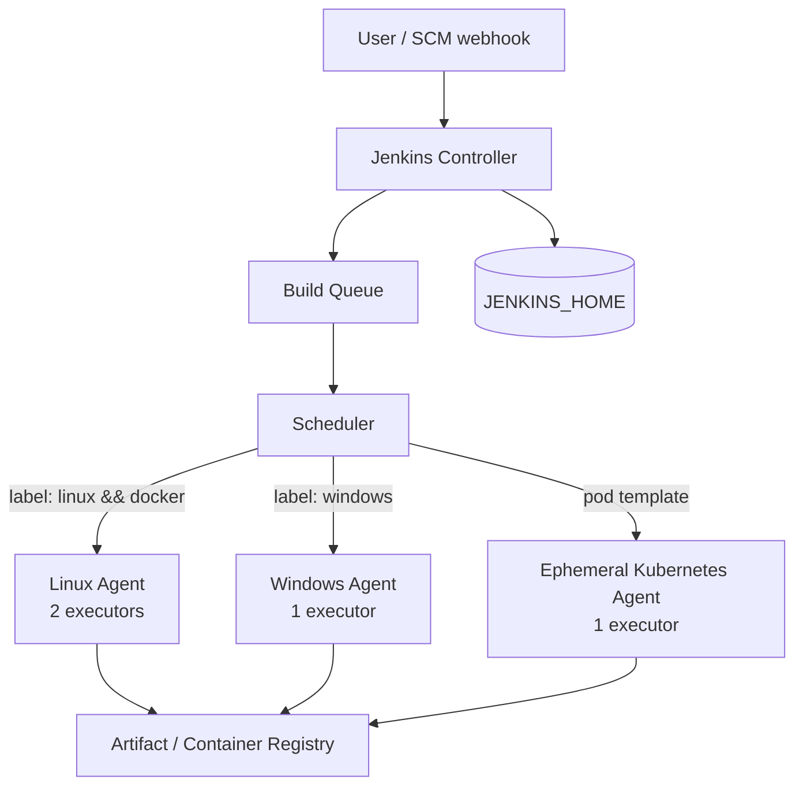
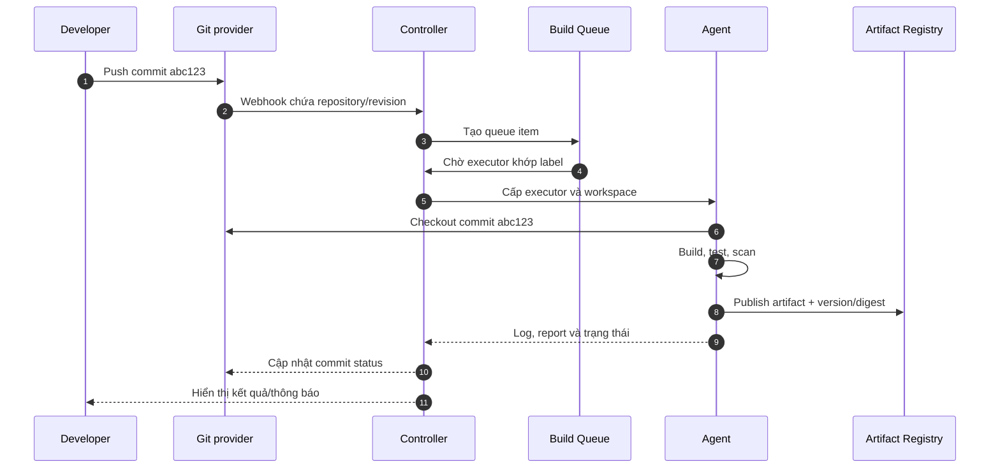

# Kiến trúc Jenkins

## Mục lục

- [Mục tiêu](#mục-tiêu)
- [1. Mô hình controller–agent](#1-mô-hình-controlleragent)
- [2. Jenkins Controller](#2-jenkins-controller)
- [3. Agent, node và executor](#3-agent-node-và-executor)
- [4. Queue, label và scheduling](#4-queue-label-và-scheduling)
- [5. Workspace, artifact và JENKINS_HOME](#5-workspace-artifact-và-jenkins_home)
- [6. Luồng thực thi một build](#6-luồng-thực-thi-một-build)
- [7. Topology từ lab đến production](#7-topology-từ-lab-đến-production)
- [8. Failure domain và bảo mật](#8-failure-domain-và-bảo-mật)
- [9. Chẩn đoán bottleneck cơ bản](#9-chẩn-đoán-bottleneck-cơ-bản)
- [Checklist tự kiểm tra](#checklist-tự-kiểm-tra)
- [Tài liệu tham khảo](#tài-liệu-tham-khảo)

---

## Mục tiêu

Sau bài này, bạn có thể:

- mô tả trách nhiệm của controller và agent;
- phân biệt node, agent, executor và workspace;
- giải thích vì sao build chờ trong queue;
- theo dõi luồng dữ liệu từ webhook đến artifact;
- chọn topology cơ bản cho lab và production;
- nhận diện rủi ro khi chạy build trực tiếp trên controller.

---

## 1. Mô hình controller–agent

Jenkins dùng kiến trúc phân tán. **Controller** là tiến trình trung tâm quản lý cấu hình và điều phối; **agent** cung cấp môi trường và executor để thực thi workload.



Mô hình này tách hai loại công việc:

- **control plane**: nhận request, lưu cấu hình, lập lịch, hiển thị UI;
- **execution plane**: checkout source, compile, test, build image và chạy công cụ dự án.

<Callout type="warn" title="Nguyên tắc production">Đặt số executor trên controller bằng `0` và chuyển build sang agent. Build có thể tiêu thụ hết CPU/RAM/disk, chạy code không đáng tin cậy hoặc làm controller mất ổn định.</Callout>

---

## 2. Jenkins Controller

Controller là tiến trình Jenkins trung tâm. Các trách nhiệm chính gồm:

- cung cấp web UI và HTTP API;
- xác thực user và áp dụng authorization;
- lưu job, credential metadata, plugin và cấu hình hệ thống;
- nhận trigger từ webhook, schedule, API hoặc user;
- duy trì build queue và chọn agent phù hợp;
- điều phối Pipeline, ghi trạng thái và lịch sử build;
- quản lý kết nối tới agent;
- tải plugin và cung cấp extension point.

### 2.1 Dữ liệu quan trọng trên controller

Phần lớn trạng thái quan trọng nằm trong `JENKINS_HOME`, thường gồm:

- cấu hình controller và job;
- plugin và version plugin;
- credential đã mã hóa cùng key liên quan;
- build history và log tùy retention;
- user data, queue state và node configuration.

Vì vậy, disk chứa `JENKINS_HOME` cần độ bền, đủ IOPS, backup nhất quán và kiểm thử restore. Không coi việc copy ngẫu nhiên một vài thư mục là chiến lược disaster recovery.

### 2.2 Controller không phải nơi lưu mọi thứ

Ở production, nên đưa dữ liệu lớn sang hệ thống chuyên dụng:

| Dữ liệu | Nơi lưu khuyến nghị |
|---|---|
| Source code | SCM server |
| Package/binary | Artifact repository |
| Container image | Container registry |
| Log dài hạn | Log platform |
| Metric | Monitoring system |
| Bí mật doanh nghiệp | Secret manager hoặc Jenkins Credentials theo chính sách |
| Cấu hình Jenkins có thể tái tạo | Configuration as Code + source control |

Controller vẫn lưu metadata và lịch sử cần thiết, nhưng không nên trở thành kho binary không giới hạn.

---

## 3. Agent, node và executor

### 3.1 Node và agent

**Node** là một máy thuộc môi trường Jenkins và có khả năng tham gia thực thi. Controller cũng được Jenkins xem là một node. **Agent** thường chỉ máy, VM, container hoặc pod kết nối tới controller để nhận công việc.

Agent có thể là:

- máy vật lý cho workload phần cứng đặc biệt;
- VM tồn tại lâu dài;
- container Docker;
- Kubernetes pod tạo theo nhu cầu rồi xóa;
- Windows/macOS host cho build theo nền tảng.

### 3.2 Executor

**Executor** là một slot thực thi trên node. Nếu agent có hai executor, về nguyên tắc agent có thể chạy đồng thời hai workload cần executor.

Số executor không nên đặt bằng số CPU một cách máy móc. Phải xét:

- mỗi build dùng bao nhiêu CPU, RAM và I/O;
- test có mở port cố định hoặc dùng resource chung không;
- workspace có đủ disk không;
- build có chạy container lồng nhau không;
- workload thiên về CPU hay chờ network;
- hai build song song có làm kết quả không ổn định không.

Ví dụ, máy 8 vCPU không nhất thiết nên có 8 executor nếu mỗi build Java dùng 4 GB RAM và nhiều CPU.

### 3.3 Agent tĩnh và agent động

| Tiêu chí | Agent tĩnh | Agent động/ephemeral |
|---|---|---|
| Vòng đời | Tồn tại lâu | Tạo theo nhu cầu, xóa sau build |
| Startup | Nhanh nếu luôn online | Có thời gian provision |
| Drift | Dễ tích lũy thay đổi thủ công | Dễ tái tạo từ image/template |
| Isolation | Workspace và process có thể sót | Tốt hơn nếu mỗi build một agent |
| Chi phí idle | Cao hơn | Có thể thấp hơn |
| Phù hợp | Toolchain đặc biệt, macOS, lab nhỏ | Kubernetes/cloud, workload biến động |

Agent ephemeral không tự động đảm bảo an toàn. Image, service account, network policy, cache và credential scope vẫn phải được kiểm soát.

---

## 4. Queue, label và scheduling

### 4.1 Build queue

Khi job được trigger, Jenkins chưa chắc chạy ngay. Work item vào **queue** và chờ scheduler tìm executor phù hợp.

Build có thể chờ vì:

- không có agent online;
- tất cả executor phù hợp đang bận;
- label expression không khớp agent nào;
- agent đang provision hoặc kết nối lỗi;
- job bị giới hạn concurrency;
- resource lock hoặc điều kiện Pipeline chưa được giải phóng;
- controller đang ở trạng thái quiet down.

### 4.2 Label

Label mô tả capability của agent, ví dụ:

```text
linux docker jdk21 high-memory
windows dotnet signing
macos xcode arm64
```

Pipeline có thể yêu cầu label:

```groovy
pipeline {
    agent { label 'linux && docker' }

    stages {
        stage('Build image') {
            steps {
                sh 'docker version'
            }
        }
    }
}
```

Label nên mô tả **capability ổn định**, không mô tả tên team hoặc chi tiết tạm thời. Tránh label quá cụ thể khiến chỉ còn một agent có thể chạy job.

### 4.3 Scheduling đơn giản hóa

Scheduler thực hiện logic gần như sau:

1. đọc yêu cầu label và restriction của task;
2. tìm node online có capability phù hợp;
3. kiểm tra executor rảnh;
4. cấp executor và workspace;
5. bắt đầu thực thi;
6. trả executor về pool khi công việc hoàn tất hoặc bị hủy.

Queue time là tín hiệu capacity quan trọng. Tăng executor chỉ là một lựa chọn; cũng có thể rút ngắn build, autoscale agent, tách workload hoặc sửa label quá hẹp.

---

## 5. Workspace, artifact và JENKINS_HOME

Ba vùng dữ liệu này có mục đích khác nhau:

| Khái niệm | Nằm ở đâu | Vòng đời | Có phải nguồn lưu trữ bền vững? |
|---|---|---|---|
| **Workspace** | Trên node chạy build | Có thể được tái sử dụng hoặc xóa | Không |
| **Archived artifact** | Jenkins quản lý theo build | Theo retention policy | Chỉ phù hợp nhu cầu cơ bản |
| **Artifact repository** | Hệ thống ngoài Jenkins | Theo version/retention riêng | Có |
| **JENKINS_HOME** | Controller storage | Suốt vòng đời controller | Có, phải backup |

### 5.1 Workspace

Workspace chứa source code checkout, dependency cache cục bộ và file trung gian. Không đặt secret cố định trong workspace. Với credential file tạm, luôn dùng cơ chế binding phù hợp và cleanup sau build.

Hai build dùng chung workspace có thể gây race condition. Jenkins thường cấp workspace biến thể khi cần concurrency, nhưng script vẫn phải tránh dùng resource toàn cục như port cố định, thư mục `/tmp/app` chung hoặc container name không có build ID.

### 5.2 Artifact

Artifact cần có định danh bất biến và liên kết được với:

- source revision;
- Jenkins job và build number;
- toolchain/dependency version;
- test và scan result;
- checksum, signature hoặc digest khi phù hợp.

---

## 6. Luồng thực thi một build



### 6.1 Dữ liệu đi qua đâu?

- Webhook chỉ nên mang metadata cần thiết; agent checkout source trực tiếp từ SCM.
- Log và trạng thái được gửi về controller trong quá trình chạy.
- Artifact lớn nên publish từ agent tới repository, không đi vòng qua controller nếu không cần.
- Credential được cấp trong scope của step/stage cần dùng, không ghi vào source hoặc log.

### 6.2 Khi agent mất kết nối

Kết quả phụ thuộc loại agent, cách launch và Pipeline step. Build có thể tạm chờ, thất bại hoặc được retry theo logic đã định nghĩa. Không giả định Jenkins tự động tiếp tục mọi process sau khi agent biến mất; hãy thiết kế step idempotent và có timeout/retry phù hợp.

---

## 7. Topology từ lab đến production

### 7.1 Lab cá nhân

```text
Một máy
└── Jenkins controller + 1 hoặc 2 executor local
```

Ưu điểm là đơn giản. Nhược điểm là build ảnh hưởng trực tiếp controller. Chỉ phù hợp học tập hoặc thử nghiệm ngắn hạn.

### 7.2 Nhóm nhỏ

```text
Controller (0 executor, persistent storage)
├── Linux agent
└── Windows hoặc agent chuyên dụng nếu cần
```

Đây là bước tách control plane khỏi build workload. Cần backup, TLS, authorization và monitoring tối thiểu.

### 7.3 Agent động

```text
Controller (persistent)
└── Cloud/Kubernetes integration
    ├── Agent pod cho build A
    ├── Agent pod cho build B
    └── Agent pod cho test C
```

Agent được tạo từ template/image, chạy một workload rồi bị xóa. Mô hình này giảm drift và hỗ trợ scale, nhưng yêu cầu quản lý image, cache, quota và startup latency.

### 7.4 High availability

Jenkins controller không nên được coi như một stateless web application có thể nhân bản tùy ý. Trước khi thiết kế HA, cần đọc giới hạn của Jenkins, plugin và nền tảng đang dùng; ưu tiên trước:

- backup/restore đã kiểm thử;
- controller có thể tái tạo từ code và tài liệu;
- storage bền vững;
- agent tách biệt và dễ thay thế;
- quy trình nâng cấp/rollback;
- recovery time objective (RTO) và recovery point objective (RPO) rõ ràng.

---

## 8. Failure domain và bảo mật

| Rủi ro | Tác động | Kiểm soát cơ bản |
|---|---|---|
| Controller hết disk | UI chậm, không ghi được build/config | Alert dung lượng, retention, external artifact store |
| Build ngốn CPU/RAM controller | Controller mất phản hồi | Controller 0 executor, resource limit trên agent |
| Agent bị compromise | Lộ source/credential có thể truy cập | Agent cô lập, least privilege, ephemeral agent |
| Plugin lỗi hoặc không tương thích | Controller không khởi động/feature hỏng | Test upgrade, plugin inventory, backup |
| Mất `JENKINS_HOME` | Mất cấu hình và lịch sử | Backup nhất quán, restore drill |
| Credential scope quá rộng | Pipeline không tin cậy đọc được secret | Folder scope, RBAC, bind theo stage, secret manager |
| Một label chỉ có một agent | Single point of failure | Pool agent thay thế được, image/template chuẩn |

<Callout type="error" title="Pipeline là code có quyền thực thi">Người có thể sửa `Jenkinsfile` hoặc build script có thể thay đổi lệnh chạy trên agent. Quyền review code và quyền sử dụng credential phải được thiết kế cùng nhau.</Callout>

---

## 9. Chẩn đoán bottleneck cơ bản

### 9.1 Build nằm trong queue lâu

Kiểm tra theo thứ tự:

1. queue item đang hiển thị lý do gì;
2. có node online khớp label expression không;
3. executor có đang bận không;
4. cloud agent có provision thành công không;
5. job có concurrency restriction hoặc lock không;
6. thời gian chờ xuất hiện toàn hệ thống hay chỉ một label.

### 9.2 Controller chậm

Quan sát:

- CPU, heap, garbage collection và thread;
- disk latency/dung lượng của `JENKINS_HOME`;
- số build history và retention;
- plugin hoặc Pipeline tạo tải bất thường;
- lượng request UI/API và số agent connection;
- workload còn chạy trên built-in node hay không.

### 9.3 Agent không ổn định

Kiểm tra log kết nối, Java runtime, network path, DNS, clock, disk workspace và toolchain. Với agent ephemeral, giữ lại đủ log provision để phân biệt lỗi image, scheduler, quota và Jenkins connection.

---

## Checklist tự kiểm tra

- [ ] Tôi giải thích được controller điều phối còn agent thực thi workload.
- [ ] Tôi phân biệt được agent với executor.
- [ ] Tôi biết vì sao một build có thể nằm trong queue.
- [ ] Tôi hiểu workspace không phải artifact repository.
- [ ] Tôi biết dữ liệu quan trọng nằm trong `JENKINS_HOME` và phải backup.
- [ ] Tôi hiểu lý do đặt executor của controller bằng `0` ở production.
- [ ] Tôi mô tả được luồng từ webhook đến build result.

---

## Tài liệu tham khảo

- [Using Jenkins Agents](https://www.jenkins.io/doc/book/using/using-agents/)
- [Jenkins Glossary](https://www.jenkins.io/doc/book/glossary/)
- [Hardware Recommendations](https://www.jenkins.io/doc/book/scaling/hardware-recommendations/)
- [Architecting for Scale](https://www.jenkins.io/doc/book/scaling/architecting-for-scale/)
- [Managing Nodes](https://www.jenkins.io/doc/book/managing/nodes/)
