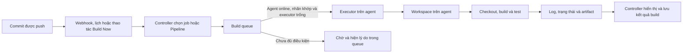

Jenkins tách việc **điều phối** build khỏi việc **chạy** workload. Khi hiểu đường đi từ một commit đến kết quả build, bạn sẽ biết vì sao build đang chờ, nơi cần xem log và nơi cần tăng năng lực xử lý.

<Callout type="info" title="Phạm vi">
  Trang này dùng mô hình Jenkins controller–agent cho người mới. Một job có thể là Freestyle hoặc Pipeline; các nguyên tắc về queue, executor và workspace vẫn giống nhau.
</Callout>

## Mục lục

- [Mô hình tổng quan](#mô-hình-tổng-quan)
  - [Sơ đồ luồng một build](#sơ-đồ-luồng-một-build)
- [Thành phần và ranh giới tin cậy](#thành-phần-và-ranh-giới-tin-cậy)
  - [Controller](#controller)
  - [Agent và node](#agent-và-node)
  - [Executor](#executor)
  - [Build queue](#build-queue)
- [Luồng dữ liệu của một build](#luồng-dữ-liệu-của-một-build)
  - [Từ trigger đến executor](#từ-trigger-đến-executor)
  - [Workspace, log và kết quả](#workspace-log-và-kết-quả)
- [Khi build bị chờ trong queue](#khi-build-bị-chờ-trong-queue)
  - [Ví dụ: thiếu executor có nhãn phù hợp](#ví-dụ-thiếu-executor-có-nhãn-phù-hợp)
- [Thực hành quan sát một build](#thực-hành-quan-sát-một-build)
  - [Tạo build quan sát](#tạo-build-quan-sát)
  - [Đọc các dấu vết](#đọc-các-dấu-vết)
- [Checklist vận hành](#checklist-vận-hành)
- [Giới hạn kiến trúc và bước tiếp theo](#giới-hạn-kiến-trúc-và-bước-tiếp-theo)
- [Nguồn Jenkins chính thức](#nguồn-jenkins-chính-thức)

## Mô hình tổng quan

Một **controller** là đầu não của Jenkins. Nó nhận trigger, giữ cấu hình job, quyết định build nào được phép chạy và ghi nhận trạng thái. Một **agent** cung cấp môi trường thực thi: hệ điều hành, công cụ build và thư mục làm việc. Mỗi agent có một hay nhiều **executor**, tức các khe chạy đồng thời. Khi chưa tìm được executor phù hợp, build nằm trong **build queue**.

### Sơ đồ luồng một build



Mũi tên từ queue đến executor chỉ xuất hiện khi Jenkins tìm được một node thỏa điều kiện của job. Vì vậy, “đã trigger” không đồng nghĩa với “đang chạy”.

## Thành phần và ranh giới tin cậy

### Controller

Controller phục vụ giao diện web và API, lưu cấu hình job cùng lịch sử build, tiếp nhận webhook, duy trì queue và điều phối Pipeline. Nó cũng tập hợp log, trạng thái `SUCCESS`/`FAILURE`/`ABORTED` và metadata của build để người dùng xem lại.

Controller là điểm kiểm soát có giá trị cao: quyền quản trị, cấu hình plugin và quyền truy cập credentials thường hội tụ tại đây. Kết nối agent đến controller, cấu hình job và plugin đều phải được coi là các bề mặt cần kiểm soát. Phân quyền người dùng, cập nhật Jenkins/plugin và bảo vệ `JENKINS_HOME` là việc của controller, không phải của workspace.

<Callout type="warn" title="Không chạy workload không tin cậy trên controller">
  Không đặt build thông thường, repository không tin cậy hoặc lệnh do người dùng đóng góp chạy trên built-in node của controller. Script build có thể đọc file, chiếm CPU/RAM hoặc khai thác quyền của tiến trình Jenkins. Đặt số executor của built-in node là `0` và chạy workload trên agent tách biệt khi có thể.
</Callout>

### Agent và node

Trong giao diện Jenkins, **node** là một máy hoặc môi trường thực thi được khai báo với tên, labels, remote root directory và số executor. **Agent** là tiến trình kết nối vào node đó để nhận và chạy công việc. Trong thực tế, hai từ này thường được dùng thay nhau; hãy nhớ node là đối tượng cấu hình, còn agent là phía thực thi.

**Built-in node** chạy cùng máy với controller. Nó tiện cho thử nghiệm nhỏ, nhưng dùng chung hệ điều hành, tài nguyên và ranh giới bảo mật với controller. **Agent riêng** chạy trên máy ảo, máy vật lý, container hoặc pod khác. Agent riêng cho phép đặt nhãn như `linux`, `windows`, `docker` hoặc `arm64`, cài đúng toolchain và cô lập workload tốt hơn.

Ranh giới tin cậy nằm ở chỗ source code, `Jenkinsfile`, dependency và câu lệnh build sẽ thực thi trong agent. Chỉ kết nối agent mà bạn quản lý và bảo vệ; một agent bị chiếm quyền có thể trở thành đường tấn công vào hệ Jenkins. Cấp credentials theo job và môi trường tối thiểu cần thiết, không biến agent thành nơi lưu secret lâu dài.

### Executor

Executor là một khe để Jenkins chạy một phần công việc tại một thời điểm trên node. Ví dụ, agent `linux-a` có `2` executors có thể chạy tối đa hai build (hoặc hai allocation phù hợp của Pipeline) đồng thời. Executor không phải là CPU core và tăng số executor không tự tạo thêm CPU, RAM hay I/O; đặt quá cao chỉ khiến các build cạnh tranh tài nguyên.

Một job có thể yêu cầu executor trên node mang label nhất định. Với Pipeline, mỗi `agent` ở cấp pipeline hoặc stage có thể tạo một lần allocation khác nhau. Khi allocation kết thúc, executor được trả về để queue có thể cấp cho build tiếp theo.

### Build queue

Build queue là danh sách các build đã được yêu cầu nhưng chưa được gán executor để chạy. Controller kiểm tra lần lượt các điều kiện như quiet period, agent có online không, label có khớp không, executor có rảnh không và các giới hạn đồng thời của job hoặc plugin.

Queue không phải lỗi tự thân. Nó giúp Jenkins không chạy build trên sai môi trường hoặc vượt quá capacity. Mở trang **Build Queue** để đọc lý do Jenkins đang chờ thay vì chỉ nhìn thời gian chờ; lý do này thường chỉ thẳng đến label không có node, agent offline hoặc không còn executor trống.

## Luồng dữ liệu của một build

### Từ trigger đến executor

1. Một commit có thể gửi webhook từ Git provider; build cũng có thể được khởi tạo bởi lịch, upstream job hoặc nút **Build Now**.
2. Controller xác định job và revision cần chạy, tạo một mục trong queue, rồi áp dụng điều kiện của job/Pipeline.
3. Scheduler tìm node online có labels phù hợp và một executor còn trống. Nếu không có, mục queue vẫn ở đó và không có lệnh build nào chạy trong workspace.
4. Khi tìm được executor, controller phân công build cho agent. Agent nhận định nghĩa công việc cần thiết và bắt đầu thực thi trong môi trường của nó.

Đừng dùng queue như thước đo duy nhất về hiệu năng. Một build có thể chờ vì cần agent `windows`, trong khi nhiều executor `linux` vẫn rảnh. Năng lực cần được đo theo từng label và loại workload.

### Workspace, log và kết quả

Agent tạo hoặc tái sử dụng **workspace** — thư mục local dành cho job — rồi checkout source code vào đó. Các lệnh build, test và đóng gói chạy tại workspace. File tạm, cache và source checkout vì thế thường nằm trên agent, không phải trên controller.

Trong lúc chạy, agent gửi console log và cập nhật trạng thái về controller. Job có thể publish artifact hoặc report test; Jenkins liên kết chúng với số build để tải xuống và truy vết. Sau cùng, controller giải phóng executor và chuyển build sang kết quả cuối cùng. Workspace có thể còn lại để tái sử dụng, nên cần chiến lược dọn dẹp và không coi nó là nơi lưu dữ liệu nhạy cảm lâu dài.

Khi học sâu hơn, hãy tìm hiểu riêng về quản lý workspace, Jenkins Pipeline và vận hành agent. Trước mắt, hãy nhớ rằng workspace thuộc về agent, còn controller tập hợp log và kết quả để quan sát.

## Khi build bị chờ trong queue

### Ví dụ: thiếu executor có nhãn phù hợp

Giả sử Pipeline khai báo `agent { label 'linux && docker' }`. Hệ thống chỉ có agent `builder-1` mang cả hai nhãn, có đúng một executor, và executor đó đang chạy build khác trong 10 phút. Khi bạn trigger build thứ hai, controller tạo mục queue nhưng không gán được executor. Build hiển thị là đang chờ; nó chỉ bắt đầu khi `builder-1` rảnh hoặc khi một agent online khác mang đủ hai nhãn.

Các hướng xử lý theo thứ tự kiểm tra:

- Mở **Manage Jenkins → Nodes** và xác nhận agent cần thiết đang `Online`, có đúng labels và đủ dung lượng đĩa.
- Mở **Build Queue** hoặc trang build để đọc nguyên văn lý do chờ. Nếu không có node nào khớp label, thêm/sửa agent thay vì tăng executor ở node sai loại.
- Nếu label đã đúng nhưng mọi executor đều bận, giảm thời gian build, thêm agent cùng label hoặc tăng executor sau khi đã đo CPU, RAM và I/O.
- Kiểm tra các cấu hình chặn chạy đồng thời, quiet period và giới hạn do plugin áp dụng trước khi kết luận Jenkins bị treo.

## Thực hành quan sát một build

Điều kiện trước: có một agent Linux riêng đang `Online`, mang label `linux` và có ít nhất một executor. Tạo một Pipeline job, dán `Jenkinsfile` sau rồi chọn **Build Now**:

```groovy
pipeline {
  agent { label 'linux' }

  stages {
    stage('Quan sát môi trường') {
      steps {
        sh '''
          echo "NODE_NAME=$NODE_NAME"
          echo "WORKSPACE=$WORKSPACE"
          hostname
          pwd
          sleep 30
        '''
      }
    }
  }
}
```

### Tạo build quan sát

1. Trước khi trigger, vào **Manage Jenkins → Nodes** và ghi lại agent `linux` nào đang online cùng số executor của nó.
2. Trigger job. Trong 30 giây `sleep`, mở trang build và **Build Queue**. Nếu executor đã được cấp, queue sẽ trống còn build hiển thị đang chạy.
3. Mở **Console Output**. So sánh `NODE_NAME`, `WORKSPACE`, `hostname` và `pwd` để xác nhận lệnh chạy trên agent, trong workspace của agent.
4. Sau khi build xong, xem trạng thái cuối, thời lượng và liên kết workspace. Trigger hai build sát nhau trên agent chỉ có một executor để quan sát build thứ hai chờ trong queue.

Nếu Jenkins của bạn chỉ có Windows agent, thay bước `sh` bằng `bat` tương đương. Không chuyển ví dụ sang built-in node chỉ để chạy được bài lab.

### Đọc các dấu vết

| Dấu vết | Nó trả lời câu hỏi gì? |
| --- | --- |
| Build Queue | Build chưa chạy vì điều kiện nào? |
| Nodes | Agent nào online, mang label gì và còn executor không? |
| Console Output | Lệnh nào đã chạy và lỗi xuất hiện ở đâu? |
| `NODE_NAME` và `WORKSPACE` | Build được gán cho node nào và dùng thư mục nào? |
| Build history | Kết quả, thời lượng và xu hướng lỗi của job là gì? |

## Checklist vận hành

- [ ] Built-in node được đặt `0` executors, trừ khi có lý do thử nghiệm được chấp nhận rõ ràng.
- [ ] Mỗi agent có labels phản ánh đúng hệ điều hành, kiến trúc và toolchain; job không dùng label quá rộng.
- [ ] Capacity được theo dõi theo label: queue time, số executor bận, CPU, RAM, đĩa và mạng.
- [ ] Agent offline, workspace đầy đĩa và executor bị kẹt có quy trình cảnh báo/khắc phục.
- [ ] Workspace, cache và artifact có chính sách dọn dẹp; không ghi secret vào console log hoặc file tồn lưu.
- [ ] Controller, agent launch method, plugin và quyền truy cập được cập nhật, phân quyền và kiểm soát theo nguyên tắc đặc quyền tối thiểu.
- [ ] Khi build chờ, đội vận hành đọc lý do queue trước khi thay đổi số executor hoặc labels.

## Giới hạn kiến trúc và bước tiếp theo

Thêm agent giúp tách workload và mở rộng năng lực thực thi, nhưng controller vẫn là bộ điều phối trung tâm có trạng thái. Không tạo HA active-active bằng cách để nhiều controller cùng dùng một `JENKINS_HOME`. Khi cần khả năng phục hồi, hãy thiết kế backup, khôi phục và quy trình failover phù hợp thay vì giả định controller tự active-active.

Bước tiếp theo, hãy tự tạo một Pipeline nhỏ từ ví dụ ở trên, lưu `Jenkinsfile` cùng source code và thực hành backup/phục hồi theo yêu cầu vận hành của tổ chức khi quy mô tăng lên.

## Nguồn Jenkins chính thức

- [Jenkins Glossary](https://www.jenkins.io/doc/book/glossary/) — định nghĩa controller, agent, node và executor.
- [Managing Nodes](https://www.jenkins.io/doc/book/managing/nodes/) — cấu hình node, executor và labels.
- [Using Jenkins Agents](https://www.jenkins.io/doc/book/using/using-agents/) — mô hình và cách dùng agent.
- [Using a Jenkinsfile](https://www.jenkins.io/doc/book/pipeline/jenkinsfile/) — cách Pipeline khai báo `agent` và stages.
- [Controller Isolation](https://www.jenkins.io/doc/book/security/controller-isolation/) — lý do cô lập workload khỏi controller.
