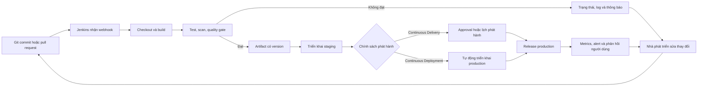

<Callout type="info" title="Dành cho người mới">
  CI/CD không phải là một sản phẩm duy nhất. Đây là cách tổ chức công việc để mỗi thay đổi nhỏ được kiểm tra, đóng gói và đưa đến người dùng với phản hồi nhanh. Jenkins là công cụ tự động hóa có thể điều phối các bước đó.
</Callout>

## Mục lục

- [Mục lục](#mục-lục)
- [CI/CD giải quyết vấn đề gì?](#cicd-giải-quyết-vấn-đề-gì)
  - [Jenkins nằm ở đâu?](#jenkins-nằm-ở-đâu)
- [Ba mức liên tục](#ba-mức-liên-tục)
  - [Continuous Integration (CI)](#continuous-integration-ci)
  - [Continuous Delivery](#continuous-delivery)
  - [Continuous Deployment](#continuous-deployment)
  - [So sánh Delivery và Deployment](#so-sánh-delivery-và-deployment)
- [Từ commit đến feedback và release](#từ-commit-đến-feedback-và-release)
  - [Pipeline](#pipeline)
  - [Artifact](#artifact)
  - [Quality gate](#quality-gate)
  - [Feedback loop](#feedback-loop)
- [Jenkinsfile tối thiểu](#jenkinsfile-tối-thiểu)
  - [Đọc pipeline này](#đọc-pipeline-này)
- [Thực hành: chạy vòng lặp đầu tiên](#thực-hành-chạy-vòng-lặp-đầu-tiên)
  - [Kết quả mong đợi](#kết-quả-mong-đợi)
- [Checklist trước khi mở rộng](#checklist-trước-khi-mở-rộng)
- [Nguồn chính thức và bước tiếp theo](#nguồn-chính-thức-và-bước-tiếp-theo)

## CI/CD giải quyết vấn đề gì?

Khi nhiều người cùng sửa một ứng dụng, việc để thay đổi nằm lâu trên máy cá nhân làm tăng rủi ro xung đột và lỗi chỉ xuất hiện sát ngày phát hành. CI/CD rút ngắn khoảng cách giữa một `git commit` và thông tin có thể hành động: thay đổi có build được không, có vượt qua kiểm thử không, và có sẵn sàng phát hành không.

Ví dụ, một nhóm sửa màn hình đăng nhập. Thay vì đợi cuối tuần mới gộp năm nhánh và chạy test bằng tay, mỗi pull request hoặc commit vào `main` có thể kích hoạt Jenkins. Jenkins lấy đúng revision, chạy lint và test, tạo một gói có thể truy vết, rồi báo kết quả lại cho Git và nhóm chat. Lỗi xuất hiện trong vài phút, khi ngữ cảnh sửa code vẫn còn mới.

### Jenkins nằm ở đâu?

Jenkins không thay thế Git, trình quản lý artifact, môi trường chạy ứng dụng hay người chịu trách nhiệm phát hành. Jenkins đóng vai trò **orchestrator**: nó nhận sự kiện hoặc lịch chạy, cấp agent để thực thi các lệnh, lưu log/trạng thái và nối các công cụ lại thành một pipeline. Các lệnh thực tế vẫn do dự án quyết định, chẳng hạn `npm test`, `mvn verify`, quét bảo mật, upload image hay gọi công cụ triển khai.

<Callout type="idea" title="Bắt đầu từ tín hiệu nhỏ">
  Pipeline đầu tiên không cần triển khai production. Một kiểm thử tự động và thông báo thất bại đáng tin đã là một feedback loop có giá trị.
</Callout>

## Ba mức liên tục

Ba khái niệm có chung chữ “continuous” nhưng cam kết khác nhau. Chúng thường được xây dần từ CI đến Delivery, rồi mới cân nhắc Deployment.

### Continuous Integration (CI)

**Continuous Integration (CI)** là thực hành tích hợp thay đổi vào nhánh dùng chung thường xuyên và tự động xác minh chúng. Mục tiêu là phát hiện lỗi tích hợp sớm, không phải chỉ “chạy Jenkins”.

Ví dụ: Lan thêm validation cho form, Minh đổi API trả về. Cả hai mở pull request nhỏ. Jenkins checkout từng revision, cài dependency, chạy unit test và kiểm tra định dạng. Nếu test hợp đồng giữa frontend và API lỗi, build thất bại trước khi thay đổi được merge. Nhóm sửa hoặc revert ngay thay vì để lỗi đi theo một bản release lớn.

CI hiệu quả cần commit nhỏ, build lặp lại được và kiểm thử đủ nhanh để nhà phát triển còn chờ được phản hồi. Chạy một pipeline kéo dài hai giờ cho mỗi commit vẫn là tự động hóa, nhưng feedback chậm có thể khiến mọi người bỏ qua nó. Có thể tách kiểm thử nhanh chạy mỗi commit và kiểm thử nặng chạy theo lịch hoặc trước release.

### Continuous Delivery

**Continuous Delivery** mở rộng CI để mỗi thay đổi đã vượt qua các kiểm tra có thể được phát hành một cách an toàn, lặp lại được. Bản build được đóng gói và cấu hình triển khai được version hóa. Tuy nhiên, quyết định đưa bản đó lên **production** vẫn có thể là một nút bấm hoặc bước phê duyệt của con người.

Ví dụ: sau khi CI xanh, Jenkins tạo image `registry.example.com/shop:1.4.2`, quét image và triển khai nó lên staging. Product owner kiểm tra luồng thanh toán. Khi cửa sổ bảo trì bắt đầu, người có thẩm quyền chọn build `1.4.2` đã được kiểm chứng để phát hành production. Đây vẫn là Continuous Delivery: hệ thống luôn ở trạng thái _có thể phát hành_, nhưng chưa tự phát hành mọi thay đổi.

Trade-off là Delivery giữ được kiểm soát về lịch phát hành, tuân thủ và truyền thông với khách hàng, nhưng thao tác duyệt có thể tạo hàng đợi. Hãy dùng một approval rõ người chịu trách nhiệm, tiêu chí và thời hạn; “ai đó sẽ bấm khi rảnh” không phải là một quy trình đáng tin cậy.

### Continuous Deployment

**Continuous Deployment** đi thêm một bước: mọi thay đổi vượt qua toàn bộ quality gate được tự động triển khai đến production, không chờ người bấm duyệt cho từng bản. Đây là lựa chọn chính sách phát hành, không phải tên khác của Continuous Delivery.

Ví dụ: commit sửa chính tả trang trợ giúp vượt qua lint, test, quét dependency và smoke test trên staging. Jenkins tự phát hành image đã kiểm chứng sang production theo canary 5%. Nếu chỉ số lỗi và độ trễ trong khoảng cho phép, hệ thống tăng dần lưu lượng. Nếu vượt ngưỡng, pipeline dừng hoặc rollback theo chính sách đã chuẩn bị.

Deployment cho phản hồi giá trị sản phẩm nhanh hơn và giảm batch lớn. Đổi lại, nó đòi hỏi test tự động đáng tin, quan sát production, rollback an toàn, quản lý feature flag và chất lượng gate phù hợp. Không nên bật nó chỉ vì pipeline đã tự động hóa; với thay đổi rủi ro cao hoặc môi trường bị quản lý chặt, Continuous Delivery có approval thường là lựa chọn đúng hơn.

### So sánh Delivery và Deployment

| Câu hỏi                                                  | Continuous Delivery                                  | Continuous Deployment                           |
| -------------------------------------------------------- | ---------------------------------------------------- | ----------------------------------------------- |
| Sau khi pipeline xanh, bản build có thể phát hành không? | Có                                                   | Có                                              |
| Ai/khi nào kích hoạt production?                         | Con người hoặc lịch phát hành có chủ đích            | Pipeline tự động cho mọi thay đổi đạt điều kiện |
| Có approval thủ công cho từng bản production không?      | Có thể có                                            | Không phải bước chặn thông thường               |
| Phù hợp khi nào?                                         | Cần kiểm soát lịch, tuân thủ hoặc xác nhận nghiệp vụ | Có test, quan sát và rollback đủ trưởng thành   |

Nói ngắn gọn: **Delivery là “luôn sẵn sàng để phát hành”; Deployment là “tự động phát hành khi sẵn sàng”**. Đừng dùng hai thuật ngữ này thay cho nhau.

## Từ commit đến feedback và release

Sơ đồ dưới đây mô tả một luồng điển hình. Nhánh thất bại quay về nhà phát triển với log và trạng thái build; nhánh đạt điều kiện tạo một artifact bất biến để dùng lại ở các môi trường.



### Pipeline

Pipeline là chuỗi stage và step mô tả đường đi của một thay đổi. Một **stage** là chặng có ý nghĩa với con người, như `Test` hay `Deploy staging`; một **step** là hành động cụ thể trong chặng đó, như chạy `npm test`. Pipeline được lưu cùng source code trong `Jenkinsfile` để review và thay đổi theo lịch sử Git, thay vì chỉ nằm trong giao diện Jenkins.

Pipeline tốt ưu tiên phản hồi rẻ và nhanh trước: kiểm tra cú pháp, lint và unit test thường chạy trước integration test hoặc deploy. Thứ tự này không đảm bảo chất lượng, nhưng giảm thời gian chờ khi lỗi là lỗi đơn giản.

### Artifact

Artifact là đầu ra được đóng gói từ một build, ví dụ file `.jar`, gói `.tgz`, image container hoặc báo cáo test. Artifact nên có version hoặc liên kết đến commit/build đã tạo ra nó.

Một nguyên tắc quan trọng là **build một lần, dùng cùng artifact để triển khai nhiều môi trường**. Ví dụ image `shop:1.4.2` đã chạy ở staging nên chính image đó được promote lên production; không nên build lại từ nhánh `main` ngay trước production. Build lại có thể kéo dependency hoặc source khác, khiến thứ đã kiểm thử khác với thứ đang chạy.

### Quality gate

Quality gate là điều kiện phải đạt trước khi pipeline được phép đi tiếp. Gate có thể là unit test xanh, coverage tối thiểu, không có lỗ hổng ở mức nghiêm trọng đã quy định, review được phê duyệt, hay smoke test staging thành công.

Gate cần có ngưỡng và người sở hữu rõ ràng. Chẳng hạn, “không có lỗi test” là điều kiện khách quan, còn “coverage ít nhất 80%” cần được xem lại khi đội thay đổi loại kiểm thử. Đặt một ngưỡng chỉ để có màu xanh sẽ khuyến khích tối ưu chỉ số thay vì giảm rủi ro. Khi mở rộng pipeline, hãy ghi rõ từng loại gate, ngưỡng và ngoại lệ được chấp nhận trong quy ước của đội.

### Feedback loop

Feedback loop là vòng lặp biến kết quả thành hành động tiếp theo. Jenkins trả status, log và báo cáo test về pull request; nhà phát triển sửa lỗi hoặc hỏi người review. Sau release, metric, alert, ticket hỗ trợ và phản hồi người dùng cho biết thay đổi có tạo giá trị hay gây sự cố hay không.

Một loop tốt phải nhanh, cụ thể và đến đúng người. “Build failed” là tín hiệu yếu; “test `checkout rejects expired card` thất bại, log và commit liên quan ở đây” giúp xử lý ngay. Đừng chỉ đo pipeline có chạy: hãy đo thời gian phản hồi, tỷ lệ build đỏ, thời gian khôi phục và số lỗi lọt tới production để cải thiện loop.

## Jenkinsfile tối thiểu

Ví dụ dưới đây dùng Declarative Pipeline. Nó không triển khai ứng dụng thật; thay vào đó nó tạo một artifact nhỏ, kiểm tra artifact rồi mô phỏng triển khai staging. Cách này giúp nhìn rõ CI, artifact và điểm approval của Continuous Delivery mà không cần credential hay hạ tầng production.

```groovy
pipeline {
  agent any

  stages {
    stage('Build') {
      steps {
        sh 'mkdir -p dist && printf "build %s\\n" "$BUILD_NUMBER" > dist/version.txt'
      }
    }

    stage('Test') {
      steps {
        sh 'test -s dist/version.txt'
      }
    }

    stage('Publish artifact') {
      steps {
        archiveArtifacts artifacts: 'dist/**', fingerprint: true
      }
    }

    stage('Deploy staging') {
      steps {
        echo 'Deploy the archived artifact to staging here.'
      }
    }

    stage('Approve production') {
      input {
        message 'Release this tested artifact to production?'
        ok 'Release'
      }
      steps {
        echo 'Deploy the same artifact to production here.'
      }
    }
  }

  post {
    success {
      echo 'Feedback: build is ready for release.'
    }
    failure {
      echo 'Feedback: inspect the stage log, then fix or revert the commit.'
    }
  }
}
```

### Đọc pipeline này

- `agent any` yêu cầu Jenkins chọn một agent có shell. Trong production, giới hạn agent bằng label và không chạy workload build tùy ý trên controller.
- `Build` tạo `dist/version.txt`; `Test` dùng `test -s` để quality gate thất bại nếu file rỗng hoặc không tồn tại.
- `archiveArtifacts` lưu output của build và `fingerprint: true` giúp Jenkins theo dõi artifact được dùng bởi build nào.
- `Approve production` là ranh giới của Continuous Delivery. Bỏ stage `input` và thay lệnh `echo` bằng triển khai tự động chỉ phù hợp khi các gate, quan sát và rollback đã được thiết kế cho Continuous Deployment.

<Callout type="warn" title="Không đưa secret vào Jenkinsfile">
  Không hard-code token, mật khẩu hoặc khóa deploy trong file này hay log build. Lưu secret bằng Jenkins Credentials, giới hạn quyền của credential và chỉ cấp cho stage/agent cần thiết.
</Callout>

Để học cấu trúc và cú pháp đầy đủ hơn, dùng hai tài liệu Jenkins chính thức về Pipeline và Pipeline Syntax ở phần nguồn cuối trang.

## Thực hành: chạy vòng lặp đầu tiên

Lab này giả định bạn đã có một Jenkins controller và quyền tạo Pipeline job. Nếu chưa có môi trường local, hãy cài theo [Jenkins bằng Docker](/docs/installation/docker/).

<Steps>
<Step>

**Tạo repository và chọn branch.** Trên GitHub, GitLab hoặc dịch vụ Git mà bạn kiểm soát, tạo một repository rỗng tên `ci-cd-lab`. Ví dụ dưới đây dùng branch `main`; thay `<your-account>` bằng namespace của bạn và giữ URL khớp với repository vừa tạo. URL minh họa này không phải repository dùng được ngay.

```bash
git init ci-cd-lab
cd ci-cd-lab
git branch -M main
git remote add origin https://github.com/<your-account>/ci-cd-lab.git
```

<Callout type="warn" title="Kết nối Git an toàn">
  Không chèn password, personal access token hoặc private key vào URL hay command. Với HTTPS, dùng credential manager hoặc token được hỏi khi Git push; với SSH, dùng SSH key/deploy key đã cấp quyền tối thiểu cho repository. Nếu repository là private, Jenkins cũng cần credential đọc repository được lưu trong Jenkins Credentials.
</Callout>

</Step>
<Step>

**Thêm Jenkinsfile và push lên remote.** Tạo `Jenkinsfile`, dán pipeline ở phần trên, rồi commit và push branch `main`. Không cần source application cho lab này vì stage `Build` tự tạo artifact.

```bash
git add Jenkinsfile
git commit -m "Add first CI pipeline"
git push -u origin main
git remote get-url origin
git branch --show-current
```

Hai lệnh cuối phải lần lượt in ra URL repository của bạn và `main`. Jenkins sẽ dùng chính URL và branch này.

</Step>
<Step>

**Tạo Pipeline job trong Jenkins.** Chọn **New Item** → **Pipeline**, đặt tên `ci-cd-lab`. Trong phần **Pipeline**, chọn **Pipeline script from SCM**, chọn **Git**, rồi nhập đúng URL từ `git remote get-url origin` vào **Repository URL**. Chọn credential phù hợp nếu repository private. Đặt **Branch Specifier** là `*/main`, vì `Jenkinsfile` đã được push lên branch `main`, rồi lưu cấu hình.

</Step>
<Step>

**Chạy và quan sát.** Chọn **Build Now**, mở build vừa tạo và xem Stage View hoặc Pipeline Graph. Mở `Console Output` để thấy từng stage. Ở `Approve production`, chọn **Release** để pipeline hoàn thành; chọn hủy nếu chỉ muốn kiểm tra cơ chế chặn.

</Step>
<Step>

**Tạo feedback có chủ đích.** Sửa dòng `test -s dist/version.txt` thành `test -s dist/missing.txt`, rồi commit và push thay đổi để SCM job có thể lấy revision mới.

```bash
git add Jenkinsfile
git commit -m "Demonstrate failing test feedback"
git push origin main
```

Chọn **Build Now** lần nữa. Build phải thất bại tại stage `Test`. Khôi phục lệnh đúng, commit và push một lần nữa rồi chạy lại để xác nhận tín hiệu thất bại dẫn đến thay đổi sửa lỗi.

</Step>
</Steps>

### Kết quả mong đợi

- Build thành công hiển thị các stage `Build`, `Test`, `Publish artifact`, `Deploy staging` và `Approve production`.
- Build dừng chờ input ở `Approve production`; đó là Continuous Delivery, không phải Continuous Deployment.
- Trang build có artifact `dist/version.txt` để tải xuống hoặc kiểm tra.
- Khi đổi sang `dist/missing.txt`, `Test` đỏ và `post { failure }` in hướng dẫn kiểm tra log.

## Checklist trước khi mở rộng

- [ ] Pipeline chạy từ `Jenkinsfile` được review cùng code ứng dụng.
- [ ] Mỗi thay đổi có ít nhất một kiểm tra nhanh, quyết định pass/fail rõ ràng.
- [ ] Artifact được gắn với build hoặc commit và không build lại trước khi promote.
- [ ] Quality gate có ngưỡng, lý do và người chịu trách nhiệm cập nhật.
- [ ] Credential không nằm trong repository, command line hoặc log build.
- [ ] Quy trình production xác định rõ đang dùng Continuous Delivery hay Continuous Deployment.
- [ ] Có metric/alert và cách rollback đã được thử trước khi tự động triển khai production.

## Nguồn chính thức và bước tiếp theo

- [Jenkins Pipeline](https://www.jenkins.io/doc/book/pipeline/): khái niệm pipeline, Jenkinsfile và các model pipeline.
- [Using a Jenkinsfile](https://www.jenkins.io/doc/book/pipeline/jenkinsfile/): cú pháp Declarative Pipeline và các directive như `post`.
- [Using Jenkins artifacts](https://www.jenkins.io/doc/pipeline/tour/tests-and-artifacts/): lưu và quản lý artifact của build.
- [Jenkins Pipeline Syntax](https://www.jenkins.io/doc/book/pipeline/syntax/): tra cứu cú pháp `input`, `when`, `agent` và các step.

Tiếp theo, hãy áp dụng pipeline này cho ứng dụng thật: thêm kiểm thử tự động, quy tắc promote giữa các môi trường và chiến lược rollback phù hợp với mức rủi ro của đội.
