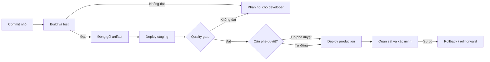
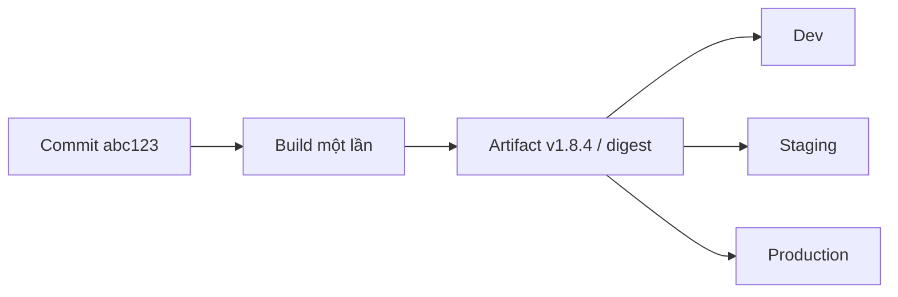

# Nền tảng CI/CD

## Mục lục

- [Mục tiêu](#mục-tiêu)
- [1. Vì sao cần CI/CD?](#1-vì-sao-cần-cicd)
- [2. Continuous Integration](#2-continuous-integration)
- [3. Continuous Delivery và Continuous Deployment](#3-continuous-delivery-và-continuous-deployment)
- [4. Pipeline và feedback loop](#4-pipeline-và-feedback-loop)
- [5. Artifact, environment và promotion](#5-artifact-environment-và-promotion)
- [6. Quality gate, approval và rollback](#6-quality-gate-approval-và-rollback)
- [7. Ánh xạ CI/CD vào Jenkins](#7-ánh-xạ-cicd-vào-jenkins)
- [8. Anti-pattern thường gặp](#8-anti-pattern-thường-gặp)
- [9. Chỉ số nên theo dõi](#9-chỉ-số-nên-theo-dõi)
- [Checklist tự kiểm tra](#checklist-tự-kiểm-tra)
- [Tài liệu tham khảo](#tài-liệu-tham-khảo)

---

## Mục tiêu

Sau bài này, bạn có thể:

- phân biệt Continuous Integration, Continuous Delivery và Continuous Deployment;
- mô tả luồng từ commit đến production;
- giải thích vai trò của artifact, quality gate, approval và rollback;
- thiết kế feedback loop ưu tiên phản hồi nhanh;
- ánh xạ các khái niệm CI/CD vào Jenkins Pipeline.

---

## 1. Vì sao cần CI/CD?

Khi mỗi thay đổi phải được build, test và deploy thủ công, chất lượng phụ thuộc vào checklist và kinh nghiệm cá nhân. Release lớn nhưng ít diễn ra làm tăng batch size: nhiều thay đổi đi cùng nhau, khó khoanh vùng lỗi và rollback.

CI/CD hướng tới ba kết quả:

1. **thay đổi nhỏ và thường xuyên** để giảm rủi ro mỗi lần phát hành;
2. **tự động hóa kiểm tra lặp lại** để phát hiện lỗi sớm;
3. **quy trình phát hành nhất quán** để cùng một revision đi qua các environment có kiểm soát.



<Callout type="info" title="CI/CD là năng lực, không chỉ là công cụ">Cài Jenkins không tự động tạo ra CI/CD. Quy trình chỉ hiệu quả khi code có thể build lặp lại, test đủ tin cậy, artifact có version và đội ngũ phản hồi nhanh với build hỏng.</Callout>

---

## 2. Continuous Integration

**Continuous Integration (CI)** là thực hành tích hợp thay đổi vào nhánh chung thường xuyên và tự động kiểm tra mỗi thay đổi. Một quy trình CI tối thiểu thường gồm:

1. checkout đúng revision;
2. cài hoặc khôi phục dependency theo lock file;
3. compile/build;
4. chạy unit test và static analysis;
5. xuất test report;
6. tạo artifact nếu mọi gate bắt buộc đều đạt.

### 2.1 Điều kiện để CI hiệu quả

| Thực hành | Tại sao cần |
|---|---|
| Commit nhỏ, tích hợp thường xuyên | Dễ review và khoanh vùng nguyên nhân lỗi |
| Build có thể chạy bằng command | Jenkins và developer chạy cùng một quy trình |
| Dependency được khóa version | Giảm build không tái lập được |
| Test nhanh chạy trước | Phản hồi lỗi phổ biến trong vài phút |
| Build hỏng được sửa ngay | Tránh nhánh chính ở trạng thái không phát hành được |
| Trạng thái CI là điều kiện merge | Không bỏ qua kiểm tra khi có áp lực release |

### 2.2 CI không đồng nghĩa với “có server build”

Nếu Jenkins chỉ chạy mỗi đêm, lỗi có thể được phát hiện sau hàng chục commit. Nếu job thường xuyên đỏ và đội ngũ bỏ qua, CI không còn tạo tín hiệu đáng tin cậy. CI cần cả automation lẫn kỷ luật xử lý feedback.

### 2.3 Sắp xếp test theo tốc độ

Một Pipeline nên thất bại nhanh ở bước rẻ nhất:

```text
Lint / format → Unit test → Build → Integration test → Security scan → E2E
   giây           phút       phút         phút              phút         lâu hơn
```

Không có thứ tự duy nhất cho mọi dự án, nhưng nên đưa kiểm tra nhanh, ổn định và có xác suất phát hiện lỗi cao lên trước.

---

## 3. Continuous Delivery và Continuous Deployment

Hai khái niệm có tên gần giống nhưng khác ở bước đưa thay đổi vào production.

### 3.1 Continuous Delivery

**Continuous Delivery** duy trì phần mềm ở trạng thái **có thể phát hành**. Build, test, đóng gói và triển khai đến environment trước production được tự động hóa; việc deploy production có thể cần quyết định hoặc phê duyệt thủ công.

### 3.2 Continuous Deployment

**Continuous Deployment** tự động đưa mọi thay đổi đã vượt qua các gate vào production, không có bước phê duyệt release thủ công.

### 3.3 So sánh

| Tiêu chí | Continuous Integration | Continuous Delivery | Continuous Deployment |
|---|---|---|---|
| Phạm vi | Tích hợp và kiểm tra code | Giữ release candidate luôn sẵn sàng | Tự động phát hành đến production |
| Điểm cuối thường gặp | Build/test thành công | Artifact đã kiểm chứng, chờ quyết định release | Production đã cập nhật |
| Production approval | Không thuộc phạm vi | Có thể thủ công | Không có approval thủ công |
| Yêu cầu test | Tự động hóa kiểm tra commit | Thêm integration, acceptance, deploy verification | Rất tin cậy, giám sát và rollback mạnh |
| Mức trưởng thành vận hành | Cơ bản | Trung bình đến cao | Cao |

<Callout type="warn" title="Đừng bỏ qua bước Delivery">Continuous Deployment chỉ an toàn khi Continuous Delivery đã đáng tin cậy. Tự động hóa một quy trình không ổn định chỉ giúp lỗi đến production nhanh hơn.</Callout>

---

## 4. Pipeline và feedback loop

**Pipeline** là mô hình các stage và step biến một thay đổi source code thành kết quả có thể đánh giá hoặc phát hành.

- **Stage** nhóm công việc theo mục đích, ví dụ `Build`, `Test`, `Publish`.
- **Step** là hành động cụ thể, ví dụ chạy `npm test` hoặc `docker build`.
- **Gate** quyết định Pipeline có được đi tiếp hay không.
- **Post action** chạy sau kết quả, ví dụ lưu report hoặc gửi thông báo.

### 4.1 Một Pipeline tham khảo

| Stage | Đầu vào | Công việc | Đầu ra |
|---|---|---|---|
| Validate | Commit | Lint, policy check | Kết quả kiểm tra nhanh |
| Build | Source + dependency | Compile/package | Binary hoặc package |
| Unit Test | Build output | Chạy unit test | JUnit report, coverage |
| Package | Binary | Tạo image/package | Artifact có version |
| Verify | Artifact | Integration/security test | Release evidence |
| Deploy Staging | Artifact | Triển khai | Staging release |
| Deploy Production | Cùng artifact | Approval hoặc auto deploy | Production release |
| Observe | Release metadata | Smoke test, metric check | Quyết định giữ hoặc rollback |

### 4.2 Feedback loop tốt

Feedback phải đến đúng người, đủ ngữ cảnh và có thể hành động:

- hiển thị stage thất bại thay vì chỉ báo “job failed”;
- publish test report thay vì bắt developer đọc hàng nghìn dòng log;
- liên kết build với commit, pull request và artifact version;
- phân biệt lỗi code với lỗi hạ tầng;
- chỉ gửi thông báo tới kênh có owner xử lý;
- theo dõi build flaky để không làm mất niềm tin vào CI.

---

## 5. Artifact, environment và promotion

### 5.1 Build một lần, promote nhiều lần

Một nguyên tắc quan trọng là **build once, deploy many**: artifact được tạo và kiểm tra ở CI phải là đúng artifact được đưa qua staging rồi production.

Không nên rebuild từ source cho từng environment vì dependency hoặc timestamp có thể tạo output khác nhau. Thay vào đó:

1. gắn artifact với version bất biến hoặc digest;
2. lưu trong artifact repository/registry;
3. lưu metadata về commit, build và dependency;
4. promote cùng artifact qua các environment;
5. tách cấu hình environment khỏi binary/image.



### 5.2 Không dùng workspace làm kho artifact

Workspace là thư mục làm việc có thể bị xóa, ghi đè hoặc nằm trên ephemeral agent. Artifact cần lưu ở hệ thống bền vững như package registry, container registry hoặc artifact repository. `archiveArtifacts` của Jenkins phù hợp với lab và file nhỏ, nhưng không nên thay thế artifact repository ở quy mô production.

---

## 6. Quality gate, approval và rollback

### 6.1 Quality gate

Gate phải có tiêu chí rõ ràng và kết quả máy có thể đánh giá. Ví dụ:

- tất cả unit test bắt buộc đều đạt;
- không có lỗ hổng ở mức severity bị cấm;
- coverage không giảm dưới ngưỡng đã thống nhất;
- artifact có chữ ký và Software Bill of Materials (SBOM);
- smoke test sau deploy trả về kết quả mong đợi.

Không nên tạo quá nhiều gate chậm nhưng ít giá trị. Mỗi gate cần owner, thời gian phản hồi mục tiêu và chính sách exception.

### 6.2 Approval

Approval thủ công phù hợp khi cần xác nhận business window, compliance hoặc thay đổi có blast radius lớn. Approval không nên thay thế automated test. Người phê duyệt cần thấy ít nhất:

- revision và artifact sẽ deploy;
- kết quả test/scan;
- thay đổi cấu hình hoặc database migration;
- kế hoạch rollback;
- target environment.

### 6.3 Rollback và roll forward

| Chiến lược | Phù hợp khi | Điều kiện |
|---|---|---|
| Rollback artifact | Phiên bản trước vẫn tương thích | Artifact cũ còn tồn tại và cấu hình tương thích |
| Roll forward | Dữ liệu đã migration khó đảo ngược | Có thể phát hành bản sửa nhanh, feature flag hỗ trợ |
| Blue/green | Cần chuyển traffic nhanh | Có hai environment tương đương |
| Canary | Muốn giới hạn blast radius | Có traffic routing và metric đủ tốt |
| Feature flag | Muốn tách deploy khỏi release | Flag có owner và vòng đời cleanup |

---

## 7. Ánh xạ CI/CD vào Jenkins

```groovy
pipeline {
    agent any

    stages {
        stage('Validate') {
            steps {
                sh './scripts/lint.sh'
            }
        }
        stage('Build') {
            steps {
                sh './scripts/build.sh'
            }
        }
        stage('Test') {
            steps {
                sh './scripts/test.sh'
            }
        }
        stage('Publish') {
            steps {
                echo 'Publish artifact bất biến'
            }
        }
    }

    post {
        always {
            junit testResults: 'reports/*.xml', allowEmptyResults: true
        }
    }
}
```

Ví dụ trên minh họa cấu trúc, không thay thế script của dự án. Jenkins nên đóng vai trò lớp điều phối; logic build cốt lõi nên chạy được cả trên máy developer và CI.

| Khái niệm CI/CD | Jenkins |
|---|---|
| Workflow as Code | `Jenkinsfile` |
| Phase của quy trình | `stage` |
| Hành động | Pipeline `step` như `sh`, `junit`, `archiveArtifacts` |
| Runtime | Agent và executor |
| Trigger | Webhook, SCM polling, schedule hoặc API |
| Secret | Jenkins Credentials và credential binding |
| Approval | `input` step, kết hợp authorization phù hợp |
| Feedback | Build status, Console Output, test report, notification |

---

## 8. Anti-pattern thường gặp

### 8.1 Pipeline chỉ chạy được trong Jenkins

Nếu toàn bộ logic nằm trong một script Groovy dài, developer khó tái hiện lỗi local. Hãy giữ `Jenkinsfile` ở vai trò điều phối và đặt lệnh build/test trong script hoặc build tool của repository.

### 8.2 Dùng `latest` cho artifact cần phát hành

Tag có thể thay đổi khiến không biết production đang chạy binary nào. Dùng semantic version, build number, commit SHA và image digest tùy loại artifact.

### 8.3 Deploy lại bằng cách rebuild

Rebuild tạo artifact mới chưa đi qua cùng test. Hãy promote artifact đã được kiểm chứng.

### 8.4 Pipeline tuần tự quá dài

Các test độc lập có thể chạy song song, nhưng chỉ nên parallel khi agent capacity và test isolation cho phép. Mục tiêu là feedback nhanh hơn, không phải tăng tải vô hạn.

### 8.5 Lộ secret trong log

Không hard-code token trong `Jenkinsfile`, command argument hoặc source code. Jenkins masking chỉ giảm rủi ro lộ vô tình; code không đáng tin cậy vẫn có thể đọc credential được cấp. Chỉ bind secret ở stage cần dùng và không cấp trusted credential cho untrusted Pipeline.

### 8.6 Bỏ qua trạng thái `UNSTABLE`

Test report có thể đánh dấu build `UNSTABLE` thay vì `FAILURE`. Quy định rõ trạng thái nào được phép publish/deploy, tránh mặc định coi mọi build không đỏ là an toàn.

---

## 9. Chỉ số nên theo dõi

Không tối ưu chỉ dựa trên số lượng build. Nên kết hợp chỉ số delivery và độ tin cậy:

| Chỉ số | Câu hỏi cần trả lời |
|---|---|
| Pipeline duration | Developer phải chờ bao lâu để nhận phản hồi? |
| Queue time | Capacity agent có đáp ứng tải không? |
| Success/failure rate | Build hỏng do code hay do hạ tầng? |
| Flaky test rate | Bao nhiêu lỗi biến mất khi chạy lại? |
| Deployment frequency | Đội ngũ đưa giá trị đến production thường xuyên thế nào? |
| Lead time for changes | Từ commit đến production mất bao lâu? |
| Change failure rate | Bao nhiêu deployment gây sự cố hoặc cần remediation? |
| Mean time to restore | Khôi phục dịch vụ sau sự cố nhanh thế nào? |

Dùng metric để tìm bottleneck, không dùng để xếp hạng cá nhân.

---

## Checklist tự kiểm tra

- [ ] Tôi phân biệt được Continuous Delivery và Continuous Deployment.
- [ ] Tôi giải thích được vì sao phải build một lần và promote cùng artifact.
- [ ] Tôi biết cách sắp xếp kiểm tra để fail fast.
- [ ] Tôi xác định được gate, approval và rollback cho một dịch vụ mẫu.
- [ ] Tôi biết Jenkins điều phối công cụ chứ không thay thế build/deploy tool.
- [ ] Tôi nhận diện được ít nhất ba anti-pattern trong Pipeline hiện tại.

---

## Tài liệu tham khảo

- [Jenkins Pipeline](https://www.jenkins.io/doc/book/pipeline/)
- [Using a Jenkinsfile](https://www.jenkins.io/doc/book/pipeline/jenkinsfile/)
- [Pipeline Syntax](https://www.jenkins.io/doc/book/pipeline/syntax/)
- [Jenkins Pipeline Best Practices](https://www.jenkins.io/doc/book/pipeline/pipeline-best-practices/)
- [DORA — Guides](https://dora.dev/guides/)
