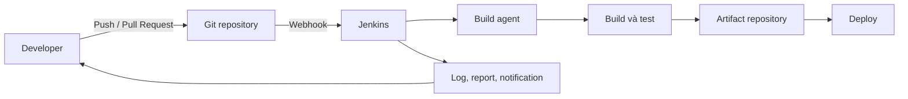

# Tổng quan về Jenkins

## Mục lục

- [Mục tiêu](#mục-tiêu)
- [1. Jenkins là gì?](#1-jenkins-là-gì)
- [2. Bài toán Jenkins giải quyết](#2-bài-toán-jenkins-giải-quyết)
- [3. Các thành phần và tính năng chính](#3-các-thành-phần-và-tính-năng-chính)
- [4. Jenkins nằm ở đâu trong chuỗi công cụ?](#4-jenkins-nằm-ở-đâu-trong-chuỗi-công-cụ)
- [5. Khi nào nên và không nên dùng Jenkins?](#5-khi-nào-nên-và-không-nên-dùng-jenkins)
- [6. Lộ trình học đề xuất](#6-lộ-trình-học-đề-xuất)
- [Checklist tự kiểm tra](#checklist-tự-kiểm-tra)
- [Tài liệu tham khảo](#tài-liệu-tham-khảo)

---

## Mục tiêu

Sau bài này, bạn có thể:

- mô tả đúng vai trò của Jenkins trong quy trình CI/CD;
- phân biệt Jenkins với Git, build tool, artifact repository và nền tảng triển khai;
- nhận diện các thành phần chính: controller, agent, job, build, Pipeline và plugin;
- đánh giá sơ bộ Jenkins có phù hợp với đội ngũ hay không;
- chọn bước tiếp theo trong lộ trình học.

---

## 1. Jenkins là gì?

Jenkins là một **automation server mã nguồn mở** viết bằng Java. Jenkins nhận sự kiện hoặc lịch chạy, điều phối công việc trên một hay nhiều máy thực thi, ghi lại kết quả và cung cấp giao diện để theo dõi. Trường hợp sử dụng phổ biến nhất là tự động hóa quy trình **build, test và delivery/deployment** phần mềm.

Jenkins không phải là một quy trình CI/CD hoàn chỉnh chỉ sau khi cài đặt. Nó là **bộ máy điều phối**; đội ngũ vẫn phải định nghĩa:

- công việc cần chạy và thứ tự chạy;
- công cụ build/test/deploy;
- điều kiện chất lượng và quy tắc phê duyệt;
- credential, quyền truy cập và chính sách lưu trữ;
- cách xử lý lỗi, rollback và thông báo.



<Callout type="info" title="Ý chính">Jenkins không thay thế các công cụ trong chuỗi delivery. Jenkins kết nối và điều phối chúng thành một quy trình có thể lặp lại, quan sát và kiểm soát.</Callout>

---

## 2. Bài toán Jenkins giải quyết

### 2.1 Từ thao tác thủ công đến quy trình lặp lại được

Một quy trình phát hành thủ công thường phụ thuộc vào trí nhớ của một vài người: checkout đúng branch, chạy đúng lệnh, chọn đúng biến môi trường rồi sao chép artifact đến server. Cách làm này khó kiểm toán và dễ tạo ra khác biệt giữa các lần chạy.

Jenkins chuyển các thao tác đó thành job hoặc `Jenkinsfile`. Mỗi lần chạy có đầu vào, log, trạng thái và lịch sử riêng. Khi Pipeline được lưu trong source control, thay đổi quy trình cũng có thể review như code ứng dụng.

### 2.2 Phản hồi sớm cho developer

Nếu build hoặc test chỉ chạy trước ngày release, lỗi tích lũy lâu và khó xác định commit gây lỗi. Jenkins có thể chạy khi có push hoặc pull request để rút ngắn feedback loop:

1. nhận webhook từ Git provider;
2. checkout revision cần kiểm tra;
3. build và chạy automated tests;
4. xuất test report, artifact và trạng thái;
5. gửi kết quả về pull request hoặc kênh thông báo.

### 2.3 Chuẩn hóa giữa nhiều dự án

Pipeline dùng chung, Shared Library, container image và cấu hình agent giúp nhiều repository tuân theo cùng quy tắc. Ví dụ, mọi service đều phải qua unit test, static analysis và security scan trước khi publish artifact.

### 2.4 Điều phối môi trường khác nhau

Một controller có thể phân công workload theo label cho các agent khác nhau:

- `linux && docker` để build container;
- `windows` để build ứng dụng .NET hoặc installer;
- `macos` để build và ký ứng dụng Apple;
- `high-memory` cho test cần nhiều RAM.

Kiến trúc này được giải thích chi tiết trong [Kiến trúc Jenkins](/docs/getting-started/architecture/).

---

## 3. Các thành phần và tính năng chính

| Thành phần | Vai trò | Ví dụ |
|---|---|---|
| **Controller** | Lưu cấu hình, cung cấp UI/API, lập lịch và điều phối | Nhận webhook rồi đưa build vào queue |
| **Agent** | Máy hoặc container thực thi công việc | Linux VM chạy Maven và Docker |
| **Job** | Cấu hình mô tả công việc Jenkins cần làm | Freestyle job, Pipeline, Multibranch Pipeline |
| **Build/Run** | Một lần thực thi cụ thể của job | `orders-service #142` |
| **Pipeline** | Mô hình hóa workflow delivery bằng các stage và step | Build → Test → Publish → Deploy |
| **Workspace** | Thư mục làm việc trên node | Nơi checkout source code và tạo file tạm |
| **Artifact** | Kết quả bất biến được tạo ra từ build | JAR, package, image digest, test report |
| **Credential** | Bí mật được Jenkins quản lý và cấp theo scope | SSH key, token, username/password |
| **Plugin** | Mở rộng Jenkins core | Git, Kubernetes, Credentials, JUnit |

### 3.1 Pipeline as Code

Thay vì cấu hình toàn bộ quy trình bằng UI, Jenkins Pipeline thường được định nghĩa trong file `Jenkinsfile` tại repository:

```groovy
pipeline {
    agent any

    stages {
        stage('Build') {
            steps {
                echo 'Build ứng dụng'
            }
        }
        stage('Test') {
            steps {
                echo 'Chạy kiểm thử'
            }
        }
    }
}
```

Cách này mang lại lịch sử thay đổi, code review và khả năng khôi phục phiên bản. Với dự án thực tế, nên ưu tiên Pipeline as Code thay vì duy trì workflow phức tạp hoàn toàn trong UI.

### 3.2 Hệ sinh thái plugin

Jenkins core giữ phạm vi tương đối nhỏ; phần lớn tích hợp được cung cấp bởi plugin. Plugin có thể bổ sung SCM, cloud agent, report, credential type, notification hoặc Pipeline step.

Plugin đem lại khả năng mở rộng lớn nhưng cũng tạo chi phí vận hành:

- phải theo dõi compatibility trước khi nâng cấp;
- phải vá lỗ hổng và gỡ plugin không còn sử dụng;
- plugin quá nhiều làm tăng thời gian khởi động và bề mặt tấn công;
- cấu hình cần được backup và kiểm thử khôi phục.

<Callout type="warn" title="Không cài plugin theo thói quen">Chỉ cài plugin khi có use case rõ ràng. Ghi lại owner, mục đích và kế hoạch nâng cấp của các plugin quan trọng.</Callout>

---

## 4. Jenkins nằm ở đâu trong chuỗi công cụ?

| Nhu cầu | Công cụ chịu trách nhiệm chính | Vai trò của Jenkins |
|---|---|---|
| Quản lý source code | GitHub, GitLab, Bitbucket hoặc Git server | Checkout revision, nhận webhook, cập nhật build status |
| Biên dịch/đóng gói | Maven, Gradle, npm, Make, MSBuild | Gọi build tool với tham số và môi trường chuẩn |
| Chạy test | JUnit, pytest, Jest, Playwright | Điều phối, thu report và hiển thị xu hướng |
| Lưu package | Nexus, Artifactory, package registry | Publish artifact và truyền version/digest |
| Build container | Docker, BuildKit, Buildah, Kaniko | Gọi builder trên agent phù hợp |
| Triển khai | Helm, kubectl, Ansible, Terraform, Argo CD | Kích hoạt, kiểm soát gate hoặc cung cấp artifact cần deploy |
| Quản lý bí mật | Vault, cloud secret manager, Jenkins Credentials | Cấp credential tạm thời cho đúng scope thực thi |
| Quan sát hệ thống | Prometheus, Grafana, log platform | Phát metric/log và đính kèm link vào kết quả build |

Nói ngắn gọn: **build tool biết cách tạo phần mềm; deployment tool biết cách thay đổi môi trường; Jenkins biết khi nào và theo thứ tự nào cần gọi các công cụ đó**.

---

## 5. Khi nào nên và không nên dùng Jenkins?

### 5.1 Jenkins phù hợp khi

- đội ngũ cần self-hosted CI/CD và kiểm soát network, dữ liệu hoặc agent;
- workload đa dạng, cần Linux/Windows/macOS, phần cứng đặc biệt hoặc mạng nội bộ;
- có nhiều hệ thống cũ và mới cần tích hợp trong cùng workflow;
- cần tùy biến sâu bằng plugin, Groovy, Shared Library hoặc API;
- tổ chức có năng lực vận hành controller, plugin, backup và security patch.

### 5.2 Cần cân nhắc giải pháp khác khi

- đội nhỏ chỉ cần workflow tiêu chuẩn và muốn giảm tối đa công việc vận hành;
- SCM provider hiện tại đã cung cấp hosted CI đáp ứng đầy đủ yêu cầu;
- tổ chức không có owner chịu trách nhiệm nâng cấp, bảo mật và khôi phục Jenkins;
- nhu cầu chính là GitOps reconciliation liên tục trong Kubernetes — một GitOps controller chuyên dụng có thể phù hợp hơn cho bước deploy;
- workload ngắn hạn, đơn giản nhưng Jenkins lại yêu cầu quá nhiều plugin và cấu hình riêng.

### 5.3 Câu hỏi đánh giá nhanh

| Câu hỏi | Nếu câu trả lời là “có” |
|---|---|
| Build có cần truy cập tài nguyên chỉ có trong private network? | Self-hosted Jenkins có lợi thế |
| Có cần agent với OS/phần cứng đặc biệt? | Jenkins distributed build phù hợp |
| Có người chịu trách nhiệm vận hành nền tảng CI? | Có thể kiểm soát rủi ro vận hành |
| Workflow chủ yếu là template tiêu chuẩn của SCM SaaS? | Nên so sánh với hosted CI trước |
| Yêu cầu audit và data residency nghiêm ngặt? | Cân nhắc Jenkins trong hạ tầng kiểm soát được |

---

## 6. Lộ trình học đề xuất

<Cards>
  <Card href="/docs/getting-started/ci-cd-fundamentals/" title="Nền tảng CI/CD">
    Hiểu Continuous Integration, Delivery, Deployment và feedback loop.
  </Card>
  <Card href="/docs/getting-started/architecture/" title="Kiến trúc Jenkins">
    Hiểu controller, agent, executor, queue và workspace.
  </Card>
  <Card href="/docs/getting-started/requirements/" title="Yêu cầu hệ thống">
    Chuẩn bị Java, CPU, RAM, storage, DNS và network.
  </Card>
  <Card href="/docs/getting-started/first-job/" title="Job đầu tiên">
    Tạo Freestyle job, chạy build và đọc Console Output.
  </Card>
</Cards>

Thứ tự thực hành khuyến nghị:

1. học nền tảng CI/CD và thuật ngữ;
2. hiểu kiến trúc trước khi chọn cách cài đặt;
3. kiểm tra yêu cầu hệ thống;
4. cài Jenkins LTS và hoàn tất initial setup;
5. tạo job đầu tiên;
6. chuyển sang Pipeline as Code và agent tách biệt.

---

## Checklist tự kiểm tra

- [ ] Tôi giải thích được Jenkins là automation server, không phải build tool.
- [ ] Tôi phân biệt được controller, agent, job và build.
- [ ] Tôi biết vì sao `Jenkinsfile` nên được lưu cùng source code.
- [ ] Tôi hiểu plugin vừa tạo khả năng mở rộng vừa tạo chi phí vận hành.
- [ ] Tôi xác định được ít nhất một use case phù hợp và một trường hợp không cần Jenkins.
- [ ] Tôi đã chọn bài tiếp theo trong lộ trình.

---

## Tài liệu tham khảo

- [Jenkins User Documentation](https://www.jenkins.io/doc/)
- [Jenkins User Handbook](https://www.jenkins.io/doc/book/getting-started/)
- [Jenkins Glossary](https://www.jenkins.io/doc/book/glossary/)
- [Jenkins Plugins](https://plugins.jenkins.io/)
- [Using a Jenkinsfile](https://www.jenkins.io/doc/book/pipeline/jenkinsfile/)
