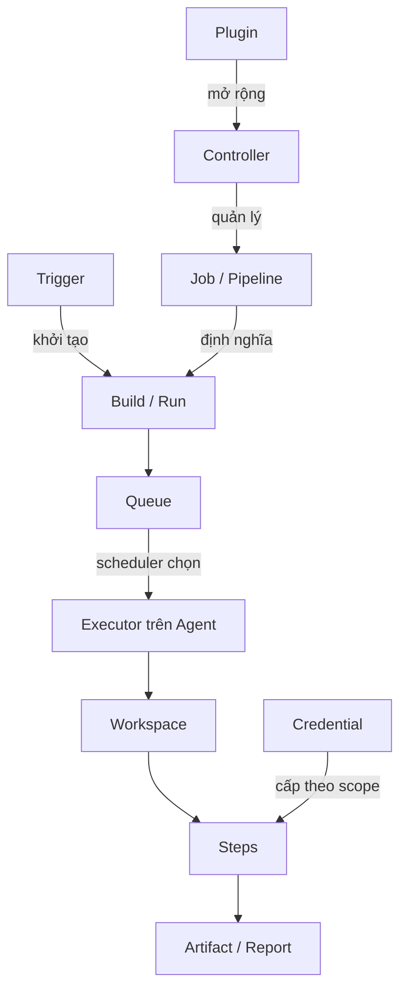

# Thuật ngữ Jenkins

## Mục lục

- [Mục tiêu](#mục-tiêu)
- [1. Bản đồ khái niệm](#1-bản-đồ-khái-niệm)
- [2. Job, item, build và run](#2-job-item-build-và-run)
- [3. Controller, node, agent và executor](#3-controller-node-agent-và-executor)
- [4. Pipeline, stage và step](#4-pipeline-stage-và-step)
- [5. Queue, workspace, artifact và fingerprint](#5-queue-workspace-artifact-và-fingerprint)
- [6. Plugin, credential và secret](#6-plugin-credential-và-secret)
- [7. Trigger, upstream và downstream](#7-trigger-upstream-và-downstream)
- [8. Trạng thái build](#8-trạng-thái-build)
- [9. Thuật ngữ cũ và dễ nhầm](#9-thuật-ngữ-cũ-và-dễ-nhầm)
- [10. Đọc một Jenkinsfile bằng thuật ngữ chuẩn](#10-đọc-một-jenkinsfile-bằng-thuật-ngữ-chuẩn)
- [Bài tập tự kiểm tra](#bài-tập-tự-kiểm-tra)
- [Tài liệu tham khảo](#tài-liệu-tham-khảo)

---

## Mục tiêu

Sau bài này, bạn có thể:

- dùng đúng từ khi trao đổi về Jenkins;
- phân biệt job với build, node với executor, workspace với artifact;
- đọc một Pipeline cơ bản và gọi tên các thành phần;
- hiểu các trạng thái `SUCCESS`, `UNSTABLE`, `FAILURE`, `ABORTED`;
- tránh các thuật ngữ cũ như “master/slave”.

---

## 1. Bản đồ khái niệm



Một câu mô tả đầy đủ có thể là:

> Webhook trigger Pipeline `orders-service`; run số `142` chờ trong queue cho tới khi một executor trên agent có label `linux && docker` rảnh, sau đó checkout code vào workspace và publish artifact version `1.8.4`.

---

## 2. Job, item, build và run

| Thuật ngữ | Định nghĩa | Ví dụ |
|---|---|---|
| **Item** | Đối tượng trong Jenkins UI, có thể là folder, job hoặc Pipeline | Folder `payments`, Pipeline `api` |
| **Job** | Cấu hình mô tả công việc Jenkins cần thực hiện | Freestyle job build tài liệu |
| **Project** | Tên cũ, gần nghĩa với job | “Freestyle project” vẫn xuất hiện trong UI |
| **Build** | Kết quả của một lần thực thi job | `docs-build #27` |
| **Run** | Khái niệm tổng quát cho một lần thực thi; thường dùng tương đương build | Một Pipeline run từ commit cụ thể |
| **Build number** | Số tăng dần trong phạm vi một job | `BUILD_NUMBER=27` |
| **Build ID** | Định danh lần chạy; ở Jenkins hiện đại thường tương ứng build number | `BUILD_ID=27` |
| **Folder** | Container tổ chức item và có thể tạo scope cấu hình/credential | `team-a/service-x` |
| **View** | Cách nhóm và hiển thị item trên dashboard | View cho các job production |

### 2.1 Job không phải build

Job là **định nghĩa**; build là **một lần chạy** của định nghĩa đó. Sửa cấu hình job sẽ ảnh hưởng các lần chạy sau nhưng không biến lịch sử build cũ thành một job mới.

```text
Job: orders-service
├── Build #140 → SUCCESS
├── Build #141 → FAILURE
└── Build #142 → SUCCESS
```

### 2.2 Freestyle, Pipeline và Multibranch Pipeline

| Loại item | Dùng khi | Lưu ý |
|---|---|---|
| **Freestyle project** | Lab hoặc automation đơn giản cấu hình bằng UI | Khó review và version hóa khi workflow lớn |
| **Pipeline** | Workflow nhiều stage, nên định nghĩa bằng `Jenkinsfile` | Hỗ trợ Pipeline as Code |
| **Multibranch Pipeline** | Tự phát hiện branch/pull request có `Jenkinsfile` | Phù hợp repository có nhiều branch |
| **Folder** | Phân nhóm item, phân quyền và credential scope | Không thực thi build |

---

## 3. Controller, node, agent và executor

| Thuật ngữ | Định nghĩa | Điểm cần nhớ |
|---|---|---|
| **Controller** | Tiến trình trung tâm lưu cấu hình, cung cấp UI/API và điều phối | Không nên chạy build production trực tiếp |
| **Node** | Máy thuộc Jenkins environment và có khả năng thực thi | Controller và agent đều được xem là node |
| **Built-in node** | Node gắn với controller | Nên đặt `0` executor ở production |
| **Agent** | Máy/container/pod kết nối controller để thực thi task | Có thể tĩnh hoặc ephemeral |
| **Executor** | Slot thực thi trên một node | Quyết định số task có thể chạy đồng thời |
| **Label** | Chuỗi mô tả capability/nhóm node | Ví dụ `linux`, `docker`, `jdk21` |
| **Cloud** | Cấu hình có thể provision agent động | Ví dụ Kubernetes hoặc VM cloud plugin |
| **Launcher** | Cơ chế khởi động/kết nối agent | SSH, inbound connection, cloud provisioner |

### 3.1 Phân biệt node, agent và executor

- Một **agent** thường chạy trên một **node**.
- Một node có thể có không, một hoặc nhiều **executor**.
- Executor không phải process build cố định; nó là capacity slot được cấp cho workload.
- Một agent 4 executor không mặc nhiên nhanh hơn agent 1 executor; workload có thể tranh chấp CPU, RAM và disk.

Xem mô hình đầy đủ tại [Kiến trúc Jenkins](/docs/getting-started/architecture/).

---

## 4. Pipeline, stage và step

| Thuật ngữ | Định nghĩa | Ví dụ |
|---|---|---|
| **Pipeline** | Mô hình workflow delivery do người dùng định nghĩa | Build → Test → Deploy |
| **Jenkinsfile** | File text chứa định nghĩa Pipeline, thường lưu ở root repository | `Jenkinsfile` |
| **Declarative Pipeline** | Cú pháp có cấu trúc chuẩn với `pipeline`, `agent`, `stages` | Phù hợp phần lớn dự án |
| **Scripted Pipeline** | Cú pháp Groovy linh hoạt hơn, thường bắt đầu bằng `node` | Dùng cho logic cần kiểm soát sâu |
| **Stage** | Nhóm công việc có ý nghĩa nghiệp vụ/kỹ thuật riêng | `Build`, `Test`, `Deploy` |
| **Step** | Một tác vụ cụ thể trong Pipeline | `sh`, `echo`, `junit` |
| **Post action** | Hành động chạy theo kết quả hoặc sau Pipeline/stage | Publish report, cleanup, notification |
| **Shared Library** | Code Groovy dùng chung giữa nhiều Pipeline | Chuẩn hóa workflow tổ chức |

### 4.1 Stage không phải environment

Stage là phần logic của Pipeline; environment là nơi phần mềm chạy. Một stage có thể deploy đến environment, nhưng hai khái niệm không đồng nghĩa.

```text
Stage: Deploy Staging
Action: gọi Helm để thay đổi
Environment: cluster/namespace staging
```

### 4.2 Step không nhất thiết là một command

Một step có thể gọi shell command, chờ approval, retry block, ghi test report hoặc archive artifact. Plugin có thể cung cấp step mới.

---

## 5. Queue, workspace, artifact và fingerprint

| Thuật ngữ | Định nghĩa | Sai lầm thường gặp |
|---|---|---|
| **Queue** | Danh sách workload đang chờ được cấp executor | Cho rằng mọi build được trigger sẽ chạy ngay |
| **Workspace** | Thư mục làm việc trên node cho job/build | Dùng như nơi lưu artifact lâu dài |
| **Artifact** | File bất biến tạo ra từ build và được lưu để dùng sau | Gọi mọi file tạm trong workspace là artifact |
| **Archive** | Đưa file build vào cơ chế lưu artifact của Jenkins | Dùng thay artifact repository ở quy mô lớn |
| **Fingerprint** | Hash giúp theo dõi một file/artifact qua các job | Coi fingerprint là chữ ký bảo mật |
| **Stash** | Lưu tạm file để chuyển giữa stage/node trong cùng Pipeline run | Dùng để phân phối artifact lớn lâu dài |
| **Cache** | Dữ liệu có thể tái tạo để tăng tốc build | Coi cache là output phát hành chính thức |
| **Build history** | Lịch sử run, log, status và metadata | Không thiết lập retention |

### 5.1 Phân biệt artifact, cache và workspace

```text
Workspace: nơi đang làm việc, có thể xóa
Cache: dữ liệu tăng tốc, mất thì tạo lại
Artifact: output có version cần lưu và phân phối
```

Ví dụ với ứng dụng Java:

- Maven dependency trong `.m2` là cache;
- source checkout và `target/classes` nằm trong workspace;
- file JAR đã version hóa để release là artifact.

---

## 6. Plugin, credential và secret

| Thuật ngữ | Định nghĩa | Ví dụ |
|---|---|---|
| **Jenkins core** | Ứng dụng Jenkins chính trong `jenkins.war` | UI và nền tảng extension |
| **Plugin** | Gói mở rộng core | Git, JUnit, Kubernetes |
| **Update Center** | Nguồn metadata để khám phá/cập nhật plugin | Hiển thị trong Manage Jenkins |
| **Credential** | Bản ghi bí mật hoặc danh tính Jenkins quản lý | Token, SSH key, username/password |
| **Credential ID** | Định danh dùng để tham chiếu credential | `registry-push-token` |
| **Scope** | Phạm vi credential có thể được sử dụng | System, global hoặc folder tùy cấu hình |
| **Secret text** | Credential dạng chuỗi bí mật | API token |
| **Secret file** | File bí mật được cấp tạm cho build | kubeconfig, key file |

### 6.1 Credential ID không phải secret

ID như `prod-token` có thể xuất hiện trong `Jenkinsfile`; giá trị token thật không được hard-code. Tuy nhiên, ID cũng không nên chứa dữ liệu nhạy cảm như username nội bộ nếu không cần.

### 6.2 Masking không phải sandbox bảo mật

Jenkins có thể che giá trị credential trong nhiều tình huống log thông thường, nhưng Pipeline chạy code độc hại vẫn có thể tìm cách lấy secret đã được cấp. Chỉ cấp trusted credential cho trusted code và giới hạn scope/thời gian sử dụng.

---

## 7. Trigger, upstream và downstream

| Thuật ngữ | Định nghĩa | Ví dụ |
|---|---|---|
| **Trigger** | Tiêu chí làm bắt đầu một run | Webhook, cron, API, manual |
| **Webhook** | HTTP callback từ hệ thống ngoài | Git provider báo có push |
| **SCM polling** | Jenkins định kỳ kiểm tra SCM có thay đổi không | Dùng khi webhook không khả dụng |
| **Upstream** | Job/Pipeline kích hoạt công việc khác | Job build package |
| **Downstream** | Job/Pipeline được công việc khác kích hoạt | Job deploy package |
| **Parameter** | Giá trị đầu vào của build | `ENVIRONMENT=staging` |
| **Cause** | Metadata mô tả nguyên nhân build bắt đầu | User, timer, SCM event |
| **Quiet period** | Khoảng trì hoãn trước khi schedule build | Gom các event gần nhau trong một số use case |

### 7.1 Trigger không đảm bảo executor rảnh

Webhook thành công chỉ cho biết Jenkins đã nhận event. Build vẫn có thể nằm trong queue vì thiếu agent hoặc executor.

### 7.2 Cron và webhook phục vụ mục đích khác nhau

- Webhook phù hợp feedback theo thay đổi source code.
- Cron phù hợp công việc định kỳ như dependency scan hoặc cleanup.
- SCM polling là phương án thay thế khi không cấu hình được webhook, nhưng tạo request định kỳ lên SCM.

---

## 8. Trạng thái build

| Trạng thái | Ý nghĩa | Ví dụ |
|---|---|---|
| **SUCCESS** | Build hoàn thành và các tiêu chí bắt buộc đạt | Compile/test thành công |
| **UNSTABLE** | Build hoàn thành nhưng có vấn đề không được coi là fatal | Test report có test fail tùy cấu hình |
| **FAILURE** | Có lỗi nghiêm trọng làm build thất bại | Command trả exit code khác `0` |
| **ABORTED** | Build bị dừng trước khi kết thúc dự kiến | User stop hoặc timeout |
| **NOT_BUILT** | Một phần công việc không được chạy | Stage bị bỏ qua do dependency trước thất bại |

### 8.1 `UNSTABLE` không phải `SUCCESS`

Một Pipeline có thể tiếp tục sau khi test report đánh dấu `UNSTABLE`. Quy tắc publish/deploy phải kiểm tra trạng thái rõ ràng thay vì chỉ dựa vào việc Pipeline chưa dừng.

### 8.2 Exit code và trạng thái

Trên Unix/Linux, shell command trả exit code `0` thường được hiểu là thành công; giá trị khác `0` làm step thất bại nếu không được xử lý. Không dùng `|| true` chỉ để làm Pipeline xanh vì sẽ che lỗi thật. Nếu cần tiếp tục để publish report, hãy dùng cơ chế error handling có chủ đích.

---

## 9. Thuật ngữ cũ và dễ nhầm

| Nên dùng | Tránh dùng | Giải thích |
|---|---|---|
| **Controller** | Master | `master` là thuật ngữ cũ đã bị thay thế |
| **Agent** | Slave | `slave` là thuật ngữ cũ đã bị thay thế |
| **Job** | Project khi nói chung | Project là tên cũ; UI vẫn có “Freestyle project” |
| **Built-in node** | Master node | Node gắn với controller |
| **Build agent** | Build server khi cần chính xác | Agent thực thi dưới điều phối của controller |
| **Deploy** | Release nếu chưa phân biệt | Deploy đưa code vào environment; release mở tính năng cho user có thể là bước khác |

### 9.1 Jenkins URL và Resource Root URL

- **Jenkins URL** là URL chính user và integration truy cập.
- **Resource Root URL** là URL phụ có thể dùng để phục vụ nội dung build có khả năng không đáng tin cậy, tách khỏi origin chính.

### 9.2 LTS và weekly

- **LTS release** ưu tiên chu kỳ ổn định và phù hợp phần lớn môi trường production.
- **Weekly release** nhận feature/fix sớm hơn nhưng đòi hỏi nhịp kiểm thử và nâng cấp thường xuyên hơn.

---

## 10. Đọc một Jenkinsfile bằng thuật ngữ chuẩn

```groovy
pipeline {
    agent { label 'linux && jdk21' }

    stages {
        stage('Build') {
            steps {
                sh './mvnw -B package'
            }
        }
    }

    post {
        always {
            junit 'target/surefire-reports/*.xml'
            archiveArtifacts artifacts: 'target/*.jar', fingerprint: true
        }
    }
}
```

Diễn giải:

1. đây là **Declarative Pipeline**;
2. `agent` yêu cầu Jenkins tìm node có label `linux` và `jdk21`;
3. run chờ trong **queue** cho tới khi có **executor** phù hợp;
4. Jenkins cấp **workspace** trên agent;
5. stage `Build` chứa step `sh` gọi Maven Wrapper;
6. `post` chạy action publish JUnit report và archive file JAR;
7. `fingerprint: true` tạo fingerprint để hỗ trợ theo dõi file;
8. toàn bộ lần thực thi tạo thành một **Pipeline run/build** có build number riêng.

---

## Bài tập tự kiểm tra

Điền thuật ngữ đúng vào chỗ trống:

1. Một lần thực thi job được gọi là **______**.
2. Slot chạy workload trên node là **______**.
3. Thư mục checkout source trên agent là **______**.
4. File JAR đã đóng gói và lưu để phát hành là **______**.
5. Danh sách workload đang chờ executor là **______**.
6. File định nghĩa Pipeline as Code thường tên là **______**.

<Accordions type="single">
  <Accordion title="Xem đáp án">
    1. build hoặc run; 2. executor; 3. workspace; 4. artifact; 5. queue; 6. `Jenkinsfile`.
  </Accordion>
</Accordions>

---

## Tài liệu tham khảo

- [Jenkins Glossary](https://www.jenkins.io/doc/book/glossary/)
- [Using Jenkins Agents](https://www.jenkins.io/doc/book/using/using-agents/)
- [Jenkins Pipeline](https://www.jenkins.io/doc/book/pipeline/)
- [Pipeline Syntax](https://www.jenkins.io/doc/book/pipeline/syntax/)
- [Using Credentials](https://www.jenkins.io/doc/book/using/using-credentials/)
