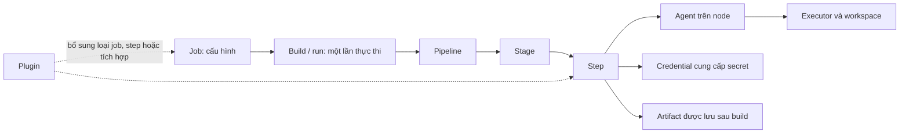

Trang này dùng một pipeline nhỏ để nối các thuật ngữ Jenkins với nhau. Khi gặp một từ trong giao diện hoặc trong `Jenkinsfile`, hãy bắt đầu bằng câu hỏi: *đó là cấu hình, một lần thực thi, tài nguyên chạy, hay dữ liệu đầu ra?*

<Callout title="Cách đọc trang này" type="info">
  Giữ nguyên các tên kỹ thuật như `job`, `build`, `agent` và `artifact` để khớp với giao diện Jenkins và tài liệu chính thức. Phần giải thích tiếng Việt đặt ngay ở lần xuất hiện đầu tiên.
</Callout>

## Mục lục

- [Mục lục](#mục-lục)
- [Bản đồ thuật ngữ](#bản-đồ-thuật-ngữ)
  - [Job, build và run](#job-build-và-run)
  - [Node, agent và executor](#node-agent-và-executor)
  - [Pipeline, stage và step](#pipeline-stage-và-step)
  - [Plugin, credential, secret và artifact](#plugin-credential-secret-và-artifact)
- [Đọc một Jenkinsfile từ trên xuống](#đọc-một-jenkinsfile-từ-trên-xuống)
  - [Jenkinsfile mẫu](#jenkinsfile-mẫu)
  - [Theo dấu một lần thực thi](#theo-dấu-một-lần-thực-thi)
- [Thực hành tra cứu trong UI Jenkins](#thực-hành-tra-cứu-trong-ui-jenkins)
  - [Từ job đến build](#từ-job-đến-build)
  - [Từ node đến executor](#từ-node-đến-executor)
- [Checklist tra cứu](#checklist-tra-cứu)
- [Nhầm lẫn thường gặp](#nhầm-lẫn-thường-gặp)
- [Nguồn Jenkins chính thức](#nguồn-jenkins-chính-thức)

## Bản đồ thuật ngữ



### Job, build và run

**Job** là cấu hình công việc mà Jenkins biết cách kích hoạt và thực hiện. Job có thể là Freestyle project, Pipeline hoặc Multibranch Pipeline. Nó quy định nguồn mã, lịch hoặc webhook kích hoạt, `Jenkinsfile`, quyền truy cập và các thiết lập liên quan. Hãy xem job là **công thức**, không phải kết quả của một lần chạy.

**Build** là một lần Jenkins thực thi job và thường có số thứ tự như `#42`. Build lưu trạng thái (`SUCCESS`, `FAILURE`, `ABORTED`...), thời gian, Console Output và, nếu được cấu hình, artifact. Ví dụ, job `web-ci` có thể có build `#42` thất bại ở kiểm thử nhưng build `#43` thành công sau khi sửa mã.

**Run** trong cách nói hằng ngày thường là một lần chạy Pipeline. Trong mô hình Jenkins, `Run` là khái niệm/lớp biểu diễn một lần thực thi; Pipeline tạo ra một pipeline run. Vì vậy, khi UI nói build còn tài liệu hay API nói run, chúng thường đang chỉ **cùng phiên thực thi của một job**. Dùng số build và URL của nó để trao đổi chính xác, thay vì chỉ nói “pipeline bị lỗi”.

| Cần tìm | Nơi thường thấy | Ví dụ |
| --- | --- | --- |
| Cấu hình cần thay đổi | Trang cấu hình job hoặc `Jenkinsfile` | Đổi branch mà `web-ci` xây dựng |
| Nhật ký của một lần chạy | `web-ci` → build `#43` → Console Output | Xem lệnh test nào trả mã lỗi |
| Kết quả cần tải về | Trang build cụ thể | Tải `dist/web.zip` của build `#43` |

### Node, agent và executor

**Node** là máy hoặc môi trường tính toán tham gia vào Jenkins. Controller cũng là một node, nhưng trong triển khai phân tán, node thường được dùng để chỉ máy thực thi tách khỏi controller. Node có thể có nhãn (label) như `linux`, `windows` hoặc `docker` để job chọn đúng môi trường.

**Agent** là thành phần thực thi công việc thay mặt controller, thường chạy trên một máy, VM hoặc container. Một agent kết nối với controller, nhận tác vụ và cung cấp workspace — thư mục làm việc của lần chạy. Trong Pipeline Declarative, `agent { label 'linux' }` yêu cầu Jenkins cấp một agent phù hợp; nó không đồng nghĩa với một máy tên `linux` nếu nhiều node cùng mang nhãn này.

**Executor** là một khe thực thi trên node. Mỗi executor chỉ chạy một tác vụ tại một thời điểm. Một agent có `2` executors có thể xử lý hai tác vụ song song nếu tài nguyên máy và cấu hình cho phép. Nếu tất cả executor phù hợp đều bận, build chờ trong queue dù job và `Jenkinsfile` hoàn toàn hợp lệ.

Liên hệ thực tế: `node` trả lời **chạy ở đâu**, `agent` trả lời **ai nhận và chạy tác vụ**, còn `executor` trả lời **còn bao nhiêu chỗ chạy đồng thời**. Khi một build đứng ở trạng thái chờ, kiểm tra queue, label yêu cầu và executor trống trước khi sửa pipeline.

### Pipeline, stage và step

**Pipeline** là mô hình quy trình tự động hóa từ thay đổi mã đến kết quả, thường được khai báo dưới dạng code trong `Jenkinsfile`. Nó tổ chức thứ tự, điều kiện và tài nguyên cho toàn bộ quy trình CI/CD. Một Pipeline job có thể tạo nhiều build/run theo từng commit.

**Stage** là một chặng có ý nghĩa đối với người đọc trong pipeline, chẳng hạn `Build`, `Test` hoặc `Deploy`. Stage giúp hiển thị tiến độ và khoanh vùng lỗi trên Stage View hoặc Pipeline visualization. Stage không tự chạy lệnh; nó nhóm các việc cần làm.

**Step** là đơn vị thao tác cụ thể trong pipeline. `sh 'npm test'`, `checkout scm`, `junit 'reports/*.xml'` và `archiveArtifacts ...` đều là các step theo cú pháp mà Jenkins hoặc plugin đã cung cấp. Một stage thường chứa nhiều step. Ví dụ, stage `Test` có thể cài dependency bằng một step rồi chạy test bằng step kế tiếp.

Nói ngắn gọn: Pipeline là **toàn bộ hành trình**, stage là **chặng có tên**, step là **việc cụ thể**. Đừng gọi mỗi câu lệnh shell là một stage; điều đó làm giao diện tiến độ mất ý nghĩa.

### Plugin, credential, secret và artifact

**Plugin** là gói mở rộng bổ sung khả năng cho Jenkins. Plugin có thể thêm loại job, SCM, agent provisioning, step Pipeline, trang cấu hình hoặc kết nối với dịch vụ bên ngoài. Ví dụ, một step xuất hiện trong Snippet Generator chỉ dùng được khi plugin cung cấp nó đã được cài và tương thích. Không nên suy ra mọi step hay mọi tích hợp là tính năng Jenkins core.

**Credential** là một bản ghi Jenkins quản lý để xác thực với hệ thống khác. Bản ghi có `credential ID`, loại và phạm vi sử dụng; loại thường gặp gồm username/password, SSH private key, secret text hoặc secret file. Pipeline nên tham chiếu ID, chẳng hạn `registry-token`, thay vì viết giá trị nhạy cảm vào Git.

**Secret** là giá trị nhạy cảm nằm trong hoặc được truy xuất qua credential, ví dụ token, mật khẩu hay khóa riêng. Credential không biến việc dùng secret thành an toàn tuyệt đối: chỉ cấp quyền tối thiểu, giới hạn phạm vi credential và không in biến chứa secret ra Console Output. Cách secret được đưa vào biến môi trường hoặc file phụ thuộc vào loại credential và plugin/step đang dùng.

**Artifact** là tệp đầu ra của một build được lưu để tải lại hoặc dùng cho bước sau, ví dụ `dist/web.zip`, file `.jar` hoặc báo cáo kiểm thử. Artifact gắn với build đã tạo nó. Nó khác workspace: workspace là nơi agent làm việc trong khi chạy, còn artifact là đầu ra được chủ động archive/publish để giữ lại. Chính sách lưu giữ build quyết định artifact được giữ bao lâu.

## Đọc một Jenkinsfile từ trên xuống

### Jenkinsfile mẫu

Ví dụ dưới đây cho thấy một Pipeline dùng agent có nhãn `linux`, hai stage và một artifact. Step `withCredentials` cần plugin cung cấp cú pháp đó cùng một credential có ID `registry-token`; hãy xác nhận bằng Snippet Generator trên Jenkins của bạn trước khi sao chép.

```groovy
pipeline {
  agent { label 'linux' }

  stages {
    stage('Build và test') {
      steps {
        sh 'npm ci'
        sh 'npm test'
        sh 'npm run build'
      }
    }

    stage('Đăng gói') {
      steps {
        withCredentials([string(credentialsId: 'registry-token', variable: 'REGISTRY_TOKEN')]) {
          sh './publish.sh'
        }
      }
    }
  }

  post {
    success {
      archiveArtifacts artifacts: 'dist/**', fingerprint: true
    }
  }
}
```

### Theo dấu một lần thực thi

Giả sử commit mới kích hoạt job `web-ci`:

1. Jenkins tạo build/run, ví dụ `web-ci #43`, rồi đưa nó vào queue.
2. Pipeline tìm một agent trên node có label `linux` và một executor rảnh. Agent tạo hoặc dùng workspace cho `#43`.
3. Stage `Build và test` chạy ba step shell. Nếu `npm test` trả mã lỗi khác `0`, build có thể thất bại tại stage này và các step sau không chạy theo luồng mặc định.
4. Stage `Đăng gói` dùng credential ID để cấp secret cho phạm vi của `withCredentials`. `publish.sh` phải dùng biến nhưng không được in token ra log.
5. Khi build thành công, step `archiveArtifacts` lưu các tệp khớp `dist/**` làm artifact của `#43`. Lần build `#44` tạo artifact riêng.

Ví dụ này cũng cho thấy ranh giới quan trọng: job `web-ci` là cấu hình lâu dài; `#43` là một build/run hữu hạn; `dist/**` là artifact chỉ có sau build thành công.

## Thực hành tra cứu trong UI Jenkins

### Từ job đến build

1. Mở Dashboard, chọn job Pipeline, ví dụ `web-ci`.
2. Chọn một số build trong **Build History**, chẳng hạn `#43`. So sánh trạng thái, thời gian và commit với build trước đó.
3. Mở **Console Output** để tìm stage/step cuối cùng đã chạy. Với Pipeline, mở giao diện stage nếu Jenkins có cài plugin hiển thị tương ứng.
4. Nếu build thành công và có cấu hình lưu file, tìm liên kết artifact trên trang build. Nếu không có artifact, kiểm tra `archiveArtifacts`, đường dẫn khớp tệp và điều kiện `post` trong `Jenkinsfile`.

### Từ node đến executor

1. Mở **Manage Jenkins** → **Nodes** (tên mục có thể khác nhẹ theo giao diện/quyền truy cập) và chọn node/agent có label mà Pipeline yêu cầu.
2. Kiểm tra node đang online, label có khớp `agent { label 'linux' }` hay không và số executor đang bận.
3. Quay lại queue của Jenkins. Nếu build chờ vì không có executor phù hợp, giải phóng tải, điều chỉnh label hoặc bổ sung năng lực agent; không đổi ngẫu nhiên các step trong `Jenkinsfile`.

## Checklist tra cứu

- [ ] Tôi đang xem **job** (cấu hình) hay **build/run** (một lần thực thi có số thứ tự)?
- [ ] Console Output chỉ ra stage nào và step nào thất bại?
- [ ] Label của Pipeline có khớp một node/agent online không?
- [ ] Có executor trống trên node phù hợp không?
- [ ] Step tôi định dùng đến từ Jenkins hay plugin nào, và plugin đó có tương thích không?
- [ ] Credential ID có tồn tại, đúng phạm vi và tối thiểu quyền cần thiết không?
- [ ] Artifact có được archive sau build, có đúng đường dẫn và thời hạn lưu giữ không?

## Nhầm lẫn thường gặp

<Callout title="Đừng đổi tên các khái niệm này cho nhau" type="warn">
  - **Job không phải build:** xóa một build không xóa cấu hình job; sửa job cũng không đổi log của build cũ.
  - **Agent không phải executor:** một agent/node có thể có nhiều executor, còn executor là khe chạy chứ không phải một máy.
  - **Stage không phải step:** stage là chặng quan sát được; step là lệnh hoặc thao tác nằm trong chặng.
  - **Credential không phải secret được phép lộ:** credential là cách tham chiếu/quản lý; vẫn phải ngăn secret xuất hiện trong log và chỉ cấp quyền tối thiểu.
  - **Artifact không phải workspace:** artifact được lưu theo build; workspace có thể bị dọn dẹp hoặc tái sử dụng.
</Callout>

## Nguồn Jenkins chính thức

- [Jenkins Glossary](https://www.jenkins.io/doc/book/glossary/) — định nghĩa `job`, `build`, `node`, `agent` và `executor`.
- [Pipeline](https://www.jenkins.io/doc/book/pipeline/) và [Pipeline Syntax](https://www.jenkins.io/doc/book/pipeline/syntax/) — mô hình Pipeline, Declarative Pipeline, `stage`, `steps`, `agent` và `post`.
- [Managing Nodes](https://www.jenkins.io/doc/book/managing/nodes/) — vai trò controller, agent/node và năng lực thực thi.
- [Using credentials](https://www.jenkins.io/doc/book/using/using-credentials/) — quản lý và dùng credential mà không đưa secret vào mã nguồn.
- [Managing Plugins](https://www.jenkins.io/doc/book/managing/plugins/) — vòng đời và khả năng mở rộng bằng plugin.
- [Archiving artifacts](https://www.jenkins.io/doc/pipeline/steps/core/#archiveartifacts-archive-the-artifacts) — step archive artifact và các tùy chọn liên quan.
