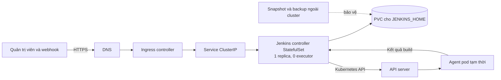

<Callout type="info" title="Phạm vi">
  Trang này triển khai **một Jenkins controller** bằng chart chính thức
  `jenkinsci/jenkins`. Build nên chạy trên agent động, không chạy trên controller.
  Các lệnh dùng release `jenkins` trong namespace `jenkins` để tên tài nguyên nhất quán.
</Callout>

## Mục lục

- [Kiến trúc và giới hạn](#kiến-trúc-và-giới-hạn)
  - [Vì sao chỉ có một controller](#vì-sao-chỉ-có-một-controller)
  - [Kiến trúc mục tiêu](#kiến-trúc-mục-tiêu)
- [Điều kiện tiên quyết](#điều-kiện-tiên-quyết)
- [Chuẩn bị namespace và Helm repository](#chuẩn-bị-namespace-và-helm-repository)
  - [Kiểm tra cluster và storage](#kiểm-tra-cluster-và-storage)
  - [Tạo namespace](#tạo-namespace)
  - [Thêm repository chính thức](#thêm-repository-chính-thức)
- [Chuẩn bị thông tin đăng nhập quản trị](#chuẩn-bị-thông-tin-đăng-nhập-quản-trị)
- [Tạo values an toàn](#tạo-values-an-toàn)
  - [Ý nghĩa các lựa chọn chính](#ý-nghĩa-các-lựa-chọn-chính)
- [Cài đặt hoặc cập nhật Jenkins](#cài-đặt-hoặc-cập-nhật-jenkins)
  - [Kiểm tra manifest trước khi áp dụng](#kiểm-tra-manifest-trước-khi-áp-dụng)
  - [Chạy Helm](#chạy-helm)
  - [Theo dõi controller](#theo-dõi-controller)
- [Truy cập Jenkins](#truy-cập-jenkins)
  - [Port-forward cho quản trị tạm thời](#port-forward-cho-quản-trị-tạm-thời)
  - [Ingress và TLS cho production](#ingress-và-tls-cho-production)
  - [Lấy credential theo chart hiện hành](#lấy-credential-theo-chart-hiện-hành)
- [Persistent volume và backup](#persistent-volume-và-backup)
  - [Dữ liệu cần bảo vệ](#dữ-liệu-cần-bảo-vệ)
  - [Quy trình backup nhất quán](#quy-trình-backup-nhất-quán)
  - [Kiểm thử khôi phục](#kiểm-thử-khôi-phục)
- [Nâng cấp và rollback](#nâng-cấp-và-rollback)
  - [Quy trình nâng cấp](#quy-trình-nâng-cấp)
  - [Rollback có giới hạn](#rollback-có-giới-hạn)
- [Agent Kubernetes](#agent-kubernetes)
- [Hardening cho production](#hardening-cho-production)
  - [RBAC](#rbac)
  - [NetworkPolicy](#networkpolicy)
  - [Secrets và JCasC](#secrets-và-jcasc)
  - [TLS và bề mặt truy cập](#tls-và-bề-mặt-truy-cập)
- [Troubleshooting](#troubleshooting)
- [Checklist production](#checklist-production)
- [Tài liệu tham khảo](#tài-liệu-tham-khảo)
- [Bước tiếp theo](#bước-tiếp-theo)

## Kiến trúc và giới hạn

### Vì sao chỉ có một controller

Jenkins controller giữ trạng thái trong `JENKINS_HOME`: cấu hình, job, build record,
plugin, credential đã mã hóa và khóa mã hóa. Chart chính thức triển khai controller
bằng `StatefulSet` và đặt `controller.replicas` tối đa là `1`.

Jenkins controller mã nguồn mở không trở thành active-active chỉ bằng cách tăng số
replica. Hai pod cùng ghi một `JENKINS_HOME` có thể làm hỏng dữ liệu. PVC
`ReadWriteOnce` cũng thường chỉ được gắn read-write vào một node tại một thời điểm.

<Callout type="warn" title="Kubernetes tự phục hồi, nhưng không tạo HA cho Jenkins">
  Khi pod hoặc node lỗi, Kubernetes có thể tạo lại **một** controller và gắn lại PVC.
  Trong thời gian reschedule, attach volume và Jenkins khởi động, dịch vụ vẫn gián
  đoạn. Nếu cần mở rộng quy mô tổ chức, hãy tách workload thành nhiều controller độc
  lập. Mỗi controller phải có URL, PVC, backup và vòng đời nâng cấp riêng.
</Callout>

Đặt `controller.numExecutors: 0` để controller không chạy build. Cách mở rộng đúng là
tạo agent theo nhu cầu, thay vì tăng executor hoặc replica của controller.

### Kiến trúc mục tiêu



Luồng production nên có các đặc điểm sau:

- Ingress chấm dứt TLS; Service của controller vẫn là `ClusterIP`.
- Controller có PVC riêng và không chứa workspace build dài hạn.
- Kubernetes plugin tạo agent pod tạm thời với request/limit rõ ràng.
- Backup nằm ngoài failure domain của cluster hoặc tài khoản lưu trữ hiện tại.

## Điều kiện tiên quyết

Chuẩn bị các thành phần sau trước khi triển khai:

- Một Kubernetes cluster đang được hỗ trợ và `kubectl` tương thích với API server.
- Kubeconfig trỏ đúng context; tài khoản có quyền tạo namespace, StatefulSet, Service,
  PVC, Secret, Role và RoleBinding.
- Helm 3 trở lên.
- Một `StorageClass` dùng CSI, hỗ trợ dynamic provisioning và đáp ứng topology của
  node. Với production, ưu tiên storage bền qua lỗi node, có snapshot và mở rộng volume.
- Dung lượng CPU/RAM cho controller và dung lượng storage cho `JENKINS_HOME`.
- Nếu dùng Ingress: một ingress controller đã hoạt động, một hostname DNS và một
  TLS Secret. Có thể dùng cert-manager, nhưng issuer phải do đội vận hành cung cấp.
- Kết nối egress cần thiết đến registry image, Jenkins Update Center, SCM, identity
  provider và các dịch vụ mà pipeline sử dụng.

```bash
kubectl version
kubectl config current-context
kubectl cluster-info
helm version
```

<Callout type="error" title="Xác nhận context trước khi chạy">
  Không tiếp tục nếu `kubectl config current-context` không phải cluster đích. Sai
  context có thể tạo Secret hoặc Jenkins công khai ở nhầm môi trường.
</Callout>

## Chuẩn bị namespace và Helm repository

### Kiểm tra cluster và storage

Liệt kê node và các StorageClass. Cột mặc định trong kết quả giúp xác định class được
dùng khi PVC không chỉ định `storageClassName`.

```bash
kubectl get nodes -o wide
kubectl get storageclass
kubectl get ingressclass
```

Kiểm tra với đội platform các thuộc tính không thể suy ra chỉ từ tên class:

- `reclaimPolicy` là `Retain` hay `Delete`;
- `allowVolumeExpansion` có bật hay không;
- CSI driver có hỗ trợ `VolumeSnapshot` hay không;
- volume có bị giới hạn theo zone và có mã hóa at-rest hay không;
- RPO, RTO và chính sách giữ backup thực tế.

### Tạo namespace

```bash
kubectl create namespace jenkins \
  --dry-run=client -o yaml | kubectl apply -f -
```

Namespace giúp giới hạn RBAC, quota và NetworkPolicy. Không đặt Jenkins vào `default`.
Nếu cluster áp dụng Pod Security Admission, hãy xác nhận policy của namespace tương
thích với security context UID/GID `1000` của image Jenkins chính thức.

### Thêm repository chính thức

Alias repository là tùy chọn; tài liệu này dùng `jenkinsci`. URL và tên chart bên
dưới là của dự án Jenkins.

```bash
helm repo add jenkinsci https://charts.jenkins.io --force-update
helm repo update
helm search repo jenkinsci/jenkins --versions
```

Không tự động chọn bản mới nhất trong production. Chọn một chart version đã đọc
changelog, kiểm thử và ghi lại trong Git:

```bash
export CHART_VERSION="5.9.45"
helm show chart jenkinsci/jenkins --version "$CHART_VERSION"
helm show values jenkinsci/jenkins --version "$CHART_VERSION" > values-upstream.yaml
```

<Callout type="info" title="Pin version">
  Mẫu trên được đối chiếu với chart `5.9.45`, sử dụng các key hiện hành như
  `controller.image.repository`, `controller.admin.existingSecret` và
  `persistence.storageClass`. Khi chọn version khác, hãy kiểm tra `VALUES.md`,
  `CHANGELOG.md` và `UPGRADING.md` của chính version đó trước khi áp dụng.
</Callout>

`values-upstream.yaml` chỉ dùng để tra cứu hoặc diff. Không nên sao chép toàn bộ giá
trị mặc định vào values của tổ chức, vì việc đó làm các lần nâng cấp khó review.

## Chuẩn bị thông tin đăng nhập quản trị

Không ghi password trực tiếp vào `values-jenkins.yaml`, tham số `--set` hoặc Git.
Tạo Secret trước và để chart tham chiếu tới Secret đó. Hai key dưới đây là tên mặc
định hiện hành của chart.

```bash
read -rsp "Jenkins bootstrap admin password: " JENKINS_ADMIN_PASSWORD
echo

kubectl -n jenkins create secret generic jenkins-admin \
  --from-literal=jenkins-admin-user=admin \
  --from-literal=jenkins-admin-password="$JENKINS_ADMIN_PASSWORD" \
  --dry-run=client -o yaml | kubectl apply -f -

unset JENKINS_ADMIN_PASSWORD
```

Trong production, Secret này nên được đồng bộ từ secret manager bằng cơ chế được tổ
chức phê duyệt. Tài khoản local chỉ là bootstrap hoặc break-glass. Sau khi đăng nhập,
cấu hình OIDC, SAML hoặc LDAP và authorization theo least privilege bằng JCasC.

## Tạo values an toàn

Tạo `values-jenkins.yaml` trong repository hạ tầng riêng. Thay
`<storage-class-production>` bằng tên đã xác minh ở bước trước.

```yaml
controller:
  replicas: 1
  numExecutors: 0
  serviceType: ClusterIP
  agentListenerServiceType: ClusterIP
  terminationGracePeriodSeconds: 120

  admin:
    createSecret: true
    existingSecret: jenkins-admin
    userKey: jenkins-admin-user
    passwordKey: jenkins-admin-password

  resources:
    requests:
      cpu: "500m"
      memory: "1Gi"
    limits:
      cpu: "2"
      memory: "4Gi"

  podSecurityContextOverride:
    runAsNonRoot: true
    runAsUser: 1000
    fsGroup: 1000
    fsGroupChangePolicy: OnRootMismatch

  installLatestPlugins: false
  installLatestSpecifiedPlugins: false

  JCasC:
    defaultConfig: true
    configScripts:
      system-message: |
        jenkins:
          systemMessage: "Jenkins được quản lý bằng Helm và JCasC."

  ingress:
    enabled: false

persistence:
  enabled: true
  storageClass: "<storage-class-production>"
  accessMode: ReadWriteOnce
  size: "50Gi"

rbac:
  create: true
  readSecrets: false

serviceAccount:
  create: true

serviceAccountAgent:
  create: true

networkPolicy:
  enabled: true
  internalAgents:
    allowed: true

agent:
  enabled: true
  namespace: jenkins
  podRetention: Never
  restrictedPssSecurityContext: true
  resources:
    requests:
      cpu: "250m"
      memory: "512Mi"
    limits:
      cpu: "1"
      memory: "1Gi"
```

### Ý nghĩa các lựa chọn chính

| Giá trị | Lý do |
| --- | --- |
| `controller.replicas: 1` | Tôn trọng giới hạn một controller stateful của chart. |
| `controller.numExecutors: 0` | Không chạy code build không tin cậy trên controller. |
| `controller.admin.existingSecret` | Tách secret khỏi Helm values và Git. |
| `controller.serviceType: ClusterIP` | Không mở trực tiếp NodePort hoặc LoadBalancer ra Internet. |
| `persistence.enabled: true` | Giữ `JENKINS_HOME` khi pod được tạo lại. |
| `persistence.accessMode: ReadWriteOnce` | Phù hợp với một controller ghi dữ liệu. |
| `rbac.readSecrets: false` | Controller không được đọc toàn bộ Secret trong namespace nếu chưa có nhu cầu. |
| `serviceAccountAgent.create: true` | Agent dùng danh tính riêng, không kế thừa Role tạo/xóa pod của controller. |
| `networkPolicy.enabled: true` | Tạo policy của chart cho controller và agent; vẫn cần review giới hạn của policy. |
| `installLatestPlugins: false` | Tránh tự lấy dependency plugin mới nhất không qua kiểm thử. |

Với chart hiện hành, giữ `controller.admin.createSecret: true` để chart project các key
admin vào pod. Khi `controller.admin.existingSecret` có giá trị, chart dùng Secret có
sẵn và không tạo Secret mới.

Request/limit chỉ là điểm khởi đầu. Theo dõi GC pause, heap, CPU throttling, số job và
thời gian queue để điều chỉnh. Limit RAM phải chừa chỗ cho JVM, native memory và sidecar;
không đặt `-Xmx` bằng toàn bộ memory limit.

<Callout type="idea" title="Image bất biến cho production">
  Chart có thể cài plugin lúc pod khởi động, nhưng cách lặp lại tốt hơn là xây image
  controller riêng từ `jenkins/jenkins`, pin tag Jenkins và pin từng plugin bằng
  `jenkins-plugin-cli`. Sau đó đặt `controller.image.registry`,
  `controller.image.repository`, `controller.image.tag` và tắt `installPlugins` chỉ
  khi image đã chứa đủ plugin mà chart/JCasC cần.
</Callout>

## Cài đặt hoặc cập nhật Jenkins

### Kiểm tra manifest trước khi áp dụng

Kiểm tra YAML render được và để API server xác thực schema. Không lưu output render
vào nơi công khai, vì chart có thể chứa Secret.

```bash
helm template jenkins jenkinsci/jenkins \
  --namespace jenkins \
  --version "$CHART_VERSION" \
  --values values-jenkins.yaml \
  | kubectl apply --dry-run=server -f -
```

Kiểm tra riêng các giá trị cuối cùng nếu dùng nhiều file override:

```bash
helm template jenkins jenkinsci/jenkins \
  --namespace jenkins \
  --version "$CHART_VERSION" \
  --values values-jenkins.yaml > /tmp/jenkins-rendered.yaml
```

Xóa file tạm sau khi review nếu môi trường render Secret vào manifest.

### Chạy Helm

`upgrade --install` cho cùng một lệnh ở lần cài đầu và các lần cập nhật sau:

```bash
helm upgrade --install jenkins jenkinsci/jenkins \
  --namespace jenkins \
  --create-namespace \
  --version "$CHART_VERSION" \
  --values values-jenkins.yaml \
  --wait \
  --timeout 15m
```

Không dùng `--reuse-values` như thói quen. Key cũ có thể tồn tại qua lần nâng cấp và
che giá trị mặc định mới. Hãy giữ values mong muốn trong Git rồi truyền lại đầy đủ.

### Theo dõi controller

Chart tạo `StatefulSet/jenkins`, pod `jenkins-0`, PVC và các Service trong namespace.
Pod có thể mất vài phút để init container tải hoặc kiểm tra plugin.

```bash
helm status jenkins -n jenkins
kubectl rollout status statefulset/jenkins -n jenkins --timeout=15m
kubectl get pod,pvc,service -n jenkins
kubectl describe pod jenkins-0 -n jenkins
kubectl logs -n jenkins pod/jenkins-0 -c init
kubectl logs -n jenkins pod/jenkins-0 -c jenkins --follow
```

Trạng thái mong đợi là PVC `Bound`, pod `Running` và tất cả container `Ready`.
Chart bật sidecar JCasC auto-reload theo mặc định, vì vậy pod thường có nhiều hơn một
container.

## Truy cập Jenkins

### Port-forward cho quản trị tạm thời

Cách này không cần Ingress và chỉ lắng nghe trên máy chạy `kubectl`:

```bash
kubectl -n jenkins port-forward svc/jenkins 8080:8080
```

Mở [http://127.0.0.1:8080](http://127.0.0.1:8080). Dừng tiến trình port-forward sau
khi hoàn tất.

### Ingress và TLS cho production

Giữ Service là `ClusterIP`. Tạo `values-ingress.yaml` và thay các placeholder theo
cluster:

```yaml
controller:
  ingress:
    enabled: true
    ingressClassName: "<ingress-class>"
    hostName: "jenkins.example.com"
    path: "/"
    pathType: Prefix
    annotations: {}
    tls:
      - secretName: jenkins-tls
        hosts:
          - jenkins.example.com
```

`jenkins-tls` phải tồn tại trong namespace `jenkins`, hoặc phải được cert-manager tạo
từ annotation/Certificate do đội platform quản lý. Không thêm annotation issuer mẫu
nếu chưa xác minh tên issuer thật.

Trỏ bản ghi DNS `jenkins.example.com` đến địa chỉ của ingress controller, rồi cập
nhật release với cả hai file values:

```bash
helm upgrade --install jenkins jenkinsci/jenkins \
  --namespace jenkins \
  --version "$CHART_VERSION" \
  --values values-jenkins.yaml \
  --values values-ingress.yaml \
  --wait \
  --timeout 15m

kubectl get ingress -n jenkins
curl --fail --head https://jenkins.example.com/login
```

Khi `controller.ingress.hostName` và `tls` được cấu hình, chart dùng hostname HTTPS
đó làm Jenkins URL. Nếu TLS kết thúc ở một proxy ngoài Ingress của chart, đặt
`controller.jenkinsUrl` rõ ràng và kiểm tra forwarded headers.

### Lấy credential theo chart hiện hành

Chart hiện hành mount username/password quản trị vào
`/run/secrets/additional/chart-admin-*`. Với release và Service tên `jenkins`:

```bash
kubectl exec --namespace jenkins svc/jenkins -c jenkins -- \
  cat /run/secrets/additional/chart-admin-username

echo

kubectl exec --namespace jenkins svc/jenkins -c jenkins -- \
  cat /run/secrets/additional/chart-admin-password

echo
```

Vì hướng dẫn này dùng existing Secret, cũng có thể đọc trực tiếp key đã tạo:

```bash
kubectl get secret jenkins-admin -n jenkins \
  -o jsonpath='{.data.jenkins-admin-password}' | base64 --decode
echo
```

Giới hạn quyền chạy các lệnh trên. Base64 chỉ là mã hóa biểu diễn, không phải mã hóa
bảo mật. Không dán credential vào ticket, chat hoặc log CI.

## Persistent volume và backup

### Dữ liệu cần bảo vệ

PVC mount tại `/var/jenkins_home`. Đây là dữ liệu stateful quan trọng nhất, nhưng một
snapshot PVC chưa phải toàn bộ kế hoạch khôi phục. Cần lưu cùng nhau:

- snapshot hoặc backup nhất quán của PVC;
- `values-jenkins.yaml`, values Ingress và chart version;
- digest/tag của image controller và danh sách plugin đã pin;
- JCasC, Job DSL và cấu hình pipeline trong Git;
- Secret bootstrap, credential từ secret manager và khóa mã hóa Jenkins;
- thông tin DNS, TLS, RBAC và NetworkPolicy cần để dựng lại dịch vụ.

<Callout type="error" title="Không dùng PVC như backup duy nhất">
  Xóa Helm release có thể xóa PVC do chart quản lý. Nếu StorageClass dùng
  `reclaimPolicy: Delete`, volume backend cũng có thể bị xóa theo. Snapshot trong cùng
  cluster hoặc cùng tài khoản vẫn có chung failure domain. Luôn có bản sao ngoài
  cluster với retention và quyền xóa độc lập.
</Callout>

### Quy trình backup nhất quán

VolumeSnapshot chỉ hoạt động khi cluster đã cài snapshot CRD/controller và CSI driver
hỗ trợ snapshot. Snapshot online thường chỉ crash-consistent. Để có điểm khôi phục rõ
ràng, dừng ghi trước khi chụp.

<Steps>
<Step>

#### Đưa Jenkins vào chế độ bảo trì

Bật **Manage Jenkins → Prepare for Shutdown** (quiet down), ngừng trigger mới và chờ
build đang chạy kết thúc. Xác nhận queue trống trước khi tiếp tục.

</Step>
<Step>

#### Dừng controller

```bash
kubectl scale statefulset/jenkins -n jenkins --replicas=0
kubectl wait --for=delete pod/jenkins-0 -n jenkins --timeout=10m
kubectl get pvc -n jenkins
```

Lệnh scale không thay đổi values trong Git; sau backup phải scale lại về `1`.

</Step>
<Step>

#### Tạo snapshot hoặc chạy công cụ backup của storage provider

Thay `<snapshot-class>` bằng `VolumeSnapshotClass` đã xác minh. Với release `jenkins`,
PVC mặc định cũng có tên `jenkins`.

```yaml
apiVersion: snapshot.storage.k8s.io/v1
kind: VolumeSnapshot
metadata:
  name: jenkins-home-20260301-1200
  namespace: jenkins
spec:
  volumeSnapshotClassName: "<snapshot-class>"
  source:
    persistentVolumeClaimName: jenkins
```

```bash
kubectl apply -f jenkins-snapshot.yaml
kubectl get volumesnapshot -n jenkins
```

Chỉ coi bước này thành công khi `readyToUse` là `true`. Sau đó sao chép backup sang
failure domain khác theo khả năng của storage provider.

</Step>
<Step>

#### Khởi động lại và thoát quiet down

```bash
kubectl scale statefulset/jenkins -n jenkins --replicas=1
kubectl rollout status statefulset/jenkins -n jenkins --timeout=15m
```

Đăng nhập, hủy chế độ quiet down và chạy một job smoke test.

</Step>
</Steps>

### Kiểm thử khôi phục

Backup chưa được restore-test chỉ là giả định. Theo lịch, tạo PVC mới từ snapshot hoặc
bản backup, rồi triển khai một release khác trong namespace cô lập với hostname không
production. Đặt `persistence.existingClaim` trỏ tới PVC đã khôi phục.

Không cho bản restore gửi webhook, email hoặc deploy thật. Xác minh Jenkins khởi động,
job/config/credential cần thiết tồn tại và một pipeline smoke test chạy được. Ghi lại
RPO thực tế (mất tối đa bao nhiêu dữ liệu) và RTO thực tế (mất bao lâu để phục hồi).

## Nâng cấp và rollback

### Quy trình nâng cấp

Nâng cấp chart có thể đồng thời thay đổi Jenkins core, plugin mặc định, sidecar và
manifest Kubernetes. Không nâng cấp trực tiếp production chỉ vì repository có version
mới.

<Steps>
<Step>

#### Chọn và review version

```bash
helm repo update
helm search repo jenkinsci/jenkins --versions
helm get values jenkins -n jenkins -o yaml > jenkins-values-before-upgrade.yaml
helm history jenkins -n jenkins
```

Đọc `CHANGELOG.md`, `UPGRADING.md`, Jenkins LTS upgrade guide và yêu cầu Java/plugin
cho tất cả version nằm giữa bản hiện tại và bản đích.

</Step>
<Step>

#### Backup và thử ở môi trường tách biệt

Tạo backup nhất quán theo quy trình trên. Restore bản backup vào staging, chạy startup,
đăng nhập, JCasC reload và các pipeline smoke test. Với major chart version, kiểm tra
các key values bị đổi hoặc xóa.

</Step>
<Step>

#### Render rồi nâng cấp production

```bash
export CHART_VERSION="<chart-version-da-kiem-thu>"

helm template jenkins jenkinsci/jenkins \
  --namespace jenkins \
  --version "$CHART_VERSION" \
  --values values-jenkins.yaml \
  --values values-ingress.yaml \
  | kubectl apply --dry-run=server -f -

helm upgrade jenkins jenkinsci/jenkins \
  --namespace jenkins \
  --version "$CHART_VERSION" \
  --values values-jenkins.yaml \
  --values values-ingress.yaml \
  --wait \
  --timeout 15m
```

Nếu không dùng Ingress, bỏ `--values values-ingress.yaml` ở cả hai lệnh.

</Step>
<Step>

#### Xác minh sau nâng cấp

```bash
helm status jenkins -n jenkins
kubectl rollout status statefulset/jenkins -n jenkins --timeout=15m
kubectl logs pod/jenkins-0 -n jenkins -c init
kubectl logs pod/jenkins-0 -n jenkins -c jenkins --since=15m
```

Kiểm tra login, JCasC, plugin, agent provisioning, queue, webhook và pipeline smoke test
trước khi kết thúc cửa sổ bảo trì.

</Step>
</Steps>

### Rollback có giới hạn

Xem revision rồi rollback manifest Helm:

```bash
helm history jenkins -n jenkins
helm rollback jenkins <revision-tot> \
  --namespace jenkins \
  --wait \
  --timeout 15m
```

Helm rollback **không** hoàn tác nội dung PVC. Nếu Jenkins mới đã migrate dữ liệu hoặc
plugin mới đã ghi cấu hình, chạy image/core cũ trên PVC mới có thể không tương thích.
Khi đó quy trình đúng là dừng controller, khôi phục PVC từ snapshot trước nâng cấp,
khôi phục đúng image/plugin/JCasC rồi mới mở traffic. Không thử hạ core nhiều lần trên
PVC production để dò lỗi.

## Agent Kubernetes

Chart cài Kubernetes plugin và tạo RBAC namespaced để controller có thể tạo agent pod.
Mẫu values tạo `serviceAccountAgent` riêng; agent mặc định không dùng danh tính có Role
lập lịch pod của controller. Đây mới là nền tảng:

- Dùng pod template riêng cho từng loại build và pin image theo digest hoặc tag bất biến.
- Đặt request/limit, timeout, `containerCap` và quota để một nhóm không chiếm toàn cluster.
- Dùng workspace tạm thời nếu build có thể tái tạo. Chỉ cấp PVC khi thật sự cần cache bền.
- Không mount Docker socket của node. Nếu cần build image, chọn cơ chế rootless hoặc
  builder được platform phê duyệt.
- Tách ServiceAccount của agent khỏi controller khi pipeline cần quyền Kubernetes.
  Mỗi agent chỉ nhận quyền đúng namespace và thao tác cần thiết.
- Không đưa secret hàng loạt vào environment hoặc raw pod YAML có thể xuất hiện trong
  console log.

Xem hướng dẫn chuyên sâu tại [Kubernetes Ephemeral Agents](/docs/agents/kubernetes-agents)
và mô hình phân tán tại [Tổng quan Jenkins Agent](/docs/agents/overview).

## Hardening cho production

### RBAC

Giữ `rbac.create: true` và `rbac.readSecrets: false` nếu không dùng Kubernetes
Credentials Provider. Chart tạo `Role`/`RoleBinding` namespaced để controller quản lý
agent pod; không cấp `cluster-admin` cho controller. `serviceAccountAgent.create: true`
tạo danh tính riêng cho pod build mà không gắn Role đó. Nếu agent chạy ở namespace khác,
tạo quyền cụ thể trong namespace đó và review manifest render trước khi áp dụng.

Kiểm tra quyền thực tế bằng `kubectl auth can-i`:

```bash
kubectl auth can-i create pods \
  --as=system:serviceaccount:jenkins:jenkins \
  --namespace=jenkins

kubectl auth can-i list secrets \
  --as=system:serviceaccount:jenkins:jenkins \
  --namespace=jenkins
```

Tên ServiceAccount có thể thay đổi nếu override tên release; kiểm tra bằng
`kubectl get serviceaccount -n jenkins`.

### NetworkPolicy

`networkPolicy.enabled: true` của chart tạo policy ingress cho controller và agent.
Policy hiện hành cho phép truy cập cổng web của controller mà không giới hạn `from`,
đồng thời giới hạn cổng agent theo label. Nó không phải firewall hoàn chỉnh và không
khai báo egress.

CNI phải hỗ trợ NetworkPolicy; nếu không, object tồn tại nhưng không được enforce. Khi
bổ sung default-deny hoặc egress policy của tổ chức, phải allow tối thiểu DNS,
Kubernetes API, controller-agent, SCM, registry, update center và identity provider.
Kiểm thử cả webhook lẫn agent sau mỗi thay đổi policy.

### Secrets và JCasC

- Bật mã hóa Secret at-rest trong cluster và giới hạn quyền `get/list/watch`.
- Đồng bộ Secret từ secret manager; không commit giá trị bí mật vào values hoặc JCasC.
- Dùng `controller.additionalExistingSecrets` cho secret JCasC thay vì
  `controller.additionalSecrets`, vì giá trị latter sẽ đi qua Helm release metadata.
- Quản lý security realm, authorization, URL, credential reference và cấu hình hệ thống
  bằng JCasC có review.
- Không bật script approval diện rộng để xử lý nhanh lỗi pipeline.
- Pin Jenkins core và plugin trong image bất biến khi yêu cầu tính lặp lại cao.

### TLS và bề mặt truy cập

Chỉ công bố cổng HTTPS qua Ingress. Giữ cổng agent `50000` ở `ClusterIP`; với agent bên
ngoài cluster, ưu tiên WebSocket qua HTTPS hoặc allowlist mạng cụ thể thay vì public
LoadBalancer. Bật HSTS và chính sách TLS ở ingress controller theo chuẩn tổ chức.

Giới hạn truy cập giao diện quản trị bằng SSO, MFA ở identity provider, IP allowlist
hoặc VPN khi phù hợp. Đảm bảo reverse proxy truyền đúng host/protocol để Jenkins không
sinh redirect HTTP hoặc URL webhook sai.

## Troubleshooting

<Accordions type="single">
  <Accordion title="PVC ở trạng thái Pending">
    Bắt đầu từ event, không xóa PVC ngay:

    ```bash
    kubectl get pvc,pv -n jenkins
    kubectl describe pvc jenkins -n jenkins
    kubectl get events -n jenkins --sort-by=.lastTimestamp
    kubectl get storageclass <storage-class-production> -o yaml
    ```

    Kiểm tra tên StorageClass, default provisioner, quota, capacity, CSI controller và
    topology/zone. Với `volumeBindingMode: WaitForFirstConsumer`, PVC có thể chờ scheduler
    chọn node; event sẽ chỉ ra node affinity hoặc zone không thỏa. Nếu volume `ReadWriteOnce`
    còn attach ở node cũ, xử lý detach theo hướng dẫn của CSI provider thay vì force xóa
    object không rõ trạng thái.
  </Accordion>

  <Accordion title="Controller CrashLoopBackOff">
    Tách log init container, controller hiện tại và lần chạy trước:

    ```bash
    kubectl describe pod jenkins-0 -n jenkins
    kubectl logs pod/jenkins-0 -n jenkins -c init
    kubectl logs pod/jenkins-0 -n jenkins -c jenkins
    kubectl logs pod/jenkins-0 -n jenkins -c jenkins --previous
    kubectl get pod jenkins-0 -n jenkins \
      -o jsonpath='{.status.containerStatuses[*].lastState.terminated.reason}'
    ```

    `OOMKilled` yêu cầu review heap và memory limit. `Permission denied` tại
    `/var/jenkins_home` thường liên quan UID/GID `1000`, `fsGroup` hoặc storage driver.
    Lỗi trước khi container Jenkins chạy thường nằm trong init container: registry,
    update center, CA/proxy hoặc tải plugin. Lỗi ngay sau sửa JCasC cần được kiểm tra bằng
    cách render lại YAML và đọc stack trace, không xóa toàn bộ `JENKINS_HOME`.
  </Accordion>

  <Accordion title="Plugin không tương thích sau nâng cấp">
    Ghi lại Jenkins core, chart version và plugin version từ log/UI. So sánh với plugin
    dependency và Jenkins LTS upgrade guide. Khôi phục image/plugin set đã kiểm thử cùng
    snapshot PVC trước nâng cấp nếu Jenkins không thể khởi động.

    Không bật `installLatestPlugins` để thử ngẫu nhiên trên production. Về lâu dài, xây
    image bất biến có plugin pin version, chạy `jenkins-plugin-cli` trong CI của image và
    thử restore/nâng cấp trên staging trước.
  </Accordion>

  <Accordion title="Ingress trả lỗi hoặc redirect sai">
    Kiểm tra DNS, TLS Secret, ingress class, Service endpoint và Jenkins URL:

    ```bash
    kubectl describe ingress jenkins -n jenkins
    kubectl get service,endpoints -n jenkins
    kubectl get secret jenkins-tls -n jenkins
    kubectl logs pod/jenkins-0 -n jenkins -c jenkins --since=10m
    ```

    Nếu port-forward hoạt động nhưng Ingress không hoạt động, lỗi thường nằm ở DNS,
    ingress controller, certificate hoặc policy mạng. Nếu redirect về HTTP/hostname nội
    bộ, kiểm tra forwarded headers và `controller.jenkinsUrl`.
  </Accordion>
</Accordions>

## Checklist production

- [ ] Chart version, Jenkins image và plugin version đã được pin và kiểm thử.
- [ ] Chỉ có một controller; `numExecutors` bằng `0`.
- [ ] PVC `Bound`, storage bền qua lỗi node, dung lượng và expansion đã được xác nhận.
- [ ] Backup ngoài cluster có retention; restore test đã đo RPO/RTO.
- [ ] Service là `ClusterIP`; Ingress dùng DNS và TLS hợp lệ.
- [ ] Admin bootstrap Secret không nằm trong Git; SSO và authorization đã cấu hình.
- [ ] Controller không có `cluster-admin`; quyền đọc Secret mặc định bị tắt.
- [ ] NetworkPolicy được CNI enforce và đã test DNS/API/SCM/agent/webhook.
- [ ] Agent dùng image tin cậy, request/limit, quota và ServiceAccount tối thiểu.
- [ ] Có runbook quiet down, nâng cấp, rollback và khôi phục PVC.
- [ ] Có giám sát pod restart, PVC usage, queue, executor, JVM và lỗi plugin.

## Tài liệu tham khảo

- [Jenkins: Installing Jenkins on Kubernetes](https://www.jenkins.io/doc/book/installing/kubernetes/)
- [Official Jenkins Helm chart](https://github.com/jenkinsci/helm-charts/tree/main/charts/jenkins)
- [Jenkins Helm chart values](https://github.com/jenkinsci/helm-charts/blob/main/charts/jenkins/VALUES.md)
- [Jenkins Helm chart upgrade notes](https://github.com/jenkinsci/helm-charts/blob/main/charts/jenkins/UPGRADING.md)
- [Jenkins Configuration as Code](https://www.jenkins.io/projects/jcasc/)
- [Jenkins Kubernetes plugin](https://plugins.jenkins.io/kubernetes/)
- [Kubernetes StorageClass](https://kubernetes.io/docs/concepts/storage/storage-classes/)
- [Kubernetes VolumeSnapshot](https://kubernetes.io/docs/concepts/storage/volume-snapshots/)
- [Kubernetes NetworkPolicy](https://kubernetes.io/docs/concepts/services-networking/network-policies/)
- [Helm upgrade](https://helm.sh/docs/helm/helm_upgrade/)
- [Helm rollback](https://helm.sh/docs/helm/helm_rollback/)

## Bước tiếp theo

<Cards>
  <Card
    title="Kubernetes Ephemeral Agents"
    href="/docs/agents/kubernetes-agents"
    description="Thiết kế pod template và agent tạo theo nhu cầu."
  />
  <Card
    title="Reverse Proxy & TLS"
    href="/docs/installation/reverse-proxy-tls"
    description="Kiểm tra forwarded headers, WebSocket và TLS termination."
  />
  <Card
    title="Nâng cấp Jenkins"
    href="/docs/installation/upgrade"
    description="Lập kế hoạch nâng cấp Jenkins core và plugin."
  />
</Cards>
