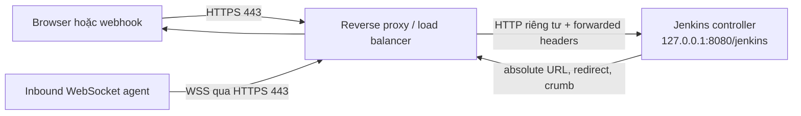

<Callout type="info" title="Phạm vi và giả định">
  Hướng dẫn này đặt Jenkins controller sau một reverse proxy hoặc load balancer do đội vận hành quản lý. Ví dụ dùng Nginx, controller chỉ nghe trên mạng riêng hoặc loopback, và URL public là `https://jenkins.example.com/jenkins/`. Hãy thay hostname, CA và đường dẫn certificate theo môi trường của bạn; không chép private key, token hoặc dữ liệu `JENKINS_HOME` vào repository.
</Callout>

Reverse proxy là điểm duy nhất người dùng, webhook và WebSocket agent đi vào. Vì vậy URL public, context path, header do proxy tạo và cấu hình Jenkins phải mô tả **cùng một địa chỉ**. Chỉ cần một lớp cho rằng Jenkins là `http://...:8080/` trong khi lớp khác dùng HTTPS dưới `/jenkins/` cũng có thể làm hỏng redirect, cookie, CSRF crumb hoặc agent.

## Mục lục

- [Mô hình và phạm vi](#mô-hình-và-phạm-vi)
  - [Luồng yêu cầu](#luồng-yêu-cầu)
- [URL public, context path và Jenkins URL](#url-public-context-path-và-jenkins-url)
  - [Một URL, một dấu gạch chéo cuối](#một-url-một-dấu-gạch-chéo-cuối)
  - [URL public không phải listen address](#url-public-không-phải-listen-address)
- [Forwarded headers và ranh giới tin cậy](#forwarded-headers-và-ranh-giới-tin-cậy)
  - [Header cần truyền](#header-cần-truyền)
  - [Không tin header do client tự gửi](#không-tin-header-do-client-tự-gửi)
- [TLS termination và chính sách HTTPS](#tls-termination-và-chính-sách-https)
  - [Certificate, key và redirect](#certificate-key-và-redirect)
  - [HSTS và TLS policy](#hsts-và-tls-policy)
- [Cấu hình Nginx mẫu](#cấu-hình-nginx-mẫu)
  - [Giá trị cần thay](#giá-trị-cần-thay)
- [WebSocket cho inbound agent](#websocket-cho-inbound-agent)
  - [WebSocket không phải inbound TCP](#websocket-không-phải-inbound-tcp)
  - [Yêu cầu proxy và phiên bản](#yêu-cầu-proxy-và-phiên-bản)
- [Lab local theo từng bước](#lab-local-theo-từng-bước)
  - [Chuẩn bị an toàn](#chuẩn-bị-an-toàn)
  - [Cấu hình và kiểm tra](#cấu-hình-và-kiểm-tra)
  - [Kết quả mong đợi](#kết-quả-mong-đợi)
- [Troubleshooting](#troubleshooting)
- [Checklist đưa vào vận hành](#checklist-đưa-vào-vận-hành)
- [Nguồn Jenkins chính thức](#nguồn-jenkins-chính-thức)
- [Đọc tiếp](#đọc-tiếp)

## Mô hình và phạm vi

Reverse proxy kết thúc kết nối TLS của browser hoặc agent, rồi chuyển HTTP nội bộ đến controller. TLS ở đoạn nội bộ có thể vẫn cần khi proxy và controller đi qua mạng không đủ tin cậy; ví dụ Nginx bên dưới chỉ dùng HTTP vì upstream bị giới hạn ở `127.0.0.1:8080`.

### Luồng yêu cầu



Điểm mấu chốt của sơ đồ là controller không suy ra được HTTPS chỉ từ kết nối HTTP nội bộ. Proxy phải khẳng định URL public bằng header đáng tin cậy, còn Jenkins phải được cấu hình với URL public đó.

<Callout type="warn" title="Không công khai upstream">
  Không publish trực tiếp `8080` ra Internet để “dự phòng”. Bind controller vào loopback, private subnet hoặc network riêng của cluster; firewall/security group chỉ cho phép proxy đã định danh kết nối. Khi truy cập thẳng được controller, client có thể bỏ qua TLS, host validation và policy ở edge.
</Callout>

## URL public, context path và Jenkins URL

Ví dụ xuyên suốt dùng URL canonical sau:

```text
https://jenkins.example.com/jenkins/
```

**Context path** là phần `/jenkins` sau hostname. Nó phải có ở ba nơi:

1. controller khởi động với prefix/context path `/jenkins`, chẳng hạn option `--prefix=/jenkins`;
2. location của proxy nhận `/jenkins/` và chuyển nguyên prefix đó tới controller;
3. **Manage Jenkins → System → Jenkins Location → Jenkins URL** đặt chính xác `https://jenkins.example.com/jenkins/`.

Cách đặt option khởi động phụ thuộc phương thức cài đặt. Với Docker/Compose, thêm `JENKINS_OPTS=--prefix=/jenkins` vào service Jenkins, đồng thời giữ các option hiện có. Với package Linux, dùng systemd drop-in theo hướng dẫn [Cài Jenkins trên Linux](/docs/installation/linux), không sửa vendor unit. Với Kubernetes, đưa option vào args của workload controller. Restart hoặc rollout chỉ thực hiện trong change window sau khi đã có cấu hình proxy và rollback plan.

### Một URL, một dấu gạch chéo cuối

`Jenkins URL` nên kết thúc bằng `/`: `https://jenkins.example.com/jenkins/`. Dấu gạch chéo phân biệt base URL với một tài nguyên tên `jenkins`, đồng thời giúp Jenkins tạo relative link, redirect và callback nhất quán.

Proxy nên redirect duy nhất `/jenkins` sang `/jenkins/`, rồi chỉ phục vụ nội dung bên dưới `/jenkins/`. Không vừa cho Jenkins chạy ở root vừa rewrite tùy tiện vào `/jenkins`: HTML, static asset, webhook callback và redirect có thể trỏ về hai namespace khác nhau. Mọi URL đã khai báo cho SCM webhook, OAuth/SAML callback, plugin integration và bookmark người dùng cũng phải dùng URL canonical có trailing slash này.

### URL public không phải listen address

**Jenkins URL** trả lời câu hỏi “người dùng và hệ thống bên ngoài gọi Jenkins bằng địa chỉ nào?”. Nó là URL HTTPS public/corporate mà Jenkins đưa vào absolute link, redirect, webhook callback và một số kiểm tra origin.

**Listen address** trả lời câu hỏi “process Jenkins chấp nhận TCP ở interface nào?”. Ví dụ `127.0.0.1:8080` chỉ là upstream nội bộ; nó không được đặt vào Jenkins URL. Không đặt `http://127.0.0.1:8080/jenkins/` hoặc hostname pod/container làm Jenkins URL khi người dùng thực tế dùng HTTPS ở hostname khác.

Sự khác biệt này đặc biệt quan trọng với webhook và redirect. Một webhook provider phải gọi URL public; browser phải nhận `Location` trỏ về URL public; controller chỉ nghe address riêng. Nếu có nhiều load balancer, vẫn chọn **một** hostname canonical, rồi redirect hostname phụ sang hostname đó ở edge.

## Forwarded headers và ranh giới tin cậy

Kết nối giữa Nginx và controller trong ví dụ là HTTP. Các header forwarded cho Jenkins biết request gốc đã đến bằng `https`, hostname nào và port public nào. Thiếu chúng thường tạo redirect `http://`, cookie không có cờ `Secure`, link sai cổng hoặc lỗi kiểm tra origin.

### Header cần truyền

Proxy cần **ghi đè** các giá trị sau khi chuyển request đến Jenkins:

| Header | Giá trị trong ví dụ | Tác dụng |
| --- | --- | --- |
| `Host` | `jenkins.example.com` | Host mà upstream nhận; không dùng host tùy ý do client chọn. |
| `X-Forwarded-Proto` | `https` | Scheme public ban đầu. |
| `X-Forwarded-Host` | `jenkins.example.com` | Host public canonical. |
| `X-Forwarded-Port` | `443` | Port public khi proxy-to-controller dùng HTTP. |
| `X-Forwarded-For` | IP đã được edge xác minh | Dấu vết client; không dùng làm authorization nếu chưa có trust policy. |

`Forwarded` là header chuẩn hóa thay cho nhóm `X-Forwarded-*`. Một giá trị tương đương về ngữ nghĩa có dạng:

```http
Forwarded: for=203.0.113.44;proto=https;host=jenkins.example.com
```

Chọn một quy ước đã được controller, plugin và load balancer của bạn kiểm thử. Cấu hình Nginx bên dưới dùng nhóm `X-Forwarded-*`, vốn là cách được Jenkins reverse-proxy guide minh họa. Không gửi cả `Forwarded` và `X-Forwarded-*` với giá trị mâu thuẫn; Jenkins hoặc plugin khác version có thể ưu tiên khác nhau. Nếu load balancer ở trước Nginx chỉ phát `Forwarded`, hãy chuẩn hóa nó tại một edge đáng tin cậy rồi smoke-test redirect, webhook và login trước khi bỏ các header `X-Forwarded-*`.

`Jenkins URL`, `Host`, `X-Forwarded-Host`, `X-Forwarded-Proto` và `X-Forwarded-Port` phải mô tả cùng URL canonical. URL sai không chỉ là lỗi giao diện: Jenkins dùng thông tin đó khi tạo link và các luồng bảo mật dựa trên origin/Referer. Khi crumb CSRF hoặc SSO callback lỗi, sửa inconsistency này trước; không tắt CSRF protection để che lỗi proxy.

### Không tin header do client tự gửi

Client Internet có thể gửi `X-Forwarded-Proto: https`, `X-Forwarded-Host: admin.example.com` hoặc chuỗi `X-Forwarded-For` giả. Controller không có cách biết chúng đáng tin chỉ từ tên header. Ranh giới tin cậy phải nằm ở proxy đầu tiên nhận client traffic:

- edge chỉ nhận TLS cho các `server_name` đã phê duyệt và từ chối/default-deny host lạ;
- edge **ghi đè**, không pass-through, `Host`, `X-Forwarded-Proto`, `X-Forwarded-Host` và `X-Forwarded-Port` trước khi đến Jenkins;
- controller chỉ nghe từ proxy. Nếu có nhiều hop, firewall/network policy chỉ cho phép IP/subnet của hop trước;
- chỉ dùng `real_ip` hoặc dữ liệu client IP do load balancer truyền khi danh sách IP của load balancer được allowlist rõ ràng. Nếu chưa có trust chain, dùng `$remote_addr` của peer thay vì tin `X-Forwarded-For` client gửi.

Không dùng client IP từ forwarded header như bằng chứng duy nhất cho quyền Jenkins, bypass authentication, allowlist admin hay giới hạn CSRF. Authentication, authorization và crumb vẫn phải bật và được cấu hình theo mô hình bảo mật của hệ thống.

<Callout type="error" title="Header là dữ liệu không đáng tin cho tới khi edge ghi đè">
  Việc thêm `X-Forwarded-For` bằng `$proxy_add_x_forwarded_for` có thể giữ lại một chuỗi do client tự tạo. Mẫu một-hop dưới đây gửi `$remote_addr` để ưu tiên an toàn. Với nhiều proxy, hãy thiết kế chain tin cậy và logging riêng thay vì sao chép header mù quáng.
</Callout>

## TLS termination và chính sách HTTPS

TLS termination tại proxy cho phép proxy quản lý certificate, TLS protocol và HTTP-to-HTTPS redirect ở một nơi. Controller không cần giữ private key khi upstream bị cô lập, nhưng mọi lớp trước controller vẫn là một phần của security boundary và cần được vá, log và giới hạn quyền.

### Certificate, key và redirect

Provision certificate từ CA công khai hoặc CA nội bộ theo hostname thực tế. Certificate chain và private key nằm trong secret manager, certificate store hoặc filesystem do đội vận hành bảo vệ — **không** nằm trong Git, Jenkins Credential dùng chung hay `JENKINS_HOME`. Private key chỉ được process proxy đọc; dùng owner/group và permission tối thiểu, cùng quy trình renewal/rotation có kiểm tra trước ngày hết hạn.

Port `80` chỉ nên redirect sang URL HTTPS canonical. Không phục vụ login, webhook hoặc UI qua HTTP. Redirect phải giữ nguyên context path và query string, ví dụ `/jenkins/job/demo` trở thành `https://jenkins.example.com/jenkins/job/demo`, không phải root `/`.

<Callout type="warn" title="Không dùng TLS kiểm tra bằng cách bỏ qua xác thực">
  Với lab dùng CA riêng, cung cấp CA cho `curl` qua `--cacert`; không chuẩn hóa `curl -k` hoặc tắt certificate verification. Khi certificate báo lỗi trên production, dừng để kiểm tra hostname, chain, expiry và trust store.
</Callout>

### HSTS và TLS policy

Bật HSTS chỉ sau khi HTTPS đã hoạt động ổn định cho hostname: browser sẽ nhớ bắt buộc HTTPS trong khoảng `max-age`. Bắt đầu với hostname Jenkins riêng. Chỉ thêm `includeSubDomains` hoặc preload khi tổ chức đã xác minh mọi subdomain chịu ảnh hưởng luôn hỗ trợ HTTPS; các cờ này khó rollback ở phía browser.

Dùng Nginx, OpenSSL và policy TLS còn được nhà cung cấp hỗ trợ. Chỉ cho TLS 1.2/1.3 khi compatibility của tổ chức cho phép và theo dõi baseline cipher của nền tảng thay vì chép một cipher string cũ vào cấu hình. Cipher/protocol policy cần được kiểm tra định kỳ cùng certificate renewal; nó không thay thế cập nhật Nginx, OS, Jenkins core hoặc plugin.

## Cấu hình Nginx mẫu

Mẫu dưới đây dành cho **một Nginx là edge cuối cùng**, Jenkins đã chạy với `--prefix=/jenkins`, và Jenkins chỉ nghe loopback. Đường dẫn certificate là ví dụ; hệ thống secret/certificate của bạn phải provision giá trị thật bên ngoài repository. Đặt `map` trong context `http`, không đặt bên trong `server`.

```nginx
# nginx.conf, context http
map $http_upgrade $connection_upgrade {
    default upgrade;
    ''      close;
}

upstream jenkins_controller {
    server 127.0.0.1:8080;
    keepalive 16;
}

server {
    listen 80;
    server_name jenkins.example.com;

    # Giữ nguyên path và query; không phục vụ Jenkins qua HTTP.
    return 308 https://jenkins.example.com$request_uri;
}

server {
    listen 443 ssl http2;
    server_name jenkins.example.com;

    # Files được provision ngoài repository; private key không được commit.
    ssl_certificate     /etc/nginx/certs/jenkins.example.com/fullchain.pem;
    ssl_certificate_key /etc/nginx/certs/jenkins.example.com/privkey.pem;
    ssl_protocols TLSv1.2 TLSv1.3;

    # Chỉ bật sau khi xác nhận HTTPS ổn định cho hostname này.
    # add_header Strict-Transport-Security "max-age=31536000" always;

    location = /jenkins {
        return 308 /jenkins/;
    }

    location /jenkins/ {
        # Không có URI sau upstream: prefix /jenkins/ được giữ nguyên.
        proxy_pass http://jenkins_controller;
        proxy_http_version 1.1;
        proxy_redirect off;
        proxy_buffering off;
        proxy_connect_timeout 5s;
        proxy_read_timeout 3600s;
        proxy_send_timeout 3600s;

        # Ghi đè các giá trị client có thể giả mạo.
        proxy_set_header Host jenkins.example.com;
        proxy_set_header X-Forwarded-Proto https;
        proxy_set_header X-Forwarded-Host jenkins.example.com;
        proxy_set_header X-Forwarded-Port 443;
        proxy_set_header X-Forwarded-For $remote_addr;

        # Cần cho inbound WebSocket agent và WebSocket UI/plugin nếu có.
        proxy_set_header Upgrade $http_upgrade;
        proxy_set_header Connection $connection_upgrade;
    }
}
```

`proxy_pass http://jenkins_controller;` không có trailing URI nên Nginx giữ nguyên `/jenkins/...` khi chuyển upstream. Điều này phù hợp với controller có prefix `/jenkins`. Đừng thêm/trừ dấu `/` theo cảm tính: nếu đổi cách rewrite, kiểm tra toàn bộ login, static asset, redirect và webhook path sau thay đổi.

### Giá trị cần thay

| Giá trị trong mẫu | Thay bằng | Không được làm |
| --- | --- | --- |
| `jenkins.example.com` | Hostname canonical đã có DNS và certificate hợp lệ | Dùng IP, `localhost` hoặc Host do client cung cấp làm URL public. |
| `/jenkins` | Prefix giống hệt option `--prefix` của controller | Proxy ở `/jenkins/` nhưng controller ở root, hoặc ngược lại. |
| `127.0.0.1:8080` | Loopback/private upstream đã allowlist | Public `8080` để bỏ qua proxy. |
| certificate paths | Đường dẫn do CA/secret system provision | Commit `privkey.pem`, bundle private key vào image hoặc chép key vào tài liệu. |
| `3600s` | Idle timeout đã kiểm thử ở **mọi** hop | Giữ default 60 giây nếu agent WebSocket cần kết nối idle lâu. |

Nếu load balancer nằm trước Nginx, xác định rõ hop nào terminate TLS và hop nào là nguồn tin cậy của client IP. Nginx không nên chấp nhận connection trực tiếp từ Internet lẫn header “nội bộ” từ load balancer mà không có firewall, mTLS hoặc network policy phù hợp. Nếu controller và proxy không cùng host, thay loopback bằng private address và cân nhắc TLS/mTLS giữa các hop theo threat model.

## WebSocket cho inbound agent

Inbound agent có thể kết nối Jenkins qua WebSocket trên HTTPS, thường đi qua port `443`. Đây là lựa chọn hữu ích khi agent chỉ được phép outbound HTTPS và không thể mở một TCP agent port riêng.

### WebSocket không phải inbound TCP

| Kiểu kết nối | Luồng mạng | Cần `50000` | Vai trò của proxy HTTP |
| --- | --- | ---: | --- |
| Inbound WebSocket agent | Agent → `https://jenkins.example.com/jenkins/` → proxy → controller | Không | Phải hỗ trợ HTTP/1.1 upgrade và WebSocket end-to-end. |
| Inbound TCP agent | Agent → controller TCP port đã cấu hình | Có, nếu agent ở ngoài mạng controller | Không chuyển TCP này qua `location` HTTP/WebSocket một cách tùy tiện. |
| SSH agent | Controller → agent SSH | Không | Không liên quan đến WebSocket. |

WebSocket agent không phải là “TCP agent port qua HTTP”. Khi dùng WebSocket, không publish `50000` chỉ để agent kết nối được. Khi dùng inbound TCP, cấu hình fixed port trong Jenkins, giới hạn firewall theo subnet/VPN agent và kiểm tra port đó độc lập; `Upgrade`/`Connection` trong Nginx không thay thế TCP forwarding.

### Yêu cầu proxy và phiên bản

Nginx phải dùng `proxy_http_version 1.1` và chuyển tiếp `Upgrade` cùng `Connection`; mẫu ở trên đã làm việc này. Load balancer, WAF, CDN hoặc ingress ở **mọi** hop cũng phải cho phép WebSocket, không buffer/chặn upgrade và có idle timeout đủ lớn. Một socket agent có thể yên lặng một thời gian; timeout ngắn tại bất kỳ hop nào đều gây agent disconnect/reconnect.

Khả năng WebSocket agent phụ thuộc Jenkins controller, Remoting `agent.jar`, launch method hiển thị trong node configuration và phiên bản core/plugin đang được phê duyệt. Không giả định controller cũ, agent.jar lưu cache cũ, inbound-agent image cũ hoặc một plugin quản lý agent sẽ hỗ trợ giống nhau. Trước production, đối chiếu Jenkins LTS với [tài liệu WebSocket agent của Jenkins](https://www.jenkins.io/doc/book/system-administration/security-configure-global-security/#agents), tải `agent.jar` từ controller đúng môi trường và chạy một agent thử qua proxy. Plugin bổ sung chỉ được cài khi launch method/hạ tầng cụ thể của bạn thật sự yêu cầu; cập nhật core, Remoting và plugin cùng change plan.

<Callout type="idea" title="Quan sát đúng lớp">
  Log Nginx/load balancer cho biết upgrade có đạt edge không; log agent cho biết handshake hay socket bị đóng; **Manage Jenkins → Nodes** cho biết node có online không. Đừng kết luận WebSocket lỗi chỉ từ việc port `50000` đóng — với WebSocket, port đó không được dùng.
</Callout>

## Lab local theo từng bước

Lab xác minh URL, header và TLS proxy mà không tạo credential, không public controller và không cần mở `50000`. Dùng một Jenkins lab đã cài theo [Chạy Jenkins với Docker](/docs/installation/docker) hoặc [Cài Jenkins trên Linux](/docs/installation/linux). Không thử trực tiếp trên controller production đang nhận webhook.

### Chuẩn bị an toàn

<Steps>
<Step>

**Chọn hostname loopback và certificate lab.** Dùng hostname chỉ cho máy lab, ví dụ `jenkins.local.test`, phân giải về `127.0.0.1` theo cơ chế DNS/hosts của máy. Provision certificate cho hostname này từ CA lab; lưu CA path ở biến cục bộ, không commit certificate/key.

```bash
LAB_HOST='jenkins.local.test'
LAB_CA='/secure/lab-ca/ca.pem' # Đường dẫn cục bộ do bạn provision.
```

</Step>
<Step>

**Xác nhận upstream chưa public.** Jenkins phải chạy với prefix `/jenkins` và chỉ lắng nghe loopback/private network. Các lệnh sau chỉ đọc trạng thái:

```bash
curl --fail --silent --show-error --head \
  http://127.0.0.1:8080/jenkins/login
ss -ltnp | grep ':8080' || true
```

Kết quả mong đợi: `curl` nhận HTTP response từ Jenkins; `ss` cho thấy `127.0.0.1:8080` hoặc private address theo thiết kế, không phải bind public ngoài ý muốn.

</Step>
<Step>

**Áp dụng cấu hình theo mẫu bằng giá trị lab.** Đổi `server_name`, certificate paths và upstream trong cấu hình Nginx. Giữ controller prefix và `location /jenkins/` giống nhau. Trước reload, chỉ kiểm tra cú pháp và cấu hình đã render:

```bash
sudo nginx -t
sudo nginx -T | grep -E 'server_name|proxy_pass|X-Forwarded|proxy_http_version'
```

Chỉ reload theo change procedure của lab sau khi `nginx -t` thành công.

</Step>
</Steps>

### Cấu hình và kiểm tra

1. Đặt **Jenkins URL** là `https://jenkins.local.test/jenkins/` tại **Manage Jenkins → System → Jenkins Location**. Lưu, đăng xuất/đăng nhập lại nếu cần để loại session cũ.
2. Kiểm tra HTTP chỉ redirect, vẫn giữ context path. `--resolve` buộc hostname lab đến loopback mà không sửa DNS global:

   ```bash
   curl --silent --show-error --head \
     --resolve "$LAB_HOST:80:127.0.0.1" \
     "http://$LAB_HOST/jenkins/"
   ```

   Kết quả mong đợi: `308` hoặc redirect policy đã chọn, với `Location` bắt đầu bằng `https://jenkins.local.test/jenkins/`.

3. Kiểm tra HTTPS bằng CA lab thay vì bỏ qua verification:

   ```bash
   curl --fail --silent --show-error --head \
     --cacert "$LAB_CA" \
     --resolve "$LAB_HOST:443:127.0.0.1" \
     "https://$LAB_HOST/jenkins/login"
   ```

   Kết quả mong đợi: HTTP `200` hoặc response SSO hợp lệ của môi trường; không có redirect sang `http://`, `127.0.0.1:8080` hoặc URL thiếu `/jenkins/`.

4. Xác nhận edge ghi đè forwarded header client gửi. Request thử này không thay đổi dữ liệu Jenkins:

   ```bash
   curl --silent --show-error --head \
     --cacert "$LAB_CA" \
     --resolve "$LAB_HOST:443:127.0.0.1" \
     -H 'X-Forwarded-Proto: http' \
     -H 'X-Forwarded-Host: attacker.invalid' \
     "https://$LAB_HOST/jenkins/login"
   ```

   Kết quả mong đợi: proxy vẫn xử lý request dưới hostname canonical. Nếu response có `Location`, nó không được trỏ tới `http://attacker.invalid`; kiểm tra thêm access log hoặc cấu hình đã render để xác minh `proxy_set_header` đang ghi đè.

5. Nếu sẽ dùng WebSocket agent, tạo **một node lab** với launch method WebSocket và agent không có credential production. Theo dõi node chuyển `Online`, giữ nó idle lâu hơn default timeout cũ của proxy, rồi đọc agent/Nginx log. Không mở `50000` cho bước này.

### Kết quả mong đợi

Lab hoàn thành khi tất cả điều sau đúng:

- URL đăng nhập, link job và redirect đều bắt đầu bằng `https://jenkins.local.test/jenkins/`;
- controller không thể được truy cập qua public `8080`;
- TLS được `curl --cacert` xác thực, không dùng `-k`;
- request gửi fake forwarded headers không làm URL canonical đổi;
- một WebSocket agent lab giữ trạng thái `Online` qua idle timeout đã chọn, hoặc inbound TCP được chứng minh là không cần thiết cho agent này.

## Troubleshooting

| Dấu hiệu | Nguyên nhân thường gặp | Kiểm tra và hướng xử lý an toàn |
| --- | --- | --- |
| Redirect về `http://` hoặc `:8080` | `Jenkins URL` hay `X-Forwarded-Proto`/port sai | So sánh URL canonical với `proxy_set_header`; kiểm tra bằng `curl --head`. Không tắt CSRF hay `Secure` cookie. |
| URL mất `/jenkins/`, CSS/JS 404 hoặc loop redirect | Prefix controller, `proxy_pass` và trailing slash không nhất quán | Xác nhận controller dùng `--prefix=/jenkins`, `location = /jenkins` chỉ redirect và `location /jenkins/` giữ nguyên prefix. |
| `403 No valid crumb` hoặc lỗi origin sau proxy | Public scheme/host sai, SSO/proxy đổi origin | Sửa Jenkins URL và forwarded headers, xóa session browser nếu cần; giữ CSRF protection bật. |
| `502/504` từ Nginx | Jenkins không chạy, bind sai hoặc firewall chặn proxy | Kiểm tra `curl` tới upstream từ host proxy, `ss`, service/container status và Nginx error log. Không public upstream để thử. |
| Certificate lỗi hoặc renewal làm gián đoạn | Chain, hostname, permission key hoặc reload procedure sai | Dùng `curl --cacert`/trust store phù hợp, kiểm tra expiry và `nginx -t` trước reload. Không commit key hay dùng `-k` làm giải pháp lâu dài. |
| WebSocket agent online rồi offline sau khoảng cố định | Một hop dùng HTTP/1.0, thiếu upgrade header hoặc idle timeout thấp | Kiểm tra Nginx `proxy_http_version 1.1`, `Upgrade`, `Connection` và timeout ở Nginx, load balancer, WAF/ingress; đối chiếu log agent. |
| Agent TCP không kết nối dù WebSocket hoạt động | Nhầm hai transport | Với TCP, bật fixed inbound port và firewall đúng flow; với WebSocket, không cần `50000`. Chọn một launch method đã kiểm thử. |
| Host/client IP trong log không đúng | Header pass-through hoặc trust chain nhiều hop không rõ | Cho edge ghi đè header; allowlist IP proxy, cấu hình `real_ip` chỉ với LB tin cậy, và không dùng forwarded IP làm authorization đơn lẻ. |

## Checklist đưa vào vận hành

- [ ] URL canonical, DNS, certificate SAN và **Jenkins URL** cùng là `https://<host>/<context-path>/` có trailing slash.
- [ ] Controller chạy với prefix đúng, chỉ listen loopback/private network; public `8080` không truy cập được.
- [ ] Proxy chỉ phục vụ hostname đã phê duyệt, redirect HTTP sang HTTPS và giữ nguyên context path/query string.
- [ ] Proxy ghi đè `Host`, `X-Forwarded-Proto`, `X-Forwarded-Host`, `X-Forwarded-Port`; `Forwarded` không mâu thuẫn nếu tổ chức dùng nó.
- [ ] Trust chain cho client IP/`X-Forwarded-For` được document; client không thể tự đưa header forwarded tới controller.
- [ ] TLS 1.2/1.3 và certificate renewal tuân theo policy hiện hành; private key ở secret/certificate store, không ở repository.
- [ ] HSTS chỉ bật sau khi HTTPS ổn định; tác động `includeSubDomains` đã được đánh giá nếu định dùng.
- [ ] CSRF protection, authentication và authorization vẫn bật; redirect/origin lỗi được sửa tại URL/header thay vì tắt kiểm soát.
- [ ] Nếu dùng WebSocket agent, mọi hop hỗ trợ HTTP/1.1 Upgrade và idle timeout đã được kiểm thử; controller, Remoting/agent và plugin assumptions được đối chiếu version.
- [ ] `50000` chỉ được mở cho inbound TCP agent đã cấu hình; không mở khi agent dùng WebSocket hoặc SSH.
- [ ] Có smoke test cho login, redirect, webhook callback đại diện và một agent lab sau mỗi thay đổi proxy/TLS.

## Nguồn Jenkins chính thức

- [Reverse proxy configuration](https://www.jenkins.io/doc/book/system-administration/reverse-proxy-configuration-with-jenkins/) — URL, header và Proxy Configuration Test của Jenkins.
- [Managing Jenkins → Configure Global Security](https://www.jenkins.io/doc/book/system-administration/security-configure-global-security/) — agent protocols, WebSocket và bảo vệ controller.
- [Using Jenkins agents](https://www.jenkins.io/doc/book/using/using-agents/) — chọn launch method và mô hình agent.
- [Securing Jenkins](https://www.jenkins.io/doc/book/security/) — authentication, authorization và vận hành bảo mật.
- [Jenkins security advisories](https://www.jenkins.io/security/advisory/) — theo dõi bản vá Jenkins core và plugin.
- [Nginx WebSocket proxying](https://nginx.org/en/docs/http/websocket.html) — HTTP/1.1 Upgrade, `Connection` và timeout tại proxy.

## Đọc tiếp

<Cards>
  <Card title="Tổng quan Jenkins" href="/docs/getting-started/overview" description="Ôn lại controller, agent và vai trò Jenkins trong CI/CD." />
  <Card title="Kiến trúc Jenkins" href="/docs/getting-started/architecture" description="Hiểu ranh giới controller–agent, queue và executor." />
  <Card title="Yêu cầu hệ thống" href="/docs/getting-started/requirements" description="Chuẩn bị DNS, network, storage và luồng agent." />
  <Card title="Chạy Jenkins với Docker" href="/docs/installation/docker" description="Dựng controller lab chỉ expose upstream nội bộ." />
  <Card title="Chọn agent cho Pipeline" href="/docs/pipelines/agents" description="Chọn agent và cô lập workload build khỏi controller." />
  <Card title="Credentials trong Pipeline" href="/docs/pipelines/credentials" description="Giữ token, certificate và secret ngoài repository/log." />
</Cards>
