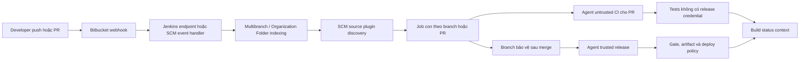

<Callout type="info" title="Phạm vi và giả định runtime">
  Hướng dẫn này mô tả Jenkins LTS, Git plugin, Multibranch Pipeline và một SCM source plugin tương thích với edition Bitbucket đang dùng. <strong>Bitbucket Branch Source</strong> là plugin, không phải Jenkins core; chỉ cài phiên bản đã review compatibility/advisory và xác minh trong controller sandbox. Bitbucket Cloud và Bitbucket Data Center/Server có endpoint, credential, webhook và build-status semantics khác nhau; không sao chép cấu hình giữa hai edition khi chưa đối chiếu tài liệu của plugin và Atlassian.
</Callout>

Bitbucket cung cấp repository, pull request (PR) và sự kiện SCM; Jenkins index source, tạo job con và chạy `Jenkinsfile` ở revision tương ứng. Thiết kế an toàn tách ba capability: đọc Git để checkout, gọi API để discovery hoặc ghi build status, và nhận webhook để yêu cầu indexing. Không capability nào biến source PR thành code đáng tin cậy.

## Mục lục

- [Mục tiêu và mô hình tích hợp](#mục-tiêu-và-mô-hình-tích-hợp)
  - [Luồng sự kiện và ranh giới tin cậy](#luồng-sự-kiện-và-ranh-giới-tin-cậy)
  - [Cloud khác Data Center/Server](#cloud-khác-data-centerserver)
- [Credential Bitbucket và least privilege](#credential-bitbucket-và-least-privilege)
  - [Tách credential theo mục đích](#tách-credential-theo-mục-đích)
  - [SSH, HTTPS và API credential](#ssh-https-và-api-credential)
  - [Scope, rotation và nơi không được đặt secret](#scope-rotation-và-nơi-không-được-đặt-secret)
- [Webhook: xác thực, replay và idempotency](#webhook-xác-thực-replay-và-idempotency)
  - [Sự kiện và endpoint](#sự-kiện-và-endpoint)
  - [Secret, chữ ký và replay](#secret-chữ-ký-và-replay)
  - [Indexing không phải build status](#indexing-không-phải-build-status)
- [Multibranch, Organization Folder và Branch Source](#multibranch-organization-folder-và-branch-source)
  - [Plugin và discovery trait](#plugin-và-discovery-trait)
  - [Lọc branch và chính sách PR](#lọc-branch-và-chính-sách-pr)
  - [Pipeline tham khảo](#pipeline-tham-khảo)
- [Build status và audit release](#build-status-và-audit-release)
- [Cấu hình triển khai có kiểm soát](#cấu-hình-triển-khai-có-kiểm-soát)
- [Lab local tái lập, không cần Bitbucket](#lab-local-tái-lập-không-cần-bitbucket)
  - [Fixture và validator](#fixture-và-validator)
  - [Kết quả mong đợi và giới hạn](#kết-quả-mong-đợi-và-giới-hạn)
- [Troubleshooting](#troubleshooting)
- [Checklist trước khi go-live](#checklist-trước-khi-go-live)
- [Nguồn chính thức](#nguồn-chính-thức)
- [Đọc tiếp](#đọc-tiếp)

## Mục tiêu và mô hình tích hợp

Sau bài này, bạn có thể thiết kế một kết nối trả lời được: repository/revision nào tạo job, identity nào đọc Git, identity nào có quyền ghi commit status, webhook nào gây indexing, và vì sao một PR không có đường nhận credential phát hành. Mục tiêu không phải cho Jenkins quyền quản trị toàn workspace Bitbucket để một clone chạy được.

### Luồng sự kiện và ranh giới tin cậy



Webhook là tín hiệu để Jenkins xem lại source/index. Nó không phải chứng minh event hợp lệ, không thay branch protection, và không phải lệnh deploy. SCM source plugin quyết định mapping event sang scan/index; Jenkinsfile vẫn phải bảo vệ stage nhạy cảm theo context branch/PR và trust policy của chính controller.

### Cloud khác Data Center/Server

Bitbucket Cloud là dịch vụ Atlassian SaaS; Bitbucket Data Center/Server là sản phẩm tự quản trị, trong đó Data Center là hướng triển khai hiện hành của dòng Server. Cùng khái niệm repository/PR nhưng hostname, API base path, authentication, webhook headers/payload, trust proxy và plugin support có thể khác.

| Chủ đề | Bitbucket Cloud | Bitbucket Data Center/Server | Quy tắc an toàn |
| --- | --- | --- | --- |
| Định danh | Workspace và repository ở dịch vụ Atlassian. | Project/repository trên instance do tổ chức vận hành. | Ghi đúng edition, base URL và owner trong change record. |
| Credential API | Cơ chế Atlassian/Bitbucket Cloud được edition hỗ trợ, thường gắn account hoặc automation riêng. | Personal access token, HTTP credential hoặc integration credential tùy version/chính sách instance. | Không suy ra token type/scope từ edition còn lại. |
| Webhook | Event key, payload và khả năng xác thực do Cloud công bố. | Event, context path, reverse proxy/TLS và shared-secret behavior do instance/plugin công bố. | Xác minh header/chữ ký/retry trên sandbox của đúng instance. |
| Jenkins source | Dùng source plugin công bố hỗ trợ Cloud. | Dùng integration/source plugin công bố hỗ trợ Data Center version hiện có. | Không gọi plugin là Jenkins core hoặc giả định UI/trait giống nhau. |
| Build status | API permission/context theo Cloud. | API permission/context theo instance và version. | Chỉ cấp ghi status cho commit/repository cần thiết. |

<Callout type="warn" title="Không đoán endpoint hoặc step">
  Tên webhook endpoint, credential type và cấu hình status nằm ở plugin/edition đang chạy. Dùng **Manage Jenkins → Plugins**, Pipeline Syntax và tài liệu plugin để lấy cấu hình thật. Không chép một Pipeline step không có trong controller, không tự dựng API URL từ token và không tắt TLS để làm kết nối qua được.
</Callout>

## Credential Bitbucket và least privilege

### Tách credential theo mục đích

Một job chỉ cần clone private repository không cần token ghi build status. Một token status không cần quyền sửa repository. Tách identity làm giảm blast radius khi Jenkinsfile, agent hoặc plugin bị lỗi.

| Capability | Identity/credential phù hợp | Quyền tối thiểu tại Bitbucket | Không nên có |
| --- | --- | --- | --- |
| Checkout Git qua SSH | Deploy key hoặc SSH key của automation chỉ đọc, theo repo khi khả thi | Đọc repository đúng phạm vi | Ghi commit status, tạo PR, admin workspace/project. |
| Checkout Git qua HTTPS | Account automation/read-only credential theo repo/project | Đọc clone/fetch | Quyền thay đổi branch protection hoặc repository settings. |
| Discovery/indexing API | API credential riêng cho source plugin | Đọc repository, branch/PR metadata cần discovery | Quyền write source hoặc quản trị tổ chức. |
| Build status | API credential riêng hoặc capability plugin quản lý | Ghi commit status cho repository/commit cần báo | Quyền merge, sửa nội dung repository hoặc admin. |
| Release | Không dùng credential Bitbucket write như capability deploy | Chỉ quyền SCM thực sự cần cho change record nếu có | Cloud/cluster/registry credential phát hành. |

Đặt credential trong folder/job scope hẹp nhất. Tách người quản trị credential khỏi người chỉ trigger job; `Job/Configure` trên job dùng credential là capability thực thi gián tiếp. Domain trong Jenkins Credentials chỉ là gợi ý UI, không phải security boundary. Xem [Credentials & Secrets](/docs/security/credentials-secrets) và [Authorization & RBAC](/docs/security/authorization).

### SSH, HTTPS và API credential

**SSH** phù hợp khi Git remote dùng SSH và hệ thống quản trị key/deploy key rõ ràng. Kiểm host key theo policy; không thêm `StrictHostKeyChecking=no` để né thiết lập. Private key chỉ bind ở nguồn job tin cậy và không bị archive, stash, `cat` hay in path.

**HTTPS Git credential** dùng username/password hoặc token theo contract của Bitbucket edition. Jenkins Credentials chứa giá trị; remote URL trong Jenkinsfile/job không được chứa `user:password@host`, query token hay token được nội suy từ parameter. Source plugin/Git plugin phải được cấu hình bằng credential ID, không phải secret value.

**API credential** có thể khác credential clone. Bitbucket Cloud và Data Center/Server có thể dùng token/cơ chế automation khác nhau tùy version. Kiểm tài liệu Atlassian cùng plugin đang cài để chọn type, scope và nơi nhập credential. Credential API ghi status là quyền nhạy cảm: attacker có thể làm required check trông hợp lệ nếu branch policy tin status context đó.

### Scope, rotation và nơi không được đặt secret

Mỗi credential cần owner, mục đích, consumer folder/job, permission Bitbucket, ngày expiry/rotation và đường revoke. Test rotation bằng repository sandbox/identity không có quyền production, sau đó thu hồi bản cũ theo change record. Khi có nghi ngờ lộ, revoke/rotate ở Bitbucket trước; xóa console log không thu hồi bản sao token.

Không đặt token, app password, SSH private key, webhook shared secret hay cookie trong Git, Jenkinsfile, URL/query, shell argv, `echo`, `printenv`, artifact, report, build parameter, commit message hoặc ticket. `withCredentials` chỉ phù hợp ngay quanh client cần secret, dùng `set +x` và shell single quote; không cho PR/fork hoặc source chưa tin cậy chạy trong closure đó. Hướng dẫn chi tiết có tại [Credentials trong Pipeline](/docs/pipelines/credentials).

## Webhook: xác thực, replay và idempotency

### Sự kiện và endpoint

Chọn event nhỏ nhất đáp ứng latency mong muốn: push/ref update để phát hiện branch; sự kiện PR create/update để indexing PR; và event repository khi cấu hình Organization Folder cần biết repository mới. Tên event cụ thể, endpoint Jenkins và payload schema là hợp đồng **edition + plugin**; Cloud và Data Center/Server không có cam kết chung trong trang này.

Cấu hình webhook bằng URL Jenkins công khai canonical qua HTTPS, có context path đúng nếu controller chạy sau proxy. Chỉ proxy/edge được tin cậy mới được phép đặt forwarded headers. Không mở controller trực tiếp ra Internet nếu có reverse proxy/WAF/allowlist phù hợp; giới hạn method/path, giới hạn body size và ghi request metadata đã redact.

Một webhook có thể bị gửi lại, đến không theo thứ tự hoặc đến đồng thời. Đặt indexing/build theo hướng idempotent: cùng repository/revision/event ID chỉ gây tối đa một index có ý nghĩa, hoặc một index lặp an toàn. Debounce/coalesce event cùng ref khi plugin/controller hỗ trợ; không dùng duplicate webhook làm lý do chạy deploy hai lần.

### Secret, chữ ký và replay

Nếu edition/plugin có hỗ trợ shared secret và chữ ký giao payload, cấu hình secret trong Bitbucket/Jenkins secret store theo cơ chế plugin công bố. Xác minh signature bằng raw request body trước khi parse, dùng comparison chống timing khi tự viết integration, giới hạn timestamp/nonce hoặc delivery ID nếu contract có, và từ chối signature thiếu/sai. Không tự gọi một header là chữ ký nếu tài liệu của edition không cam kết nó.

Một shared secret xác thực nguồn request trong giới hạn contract; nó không tự giải quyết replay. Khi webhook có delivery ID/timestamp đáng tin cậy, lưu dấu vết đã xử lý với TTL đủ cho retry window và từ chối duplicate. Khi plugin đã nhận/lọc event nội bộ, dùng capability plugin thay vì viết endpoint tùy biến. Nếu contract không có replay key, dùng indexing idempotent theo repository/ref/revision và rate limit, rồi ghi limitation vào risk register.

<Callout type="error" title="Webhook không được cấp quyền release">
  Payload, branch name, PR title, commit message và Jenkinsfile trong PR là input có thể bị người đóng góp kiểm soát. Không ghép chúng vào shell, URL, target deploy hoặc credential selection. Webhook chỉ yêu cầu Jenkins xem lại SCM state; release chỉ bắt đầu sau trusted branch gate và policy riêng.
</Callout>

### Indexing không phải build status

Indexing quét source, tạo/cập nhật job branch/PR và có thể trigger build theo cấu hình. Build status là trạng thái Jenkins ghi lại cho một commit/context ở Bitbucket. Chúng là hai luồng tách biệt:

- Webhook tới nhưng status không đổi: kiểm source plugin/job indexing, build đã tạo, credential status và permission write status.
- Status đổi nhưng build bị duplicate: kiểm webhook retry, periodic scan, manual trigger, indexing queue và event coalescing.
- Một status xanh không xác minh người đã merge hay artifact production khỏe; branch protection, quality gate, authorization và release evidence vẫn độc lập.

## Multibranch, Organization Folder và Branch Source

### Plugin và discovery trait

**Multibranch Pipeline** tạo một job con cho branch/PR được source phát hiện. **Organization Folder** áp dụng source discovery cho nhiều repository trong một namespace, rồi tạo multibranch items bên dưới. Hai loại job cần Jenkins core/Pipeline và SCM source plugin tương thích; behavior discover, orphan cleanup, webhook routing và status publication phụ thuộc plugin/version/runtime.

Với Bitbucket Cloud, [Bitbucket Branch Source plugin](https://plugins.jenkins.io/cloudbees-bitbucket-branch-source/) là một lựa chọn plugin cần được review, không phải feature Jenkins core. Với Data Center/Server, chọn plugin/integration mà tài liệu của version Bitbucket và Jenkins đang vận hành công bố hỗ trợ. Trước khi cài/nâng plugin, kiểm `requiredCore`, Java, dependency graph, advisory, release notes, quyền credential và rollback trên controller sandbox. Xem [Bảo mật Agent và Plugin](/docs/security/agent-plugin-security).

Discovery traits và UI thay đổi theo plugin. Thiết kế policy trước khi tick checkbox:

| Đối tượng discovery | Policy cần chốt | Evidence runtime |
| --- | --- | --- |
| Branch | Include branch cần CI, exclude generated/archived branch theo naming policy | Danh sách job con sau indexing và revision đã checkout. |
| PR cùng repository | Chọn head/merge revision theo contract plugin, rồi test cả hai với status/branch policy | SCM metadata, revision thực tế, Jenkinsfile được chạy. |
| PR fork/ngoài trust boundary | Có thể discover để test không credential, hoặc tắt nếu policy không cho phép | Test bằng account/repository sandbox; agent và credential được chứng minh tách biệt. |
| Organization repositories | Include/exclude project/workspace/repo bằng rule hẹp; xác định owner khi repo mới xuất hiện | Log indexing đã redact, item inventory và permission source identity. |
| Orphaned jobs | Retention/cleanup có owner; không xóa history/evidence chỉ vì branch bị đóng | Policy job, record retention và kết quả dry-run/sandbox. |

### Lọc branch và chính sách PR

Lọc branch giảm queue và bề mặt thực thi, nhưng không thay branch protection. Một allowlist `main`, `release/*` chỉ là policy discovery; branch source plugin vẫn phải được kiểm tra về glob/case/trait semantics. Test branch không khớp bị bỏ qua và branch khớp tạo đúng job trên sandbox trước khi đưa rule vào production.

PR code, kể cả Jenkinsfile, phải được coi là chưa tin cậy khi contributor có thể sửa nó. Pipeline cho PR chỉ chạy test/lint không credential trên agent pool tách biệt. Publish artifact, ký, ghi status bằng token đặc quyền, deploy và gọi network nhạy cảm chỉ chạy sau policy trust rõ ràng — thường là revision đã merge vào branch bảo vệ. `when { branch 'main' }` chỉ có nghĩa đáng tin khi Multibranch metadata, branch protection và discovery policy đã được xác minh.

### Pipeline tham khảo

Jenkinsfile này không gọi step Bitbucket-specific. Nó dùng Declarative Pipeline core/plugin phổ biến để minh họa branch/PR separation; source plugin mới chịu trách nhiệm discovery, webhook mapping và status capability. `branch`/`changeRequest` cần Multibranch Pipeline và metadata đúng từ SCM source plugin.

```groovy
pipeline {
  agent none

  options {
    skipDefaultCheckout(true)
    timeout(time: 30, unit: 'MINUTES')
  }

  stages {
    stage('PR CI without credentials') {
      when {
        beforeAgent true
        changeRequest()
      }
      agent { label 'untrusted-ci-linux' }
      steps {
        checkout scm
        sh '''#!/bin/sh
          set -eu
          ./ci/run-pr-tests
        '''
      }
    }

    stage('Protected branch CI') {
      when {
        beforeAgent true
        branch 'main'
      }
      agent { label 'trusted-ci-linux' }
      steps {
        checkout scm
        sh '''#!/bin/sh
          set -eu
          ./ci/run-required-tests
          ./ci/run-security-policy
        '''
      }
    }

    stage('Release capability after trusted gate') {
      when {
        beforeAgent true
        branch 'main'
      }
      agent { label 'trusted-release-linux' }
      steps {
        checkout scm
        withCredentials([
          string(credentialsId: 'artifact-publisher', variable: 'PUBLISH_TOKEN')
        ]) {
          sh '''#!/bin/sh
            set -eu
            set +x
            ./ci/publish-immutable-artifact
          '''
        }
      }
    }
  }

  post {
    always {
      echo "Build ${env.BUILD_NUMBER}: ${currentBuild.currentResult}"
    }
  }
}
```

`artifact-publisher` là credential ID minh họa, không phải token. Trong mẫu, test/security policy hoàn tất trước binding publisher; code PR không nhận credential. Agent labels chỉ route scheduler, vì vậy OS identity, workspace/cache, network egress và quyền sửa job phải tách theo trust tier. Không dùng `changeRequest()` để suy ra fork đáng tin hay để nạp secret.

Đọc [Jenkinsfile](/docs/pipelines/jenkinsfile) để validate syntax bằng controller, và [CSRF & API Tokens](/docs/security/csrf-api-tokens) khi automation cần gọi Jenkins API.

## Build status và audit release

Build status gắn **commit SHA** với một **status context/key** ổn định, ví dụ `jenkins/catalog-api/verify`. Branch protection chỉ nên require context mà owner đã xác nhận thuộc Jenkins identity đúng; một context tên giống nhau từ integration khác có thể làm policy mơ hồ. Đặt tên context theo repository/job purpose, không theo số build hoặc branch input.

| Trạng thái | Khi gửi | Ý nghĩa và handling |
| --- | --- | --- |
| In progress | Build thực sự đã được xếp/chạy, nếu plugin integration hỗ trợ | Cho người review thấy work đang diễn ra; không là approval. |
| Success | Required tests/gates của commit pass | Không chứng minh release/deploy production thành công. |
| Failed | Test, checkout, policy hoặc status publish failure theo policy | Giữ failure; không đổi sang xanh ở `post`. |
| Stopped/cancelled | Build bị abort/timeout và provider/plugin có representation tương ứng | Ghi build URL và nguyên nhân; không gửi success để “dọn dashboard”. |

Không bịa `bitbucketStatusNotify`, REST endpoint hay custom header trong Jenkinsfile. Một số source/integration plugin có thể tự publish status từ build result hoặc có UI/configuration riêng; plugin khác cần integration bổ sung. Xác minh exact capability, trigger, credential type, context, URL, retry behavior và failure mode trong plugin documentation/Pipeline Syntax của controller.

Status credential phải chỉ có quyền ghi status vào repository/commit cần thiết. Không dùng token clone/admin để ghi status. Nếu publish status thất bại sau build pass, giữ evidence rõ ràng và chọn policy: fail closed với required status, hoặc ghi incident/retry một thao tác idempotent theo contract provider. Không retry vô hạn; retry không được tạo context/record mâu thuẫn. Audit release cần liên kết commit SHA, Jenkins build URL/ref, result, context, actor/service identity, plugin/version và thời điểm, nhưng không chứa token/payload raw.

## Cấu hình triển khai có kiểm soát

1. **Chốt edition và owner.** Ghi Bitbucket Cloud hoặc Data Center/Server, canonical base URL, repository/project scope, Jenkins folder, source plugin candidate, owner và rollback owner.
2. **Review plugin/runtime.** Trên sandbox, kiểm Jenkins core/JDK, Git/Pipeline/source plugin exact version, `requiredCore`, advisory, supported edition, agent/toolchain và reverse proxy/TLS. Không cài trực tiếp vào production để thử.
3. **Tạo identity tối thiểu.** Tạo riêng clone-read, discovery-read và status-write nếu capability cần tách. Đặt credential ID vào folder scope; test permission deny/allow bằng repository sandbox.
4. **Tạo Multibranch/Organization Folder sandbox.** Chọn source plugin, repository scope và discovery traits hẹp. Index một branch hợp lệ, một branch bị exclude và một PR; lưu revision/job result đã redact.
5. **Cấu hình webhook sandbox.** Dùng URL HTTPS canonical và event nhỏ nhất. Nếu plugin/edition hỗ trợ secret signing, bật theo contract, test signature fail và retry/duplicate behavior; không ghi secret vào evidence.
6. **Kiểm status và trust gate.** Xác nhận context/status gắn đúng commit; PR chạy không credential trên agent tách biệt; branch bảo vệ mới tới stage trusted. Kiểm service identity không có merge/admin/deploy permission.
7. **Promote có change record.** Chỉ sau các test trên, review change window, backup/export config đã redact, monitoring, rollback plugin/job/webhook và audit/retention. Sau go-live, theo dõi event drop, indexing lag, duplicate rate, status error và credential expiry.

Static review chỉ đọc Jenkinsfile/configuration. Nó không chứng minh Bitbucket gửi webhook, proxy chuyển header đúng, plugin parse payload, SCM provider cấp metadata, credential có scope đúng hay status API chấp nhận request. Những điều đó cần controller/repository sandbox của edition thật.

## Lab local tái lập, không cần Bitbucket

### Fixture và validator

Lab này chỉ tạo fixture JSON **giả** rồi kiểm tra branch filtering/local contract. Nó không khởi chạy Jenkins, không gọi Bitbucket/API/network, không tạo credential, không nhận webhook và không chứng minh tên event/header của một edition. Cần shell POSIX, `mktemp`, `dirname`, `python3` và `rm`.

```bash
set -eu
umask 077
LAB_PARENT="${TMPDIR:-/tmp}"
LAB_PREFIX='jenkins-bitbucket-fixture.'
LAB_ROOT="$(mktemp -d "${LAB_PARENT}/${LAB_PREFIX}XXXXXX")"
LAB_MARKER="$LAB_ROOT/.lab-owned"

case "$LAB_ROOT" in
  "$LAB_PARENT"/"$LAB_PREFIX"*) ;;
  *) printf 'Refuse unexpected lab path.\n' >&2; exit 1 ;;
esac
[ "$(dirname -- "$LAB_ROOT")" = "$LAB_PARENT" ] || {
  printf 'Refuse non-child lab path.\n' >&2; exit 1;
}
printf '%s\n' 'bitbucket-fixture-lab-v1' > "$LAB_MARKER"

cat > "$LAB_ROOT/push.fixture.json" <<'EOF'
{
  "training_event": "push",
  "repository": {"full_name": "training-workspace/catalog-api", "scm": "git"},
  "changes": [
    {"branch": "feature/docs-lab", "commit": "0123456789abcdef0123456789abcdef01234567"}
  ]
}
EOF

python3 - "$LAB_ROOT/push.fixture.json" <<'PY'
import json
import re
import sys

fixture = json.load(open(sys.argv[1], encoding='utf-8'))
assert fixture['training_event'] == 'push'
assert fixture['repository'] == {
    'full_name': 'training-workspace/catalog-api',
    'scm': 'git',
}
changes = fixture['changes']
assert len(changes) == 1
branch = changes[0]['branch']
commit = changes[0]['commit']
assert re.fullmatch(r'feature/[a-z0-9-]+', branch)
assert re.fullmatch(r'[0-9a-f]{40}', commit)
print(f'fixture accepted: branch={branch}; commit-length={len(commit)}')
print('Result is a local filter assertion, not a webhook delivery or Jenkins indexing result.')
PY

case "${LAB_ROOT:-}" in
  "${LAB_PARENT}"/"${LAB_PREFIX}"*) ;;
  *) printf 'Refuse cleanup: unexpected lab directory.\n' >&2; exit 1 ;;
esac
if [ "$(dirname -- "$LAB_ROOT")" != "$LAB_PARENT" ] || \
   [ ! -f "$LAB_MARKER" ] || \
   [ "$(cat -- "$LAB_MARKER")" != 'bitbucket-fixture-lab-v1' ]; then
  printf 'Refuse cleanup: direct-parent or marker guard failed.\n' >&2
  exit 1
fi
cd / || exit 1
rm -rf -- "$LAB_ROOT"
printf 'Lab cleanup completed.\n'
```

### Kết quả mong đợi và giới hạn

Kết quả mong đợi gồm hai dòng `fixture accepted` và `Result is a local filter assertion`, sau đó `Lab cleanup completed.` Directory tạm được tạo bởi `mktemp`, có prefix, là child trực tiếp của `LAB_PARENT` và có marker trước khi cleanup. Không thay `LAB_ROOT` bằng workspace, `JENKINS_HOME`, volume, path do người dùng nhập hay directory production.

Lab chỉ chứng minh fixture giả khớp allowlist `feature/` và validator hoạt động. Nó không chứng minh webhook đã đến Jenkins, shared-secret/signature hợp lệ, source plugin hỗ trợ payload, traits tạo đúng job, Bitbucket credential clone được hay commit status được ghi. Những điều đó là test integration của Bitbucket/Jenkins sandbox, không phải kết quả lab local.

## Troubleshooting

| Triệu chứng | Evidence cần kiểm tra | Hành động an toàn |
| --- | --- | --- |
| Webhook không tới Jenkins | Delivery log ở Bitbucket, HTTPS/proxy/WAF log đã redact, URL/context path canonical, TLS certificate và plugin endpoint | Kiểm event/path/proxy theo edition; không mở rộng public access hoặc tắt TLS/CSRF để thử. |
| Webhook tới nhưng không index | Source plugin version/log, job source config, repository permission, event mapping và queue | Trigger scan sandbox có kiểm soát, kiểm discovery trait; không gọi payload là lệnh build trực tiếp. |
| Clone/fetch lỗi xác thực | Git remote form, credential ID/type/scope, host key hoặc CA/TLS, repository permission và agent network | Sửa credential/host trust qua owner; không in token, dùng `-k` hoặc tắt host-key checking. |
| PR có release credential | Multibranch context, `when`, agent pool, folder credential scope, Jenkinsfile revision và branch protection | Dừng release path, tách agent/scope và rotate nếu nghi lộ. |
| Duplicate build | Webhook retry/delivery ID, periodic scan, manual trigger, indexing queue và revision | Coalesce/index idempotent, định danh theo revision; không disable mọi trigger mù quáng. |
| Status không xuất hiện | Commit SHA thực tế, context, plugin capability/config, status credential permission, provider audit/result | Xác minh status write trên repo sandbox; không dùng admin token hoặc bịa REST call trong Jenkinsfile. |
| Status sai/đến muộn | Build URL/result, event order, retry log, same context từ integration khác | Giữ context ổn định, đối chiếu SHA và policy branch; không ghi success sau abort/failure. |
| Plugin update làm discovery đổi | Core/JDK/plugin dependency set, release notes, trait config export, sandbox smoke test | Rollback version set đã review; không update-all trên production. |

## Checklist trước khi go-live

- [ ] Edition Bitbucket, canonical URL/context path, repository/project scope, owners và plugin/version compatibility đã được xác minh trên sandbox.
- [ ] Git read, discovery API và status write dùng identity/credential tách khi cần; mỗi identity có permission tối thiểu, folder scope, owner, expiry và revoke path.
- [ ] Secret không nằm trong Jenkinsfile, SCM URL/query, argv, console, artifact, report, ticket hay config export rộng quyền.
- [ ] SSH dùng host-key verification; HTTPS/API dùng TLS/CA được tin cậy; không có `ignoreSslErrors`, `curl -k` hoặc host-key bypass.
- [ ] Webhook event nhỏ nhất, URL HTTPS canonical, proxy/header trust, body/rate limit và logging đã redact được cấu hình theo edition/plugin.
- [ ] Shared secret/chữ ký/replay chỉ được bật và verify theo contract edition/plugin; duplicate event dẫn tới indexing/build idempotent.
- [ ] Discovery trait/branch filter đã test branch include/exclude, PR revision, fork policy, Organization Folder scope và orphan retention trên sandbox.
- [ ] PR/source không tin cậy không có credential release/status đặc quyền, không chạy chung agent/workspace/cache/network với trusted tier.
- [ ] Build status dùng context ổn định, commit SHA đúng, permission write tối thiểu, failure/abort/retry semantics rõ và audit không chứa token.
- [ ] Plugin/core/JDK/agent, webhook/status integration và rollback/change record đã được kiểm trước production; runtime evidence được giữ theo retention policy.
- [ ] Lab local chỉ dùng fixture/marker tạm, direct-parent guard và cleanup scoped; kết quả lab không bị diễn giải thành webhook runtime evidence.

## Nguồn chính thức

- [Jenkins Multibranch Pipeline](https://www.jenkins.io/doc/book/pipeline/multibranch/) — job theo branch/change request và Jenkinsfile theo revision.
- [Jenkins Pipeline Syntax](https://www.jenkins.io/doc/book/pipeline/syntax/) — `when`, stage agent, `post` và Snippet Generator.
- [Using a Jenkinsfile](https://www.jenkins.io/doc/book/pipeline/jenkinsfile/) — Pipeline as Code và trust của source revision.
- [Jenkins: Using Credentials](https://www.jenkins.io/doc/book/using/using-credentials/) — credential store, scope và permission.
- [Jenkins: Securing Pipelines](https://www.jenkins.io/doc/book/security/securing-pipelines/) — PR/source trust và credential trong Pipeline.
- [Bitbucket Branch Source plugin](https://plugins.jenkins.io/cloudbees-bitbucket-branch-source/) — support/configuration plugin cần đối chiếu runtime.
- [Jenkins Plugins](https://plugins.jenkins.io/) và [Jenkins Security Advisories](https://www.jenkins.io/security/advisories/) — compatibility, lifecycle và advisory plugin.
- [Atlassian Bitbucket Cloud webhooks](https://support.atlassian.com/bitbucket-cloud/docs/manage-webhooks/) — event/delivery Cloud.
- [Atlassian Bitbucket Data Center webhooks](https://confluence.atlassian.com/bitbucketserver/manage-webhooks-776639367.html) — cấu hình webhook self-managed theo version instance.
- [Atlassian Bitbucket Cloud API authentication](https://developer.atlassian.com/cloud/bitbucket/rest/intro/#authentication) — cơ chế xác thực API Cloud.
- [Atlassian Bitbucket Data Center REST API](https://developer.atlassian.com/server/bitbucket/rest/) — REST/API contract self-managed theo version.

## Đọc tiếp

<Cards>
  <Card title="Jenkinsfile" href="/docs/pipelines/jenkinsfile" description="Đặt Pipeline as Code, validate syntax và review thay đổi SCM." />
  <Card title="Credentials trong Pipeline" href="/docs/pipelines/credentials" description="Nạp SSH/API credential theo scope ngắn và không lộ secret." />
  <Card title="Credentials & Secrets" href="/docs/security/credentials-secrets" description="Quản lý scope, rotation, revoke và trust boundary của capability." />
  <Card title="Authorization & RBAC" href="/docs/security/authorization" description="Tách permission job, folder, credential và administrator theo least privilege." />
  <Card title="Bảo mật Agent và Plugin" href="/docs/security/agent-plugin-security" description="Cô lập PR, agent và review SCM source plugin như code đặc quyền." />
  <Card title="CSRF & API Tokens" href="/docs/security/csrf-api-tokens" description="Gọi Jenkins API bằng service identity, TLS và mutation có kiểm soát." />
</Cards>
