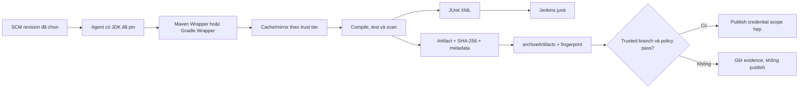

<Callout type="info" title="Phạm vi và giả định runtime">
  Hướng dẫn này dùng Jenkins LTS, Pipeline: Declarative, Pipeline: Basic Steps, JUnit plugin, Git và agent Linux có JDK đã được phê duyệt. `junit` do JUnit plugin cung cấp; `archiveArtifacts` là Pipeline step. Maven/Gradle version, JDK, wrapper distribution, mirror, agent label và plugin cần được xác minh bằng controller sandbox cùng ma trận hỗ trợ của đội; snippet không khẳng định chúng đã chạy ở runtime này.
</Callout>

Một build Java tin cậy phải xác định được **JDK nào**, **build tool nào**, **dependency nào** và **bytes artifact nào** đã được dùng. Maven Wrapper hoặc Gradle Wrapper đưa tool version vào source; Jenkins điều phối checkout, agent, report, artifact và ranh giới credential. Cache chỉ là tối ưu hiệu năng, không phải nguồn chuẩn của dependency hay artifact phát hành.

## Mục lục

- [Mục tiêu và luồng build](#mục-tiêu-và-luồng-build)
- [Cài đặt và pin toolchain](#cài-đặt-và-pin-toolchain)
  - [Wrapper và Jenkins Global Tool Configuration](#wrapper-và-jenkins-global-tool-configuration)
  - [JDK, tool và dependency tái lập](#jdk-tool-và-dependency-tái-lập)
- [Dependency cache có ranh giới](#dependency-cache-có-ranh-giới)
  - [Cache Maven và Gradle](#cache-maven-và-gradle)
  - [Mirror, credential và verification](#mirror-credential-và-verification)
  - [Offline và cache poisoning](#offline-và-cache-poisoning)
- [Test reports và failure semantics](#test-reports-và-failure-semantics)
  - [Maven Surefire và Failsafe](#maven-surefire-và-failsafe)
  - [Gradle JUnit XML](#gradle-junit-xml)
  - [Jenkins JUnit step](#jenkins-junit-step)
- [Artifact bất biến và archive Jenkins](#artifact-bất-biến-và-archive-jenkins)
- [Jenkinsfile tham khảo](#jenkinsfile-tham-khảo)
  - [Pipeline Maven](#pipeline-maven)
  - [Tương đương Gradle](#tương-đương-gradle)
- [Lab local tái lập không cần Maven Central](#lab-local-tái-lập-không-cần-maven-central)
  - [Fixture và kiểm tra layout](#fixture-và-kiểm-tra-layout)
  - [Kết quả và giới hạn runtime](#kết-quả-và-giới-hạn-runtime)
- [Troubleshooting](#troubleshooting)
- [Checklist trước khi áp dụng](#checklist-trước-khi-áp-dụng)
- [Nguồn chính thức](#nguồn-chính-thức)
- [Đọc tiếp](#đọc-tiếp)

## Mục tiêu và luồng build

Sau bài này, bạn có thể chọn wrapper/toolchain phù hợp, tách cache của PR khỏi release, thu report đúng đường dẫn và archive artifact có checksum. Bạn cũng có thể giải thích vì sao test/scan phải hoàn tất trước khi credential publish được bind, và vì sao Jenkins fingerprint không thay SHA-256.



Pipeline không nên rebuild dependency hay artifact ở stage publish. Build once có nghĩa là compile/test/package một lần trên input đã pin; publish/promotion chỉ dùng output đã verify. Nếu build cần dùng plugin/agent/runtime khác, ghi chúng vào metadata/evidence thay vì đoán từ console log.

## Cài đặt và pin toolchain

### Wrapper và Jenkins Global Tool Configuration

| Cách chọn tool | Ưu điểm | Rủi ro/cần kiểm soát | Khi dùng |
| --- | --- | --- | --- |
| Maven Wrapper `./mvnw` | Version Maven và URL distribution nằm trong SCM; developer/CI cùng entry point. | Wrapper JAR/properties là supply-chain input; distribution vẫn cần checksum, TLS/mirror và review. | Mặc định cho repository Maven. |
| Gradle Wrapper `./gradlew` | Version Gradle được pin trong `gradle/wrapper/gradle-wrapper.properties`; cùng command local/CI. | Không chạy wrapper không review; distribution URL/checksum và executable bit cần được kiểm. | Mặc định cho repository Gradle. |
| Jenkins Global Tool Configuration | Platform có thể quản trị JDK/Maven/Groovy tool install chung, auto-install hoặc image agent. | Tool name là config runtime; auto-install có thể tải network và làm drift nếu không pin/mirror. | Tool chung đã được platform pin và test trên agent. |

Wrapper không tự pin JDK. Pin JDK bằng image agent digest, Jenkins tool installation version hoặc đường dẫn tool được quản trị; dùng cùng major/vendor cho developer và CI khi project yêu cầu. Không dựa vào `java` mặc định của host hay để agent tự tải distribution ngoài policy trong mỗi build.

Với wrapper, kiểm executable bit (`test -x ./mvnw` hoặc `test -x ./gradlew`) trước build. Đừng sửa bằng `chmod +x` trong Pipeline production vì điều đó che nguồn checkout/permission sai. Sửa mode trong SCM và review diff. Jenkins Global Tool Configuration có thể là lựa chọn hợp lệ, nhưng phải ghi rõ tên tool/version, source/mirror, owner, cache location và rollback version; nó không thay wrapper lock trong source.

### JDK, tool và dependency tái lập

Tái lập không đồng nghĩa bytes luôn giống tuyệt đối trên mọi OS/timezone/toolchain, nhưng bắt đầu từ input kiểm soát được. Giữ các thông tin sau trong source hoặc release metadata:

- JDK vendor, major version và architecture của agent; compiler target/source/release của project;
- Maven Wrapper hoặc Gradle Wrapper version cùng distribution URL/checksum theo cơ chế tool;
- Maven `pom.xml`, dependency/plugin version và lock/checksum policy khi tổ chức dùng; Gradle version catalog/lock file, dependency verification metadata và plugin version;
- repository mirror, CA/truststore và profile không nhạy cảm cần để resolve; không ghi credential vào `pom.xml`, `build.gradle` hay wrapper properties;
- revision SCM, command build, artifact coordinate/version, SHA-256 và SBOM/provenance theo policy.

`-B` làm Maven chạy batch mode; `-ntp` giảm transfer progress log, không phải security control. `--no-daemon` khiến Gradle CI không giữ daemon sau build; nó không pin Gradle/JDK hoặc tách cache. Đặt timeout ở Pipeline và để exit code non-zero làm stage fail; không bọc test bắt buộc bằng retry để tạo build xanh giả.

## Dependency cache có ranh giới

### Cache Maven và Gradle

Maven mặc định dùng local repository `~/.m2/repository`; Gradle mặc định dùng `GRADLE_USER_HOME`. Hai location đó trên agent dùng chung có thể làm branch/PR khác ghi dependency, metadata hoặc plugin vào cùng cache. Dùng cache per-job/per-branch, hoặc cache read-only đã được trusted build tạo và kiểm checksum/lock trước khi dùng.

| Tool | Cache phân vùng đơn giản | Lưu ý |
| --- | --- | --- |
| Maven | `-Dmaven.repo.local="$WORKSPACE/.ci-cache/m2"` | Workspace cache mất khi agent ephemeral; không share write giữa PR và release. |
| Gradle | `GRADLE_USER_HOME="$WORKSPACE/.ci-cache/gradle" ./gradlew --no-daemon ...` | Bao gồm cache dependency/plugin; dùng path cố định trong workspace, không dùng home chung của OS. |
| Cache trung tâm read-only | Mirror/cache service do platform quản trị, ACL và checksum rõ | Consumer không có quyền ghi; repository/proxy vẫn cần integrity policy và audit. |

Cache per-workspace dễ tái lập nhưng làm download lại khi workspace bị dọn. Cache shared có thể nhanh hơn nhưng chỉ phù hợp khi key gồm tool/JDK/OS/lockfile và writer đã trusted; PR không tin cậy không được ghi vào cache release. Không cache `settings.xml` có secret, token, file credential, private key, `.env`, report chứa secret hoặc artifact release như thể đó là dependency.

### Mirror, credential và verification

Dependency mirror giảm egress và tăng availability khi được vận hành như supply-chain service: TLS/CA hợp lệ, namespace allowlist, audit, retention, quarantine và owner. Maven có thể nhận mirror/server credential qua `settings.xml`; Gradle có repository credential/configuration tương đương. Credential đọc mirror tách khỏi credential publish và chỉ có quyền read namespace cần thiết.

Khi mirror cần secret, binding chỉ bao command resolve/build ở trusted lane phù hợp. Không truyền password qua `-D` command-line, URL, `--password`, console hay Gradle properties committed. PR/fork nên dùng public/mirror read-only lane không chứa capability nội bộ nhạy cảm; nếu không thể đáp ứng, không chạy PR với credential đó.

Integrity không đến từ cache hit. Maven checksum policy, dependency/plugin pinning và repository checksum cần được owner chọn; Gradle dependency locking và dependency verification có thể phát hiện thay đổi bất ngờ khi project đã cấu hình chúng. Cơ chế nào cũng cần update workflow reviewable: cập nhật lock/verification metadata trong PR riêng, verify source/mirror, rồi pin revision. Không xóa toàn cache để “sửa” mismatch trước khi giữ evidence và tìm producer.

### Offline và cache poisoning

`--offline` của Maven và `--offline` của Gradle chỉ dùng dependency đã có local cache; chúng không chứng minh cache đầy đủ hoặc đúng. Offline build có thể fail nếu plugin, metadata, POM/module, transitive dependency hoặc dynamic version chưa tồn tại. Dùng offline mode trong test tái lập sau khi prime cache có kiểm soát, không làm fallback im lặng khi mirror/TLS/credential bị lỗi.

Cache poisoning xảy ra khi bytes/metadata không tin cậy được ghi vào cache mà release sau tin dùng. Giảm rủi ro bằng cache per trust tier, write access tối thiểu, dependency/checksum verification, no shared writable home, cleanup/TTL và re-resolve từ mirror trusted khi có incident. Một cache volume name, Jenkins label hoặc folder không tự tạo boundary; OS identity, mount permission, agent isolation và network policy mới quyết định ai ghi được.

## Test reports và failure semantics

### Maven Surefire và Failsafe

Maven Surefire thường chạy unit test ở phase `test` và tạo XML tại `target/surefire-reports/`. Maven Failsafe thường chạy integration test ở `integration-test`/`verify` và tạo XML tại `target/failsafe-reports/`. `verify` là command hữu ích khi project đã bind Failsafe: nó cho phép cleanup/post-integration rồi fail ở phase `verify`; `test` không chạy Failsafe lifecycle đó.

```bash
./mvnw -B -ntp \
  -Dmaven.repo.local="$WORKSPACE/.ci-cache/m2" \
  verify
```

Đường dẫn report là convention plugin, không phải bằng chứng mọi project dùng đúng cấu hình này. Project có thể đổi `reportsDirectory`, disable XML hoặc dùng framework/plugin khác. Luôn kiểm `pom.xml` và output thực tế; `junit` phải trỏ đúng XML đã được tạo, không trỏ glob rộng toàn workspace.

### Gradle JUnit XML

Gradle task `test` thường ghi JUnit XML dưới `build/test-results/test/`. `check` chạy task validation mà project đã wired, thường bao gồm `test`; nó có thể khác giữa repository. Command CI cơ bản, không dùng daemon, là:

```bash
GRADLE_USER_HOME="$WORKSPACE/.ci-cache/gradle" \
  ./gradlew --no-daemon clean test
```

Nếu project có integration test, task/report path phải được build script định nghĩa rõ, ví dụ một `integrationTest` source set sẽ không tự dùng cùng path `test`. Không giả định XML của custom task; inspect `build.gradle`/`build.gradle.kts` và test trên agent sandbox.

### Jenkins JUnit step

`junit` publish XML đã có vào Jenkins và hiển thị failure trend. Nó không chạy Maven/Gradle, không thay test gate và không tự tạo report. JUnit plugin và storage/retention build phải tồn tại trên controller. Publish report trong `post { always }` của stage test để vẫn có evidence khi test fail, nhưng chọn `allowEmptyResults` có chủ đích:

| Tình huống | `allowEmptyResults` | Lý do |
| --- | --- | --- |
| Unit test bắt buộc luôn phải tạo XML | `false` | Missing report là lỗi cấu hình/build rõ ràng. |
| Report phụ trợ/chỉ có ở profile tùy chọn | `true`, kèm evidence policy riêng | Tránh che lỗi gốc; không diễn giải missing report là pass. |
| Build fail trước khi test runner khởi động | Theo policy stage/report | Giữ failure gốc và điều tra compile/agent/tool trước. |

Không dùng `catchError` bao test bắt buộc rồi archive/publish tiếp như release hợp lệ. `sh` trả exit code khác `0` phải làm Pipeline fail trừ khi policy đã phân loại rõ; xem [Xử lý lỗi và Retry](/docs/pipelines/error-handling).

## Artifact bất biến và archive Jenkins

Artifact release cần version/coordinate bất biến, SHA-256/SHA-512, metadata source/toolchain và SBOM/provenance khi policy yêu cầu. Tạo checksum của **file đóng gói cuối** rồi archive theo allowlist hẹp. `archiveArtifacts` lưu evidence theo retention Jenkins; artifact repository là nguồn distribution riêng. `fingerprint: true` hỗ trợ nối build producer/consumer bằng MD5 lịch sử, nên không thay checksum mật mã, chữ ký hoặc validation dependency.

| Dữ liệu | Dùng để | Không được chứa |
| --- | --- | --- |
| JAR/WAR/package | Consumer hoặc promotion resolve version bất biến | Secret, config production, private key. |
| SHA-256 sidecar | Verify bytes sau archive/download | Token hoặc URL ký ngắn hạn. |
| Test XML | Evidence quality theo build | Secret từ test fixture/log. |
| SBOM/metadata | Provenance, dependency inventory, toolchain/revision | Credential, raw environment, request header. |
| Jenkins fingerprint | Truy vết nội bộ giữa build | Bằng chứng integrity mật mã. |

`archiveArtifacts` cần path tương đối workspace. Dùng pattern hẹp như `target/catalog-api-1.4.0.jar` hoặc `build/libs/catalog-api-1.4.0.jar`, không archive `**/*`. `allowEmptyArchive: false` phù hợp output release bắt buộc. Thiết kế `buildDiscarder`/retention riêng cho log/report Jenkins, cache và repository release; controller không phải kho bytes vô hạn. Xem [Build Artifacts](/docs/jobs/artifacts) và [Artifact repositories với Jenkins](/docs/integrations/artifact-repositories).

## Jenkinsfile tham khảo

### Pipeline Maven

Mẫu này giả định Multibranch Pipeline, `main` được bảo vệ và chỉ trusted source mới có quyền merge vào đó, wrapper Maven executable, JDK/pin agent đã chuẩn bị, Git/JUnit plugin và agent Linux. Các file `target/catalog-api-1.4.0.jar` và `target/catalog-api-1.4.0.jar.sha256` là contract minh họa của project; thay bằng coordinate/path thật đã review. Pipeline không có URL repository, token hay publish command: publish phải là stage trusted riêng, sau gate artifact, với credential publish chỉ tồn tại trong closure tối thiểu.

`agent none` cùng `skipDefaultCheckout(true)` ngăn implicit checkout trên mọi agent. Stage build checkout revision SCM đã được Jenkins chọn cho run, ghi `git rev-parse HEAD` cạnh artifact rồi chỉ stash JAR, checksum và revision đó. Stage publish chỉ được cấp agent sau `when { beforeAgent true; branch 'main' }`; tại workspace trusted mới, nó checkout lại SCM của **cùng run**, xác minh `GIT_COMMIT`, `HEAD` và revision đã stash khớp nhau, rồi mới `unstash`/gọi script. Vì vậy không chép toàn source từ lane build/PR sang release workspace, không rebuild artifact, và fail closed nếu revision hay script không đúng.

```groovy
pipeline {
  agent none

  options {
    skipDefaultCheckout(true)
    timeout(time: 35, unit: 'MINUTES')
    buildDiscarder(logRotator(
      daysToKeepStr: '30', numToKeepStr: '30',
      artifactDaysToKeepStr: '14', artifactNumToKeepStr: '10'
    ))
  }

  stages {
    stage('Build and test Maven') {
      agent { label 'linux && jdk17' }
      steps {
        checkout scm
        sh '''#!/bin/sh
          set -eu
          test -x ./mvnw
          ./mvnw -B -ntp \
            -Dmaven.repo.local="$WORKSPACE/.ci-cache/m2" \
            verify
          test -s target/catalog-api-1.4.0.jar
          sha256sum target/catalog-api-1.4.0.jar \
            > target/catalog-api-1.4.0.jar.sha256
          (cd target && sha256sum -c catalog-api-1.4.0.jar.sha256)
          git rev-parse --verify HEAD > target/release-input.git-commit
          test -s target/release-input.git-commit
        '''
        stash(
          name: 'maven-verified-output',
          includes: 'target/catalog-api-1.4.0.jar,target/catalog-api-1.4.0.jar.sha256,target/release-input.git-commit',
          useDefaultExcludes: true
        )
      }
      post {
        always {
          junit(
            testResults: 'target/surefire-reports/*.xml,target/failsafe-reports/*.xml',
            allowEmptyResults: false
          )
        }
      }
    }

    stage('Archive verified evidence') {
      agent { label 'linux && jdk17' }
      steps {
        unstash 'maven-verified-output'
        sh '''#!/bin/sh
          set -eu
          test -s target/catalog-api-1.4.0.jar
          test -s target/catalog-api-1.4.0.jar.sha256
          test -s target/release-input.git-commit
          (cd target && sha256sum -c catalog-api-1.4.0.jar.sha256)
        '''
        archiveArtifacts(
          artifacts: 'target/catalog-api-1.4.0.jar,target/catalog-api-1.4.0.jar.sha256,target/release-input.git-commit',
          allowEmptyArchive: false,
          defaultExcludes: true,
          fingerprint: true
        )
      }
    }

    stage('Publish capability after trusted gate') {
      when {
        beforeAgent true
        branch 'main'
      }
      agent { label 'trusted-release-linux && jdk17' }
      steps {
        // Chỉ chạy sau branch gate; checkout source trusted của revision run hiện tại.
        checkout scm
        unstash 'maven-verified-output'
        sh '''#!/bin/sh
          set -eu
          test -x ./ci/publish-verified-maven-artifact
          test -s target/catalog-api-1.4.0.jar
          test -s target/release-input.git-commit
          (cd target && sha256sum -c catalog-api-1.4.0.jar.sha256)
          release_input_revision="$(cat target/release-input.git-commit)"
          checkout_revision="$(git rev-parse --verify HEAD)"
          test -n "${GIT_COMMIT:-}"
          test "$GIT_COMMIT" = "$checkout_revision"
          test "$release_input_revision" = "$checkout_revision"
        '''
        withCredentials([
          file(credentialsId: 'maven-release-settings', variable: 'MAVEN_SETTINGS')
        ]) {
          sh '''#!/bin/sh
            set -eu
            set +x
            # Contract nội bộ: script publish đúng bytes đã verify;
            # MAVEN_SETTINGS là path file tạm, không phải giá trị secret.
            ./ci/publish-verified-maven-artifact \
              --settings "$MAVEN_SETTINGS" \
              --artifact target/catalog-api-1.4.0.jar \
              --checksum target/catalog-api-1.4.0.jar.sha256
          '''
        }
      }
    }
  }
}
```

Ví dụ cố ý đặt test/package ngoài `withCredentials`. `maven-release-settings` chỉ bao publisher sau branch gate, checkout source trusted và checksum/revision verification. `stash` chỉ chuyển package/checksum/revision đã verify giữa các stage của cùng run; mỗi stage `unstash` rồi verify SHA-256 lại, nên không giả định workspace agent còn tồn tại. Publish stage dùng `checkout scm` độc lập để có `./ci/publish-verified-maven-artifact`; nó không dùng source từ stash và không gọi Maven để rebuild. `git rev-parse HEAD`, `GIT_COMMIT` do Git plugin đặt sau checkout, và `release-input.git-commit` phải giống nhau; mismatch hoặc thiếu biến làm fail trước credential. Artifact repository vẫn là nguồn distribution lâu dài. Không bind mirror-read credential và release-publish credential trong cùng block.

### Tương đương Gradle

Thay stage Maven bằng command Gradle cố định, không nội suy parameter vào shell. Cần điều chỉnh artifact/report path theo `build.gradle`/`build.gradle.kts` của project:

```groovy
stage('Build and test Gradle') {
  agent { label 'linux && jdk17' }
  steps {
    checkout scm
    sh '''#!/bin/sh
      set -eu
      test -x ./gradlew
      GRADLE_USER_HOME="$WORKSPACE/.ci-cache/gradle" \
        ./gradlew --no-daemon clean test
      test -s build/libs/catalog-api-1.4.0.jar
      sha256sum build/libs/catalog-api-1.4.0.jar \
        > build/libs/catalog-api-1.4.0.jar.sha256
      (cd build/libs && sha256sum -c catalog-api-1.4.0.jar.sha256)
    '''
  }
  post {
    always {
      junit(
        testResults: 'build/test-results/test/*.xml',
        allowEmptyResults: false
      )
    }
  }
}
```

Để tạo package release, project Gradle có thể cần task `jar`, `bootJar`, `assemble`, `check` hoặc task custom. Không gọi `clean test` là universal release command. Nếu publish bằng Gradle, giữ task publish trong stage trusted, bind config/credential file trong closure ngắn, và không đưa password vào `-P`, environment dump hay report. Đọc [Jenkinsfile](/docs/pipelines/jenkinsfile) để đối chiếu syntax với controller.

## Lab local tái lập không cần Maven Central

### Fixture và kiểm tra layout

Lab chỉ tạo wrapper marker, JUnit XML giả, artifact text và checksum trong temp directory. Nó không chạy Maven/Gradle/JDK, không tải wrapper distribution, không gọi network, không tạo credential và không archive Jenkins. Cần Bash, `mktemp`, `python3`, `sha256sum`, `dirname` và `rm`.

```bash
#!/usr/bin/env bash
set -euo pipefail
umask 077

LAB_PARENT="$(cd -P -- "${TMPDIR:-/tmp}" && pwd)"
LAB_PREFIX='jenkins-maven-gradle-lab.'
LAB_ROOT="$(mktemp -d "${LAB_PARENT}/${LAB_PREFIX}XXXXXX")"
LAB_MARKER="$LAB_ROOT/.lab-owned-marker"

case "$LAB_ROOT" in
  "$LAB_PARENT"/"$LAB_PREFIX"*) ;;
  *) printf 'Refuse unexpected lab path.\n' >&2; exit 1 ;;
esac
LAB_DIRECT_PARENT="$(dirname -- "$LAB_ROOT")"
LAB_DIRECT_PARENT_REAL="$(cd -P -- "$LAB_DIRECT_PARENT" && pwd)"
if [ "$LAB_DIRECT_PARENT_REAL" != "$LAB_PARENT" ]; then
  printf 'Refuse non-child lab path.\n' >&2
  exit 1
fi
printf '%s\n' 'maven-gradle-lab-v1' > "$LAB_MARKER"

mkdir -p \
  "$LAB_ROOT/maven/target/surefire-reports" \
  "$LAB_ROOT/maven/target/failsafe-reports" \
  "$LAB_ROOT/gradle/build/test-results/test" \
  "$LAB_ROOT/gradle/build/libs"
printf '#!/bin/sh\nexit 0\n' > "$LAB_ROOT/maven/mvnw"
printf '#!/bin/sh\nexit 0\n' > "$LAB_ROOT/gradle/gradlew"
chmod 0755 "$LAB_ROOT/maven/mvnw" "$LAB_ROOT/gradle/gradlew"
printf '<testsuite name="unit" tests="1" failures="0"/>\n' \
  > "$LAB_ROOT/maven/target/surefire-reports/TEST-unit.xml"
printf '<testsuite name="integration" tests="1" failures="0"/>\n' \
  > "$LAB_ROOT/maven/target/failsafe-reports/TEST-integration.xml"
printf '<testsuite name="gradle" tests="1" failures="0"/>\n' \
  > "$LAB_ROOT/gradle/build/test-results/test/TEST-demo.xml"
printf 'synthetic jar bytes\n' > "$LAB_ROOT/gradle/build/libs/catalog-api-1.4.0.jar"
(
  cd "$LAB_ROOT/gradle/build/libs"
  sha256sum catalog-api-1.4.0.jar > catalog-api-1.4.0.jar.sha256
  sha256sum -c catalog-api-1.4.0.jar.sha256
)

python3 - "$LAB_ROOT" <<'PY'
from pathlib import Path
import sys
import xml.etree.ElementTree as ET

root = Path(sys.argv[1])
assert (root / 'maven/mvnw').stat().st_mode & 0o111
assert (root / 'gradle/gradlew').stat().st_mode & 0o111
reports = [
    root / 'maven/target/surefire-reports/TEST-unit.xml',
    root / 'maven/target/failsafe-reports/TEST-integration.xml',
    root / 'gradle/build/test-results/test/TEST-demo.xml',
]
for report in reports:
    assert ET.parse(report).getroot().tag == 'testsuite'
assert (root / 'gradle/build/libs/catalog-api-1.4.0.jar.sha256').is_file()
print('fixture layout and JUnit XML: PASS')
print('This is a static layout check; Maven, Gradle, JDK, Jenkins, and network were not run.')
PY

case "${LAB_ROOT:-}" in
  "${LAB_PARENT}"/"${LAB_PREFIX}"*) ;;
  *) printf 'Refuse cleanup: unexpected lab directory.\n' >&2; exit 1 ;;
esac
if [ "$(dirname -- "$LAB_ROOT")" != "$LAB_PARENT" ] || \
   [ "$(cd -P -- "$(dirname -- "$LAB_ROOT")" && pwd)" != "$LAB_PARENT" ] || \
   [ ! -f "$LAB_MARKER" ] || \
   [ "$(cat -- "$LAB_MARKER")" != 'maven-gradle-lab-v1' ]; then
  printf 'Refuse cleanup: direct-parent or marker guard failed.\n' >&2
  exit 1
fi
cd / || exit 1
rm -rf -- "$LAB_ROOT"
printf 'guarded cleanup: PASS\n'
```

### Kết quả và giới hạn runtime

Kết quả đúng gồm checksum `OK`, `fixture layout and JUnit XML: PASS`, thông báo static layout, rồi `guarded cleanup: PASS`. Cleanup chỉ chạy khi path có prefix, parent canonical là `LAB_PARENT` và marker khớp. Không thay `LAB_ROOT` bằng workspace Jenkins, `JENKINS_HOME`, cache volume hay path do người dùng nhập.

Lab chứng minh layout report/artifact và guard shell, không phải Maven/Gradle build. Nếu runtime thiếu JDK, wrapper executable, Maven/Gradle distribution, JUnit plugin hoặc Jenkins agent label, ghi đó là limitation runtime và chạy static checks/lab này trước; không report rằng dependency/test/Pipeline đã chạy thành công.

## Troubleshooting

| Triệu chứng | Evidence cần xem | Hành động an toàn |
| --- | --- | --- |
| `./mvnw: Permission denied` hoặc `./gradlew: Permission denied` | Mode file trong SCM/checkouts, agent filesystem và script path | Sửa executable bit trong SCM, kiểm checkout; không `chmod` tạm để che revision lỗi. |
| Wrapper tải/fail distribution | Wrapper properties, distribution checksum/URL, mirror, CA/TLS, egress và tool version | Verify source/mirror trên sandbox; không tắt TLS hoặc đổi sang binary không pin. |
| Dependency resolve/cache mismatch | Lock/verification metadata, POM/build script, mirror audit, cache trust tier và checksum | Dừng release, giữ evidence, isolate/clear đúng cache tier sau điều tra; không dùng cache shared writable từ PR. |
| Offline build fail | Dependency/plugin/metadata có thật trong local cache, task/profile và prior prime job | Prime cache bằng trusted lane hoặc cho phép mirror theo policy; không gọi offline là reliable fallback. |
| Không thấy Surefire/Failsafe/Gradle XML | `pom.xml`/build script, task lifecycle, reports directory, test runner log và glob `junit` | Sửa report config/path; không bật `allowEmptyResults` để gọi test là pass. |
| Build xanh nhưng report không có test | `junit` configuration, report contents, stage result và policy required test | Fail/check gate khi report bắt buộc thiếu; review test task thay vì chỉ dashboard màu. |
| Artifact thiếu hoặc checksum mismatch | Output path, package version, SHA-256 sidecar, archive/download metadata | Dừng publish, rebuild từ input đã review hoặc fetch immutable artifact theo policy; không overwrite release. |
| Tool/JDK mismatch giữa local và CI | `java -version`, wrapper version, tool config, image digest/agent label và compiler target | Pin/cập nhật ma trận toolchain, test sandbox và ghi metadata; không đổi global tool giữa build để thử. |
| Publish credential lộ vào test/cache | Binding scope, Jenkinsfile diff, agent/process isolation, archive/cache globs | Rotate nếu cần, tách compile/test/scan khỏi publish closure và review cache/artifact retention. |

## Checklist trước khi áp dụng

- [ ] Maven Wrapper hoặc Gradle Wrapper, JDK, agent image/tool configuration và dependency/plugin version được pin/review theo policy.
- [ ] Wrapper executable bit, distribution source/checksum, CA/TLS, mirror và offline behavior đã được thử trên sandbox tương ứng.
- [ ] Cache Maven/Gradle phân theo job/branch/trust tier hoặc read-only trusted; PR không ghi vào cache release/shared home.
- [ ] Cache không có secret, credential file, private key, `.env`, artifact release hay report nhạy cảm; cache lifecycle/quota/owner rõ ràng.
- [ ] Mirror read credential tách release publisher; test/compile/scan hoàn tất trước credential publish và PR không nhận capability nhạy cảm.
- [ ] Maven report Surefire/Failsafe hoặc Gradle JUnit XML path đã đối chiếu project; `junit` behavior khi report thiếu được chọn có chủ đích.
- [ ] Test failure, timeout và missing required report vẫn chặn gate; retry không làm test/scan xanh giả.
- [ ] Artifact có version/digest bất biến, SHA-256/SBOM/metadata theo policy; fingerprint chỉ là truy vết MD5 bổ sung.
- [ ] `archiveArtifacts` dùng allowlist path, retention/quota rõ, không archive toàn workspace/secret/file binding.
- [ ] Publish chỉ chạy branch trusted sau verification, credential scope hẹp, không qua argv/log/URL và artifact không bị rebuild trước publish.
- [ ] Lab local dùng fixture tạm, marker, prefix và canonical direct-parent guard; evidence lab không bị gọi là runtime Maven/Gradle/Jenkins evidence.

## Nguồn chính thức

- [Apache Maven Wrapper](https://maven.apache.org/wrapper/) — wrapper Maven, distribution và cấu hình project.
- [Apache Maven Surefire](https://maven.apache.org/surefire/maven-surefire-plugin/) và [Maven Failsafe](https://maven.apache.org/surefire/maven-failsafe-plugin/) — lifecycle và report test Maven.
- [Maven Settings Reference](https://maven.apache.org/settings.html) — mirror, server credential và settings theo user/project.
- [Gradle Wrapper](https://docs.gradle.org/current/userguide/gradle_wrapper.html) — wrapper Gradle và pin distribution.
- [Gradle Test Reporting](https://docs.gradle.org/current/userguide/java_testing.html) — task test và JUnit XML report.
- [Gradle Dependency Locking](https://docs.gradle.org/current/userguide/dependency_locking.html) và [Dependency Verification](https://docs.gradle.org/current/userguide/dependency_verification.html) — pin/verify dependency Gradle.
- [Jenkins Pipeline Syntax](https://www.jenkins.io/doc/book/pipeline/syntax/) — Declarative Pipeline, `post`, `when` và syntax runtime.
- [JUnit plugin](https://plugins.jenkins.io/junit/) — `junit` step và test result storage.
- [Jenkins archiveArtifacts step](https://www.jenkins.io/doc/pipeline/steps/core/#archiveartifacts-archive-the-artifacts) — archive output theo pattern hẹp.
- [Jenkins fingerprints](https://www.jenkins.io/doc/book/using/fingerprints/) — truy vết artifact giữa build.
- [Credentials Binding plugin](https://plugins.jenkins.io/credentials-binding/) — scope binding, masking và an toàn file credential.

## Đọc tiếp

<Cards>
  <Card title="Build Artifacts" href="/docs/jobs/artifacts" description="Phân biệt workspace, cache, stash, archive và artifact repository." />
  <Card title="Artifact repositories với Jenkins" href="/docs/integrations/artifact-repositories" description="Publish package bất biến với checksum, policy và credential tối thiểu." />
  <Card title="Jenkinsfile" href="/docs/pipelines/jenkinsfile" description="Kiểm tra syntax, agent, branch trust và Pipeline as Code." />
  <Card title="Kiểm thử Jenkinsfile" href="/docs/pipelines/testing" description="Phân biệt static check, linter và sandbox runtime." />
  <Card title="Credentials trong Pipeline" href="/docs/pipelines/credentials" description="Bind mirror/publish credential scope hẹp và không lộ secret." />
  <Card title="Credentials & Secrets" href="/docs/security/credentials-secrets" description="Thiết kế scope, rotation, revoke và trust boundary cho credential." />
  <Card title="Bảo mật Agent và Plugin" href="/docs/security/agent-plugin-security" description="Tách PR, cache và release agent theo trust tier." />
</Cards>
