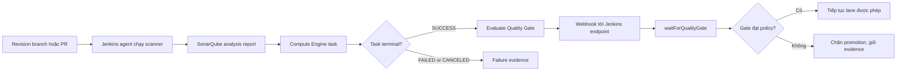

<Callout type="info" title="Phạm vi và giả định">
  Hướng dẫn này dùng SonarQube Scanner for Jenkins plugin, SonarQube Server hoặc SonarQube Cloud đã được tổ chức phê duyệt. Tên server, plugin, scanner, webhook, project key và credential ID chỉ là minh họa. Xác minh version, network, TLS, permission và behavior trên sandbox trước khi dùng cho release.
</Callout>

SonarQube tạo tín hiệu về chất lượng và security của source. Jenkins chạy scanner, lưu task context và chờ kết quả Quality Gate bất đồng bộ. Một stage tên `Sonar` không tự chứng minh analysis đã hoàn tất, webhook đã đến hay release được phép.

## Mục lục

- [Mục tiêu và mô hình](#mục-tiêu-và-mô-hình)
  - [Các thành phần và ranh giới](#các-thành-phần-và-ranh-giới)
  - [Server và Cloud](#server-và-cloud)
- [Kết nối, identity và project](#kết-nối-identity-và-project)
  - [Jenkins server configuration](#jenkins-server-configuration)
  - [Project key, branch và Pull Request](#project-key-branch-và-pull-request)
  - [Token, TLS và rotation](#token-tls-và-rotation)
- [Chạy scanner đúng ngữ cảnh](#chạy-scanner-đúng-ngữ-cảnh)
  - [Scanner khác Compute Engine](#scanner-khác-compute-engine)
  - [Maven, Gradle, CLI và Node](#maven-gradle-cli-và-node)
  - [Coverage và evidence](#coverage-và-evidence)
- [Webhook và Quality Gate bất đồng bộ](#webhook-và-quality-gate-bất-đồng-bộ)
  - [Endpoint, authenticity và delivery](#endpoint-authenticity-và-delivery)
  - [Trạng thái task và quyết định gate](#trạng-thái-task-và-quyết-định-gate)
- [Jenkins Pipeline chặn release trung thực](#jenkins-pipeline-chặn-release-trung-thực)
  - [Prerequisite và Jenkinsfile](#prerequisite-và-jenkinsfile)
  - [Timeout, abort, retry và unstable](#timeout-abort-retry-và-unstable)
  - [PR, branch bảo vệ và trust](#pr-branch-bảo-vệ-và-trust)
- [Evidence, retention và vận hành](#evidence-retention-và-vận-hành)
- [Lab local với kết quả giả](#lab-local-với-kết-quả-giả)
  - [Fixture CE và Quality Gate](#fixture-ce-và-quality-gate)
  - [Kết quả và cleanup có guard](#kết-quả-và-cleanup-có-guard)
- [Troubleshooting](#troubleshooting)
- [Checklist áp dụng](#checklist-áp-dụng)
- [Tự kiểm tra](#tự-kiểm-tra)
- [Nguồn chính thức](#nguồn-chính-thức)
- [Đọc tiếp](#đọc-tiếp)

## Mục tiêu và mô hình

Sau bài này, bạn có thể nối một revision Jenkins với project/branch/PR SonarQube, chạy scanner trên agent đúng toolchain, chờ Quality Gate qua webhook có deadline, và quyết định blocking hay advisory mà không làm build xanh giả. Khung policy rộng hơn nằm ở [Quality Gates](/docs/delivery/quality-gates).

### Các thành phần và ranh giới

| Thành phần | Trách nhiệm | Không tự chứng minh |
| --- | --- | --- |
| Scanner | Đọc source, binary và report để gửi analysis | Compute Engine đã xử lý task hoặc Quality Gate đã đạt. |
| SonarQube Server/Cloud | Lưu project, chạy Compute Engine và đánh giá Quality Gate | Jenkins agent, SCM trust hoặc artifact release đúng digest. |
| SonarQube Scanner for Jenkins plugin | Cấp connection vào `withSonarQubeEnv` và nhận Quality Gate webhook | Capability Jenkins core hay mọi scanner đã được cài. |
| Jenkins Pipeline | Chạy command, chờ task và quyết định flow | Token, TLS, project permission hay webhook tự đúng. |
| Webhook | Báo task/Gate result về Jenkins | Authentication của scanner hoặc branch protection SCM. |



Repository này có renderer Mermaid trong `source.config.ts`; sơ đồ mô tả flow, không phải bằng chứng runtime integration đã chạy.

### Server và Cloud

**SonarQube Server** là instance do tổ chức vận hành; **SonarQube Cloud** là dịch vụ SaaS. Cả hai đều dùng project, analysis, Compute Engine và Quality Gate theo capability/version tương ứng, nhưng URL, organization, authentication, network, plan và administration khác nhau.

| Điều cần xác định | Server | Cloud |
| --- | --- | --- |
| Endpoint | URL canonical của instance, có thể có context path/proxy | URL/organization chính thức của Cloud theo tài liệu hiện hành. |
| TLS/CA | Controller/agent trust CA nội bộ qua image/OS managed | Kiểm tra TLS công khai và egress policy. |
| Quản trị | Owner vận hành database, upgrade, plugin/edition và webhook route | Organization owner quản lý project/member/token theo dịch vụ. |
| Compatibility | Kiểm tra version Server, scanner và Jenkins plugin | Kiểm tra documented Cloud integration/scanner version và organization binding. |

Không thay Server bằng Cloud chỉ bằng cách đổi URL. Ghi loại dịch vụ, URL canonical, version/capability, owner và test evidence trong connection record.

## Kết nối, identity và project

### Jenkins server configuration

SonarQube Scanner for Jenkins plugin thêm cấu hình server vào Jenkins và step `withSonarQubeEnv`. Trên controller sandbox, tạo connection có tên minh họa `sonarqube-sandbox`, URL đã xác minh và credential reference do Jenkins quản lý. Plugin, Jenkins core, Java, scanner và global configuration là prerequisite runtime; pin/review chúng như dependency controller, không cài plugin chỉ để mẫu Jenkinsfile parse.

`withSonarQubeEnv('sonarqube-sandbox')` đặt environment connection trong closure cho scanner. Nó không cài scanner, không checkout source, không tự tạo project và không biến token thành an toàn cho code không tin cậy. Lấy exact snippet từ **Pipeline Syntax** của controller vì credential type/configuration có thể khác theo plugin version.

### Project key, branch và Pull Request

Project key là identity ổn định của project analysis. Chọn key reviewable, ownership rõ và không đổi theo mỗi branch/build. Mỗi analysis phải liên kết với revision SHA, scanner version, project key và branch/PR context; nếu không, Quality Gate có thể là kết quả của source khác.

- **Main/branch analysis:** gửi tên branch theo integration/scanner đã support. Branch protected sau merge thường là nơi hợp lý cho release blocking gate.
- **Pull Request analysis:** cần key/branch base và PR identity do scanner/integration chính thức hỗ trợ. Nó đánh giá thay đổi PR theo context PR, không tự thay branch analysis.
- **Không tự bịa property:** tên/availability các property branch/PR thay đổi theo scanner, edition/Cloud và build integration. Dùng scanner documentation/version của dự án, không chép property từ GitLab CI vào Jenkinsfile.

Từ Jenkins Multibranch, metadata PR/branch có thể do source plugin cung cấp. Xác minh source SHA, target/base và variables trên sandbox trước khi map sang scanner. PR từ fork vẫn là code không tin cậy; không cấp token có capability write, deploy hoặc release chỉ để analysis tiện hơn.

### Token, TLS và rotation

Token scanner là capability gửi analysis đến SonarQube, không phải biến để commit vào `sonar-project.properties`, Jenkinsfile, command line hay URL. Dùng Jenkins credential reference được connection/plugin hỗ trợ, scope hẹp ở folder/job, và chỉ cấp quyền tối thiểu theo project/organization. Service identity riêng tốt hơn token cá nhân hoặc administrator dùng chung.

- không `echo`, `printenv`, `set -x`, Groovy interpolation, `-Dsonar.token=...`, query URL hay debug HTTP có token;
- giữ TLS verification và CA trust đúng; không dùng `curl -k`, `ignoreSslErrors` hoặc tắt certificate check;
- ghi owner, purpose, project scope, credential ID/reference, expiry/review date và revoke path;
- rotate qua token mới trong sandbox, chuyển consumer có kiểm soát, xác minh analysis/webhook, rồi revoke token cũ;
- không chạy source PR/fork trên agent cùng user/workspace với lane có token release hoặc token SonarQube quyền rộng.

Masking console chỉ là defense-in-depth. Credential, agent trust, network egress và quyền sửa Jenkinsfile là các control riêng; xem [Credentials & Secrets](/docs/security/credentials-secrets).

## Chạy scanner đúng ngữ cảnh

### Scanner khác Compute Engine

Scanner chạy trên Jenkins agent: nó đọc checkout, build output và report rồi upload analysis. Upload thành công chỉ cho biết server đã nhận request/task reference. **Compute Engine (CE)** chạy sau đó ở SonarQube để xử lý analysis và tính Quality Gate. Vì CE bất đồng bộ, không suy luận `sh` scanner exit code `0` là Quality Gate pass.

CE task thường đi qua trạng thái chờ/chạy như `PENDING` hoặc `IN_PROGRESS`, rồi terminal `SUCCESS`, `FAILED` hay `CANCELED` theo API/version. Chỉ task `SUCCESS` mới là cơ sở để đọc Quality Gate result. `FAILED` hoặc `CANCELED` là evidence failure/inconclusive cần giữ; không retry scanner mù để biến CE failure thành pass.

### Maven, Gradle, CLI và Node

Chọn launcher theo build system đã dùng, pin phiên bản tool/plugin và ghi toolchain agent. Các command dưới chỉ là mẫu **sau khi** project, scanner và report path đã được xác minh; không có command nào tự tạo coverage hoặc project metadata đúng.

| Dự án | Launcher phù hợp | Điều phải pin/xác minh |
| --- | --- | --- |
| Maven | Maven goal của SonarScanner for Maven, ví dụ `mvn -B -ntp sonar:sonar` khi plugin/project đã cấu hình | Maven, JDK, plugin Maven, project key/connection và report coverage. |
| Gradle | Gradle task scanner do project/plugin Gradle cung cấp, thường là `./gradlew sonar` | Gradle wrapper, JDK, plugin/configuration và task name của version đang dùng. |
| Bất kỳ build system nào | SonarScanner CLI với `sonar-project.properties` hoặc properties được review | CLI binary/version, required binaries, project key và paths relative workspace. |
| JavaScript/TypeScript/Node | Dùng scanner integration đã support cho project Node; Node là runtime analyzer dependency chứ không phải lời hứa có một Jenkins step “Node scanner” chung | Node version, lockfile, test/coverage report và scanner documentation/version. |

Không thêm `-Dsonar.login`, `-Dsonar.token` hay token tương tự vào `sh` để chữa lỗi auth. Khi `withSonarQubeEnv` cung cấp credential theo integration runtime, để scanner đọc môi trường/cấu hình đã review mà không in biến. Nếu tool bắt buộc một secret trong argv, thiết kế lại integration hoặc dùng descriptor/file an toàn; đừng chấp nhận lộ token.

### Coverage và evidence

SonarQube đọc coverage report do test tool tạo; scanner không chạy unit test thay bạn. Chạy test trước scanner, kiểm report tồn tại, revision đúng và paths tương đối. Coverage/new-code threshold là policy Quality Gate hoặc policy release; không hạ rule cho một PR mà không review version policy.

Lưu evidence tối thiểu: revision SHA, project key, branch/PR identity, scanner/CE/gate outcome, policy version, Jenkins build URL và timestamp. Không archive toàn workspace, scanner cache, environment dump, raw HTTP log hoặc credential file. Report có thể chứa source path/metadata nhạy cảm nên access/retention phải phù hợp.

## Webhook và Quality Gate bất đồng bộ

### Endpoint, authenticity và delivery

Để `waitForQualityGate` nhận kết quả, cấu hình webhook ở SonarQube tới chính xác:

```text
$JENKINS_URL/sonarqube-webhook/
```

Dấu `/` cuối là một phần endpoint được Jenkins integration công bố. `JENKINS_URL` phải là URL public canonical mà SonarQube reach được qua DNS, TLS, reverse proxy và context path. Không thay nó bằng URL localhost của controller nếu SonarQube chạy ở mạng khác.

Webhook là capability plugin, không phải Jenkins core. Cài SonarQube Scanner for Jenkins plugin, cấu hình connection và webhook trên sandbox trước. Nếu version SonarQube/plugin hỗ trợ webhook secret/HMAC, cấu hình cùng secret theo tài liệu của hai đầu và kiểm tra verification behavior bằng delivery sandbox; không log secret/header/body. Một webhook secret xác thực callback, không cấp quyền scanner hoặc thay TLS/network policy.

Ghi delivery evidence đã redact: task/component logical reference, response outcome, delivery time, Jenkins build URL và plugin/server version. Không giữ token, secret header, full payload, query có secret hoặc console dump để “debug webhook”.

### Trạng thái task và quyết định gate

| Signal | Ý nghĩa | Quyết định Pipeline đề xuất |
| --- | --- | --- |
| CE `PENDING`/`IN_PROGRESS` | Analysis chưa có kết quả terminal | Chờ webhook trong `timeout`, không publish success. |
| CE `SUCCESS`, Gate `OK` | CE xử lý xong và gate đạt | Tiếp tục lane được policy cho phép. |
| CE `SUCCESS`, Gate không đạt | Analysis hoàn tất nhưng policy chất lượng không đạt | Chặn gate blocking bằng `abortPipeline: true`. |
| CE `FAILED` | Server không xử lý được analysis | Fail/inconclusive theo policy, giữ task evidence; không làm xanh. |
| CE `CANCELED` | Task bị hủy | Giữ abort/cancel semantics; điều tra trước rerun. |
| Không nhận webhook trước deadline | Không có bằng chứng gate hoàn tất | Timeout/fail closed cho release blocking; sửa delivery. |

Webhook có thể bị delivery lại hoặc đến sau khi Pipeline đã timeout. Plugin/server chịu trách nhiệm liên kết task context theo version; không tự poll một endpoint không được review, không trigger publish/deploy trong webhook callback và không retry `waitForQualityGate` như một test assertion. Khi callback bị duplicate, side effect release phải vẫn deduplicate theo revision/artifact digest.

## Jenkins Pipeline chặn release trung thực

### Prerequisite và Jenkinsfile

Mẫu cần Pipeline: Declarative, SonarQube Scanner for Jenkins plugin, connection Jenkins tên `sonarqube-sandbox`, scanner/toolchain phù hợp, agent `trusted-analysis-linux`, một webhook SonarQube tới `$JENKINS_URL/sonarqube-webhook/`, và project/report paths đã xác minh. `withSonarQubeEnv` và `waitForQualityGate` là steps của plugin, không phải Jenkins core.

```groovy
pipeline {
  agent none

  options {
    skipDefaultCheckout(true)
    timeout(time: 30, unit: 'MINUTES')
  }

  stages {
    stage('Unit test, coverage and Sonar analysis') {
      agent { label 'trusted-analysis-linux' }
      steps {
        checkout scm
        sh 'mvn -B -ntp test'
        // Scanner đọc source và coverage report trong chính workspace này.
        withSonarQubeEnv('sonarqube-sandbox') {
          sh 'mvn -B -ntp sonar:sonar'
        }
      }
      post {
        always {
          junit allowEmptyResults: false,
            testResults: 'target/surefire-reports/*.xml'
          archiveArtifacts allowEmptyArchive: true,
            artifacts: 'target/surefire-reports/**,target/site/**',
            fingerprint: true
        }
      }
    }

    stage('Quality Gate') {
      options {
        timeout(time: 10, unit: 'MINUTES')
      }
      steps {
        waitForQualityGate abortPipeline: true
      }
    }

    stage('Protected release action') {
      when {
        beforeAgent true
        branch 'main'
      }
      agent { label 'trusted-release-linux' }
      steps {
        checkout scm
        sh './ci/verify-release-policy'
      }
    }
  }
}
```

`waitForQualityGate` chạy sau scanner để plugin có task context. Quality Gate stage không cần checkout; nó chờ callback plugin trên controller. Unit test và scanner được giữ trong cùng stage/agent workspace để scanner đọc coverage report của revision vừa test. Protected release stage tự checkout revision selected by SCM vì `agent none` và stage agent có thể dùng workspace khác. Không chuyển source từ MR/fork vào release workspace qua `stash`/`unstash`.

### Timeout, abort, retry và unstable

`waitForQualityGate abortPipeline: true` làm Pipeline dừng khi plugin nhận Quality Gate không đạt, theo semantics plugin/version. Bao step bằng `timeout` để webhook sai URL, proxy/TLS lỗi hoặc CE treo không chờ vô hạn. Timeout/abort là interruption cần lan truyền; không bọc required gate bằng `catchError` rồi đi đến release.

Không dùng `retry` quanh scanner blocking, `waitForQualityGate`, test hoặc release chỉ để giảm build đỏ. Retry chỉ phù hợp với thao tác read-only/idempotent đã có bằng chứng lỗi tạm thời, số attempt hữu hạn và deadline. CE `FAILED`/`CANCELED` hoặc webhook timeout cần evidence, owner và remediation; rerun sau khi sửa nguyên nhân là build mới, không xóa failure cũ.

`UNSTABLE` chỉ phù hợp signal advisory đã được policy định nghĩa, ví dụ một metric mới đang baseline. Nó không được map thành `SUCCESS`, không được mở protected release, và phải giữ evidence/owner/expiry. [Xử lý lỗi và Retry](/docs/pipelines/error-handling) mô tả exit code, timeout, abort và `catchError` chi tiết.

### PR, branch bảo vệ và trust

PR có thể chạy analysis không secret trên agent cô lập nếu scanner/tooling không đòi capability release. Scanner token có quyền write/project vẫn là secret; chỉ cấp nó cho source trust tier đã được policy phê duyệt, không cho fork code tùy ý. Nếu không có một model token/agent/network an toàn cho fork, không chạy remote analysis từ fork; dùng static checks không secret hoặc một workflow sandbox khác.

Protected branch sau merge chạy gate blocking, rồi mới vào release lane. `branch 'main'` trong Jenkinsfile chỉ là điều kiện Multibranch; nó không tự chứng minh SCM branch protection hay source trust. Kết hợp SCM required review/status, Jenkins authorization, agent isolation, credential scope và artifact provenance. Không để PR pass Quality Gate cấp publish/sign/deploy capability.

## Evidence, retention và vận hành

Mỗi decision giữ project key logical, source SHA, branch/PR context, scanner/plugin/server version, CE task outcome, Quality Gate outcome, policy version, Jenkins build URL, webhook delivery result đã redact và owner. Tách retention cho task metadata, console log, coverage report, artifact và audit/change record. Không archive scanner cache hoặc full workspace vì có thể chứa data/credential tạm.

Alert cho token expiry, scanner upload error, CE failed/canceled, webhook delivery failure, Jenkins timeout, Quality Gate failure, duplicate delivery và drift version plugin/server. Khi update Server/Cloud configuration, scanner, Jenkins plugin, reverse proxy hay CA, chạy analysis và gate sandbox trước. Một build xanh trước update không chứng minh webhook mapping sau update vẫn đúng.

## Lab local với kết quả giả

Lab tạo fixture Compute Engine/Quality Gate JSON và Jenkinsfile text giả, rồi validator mô phỏng `pending`, `pass`, `fail` và `timeout`. Nó không có SonarQube, Jenkins, token, network, webhook listener hay scanner. Cần shell POSIX và Python 3; dùng `WORKSPACE` là parent local riêng do bạn sở hữu.

### Fixture CE và Quality Gate

```bash
set -eu
umask 077

: "${WORKSPACE:?Set WORKSPACE to a dedicated local lab parent}"
WORKSPACE="$(cd -- "$WORKSPACE" && pwd -P)"
test -d "$WORKSPACE"
LAB_PREFIX='jenkins-sonarqube-lab.'
LAB_ROOT="$(mktemp -d "${WORKSPACE%/}/${LAB_PREFIX}XXXXXX")"
LAB_ROOT="$(cd -- "$LAB_ROOT" && pwd -P)"
case "$LAB_ROOT" in
  "${WORKSPACE%/}/${LAB_PREFIX}"*) ;;
  *) printf 'Refuse unexpected lab path: %s\n' "$LAB_ROOT" >&2; exit 1 ;;
esac
[ "$(dirname -- "$LAB_ROOT")" = "$WORKSPACE" ] || {
  printf 'Refuse non-direct WORKSPACE child: %s\n' "$LAB_ROOT" >&2
  exit 1
}
: > "$LAB_ROOT/.lab-owned"

cat > "$LAB_ROOT/ce-pending.json" <<'EOF'
{"task":{"id":"training-task-pending","status":"PENDING","componentKey":"training:demo"}}
EOF
cat > "$LAB_ROOT/ce-success.json" <<'EOF'
{"task":{"id":"training-task-pass","status":"SUCCESS","componentKey":"training:demo"}}
EOF
cat > "$LAB_ROOT/gate-pass.json" <<'EOF'
{"projectStatus":{"status":"OK","conditions":[]}}
EOF
cat > "$LAB_ROOT/gate-fail.json" <<'EOF'
{"projectStatus":{"status":"ERROR","conditions":[{"metricKey":"new_coverage","status":"ERROR"}]}}
EOF
cat > "$LAB_ROOT/Jenkinsfile.fixture" <<'EOF'
pipeline {
  agent none
  stages {
    stage('Analysis') {
      steps {
        withSonarQubeEnv('sonarqube-sandbox') {
          sh 'mvn -B -ntp sonar:sonar'
        }
      }
    }
    stage('Gate') {
      options { timeout(time: 10, unit: 'MINUTES') }
      steps { waitForQualityGate abortPipeline: true }
    }
  }
}
EOF

python3 - "$LAB_ROOT" <<'PY'
import json
import pathlib
import sys

root = pathlib.Path(sys.argv[1])
pending = json.loads((root / 'ce-pending.json').read_text())
success = json.loads((root / 'ce-success.json').read_text())
passed = json.loads((root / 'gate-pass.json').read_text())
failed = json.loads((root / 'gate-fail.json').read_text())
jenkinsfile = (root / 'Jenkinsfile.fixture').read_text()
assert pending['task']['status'] == 'PENDING'
assert success['task']['status'] == 'SUCCESS'
assert passed['projectStatus']['status'] == 'OK'
assert failed['projectStatus']['status'] == 'ERROR'
assert "withSonarQubeEnv('sonarqube-sandbox')" in jenkinsfile
assert 'waitForQualityGate abortPipeline: true' in jenkinsfile
assert 'timeout(time: 10' in jenkinsfile
print('pending: waiting (simulated)')
print('pass: Quality Gate OK (simulated)')
print('fail: Quality Gate ERROR; blocking (simulated)')
print('timeout: no webhook before deadline; fail closed (simulated)')
PY
printf 'Lab fixture directory: %s\n' "$LAB_ROOT"
```

Kết quả mong đợi là bốn dòng simulated outcome. Fixture `fail` vẫn làm validator thành công vì nó xác minh policy phải **nhận biết** `ERROR`; nó không mô phỏng Jenkins build xanh. Lab không xác minh webhook endpoint, HMAC/secret verification, CE queue, SonarQube UI, scanner command, token, TLS hay plugin runtime.

### Kết quả và cleanup có guard

Chạy cleanup trong cùng shell sau khi đọc fixture. Guard canonicalize `WORKSPACE` và `LAB_ROOT`, xác nhận prefix, marker và quan hệ child trực tiếp trước `rm -rf`. Không dùng block này cho `JENKINS_HOME`, workspace build thật, volume, source repository hay path người dùng nhập.

```bash
set -eu
: "${WORKSPACE:?Run the creation block in this shell}"
: "${LAB_ROOT:?Run the creation block in this shell}"
WORKSPACE="$(cd -- "$WORKSPACE" && pwd -P)"
test -d "$WORKSPACE"
test -d "$LAB_ROOT"
LAB_ROOT="$(cd -- "$LAB_ROOT" && pwd -P)"
LAB_PREFIX='jenkins-sonarqube-lab.'

case "$LAB_ROOT" in
  "${WORKSPACE%/}/${LAB_PREFIX}"*)
    [ "$(dirname -- "$LAB_ROOT")" = "$WORKSPACE" ] || {
      printf 'Refuse cleanup outside direct WORKSPACE child: %s\n' "$LAB_ROOT" >&2
      exit 1
    }
    test -f "$LAB_ROOT/.lab-owned"
    test -f "$LAB_ROOT/ce-pending.json"
    rm -rf -- "$LAB_ROOT"
    printf 'Removed guarded SonarQube training fixture.\n'
    ;;
  *)
    printf 'Refuse cleanup outside lab prefix: %s\n' "$LAB_ROOT" >&2
    exit 1
    ;;
esac
```

## Troubleshooting

| Dấu hiệu | Kiểm tra bằng evidence | Hành động an toàn |
| --- | --- | --- |
| `withSonarQubeEnv` không được nhận diện | Plugin short name/version, Pipeline Syntax, controller log | Cài/review plugin qua change process; không thay bằng secret hard-code. |
| Scanner upload lỗi auth/TLS | URL canonical, CA, service identity scope/expiry, agent egress và audit thời điểm | Sửa trust/token scope, rotate khi cần; không in token hoặc tắt TLS. |
| Scanner exit `0` nhưng Gate chưa có | CE task reference/status, project key, webhook delivery, plugin/server version | Chờ `waitForQualityGate` trong timeout; không suy diễn scanner pass là gate pass. |
| `waitForQualityGate` timeout | `$JENKINS_URL/sonarqube-webhook/`, trailing slash, DNS/proxy/TLS, callback response | Sửa callback trên sandbox, giữ build timeout/failure; không bypass gate. |
| Gate fail nhưng release vẫn chạy | `abortPipeline`, `catchError`, `when`, build/stage result và policy | Để exception chặn flow; tách advisory khỏi required gate. |
| PR analysis đè branch result | Project key, PR/branch properties, source/base SHA và scanner capability | Sửa mapping theo supported integration; không dùng property không được version support. |
| CE `FAILED`/`CANCELED` | Task metadata, server health/log đã redact, capacity và version change | Ghi inconclusive/failure, sửa nguyên nhân rồi rerun mới; không làm xanh lần cũ. |
| Report/log có secret hoặc source nhạy cảm | Archive glob, scanner debug, environment dump và credential scope | Dừng publish, redact/rotate theo incident policy, chỉ giữ evidence tối thiểu. |

## Checklist áp dụng

- [ ] Server hoặc Cloud, URL canonical, version/capability, owner, TLS/CA, network/egress và sandbox evidence được ghi rõ.
- [ ] SonarQube Scanner for Jenkins, Pipeline, scanner/build tool, JDK/Node và agent image có version pin, advisory review và compatibility test.
- [ ] Project key ổn định; branch/PR/source/base revision mapping dùng property/integration được version hiện hành support.
- [ ] Token nằm trong Jenkins credential/configuration scope hẹp, có owner/rotation/revoke; không ở Jenkinsfile, argv, URL, log, artifact hay fixture.
- [ ] Scanner command, test và coverage report chạy theo toolchain thật; scanner exit code không bị gọi sai là Quality Gate pass.
- [ ] SonarQube webhook trỏ đúng `$JENKINS_URL/sonarqube-webhook/`, có TLS/proxy/delivery verification và secret/HMAC khi supported/configured.
- [ ] `waitForQualityGate abortPipeline: true` chạy sau scanner, trong `timeout`; timeout, abort, CE fail/cancel và gate fail không biến thành success.
- [ ] Retry không che test/scanner/gate/release failure; duplicate delivery/rebuild không tạo side effect release trùng.
- [ ] PR/fork không tin cậy không nhận capability release; protected branch sau merge mới vào lane blocking/release đã tách trust.
- [ ] Evidence có revision/project/task/gate/policy/plugin reference và retention/ACL; report/archive không chứa secret hay full workspace không cần thiết.
- [ ] Lab chỉ tạo JSON/Jenkinsfile fixture local với marker/prefix/direct-parent guard; không gọi SonarQube/Jenkins/webhook thật.

## Tự kiểm tra

1. Scanner exit `0` chứng minh gì, và tại sao chưa đủ để release? Nêu vai trò Compute Engine, webhook và Quality Gate.
2. Vì sao `waitForQualityGate abortPipeline: true` cần `timeout`, và timeout không được bọc để release tiếp?
3. Token scanner, webhook secret và credential deploy khác nhau ở capability nào? Vì sao không dùng một token chung?
4. PR source SHA và branch protected sau merge cần project/analysis context khác nhau ra sao? Khi nào không cấp scanner token cho fork?
5. CE `CANCELED` khác Quality Gate `ERROR` thế nào, và evidence/decision nào phải giữ cho từng case?
6. Khi webhook delivery bị lặp, thao tác nào có thể quan sát lại và side effect release nào phải deduplicate theo revision/digest?

## Nguồn chính thức

- [SonarQube Jenkins integration](https://docs.sonarsource.com/sonarqube-server/analyzing-source-code/ci-integration/jenkins-integration/) — `withSonarQubeEnv`, `waitForQualityGate` và webhook endpoint theo version.
- [SonarQube webhooks](https://docs.sonarsource.com/sonarqube-server/project-administration/webhooks/) — delivery, secret và callback behavior theo version.
- [SonarQube analysis parameters](https://docs.sonarsource.com/sonarqube-server/analyzing-source-code/analysis-parameters/) — project, branch/PR và scanner parameters được support.
- [SonarScanner for Maven](https://docs.sonarsource.com/sonarqube-server/analyzing-source-code/scanners/sonarscanner-for-maven/) và [SonarScanner for Gradle](https://docs.sonarsource.com/sonarqube-server/analyzing-source-code/scanners/sonarscanner-for-gradle/) — launcher/toolchain theo version.
- [SonarScanner CLI](https://docs.sonarsource.com/sonarqube-server/analyzing-source-code/scanners/sonarscanner/) — CLI configuration và execution.
- [SonarQube Scanner for Jenkins plugin](https://plugins.jenkins.io/sonar/) — plugin capability/compatibility cần xác minh runtime.
- [Jenkins Pipeline Syntax](https://www.jenkins.io/doc/book/pipeline/syntax/) — Declarative `timeout`, `when`, `post` và snippet runtime.
- [Jenkins Pipeline: Basic Steps](https://www.jenkins.io/doc/pipeline/steps/workflow-basic-steps/) — timeout, retry, failure và interruption semantics.
- [Jenkins: Using credentials](https://www.jenkins.io/doc/book/using/using-credentials/) — scope, permission và lifecycle credential.

## Đọc tiếp

<Cards>
  <Card title="Quality Gates" href="/docs/delivery/quality-gates" description="Thiết kế blocking/advisory, evidence và release policy không xanh giả." />
  <Card title="Kiểm thử Jenkinsfile" href="/docs/pipelines/testing" description="Tách static test khỏi controller, plugin và agent runtime." />
  <Card title="Xử lý lỗi và Retry" href="/docs/pipelines/error-handling" description="Giữ timeout, abort và failure trung thực trong Pipeline." />
  <Card title="Credentials trong Pipeline" href="/docs/pipelines/credentials" description="Thu hẹp binding và tránh lộ secret qua argv, log hay artifact." />
</Cards>
