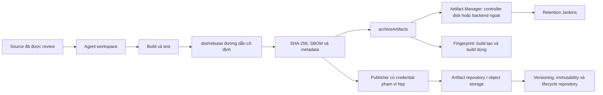

Artifact là đầu ra có thể phân phối hoặc dùng để điều tra của một build, ví dụ gói phát hành, report kiểm thử, checksum hay SBOM. Trang này phân biệt nơi file sống trong Pipeline với nơi nó được giữ lâu dài, để tránh vừa làm đầy controller vừa biến dữ liệu không tin cậy thành kênh phát tán.

<Callout type="info" title="Phạm vi và giả định">
  Ví dụ dùng Declarative Pipeline trên Linux agent, Jenkins LTS có Pipeline: Basic Steps và Pipeline: Declarative. `archiveArtifacts`, `stash` và `fingerprint` là Pipeline steps; tham số hay hành vi chính xác phải được xác nhận trong **Pipeline Syntax → Snippet Generator** trên controller đang chạy. External storage chỉ hoạt động khi Artifact Manager plugin/backend hoặc artifact repository tương ứng đã được cài, cấu hình và phê duyệt.
</Callout>

## Mục lục

- [Bốn khái niệm không thể thay thế nhau](#bốn-khái-niệm-không-thể-thay-thế-nhau)
  - [So sánh nhanh](#so-sánh-nhanh)
- [Luồng artifact và ranh giới dữ liệu](#luồng-artifact-và-ranh-giới-dữ-liệu)
- [Archive từ workspace](#archive-từ-workspace)
  - [Chọn file bằng include, exclude và default excludes](#chọn-file-bằng-include-exclude-và-default-excludes)
  - [Jenkinsfile archive an toàn](#jenkinsfile-archive-an-toàn)
- [Bảo mật, toàn vẹn và quyền truy cập](#bảo-mật-toàn-vẹn-và-quyền-truy-cập)
  - [Đầu ra không tin cậy, symlink và path traversal](#đầu-ra-không-tin-cậy-symlink-và-path-traversal)
  - [Quyền file, bất biến và bằng chứng phát hành](#quyền-file-bất-biến-và-bằng-chứng-phát-hành)
  - [Secret không phải artifact](#secret-không-phải-artifact)
- [Fingerprint: truy vết chứ không ký số](#fingerprint-truy-vết-chứ-không-ký-số)
- [Retention và build discard policy](#retention-và-build-discard-policy)
- [External artifact storage và artifact repository](#external-artifact-storage-và-artifact-repository)
  - [Chọn đúng cơ chế](#chọn-đúng-cơ-chế)
  - [Upload download, retry và idempotency](#upload-download-retry-và-idempotency)
  - [Chi phí, quota và khôi phục](#chi-phí-quota-và-khôi-phục)
- [Lab sandbox: archive một artifact vô hại](#lab-sandbox-archive-một-artifact-vô-hại)
  - [Chuẩn bị và Jenkinsfile](#chuẩn-bị-và-jenkinsfile)
  - [Kết quả mong đợi và cleanup](#kết-quả-mong-đợi-và-cleanup)
- [Troubleshooting](#troubleshooting)
- [Checklist trước khi publish](#checklist-trước-khi-publish)
- [Nguồn Jenkins chính thức](#nguồn-jenkins-chính-thức)
- [Đọc tiếp](#đọc-tiếp)

## Bốn khái niệm không thể thay thế nhau

Một file có thể đi qua cả bốn cơ chế, nhưng mục đích của chúng khác nhau. Chọn sai cơ chế thường tạo retention khó đoán hoặc làm một build phụ thuộc vào workspace đã biến mất.

### So sánh nhanh

| Cơ chế | File nằm ở đâu? | Vòng đời chính | Dùng cho | Không dùng cho |
| --- | --- | --- | --- | --- |
| **Workspace** | Filesystem của agent đang chạy build | Có thể bị tái dùng, dọn hoặc mất khi agent động kết thúc | Checkout, build, test tạm thời | Lưu đầu ra để tải lại sau này |
| **`stash` / `unstash`** | Kho stash tạm của Jenkins hoặc Artifact Manager | Thường hết khi Pipeline run kết thúc; có thể giữ số run giới hạn để hỗ trợ restart | Chuyển ít file giữa stage/agent trong *cùng* Pipeline | Phát hành, lưu file lớn, chia sẻ liên job |
| **`archiveArtifacts`** | Artifact của build do Artifact Manager hiện hành lưu | Theo retention artifact/build của Jenkins | Tải report hay gói của một build, điều tra và fingerprint | Registry package đầy đủ hay cache build |
| **External artifact repository** | Repository như Nexus/Artifactory hoặc object store có policy riêng | Theo version, lifecycle và retention của repository | Phân phối package/version giữa pipeline, môi trường và tổ chức | Thay thế lịch sử build/log của Jenkins |

`stash` tối ưu cho sự liên tục của luồng Pipeline, không phải kho lưu trữ lâu dài. Chỉ stash những input nhỏ đã biết; nén/di chuyển lượng dữ liệu lớn có thể làm chậm agent, controller hoặc backend. `unstash` chỉ khôi phục vào workspace của stage sau, vì vậy stage đó vẫn phải kiểm tra checksum và không được coi workspace là nguồn phát hành chuẩn.

Workspace cũng không phải artifact store. Agent ephemeral, cleanup định kỳ, đổi node hoặc hai build dùng chung workspace có thể làm file biến mất hay lẫn với file cũ. Xem [Chọn agent cho Pipeline](/docs/pipelines/agents) và [Tổng quan Jenkins Agent](/docs/agents/overview) để hiểu executor, agent và vòng đời workspace.

## Luồng artifact và ranh giới dữ liệu



Agent tạo file trong workspace. `archiveArtifacts` thu file khớp mẫu rồi chuyển trách nhiệm giữ file cho **Artifact Manager**. Với backend mặc định, artifact được lưu trong `JENKINS_HOME` trên controller; tải archive lớn, I/O và retention dài vì thế trực tiếp gây áp lực disk, backup và hiệu năng controller. Với một Artifact Manager plugin, ví dụ **Artifact Manager on S3**, Jenkins có thể lưu artifact/stash ở object storage thay vì controller disk. Đây là thay đổi backend của Jenkins artifact, không tự biến artifact thành package Maven/npm hay cung cấp workflow promotion.

<Callout type="warn" title="Không để controller thành build worker hay kho file vô hạn">
  Controller vẫn giữ metadata build và thường phải phục vụ listing/download, kể cả khi bytes ở backend ngoài. Đo dung lượng, I/O, lỗi upload/download và thời gian restore; xem thêm [Kiến trúc Jenkins](/docs/getting-started/architecture), [Monitoring & Metrics](/docs/administration/monitoring) và [Hiệu năng Jenkins](/docs/administration/performance).
</Callout>

## Archive từ workspace

`archiveArtifacts` lấy file từ workspace của build hiện tại. Mẫu include/exclude được hiểu theo kiểu Ant và tương đối với workspace, không phải đường dẫn tuyệt đối của agent. Luôn tạo đầu ra vào một thư mục phát hành cố định như `dist/release/`, rồi archive đúng thư mục đó.

### Chọn file bằng include, exclude và default excludes

| Tham số | Mục đích | Mặc định / thực hành an toàn |
| --- | --- | --- |
| `artifacts` | Include pattern, có thể là nhiều mẫu ngăn bằng dấu phẩy | Bắt đầu hẹp, ví dụ `dist/release/**`; không dùng `**/*` trên workspace. |
| `excludes` | Loại bớt file trong include pattern | Dùng cho file tạm hay debug đã biết, ví dụ `dist/release/**/*.tmp`. Exclude không thay thế việc đặt output vào thư mục riêng. |
| `defaultExcludes` | Áp dụng danh sách Ant default excludes | Mặc định là `true`. Giữ `true` trừ khi có lý do được review để thu một file bị loại. |
| `allowEmptyArchive` | Cho build tiếp tục nếu không có file khớp | Mặc định là `false`. Giữ `false` cho release để thiếu output làm build fail rõ ràng; chỉ bật cho report tùy chọn. |
| `onlyIfSuccessful` | Chỉ archive khi build thành công | Cân nhắc `true` cho package phát hành. Với report chẩn đoán, có thể archive ở `post { always { ... } }` với pattern hẹp. |
| `followSymlinks` | Điều khiển việc theo symbolic link khi step/plugin cung cấp tham số này | Đặt `false` cho output không tin cậy, và xác nhận khả năng trên bản Jenkins/plugin hiện hành trong Snippet Generator. |

`defaultExcludes` không phải bộ lọc secret. Nó chủ yếu loại các tên file hệ thống/VCS theo quy ước Ant. Nếu build vô tình tạo `dist/release/token.txt`, mẫu rộng vẫn có thể archive nó. Cho phép archive phải dựa trên danh sách output mong đợi, review code tạo output và quét secret/SBOM theo policy, không dựa vào tên ẩn.

### Jenkinsfile archive an toàn

Ví dụ sau chỉ archive ba loại file được tạo tại đường dẫn cố định. `allowEmptyArchive: false` khiến thiếu package trở thành lỗi thay vì build xanh nhưng không có artifact. `fingerprint: true` tạo fingerprint cho artifact được archive; phần sau giải thích giới hạn của fingerprint.

```groovy
pipeline {
  agent { label 'linux && build-tools' }

  options {
    buildDiscarder(logRotator(
      daysToKeepStr: '30',
      numToKeepStr: '30',
      artifactDaysToKeepStr: '14',
      artifactNumToKeepStr: '10'
    ))
  }

  stages {
    stage('Build release output') {
      steps {
        sh '''#!/bin/sh
          set -eu
          mkdir -p dist/release
          ./scripts/build-release --output dist/release/app-1.2.3.tar.gz
          sha256sum dist/release/app-1.2.3.tar.gz > dist/release/SHA256SUMS
          ./scripts/create-sbom --output dist/release/sbom.cdx.json
        '''
      }
    }

    stage('Archive') {
      steps {
        archiveArtifacts(
          artifacts: 'dist/release/app-1.2.3.tar.gz,dist/release/SHA256SUMS,dist/release/sbom.cdx.json',
          excludes: 'dist/release/**/*.tmp',
          defaultExcludes: true,
          allowEmptyArchive: false,
          onlyIfSuccessful: true,
          followSymlinks: false,
          fingerprint: true
        )
      }
    }
  }
}
```

Thay `./scripts/build-release` và `./scripts/create-sbom` bằng lệnh đã được review của dự án. Nếu bản step không có `followSymlinks`, đừng tự suy diễn: nâng/cấu hình plugin theo quy trình vận hành hoặc chặn symlink ở bước build rồi xác minh bằng test sandbox. Nếu dùng `post` để lưu report khi test fail, xem cách giữ failure signal tại [Xử lý lỗi và Retry](/docs/pipelines/error-handling).

## Bảo mật, toàn vẹn và quyền truy cập

### Đầu ra không tin cậy, symlink và path traversal

Artifact có thể do dependency, test, pull request hoặc tool sinh ra. Vì vậy output của build từ nguồn không tin cậy cũng không tin cậy. Không archive toàn bộ workspace, `.git`, home directory hay một path do input người dùng/branch name điều khiển. Đặc biệt, không ghép trực tiếp biến PR, URL hay tên file không được chuẩn hóa vào include pattern hoặc destination upload.

Symbolic link có thể dẫn archive hay publisher ra ngoài thư mục dự kiến. Dùng thư mục output mới tạo, path cố định và tắt theo symlink khi step hỗ trợ. Trước khi publish/extract, kiểm tra manifest file; công cụ giải nén phía nhận phải từ chối entry `../`, path tuyệt đối và link bất thường để tránh path traversal. Chạy build PR/fork trên agent tách biệt, không dùng credential publish hoặc quyền ghi vào bucket/repository production. Ranh giới credential và nguồn code được trình bày ở [Credentials trong Pipeline](/docs/pipelines/credentials).

### Quyền file, bất biến và bằng chứng phát hành

Không giả định mode của file còn nguyên sau khi đi qua archive, object storage hay công cụ giải nén; backend và định dạng có thể xử lý metadata khác nhau. Trước khi đóng gói, đặt quyền tối thiểu cần thiết (ví dụ data `0644`, executable được review `0755`), không đóng gói file private chỉ vì nó đọc được trong workspace. Khi tải/xả artifact, dùng thư mục cô lập, owner không đặc quyền và `umask` phù hợp; xác minh tên, owner, mode và checksum trước khi dùng.

Một release nên có tối thiểu các bằng chứng sau:

- **Checksum mạnh:** tạo và công bố SHA-256/SHA-512 cho đúng byte của package. Jenkins fingerprint dùng MD5 lịch sử không thay thế checksum mật mã.
- **SBOM và metadata:** lưu SBOM (ví dụ CycloneDX/SPDX), revision SCM, version, thời điểm build, toolchain và provenance theo chuẩn của tổ chức. Metadata phải mô tả artifact, không chứa token hay URL có chữ ký ngắn hạn.
- **Bất biến:** repository/object store phải từ chối ghi đè version release đã publish. Dùng version bất biến, policy retention/lock phù hợp và tài khoản CI chỉ có quyền ghi namespace cần thiết. Không dùng lại `latest` làm bằng chứng phát hành.
- **Xác minh khi download:** lấy checksum/manifest từ kênh đáng tin, kiểm SHA-256 trước deploy hay test tiếp theo và ghi nhận kết quả audit.

### Secret không phải artifact

Secret, credential, private key, kubeconfig, token, file binding tạm và `.env` không bao giờ là artifact, dù chúng được dùng để tạo artifact. Không archive chúng, không để chúng trong `dist/release/`, không nhúng chúng vào report/SBOM/metadata và không in chúng để debug. Masking chỉ giảm nguy cơ lộ log, không biến secret thành dữ liệu an toàn để lưu hay upload.

Credential upload/download phải được nạp trong scope hẹp bằng Jenkins Credentials. Token cần quyền nhỏ nhất: publisher chỉ ghi repository/path của nó; consumer chỉ đọc version cần dùng. Bật TLS, xác minh CA/hostname, log actor/repository/version/checksum thay vì header xác thực, và review audit log của Jenkins lẫn repository. Chi tiết binding an toàn nằm tại [Credentials trong Pipeline](/docs/pipelines/credentials).

## Fingerprint: truy vết chứ không ký số

Fingerprint là metadata Jenkins liên kết một file với build **đã tạo** và các build **đã dùng** file đó. Jenkins tính fingerprint dựa trên MD5 để nhận diện cùng nội dung byte-for-byte trong lịch sử Jenkins. Khi một Pipeline archive với `fingerprint: true`, Jenkins ghi association từ file đến build producer. Step `fingerprint` riêng cũng có thể ghi file đã tiêu thụ ở build downstream.

```groovy
stage('Record consumed dependency') {
  steps {
    sh '''#!/bin/sh
      set -eu
      test -f vendor/input-library-4.5.6.jar
      sha256sum vendor/input-library-4.5.6.jar
    '''
    fingerprint targets: 'vendor/input-library-4.5.6.jar', recordArtifacts: false
  }
}
```

`recordArtifacts: false` chỉ ghi dấu vết; nó không làm file thành artifact tải được. Sau đó, trang fingerprint có thể trả lời build nào đã tạo/đã dùng cùng bytes, hữu ích khi đánh giá tác động của một dependency hay điều tra provenance nội bộ.

Fingerprint không chứng minh file an toàn, không ký phát hành, không thay thế SHA-256/Sigstore/chữ ký theo policy và không ép downstream phải dùng đúng file. Khi cần chuỗi cung ứng đáng tin, lưu checksum mạnh, chữ ký/provenance và phiên bản bất biến cùng artifact; dùng fingerprint như một chỉ mục truy vết bổ sung.

## Retention và build discard policy

Retention là policy giữ lại **record build** và **bytes artifact** theo thời gian hoặc số lượng. `buildDiscarder(logRotator(...))` trên Jenkinsfile giúp policy đi cùng source, nhưng controller có thể có global policy, folder policy, plugin policy hay ngoại lệ compliance. Xác nhận policy có hiệu lực trong UI và bằng build sandbox; đừng cho rằng mọi job thừa kế y hệt nhau.

Trong ví dụ archive, Jenkins giữ tối đa 30 build record/30 ngày, còn artifact giữ tối đa 10 bản/14 ngày, tùy điều kiện nào đến trước. Khi artifact hết hạn nhưng record build còn, người điều tra có thể thấy build metadata/log mà không còn file tải được. Ngược lại, giữ artifact rất lâu làm controller disk, object storage, backup và thời gian restore tăng lên.

Thiết kế retention từ câu hỏi vận hành thay vì một số mặc định:

| Loại dữ liệu | Gợi ý policy | Lý do |
| --- | --- | --- |
| Report CI và log chẩn đoán | Ngắn, theo cửa sổ điều tra incident | Giá trị giảm nhanh, có thể nhiều file nhỏ. |
| Package release đã publish | Giữ theo release/compliance ở repository ngoài | Jenkins archive là bản tiện điều tra, không phải bản ghi phát hành duy nhất. |
| Artifact lớn hoặc cache | Không archive mặc định; dùng cache/repository/object store có lifecycle | Giảm egress, I/O và chi phí `JENKINS_HOME`. |
| Fingerprint metadata | Giữ theo nhu cầu truy vết, đồng bộ với retention build | Nếu build liên quan bị xóa quá sớm, lineage trở nên kém hữu ích. |

Đặt quota theo job/team/repository, dashboard dung lượng và alert trước ngưỡng disk/object-store. Đánh giá số byte mỗi build, tần suất, thời gian giữ, bản sao backup, API/list request và egress download; giá storage rẻ vẫn có thể kéo theo chi phí restore hay truy xuất cao. Kiểm tra backup và phục hồi `JENKINS_HOME` theo [Backup & Restore Jenkins](/docs/administration/backup-restore), còn capacity/độ trễ cần được theo dõi qua [Hiệu năng Jenkins](/docs/administration/performance).

## External artifact storage và artifact repository

### Chọn đúng cơ chế

Có hai lớp external thường bị gọi chung là “external artifact storage”. Chúng bổ sung nhau, không đồng nghĩa.

| Lựa chọn | Nó giải quyết gì? | Khi nên dùng | Lưu ý |
| --- | --- | --- | --- |
| **Artifact Manager plugin** | Đổi nơi Jenkins lưu archive/stash, chẳng hạn object storage | Archive/stash làm controller disk hoặc backup chịu tải, nhưng UX Jenkins vẫn phù hợp | Xác minh core LTS, plugin, backend IAM/bucket policy, encryption, lifecycle và restore. Ví dụ thường gặp là Artifact Manager on S3; không phải Jenkins core. |
| **Artifact repository** | Publish/resolve package theo coordinate, version, checksum và promotion | Nhiều job/đội/môi trường cần tiêu thụ release, Maven/npm/container hay generic package | Nexus/Artifactory/registry/object store cần policy version, quyền, audit và lifecycle riêng; Jenkins không quản lý thay. |

Dùng external storage khi artifact lớn/nhiều, nhiều agent ephemeral, retention dài, controller disk gần ngưỡng, backup `JENKINS_HOME` quá nặng, hoặc cần phân phối qua vùng/đội khác. Không chuyển ra ngoài chỉ để né policy: phải có owner, encryption, IAM, logging, quota, lifecycle, restore drill và kế hoạch nếu plugin/backend không sẵn sàng.

### Upload download, retry và idempotency

Ví dụ này giả định **HTTP Request Plugin** phiên bản đã được phê duyệt và tương thích Jenkins LTS hiện hành, cùng artifact repository sandbox chấp nhận HTTPS Basic authentication cho service account. Credential `artifact-repository-uploader` là Jenkins **Username with password** credential có quyền ghi đúng namespace; xác nhận step `httpRequest`, kiểu credential và các tham số khả dụng trong **Pipeline Syntax → Snippet Generator** của controller trước khi dùng. Địa chỉ `.invalid` chỉ là placeholder cố định.

```groovy
stage('Publish to approved repository') {
  steps {
    script {
      def response = httpRequest(
        authentication: 'artifact-repository-uploader',
        consoleLogResponseBody: false,
        contentType: 'APPLICATION_OCTETSTREAM',
        httpMode: 'PUT',
        ignoreSslErrors: false,
        timeout: 30,
        uploadFile: 'dist/release/app-1.2.3.tar.gz',
        url: 'https://repository.example.invalid/releases/app/1.2.3/app-1.2.3.tar.gz',
        validResponseCodes: '200:201,204'
      )
      echo "Published immutable release path; HTTP status ${response.status}"
    }
  }
}
```

`authentication` chỉ là **credential ID**. HTTP Request Plugin lấy username/password từ Jenkins credential store trong JVM để tạo request; Jenkinsfile không nạp secret vào biến Groovy hay shell, không tạo process `curl`, và không đưa secret vào argv, URL, log, artifact hoặc workspace. Scope chỉ là step upload; sau step plugin không để lại file credential cần cleanup. `consoleLogResponseBody: false` giảm nguy cơ response chứa dữ liệu nhạy cảm bị in ra, nhưng không thay thế quyền tối thiểu hay review log/audit.

Mẫu cố ý chỉ nhận mã thành công của lần publish mới. Với retry, chỉ bọc request bằng `retry` sau khi repository đã xác nhận semantics cho `PUT` vào key version bất biến. Nếu timeout khiến client không biết server đã nhận bytes, trước lần gửi lại hãy dùng chính client/step credential-aware để gọi `HEAD` hoặc API metadata của repository, đối chiếu size và SHA-256 với `SHA256SUMS`. Chỉ coi `409`/"already exists" là idempotent khi metadata xác nhận cùng nội dung; nếu khác, dừng và điều tra. Không dùng `POST` tạo version mới, không xóa hay ghi đè artifact production để thử lại.

Download cũng dùng client/plugin credential-aware hoặc credential được repository hỗ trợ, với TLS và quyền read-only scope hẹp. Không truyền token, password hay private key qua argv, custom header được shell mở rộng, URL query hoặc log; không đặt chúng trong artifact hay workspace. Audit cần ghi actor, credential ID, repository path, version, checksum, HTTP status và thời điểm — không ghi giá trị xác thực. Xem [Credentials trong Pipeline](/docs/pipelines/credentials) và [Xử lý lỗi và Retry](/docs/pipelines/error-handling) để thiết kế scope và failure behavior.

### Chi phí, quota và khôi phục

External backend giảm bytes trên controller nhưng tăng dependency mạng, IAM và độ trễ. Theo dõi tỷ lệ upload/download fail, retry count, latency, bytes theo job, quota denial, số object không có manifest và egress. Bất kỳ alert nào cũng cần runbook: phân biệt controller/job lỗi, agent mất mạng, token hết hạn, quota, object lifecycle đã xóa hoặc backend outage.

Retention Jenkins, Artifact Manager và repository/object lifecycle có thể không đồng bộ. Ví dụ Jenkins còn build record nhưng object đã bị lifecycle xóa, hoặc repository còn release mà Jenkins đã dọn archive. Chốt nguồn chuẩn cho từng loại artifact, giữ checksum/metadata đủ lâu, định kỳ thử download/verify trong sandbox, và ghi rõ RPO/RTO. Restore controller không tự khôi phục object bị xóa ở backend; phục hồi phải bao gồm quyền truy cập, bucket/repository, key/encryption và manifest. Quy trình nền tảng nằm tại [Backup & Restore Jenkins](/docs/administration/backup-restore).

## Lab sandbox: archive một artifact vô hại

Lab này tạo một file text, checksum và SBOM JSON tối thiểu trong workspace lab. Nó không dùng credential, network, dữ liệu thật hay lệnh xóa ngoài workspace. Chạy trên job Pipeline sandbox với Linux agent; kiểm tra Pipeline: Basic Steps trước khi chạy.

### Chuẩn bị và Jenkinsfile

Tạo một Pipeline job mới, dán Jenkinsfile sau rồi chạy **Build Now**. Tên `demo-artifact` và nội dung file đều vô hại. `post { always { deleteDir() } }` chỉ dọn workspace mà build lab đang được cấp sau khi archive hoàn tất.

```groovy
pipeline {
  agent { label 'linux' }

  stages {
    stage('Create harmless output') {
      steps {
        sh '''#!/bin/sh
          set -eu
          mkdir -p dist/release
          printf 'jenkins artifact lab\n' > dist/release/demo-artifact.txt
          sha256sum dist/release/demo-artifact.txt > dist/release/SHA256SUMS
          printf '{"bomFormat":"CycloneDX","specVersion":"1.5","components":[]}\n' \
            > dist/release/sbom.cdx.json
        '''
      }
    }

    stage('Archive and fingerprint') {
      steps {
        archiveArtifacts(
          artifacts: 'dist/release/demo-artifact.txt,dist/release/SHA256SUMS,dist/release/sbom.cdx.json',
          defaultExcludes: true,
          allowEmptyArchive: false,
          onlyIfSuccessful: true,
          followSymlinks: false,
          fingerprint: true
        )
      }
    }
  }

  post {
    always {
      deleteDir()
    }
  }
}
```

### Kết quả mong đợi và cleanup

Build phải có trạng thái `SUCCESS`. Tại build page, mục **Artifacts** có đúng `demo-artifact.txt`, `SHA256SUMS` và `sbom.cdx.json`; trang fingerprint của file cho thấy build lab hiện tại. Tải hai file text, chạy `sha256sum -c SHA256SUMS` trong thư mục tải về và nhận `demo-artifact.txt: OK`.

Sau build, log `deleteDir` cho biết workspace lab đã được dọn. Xác nhận job khác không dùng chung workspace trước khi dùng cleanup này. Khi lab kết thúc, chỉ xóa build/job sandbox qua UI theo policy đội ngũ; không đụng archive, bucket hay artifact production.

## Troubleshooting

| Triệu chứng | Nguyên nhân thường gặp | Cách xử lý an toàn |
| --- | --- | --- |
| `No artifacts found that match the file pattern` | Sai path tương đối workspace, build không tạo file hoặc default exclude loại file | In `find dist/release -maxdepth 2 -type f -print` trong sandbox, sửa include hẹp; không bật `allowEmptyArchive` để che release thiếu file. |
| Controller disk tăng nhanh | Archive lớn/nhiều hoặc retention dài với backend mặc định | Đo bytes/build và retention, giảm archive không cần thiết; đánh giá Artifact Manager backend hoặc repository ngoài trước khi chuyển. |
| Artifact tải được nhưng không deploy được | Mode/owner khác, checksum sai hoặc consumer lấy nhầm version | Extract cô lập, kiểm SHA-256/manifest, normalize mode/owner và dùng coordinate version bất biến. |
| Upload trả `401`, `403` hoặc `429` | Token scope/hết hạn, policy repository hay quota | Không in token. Kiểm credential ID, audit log, quyền path và quota; retry có giới hạn chỉ sau khi phân loại lỗi. |
| Upload timeout rồi có artifact trùng | API không idempotent hoặc client retry `POST` | Dùng `PUT`/checksum deploy/idempotency key được repository hỗ trợ, kiểm metadata sau upload và không xóa bản production để thử lại. |
| Build còn record nhưng không tải artifact | Artifact retention/lifecycle backend đã xóa bytes | Đối chiếu Jenkins retention với backend lifecycle, xác định nguồn chuẩn và thử restore theo runbook. |
| Fingerprint không đủ bằng chứng | Chỉ có MD5 association hoặc chưa fingerprint file tiêu thụ | Ghi SHA-256, SBOM/provenance, version bất biến; thêm `fingerprint` ở producer/consumer theo nhu cầu truy vết. |

## Checklist trước khi publish

- [ ] Output chỉ nằm trong path cố định như `dist/release/`; include/exclude hẹp, `defaultExcludes: true` và `allowEmptyArchive: false` cho release.
- [ ] Đã kiểm tra symlink/path traversal, source không tin cậy và quyền file trước archive/publish/extract.
- [ ] Archive không chứa secret, credential, file binding, `.env`, private key hay URL có chữ ký; upload/download dùng credential scope hẹp qua TLS.
- [ ] Mỗi release có version bất biến, SHA-256/SHA-512, SBOM và metadata/provenance đã được review.
- [ ] Fingerprint được hiểu là truy vết MD5 giữa build producer/consumer, không phải xác minh mật mã hay chữ ký.
- [ ] `buildDiscarder` và retention backend/repository có owner, quota, cost model, monitoring, audit và restore drill.
- [ ] File lớn/cross-team dùng Artifact Manager backend hoặc artifact repository đã phê duyệt; controller disk không là kho mặc định vô hạn.
- [ ] Upload có timeout, retry có giới hạn và thao tác idempotent; download xác minh checksum trước sử dụng.
- [ ] Lab sandbox đã cho ra ba artifact, fingerprint và cleanup đúng workspace trước khi áp dụng production.

## Nguồn Jenkins chính thức

- [Jenkins Pipeline Syntax: archiveArtifacts](https://www.jenkins.io/doc/pipeline/steps/core/#archiveartifacts-archive-the-artifacts)
- [Jenkins Pipeline Syntax: stash và unstash](https://www.jenkins.io/doc/pipeline/steps/workflow-basic-steps/#stash-stash-some-files-to-be-used-later-in-the-build)
- [Jenkins User Handbook: Using fingerprints](https://www.jenkins.io/doc/book/using/fingerprints/)
- [Jenkins User Handbook: Managing build records](https://www.jenkins.io/doc/book/managing/builds/)
- [Jenkins Pipeline Syntax: buildDiscarder và logRotator](https://www.jenkins.io/doc/pipeline/steps/workflow-job-properties/#builddiscarder-set-the-application-build-discarder)
- [Jenkins Artifact Manager on S3 plugin](https://plugins.jenkins.io/artifact-manager-s3/)
- [Jenkins HTTP Request Plugin](https://plugins.jenkins.io/http_request/)
- [Jenkins Credentials](https://www.jenkins.io/doc/book/using/using-credentials/)

## Đọc tiếp

<Cards>
  <Card title="Tổng quan Jenkins Pipeline" href="/docs/pipelines/overview" description="Đặt artifact vào luồng Pipeline as Code." />
  <Card title="Chọn agent cho Pipeline" href="/docs/pipelines/agents" description="Chọn workspace và agent phù hợp cho build output." />
  <Card title="Credentials trong Pipeline" href="/docs/pipelines/credentials" description="Nạp quyền upload/download theo phạm vi hẹp." />
  <Card title="Backup & Restore Jenkins" href="/docs/administration/backup-restore" description="Lập kế hoạch phục hồi controller và metadata." />
</Cards>
