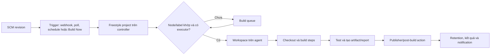

<Callout type="info" title="Phạm vi và giả định">
  Freestyle project phù hợp để hiểu mô hình job cổ điển của Jenkins hoặc duy trì automation nhỏ đã có sẵn. Ví dụ giả định Jenkins LTS, Git plugin và một agent Linux được quản trị; tên plugin, trường UI và hành vi có thể thay đổi theo phiên bản. Kiểm tra **Manage Jenkins → Plugins**, **Pipeline Syntax** và quyền trên chính controller trước khi áp dụng vào production.
</Callout>

Freestyle project là job được khai báo chủ yếu bằng giao diện Jenkins. Nó nối một nguồn mã, điều kiện kích hoạt, nơi chạy, các build step và hành động sau build thành một luồng CI. Điều này nhanh cho tác vụ đơn giản, nhưng cấu hình nằm ngoài repository nên ownership, audit và tái lập cần được thiết kế có chủ đích.

## Mục lục

- [Khi nào dùng Freestyle?](#khi-nào-dùng-freestyle)
  - [Mô hình job và vòng đời build](#mô-hình-job-và-vòng-đời-build)
  - [So với Pipeline, Declarative và Job DSL](#so-với-pipeline-declarative-và-job-dsl)
- [Cấu hình qua UI](#cấu-hình-qua-ui)
  - [Bảng trường UI quan trọng](#bảng-trường-ui-quan-trọng)
  - [SCM, trigger và tham số](#scm-trigger-và-tham-số)
  - [Node, label, workspace và tools](#node-label-workspace-và-tools)
  - [Build environment và build steps](#build-environment-và-build-steps)
  - [Publishers và post-build actions](#publishers-và-post-build-actions)
- [Bảo mật và quyền vận hành](#bảo-mật-và-quyền-vận-hành)
  - [Credentials, masking và least privilege](#credentials-masking-và-least-privilege)
  - [Shell injection, đường dẫn và tham số](#shell-injection-đường-dẫn-và-tham-số)
- [Vận hành đáng tin cậy](#vận-hành-đáng-tin-cậy)
  - [Timeout, retry, retention và notification](#timeout-retry-retention-và-notification)
  - [Ownership, audit, export và rollback](#ownership-audit-export-và-rollback)
  - [Tái lập và chống configuration drift](#tái-lập-và-chống-configuration-drift)
- [Di chuyển sang Jenkinsfile](#di-chuyển-sang-jenkinsfile)
  - [Tiêu chí và kế hoạch chuyển đổi](#tiêu-chí-và-kế-hoạch-chuyển-đổi)
  - [Ví dụ Jenkinsfile an toàn](#ví-dụ-jenkinsfile-an-toàn)
- [Lab sandbox: build, test và lưu artifact](#lab-sandbox-build-test-và-lưu-artifact)
  - [Chuẩn bị](#chuẩn-bị)
  - [Các bước trong UI](#các-bước-trong-ui)
  - [Kết quả mong đợi và dọn dẹp](#kết-quả-mong-đợi-và-dọn-dẹp)
- [Troubleshooting](#troubleshooting)
- [Checklist trước khi vận hành](#checklist-trước-khi-vận-hành)
- [Nguồn Jenkins chính thức](#nguồn-jenkins-chính-thức)
- [Đọc tiếp](#đọc-tiếp)

## Khi nào dùng Freestyle?

Freestyle là một **project model** tổng quát của Jenkins: mỗi cấu hình UI xác định một job, và mỗi lần chạy tạo một build có number, console log, workspace, kết quả và metadata riêng. Nó hợp với một repository, một chuỗi bước tuyến tính và ít nhánh điều kiện, chẳng hạn kiểm tra một script nội bộ hoặc đóng gói một artifact. Trước khi tạo job đầu tiên, xem bối cảnh controller, agent và queue tại [Tổng quan về Jenkins](/docs/getting-started/overview).

Không dùng Freestyle như cách tránh quản trị quy trình. Một job có deploy, nhiều môi trường, logic điều kiện, nhiều contributor hoặc thay đổi thường xuyên sẽ sớm cần review dựa trên Git và migration sang Jenkinsfile.

### Mô hình job và vòng đời build

Một lần chạy đi qua các thành phần sau. Một plugin có thể thêm trường UI hoặc đổi chính xác hành vi của một bước; vì vậy hãy xác nhận plugin/version trước khi copy cấu hình.



Sơ đồ dùng Mermaid. Fumadocs cần renderer Mermaid được cấu hình thì mới vẽ; nếu chưa cấu hình, block vẫn là nguồn version-control được nhưng chỉ hiện như code.

- **SCM** chọn revision để checkout, thường là Git URL, branch/revision và credential đọc repository private.
- **Build triggers** quyết định khi nào job vào queue: webhook/plugin SCM, polling, lịch định kỳ hoặc người có quyền bấm **Build Now**.
- **Build environment/wrappers** chuẩn bị hoặc bao bọc build, ví dụ timestamp log, timeout, nạp tool, cleanup workspace hay biến môi trường. Nhiều wrapper đến từ plugin.
- **Build steps** thực thi công việc: Invoke Gradle, Execute shell, gọi tool/plugin hoặc script của repository.
- **Publishers/post-build actions** thu JUnit report, archive artifact, fingerprint, gửi notification hoặc gọi downstream job sau khi build có kết quả.
- **Tools** là các tool global do quản trị viên khai báo (JDK, Git, Maven, NodeJS qua plugin). Job chọn tên tool đã được chuẩn bị, không nên tự tải bản `latest` không kiểm soát trong mỗi run.
- **Node/label** route build đến agent có OS, toolchain và trust tier phù hợp. **Workspace** là thư mục làm việc của job trên agent, không phải kho artifact lâu dài hay ranh giới an ninh hoàn chỉnh. Xem thêm [Tổng quan Jenkins Agent](/docs/agents/overview).

### So với Pipeline, Declarative và Job DSL

| Cách tiếp cận | Nơi mô tả flow | Điểm mạnh | Giới hạn hoặc thời điểm chọn |
| --- | --- | --- | --- |
| Freestyle | Form UI và `config.xml` của job | Dễ tạo flow tuyến tính, trực quan với plugin legacy | Diff/review không tự đi cùng source; logic phức tạp nhanh khó đọc. |
| Pipeline | Script Groovy trong job hoặc SCM | Có stage, restart/durability và khả năng mô hình flow phong phú | Cần hiểu Pipeline steps, sandbox và plugin Pipeline. Xem [Tổng quan Jenkins Pipeline](/docs/pipelines/overview). |
| Declarative Pipeline | `Jenkinsfile` có cấu trúc khai báo trong SCM | Review, branch-aware CI và policy rõ cho đa số CI/CD | Ít tự do hơn Scripted, nhưng đó thường là lợi ích cho vận hành. Xem [Declarative Pipeline](/docs/pipelines/declarative). |
| Job DSL | Script tạo/cập nhật cấu hình job | Giảm drift khi phải quản lý nhiều job, kể cả Freestyle | Đây là job-configuration-as-code, không thay Jenkinsfile mô tả build flow của từng repo. |

Pipeline không đồng nghĩa Declarative: Pipeline có thể là Scripted hoặc Declarative. Job DSL tạo ra **job configuration**; Jenkinsfile là **build flow** nằm cùng revision source. Một tổ chức có thể dùng Job DSL để chuẩn hóa folder/Freestyle cũ, đồng thời chuyển logic build mới sang Jenkinsfile.

## Cấu hình qua UI

Tạo job tại **New Item → Freestyle project**. Đặt tên theo trách nhiệm và môi trường, ví dụ `catalog-api-ci`, thay vì tên người hoặc máy. Hạn chế người có quyền **Configure**: quyền này có thể thay lệnh chạy, agent được chọn và credential được job dùng.

### Bảng trường UI quan trọng

| Khu vực UI | Trường hoặc lựa chọn | Mục đích | Kiểm tra trước khi lưu |
| --- | --- | --- | --- |
| General | Description, Disable project, parameterized build | Nêu owner, mục đích, runbook; tạm dừng job hoặc khai báo input có kiểm soát | Description có owner/đường escalation; parameter không mở rộng quyền. |
| Source Code Management | Git repository URL, Credentials, Branches to build | Checkout source/revision xác định | URL không chứa token; credential chỉ read; branch không do text parameter không tin cậy quyết định. |
| Build Triggers | Webhook/plugin trigger, Poll SCM, Build periodically | Đưa build vào queue khi source hoặc lịch thay đổi | Không bật poll và webhook trùng nhau nếu không có lý do; cron và timezone rõ ràng. |
| Build Environment | Delete workspace, timeout, timestamps, tool wrappers | Tạo điều kiện chạy nhất quán và giới hạn run | Wrapper/plugin tương thích; cleanup không xóa dữ liệu ngoài workspace. |
| Build | Execute shell hoặc build-tool step | Test, build, tạo file đầu ra | Lệnh nằm trong Git khi có thể; quote biến, validate input và dùng đường dẫn an toàn. |
| Post-build Actions | Publish JUnit, Archive artifacts, fingerprint, notification | Lưu evidence và phản hồi kết quả | Publish report/artifact trước cleanup; pattern không thu secret hoặc file tạm. |

Các nhãn UI có thể khác theo plugin và phiên bản Jenkins. Nếu không thấy lựa chọn trong bảng, đừng cài plugin trực tiếp trên production chỉ để theo ví dụ; yêu cầu quản trị viên đánh giá tương thích, security advisory, license và kế hoạch rollback plugin.

### SCM, trigger và tham số

Với Git, chọn **Git** trong Source Code Management, nhập URL HTTPS/SSH của repository và chọn credential đã tồn tại nếu repository private. Credential nên có quyền đọc repository đúng scope; không nhúng PAT vào URL, `Execute shell`, tham số hay description. Chọn branch/revision theo policy, ví dụ `*/main` cho CI sau merge. Đừng để người kích hoạt build nhập tùy ý repository URL hoặc ref rồi checkout bằng shell: đó là chuyển quyền network/source selection sang input không kiểm soát.

Chọn trigger theo nguồn sự kiện đáng tin cậy:

- Webhook từ SCM thường phản hồi nhanh và giảm polling. Xác thực webhook ở SCM/plugin theo cấu hình tổ chức.
- **Poll SCM** kiểm tra thay đổi định kỳ và có thể tăng tải; dùng khi webhook không khả dụng, với lịch thận trọng.
- **Build periodically** phù hợp kiểm tra hoặc tác vụ độc lập với commit. Nó không thay thế trigger SCM.
- **Build after other projects are built** chỉ phù hợp khi dependency và điều kiện kết quả đã rõ. Tránh chuỗi job ngầm khó truy vết.

Parameterized build hữu ích cho input hữu hạn như `TARGET_ENV = sandbox | staging`. Dùng **Choice Parameter** thay vì Free-form text khi có thể. Parameter được đưa vào environment nên vẫn phải validate lại trong shell. Tìm hiểu ngữ nghĩa environment/parameters khi chuyển sang Pipeline tại [Environment & Parameters](/docs/pipelines/environment-parameters).

### Node, label, workspace và tools

Trong **Restrict where this project can be run**, chọn label theo năng lực và mức tin cậy, ví dụ `linux && ci-sandbox`. Không dùng built-in node/controller để chạy code repository; controller nên dành cho điều phối. Label không tự cấp quyền: agent vẫn cần account OS hạn chế, network policy, disk quota và cleanup phù hợp.

Workspace được Jenkins cấp dưới remote root của agent và có thể bị tái sử dụng. Không ghi vào `/tmp/shared`, home directory hay một path do parameter quyết định. Nếu build dùng cache, phân tách cache theo project/trust tier và tránh chia cache ghi được giữa build PR không tin cậy với release.

Chọn tool theo tên global tool do quản trị viên quản lý. Ghi version cần thiết trong description hoặc repository, ví dụ JDK 21 và Maven 3.9.x. Pin dependency bằng lockfile, pin image/toolchain theo version hoặc digest đã kiểm thử. Công việc liên quan global tools, node properties và ownership hệ thống nằm tại [Cấu hình hệ thống Jenkins](/docs/administration/system-configuration).

### Build environment và build steps

Build environment/wrapper áp dụng quanh build hoặc chuẩn bị workspace. Thứ tự và sự tồn tại của các lựa chọn phụ thuộc plugin. Hai kiểm soát có giá trị thực tế là timeout hữu hạn và dọn workspace theo policy; timestamp giúp liên kết console log với sự kiện bên ngoài.

Giữ build step mỏng: gọi script đã review trong SCM thay vì nhét hàng trăm dòng shell vào UI. Script cần trả exit code khác `0` khi quality gate fail để Jenkins đánh dấu build thất bại. Ví dụ Execute shell cho một repository có `ci/build.sh`:

```bash
#!/usr/bin/env bash
set -eu

# `ci/build.sh` được versioning cùng source; không lấy command từ parameter.
./ci/test.sh
mkdir -p -- "$WORKSPACE/out"
printf '%s\n' "build=${BUILD_NUMBER}" > "$WORKSPACE/out/build.txt"
```

`set -eu` khiến lỗi và biến chưa đặt dừng script; không tự biến shell thành sandbox. `Execute shell` cần shell Unix, còn Windows dùng step/batch phù hợp và cú pháp quoting khác. Không ghi secret, command có token hoặc môi trường đầy đủ vào console để debug.

### Publishers và post-build actions

Sau build, cấu hình publisher theo đúng artifact/report thực tế. Một workflow nhỏ, dễ quan sát là **build → test → artifact/report → notification**:

1. Build step checkout rồi chạy test bắt buộc; test fail trả exit code khác `0`.
2. Build step tạo artifact trong một thư mục cố định dưới workspace, chẳng hạn `out/`.
3. **Publish JUnit test result report** đọc `reports/*.xml`; **Archive the artifacts** lưu `out/**` và chỉ fingerprint khi cần traceability.
4. Notification gửi trạng thái và link build cho owner sau khi Jenkins đã có kết quả. Tránh đưa console log hoặc artifact chưa được kiểm tra vào kênh công khai.

Chỉ archive file cần để tái sử dụng/điều tra. Artifact lớn, retention dài hoặc phát hành cần kho artifact chuyên dụng và policy riêng. Thu report và archive trước wrapper cleanup; một post-build action không nên làm build xanh lại sau khi test fail. Nội dung về report, flaky test và quality gate có tại [Tự động hóa kiểm thử](/docs/delivery/test-automation).

## Bảo mật và quyền vận hành

### Credentials, masking và least privilege

Trong Freestyle, plugin có thể bind credential vào biến môi trường hoặc file tạm cho một build step. Dùng credential ID từ store Jenkins; không ghi secret thật vào form, Git, build parameter, URL hay artifact. Chỉ cấp credential ở folder/job/environment cần nó, chỉ cho step cần nó, và dùng token có quyền tối thiểu, thời hạn/rotation theo policy.

Masking chỉ cố che chuỗi đã biết trong console log. Nó không ngăn code độc hại in secret qua biến đổi, lưu secret vào artifact, gửi qua network, hoặc process khác cùng agent đọc environment/file. Không bật `set -x` khi có credential; không echo environment; tách agent/pool cho workload không tin cậy và không cấp credential release cho PR chưa được tin cậy. Xem cách scope credential và binding an toàn trong [Credentials trong Pipeline](/docs/pipelines/credentials).

<Callout type="warn" title="Credential không bảo vệ code không tin cậy">
  Bất kỳ ai có thể sửa build step hoặc source được job chạy đều có thể cố gắng sử dụng credential mà step nhận được. Giảm rủi ro bằng review/quyền Configure, folder scope, token least privilege, agent cô lập và chỉ chạy publish/deploy sau điều kiện tin cậy đã xác định.
</Callout>

### Shell injection, đường dẫn và tham số

Mỗi parameter, tên nhánh, webhook payload, commit message và file từ workspace đều là dữ liệu không tin cậy. Không dùng `eval`, command substitution từ input, `sh -c "$PARAM"`, hay ghép input vào command có ý nghĩa shell. Không coi Choice Parameter là validation duy nhất, vì build có thể bị gọi qua API hoặc cấu hình có thể đổi.

Mẫu Execute shell dưới đây chỉ cho phép hai giá trị hữu hạn. Nó quote biến, dùng `--` để kết thúc option và giữ output bên trong `$WORKSPACE`; không dùng nó để chọn URL SCM hay đường dẫn tùy ý.

```bash
#!/usr/bin/env bash
set -eu

case "${TARGET_ENV:-}" in
  sandbox|staging) ;;
  *) printf '%s\n' 'TARGET_ENV must be sandbox or staging' >&2; exit 64 ;;
esac

out_dir="$WORKSPACE/out/$TARGET_ENV"
mkdir -p -- "$out_dir"
printf 'target=%s\n' "$TARGET_ENV" > "$out_dir/target.txt"
./ci/package.sh --target "$TARGET_ENV" --output "$out_dir"
```

Không tạo path bằng `../`, không glob input chưa kiểm soát, không dùng `rm -rf "$PARAM"`, và không tin một symlink trong workspace khi thao tác file nhạy cảm. Nếu cần chọn revision, artifact hay đích deploy, map lựa chọn UI hữu hạn sang giá trị đã review trong script thay vì chấp nhận string tự do.

## Vận hành đáng tin cậy

### Timeout, retry, retention và notification

Đặt timeout cho build hoặc step có thể treo, theo plugin wrapper đã được phê duyệt. Chọn giá trị dựa trên p95 thực tế và chừa biên nhỏ; timeout quá rộng chỉ biến treo thành queue dài. Khi timeout xảy ra, xác nhận công cụ con đã dừng và cleanup idempotent, vì process/agent mất kết nối có thể cần xử lý riêng.

Retry chỉ dành cho thao tác idempotent có lỗi tạm thời, như tải dependency từ mirror đã biết. Giới hạn attempt, log lý do và không retry mù test fail, migration database hay publish có side effect. Với flow phức tạp hơn, xem semantics của `retry`, `timeout` và kết quả build tại [Xử lý lỗi và Retry](/docs/pipelines/error-handling).

Cấu hình **Discard old builds** theo nhu cầu điều tra, compliance và dung lượng: giữ số build/ngày đủ để trace artifact và incident, rồi xác nhận disk usage. Retention phải xét cả build records, console log, archived artifacts và external artifact store. Notification nên dựa vào transition hữu ích (failure mới, recovery, release) và owner rõ ràng, thay vì gửi mọi build thành spam.

### Ownership, audit, export và rollback

UI là nguồn cấu hình hiện hành của Freestyle, nên job cần owner kỹ thuật, backup owner và mô tả mục đích/alert route. Ghi ticket hoặc pull request phê duyệt trong description/changelog nội bộ trước khi đổi SCM, label, script, trigger, credential ID, publisher hoặc retention. Hạn chế quyền Configure/Delete; quyền chạy và quyền sửa cấu hình là hai mức rủi ro khác nhau.

Jenkins lưu cấu hình item trong `$JENKINS_HOME/jobs/.../config.xml`. Chỉ người được ủy quyền mới export/copy XML, vì file có thể lộ URL nội bộ, credential ID, cấu trúc job hoặc metadata nhạy cảm dù không nên chứa secret thô. Lưu bản export đã được review trong kho kiểm soát truy cập, hoặc quản lý bằng Job DSL/Jenkins Configuration as Code khi phù hợp. Backup toàn `JENKINS_HOME` cần tính nhất quán, quyền truy cập hạn chế và restore được diễn tập; xem [Backup & Restore Jenkins](/docs/administration/backup-restore).

Rollback là một thay đổi có chủ đích: lưu export/bản cấu hình trước khi đổi, ghi build cuối cùng tốt và phiên bản plugin liên quan, sau đó khôi phục cấu hình đã review trong cửa sổ phù hợp. Sau rollback, chạy build sandbox/canary và đối chiếu revision, label, credential ID, artifact/report và retention; không coi import XML là đủ bằng chứng.

### Tái lập và chống configuration drift

Một build tái lập cần biết **source revision**, **toolchain/version**, **dependency lockfile**, **agent image/OS**, **plugin assumptions** và **UI configuration** đã tạo nó. Chỉ biết build number không đủ khi tool global đổi, agent được patch hoặc ai đó sửa form mà không có record.

Để giảm drift:

- giữ command, test và packaging script trong repository; chỉ để wiring tối thiểu ở UI;
- pin version plugin/tool theo policy, ghi dependency plugin của mỗi wrapper/publisher và thử trên staging trước khi nâng;
- export cấu hình sau thay đổi được phê duyệt, so sánh diff định kỳ với baseline và backup;
- theo dõi system log, Console Output và audit log mà tổ chức có để biết ai đổi gì, khi nào; xem [Logs & Diagnostics](/docs/administration/logs);
- viết runbook rollback trước khi đổi trigger, agent pool hay post-build action có thể tác động release.

## Di chuyển sang Jenkinsfile

### Tiêu chí và kế hoạch chuyển đổi

Chuyển khi job cần branch/PR-specific behavior, stage rõ ràng, review/diff bắt buộc, nhiều điều kiện/parallelism, dùng chung logic, hay khi configuration drift đã gây incident. Freestyle vẫn có thể hợp với tác vụ quản trị nhỏ, được owner kiểm soát và ít đổi; migration không phải lý do để copy nguyên shell UI vào một Jenkinsfile dài hơn.

Kế hoạch an toàn:

1. Inventory form hiện tại: SCM/ref/credential ID, trigger, label, tool version, wrappers, commands, publishers, retention và notification.
2. Đưa build/test/package commands vào script trong repository; kiểm thử script trên agent sandbox với source revision cố định.
3. Viết Jenkinsfile Declarative dùng cùng label, credentials scope hẹp, timeout, archive/report và `post` rõ ràng. Đọc hướng dẫn cấu trúc tại [Jenkinsfile](/docs/pipelines/jenkinsfile).
4. Tạo Pipeline job thử chạy từ branch migration. So sánh exit code, test count, artifact checksum, notification và thời lượng với Freestyle ở cùng commit; tránh chạy đồng thời hai job nếu chúng publish cùng đích.
5. Chuyển webhook/schedule sau khi canary đạt tiêu chí. Disable Freestyle cũ thay vì xóa ngay, giữ export và đường rollback trong khoảng retention đã thỏa thuận.

### Ví dụ Jenkinsfile an toàn

Ví dụ thay một Freestyle job Linux có Choice Parameter `TARGET_ENV`, build script versioned, JUnit report và artifact `out/`. Credential chỉ xuất hiện trong stage publish giả định; không có secret thật trong file. `timeout`, `retry` và các step/plugin cần được kiểm tra trên controller.

```groovy
pipeline {
  agent { label 'linux && ci-sandbox' }

  options {
    timeout(time: 20, unit: 'MINUTES')
    buildDiscarder(logRotator(numToKeepStr: '20', artifactNumToKeepStr: '10'))
    disableConcurrentBuilds()
  }

  parameters {
    choice(name: 'TARGET_ENV', choices: ['sandbox', 'staging'], description: 'Đích đã được phê duyệt')
  }

  stages {
    stage('Build and test') {
      steps {
        sh '''#!/usr/bin/env bash
          set -eu
          case "${TARGET_ENV:-}" in sandbox|staging) ;; *) exit 64 ;; esac
          ./ci/test.sh
          mkdir -p -- "$WORKSPACE/out/$TARGET_ENV"
          ./ci/package.sh --target "$TARGET_ENV" --output "$WORKSPACE/out/$TARGET_ENV"
        '''
      }
    }

    stage('Publish sandbox metadata') {
      when { expression { params.TARGET_ENV == 'sandbox' } }
      steps {
        retry(2) {
          sh './ci/publish-sandbox-metadata.sh'
        }
      }
    }
  }

  post {
    always {
      junit testResults: 'reports/*.xml', allowEmptyResults: false
      archiveArtifacts artifacts: 'out/**', fingerprint: true
      deleteDir()
    }
    failure {
      echo 'Thông báo thất bại tới kênh/owner đã được cấu hình, không kèm secret.'
    }
  }
}
```

`retry(2)` chỉ nên bao quanh script publish metadata đã được chứng minh idempotent; không dùng mẫu này cho publish release có thể tạo bản ghi trùng. Với staging/production, tách trust tier, approval và credential scope theo policy thay vì chỉ đổi giá trị parameter.

## Lab sandbox: build, test và lưu artifact

Lab này chỉ tạo file text trong workspace của agent, không checkout repository private, không dùng credential, không gọi network và không xóa dữ liệu ngoài workspace. Cần một Jenkins lab/local, một agent Linux label `ci-sandbox`, Git plugin không bắt buộc cho lab này, cùng JUnit plugin nếu muốn publish report. Không chạy trên controller production.

### Chuẩn bị

Tạo một Freestyle project tên `freestyle-sandbox-demo`. Trong **General**, đặt description có owner lab và bật **This project is parameterized** với Choice Parameter `TARGET_ENV`: `sandbox`, `staging`. Trong **Restrict where this project can be run**, nhập `ci-sandbox`. Nếu agent không có label này, dừng ở đây và nhờ quản trị viên cấp sandbox; không đổi label sang controller.

### Các bước trong UI

1. Trong **Build Environment**, bật timeout 5 phút nếu wrapper đã có. Không cần credential hay SCM cho lab.
2. Thêm **Build Step → Execute shell**, rồi dán script vô hại sau:

```bash
#!/usr/bin/env bash
set -eu

case "${TARGET_ENV:-}" in sandbox|staging) ;; *) exit 64 ;; esac
mkdir -p -- "$WORKSPACE/out" "$WORKSPACE/reports"
printf 'environment=%s\n' "$TARGET_ENV" > "$WORKSPACE/out/result.txt"
printf '%s\n' '<testsuite name="sandbox" tests="1" failures="0"><testcase name="writes-result"/></testsuite>' \
  > "$WORKSPACE/reports/sandbox.xml"
```

3. Thêm **Post-build Action → Publish JUnit test result report** với pattern `reports/*.xml`.
4. Thêm **Post-build Action → Archive the artifacts** với pattern `out/**`; bỏ chọn archive empty artifacts nếu UI có lựa chọn này.
5. Lưu và bấm **Build with Parameters**, chọn `sandbox`. Mở build vừa tạo, đọc **Console Output**, **Test Result** và **Artifacts**.

### Kết quả mong đợi và dọn dẹp

Build thành công trên agent `ci-sandbox`. Console không in secret; JUnit hiển thị 1 test pass; Artifact có `out/result.txt` với `environment=sandbox`. Nếu report hoặc artifact không xuất hiện, kiểm tra pattern và đường dẫn tương đối với workspace trước khi chạy lại.

Sau lab, xóa artifact/build records theo retention của lab và chọn **Delete Project** chỉ khi project này không còn cần làm evidence đào tạo. Nếu không có quyền xóa hoặc retention được quản lý tập trung, disable project và báo owner lab. Không tự xóa workspace của agent bằng path shell; cleanup phải theo policy Jenkins/agent.

## Troubleshooting

| Triệu chứng | Kiểm tra theo thứ tự | Cách xử lý an toàn |
| --- | --- | --- |
| Build chờ trong queue | Label expression, node online, executor, quiet period | Sửa label/capacity đúng pool; không route code sang controller chỉ để hết queue. |
| Checkout thất bại | Git URL, branch policy, network tới SCM, credential ID/scope | Cấp credential read-only đúng folder/job; không đưa token vào URL hoặc log. |
| `command not found` hoặc version sai | Agent OS, global tool name/version, PATH wrapper | Sửa image/tool global có review; ghi version mong muốn và chạy canary. |
| Test pass nhưng không có report/artifact | Đường dẫn tương đối workspace, pattern publisher, thứ tự cleanup | Xuất report/artifact trước cleanup; không dùng `allow empty` để che test chưa chạy. |
| Job bị timeout hoặc retry mãi | Console timestamp, process con, tính idempotent của step | Thu hẹp timeout, giới hạn retry cho lỗi tạm thời và điều tra nguyên nhân. |
| Secret xuất hiện hoặc nghi ngờ đã lộ | Console, artifact, process/agent scope và credential audit | Dừng sử dụng credential, thu hồi/rotate theo quy trình, hạn chế truy cập evidence rồi điều tra; masking không đủ để kết luận an toàn. |
| Freestyle khác nhau giữa môi trường | Export/baseline config, plugin/tool version, node/label, SCM ref | Diff cấu hình, chọn baseline đã review, canary rồi rollback có kiểm soát nếu cần. |

Đọc Console Output cùng build number, revision, agent và thời điểm trước khi sửa. Để thu thập log/controller diagnostics có kiểm soát, xem [Logs & Diagnostics](/docs/administration/logs).

## Checklist trước khi vận hành

- [ ] Owner, backup owner, mục đích và kênh notification đã ghi trong description/runbook.
- [ ] SCM URL, ref và credential read-only được review; không có token trong UI/script/log.
- [ ] Trigger không tạo build trùng và parameter được giới hạn, validate lại trong script.
- [ ] Label route đúng agent/trust tier; controller không nhận build; workspace/cache có cleanup policy.
- [ ] Toolchain, plugin/wrapper/publisher assumptions và dependency version đã được xác nhận trên Jenkins LTS mục tiêu.
- [ ] Build step gọi script versioned, trả exit code đúng; không có `eval`, input command hoặc path không kiểm soát.
- [ ] Credential scope hẹp, masking không bị hiểu là boundary và PR không tin cậy không nhận secret.
- [ ] Report/artifact được thu trước cleanup; retention, fingerprint và notification phù hợp policy/dung lượng.
- [ ] Timeout/retry có giới hạn, side effect được đánh giá idempotent và có owner xử lý failure.
- [ ] Export/baseline, audit evidence, canary và rollback path đã tồn tại trước thay đổi quan trọng.

## Nguồn Jenkins chính thức

- [Freestyle project](https://www.jenkins.io/doc/book/using/using-freestyle-projects/)
- [Using Jenkins](https://www.jenkins.io/doc/book/using/)
- [Pipeline](https://www.jenkins.io/doc/book/pipeline/)
- [Jenkinsfile](https://www.jenkins.io/doc/book/pipeline/jenkinsfile/)
- [Managing Nodes](https://www.jenkins.io/doc/book/managing/nodes/)
- [Using credentials](https://www.jenkins.io/doc/book/using/using-credentials/)
- [Securing Jenkins](https://www.jenkins.io/doc/book/security/)
- [Jenkins plugins](https://www.jenkins.io/plugins/)

## Đọc tiếp

<Cards>
  <Card title="Tổng quan Jenkins" href="/docs/getting-started/overview" description="Ôn lại controller, job và nền tảng Jenkins." />
  <Card title="Tổng quan Pipeline" href="/docs/pipelines/overview" description="Chọn Pipeline as Code cho flow cần review và versioning." />
  <Card title="Declarative Pipeline" href="/docs/pipelines/declarative" description="Tổ chức stage, agent và policy bằng cú pháp khai báo." />
  <Card title="Jenkinsfile" href="/docs/pipelines/jenkinsfile" description="Đặt Pipeline trong SCM và kiểm tra trước khi chạy." />
</Cards>
