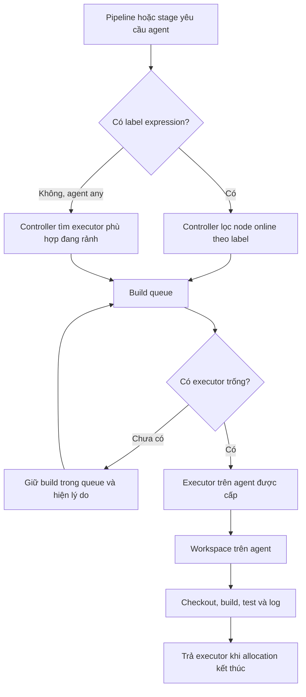

Một `agent` xác định **nơi** Jenkins chạy một phần Pipeline, không chỉ là cú pháp để Pipeline bắt đầu. Chọn đúng agent giúp build có đúng toolchain, giới hạn thời gian chờ trong queue và tách code build khỏi Jenkins controller. Trang [Kiến trúc Jenkins](/docs/getting-started/architecture) giải thích mô hình controller–agent nền tảng.

<Callout type="info" title="Phạm vi và điều kiện">
  Các ví dụ dùng Declarative Pipeline và shell Linux. `agent` là directive của Pipeline; Docker agent và Kubernetes agent là khả năng do plugin cùng hạ tầng tương ứng cung cấp, không phải Jenkins core tự tạo Docker daemon hay Kubernetes cluster.
</Callout>

## Mục lục

- [Đường đi từ label đến workspace](#đường-đi-từ-label-đến-workspace)
  - [Executor, queue và workspace](#executor-queue-và-workspace)
- [Agent any và agent none](#agent-any-và-agent-none)
- [Biểu thức label](#biểu-thức-label)
  - [Toán tử và cách đọc](#toán-tử-và-cách-đọc)
  - [Chọn label theo năng lực](#chọn-label-theo-năng-lực)
- [Đặt agent ở Pipeline hay stage](#đặt-agent-ở-pipeline-hay-stage)
- [Jenkinsfile mẫu an toàn](#jenkinsfile-mẫu-an-toàn)
- [Docker agent](#docker-agent)
  - [Điều kiện Docker và cú pháp](#điều-kiện-docker-và-cú-pháp)
  - [Vòng đời, workspace và cache](#vòng-đời-workspace-và-cache)
- [Kubernetes agent](#kubernetes-agent)
  - [Điều kiện Kubernetes và cú pháp](#điều-kiện-kubernetes-và-cú-pháp)
  - [Vòng đời, toolchain và storage](#vòng-đời-toolchain-và-storage)
- [Lab chọn và quan sát agent](#lab-chọn-và-quan-sát-agent)
  - [Chuẩn bị](#chuẩn-bị)
  - [Chạy và đọc queue](#chạy-và-đọc-queue)
- [Bảo mật và checklist](#bảo-mật-và-checklist)
- [Nguồn Jenkins chính thức](#nguồn-jenkins-chính-thức)
- [Đọc tiếp](#đọc-tiếp)

## Đường đi từ label đến workspace

Khi một build đến lượt chạy, controller không chọn một máy ngẫu nhiên. Nó đối chiếu yêu cầu `agent` với node/agent đang online. Với `label`, Jenkins chỉ có thể cấp build cho node thỏa biểu thức nhãn và còn executor trống. Sau khi cấp phát, executor trên agent tạo hoặc chọn workspace để checkout và chạy các step.



Sơ đồ Mermaid này được dự án cấu hình để xử lý. Nếu sao chép tài liệu sang một Fumadocs khác, cần cấu hình renderer Mermaid trước khi kỳ vọng sơ đồ được vẽ thay vì hiện như code block.

### Executor, queue và workspace

| Khái niệm     | Ý nghĩa khi chọn agent                                                                                                                               | Dấu hiệu cần xem                                                     |
| ------------- | ---------------------------------------------------------------------------------------------------------------------------------------------------- | -------------------------------------------------------------------- |
| **Executor**  | Một khe thực thi trên node. Agent có hai executor có thể nhận tối đa hai allocation phù hợp cùng lúc. Executor không tương đương CPU core.           | Số executor bận/rảnh, CPU, RAM và I/O của agent.                     |
| **Queue**     | Danh sách build đã được yêu cầu nhưng chưa được cấp executor. Build chờ có thể do label không khớp, agent offline hoặc mọi executor phù hợp đều bận. | **Build Queue** và lý do chờ do Jenkins hiển thị.                    |
| **Workspace** | Thư mục trên agent dành cho checkout và các file của build. Workspace có thể được tái sử dụng hoặc bị xóa theo loại agent/cấu hình.                  | Biến `WORKSPACE`, dung lượng disk, quyền file và chính sách cleanup. |

Ví dụ, một Pipeline yêu cầu `linux && docker` sẽ không chạy trên agent chỉ có label `linux`, dù agent đó có nhiều executor rảnh. Thêm executor vào node sai nhãn không giải quyết queue; cần thêm đúng năng lực hoặc sửa yêu cầu của Pipeline. Xem baseline tài nguyên và network tại [Yêu cầu hệ thống](/docs/getting-started/requirements).

<Callout type="warn" title="Không che lỗi capacity bằng agent any">
  `agent any` chỉ nói Jenkins có thể chọn một executor sẵn có; nó không cài JDK, Docker CLI, registry access hay disk cho agent. Nếu workload cần một năng lực cụ thể, khai báo label hoặc image/pod template tương ứng và xử lý nguyên nhân queue.
</Callout>

## Agent any và agent none

`agent any` ở cấp Pipeline yêu cầu Jenkins cấp một executor khả dụng cho toàn bộ Pipeline. Nó tiện cho bài học hoặc Pipeline rất nhỏ khi mọi agent hợp lệ đều có cùng toolchain. Executor và workspace được giữ trong lúc Pipeline dùng allocation đó; vì vậy không nên dùng nó cho Pipeline có bước chờ approval dài nếu agent không cần thiết phải bị giữ.

```groovy
pipeline {
  agent any

  stages {
    stage('Kiểm tra nhanh') {
      steps {
        sh 'printf "running on %s\\n" "$NODE_NAME"'
      }
    }
  }
}
```

`agent none` ở cấp Pipeline không cấp executor mặc định. Mỗi stage cần tự khai báo `agent`; một stage không có agent sẽ không có nơi để chạy `steps`. Mẫu này làm ranh giới tài nguyên rõ ràng: stage `Lint` có thể dùng agent nhẹ, còn `Build` chỉ vào pool có toolchain đắt tiền. Nó cũng tránh giữ executor xuyên qua stage chỉ chờ `input` hoặc điều kiện.

```groovy
pipeline {
  agent none

  stages {
    stage('Lint') {
      agent { label 'linux' }
      steps {
        sh 'printf "lint on %s\\n" "$NODE_NAME"'
      }
    }
  }
}
```

`none` không có nghĩa Jenkins không cần agent. Nó chỉ trì hoãn việc cấp agent tới từng stage. Hãy dùng `agent none` khi các stage thật sự cần môi trường khác nhau hoặc khi muốn giảm thời gian giữ executor; dùng agent cấp Pipeline khi các stage cùng một workspace/toolchain và giữ allocation liên tục là có chủ đích.

## Biểu thức label

Label là chuỗi năng lực gắn với node, ví dụ `linux`, `amd64`, `docker`, `java21` hoặc `gpu`. Tên label nên mô tả đặc tính có thể kiểm chứng, không mô tả một người hay một máy duy nhất. Ví dụ `linux && docker` diễn tả yêu cầu; `builder-01` khóa Pipeline vào một node và làm giảm khả năng thay thế khi node đó offline.

```groovy
agent { label 'linux && docker && !gpu' }
```

### Toán tử và cách đọc

| Biểu thức                     | Cách đọc                            | Khi phù hợp                                                     |
| ----------------------------- | ----------------------------------- | --------------------------------------------------------------- |
| `linux && docker`             | Phải có cả `linux` **và** `docker`. | Build image trên Linux có Docker runtime được phê duyệt.        |
| `linux \|\| windows`          | Có `linux` **hoặc** `windows`.      | Step đã được viết tương thích cả hai hệ điều hành.              |
| `!gpu`                        | Không có label `gpu`.               | Tránh chiếm pool GPU cho workload thông thường.                 |
| `(linux && arm64) \|\| macos` | Hoặc là Linux ARM64, hoặc là macOS. | Chỉ dùng khi toolchain và step đã được kiểm thử ở cả hai nhánh. |

`&&` có độ ưu tiên cao hơn `||`; dùng ngoặc khi biểu thức có nhiều điều kiện để người review không phải đoán. `!gpu` không khẳng định agent còn đủ CPU, disk hay toolchain khác. Nó chỉ phủ định đúng label `gpu`.

### Chọn label theo năng lực

Một bộ label nhỏ, nhất quán dễ vận hành hơn danh sách tùy ý. Có thể tách theo:

- hệ điều hành/kiến trúc: `linux`, `windows`, `arm64`, `amd64`;
- runtime cần thiết: `java21`, `node22`, `android`;
- quyền hoặc hạ tầng đặc biệt: `docker`, `gpu`, `internal-network`;
- trust boundary: `trusted-release`, `untrusted-pr`.

Không gắn `trusted-release` vào cùng pool nhận pull request/fork không tin cậy. Với build PR, giữ label đủ cho test nhưng không cho phép deploy production, đọc secret release hoặc truy cập Docker daemon đặc quyền. Labels là một phần của thiết kế routing, không thay thế authorization, network policy hay credential scope.

## Đặt agent ở Pipeline hay stage

| Vị trí                                        | Khi cấp phát                                | Ưu điểm                                                                                     | Trade-off                                                                              |
| --------------------------------------------- | ------------------------------------------- | ------------------------------------------------------------------------------------------- | -------------------------------------------------------------------------------------- |
| `agent` cấp Pipeline                          | Một agent/workspace cho toàn Pipeline.      | Các stage dùng chung toolchain và file build; Jenkinsfile ngắn hơn.                         | Giữ executor lâu hơn; không phù hợp khi một stage cần môi trường/đặc quyền khác.       |
| `agent` cấp stage với `agent none` ở Pipeline | Mỗi stage tự xếp queue và nhận agent riêng. | Route đúng pool theo stage, giảm thời gian giữ agent chuyên dụng, cô lập toolchain tốt hơn. | Workspace giữa stage có thể khác nhau; phải truyền artifact hoặc checkout lại khi cần. |

Một stage-level agent không tự chia sẻ filesystem với stage trước. Nếu `Build` tạo artifact trên agent A rồi `Test` chạy trên agent B, hãy publish/archive artifact, dùng kho artifact/cache đã được thiết kế hoặc checkout lại thay vì giả định cùng `WORKSPACE`. Việc dùng chung workspace bằng volume/cache cần kiểm soát quyền và lifecycle rõ ràng.

## Jenkinsfile mẫu an toàn

Ví dụ lab sau chọn một Linux agent không thuộc pool GPU. Nó không checkout repository, không dùng credential và chỉ in metadata không nhạy cảm. `sleep 45` giúp quan sát queue khi agent chỉ có một executor.

```groovy
pipeline {
  agent none
  options {
    skipDefaultCheckout(true)
  }

  stages {
    stage('Quan sát agent Linux') {
      agent { label 'linux && !gpu' }
      steps {
        sh '''
          set -eu
          printf 'NODE_NAME=%s\\n' "$NODE_NAME"
          printf 'WORKSPACE=%s\\n' "$WORKSPACE"
          pwd
          sleep 45
        '''
      }
    }

    stage('Xác nhận workspace') {
      agent { label 'linux && !gpu' }
      steps {
        sh 'test -n "$WORKSPACE"'
      }
    }
  }
}
```

Stage thứ hai có thể được cấp lại cùng node hoặc một node khác cùng label; đừng dùng ví dụ này để suy ra workspace được chia sẻ. Khi Pipeline thật cần file giữa stages, lưu output thành artifact hoặc dùng cơ chế chia sẻ đã được đội vận hành phê duyệt.

## Docker agent

Docker agent phù hợp khi một stage cần toolchain đóng gói trong image, chẳng hạn Node.js, Maven hoặc scanner. Docker giúp giảm drift giữa các agent, nhưng Docker daemon vẫn là thành phần có quyền mạnh trên host. Chỉ khai báo Docker agent sau khi xác định rõ nơi daemon chạy và workload nào được phép gọi nó.

### Điều kiện Docker và cú pháp

Ví dụ dưới đây cần **Docker Pipeline plugin** cùng Declarative Pipeline support. Node được chọn để khởi chạy container phải có Docker CLI có thể nói chuyện với Docker daemon đã được quản trị; controller không nên mount Docker socket chỉ để ví dụ này chạy được.

```groovy
pipeline {
  agent none

  stages {
    stage('Test trong Node container') {
      agent {
        docker {
          image 'node:22.14.0-alpine3.21'
          reuseNode true
        }
      }
      steps {
        sh 'node --version'
        sh 'npm --version'
        sh 'npm ci'
        sh 'npm test'
      }
    }
  }
}
```

`image` cần là image đã được đội kiểm tra về toolchain, license và nguồn registry. Pin tag phiên bản chỉ là điểm bắt đầu; production nên resolve và cho phép một image theo digest bất biến từ registry được quản trị, rồi cập nhật qua review. Không dùng tag trôi như `latest` cho build cần tái lập.

<Callout type="error" title="Docker socket là quyền đặc biệt">
  Ai chạy Pipeline có quyền dùng Docker socket thường có thể tạo container đặc quyền hoặc mount filesystem host. Không mount `/var/run/docker.sock` vào Jenkins controller, và không cấp socket/daemon cho workload PR hoặc fork không tin cậy. Nếu buộc phải dùng daemon, đặt nó trên agent riêng theo pool tin cậy, giới hạn job và coi agent đó là tài sản đặc quyền.
</Callout>

### Vòng đời, workspace và cache

Mỗi allocation Docker agent khởi chạy một container cho stage/Pipeline rồi dừng và xóa container khi allocation kết thúc. Image cache có thể còn trên Docker host; workspace và cache còn lại phụ thuộc `reuseNode`, mount và chính sách cleanup của host.

- Không có `reuseNode`, Docker Pipeline có thể tạo workspace riêng trên node được chọn. Với `reuseNode true`, container dùng workspace của node hiện tại; chỉ dùng khi lợi ích chia sẻ workspace lớn hơn rủi ro quyền file và dữ liệu tồn lưu.
- Dependency cache bind-mount từ host làm build nhanh hơn, nhưng cache đó cần ownership, quota, dọn dẹp và tách theo trust boundary. Không mount toàn bộ home directory hoặc Docker socket để “có cache”.
- Image nên chứa toolchain cần thiết. Không `curl | sh` để cài tool ở runtime chỉ vì image thiếu một binary; tạo, quét và version hóa image CI riêng thay vào đó.
- Docker agent không phải sandbox an toàn mặc định. Network, mount, Linux capability, user trong container và quyền daemon đều quyết định mức cô lập thật.

Trade-off chính là tốc độ dựng môi trường và tính tái lập đổi lấy vận hành image, registry, daemon và cache. Nếu host chỉ phục vụ container build, vẫn phải theo dõi disk của image layers, workspace và log; queue có thể chờ vì daemon/agent thiếu năng lực, không chỉ vì executor.

## Kubernetes agent

Kubernetes agent phù hợp khi đội đã có cluster và muốn cấp pod agent ngắn hạn theo workload. Kubernetes plugin tạo và kết nối pod theo cấu hình cloud/pod template của Jenkins. Kubernetes API, scheduler, container runtime, storage class, admission policy và RBAC là năng lực của cluster/plugin; Jenkins core không tự cung cấp chúng.

### Điều kiện Kubernetes và cú pháp

Ví dụ cần **Kubernetes plugin**, một Kubernetes cloud đã được Jenkins administrator cấu hình, credential kết nối cluster có quyền tối thiểu và namespace có quota/network policy phù hợp. Image `node:22.14.0-alpine3.21` phải pull được từ namespace; production thường dùng registry nội bộ và image đã pin digest.

```groovy
pipeline {
  agent none

  stages {
    stage('Test trong pod') {
      agent {
        kubernetes {
          defaultContainer 'node'
          yaml '''
apiVersion: v1
kind: Pod
spec:
  restartPolicy: Never
  securityContext:
    runAsNonRoot: true
  containers:
    - name: node
      image: node:22.14.0-alpine3.21
      command:
        - cat
      tty: true
      securityContext:
        allowPrivilegeEscalation: false
'''
        }
      }
      steps {
        sh 'node --version'
        sh 'npm ci'
        sh 'npm test'
      }
    }
  }
}
```

Cú pháp, trường pod template và hành vi mặc định có thể thay đổi theo phiên bản Kubernetes plugin. Kiểm tra tài liệu plugin, phiên bản Jenkins/plugin đã phê duyệt và policy cluster trước khi thêm volumes, service account, sidecar hoặc privileged container.

### Vòng đời, toolchain và storage

Thông thường plugin provision pod khi Pipeline/stage cần agent, Jenkins kết nối agent container và pod được dọn sau khi tác vụ kết thúc theo pod retention/cấu hình plugin. Nếu Kubernetes scheduler không đặt được pod vì quota, node selector, image pull, taint hoặc thiếu tài nguyên, build có thể tiếp tục chờ trong Jenkins queue hoặc lỗi provision; đọc cả lý do queue lẫn event của pod.

Workspace pod thường là ephemeral, ví dụ volume `emptyDir`; pod bị xóa thì dữ liệu đó mất. Đây là lợi thế cho isolation nhưng không phải nơi lưu artifact giữa stages. Chọn từng loại dữ liệu đúng nơi:

| Nhu cầu                   | Cách tiếp cận                                      | Rủi ro cần kiểm soát                                                                    |
| ------------------------- | -------------------------------------------------- | --------------------------------------------------------------------------------------- |
| Toolchain                 | Đóng trong image CI đã quét và pin.                | Image lớn làm pull chậm; tag trôi làm build không tái lập.                              |
| Artifact giữa stage/build | Archive/publish vào artifact repository.           | Cấp credential upload tối thiểu và retention rõ ràng.                                   |
| Dependency cache          | PVC hoặc cache service được cấp riêng theo policy. | Cache ghi được có thể nhiễm dữ liệu giữa nhánh/tenant; đặt quota, ownership và cleanup. |
| Workspace tạm             | `emptyDir` hoặc workspace mặc định của pod.        | Mất khi pod bị xóa; không đặt secret hay output cần giữ lâu dài.                        |

Kubernetes không tự làm workload từ fork trở nên tin cậy. Pod chạy `Jenkinsfile` và code của pull request vẫn cần service account ít quyền, namespace/pool riêng, egress allowlist và không được mount secret production. Một pod template dành cho release không nên là template mặc định cho PR.

## Lab chọn và quan sát agent

Lab dùng một agent Linux riêng, không dùng built-in node. Nếu chưa có controller lab, chuẩn bị theo [Chạy Jenkins với Docker](/docs/installation/docker). Trước khi làm, controller production hoặc controller có dữ liệu quan trọng nên có `0` executor và không nhận code lab không tin cậy.

### Chuẩn bị

<Steps>
<Step>

**Tạo agent phù hợp.** Trong **Manage Jenkins → Nodes**, xác nhận một agent Linux đang `Online`, có label `linux`, không có label `gpu` và có đúng một executor. Ghi tên node, remote root directory và số executor để đối chiếu sau lab.

</Step>
<Step>

**Tạo job Pipeline.** Chọn **New Item** → **Pipeline**, đặt tên `agent-routing-lab`, rồi dán Jenkinsfile ở phần [Jenkinsfile mẫu an toàn](#jenkinsfile-mẫu-an-toàn). Lưu job. Pipeline này không cần repository, credential, Docker daemon hay Kubernetes cluster.

</Step>
<Step>

**Xác nhận biểu thức.** Trên trang node, kiểm tra labels thực tế trước khi chạy. Nếu node không có `linux` hoặc đang có `gpu`, đừng sửa Jenkinsfile thành `agent any`; sửa lab/agent để yêu cầu và năng lực khớp nhau.

</Step>
</Steps>

### Chạy và đọc queue

1. Chọn **Build Now** hai lần liên tiếp. Lần đầu sẽ giữ executor khoảng 45 giây; lần hai nên chờ nếu chỉ có một executor khớp `linux && !gpu`.
2. Mở **Build Queue**. Lý do mong đợi là không có executor phù hợp đang rảnh, không phải lỗi Pipeline. Lý do khác như agent offline hoặc “label is offline” chỉ ra vấn đề khác cần sửa.
3. Mở build đang chạy → **Console Output**. Đối chiếu `NODE_NAME`, `WORKSPACE` và `pwd` với node đã ghi ở bước chuẩn bị.
4. Vào **Manage Jenkins → Nodes**. Quan sát executor của agent là bận trong khi build đầu chạy, rồi rảnh khi nó kết thúc. Build thứ hai sẽ rời queue và bắt đầu.
5. Nếu build nằm mãi trong queue, kiểm tra theo thứ tự: agent online, label chính xác, số executor, disk/network của agent, rồi giới hạn concurrency của job hoặc plugin. Không tăng executor hay đổi sang `any` trước khi biết lý do queue.

<Callout type="idea" title="Đọc tín hiệu đúng chỗ">
  **Build Queue** trả lời “vì sao chưa được chạy”; trang **Nodes** trả lời “agent nào có thể chạy”; **Console Output** trả lời “lệnh đã chạy ở đâu và lỗi gì”. Ba nơi này cần được xem cùng nhau.
</Callout>

## Bảo mật và checklist

Controller giữ cấu hình, plugin, credential và quyền điều phối, nên cần được cô lập khỏi workload build. Đặt built-in node ở `0` executor trong production và tách agent theo năng lực lẫn trust boundary. Điều này đặc biệt quan trọng với Multibranch Pipeline: `Jenkinsfile`, dependency và script trong pull request/fork có thể do người không được tin cậy kiểm soát.

<Callout type="warn" title="PR và fork không tin cậy">
  Không chạy PR/fork trên release agent, agent có secret production, Docker socket, kubeconfig đặc quyền hoặc network nội bộ rộng. Dùng pool/namespace riêng, credential chỉ đọc hoặc không credential, quota tài nguyên và egress allowlist. Không có label nào tự thay thế các biện pháp này.
</Callout>

Checklist trước khi đưa một agent route vào production:

- [ ] Built-in node/controller có `0` executor; build chạy trên agent tách biệt.
- [ ] Label biểu đạt năng lực đã kiểm chứng, dùng `&&`, `||`, `!` và ngoặc rõ ràng; không dùng `agent any` để che thiếu toolchain/capacity.
- [ ] Queue time, executor utilization, CPU, RAM, disk và image-pull time được theo dõi theo từng pool/label.
- [ ] Workspace, cache và artifact có lifecycle, quota, cleanup và ownership rõ ràng; artifact quan trọng không chỉ nằm trong workspace ephemeral.
- [ ] Docker agent chỉ chạy trên agent có daemon được quản trị; không mount Docker socket vào controller và không đưa socket cho PR/fork không tin cậy.
- [ ] Docker/Kubernetes image được lấy từ registry tin cậy, pin theo version và digest đã phê duyệt, quét/cập nhật qua review.
- [ ] Kubernetes plugin/cloud, namespace, service account, RBAC, resource quota, pod security và network policy đã được kiểm tra; không coi chúng là Jenkins core.
- [ ] Secret được lấy qua Jenkins Credentials hoặc secret manager theo scope tối thiểu, không nằm trong Jenkinsfile, image, cache, workspace hay console log.
- [ ] Network chỉ mở các luồng cần thiết tới SCM, registry, artifact repository và controller; release pool được tách khỏi pool PR.

## Nguồn Jenkins chính thức

- [Using Jenkins agents](https://www.jenkins.io/doc/book/using/using-agents/)
- [Managing nodes](https://www.jenkins.io/doc/book/managing/nodes/)
- [Pipeline syntax — agent](https://www.jenkins.io/doc/book/pipeline/syntax/#agent)
- [Using a Jenkinsfile](https://www.jenkins.io/doc/book/pipeline/jenkinsfile/)
- [Controller isolation](https://www.jenkins.io/doc/book/security/controller-isolation/)
- [Docker Pipeline plugin](https://plugins.jenkins.io/docker-workflow/)
- [Kubernetes plugin](https://plugins.jenkins.io/kubernetes/)
- [Kubernetes plugin documentation](https://www.jenkins.io/doc/pipeline/steps/kubernetes/)

## Đọc tiếp

<Cards>
  <Card title="Tổng quan Jenkins" href="/docs/getting-started/overview" description="Ôn lại vai trò Jenkins trong CI/CD." />
  <Card title="Kiến trúc Jenkins" href="/docs/getting-started/architecture" description="Xem sâu hơn controller, queue, executor và workspace." />
  <Card title="Yêu cầu hệ thống" href="/docs/getting-started/requirements" description="Chuẩn bị capacity, storage và network cho agent." />
  <Card title="Nền tảng CI/CD" href="/docs/getting-started/ci-cd-fundamentals" description="Đặt Pipeline vào vòng phản hồi CI/CD." />
  <Card title="Chạy Jenkins với Docker" href="/docs/installation/docker" description="Chuẩn bị controller lab bằng Docker an toàn hơn." />
</Cards>
