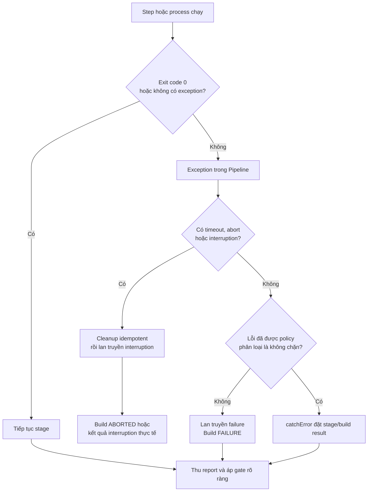

<Callout type="info" title="Phạm vi và điều kiện">
  Bài này dùng các Pipeline steps phổ biến từ bộ plugin Pipeline, đặc biệt là **Pipeline: Basic Steps**, trên agent Linux. `sh` cần shell Unix; `catchError`, `retry`, `timeout`, `error` và `unstable` cần được xác nhận trong **Pipeline Syntax** của controller đang vận hành. Ví dụ lab chỉ tạo file trong workspace, không dùng credential, dữ liệu production hoặc lệnh phá hủy.
</Callout>

Xử lý lỗi tốt không phải là làm dashboard xanh. Mục tiêu là giữ nguyên tín hiệu về chất lượng, chặn luồng không còn hợp lệ, đồng thời vẫn thu được log, report và dọn dẹp đúng phạm vi. Để đặt phần này vào cấu trúc Pipeline, xem [Tổng quan Jenkins Pipeline](/docs/pipelines/overview) và [Jenkinsfile](/docs/pipelines/jenkinsfile).

## Mục lục

- [Bốn tín hiệu trạng thái khác nhau](#bốn-tín-hiệu-trạng-thái-khác-nhau)
  - [Exception trong Pipeline](#exception-trong-pipeline)
  - [Exit code của process](#exit-code-của-process)
  - [Build result](#build-result)
  - [Stage result](#stage-result)
- [Luồng lỗi từ lệnh đến kết quả](#luồng-lỗi-từ-lệnh-đến-kết-quả)
- [Chọn cơ chế theo ý định](#chọn-cơ-chế-theo-ý-định)
  - [`error`, `unstable` và gán result](#error-unstable-và-gán-result)
  - [`currentBuild.result` và `currentBuild.currentResult`](#currentbuildresult-và-currentbuildcurrentresult)
- [Try catch finally và lan truyền failure](#try-catch-finally-và-lan-truyền-failure)
  - [Mẫu Scripted Pipeline](#mẫu-scripted-pipeline)
  - [Mẫu Declarative Pipeline](#mẫu-declarative-pipeline)
- [Retry có giới hạn cho lỗi tạm thời](#retry-có-giới-hạn-cho-lỗi-tạm-thời)
  - [Chính sách retry an toàn](#chính-sách-retry-an-toàn)
  - [Phạm vi và thứ tự retry timeout](#phạm-vi-và-thứ-tự-retry-timeout)
- [Timeout interruption và abort](#timeout-interruption-và-abort)
  - [Chọn phạm vi timeout](#chọn-phạm-vi-timeout)
  - [Không nuốt interruption](#không-nuốt-interruption)
- [CatchError cho lỗi đã được phân loại](#catcherror-cho-lỗi-đã-được-phân-loại)
  - [Khi nào được tiếp tục](#khi-nào-được-tiếp-tục)
  - [Khi nào không dùng catchError](#khi-nào-không-dùng-catcherror)
- [ReturnStatus và quality gate tường minh](#returnstatus-và-quality-gate-tường-minh)
- [Cleanup report và bảo mật](#cleanup-report-và-bảo-mật)
- [Lab sandbox success failure timeout](#lab-sandbox-success-failure-timeout)
  - [Chuẩn bị](#chuẩn-bị)
  - [Chạy ba kịch bản](#chạy-ba-kịch-bản)
  - [Đọc kết quả](#đọc-kết-quả)
- [Checklist trước khi merge](#checklist-trước-khi-merge)
- [Nguồn Jenkins chính thức](#nguồn-jenkins-chính-thức)
- [Đọc tiếp](#đọc-tiếp)

## Bốn tín hiệu trạng thái khác nhau

Một lỗi có thể đi qua nhiều lớp trước khi thành màu trên giao diện. Không đồng nhất bốn tín hiệu sau; mỗi tín hiệu trả lời một câu hỏi khác nhau.

| Tín hiệu | Nó là gì? | Ví dụ | Ai quyết định? |
| --- | --- | --- | --- |
| **Exception** | Một lỗi trong luồng Groovy/Pipeline làm block hiện tại kết thúc bất thường. | `error 'Quality gate failed'`, hoặc `sh` ném lỗi sau exit code `1`. | Step, Groovy hoặc plugin. |
| **Exit code** | Mã trả về của process hệ điều hành. `0` thường là thành công; khác `0` là process báo lỗi. | `npm test` trả `1`. | Shell, test runner hay command. |
| **Build result** | Kết quả tổng hợp của cả run Jenkins, như `SUCCESS`, `UNSTABLE`, `FAILURE` hay `ABORTED`. | Build đỏ sau unit test fail. | Pipeline engine và những bước đặt result. |
| **Stage result** | Kết quả hiển thị của một stage/flow node, dùng để định vị chặng có vấn đề. | Stage `Optional diagnostics` vàng/đỏ, trong khi các stage khác vẫn chạy. | Metadata Pipeline và plugin hiển thị. |

### Exception trong Pipeline

`error '... '`, timeout, abort và nhiều step thất bại đều có thể tạo exception. Nếu exception không được bắt, Pipeline dừng tại điểm đó; Jenkins ghi log và kết quả build xấu đi. Exception là cơ chế **điều khiển luồng**, không đồng nghĩa với exit code: một API step có thể ném exception dù không hề chạy shell.

Dùng `try/catch` khi cần thêm ngữ cảnh, báo cáo hoặc đổi một lỗi đã được phân loại thành kết quả đã thỏa thuận. Nếu lỗi vẫn phải chặn quality gate, `catch` phải `throw` lại exception hoặc gọi `error`; chỉ log rồi tiếp tục là làm mất failure propagation.

### Exit code của process

Trên agent Unix, `sh 'command'` mặc định coi exit code khác `0` là lỗi Pipeline và ném exception. Vì vậy `sh 'npm test'` thất bại sẽ làm stage/build dừng nếu không có cơ chế xử lý bao quanh.

`returnStatus: true` đổi hợp đồng này: `sh` trả một số nguyên thay vì tự ném lỗi. Pipeline lúc đó phải tự quyết định ý nghĩa của mã trả về. Đây là hữu ích khi cần ghi thêm report hoặc phân loại mã lỗi, nhưng nguy hiểm nếu quên biến status xấu thành `error`/result phù hợp.

### Build result

Build result là tín hiệu cuối cùng cho run. Một `FAILURE` không nên được đổi thành `SUCCESS` chỉ vì cleanup đã chạy hoặc lần thử sau tình cờ pass. Kết quả thường trở nên xấu hơn theo tiến trình; coi nó là tín hiệu cộng dồn, không phải biến để “reset” dashboard.

Các tên result và cách giao diện tô màu phụ thuộc Pipeline/plugin version. Hãy dùng các giá trị Jenkins công nhận, đọc Console Output của đúng build và xác nhận behavior trên Jenkins LTS của đội trước khi viết notification hoặc gate dựa vào màu UI.

### Stage result

Stage result giúp người vận hành thấy **chặng nào** có vấn đề; nó không phải một biến global độc lập như `currentBuild`. Ví dụ `catchError(buildResult: 'UNSTABLE', stageResult: 'FAILURE')` có thể để build tổng là vàng nhưng làm stage đã bắt lỗi hiện đỏ để người đọc tìm log đúng chỗ.

Cách Stage View, Blue Ocean hay giao diện khác hiển thị stage result có thể khác theo plugin/version. Đừng suy kết quality gate chỉ từ một ô màu: kiểm tra build result, log, report và policy phát hành. Bối cảnh stage/step và exit code có tại [Thiết kế Stages & Steps](/docs/pipelines/stages-steps).

## Luồng lỗi từ lệnh đến kết quả

Sơ đồ dưới mô tả đường đi thông thường. Nhánh `catchError` chỉ phù hợp khi policy đã nói rõ lỗi có thể tiếp tục với một kết quả không xanh; nó không phải nhánh “bỏ qua lỗi”.



`finally` hoặc `post { always { ... } }` có thể thu report/dọn tài nguyên sau nhiều nhánh trong sơ đồ. Chúng không bảo đảm chạy khi controller bị dừng cưỡng bức, JVM bị kill hoặc agent biến mất hoàn toàn; cleanup bên ngoài vẫn cần TTL và cơ chế thu gom riêng.

## Chọn cơ chế theo ý định

| Ý định | Cơ chế chính | Điều không được làm |
| --- | --- | --- |
| Chặn Pipeline vì quality gate không đạt | Để exception lan truyền hoặc gọi `error` | Bọc test gate bằng `catchError` rồi deploy tiếp. |
| Gắn nhãn chất lượng chưa đạt nhưng vẫn cần chạy report | `unstable` hoặc `catchError` với result không phải `SUCCESS` | Chỉ `echo` lỗi rồi coi build xanh. |
| Thử lại thao tác idempotent bị lỗi tạm thời | `retry` giới hạn và log từng attempt | Retry vô hạn, retry test/deploy để che failure. |
| Chặn lệnh/approval bị treo | `timeout` ở scope nhỏ nhất đủ dùng | Chỉ đặt timeout toàn cục rồi không biết phần nào treo. |
| Thu exit code để phân loại | `sh(returnStatus: true, ...)`, sau đó quyết định rõ | Bỏ qua status khác `0`. |
| Cleanup/report dù có lỗi | `finally`, `post { always }`, cleanup idempotent | Ghi đè kết quả thật trong cleanup. |

### `error`, `unstable` và gán result

Ba cách dưới có tác động khác nhau:

```groovy
// Dừng luồng hiện tại bằng exception; nếu không được bắt, build trở thành FAILURE.
error 'Unit test gate failed'

// Đánh dấu build UNSTABLE và thường tiếp tục các step sau.
unstable 'A non-blocking quality signal needs review'

// Đặt build result, nhưng không tự ném exception hoặc dừng luồng.
currentBuild.result = 'UNSTABLE'
```

- `error` phù hợp khi điều kiện làm Pipeline không còn hợp lệ, ví dụ test bắt buộc fail hoặc artifact thiếu.
- `unstable` phù hợp với một tín hiệu chất lượng đã có policy rõ, chẳng hạn một kiểm tra không chặn release trong giai đoạn chuyển đổi. Nó không chứng minh test đã pass.
- Gán `currentBuild.result` phù hợp khi code đã phân loại kết quả. Nếu vẫn phải dừng, gán result rồi gọi `error` hoặc ném lại exception; bản thân phép gán không dừng stage.

<Callout type="warn" title="Không làm xanh giả">
  Không đặt `currentBuild.result = 'SUCCESS'` trong `finally` hoặc `catch`. Jenkins thường chỉ cho kết quả xấu đi khi run đang tiến triển, và việc cố “sửa màu” che mất evidence. Một deploy hay test từng thất bại phải giữ failure/unstable theo policy, kể cả cleanup sau đó thành công.
</Callout>

### `currentBuild.result` và `currentBuild.currentResult`

`currentBuild` là global variable do Pipeline cung cấp. Hai thuộc tính thường bị nhầm lẫn:

| Thuộc tính | Khi đọc | Khi ghi | Caveat quan trọng |
| --- | --- | --- | --- |
| `currentBuild.result` | Có thể là `null` khi Jenkins chưa đặt kết quả cuối một cách tường minh. | Có thể gán chuỗi result hợp lệ như `UNSTABLE` hoặc `FAILURE`. | Không tự dừng flow; result chỉ nên xấu đi. |
| `currentBuild.currentResult` | Trả result hiện hành và thường không `null`; khi chưa có lỗi thường là `SUCCESS`. | Dùng để quan sát/log, không dùng như cơ chế sửa kết quả. | Giá trị là ảnh chụp tại thời điểm đọc, không thay thế kết quả cuối sau `post`/cleanup. |

Ví dụ logging an toàn trong `post`:

```groovy
post {
  always {
    echo "Build #${env.BUILD_NUMBER}: ${currentBuild.currentResult}"
  }
}
```

`currentBuild` đến từ Pipeline Supporting APIs, không phải một biến Groovy thuần. Chi tiết setter, result strings và cách một stage được tô màu đã thay đổi theo version của các plugin Pipeline. Tra **Global Variable Reference** và **Pipeline Syntax** ngay trên controller trước khi dựa vào behavior này trong Shared Library hoặc policy release.

## Try catch finally và lan truyền failure

`try` chứa công việc có thể lỗi. `catch` dùng để bổ sung thông tin hoặc phân loại; `finally` dành cho dọn dẹp/report phải thử chạy dù đường thành công hay lỗi. Quy tắc mặc định cho quality gate là: **bắt để quan sát, rồi lan truyền lại để chặn luồng**.

### Mẫu Scripted Pipeline

Mẫu Scripted sau yêu cầu agent Linux mang label `linux`. `Refresh manifest` giả định script chỉ tải/kiểm tra dữ liệu sandbox và có thể chạy lại mà không tạo side effect. Lệnh test dùng `returnStatus`; status khác `0` được đổi lại thành failure rõ ràng.

```groovy
node('linux') {
  stage('Refresh manifest') {
    try {
      timeout(time: 90, unit: 'SECONDS') {
        retry(3) { // Tối đa 3 attempt, gồm attempt đầu tiên.
          sh './scripts/refresh-sandbox-manifest.sh'
        }
      }

      int testStatus = sh(
        returnStatus: true,
        script: './scripts/run-required-tests.sh'
      )
      if (testStatus != 0) {
        error "Required tests returned exit code ${testStatus}"
      }
    } catch (Exception err) {
      echo "Required work stopped: ${err.getClass().getSimpleName()}"
      // Giữ nguyên failure/timeout/abort thay vì biến nó thành success.
      throw err
    } finally {
      // Cleanup chỉ ở workspace của build; returnStatus tránh che lỗi gốc.
      sh(returnStatus: true, script: 'rm -f .sandbox-manifest.tmp')
      echo "Observed result: ${currentBuild.currentResult}"
    }
  }

  stage('Optional diagnostics') {
    catchError(
      buildResult: 'UNSTABLE',
      stageResult: 'UNSTABLE',
      message: 'Diagnostics could not be collected'
    ) {
      sh './scripts/collect-sandbox-diagnostics.sh'
    }
  }
}
```

`throw err` là phần quyết định: nếu bỏ nó, lỗi test/timeout bị bắt có thể khiến Pipeline đi tiếp. Trong `finally`, `returnStatus: true` chỉ dùng cho cleanup best-effort; log cleanup vẫn phải được xem, và file cần giữ làm evidence phải được archive trước khi xóa.

### Mẫu Declarative Pipeline

Declarative Pipeline dùng `script {}` cho `try/catch/finally` Groovy. Những steps như `timeout`, `retry`, `catchError` và `sh` vẫn dùng được trong `steps`. Mẫu dưới chỉ gọi script sandbox có owner rõ ràng; không đặt credential hay lệnh deploy.

```groovy
pipeline {
  agent none

  stages {
    stage('Fetch retryable input') {
      agent { label 'linux' }
      options { timeout(time: 3, unit: 'MINUTES') }
      steps {
        timeout(time: 90, unit: 'SECONDS') {
          retry(3) {
            sh './scripts/refresh-sandbox-manifest.sh'
          }
        }
      }
    }

    stage('Required verification') {
      agent { label 'linux' }
      steps {
        script {
          try {
            int status = sh(
              returnStatus: true,
              script: './scripts/run-required-tests.sh'
            )
            if (status != 0) {
              error "Required verification returned exit code ${status}"
            }
          } catch (Exception err) {
            echo "Verification failed: ${err.getClass().getSimpleName()}"
            throw err
          } finally {
            sh(returnStatus: true, script: 'rm -f .verification.tmp')
          }
        }
      }
    }

    stage('Optional diagnostics') {
      agent { label 'linux' }
      steps {
        catchError(
          buildResult: 'UNSTABLE',
          stageResult: 'UNSTABLE',
          message: 'Optional diagnostics failed'
        ) {
          sh './scripts/collect-sandbox-diagnostics.sh'
        }
      }
    }
  }

  post {
    always {
      echo "Build result observed in post: ${currentBuild.currentResult}"
    }
  }
}
```

Ở đây timeout 90 giây bảo vệ riêng lần tải input; stage timeout 3 phút là hàng rào rộng hơn cho cả stage. Hai limit không thay cho nhau. Đừng copy hai tầng timeout nếu bạn không thể giải thích limit nào bảo vệ điều gì.

## Retry có giới hạn cho lỗi tạm thời

`retry(3) { ... }` chạy lại body tối đa ba attempt khi body ném lỗi. Nó chỉ hữu ích khi lỗi **tạm thời**, bằng chứng đã cho thấy lần chạy lại có cơ sở, và body **idempotent**: chạy lại với cùng input không tạo thêm effect không mong muốn.

### Chính sách retry an toàn

Trước khi thêm retry, ghi rõ các điểm sau trong Jenkinsfile hoặc tài liệu vận hành:

1. **Loại lỗi được retry.** Ví dụ DNS/network chập chờn khi tải manifest sandbox, agent bị ngắt kết nối hoặc API sandbox có `429` đã được ghi log. Assertion ứng dụng, dependency lockfile sai và thiếu file không phải lỗi tạm thời mặc định.
2. **Giới hạn cố định.** Chọn số attempt nhỏ, chẳng hạn `3` gồm lần đầu, và timeout cho từng attempt hoặc cho toàn retry. Không có retry vô hạn.
3. **Idempotency.** Tải lại file read-only hoặc kiểm tra trạng thái có thể an toàn. Tạo release, charge payment, migrate schema, gửi email hoặc deploy phải có khóa/deduplication/idempotency key và kiểm tra trạng thái đích trước khi cân nhắc retry.
4. **Evidence.** Log attempt, endpoint không nhạy cảm, exit code/exception và build URL. Attempt cuối vẫn fail phải làm Pipeline fail để owner xử lý.

<Callout type="warn" title="Test và deploy không được xanh nhờ retry">
  Không bọc `npm test`, `mvn test`, quality gate hoặc deploy production bằng retry chỉ để giảm build đỏ. Test đỏ rồi xanh là evidence cần điều tra flaky; deploy bị gián đoạn cần xác minh trạng thái đích trước, không gửi lại cùng yêu cầu một cách mù quáng. Giữ log, revision, report và owner cho việc điều tra; quarantine chỉ là biện pháp có thời hạn.
</Callout>

### Phạm vi và thứ tự retry timeout

Phạm vi block quyết định hành động nào bị chạy lại và đồng hồ nào bao phủ nó:

```groovy
// Một deadline 2 phút cho toàn bộ tối đa 3 attempt.
timeout(time: 2, unit: 'MINUTES') {
  retry(3) {
    sh './scripts/refresh-sandbox-manifest.sh'
  }
}

// Mỗi attempt có deadline 40 giây; tổng thời gian có thể gần 3 × 40 giây.
retry(3) {
  timeout(time: 40, unit: 'SECONDS') {
    sh './scripts/refresh-sandbox-manifest.sh'
  }
}
```

Mẫu đầu tiên kiểm soát latency tổng tốt hơn. Mẫu thứ hai phù hợp khi từng attempt cần cùng một deadline và policy chấp nhận tổng thời gian dài hơn. Cả hai vẫn cần một số attempt hữu hạn. Chỉ bọc **một step idempotent**, không bọc checkout, test, publish và deploy trong cùng block nếu không phải tất cả đều retryable.

## Timeout interruption và abort

`timeout` dừng body khi vượt deadline bằng interruption. Người dùng chọn **Abort**, `failFast` hủy sibling hoặc controller/agent gặp gián đoạn cũng có thể tạo một đường interruption khác. Khi không có failure gốc khác, kết quả thường quan sát là `ABORTED`; hãy xem log/result thực tế thay vì ép nó thành `FAILURE` hay `SUCCESS` trong `catch`.

### Chọn phạm vi timeout

- **Step timeout:** bao quanh một lệnh gọi service hoặc lock để biết chính xác hành động treo.
- **Stage timeout:** giới hạn checkout/test/approval của một stage. Trong Declarative, stage `options { timeout(...) }` được áp dụng trước khi stage agent được cấp, nên thời gian chờ agent cũng tính vào limit.
- **Pipeline timeout:** là hàng rào tổng cho build dài. Với top-level agent trong Declarative, thời điểm cấp agent so với timeout khác stage-level; kiểm tra Pipeline Syntax/version của instance trước khi đặt SLO dựa vào thời gian queue/provisioning.

Dùng scope hẹp nhất vẫn bảo vệ rủi ro. Một timeout toàn Pipeline chỉ nói build đã quá hạn, còn timeout stage giúp biết checkout, test hay approval nào cần sửa. Với nhánh song song, mỗi branch cần deadline riêng và phải giữ được dấu vết interruption của chính branch đó.

### Không nuốt interruption

`catchError` mặc định có thể bắt interruption, bao gồm timeout, tùy cấu hình/version của Pipeline: Basic Steps. Khi body chứa thao tác không được phép tiếp tục sau abort/timeout, đặt `catchInterruptions: false` để interruption lan truyền:

```groovy
catchError(
  buildResult: 'UNSTABLE',
  stageResult: 'UNSTABLE',
  catchInterruptions: false,
  message: 'Best-effort report was unavailable'
) {
  sh './scripts/collect-sandbox-diagnostics.sh'
}
```

Tương tự, một `catch (Exception err)` chung phải `throw err` trừ khi policy xử lý riêng và có bằng chứng cho loại exception đó. Không đổi abort thành `UNSTABLE` chỉ để chạy deploy hoặc notification success. `finally`/`post { always }` nên dọn tài nguyên của chính build và báo kết quả, không đảo ngược quyết định hủy.

## CatchError cho lỗi đã được phân loại

`catchError` bắt exception trong body, đặt result bạn khai báo và cho Pipeline đi tiếp. Nó là công cụ diễn đạt policy, không phải `try/catch` rút gọn để im lặng bỏ qua lỗi.

### Khi nào được tiếp tục

Một trường hợp hợp lệ là thu thập diagnostics phụ trợ: report không có có thể làm build `UNSTABLE`, nhưng không thay đổi việc test gate bắt buộc đã pass/fail. Ví dụ sau giữ tín hiệu vàng và đánh dấu stage để điều tra:

```groovy
catchError(
  buildResult: 'UNSTABLE',
  stageResult: 'FAILURE',
  message: 'Could not upload non-blocking diagnostics'
) {
  sh './scripts/upload-sandbox-diagnostics.sh'
}
```

Sau block này Pipeline sẽ tiếp tục. Nếu stage sau là publish/deploy, phải có điều kiện quality gate độc lập và rõ ràng; đừng suy ra “được deploy” từ việc exception đã bị bắt. Thông số `buildResult`, `stageResult`, `message` và `catchInterruptions` phụ thuộc version plugin; tạo snippet bằng Pipeline Syntax để đối chiếu signature trên controller.

### Khi nào không dùng catchError

Không dùng `catchError` quanh các việc sau trừ khi đội có một policy rất cụ thể, đã review và có gate khác thay thế:

- test bắt buộc, security scan chặn release, artifact integrity/signature hoặc quality gate;
- deploy, migration hay bất kỳ side effect nào chưa idempotent;
- checkout/source provenance mà các stage sau cần tin cậy;
- timeout/abort mà Pipeline phải dừng ngay;
- lỗi credential, quyền hoặc PR/fork không tin cậy.

Khi `catchError` không phù hợp, để exception lan truyền. Nếu cần report trước khi dừng, dùng `post { always }` hoặc `finally` thay vì bắt lỗi để qua stage kế tiếp.

## ReturnStatus và quality gate tường minh

`returnStatus` giúp phân loại exit code mà không để `sh` ném lỗi ngay. Mọi đường status xấu phải có kết thúc tường minh. Mẫu sau chỉ coi `0` là đạt; những mã khác được đổi thành failure với ngữ cảnh.

```groovy
script {
  int status = sh(
    returnStatus: true,
    label: 'Run required unit tests',
    script: './scripts/run-required-tests.sh'
  )

  if (status != 0) {
    error "Required unit tests failed with exit code ${status}"
  }

  echo 'Required unit tests passed.'
}
```

Có thể phân loại mã đặc biệt nếu chính tool của bạn cam kết semantics đó, ví dụ `75` là dependency sandbox tạm thời. Khi đó log đúng mã, retry riêng step idempotent có deadline, rồi vẫn `error` nếu hết attempt. Không dùng một danh sách mã “có vẻ retryable” mà không có tài liệu/tool evidence.

`returnStatus` không bắt được mọi loại lỗi: timeout, agent loss, sandbox rejection hay lỗi Pipeline API vẫn có thể ném exception. Vì thế nó bổ sung cho `try/catch` và timeout, không thay thế chúng.

## Cleanup report và bảo mật

Cleanup nên có ba đặc tính: **idempotent**, **scope hẹp** và **không che lỗi gốc**. Chỉ dọn file/tài nguyên mang ID của build hoặc nằm trong workspace hiện tại; với tài nguyên sandbox bên ngoài, dùng namespace riêng và TTL. `deleteDir()` hay lệnh xóa chỉ được gọi sau khi đã archive report cần giữ và chỉ trong workspace do Jenkins cấp.

Trong Declarative, dùng `post { always { ... } }` để publish JUnit/artifact và ghi metadata sau success, failure hay abort. Trong Scripted, dùng `finally` quanh scope cần cleanup. Cả hai có thể không hoàn tất nếu controller/agent chết đột ngột, nên hệ thống sandbox vẫn cần garbage collection độc lập.

<Callout type="error" title="Cleanup không được làm lộ hoặc xóa nhầm dữ liệu">
  Không in environment, token, request header, test fixture nhạy cảm hay URL có credential khi báo lỗi. PR/fork không tin cậy không nhận secret phát hành và không chạy trên agent đặc quyền. Report, trace và artifact phải chỉ chứa dữ liệu sandbox đã được rà soát; cleanup không được dùng credential production hoặc một path/namespace không được kiểm tra.
</Callout>

Khi cần báo kết quả, log build number, revision, stage và `currentBuild.currentResult`; không log secret. Về ranh giới controller, agent, executor và workspace, xem [Kiến trúc Jenkins](/docs/getting-started/architecture) và [Yêu cầu hệ thống](/docs/getting-started/requirements).

## Lab sandbox success failure timeout

Lab này chứng minh ba đường kết quả mà không gọi network, credential hay deploy. Cần Jenkins có Pipeline: Declarative và Pipeline: Basic Steps, một agent Linux online label `linux`, và quyền tạo Pipeline job. Nếu cần controller cục bộ, xem [Chạy Jenkins với Docker](/docs/installation/docker). Dùng sandbox bạn kiểm soát, không dùng built-in node production.

### Chuẩn bị

Tạo Pipeline job `error-handling-lab`, chọn **Pipeline script**, dán Jenkinsfile sau và lưu. `SIMULATION` là choice cố định nên lab không đưa input tùy ý vào shell. `timeout` chỉ bao `sleep` của tình huống timeout; cleanup chỉ xóa một file do chính build tạo trong workspace.

```groovy
pipeline {
  agent none

  parameters {
    choice(
      name: 'SIMULATION',
      choices: ['success', 'failure', 'timeout'],
      description: 'Chỉ dùng cho lab; không gọi hệ thống bên ngoài.'
    )
  }

  stages {
    stage('Sandbox scenario') {
      agent { label 'linux' }
      options { timeout(time: 45, unit: 'SECONDS') }
      steps {
        script {
          try {
            if (params.SIMULATION == 'timeout') {
              timeout(time: 5, unit: 'SECONDS') {
                sh 'echo "timeout scenario started"; sleep 10'
              }
            }

            int status
            if (params.SIMULATION == 'failure') {
              status = sh(returnStatus: true, script: 'echo "intentional failure" >&2; exit 1')
            } else {
              status = sh(returnStatus: true, script: 'echo "intentional success"; touch .lab-output')
            }

            if (status != 0) {
              error "Sandbox scenario returned exit code ${status}"
            }
          } catch (Exception err) {
            echo "Scenario stopped: ${err.getClass().getSimpleName()}"
            throw err
          } finally {
            sh(returnStatus: true, script: 'rm -f .lab-output')
            echo "Cleanup observed: ${currentBuild.currentResult}"
          }
        }
      }
    }
  }

  post {
    always {
      echo "Final observed result: ${currentBuild.currentResult}"
    }
    failure {
      echo 'Failure is intentional for the lab; inspect exit code and stage log.'
    }
    aborted {
      echo 'Timeout is intentional for the lab; inspect interruption and timeout scope.'
    }
  }
}
```

### Chạy ba kịch bản

1. Chọn `SIMULATION=success`. `sh` trả `0`, `.lab-output` được tạo rồi dọn, stage xanh và build kết thúc `SUCCESS`.
2. Chọn `SIMULATION=failure`. `sh(returnStatus: true, ...)` trả `1`; `error` ném exception; `catch` log tên exception rồi ném lại. `finally` và `post { always }` vẫn chạy, còn build phải là `FAILURE`.
3. Chọn `SIMULATION=timeout`. `sleep 10` vượt inner timeout 5 giây. Interruption được ném lại, `finally` chạy best-effort và build thường là `ABORTED`. Nếu UI/plugin của instance biểu diễn khác, Console Output và result của build là bằng chứng để ghi nhận.

Không đổi `throw err` thành `echo` để “sửa” kịch bản failure/timeout. Sau lab, xóa job hoặc giữ nó trong folder sandbox có quyền tối thiểu; không thêm credential chỉ để mở rộng ví dụ.

### Đọc kết quả

Với từng build, ghi lại build number, `SIMULATION`, stage result, `currentBuild.currentResult` trong log và dòng đầu tiên báo exit code/interruption. Kiểm tra rằng cleanup không đổi kết quả:

| Kịch bản | Dấu vết gốc | Kết quả mong đợi | Việc cần học |
| --- | --- | --- | --- |
| `success` | `intentional success`, exit code `0` | `SUCCESS` | `returnStatus` phải được kiểm tra rõ. |
| `failure` | `intentional failure`, exit code `1`, `error` | `FAILURE` | Bắt lỗi nhưng ném lại giữ failure propagation. |
| `timeout` | `timeout scenario started`, thông điệp timeout/interruption | Thường `ABORTED` | Deadline và interruption không phải failure để nuốt. |

## Checklist trước khi merge

- [ ] Tôi phân biệt exception, exit code, build result và stage result; log của build là bằng chứng gốc.
- [ ] Test/quality gate bắt buộc để exception lan truyền hoặc gọi `error`; không bị `catchError` hay retry làm xanh giả.
- [ ] `returnStatus` luôn được kiểm tra và status xấu có `error`/result theo policy rõ ràng.
- [ ] Retry có số attempt hữu hạn, timeout, evidence và chỉ bao thao tác tạm thời/idempotent.
- [ ] Deploy, migration và side effect có kiểm tra trạng thái/idempotency trước khi xem xét retry.
- [ ] Timeout được đặt ở step/stage/Pipeline với lý do rõ; thời gian chờ agent/approval được tính đúng scope.
- [ ] Abort, timeout và interruption được lan truyền; `catchInterruptions` được chọn có chủ đích.
- [ ] `catchError` chỉ cho việc đã phân loại, để lại `UNSTABLE`/`FAILURE` trung thực và không mở đường deploy ngầm.
- [ ] `finally`/`post { always }` publish evidence trước cleanup; cleanup idempotent, đúng workspace/namespace và không che lỗi gốc.
- [ ] Plugin, version, agent toolchain và UI behavior đã được kiểm tra bằng Pipeline Syntax/Global Variable Reference của Jenkins instance.
- [ ] PR/fork không tin cậy không nhận secret, dữ liệu production hay agent đặc quyền; log/report/artifact không lộ secret.

## Nguồn Jenkins chính thức

- [Pipeline Syntax](https://www.jenkins.io/doc/book/pipeline/syntax/) — Declarative `options`, stage, `post` và cú pháp Pipeline.
- [Using a Jenkinsfile](https://www.jenkins.io/doc/book/pipeline/jenkinsfile/) — `Jenkinsfile`, `currentBuild`, kết quả build và cách thực thi step.
- [Pipeline Steps Reference](https://www.jenkins.io/doc/pipeline/steps/) — tra cứu steps theo plugin của controller.
- [Pipeline: Basic Steps](https://www.jenkins.io/doc/pipeline/steps/workflow-basic-steps/) — `catchError`, `error`, `unstable`, `retry`, `timeout` và cleanup steps.
- [Pipeline: Nodes and Processes](https://www.jenkins.io/doc/pipeline/steps/workflow-durable-task-step/) — `sh`, `returnStatus` và process trên agent.
- [Pipeline: Supporting APIs](https://plugins.jenkins.io/workflow-support/) — plugin cung cấp API hỗ trợ Pipeline như Run Wrapper/current build metadata.
- [Jenkins Pipeline](https://www.jenkins.io/doc/book/pipeline/) — mô hình Pipeline, agent và hoạt động của run.
- [Using Jenkins agents](https://www.jenkins.io/doc/book/using/using-agents/) — agent, executor, workspace và trust boundary.

## Đọc tiếp

<Cards>
  <Card title="Tổng quan Jenkins" href="/docs/getting-started/overview" description="Ôn lại vai trò Jenkins trong vòng phản hồi CI/CD." />
  <Card title="Kiến trúc Jenkins" href="/docs/getting-started/architecture" description="Hiểu controller, agent, executor và workspace khi xử lý failure." />
  <Card title="Nền tảng CI/CD" href="/docs/getting-started/ci-cd-fundamentals" description="Đặt quality gate và feedback vào quy trình phát hành." />
  <Card title="Chạy Jenkins với Docker" href="/docs/installation/docker" description="Dựng controller sandbox an toàn cho lab." />
  <Card title="Tổng quan Pipeline" href="/docs/pipelines/overview" description="Ôn cấu trúc và luồng thực thi Pipeline." />
  <Card title="Jenkinsfile" href="/docs/pipelines/jenkinsfile" description="Đưa chính sách xử lý lỗi vào Pipeline as Code." />
  <Card title="Declarative Pipeline" href="/docs/pipelines/declarative" description="Áp dụng options, post và stage agent trong Declarative." />
  <Card title="Thiết kế Stages & Steps" href="/docs/pipelines/stages-steps" description="Đọc exit code và thiết kế stage dễ quan sát." />
  <Card title="Agents Pipeline" href="/docs/pipelines/agents" description="Chọn agent và workspace phù hợp cho cleanup, timeout và trust boundary." />
  <Card title="Credentials Pipeline" href="/docs/pipelines/credentials" description="Cấp secret tối thiểu và không để failure path làm lộ credential." />
</Cards>
