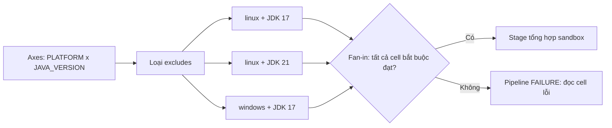

Matrix build của Declarative Pipeline chạy cùng một quy trình kiểm tra trên các combination môi trường đã khai báo, chẳng hạn hệ điều hành và phiên bản JDK. Nó giúp phát hiện lỗi tương thích sớm, nhưng cũng nhân số agent, workspace và chi phí toolchain. Bài này dùng một sandbox chỉ ghi file trong workspace và in log; không checkout, không dùng credential, không gọi cloud hay hạ tầng production.

<Callout type="info" title="Giả định phiên bản và hạ tầng">
  Ví dụ cần Jenkins LTS tương thích với plugin **Pipeline: Declarative** (`pipeline-model-definition`) có hỗ trợ directive `matrix`, cùng các plugin Pipeline cơ bản cung cấp `echo`, `writeFile` và `error`. Sandbox cần các agent Windows/Linux online có label `linux && jdk17`, `linux && jdk21` và `windows && jdk17`; muốn thấy ba cell chạy thật sự đồng thời cần ít nhất ba executor phù hợp. Kiểm tra phiên bản plugin và Directive Generator trên chính controller trước khi chuẩn hóa Jenkinsfile, vì cú pháp/khả năng có thể khác theo bản cài đặt.
</Callout>

## Mục lục

- [Mô hình và điều kiện](#mô-hình-và-điều-kiện)
  - [Khi nào Matrix phù hợp?](#khi-nào-matrix-phù-hợp)
- [`axes`: tích Descartes và biến môi trường](#axes-tích-descartes-và-biến-môi-trường)
  - [Combination là đơn vị thực thi](#combination-là-đơn-vị-thực-thi)
- [Cấu trúc Declarative: stages và excludes](#cấu-trúc-declarative-stages-và-excludes)
  - [Nested stages trong mỗi cell](#nested-stages-trong-mỗi-cell)
  - [`excludes` loại combination không hợp lệ](#excludes-loại-combination-không-hợp-lệ)
- [Fan-out, fan-in và giới hạn combination](#fan-out-fan-in-và-giới-hạn-combination)
- [Agent, workspace, executor và toolchain](#agent-workspace-executor-và-toolchain)
  - [Tránh resource explosion](#tránh-resource-explosion)
- [Chiến lược fail-fast và trạng thái cell](#chiến-lược-fail-fast-và-trạng-thái-cell)
  - [Đọc `SUCCESS`, `FAILURE`, `ABORTED`, `UNSTABLE` và `Skipped`](#đọc-success-failure-aborted-unstable-và-skipped)
- [Chọn Matrix hay parallel](#chọn-matrix-hay-parallel)
- [Jenkinsfile Matrix sandbox](#jenkinsfile-matrix-sandbox)
  - [Cách đọc cú pháp và kết quả](#cách-đọc-cú-pháp-và-kết-quả)
- [Lab sandbox: success và failure có chủ đích](#lab-sandbox-success-và-failure-có-chủ-đích)
  - [Chuẩn bị](#chuẩn-bị)
  - [Chạy success](#chạy-success)
  - [Chạy failure và đọc fan-in](#chạy-failure-và-đọc-fan-in)
- [Checklist áp dụng](#checklist-áp-dụng)
- [Nguồn Jenkins chính thức](#nguồn-jenkins-chính-thức)
- [Đọc tiếp](#đọc-tiếp)

## Mô hình và điều kiện

Matrix là một dạng fan-out có quy luật. Thay vì tự viết từng nhánh `Linux + JDK 17`, `Linux + JDK 21` và `Windows + JDK 17`, ta mô tả các trục (**axis**) và để Jenkins tạo cell cho từng combination hợp lệ. Mỗi cell thực thi cùng block `stages`, nhưng có giá trị axis và agent phù hợp riêng.

### Khi nào Matrix phù hợp?

Chọn Matrix khi **cùng một hợp đồng kiểm tra** cần được lặp lại trên nhiều biến thể độc lập: hệ điều hành, kiến trúc CPU, phiên bản runtime, database engine cô lập hoặc mode build. Ví dụ, cùng unit-test có thể cần xác nhận trên Linux/Windows và JDK 17/21.

Không đưa một quy trình khác bản chất vào Matrix chỉ vì nó cũng chạy song song. Nếu một nhánh là lint, nhánh khác là quét license và nhánh thứ ba là smoke test, mỗi nhánh có stage/đầu vào/tiêu chí riêng; [`parallel`](/docs/pipelines/parallel) diễn đạt chúng rõ hơn. Nền tảng của `pipeline {}`, `stage` và `agent` nằm ở [Declarative Pipeline](/docs/pipelines/declarative).

<Callout type="warn" title="Matrix không tự tạo môi trường">
  Khai báo `JAVA_VERSION = '21'` chỉ chọn một giá trị và tạo biến môi trường; nó không cài JDK 21 lên agent. Label, image hoặc tool configuration phải thật sự cung cấp toolchain đó. Không đổi sang `agent any` để làm cell qua queue: đó chỉ che một yêu cầu năng lực chưa được đáp ứng.
</Callout>

## `axes`: tích Descartes và biến môi trường

Một `axis` có tên và một hoặc nhiều `values`. Jenkins lấy **tích Descartes** của các tập giá trị: mỗi giá trị của trục thứ nhất ghép với từng giá trị của trục thứ hai, rồi tiếp tục với mọi trục còn lại. Với `PLATFORM = {linux, windows}` và `JAVA_VERSION = {17, 21}`, số combination ban đầu là `2 × 2 = 4`.

Giá trị mỗi axis được đưa vào môi trường của cell bằng đúng tên axis. Trong Groovy/Pipeline có thể đọc `env.PLATFORM` và `env.JAVA_VERSION`; trong shell Unix là `$PLATFORM`, `$JAVA_VERSION`, còn shell Windows thường là `%PLATFORM%`, `%JAVA_VERSION%`. Ví dụ dùng step `echo` của Jenkins để không phụ thuộc shell. Tránh đặt biến `environment` cùng tên axis hoặc sửa nó giữa chừng: cell cần giữ identity nhất quán để log, report và label có ý nghĩa.

### Combination là đơn vị thực thi

| `PLATFORM` | `JAVA_VERSION` | Combination trước `excludes` | Có chạy trong ví dụ? |
| --- | --- | --- | --- |
| `linux` | `17` | `linux + JDK 17` | Có |
| `linux` | `21` | `linux + JDK 21` | Có |
| `windows` | `17` | `windows + JDK 17` | Có |
| `windows` | `21` | `windows + JDK 21` | Không; bị exclude |

Tên stage hiển thị trong UI thường bao gồm tên Matrix và giá trị axes, nên từng cell là một ranh giới quan sát. Đó không có nghĩa mọi cell có filesystem chung: agent/workspace được cấp cho một cell có thể khác cell khác. Giữ tên report, cache key và thư mục tạm có chứa giá trị axes để tránh ghi đè.

## Cấu trúc Declarative: stages và excludes

Một stage bên ngoài chứa `matrix { ... }`. Bên trong `matrix`, thứ tự đọc nên là: khai báo `axes`, loại combination bằng `excludes`, chọn `agent`/`options` cho từng cell, rồi mô tả `stages` lặp lại. `failFast true` có thể được đặt trong Matrix để áp dụng đúng fan-out này.

### Nested stages trong mỗi cell

`stages` bên trong `matrix` là các **nested stages** chạy tuần tự trong *một* cell. Ví dụ, cell `linux + JDK 21` chạy `Xác nhận combination` trước `Sandbox check`; đồng thời cell đó vẫn có thể chạy song song với `windows + JDK 17`. Đặt stage con theo mốc quan sát được, không tách từng `echo` thành stage.

Một stage đã nằm trong `parallel` hoặc `matrix` không được lồng thêm `parallel`/`matrix` khác. Nếu cần thêm dimension, thêm axis có giới hạn rõ ràng; nếu có nhánh workflow khác bản chất, đưa nó thành stage/branch cùng cấp. Quy tắc này giữ đồ thị Pipeline và cách đọc log có thể dự đoán được.

### `excludes` loại combination không hợp lệ

`excludes` là filter khai báo, không phải câu lệnh bỏ qua ở runtime. Mỗi `exclude` có các block `axis` để chỉ ra một vùng của tích Descartes cần bỏ. Trong mẫu, `windows + JDK 21` bị loại vì sandbox giả định chưa có agent Windows với JDK đó:

```groovy
excludes {
  exclude {
    axis {
      name 'PLATFORM'
      values 'windows'
    }
    axis {
      name 'JAVA_VERSION'
      values '21'
    }
  }
}
```

Một `axis` trong `exclude` có thể có nhiều `values`; đó là cách loại nhiều giá trị trên cùng trục mà không lặp code. Hãy dùng `excludes` cho combination không được hỗ trợ hoặc không có hạ tầng. Đừng dùng nó để âm thầm né một test đang đỏ: sửa compatibility, ghi rõ support policy, hoặc tách test flaky để điều tra.

## Fan-out, fan-in và giới hạn combination

Matrix fan-out sau khi Jenkins xác định các combination hợp lệ. Mỗi cell xin agent, chạy nested stages và ghi log riêng. Stage đặt sau Matrix là **fan-in**: nó chỉ được chạy sau khi Matrix hoàn tất theo flow bình thường. Vì vậy nó là vị trí phù hợp để tổng hợp report hoặc chuyển sang một kiểm tra tiếp theo, không phải nơi suy đoán cell nào đã chạy từ một file workspace cục bộ.



Số cell dự kiến là tích số lượng values trên từng axis, trừ các combination bị exclude. Với ba axis mỗi axis bốn giá trị, trước filter đã có `4 × 4 × 4 = 64` cell. Con số này tăng nhanh hơn cảm nhận từ Jenkinsfile ngắn.

Đặt giới hạn trước khi mở rộng Matrix:

- bắt đầu bằng vài combination đại diện cho support policy, không phải mọi version đã từng tồn tại;
- loại combination không hỗ trợ bằng `excludes` và ghi lý do trong review/tài liệu;
- đặt timeout ở cell và đo queue time, wall-clock time, CPU, RAM, disk, network trước khi thêm axis/value;
- tách nightly compatibility matrix rộng khỏi pull request matrix ngắn nếu mục tiêu phản hồi khác nhau;
- chỉ fan-in/publish khi các cell bắt buộc đạt policy. Một cell optional cần được mô hình hóa và báo cáo rõ, không bị bỏ quên trong log.

## Agent, workspace, executor và toolchain

Matrix nhân nhu cầu thực thi. Ba cell không đồng nghĩa ba cell chạy ngay: nếu chỉ có một executor khớp label, hai cell còn lại sẽ chờ queue. Executor là slot Jenkins, không phải CPU core hay cam kết RAM. Nhiều executor trên một máy yếu còn có thể làm test chậm hơn vì tranh CPU, I/O, disk hoặc bộ nhớ.

Mẫu dùng `agent { label "${PLATFORM} && jdk${JAVA_VERSION}" }` trong Matrix. Nhờ đó, `linux + JDK 21` chỉ vào pool có cả Linux và JDK 21. Agent Windows không cần hiểu lệnh shell Unix vì sample không gọi `sh` hay `bat`; khi thay bằng test thật, tách lệnh theo OS hoặc dùng một runner đa nền tảng đã kiểm chứng.

### Tránh resource explosion

| Tài nguyên | Rủi ro khi nhân cell | Biện pháp thiết kế |
| --- | --- | --- |
| Agent/executor | Cell xếp queue, hoặc quá nhiều process cùng chạy trên một host. | Capacity theo label, quota concurrency và đo queue trước khi tăng executor. |
| Workspace | Report/file tạm đụng tên hoặc stage fan-in không thấy file của agent khác. | Tên file theo axis; archive/stash hoặc kho artifact cho dữ liệu cần chuyển giao. |
| Toolchain | JDK, browser, SDK hoặc image khác version; một label nói dối làm cell fail giả. | Label/image bất biến theo capability, kiểm tra version trong log và quản trị lifecycle image. |
| CPU/RAM/disk/cache | Download đồng thời, OOM, cache mutable hỏng hoặc disk đầy. | Cache read-only/key theo OS-version; quota, cleanup idempotent và theo dõi tài nguyên. |
| Dịch vụ dùng chung | Cell cạnh tranh port, database/schema hoặc rate limit. | Resource cô lập theo build/cell; lock phạm vi hẹp khi thật sự không thể cô lập. |

Workspace không phải artifact repository. Một nested stage trong cùng cell có thể dùng workspace đã được cấp, nhưng không nên giả định Matrix fan-in nhận đúng filesystem đó. Xem kỹ cơ chế queue, executor và workspace tại [Chọn agent cho Pipeline](/docs/pipelines/agents) và [Kiến trúc Jenkins](/docs/getting-started/architecture).

<Callout type="warn" title="Tách trust boundary trước khi nhân bản">
  Matrix cho pull request hoặc fork không tin cậy không được nhân rộng sang release agent, agent có Docker socket, credential production hay network đặc quyền. Mỗi cell tăng bề mặt thực thi của code được build; label và credential scope phải phản ánh mức tin cậy, không chỉ tốc độ.
</Callout>

## Chiến lược fail-fast và trạng thái cell

`failFast true` trong `matrix` yêu cầu Jenkins hủy các cell còn lại khi một cell có failure chưa được xử lý. Nó giảm executor và thời gian bị tiêu tốn khi một lỗi quyết định đã xuất hiện. Cell gây lỗi vẫn là `FAILURE`; những cell đang chạy có thể hiện `ABORTED` do bị hủy. Việc interruption đến process có thể mất thời gian, nên mỗi cell vẫn cần timeout và cleanup an toàn.

`options { parallelsAlwaysFailFast() }` ở cấp `pipeline` đặt policy rộng hơn: nó áp dụng cho mọi `parallel` **và** `matrix` trong Pipeline. Dùng lựa chọn toàn cục chỉ khi tất cả fan-out có cùng contract. Nếu chỉ compatibility Matrix cần dừng sớm, `failFast true` cục bộ dễ review và ít gây ngạc nhiên hơn.

Fail-fast không phải quality gate, `retry` hay cơ chế làm build xanh. Không bọc lỗi xác định bằng `catchError`, không tăng retry và không tắt test chỉ để fan-in chạy. Với lỗi flaky, lưu build number, revision, seed, report, toolchain và cell lỗi; tái tạo rồi sửa nguyên nhân trước khi đổi policy.

### Đọc `SUCCESS`, `FAILURE`, `ABORTED`, `UNSTABLE` và `Skipped`

| Trạng thái quan sát | Ý nghĩa trong Matrix | Cách đọc kết quả Pipeline |
| --- | --- | --- |
| `SUCCESS` | Step cell kết thúc hợp lệ. | Fan-in chỉ chạy khi các cell bắt buộc khác cũng thỏa policy. |
| `FAILURE` | Lệnh/step không được xử lý, assertion hoặc `error` thất bại. | Đây là nguyên nhân cần mở Console Output đầu tiên; Pipeline thường là `FAILURE`. |
| `ABORTED` | Người dùng/timeout hủy build, hoặc một sibling bị fail-fast hủy. | Nếu do fail-fast sau một cell đỏ, cell `FAILURE` vẫn quyết định Pipeline `FAILURE`; đừng chẩn đoán sibling aborted như lỗi gốc. |
| `UNSTABLE` | Report hoặc policy đánh dấu chất lượng chưa đạt mà không nhất thiết crash step. | Không coi vàng là xanh và không dựa vào nó như tín hiệu fail-fast mơ hồ; quy định rõ fan-in có chặn `UNSTABLE` hay không. |
| `Skipped` | `when` không đạt hoặc flow không đi tới cell/stage đó. | Skipped có thể là thiết kế hợp lệ, nhưng không chứng minh kiểm tra đã chạy. |

Đọc theo thứ tự: xác nhận build number/revision, tìm cell có trạng thái xấu đầu tiên, mở log của step lỗi, rồi mới đối chiếu các cell `ABORTED` và trạng thái tổng. Giao diện Stage View/Blue Ocean có thể trình bày khác theo plugin; Console Output của đúng build là bằng chứng quyết định.

## Chọn Matrix hay parallel

| Câu hỏi thiết kế | Matrix | `parallel` |
| --- | --- | --- |
| Công việc có cùng chuỗi stages trên mọi biến thể? | Phù hợp; axes sinh cell có cấu trúc giống nhau. | Có thể lặp code và khó giữ các nhánh đồng nhất. |
| Khác nhau chủ yếu là OS, runtime, kiến trúc hoặc config? | Phù hợp; biểu diễn khác biệt bằng axis và `excludes`. | Chỉ dùng khi số biến thể rất ít và cần tên branch riêng. |
| Mỗi nhánh có mục tiêu/lệnh/đầu ra khác bản chất? | Không phù hợp; Matrix sẽ làm axis trở nên gượng ép. | Phù hợp; mỗi branch mô tả workflow riêng. |
| Cần nested stages tuần tự trong từng nhánh/cell? | Có; `stages` trong Matrix lặp cho từng combination. | Có; branch stage chứa `stages` tuần tự. |
| Cần policy hủy sớm? | `failFast true` cho Matrix hoặc global `parallelsAlwaysFailFast()`. | `failFast true` trên stage `parallel` hoặc global option. |

Có thể dùng cả hai trong một Pipeline ở những stage cùng cấp khác nhau, nhưng không lồng `parallel`/`matrix` vào branch stage của một fan-out khác. Bắt đầu bằng mô hình phản ánh workflow, rồi mới tối ưu thời gian. Bài [Parallel Stages có kiểm soát](/docs/pipelines/parallel) giải thích chi tiết branch độc lập, lock và fan-in.

## Jenkinsfile Matrix sandbox

Mẫu hoàn chỉnh dưới đây có hai axes, nested stages, `excludes` đúng cú pháp và fail-fast cục bộ. Nó không checkout SCM, không dùng secret và chỉ `writeFile` một file nhỏ trong workspace của chính cell. Parameter `SIMULATE_FAILURE` chỉ làm `windows + JDK 17` fail có chủ đích để quan sát trạng thái; nó không gọi bất kỳ hạ tầng thật nào.

```groovy
pipeline {
  agent none

  options {
    skipDefaultCheckout(true)
    timeout(time: 10, unit: 'MINUTES')
  }

  parameters {
    booleanParam(
      name: 'SIMULATE_FAILURE',
      defaultValue: false,
      description: 'Chỉ cho lab: làm cell windows + JDK 17 thất bại có chủ đích.'
    )
  }

  stages {
    stage('Compatibility matrix sandbox') {
      matrix {
        failFast true

        axes {
          axis {
            name 'PLATFORM'
            values 'linux', 'windows'
          }
          axis {
            name 'JAVA_VERSION'
            values '17', '21'
          }
        }

        excludes {
          exclude {
            axis {
              name 'PLATFORM'
              values 'windows'
            }
            axis {
              name 'JAVA_VERSION'
              values '21'
            }
          }
        }

        agent {
          label "${PLATFORM} && jdk${JAVA_VERSION}"
        }

        options {
          timeout(time: 2, unit: 'MINUTES')
        }

        stages {
          stage('Xác nhận combination') {
            steps {
              echo "cell=platform=${env.PLATFORM},java=${env.JAVA_VERSION},node=${env.NODE_NAME}"
            }
          }

          stage('Sandbox check') {
            steps {
              script {
                if (params.SIMULATE_FAILURE && PLATFORM == 'windows' && JAVA_VERSION == '17') {
                  error('intentional failure: windows + JDK 17')
                }
              }
              writeFile(
                file: "matrix-${PLATFORM}-jdk${JAVA_VERSION}.txt",
                text: "sandbox result for ${PLATFORM} + JDK ${JAVA_VERSION}\n"
              )
              echo "sandbox=PASS platform=${PLATFORM} java=${JAVA_VERSION}"
            }
          }
        }

        post {
          always {
            echo "cell finished: platform=${PLATFORM}, java=${JAVA_VERSION}"
          }
        }
      }
    }

    stage('Fan-in: summarize sandbox') {
      agent { label 'linux && jdk17' }
      steps {
        echo 'All required Matrix cells passed; fan-in can now summarize a sandbox result.'
      }
    }
  }

  post {
    success {
      echo 'Pipeline result: SUCCESS'
    }
    failure {
      echo 'Pipeline result: FAILURE; inspect the first failed Matrix cell before retrying.'
    }
    aborted {
      echo 'Pipeline result: ABORTED; identify the interruption source.'
    }
    always {
      echo "Final result: ${currentBuild.currentResult}"
    }
  }
}
```

### Cách đọc cú pháp và kết quả

- `agent none` không giữ executor cho toàn Pipeline. Matrix cấp một agent theo label động cho mỗi cell; stage fan-in xin riêng `linux && jdk17`.
- `axes` tạo bốn combination, còn `excludes` bỏ `windows + JDK 21`, nên tối đa ba cell được lên lịch. `JAVA_VERSION` và `PLATFORM` là biến axis trong từng cell.
- Hai nested stage chạy theo thứ tự ở mỗi cell. `writeFile` tạo `matrix-<platform>-jdk<version>.txt` có tên riêng, nhưng file này chỉ là dấu vết local; fan-in không đọc nó.
- Khi `SIMULATE_FAILURE=false`, ba cell in `sandbox=PASS`, rồi `Fan-in: summarize sandbox` chạy và Pipeline là `SUCCESS`.
- Khi parameter là `true`, `error` làm cell Windows/JDK 17 thành `FAILURE`. Fail-fast yêu cầu hủy các cell còn đang chạy; fan-in không chạy và Pipeline phải là `FAILURE`, không phải `ABORTED` chỉ vì sibling bị hủy.

<Callout type="idea" title="Validate trước khi chạy">
  Dán Jenkinsfile vào **Declarative Directive Generator** hoặc validator của Jenkins instance để kiểm tra plugin/version thực tế. Nếu label động không tìm thấy agent, đó là lỗi provisioning/capacity có giá trị để sửa, không phải lý do xóa axis hoặc đổi thành `any`.
</Callout>

## Lab sandbox: success và failure có chủ đích

Lab dùng một controller sandbox bạn kiểm soát. Nếu cần cài local, xem [Chạy Jenkins với Docker](/docs/installation/docker); kiểm tra Java, disk và network theo [Yêu cầu hệ thống](/docs/getting-started/requirements). Không thêm credential, repository URL, cloud account hay secret vào job.

### Chuẩn bị

<Steps>
<Step>

**Xác minh capability.** Trong **Manage Jenkins → Nodes**, chuẩn bị các agent có các label nêu ở đầu bài. Mỗi label phải thật sự có hệ điều hành/JDK tương ứng. Có ít executor hơn ba vẫn chạy được, nhưng một số cell chờ queue thay vì đồng thời.

</Step>
<Step>

**Tạo Pipeline sandbox.** Chọn **New Item → Pipeline**, đặt tên `matrix-sandbox`, chọn pipeline script, dán Jenkinsfile ở trên và lưu. Mẫu đã tắt checkout mặc định nên không cần repository.

</Step>
<Step>

**Kiểm tra cấu trúc.** Đối chiếu `matrix`, `axes`, `excludes`, `agent` và `stages` bằng Pipeline Syntax/Declarative Directive Generator. Xác nhận `windows + JDK 21` không có agent là có chủ đích; không thêm label đó chỉ để làm lab phức tạp hơn.

</Step>
</Steps>

### Chạy success

Chọn **Build with Parameters**, giữ `SIMULATE_FAILURE=false` rồi chạy. Quan sát ba cell hợp lệ trong giao diện Pipeline và Console Output. Mỗi cell cần in dòng `cell=platform=...` rồi `sandbox=PASS ...`; cell `windows + JDK 21` không được tạo. Sau khi tất cả cell bắt buộc đạt, stage `Fan-in: summarize sandbox` in dòng tổng hợp và build kết thúc `SUCCESS`.

Nếu một cell chờ queue, mở **Build Queue** và kiểm tra label/executor. Nếu cell lỗi ngay tại toolchain khi bạn thay sample bằng test thật, so sánh version tool được log với contract của label. Không tăng số executor hoặc lặp lại build trước khi biết cell nào và vì sao không đáp ứng capability.

### Chạy failure và đọc fan-in

Chạy build mới với `SIMULATE_FAILURE=true`. Cell `windows + JDK 17` phải in `intentional failure` và có trạng thái `FAILURE`. Cell Linux còn đang chạy có thể bị fail-fast hủy, nên có thể hiện `ABORTED` tùy timing. `Fan-in: summarize sandbox` không chạy; kết quả Pipeline là `FAILURE`.

Mở log theo thứ tự cell Windows/JDK 17 → dòng `intentional failure` → kết quả build tổng → các cell bị hủy. Sau đó đặt parameter lại `false` và tạo build mới để chứng minh nguyên nhân lab đã được loại bỏ. Không thêm `retry`, không đổi `error` thành `catchError`, và không tắt `failFast` chỉ để lần failure trông xanh hơn.

## Checklist áp dụng

- [ ] Matrix biểu diễn một quy trình lặp lại trên biến thể độc lập; workflow khác bản chất dùng `parallel` hoặc stage riêng.
- [ ] Tôi tính số combination theo tích Descartes, giới hạn values, và dùng `excludes` có lý do rõ ràng.
- [ ] Tên axis không đụng `environment` tùy ý; log/report/cache key mang identity của cell.
- [ ] Nested stages phản ánh thứ tự trong một cell; không lồng fan-out khác vào branch/cell.
- [ ] Label/image/tool configuration thật sự cung cấp toolchain; agent, executor, CPU, RAM, disk và queue time đã được đo theo capacity.
- [ ] Workspace/file, port, cache và dịch vụ dùng chung có policy cách ly; fan-in không giả định filesystem cell dùng chung.
- [ ] Matrix PR không tin cậy không chạm release agent, secret, Docker socket hoặc network đặc quyền.
- [ ] `failFast` là cancellation policy có phạm vi rõ; cell `FAILURE` được điều tra trước, `ABORTED` sibling không bị nhầm là nguyên nhân.
- [ ] `UNSTABLE` và `Skipped` có policy fan-in rõ; retry/fail-fast không được dùng để che failure hoặc flaky test.
- [ ] Jenkins LTS, Pipeline: Declarative và plugin step đã được xác minh trên controller bằng validator và một build sandbox.

## Nguồn Jenkins chính thức

- [Pipeline Syntax — Matrix](https://www.jenkins.io/doc/book/pipeline/syntax/#matrix) — cú pháp `matrix`, `axes`, `excludes`, nested `stages`, `agent` và `failFast`.
- [Pipeline Syntax — options](https://www.jenkins.io/doc/book/pipeline/syntax/#options) — `parallelsAlwaysFailFast()` và phạm vi option Declarative.
- [Using a Jenkinsfile](https://www.jenkins.io/doc/book/pipeline/jenkinsfile/) — environment, agent và cấu trúc Jenkinsfile.
- [Using Jenkins agents](https://www.jenkins.io/doc/book/using/using-agents/) — agent, executor, workspace và queue.
- [Pipeline: Basic Steps](https://www.jenkins.io/doc/pipeline/steps/workflow-basic-steps/) — tham chiếu `writeFile`, `error`, `timeout` và các step cơ bản.
- [Pipeline: Declarative plugin](https://plugins.jenkins.io/pipeline-model-definition/) — thông tin tương thích/version plugin cung cấp Declarative Pipeline.

## Đọc tiếp

<Cards>
  <Card title="Tổng quan Jenkins" href="/docs/getting-started/overview" description="Ôn vai trò Jenkins trong vòng phản hồi CI/CD." />
  <Card title="Kiến trúc Jenkins" href="/docs/getting-started/architecture" description="Hiểu controller, queue, agent, executor và workspace." />
  <Card title="Yêu cầu hệ thống" href="/docs/getting-started/requirements" description="Đánh giá Java, disk và capacity cho Jenkins." />
  <Card title="Nền tảng CI/CD" href="/docs/getting-started/ci-cd-fundamentals" description="Đặt compatibility testing trong feedback loop." />
  <Card title="Chạy Jenkins với Docker" href="/docs/installation/docker" description="Tạo controller local cho lab an toàn." />
  <Card title="Tổng quan Pipeline" href="/docs/pipelines/overview" description="Ôn Pipeline as Code và quan sát build." />
  <Card title="Declarative Pipeline" href="/docs/pipelines/declarative" description="Nắm cấu trúc, directive và điều kiện Declarative." />
  <Card title="Parallel Stages" href="/docs/pipelines/parallel" description="So sánh nhánh độc lập, fan-in và fail-fast." />
  <Card title="Chọn agent" href="/docs/pipelines/agents" description="Route cell đến toolchain và trust boundary đúng." />
</Cards>
