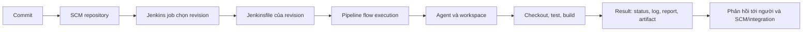

<Callout type="info" title="Phạm vi bài học">
  Trang này giải thích mô hình nền tảng của Jenkins Pipeline. Cú pháp, plugin và giao diện có thể khác theo bản Jenkins hay cấu hình cài đặt; hãy dùng tài liệu chính thức để xác nhận khả năng đang có trước khi chuẩn hóa quy trình cho đội.
</Callout>

## Mục lục

- [Pipeline là gì?](#pipeline-là-gì)
- [Pipeline as Code và Jenkinsfile](#pipeline-as-code-và-jenkinsfile)
  - [Vì sao Jenkinsfile nên ở SCM?](#vì-sao-jenkinsfile-nên-ở-scm)
- [Mô hình thực thi của Pipeline](#mô-hình-thực-thi-của-pipeline)
  - [Job, build và run](#job-build-và-run)
  - [Pipeline engine làm gì?](#pipeline-engine-làm-gì)
- [Từ flow đến feedback](#từ-flow-đến-feedback)
  - [Flow node, stage và step](#flow-node-stage-và-step)
  - [Biến kết quả thành phản hồi](#biến-kết-quả-thành-phản-hồi)
- [Flow durability và persistence](#flow-durability-và-persistence)
- [Quan sát build](#quan-sát-build)
  - [Stage View](#stage-view)
  - [Blue Ocean](#blue-ocean)
  - [Ví dụ đọc stage và log](#ví-dụ-đọc-stage-và-log)
- [Jenkinsfile tối thiểu](#jenkinsfile-tối-thiểu)
- [Lab: từ commit đến phản hồi](#lab-từ-commit-đến-phản-hồi)
  - [Tạo repository chứa Jenkinsfile](#tạo-repository-chứa-jenkinsfile)
  - [Tạo job từ SCM](#tạo-job-từ-scm)
  - [Đối chiếu flow với agent và workspace](#đối-chiếu-flow-với-agent-và-workspace)
  - [Quan sát stage và log](#quan-sát-stage-và-log)
  - [Tạo và xử lý feedback thất bại](#tạo-và-xử-lý-feedback-thất-bại)
- [Checklist áp dụng](#checklist-áp-dụng)
- [Nguồn Jenkins chính thức](#nguồn-jenkins-chính-thức)
- [Đọc tiếp](#đọc-tiếp)

## Pipeline là gì?

Jenkins Pipeline là mô tả có thể thực thi cho một quy trình tự động hóa, chẳng hạn checkout, kiểm thử và đóng gói. Pipeline biến một chuỗi lệnh dễ bị quên thành các chặng có tên, có trạng thái và có lịch sử. Mỗi lần chạy cho biết revision nào đã được kiểm tra, lệnh nào đã lỗi và đầu ra nào đã được tạo.

Pipeline không thay thế Git, test framework hay kho artifact. Jenkins điều phối các công cụ đó: controller nhận trigger và theo dõi trạng thái, còn agent chạy lệnh trong workspace. Nếu chưa quen với vai trò của controller, agent và executor, xem [Kiến trúc Jenkins](/docs/getting-started/architecture).

## Pipeline as Code và Jenkinsfile

**Pipeline as Code** là thực hành lưu định nghĩa Pipeline trong một file văn bản, thường là `Jenkinsfile`, cùng repository ứng dụng. Khi Jenkins chạy job từ SCM, nó lấy `Jenkinsfile` của revision đã chọn rồi dùng file đó để xác định các stage, step và điều kiện của lần chạy.

Ví dụ, một thay đổi thêm dependency có thể đồng thời sửa lệnh cài dependency trong `Jenkinsfile`. Code và cách kiểm tra code đi qua cùng pull request, thay vì một người sửa repository còn người khác âm thầm đổi script trên UI.

### Vì sao Jenkinsfile nên ở SCM?

Lưu `Jenkinsfile` trong SCM mang lại các lợi ích thực tế:

- **Review và audit:** thay đổi lệnh build, quality gate hoặc deploy có diff, người review và lịch sử commit.
- **Tái lập:** build của commit `abc123` dùng đúng định nghĩa Pipeline ở revision đó. Khi điều tra lỗi, nhóm không phải đoán script trên UI đã đổi lúc nào.
- **Cộng tác:** developer, QA và vận hành cùng đề xuất thay đổi quy trình qua branch/pull request thay vì cần quyền sửa job trực tiếp.
- **Khôi phục:** có thể checkout revision cũ để xem hoặc khôi phục định nghĩa đã từng hoạt động, theo quy trình Git của đội.

Lợi ích này không có nghĩa mọi `Jenkinsfile` đều an toàn. File đó có thể yêu cầu Jenkins thực thi lệnh, gọi API hoặc dùng credential. Vì vậy, quyền ghi vào repository và quyền chạy Pipeline phải được thiết kế theo ranh giới tin cậy.

<Callout type="warn" title="Chỉ chạy Pipeline từ code đáng tin cậy">
  Không hard-code token, mật khẩu hay private key vào `Jenkinsfile`, biến môi trường in ra log hoặc file trong workspace. Lưu secret trong Jenkins Credentials, cấp đúng scope và quyền tối thiểu cho job/stage/agent cần dùng. Với pull request hoặc fork không tin cậy, không tự động cấp credential có đặc quyền hay chạy workload đó trên controller.
</Callout>

## Mô hình thực thi của Pipeline

Luồng dưới đây là mô hình cơ bản. Trigger có thể là webhook, lịch hoặc thao tác **Build Now**; cách cấu hình SCM và agent cụ thể tùy Jenkins và plugin đang dùng.



Sơ đồ không có nghĩa Jenkins copy toàn bộ dữ liệu qua controller. Source code và lệnh thường chạy trong workspace của agent; controller điều phối, lưu metadata và hiển thị kết quả. Agent cần toolchain phù hợp và executor sẵn sàng. Các yêu cầu hạ tầng ban đầu nằm tại [Yêu cầu hệ thống](/docs/getting-started/requirements).

### Job, build và run

Ba từ này liên quan chặt chẽ nhưng không đồng nghĩa:

| Khái niệm | Vai trò | Ví dụ |
| --- | --- | --- |
| **Job** | Đối tượng Jenkins giữ cấu hình nguồn, trigger, quyền áp dụng và lịch sử. | Job `store-main` theo dõi branch `main`. |
| **Build** | Một lần job được yêu cầu và thực thi hoặc chờ thực thi. Build có số thứ tự, thời gian, log và kết quả. | `store-main #42`. |
| **Run** | Tên tổng quát Jenkins dùng cho một lần chạy có record kết quả; trong ngữ cảnh Pipeline, người dùng thường gọi run đó là build. | Record của build `#42` được mở để xem stage và log. |

Nói ngắn gọn: một job có nhiều build/run theo thời gian. Mỗi build/run gắn với một revision và trạng thái riêng, nên đừng đọc kết quả của build cũ rồi kết luận commit mới đã xanh.

### Pipeline engine làm gì?

Có thể hiểu **Pipeline engine** là lớp thực thi Pipeline: nó diễn giải định nghĩa, điều phối các step theo thứ tự hoặc song song, chờ các điểm như input/agent, ghi trạng thái và tạo đồ thị thực thi để Jenkins có thể tiếp tục quan sát. Nó không phải là Stage View hay Blue Ocean; hai giao diện đó đọc dữ liệu build đã được Pipeline ghi nhận.

Jenkins core cung cấp nền tảng controller, job, queue, security và build records. Khả năng Pipeline cụ thể — ví dụ cú pháp Declarative, các step tích hợp SCM hay một dạng giao diện — có thể đến từ các plugin Pipeline và plugin tích hợp. Vì vậy, không giả định mọi Jenkins có cùng step, cùng UI hoặc cùng cấu hình chỉ vì hai hệ thống đều chạy Jenkins.

## Từ flow đến feedback

Một Pipeline không chỉ là danh sách câu lệnh. Trong khi chạy, Jenkins ghi nhận một **flow**: đồ thị các hoạt động và ranh giới thực thi. Đồ thị này giúp liên kết phần việc có ý nghĩa với log và trạng thái của đúng lần chạy.

### Flow node, stage và step

- **Flow node** là một nút trong đồ thị runtime Pipeline. Nó có thể biểu diễn việc bắt đầu/kết thúc block, một step hoặc một điểm cấu trúc khác; nó là dấu vết máy dùng để nối flow.
- **Stage** là chặng được đặt tên cho người đọc, như `Test` hoặc `Package`. Stage tạo ranh giới quan sát và báo cáo; nó không phải đơn vị công việc nhỏ nhất.
- **Step** là hành động Pipeline cụ thể trong stage hoặc block, như `checkout`, `sh`, `junit` hay `archiveArtifacts`. Một step có thể tạo log, chờ agent hoặc thất bại.

Ví dụ, stage `Test` có thể chứa step `sh 'npm test'` và step publish test report. Khi `npm test` trả mã khác `0`, flow ghi nhận step lỗi; stage và build sau đó có thể hiện thất bại. Tên stage rõ ràng giúp người nhận feedback biết tìm log ở đâu, còn tên step/lệnh cụ thể giúp tìm nguyên nhân.

### Biến kết quả thành phản hồi

Kết quả `SUCCESS`, `FAILURE`, `ABORTED` hoặc trạng thái khác chỉ là điểm bắt đầu. Feedback có ích kết hợp ít nhất bốn dấu vết: commit/revision, build/run, stage lỗi và đoạn console log hoặc report liên quan.

Ví dụ, thay vì nhắn “CI đỏ”, hãy gửi: “commit `abc123`, build `#42`, stage `Test` thất bại; mở Console Output tại lệnh `npm test` và test report.” Người sửa có thể hành động ngay. Tích hợp trạng thái về pull request hoặc thông báo chat là khả năng tùy cấu hình/plugin; chất lượng của feedback vẫn phụ thuộc vào test và quy ước xử lý lỗi của đội. Xem bối cảnh rộng hơn tại [Nền tảng CI/CD](/docs/getting-started/ci-cd-fundamentals).

## Flow durability và persistence

Pipeline dài có thể đang chờ agent, input hoặc một external service khi controller được restart. **Flow durability** là khả năng lưu đủ trạng thái thực thi để Pipeline có cơ hội tiếp tục sau gián đoạn phù hợp. **Persistence** là việc ghi trạng thái/metadata đó vào storage bền vững của Jenkins, thường dưới `JENKINS_HOME` của controller.

Cấu hình durability quyết định tần suất và cách Pipeline lưu tiến trình. Ở mức khái niệm, mỗi lần lưu có thể xem là một **checkpoint**: nhiều checkpoint hơn tạo nhiều điểm để resume hơn và giảm phần việc có thể phải chạy lại hoặc bị mất dấu sau một sự cố không sạch. Đổi lại, chúng tăng I/O, dung lượng ghi và có thể làm giảm throughput trên controller bận. Lưu thưa hơn giảm chi phí ghi nhưng chấp nhận rủi ro mất nhiều tiến trình gần đây hơn khi crash.

Đừng hiểu durability là cam kết “không mất gì” hoặc thay thế backup. Khả năng resume còn phụ thuộc kiểu gián đoạn, step đang chạy, agent/workspace còn tồn tại và cấu hình Pipeline. Chọn mức durability theo mức quan trọng của workload và đo tác động trên môi trường thử nghiệm; với Pipeline phát hành dài hoặc chờ approval, ưu tiên khả năng khôi phục hơn là tối ưu vài lần ghi. Storage bền vững và backup của controller vẫn cần được thiết kế riêng.

## Quan sát build

Bắt đầu từ trang build/run và **Console Output**: đây là nguồn trực tiếp cho lệnh đã chạy, agent/workspace được cấp và lỗi trả về. Sau đó dùng UI stage để định vị nhanh chặng nào chậm hoặc đỏ. UI làm rõ dữ liệu; nó không sửa Pipeline, không tự xác minh chất lượng và không thay thế log.

### Stage View

Stage View là giao diện do plugin cung cấp để xem các stage của nhiều build theo dạng bảng/dòng thời gian đơn giản. Nó hữu ích khi bạn muốn so sánh nhanh build `#41`, `#42` và `#43`: stage nào xanh, đỏ, đang chạy hoặc mất nhiều thời gian. Chọn một ô stage để đi sâu vào log/build tương ứng khi giao diện cài đặt hỗ trợ liên kết đó.

Stage View cần Pipeline có stage được đặt tên rõ. Nó không bảo đảm hiển thị mọi chi tiết của flow phức tạp như `parallel`, step lồng nhau hay plugin custom theo một cách giống nhau ở mọi phiên bản. Hãy coi nó là chỉ mục trực quan, rồi xác nhận nguyên nhân bằng log và report.

### Blue Ocean

Blue Ocean là một giao diện Jenkins tùy chọn, được phân phối qua plugin, nhằm trình bày Pipeline theo đồ thị và tập trung vào trải nghiệm xem build. Nếu cài đặt của bạn có và đã bật Blue Ocean, nó có thể giúp duyệt stage, nhánh song song và chi tiết một run trực quan hơn.

Không giả định Blue Ocean hiện diện, được tổ chức bạn hỗ trợ hay tương thích với mọi plugin/Pipeline. Kiểm tra trang plugin, version Jenkins và chính sách vận hành hiện tại trước khi chọn nó làm giao diện chuẩn. Dù dùng Blue Ocean, Stage View hay UI khác, pipeline engine và Console Output mới là nơi tạo và giữ dấu vết thực thi.

### Ví dụ đọc stage và log

Với một Pipeline có stage `Checkout`, `Test` và `Package`, một lần chạy có thể được đọc như sau:

```text
Stage View / giao diện đồ thị
#42  Checkout  ✓  12s   Test  ✗  34s   Package  —

Console Output của build #42
[Pipeline] stage
[Pipeline] { (Test)
+ test -f Jenkinsfile
+ false
script returned exit code 1
Finished: FAILURE
```

`Package` không chạy vì `Test` thất bại. Việc cần làm là mở log của `Test`, xác nhận revision/build `#42`, sửa nguyên nhân rồi tạo build mới. Đừng “xanh hóa” giao diện bằng cách bỏ qua test mà chưa hiểu lỗi.

## Jenkinsfile tối thiểu

Ví dụ Declarative Pipeline sau phù hợp cho một job được cấu hình **Pipeline script from SCM**. Nó checkout revision mà job đã chọn, xác nhận `Jenkinsfile` hiện diện và in metadata để bạn tìm lại agent/workspace trong log. `skipDefaultCheckout()` tránh checkout tự động thêm một lần trước stage đầu tiên.

```groovy
pipeline {
  agent { label 'linux' }

  options {
    skipDefaultCheckout()
  }

  stages {
    stage('Checkout') {
      steps {
        checkout scm
      }
    }

    stage('Verify') {
      steps {
        sh '''
          echo "BUILD_NUMBER=$BUILD_NUMBER"
          echo "NODE_NAME=$NODE_NAME"
          echo "WORKSPACE=$WORKSPACE"
          test -f Jenkinsfile
        '''
      }
    }
  }

  post {
    success {
      echo 'Feedback: revision passed the minimal verification.'
    }
    failure {
      echo 'Feedback: inspect the failed stage and Console Output.'
    }
  }
}
```

Đổi label `linux` thành label agent thực tế của bạn. Nếu không có Linux shell, hãy dùng agent phù hợp và thay `sh` bằng lệnh tương ứng; không chuyển workload không tin cậy sang built-in node chỉ để ví dụ chạy được.

## Lab: từ commit đến phản hồi

Điều kiện trước: có Jenkins đã chạy, một agent Linux online mang label `linux`, và quyền tạo Pipeline job. Nếu cần môi trường học, bắt đầu với [Chạy Jenkins với Docker](/docs/installation/docker). Lab dùng repository bạn kiểm soát; không dùng credential production.

<Steps>
<Step>

### Tạo repository chứa Jenkinsfile

Tạo repository Git rỗng, thêm `Jenkinsfile` từ phần trên rồi commit. Thay URL bằng repository của bạn; không chèn token hoặc mật khẩu vào URL.

```bash
git init pipeline-observe-lab
cd pipeline-observe-lab
git branch -M main
# Tạo Jenkinsfile tại đây, rồi dán ví dụ ở trên.
git add Jenkinsfile
git commit -m "Add observable Jenkins Pipeline"
git remote add origin https://github.com/<your-account>/pipeline-observe-lab.git
git push -u origin main
```

</Step>
<Step>

### Tạo job từ SCM

Trong Jenkins, chọn **New Item** → **Pipeline**, đặt tên `pipeline-observe-lab`. Ở phần Pipeline, chọn **Pipeline script from SCM**, chọn SCM Git, nhập URL repository và credential đọc repository chỉ khi repository là private. Đặt branch là `*/main`, lưu job rồi chọn **Build Now**.

</Step>
<Step>

### Đối chiếu flow với agent và workspace

Mở build vừa tạo. Trong Console Output, tìm `BUILD_NUMBER`, `NODE_NAME` và `WORKSPACE`. Ba giá trị này trả lời lần chạy nào, agent nào và thư mục nào đã thực thi `Verify`. Nếu build nằm trong queue, mở lý do queue và kiểm tra label `linux` cùng executor trước khi sửa Jenkinsfile.

</Step>
<Step>

### Quan sát stage và log

Mở Stage View hoặc giao diện Pipeline đang có trên Jenkins. Build thành công phải có `Checkout` và `Verify` xanh. Mở `Verify` hoặc Console Output để thấy lệnh `test -f Jenkinsfile`; đối chiếu số build với commit vừa push.

</Step>
<Step>

### Tạo và xử lý feedback thất bại

Đổi `test -f Jenkinsfile` thành `test -f missing-file`, commit, push và chạy build mới. `Verify` phải thất bại; `post { failure }` cũng in hướng dẫn trong log. Khôi phục câu lệnh đúng, commit lần nữa và chạy lại để xác nhận build mới xanh. Lịch sử `#1`, `#2`, `#3` cho thấy job giữ nhiều build/run độc lập.

</Step>
</Steps>

## Checklist áp dụng

- [ ] `Jenkinsfile` nằm trong SCM và mọi thay đổi Pipeline đi qua review phù hợp.
- [ ] Tôi phân biệt được job (định nghĩa), build/run (một lần thực thi) và revision được chạy.
- [ ] Stage có tên theo mục tiêu có thể hành động; step và log đủ cụ thể để tìm nguyên nhân lỗi.
- [ ] Agent, label và workspace của build được xác minh thay vì giả định từ UI.
- [ ] Tôi đọc được status, stage lỗi, Console Output và report trước khi retry build.
- [ ] Mức flow durability được chọn theo rủi ro mất tiến trình và chi phí I/O đã đo, không theo mặc định mơ hồ.
- [ ] Credential không có trong repository/log và không được cấp cho code hoặc agent không tin cậy.
- [ ] Giao diện Stage View/Blue Ocean được coi là tùy chọn quan sát, không phải phần thay thế pipeline engine hay policy chất lượng.

## Nguồn Jenkins chính thức

- [Jenkins Pipeline](https://www.jenkins.io/doc/book/pipeline/) — khái niệm Pipeline, `Jenkinsfile` và mô hình Pipeline as Code.
- [Using a Jenkinsfile](https://www.jenkins.io/doc/book/pipeline/jenkinsfile/) — cấu trúc Declarative Pipeline, `post` và `checkout scm`.
- [Pipeline Syntax](https://www.jenkins.io/doc/book/pipeline/syntax/) — tra cứu directive, stage, step và điều kiện Pipeline.
- [Pipeline: Supporting pipelines](https://www.jenkins.io/doc/book/managing/pipeline-scaling-durability/) — durability, persistence và lựa chọn đánh đổi khi Pipeline dài.
- [Pipeline Stage View plugin](https://plugins.jenkins.io/pipeline-stage-view/) — mô tả và khả năng giao diện Stage View.
- [Blue Ocean plugin](https://plugins.jenkins.io/blueocean/) — thông tin version, yêu cầu và trạng thái plugin hiện hành.
- [Using credentials](https://www.jenkins.io/doc/book/using/using-credentials/) — quản lý và sử dụng credential trong Jenkins.

## Đọc tiếp

<Cards>
  <Card title="Tổng quan Jenkins" href="/docs/getting-started/overview" description="Ôn lại vai trò của Jenkins trong CI/CD." />
  <Card title="Kiến trúc Jenkins" href="/docs/getting-started/architecture" description="Tìm hiểu controller, agent, executor và workspace." />
  <Card title="Nền tảng CI/CD" href="/docs/getting-started/ci-cd-fundamentals" description="Kết nối Pipeline với feedback loop và release." />
  <Card title="Chạy Jenkins với Docker" href="/docs/installation/docker" description="Tạo môi trường local để thực hành Pipeline." />
</Cards>
