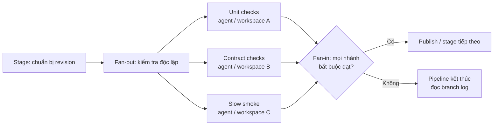

<Callout type="info" title="Phạm vi và điều kiện">
  Trang này dùng Declarative Pipeline trên agent Linux cho ví dụ. Chạy song song chỉ có ích khi các nhánh độc lập, có executor phù hợp và không cùng ghi lên một tài nguyên; nó không phải cách chữa một Pipeline chậm hoặc một test không đáng tin cậy.
</Callout>

## Mục lục

- [Khi nào chạy song song?](#khi-nào-chạy-song-song)
  - [Điều kiện trước khi fan-out](#điều-kiện-trước-khi-fan-out)
- [Fan-out, fan-in và chi phí điều phối](#fan-out-fan-in-và-chi-phí-điều-phối)
- [Declarative `parallel` và nested stage](#declarative-parallel-và-nested-stage)
  - [Cấu trúc và giới hạn](#cấu-trúc-và-giới-hạn)
  - [Jenkinsfile có nhánh độc lập](#jenkinsfile-có-nhánh-độc-lập)
- [`failFast`: hủy sớm, không che lỗi](#failfast-hủy-sớm-không-che-lỗi)
  - [Phạm vi của `failFast`](#phạm-vi-của-failfast)
- [Đọc kết quả của các nhánh](#đọc-kết-quả-của-các-nhánh)
  - [Phân biệt trạng thái branch, stage và Pipeline](#phân-biệt-trạng-thái-branch-stage-và-pipeline)
  - [Quy trình đọc log](#quy-trình-đọc-log)
- [Tranh chấp tài nguyên và chính sách cách ly](#tranh-chấp-tài-nguyên-và-chính-sách-cách-ly)
  - [Workspace, port, database và cache](#workspace-port-database-và-cache)
  - [CPU, RAM, executor và agent capacity](#cpu-ram-executor-và-agent-capacity)
  - [Lock, timeout và cleanup](#lock-timeout-và-cleanup)
- [Lab local: tạo success và failure có chủ đích](#lab-local-tạo-success-và-failure-có-chủ-đích)
  - [Chuẩn bị sandbox](#chuẩn-bị-sandbox)
  - [Chạy thành công](#chạy-thành-công)
  - [Tạo failure và quan sát hủy nhánh](#tạo-failure-và-quan-sát-hủy-nhánh)
  - [Xử lý nhánh fail](#xử-lý-nhánh-fail)
- [Checklist áp dụng](#checklist-áp-dụng)
- [Nguồn Jenkins chính thức](#nguồn-jenkins-chính-thức)
- [Đọc tiếp](#đọc-tiếp)

## Khi nào chạy song song?

`parallel` chia một stage thành nhiều nhánh có thể chạy đồng thời. Ví dụ phù hợp là unit test, kiểm tra contract và smoke test độc lập: không nhánh nào cần đầu ra đang được tạo bởi nhánh khác. Thời gian hoàn tất lý tưởng gần bằng thời gian của nhánh chậm nhất, thay vì tổng thời gian mọi nhánh.

Lợi ích đó chỉ xuất hiện khi Jenkins có năng lực thực thi. Ba nhánh trên một agent chỉ có một executor vẫn phải chờ queue; thêm cấu trúc song song khi đó tạo thêm log và trạng thái nhưng không làm build nhanh hơn. Kiến trúc controller, agent, executor và queue được giải thích tại [Kiến trúc Jenkins](/docs/getting-started/architecture).

### Điều kiện trước khi fan-out

Trước khi tách nhánh, trả lời rõ các câu hỏi sau:

- **Độc lập dữ liệu:** nhánh không cần artifact, file, database record hoặc kết quả tạm của nhánh khác. Nếu có phụ thuộc, giữ thứ tự hoặc dùng `stash`/`unstash` cho dữ liệu đã hoàn tất.
- **Độc lập tài nguyên:** mỗi nhánh có workspace/path, port, schema và cache policy riêng; tài nguyên bắt buộc dùng chung có lock với phạm vi hẹp.
- **Năng lực:** label agent có đủ executor, CPU, RAM, disk và toolchain cho số nhánh dự kiến. Queue time là tín hiệu cần đo, không phải lý do để tăng concurrency theo cảm tính.
- **Phản hồi có giá trị:** mỗi nhánh có tên theo mục tiêu, timeout, log/report và owner xử lý. Đừng tách một lệnh nhỏ thành nhiều nhánh chỉ để giao diện có nhiều ô xanh.

## Fan-out, fan-in và chi phí điều phối

**Fan-out** là điểm Jenkins mở nhiều nhánh. **Fan-in** là điểm chỉ tiếp tục sau khi các nhánh cần thiết đã kết thúc. Fan-in có thể là stage tổng hợp report, đóng gói hoặc bước tiếp theo chỉ hợp lệ khi mọi kiểm tra bắt buộc đều đạt.



Mỗi nhánh thêm flow node, log stream, cấp phát agent/workspace và đôi khi checkout/tool download. Fan-out lớn cũng tăng tải controller khi lưu trạng thái và tải agent khi cùng pull dependency. Vì vậy hãy bắt đầu từ vài nhóm test có thời gian đủ dài, đo wall-clock time, queue time và tỉ lệ lỗi, rồi mới thay đổi số nhánh. Song song hóa không làm một test vốn chậm, flaky hoặc phụ thuộc database dùng chung trở nên tốt hơn.

## Declarative `parallel` và nested stage

### Cấu trúc và giới hạn

Trong Declarative Pipeline, một `stage` chứa đúng một kiểu phần việc chính: `steps`, `stages`, `parallel` hoặc `matrix`. Một stage fan-out dùng `parallel`; mỗi nhánh bên trong là một `stage` có tên. Nhánh có thể chứa `steps` đơn giản, hoặc một block `stages` tuần tự. Kiểu thứ hai là **nested stage** (sequential stages): nó giữ các bước của một nhánh theo thứ tự nhưng vẫn cho nhánh đó chạy song song với nhánh khác.

Đặt `agent`, `options`, `when` và `post` ở branch stage khi chúng chỉ áp dụng cho nhánh đó. Không lồng thêm `parallel` hoặc `matrix` bên trong một stage vốn đã là nhánh của `parallel`/`matrix`; hãy thiết kế lại thành các nhánh cùng cấp hoặc chuỗi nested stage. Tra cứu cú pháp theo version plugin đang vận hành trước khi chuẩn hóa Jenkinsfile.

### Jenkinsfile có nhánh độc lập

Ví dụ sau cố ý dùng ba nhánh độc lập. `Unit checks` có hai nested stage để cho thấy thứ tự nội bộ; `Contract checks` có thể fail bằng parameter; `Slow smoke` giúp quan sát việc hủy. Mỗi branch xin một agent `linux`, nên để thấy chạy đồng thời lab cần tối thiểu ba executor phù hợp.

```groovy
pipeline {
  agent none

  parameters {
    booleanParam(
      name: 'SIMULATE_FAILURE',
      defaultValue: false,
      description: 'Chỉ dùng cho lab: làm Contract checks thất bại có chủ đích.'
    )
  }

  stages {
    stage('Fan-out: independent checks') {
      failFast true

      parallel {
        stage('Unit checks') {
          agent { label 'linux' }
          options { timeout(time: 2, unit: 'MINUTES') }

          stages {
            stage('Prepare unit input') {
              steps {
                dir('unit') {
                  sh 'mkdir -p output && printf "unit input ready\\n" > output/result.txt'
                }
              }
            }
            stage('Run unit check') {
              steps {
                dir('unit') {
                  sh 'test -s output/result.txt && echo "unit: PASS"'
                }
              }
            }
          }

          post {
            always { echo 'unit: collecting branch log context' }
            cleanup { deleteDir() }
          }
        }

        stage('Contract checks') {
          agent { label 'linux' }
          options { timeout(time: 2, unit: 'MINUTES') }

          steps {
            dir('contract') {
              sh '''#!/usr/bin/env sh
                set -eu
                echo "contract: started"
                if [ "$SIMULATE_FAILURE" = "true" ]; then
                  echo "contract: intentional failure for the lab" >&2
                  exit 1
                fi
                echo "contract: PASS"
              '''
            }
          }

          post {
            always { echo 'contract: collecting branch log context' }
            cleanup { deleteDir() }
          }
        }

        stage('Slow smoke') {
          agent { label 'linux' }
          options { timeout(time: 2, unit: 'MINUTES') }

          steps {
            dir('smoke') {
              sh '''#!/usr/bin/env sh
                set -eu
                echo "smoke: started; waiting so failFast is visible"
                sleep 30
                echo "smoke: PASS"
              '''
            }
          }

          post {
            always { echo 'smoke: collecting branch log context' }
            cleanup { deleteDir() }
          }
        }
      }
    }

    stage('Fan-in: publish eligible result') {
      agent { label 'linux' }
      steps {
        sh 'echo "all required branches passed; fan-in may now publish or package"'
      }
    }
  }

  post {
    success { echo 'Pipeline: SUCCESS' }
    failure { echo 'Pipeline: inspect the failed branch before creating a new build' }
    aborted { echo 'Pipeline: ABORTED; inspect the interruption source' }
    always { echo "Pipeline result: ${currentBuild.currentResult}" }
  }
}
```

Các thư mục `unit`, `contract` và `smoke` tránh đụng file khi branch dùng cùng một workspace. `cleanup { deleteDir() }` xóa workspace được cấp cho branch sau khi `post` đã thu thập ngữ cảnh log. Nếu fan-in cần file từ agent khác, hãy `stash` file có tên riêng ở branch rồi `unstash` ở stage fan-in; đừng giả định filesystem của hai agent là chung.

<Callout type="warn" title="Không dùng ví dụ lab làm policy production">
  `deleteDir()` chỉ nên xóa workspace mà job vừa được cấp. Không thay nó bằng đường dẫn tự chọn hoặc lệnh xóa đệ quy. Với artifact cần lưu, publish hoặc archive nó trước cleanup theo retention policy; không để cache hay dữ liệu release trong workspace tạm.
</Callout>

## `failFast`: hủy sớm, không che lỗi

`failFast true` trên stage chứa `parallel` yêu cầu Jenkins hủy các nhánh song song còn đang chạy khi một nhánh fail. Nhánh gây lỗi vẫn giữ log và kết quả `FAILURE`; kết quả tổng Pipeline cũng giữ `FAILURE`, không đổi thành `ABORTED` chỉ vì các sibling bị hủy. Sibling đang chạy có thể hiện `ABORTED`, còn nhánh đã hoàn tất trước thời điểm fail vẫn giữ kết quả của nó. Đây là chính sách tiết kiệm thời gian/agent, không phải `retry` và không biến failure thành success.

Hủy là một tín hiệu điều phối, không phải bảo đảm process bên ngoài dừng tức thì. Một test runner, upload hay lệnh gọi dịch vụ có thể cần thời gian phản hồi interruption. Thiết kế branch phải có timeout và cleanup idempotent; không để cleanup xóa tài nguyên chung của nhánh khác.

### Phạm vi của `failFast`

Có hai cách cấu hình Declarative:

- `failFast true` chỉ áp dụng cho block `parallel` của stage đó. Đây là lựa chọn tốt khi chỉ một nhóm kiểm tra cần phản hồi sớm.
- `options { parallelsAlwaysFailFast() }` ở cấp `pipeline` áp dụng fail-fast cho mọi `parallel` và `matrix` trong Pipeline. Dùng khi toàn bộ Pipeline có cùng policy; đừng bật nó mà chưa rà soát các fan-out khác.

`failFast` không thay thế quality policy. Một branch được đánh dấu `UNSTABLE`, branch bị `when` bỏ qua, hoặc lỗi được nuốt bằng `catchError` không nên được coi là tín hiệu đáng tin để hủy các nhánh khác. Quyết định có tiếp tục hay không phải dựa vào hợp đồng chất lượng rõ ràng. Đặc biệt, không thêm `retry` chỉ để làm dashboard xanh: sửa nguyên nhân hoặc tách flaky test để điều tra.

## Đọc kết quả của các nhánh

### Phân biệt trạng thái branch, stage và Pipeline

Giao diện Pipeline có thể khác theo plugin/version, nhưng Console Output của đúng build là bằng chứng gốc. Đọc trạng thái branch trước, sau đó đọc stage chứa nó và cuối cùng đọc kết quả Pipeline tổng hợp.

| Tình huống | Dấu vết branch/stage thường thấy | Ảnh hưởng Pipeline và hành động |
| --- | --- | --- |
| **Success** | Lệnh trả mã `0`; branch/stage hoàn tất xanh. | Pipeline chỉ `SUCCESS` khi không có kết quả xấu hơn và fan-in hợp lệ đã chạy. |
| **Failure kích hoạt `failFast`** | Một branch có step không được xử lý trả non-zero, assertion fail hoặc quality gate fail; branch/stage đó đỏ. Sibling còn chạy có thể hiện `ABORTED` vì bị hủy. | Kết quả tổng Pipeline vẫn là `FAILURE`: branch đỏ là nguyên nhân, sibling aborted chỉ là hậu quả. Mở log từ lỗi đầu tiên, không rerun mù quáng. |
| **Aborted toàn build** | Người dùng chủ động abort build, hoặc timeout/interruption được áp dụng ở phạm vi toàn build khi không có branch `FAILURE` là nguyên nhân. Các stage/branch đang chạy có thể hiện aborted. | Pipeline có thể kết thúc `ABORTED`. Đừng suy ra kết quả tổng từ một sibling aborted: nếu sibling đó bị `failFast` sau branch fail, kết quả tổng vẫn là `FAILURE`. |
| **Unstable** | Test/report hoặc step chủ động đánh dấu chất lượng chưa đạt; lệnh không nhất thiết crash. | Pipeline có thể là `UNSTABLE` nếu không có `FAILURE`. Đọc report để quyết định có chặn fan-in/release theo policy, thay vì coi vàng là xanh. |
| **Skipped** | `when` là false, hoặc stage sau không đủ điều kiện để chạy. | Skipped không tự đồng nghĩa failure. Pipeline có thể `SUCCESS` nếu skip được thiết kế; ghi rõ lý do skip trong tên/condition để reviewer phân biệt với lỗi. |

Stage là ranh giới quan sát, còn kết quả Pipeline là tổng hợp cả flow. Vì vậy một branch xanh không phủ nhận failure ở branch khác; một stage `Skipped` cũng không chứng minh lệnh đã chạy. Khi `failFast` xuất hiện, đọc cả cặp nguyên nhân–hậu quả: branch `FAILURE` quyết định Pipeline `FAILURE`, còn sibling `ABORTED` chỉ cho biết Jenkins đã hủy công việc còn lại. `post { always }` hữu ích để in metadata hoặc publish report ngay cả khi branch fail, nhưng không dùng nó để ghi đè kết quả thật.

### Quy trình đọc log

1. Chọn **đúng build number và revision**, rồi mở Pipeline graph/Stage View để định vị branch có trạng thái xấu nhất.
2. Mở Console Output của branch đó. Tìm lệnh đầu tiên trả non-zero, timeout hoặc dòng interruption; các dòng cleanup phía sau thường là hậu quả, không phải nguyên nhân.
3. Với fail-fast, đối chiếu thời điểm branch `FAILURE` với các sibling `ABORTED`. Xác nhận kết quả tổng vẫn là `FAILURE`, rồi sửa branch fail trước; không mở ticket cho mọi sibling chỉ vì chúng bị hủy.
4. Kiểm tra report, agent label, executor và workspace ghi trong log. Một failure do thiếu toolchain/thiếu capacity khác với assertion ứng dụng.
5. Tạo build mới sau khi sửa hoặc điều chỉnh parameter lab. Build mới là bằng chứng mới; retry không thay thế chẩn đoán.

## Tranh chấp tài nguyên và chính sách cách ly

### Workspace, port, database và cache

| Tài nguyên | Dạng tranh chấp | Policy nên dùng |
| --- | --- | --- |
| Workspace/file | Hai branch ghi cùng `target/`, cùng report hoặc cùng file cấu hình. | Dùng thư mục branch riêng; khi cần tách mạnh hơn, cấp workspace riêng trên agent. Chuyển dữ liệu qua `stash`/`unstash` hoặc artifact repository thay vì path dùng chung. |
| Port | Hai test server cùng bind `8080`. | Để framework chọn ephemeral port, hoặc cấp port duy nhất theo branch từ một allocator. Không hard-code cùng port cho mọi executor. |
| Database | Migration, truncate hoặc fixture của branch này làm hỏng branch khác. | Tạo database/schema/namespace riêng theo build và branch; dùng credential quyền tối thiểu. Lock chỉ database dùng chung không thể thay thế, không lock toàn bộ Pipeline. |
| Cache | Nhiều process cùng ghi cache mutable gây corruption hoặc cache poisoning. | Cache read-only/immutable theo dependency lockfile; key theo OS, toolchain và version. Chỉ một writer được phép cập nhật cache đã có policy rõ. |

Một `dir('unit')` chỉ phân vùng path bên trong workspace đang được branch sử dụng. Nó không làm agent, Docker daemon, network port hay database tự động cách ly. Với pull request/fork không tin cậy, chạy branch trên agent/pool không đặc quyền và không cấp secret production. Song song hóa code không tin cậy trên nhiều executor chỉ nhân bề mặt rủi ro.

<Callout type="warn" title="Flaky test cần bằng chứng, không cần nhiều retry">
  Test lúc xanh lúc đỏ làm `failFast` có thể hủy nhiều branch lành. Lưu log, seed, version dependency và report của lần fail; cô lập test hoặc sửa tính không xác định. Không tăng `retry`, tắt quality gate hay cấp credential rộng hơn để che failure. Pull request không tin cậy không được nhận secret hoặc chạy trên agent có dữ liệu nhạy cảm chỉ vì cần chạy nhanh.
</Callout>

### CPU, RAM, executor và agent capacity

Executor là slot Jenkins để chạy task, không phải CPU core và cũng không phải cam kết RAM. Một agent có bốn executor nhưng chỉ đủ RAM cho hai browser test sẽ tạo OOM, swap hoặc contention nặng hơn khi tăng concurrency. Tương tự, nhiều nhánh `docker build` có thể cùng làm đầy disk, saturate I/O hoặc chạm quota registry.

Trước khi tăng số nhánh hoặc executor, đo ít nhất queue wait, wall-clock time của từng branch, CPU, RAM/OOM, disk/inode, network và tỉ lệ timeout. Đặt label/pool theo toolchain và trust boundary, rồi giới hạn concurrency theo tài nguyên nhỏ nhất. Baseline local và nguyên tắc tách agent/controller có tại [Chạy Jenkins với Docker](/docs/installation/docker); sizing nền tảng xem [Yêu cầu hệ thống](/docs/getting-started/requirements).

### Lock, timeout và cleanup

Khi thật sự phải dùng tài nguyên singleton — ví dụ license test, môi trường integration cũ hoặc database không thể clone — đặt lock quanh **đoạn ngắn nhất** cần nó. Plugin Lockable Resources cung cấp step `lock`; resource cần có owner, mục đích, giới hạn chờ và quy tắc dọn dẹp được ghi rõ.

```groovy
// Cần plugin Lockable Resources và resource "legacy-integration-db" được quản trị trước.
timeout(time: 5, unit: 'MINUTES') {
  lock(resource: 'legacy-integration-db') {
    sh './run-integration-test --database=legacy-integration-db'
  }
}
```

Đặt `timeout` bên ngoài `lock` để bao gồm cả thời gian chờ resource; đặt timeout cấp stage/branch để giới hạn toàn bộ nhánh. `post { always { ... } cleanup { ... } }` nên chỉ thu report, đóng process của chính branch và xóa workspace của chính branch. Cleanup phải idempotent vì nó có thể chạy sau success, failure hoặc interruption. Không giữ lock trong lúc checkout, download dependency hay publish artifact nếu các thao tác đó không cần tài nguyên singleton.

## Lab local: tạo success và failure có chủ đích

Lab này chỉ chạy shell, tạo thư mục trong workspace và ngủ 30 giây; không gọi database, credential hay hệ thống thật. Dùng một Jenkins sandbox bạn kiểm soát. Nếu cần controller local, xem [Chạy Jenkins với Docker](/docs/installation/docker); built-in node chỉ phù hợp cho lab, không phải nơi chạy workload production.

### Chuẩn bị sandbox

1. Khởi động Jenkins local, cài các Pipeline plugin cần thiết theo setup wizard và xác nhận có agent Linux label `linux` online.
2. Để thấy ba branch thực sự đồng thời, cấp ba executor cho sandbox hoặc đăng ký đủ agent cùng label. Với một executor, các branch sẽ xếp hàng; đó là kết quả capacity hợp lệ, không phải lý do tăng executor trên production.
3. Tạo một **Pipeline** job tên `parallel-lab`, chọn pipeline script, dán Jenkinsfile ở trên và lưu. Không thêm credential.
4. Mở Console Output và giao diện stage của build để quan sát, nhưng dùng log làm nguồn xác nhận cuối cùng.

### Chạy thành công

Chọn **Build with Parameters**, giữ `SIMULATE_FAILURE=false` rồi chạy. Khi có đủ ba executor, `Contract checks` và `Unit checks` kết thúc nhanh, còn `Slow smoke` mất khoảng 30 giây. Sau đó `Fan-in: publish eligible result` chạy và build kết thúc `SUCCESS`.

Console Output cần có các dấu vết như `unit: PASS`, `contract: PASS`, `smoke: PASS` và dòng fan-in. Đối chiếu timestamp để thấy các branch chồng thời gian. Nếu một branch đứng ở queue, kiểm tra label và executor trước khi sửa Jenkinsfile.

### Tạo failure và quan sát hủy nhánh

Chạy build mới với `SIMULATE_FAILURE=true`. `Contract checks` in `intentional failure for the lab` rồi trả exit code `1`, vì vậy branch này là `FAILURE`. Vì stage fan-out có `failFast true`, Jenkins yêu cầu hủy `Slow smoke` nếu branch này còn chạy; sibling đó có thể hiện `ABORTED`, còn branch hoàn tất trước đó có thể vẫn xanh tùy timing. `Fan-in: publish eligible result` không chạy vì kiểm tra bắt buộc đã không đạt. **Kết quả tổng của build phải là `FAILURE`, không phải `ABORTED`**: failure của `Contract checks` là nguyên nhân đã kích hoạt việc hủy sibling.

Trong log, tìm theo thứ tự: tên `Contract checks`, dòng intentional failure/exit code, kết quả build `FAILURE`, rồi dấu vết interruption hoặc `ABORTED` của sibling. Đừng suy luận failure gốc hay kết quả tổng từ `Slow smoke` bị hủy. Chỉ khi người dùng abort toàn build hoặc timeout/interruption ở phạm vi toàn build (không phải hệ quả của branch failure) mới quan sát Pipeline `ABORTED`. Giao diện có thể trình bày màu/trạng thái khác giữa các plugin; log và kết quả build mới là dữ liệu quyết định.

### Xử lý nhánh fail

Đặt `SIMULATE_FAILURE=false` để xác nhận lab xanh trở lại, hoặc thay điều kiện lab bằng test thật sau khi đã biết ownership của test. Với failure thật, giữ build, revision, report và log; phân loại lỗi thành code/test, toolchain/agent, resource contention hoặc service phụ thuộc. Sửa nguyên nhân nhỏ nhất có thể, rồi tạo build mới để xác nhận.

Không tắt `failFast`, không thêm `retry` và không đổi `catchError` để che branch đỏ chỉ nhằm qua fan-in. Nếu lỗi là flaky, ưu tiên tái tạo với seed/fixture cố định và điều tra riêng trước khi thay policy chạy song song.

## Checklist áp dụng

- [ ] Các nhánh song song độc lập về dữ liệu và đã có lý do thời gian/feedback rõ ràng.
- [ ] Tôi đo queue time và CPU/RAM/disk trước khi tăng branch hoặc executor.
- [ ] Mỗi branch có agent label, timeout, tên có thể hành động và log/report đủ để chẩn đoán.
- [ ] Workspace/path, port, database/schema và cache có policy cách ly hoặc ownership rõ ràng.
- [ ] Resource singleton dùng lock phạm vi hẹp, có timeout chờ và cleanup idempotent.
- [ ] `failFast` được dùng như cancellation policy; branch fail gốc vẫn được đọc và sửa.
- [ ] Tôi phân biệt `FAILURE`, `ABORTED`, `UNSTABLE` và `Skipped` ở branch/stage với kết quả Pipeline tổng hợp; sibling bị fail-fast hủy không đổi Pipeline `FAILURE` thành `ABORTED`.
- [ ] Test flaky có bằng chứng điều tra; không bị che bởi retry hoặc nới quality gate.
- [ ] Pull request/fork không tin cậy không nhận secret production, agent đặc quyền hay cache ghi dùng chung.
- [ ] Fan-in chỉ publish/triển khai khi các kết quả bắt buộc thỏa policy đã định.

## Nguồn Jenkins chính thức

- [Pipeline Syntax](https://www.jenkins.io/doc/book/pipeline/syntax/) — Declarative `parallel`, sequential stages, `failFast`, `parallelsAlwaysFailFast`, `post` và `options`.
- [Using a Jenkinsfile](https://www.jenkins.io/doc/book/pipeline/jenkinsfile/) — cấu trúc Jenkinsfile, kết quả build và thực hành Pipeline as Code.
- [Using Jenkins agents](https://www.jenkins.io/doc/book/using/using-agents/) — agent, executor, workspace và ranh giới thực thi.
- [Pipeline: Basic Steps](https://www.jenkins.io/doc/pipeline/steps/workflow-basic-steps/) — `timeout`, `stash`, `unstash`, `deleteDir` và các step cơ bản.
- [Lockable Resources plugin](https://plugins.jenkins.io/lockable-resources/) — quản trị resource và step `lock` cho tài nguyên singleton.
- [Managing Jenkins: Securing Jenkins](https://www.jenkins.io/doc/book/security/managing-security/) — quyền, credential và bảo vệ controller/agent.

## Đọc tiếp

<Cards>
  <Card title="Tổng quan Jenkins" href="/docs/getting-started/overview" description="Ôn lại mục đích Jenkins và vòng phản hồi CI/CD." />
  <Card title="Kiến trúc Jenkins" href="/docs/getting-started/architecture" description="Hiểu controller, agent, queue, executor và workspace." />
  <Card title="Nền tảng CI/CD" href="/docs/getting-started/ci-cd-fundamentals" description="Liên kết kiểm tra song song với feedback chất lượng." />
  <Card title="Yêu cầu hệ thống" href="/docs/getting-started/requirements" description="Chuẩn bị năng lực máy và hạ tầng Jenkins." />
  <Card title="Chạy Jenkins với Docker" href="/docs/installation/docker" description="Tạo controller local an toàn cho lab." />
</Cards>
