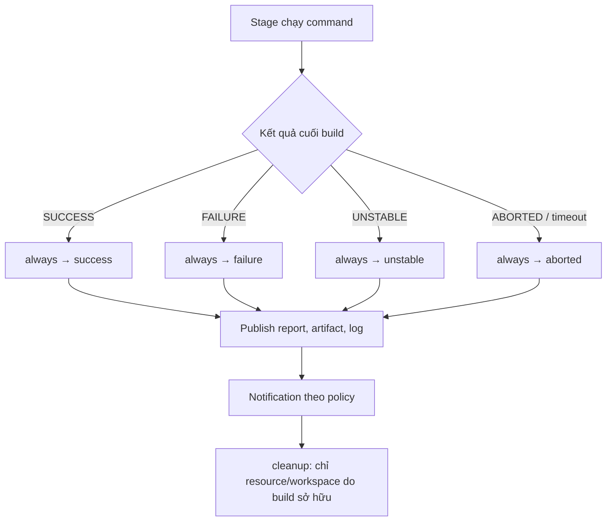

`post` là nơi Pipeline kết thúc một cách có chủ đích: giữ lại bằng chứng để điều tra, trả tài nguyên mà build thực sự sở hữu, rồi phát tín hiệu đúng đối tượng. Nó không phải một nhánh “chạy bất cứ thứ gì sau cùng”. Một `post` thiếu điều kiện có thể xóa log cần thiết, che khuất lỗi ban đầu hoặc vô tình gửi credential ra ngoài.

<Callout type="info" title="Phạm vi">
  Bài này dùng Declarative Pipeline. Cú pháp `pipeline {}` và `post {}` thuộc plugin **Pipeline: Declarative**; các step để publish report, archive, bind credential hoặc gửi HTTP còn phụ thuộc plugin/cấu hình của từng Jenkins. Hãy xác nhận **Pipeline Syntax → Steps Reference** trên controller trước khi dùng Jenkinsfile cho production.
</Callout>

## Mục lục

- [Mục tiêu và mô hình kết thúc build](#mục-tiêu-và-mô-hình-kết-thúc-build)
  - [Dấu vết cần giữ trước khi cleanup](#dấu-vết-cần-giữ-trước-khi-cleanup)
- [Luồng, phạm vi và thứ tự thực thi](#luồng-phạm-vi-và-thứ-tự-thực-thi)
  - [Post ở Pipeline và ở stage](#post-ở-pipeline-và-ở-stage)
  - [Thứ tự các điều kiện](#thứ-tự-các-điều-kiện)
- [Điều kiện post theo trạng thái](#điều-kiện-post-theo-trạng-thái)
  - [`always`](#always)
  - [`success`, `failure` và `unstable`](#success-failure-và-unstable)
  - [`changed` và `aborted`](#changed-và-aborted)
  - [`cleanup`](#cleanup)
- [Jenkinsfile mẫu: lưu bằng chứng, dọn đúng phạm vi](#jenkinsfile-mẫu-lưu-bằng-chứng-dọn-đúng-phạm-vi)
  - [Đọc dependency và hành vi của mẫu](#đọc-dependency-và-hành-vi-của-mẫu)
- [Cleanup có ownership và idempotency](#cleanup-có-ownership-và-idempotency)
  - [Timeout, abort và cleanup thất bại](#timeout-abort-và-cleanup-thất-bại)
  - [Retention không phải cleanup](#retention-không-phải-cleanup)
- [Notification có kiểm soát](#notification-có-kiểm-soát)
  - [Masking và secret](#masking-và-secret)
  - [Pull request, fork và ranh giới tin cậy](#pull-request-fork-và-ranh-giới-tin-cậy)
- [Lab sandbox: quan sát bốn kết quả](#lab-sandbox-quan-sát-bốn-kết-quả)
  - [Chuẩn bị](#chuẩn-bị)
  - [Chạy success, failure và unstable](#chạy-success-failure-và-unstable)
  - [Abort có chủ đích](#abort-có-chủ-đích)
  - [Kết quả cần quan sát](#kết-quả-cần-quan-sát)
- [Checklist review post actions](#checklist-review-post-actions)
- [Nguồn Jenkins chính thức và đọc tiếp](#nguồn-jenkins-chính-thức-và-đọc-tiếp)

## Mục tiêu và mô hình kết thúc build

Sau bài này, bạn có thể trả lời ba câu hỏi trước khi thêm một post action: **bằng chứng nào phải được publish**, **tài nguyên nào build này sở hữu**, và **ai được phép nhận trạng thái**. Ba câu hỏi này biến `post` từ một đoạn script cuối file thành một phần của policy vận hành.

Một build có thể dừng do test trả exit code khác `0`, do người dùng bấm **Abort**, do `timeout`, hoặc do một step đánh dấu `UNSTABLE`. Bất kể đường đi nào, post action phải ưu tiên khả năng điều tra trước, rồi mới dọn phần tạm do chính build tạo ra. Tổng quan về build record, agent và workspace có tại [Kiến trúc Jenkins](/docs/getting-started/architecture); cấu trúc Pipeline và stage được giải thích tại [Tổng quan Pipeline](/docs/pipelines/overview).

### Dấu vết cần giữ trước khi cleanup

Bằng chứng tối thiểu thường gồm Console Output, trạng thái build, revision đã checkout, report test và artifact/log chẩn đoán. `junit` chỉ đọc XML report; nó không chạy test thay cho command của dự án. Tương tự, `archiveArtifacts` lưu file để điều tra nhưng không sửa kết quả build.

Ví dụ, nếu `npm test` thất bại, hãy archive `reports/`, `artifacts/` và `logs/` trước khi xóa `.ci-tmp/`. Không archive toàn bộ workspace theo phản xạ: source, cache, file cấu hình cục bộ hoặc dữ liệu sinh ra có thể chứa thông tin không được phép giữ lâu. Chọn allowlist đường dẫn và review nội dung trước khi publish. Xem thêm cách tổ chức report tại [Tự động hóa kiểm thử](/docs/delivery/test-automation).

## Luồng, phạm vi và thứ tự thực thi



Sơ đồ là thứ tự thiết kế nên áp dụng: publish bằng chứng trước, notification sau khi đã có URL/build record, và cleanup cuối. Các post condition thực tế có thứ tự xác định bên dưới; đừng dựa vào thứ tự các block bạn vô tình viết trong Jenkinsfile.

### Post ở Pipeline và ở stage

`post` đặt **trong `stage`** chạy khi stage đó kết thúc. Nó phù hợp để publish report sinh ra riêng ở stage `Test`, kể cả khi command test lỗi và các stage sau không chạy. `post` đặt **ở cấp `pipeline`** chạy sau khi toàn bộ Pipeline đã kết thúc; nó phù hợp để tổng kết kết quả, gửi notification một lần và cleanup dùng chung.

Hai phạm vi không thay thế nhau. Nếu `Unit test` tạo `reports/unit.xml` rồi thất bại, stage-level `post { always { junit ... } }` cho feedback ngay tại stage. Pipeline-level `post` vẫn nên archive tập evidence cuối cùng và dọn `.ci-tmp/` dùng chung. Khi dùng agent riêng cho từng stage, không giả định workspace ở stage trước còn có mặt ở pipeline-level post; hãy giữ post gần nơi file được tạo, hoặc chuyển file bằng cơ chế đã thiết kế. Chi tiết về agent, workspace và step nằm tại [Stages & Steps](/docs/pipelines/stages-steps).

### Thứ tự các điều kiện

Declarative Pipeline đánh giá các condition theo thứ tự cố định sau, không phải theo thứ tự chúng xuất hiện trong file:

1. `always`
2. `changed`
3. `fixed`
4. `regression`
5. `aborted`
6. `failure`
7. `success`
8. `unstable`
9. `unsuccessful`
10. `cleanup`

Vì vậy `cleanup` luôn chạy **sau mọi post condition khác**. `changed` chỉ có ý nghĩa khi Jenkins có build trước đó để so sánh. `fixed`, `regression` và `unsuccessful` không phải trọng tâm của trang này, nhưng vẫn có thể chạy xen giữa các block bạn quan tâm theo danh sách trên.

<Callout type="warn" title="Không để lỗi thứ cấp che lỗi gốc">
  Một step publish, notification hoặc cleanup cũng có thể lỗi. Nếu để lỗi không quan trọng làm post block fail, build vốn đã `FAILURE` có thêm một triệu chứng khó đọc, hoặc build xanh có thể thành đỏ. Với thao tác không quyết định chất lượng, hãy ghi log có chủ đích, đặt timeout ngắn và xử lý failure riêng; không nuốt lỗi của test hay deploy thật.
</Callout>

## Điều kiện post theo trạng thái

Jenkins phân biệt kết quả build với trạng thái của từng stage. Các condition dưới đây được xét theo **kết quả build hiện tại** hoặc lịch sử build, không phải đơn thuần vì một lệnh `echo` đã chạy.

### `always`

`always` chạy bất kể kết quả: `SUCCESS`, `FAILURE`, `UNSTABLE`, `ABORTED` và các trường hợp kết thúc khác mà post có thể được chạy. Dùng nó cho hành động cần thiết để chẩn đoán, như publish XML report nếu có, archive allowlist log/artifact và ghi metadata không nhạy cảm.

Đừng biến `always` thành nơi gọi deploy, xóa toàn bộ workspace hay gửi notification đặc quyền. “Luôn chạy” không đồng nghĩa “an toàn khi chạy mọi lần”. Mỗi hành động trong block vẫn cần ownership, timeout và điều kiện tin cậy riêng.

### `success`, `failure` và `unstable`

| Condition | Khi chạy | Cách dùng phù hợp | Điều không được suy ra |
| --- | --- | --- | --- |
| `success` | Kết quả cuối là `SUCCESS`. | Báo build đã đạt các gate đang cấu hình, hoặc tạo tín hiệu cho bước kế tiếp đã được phê duyệt. | Không chứng minh deploy production, bảo mật hay chất lượng nghiệp vụ đều an toàn. |
| `failure` | Kết quả cuối là `FAILURE`. | Tạo thông báo điều tra với build number, URL và stage/log đã archive. | Không có nghĩa cleanup được bỏ qua; `cleanup` vẫn chạy sau đó. |
| `unstable` | Kết quả cuối là `UNSTABLE`. | Báo quality signal cần theo dõi, như test failure đã được policy cho phép tiếp tục. | Không được coi như `SUCCESS` hoặc tự động retry vô hạn. |

`UNSTABLE` là tín hiệu khác với `FAILURE`: Pipeline có thể đã đi qua một số stage nhưng vẫn không đạt chất lượng. Ví dụ, JUnit Plugin có thể đánh dấu build `UNSTABLE` theo cấu hình report. Một Pipeline cũng có thể dùng step `unstable` để mô phỏng hoặc thể hiện policy. Hãy ghi rõ owner và ngưỡng chấp nhận; đừng đổi mọi failure thành `UNSTABLE` để dashboard xanh hơn.

### `changed` và `aborted`

`changed` chạy khi kết quả hiện tại khác kết quả của build trước. Nó hữu ích để giảm spam: chỉ báo khi build chuyển từ xanh sang đỏ, hoặc từ đỏ sang xanh. Build đầu tiên không có kết quả trước đó để so sánh, nên không nên dùng `changed` làm nơi bắt buộc publish bằng chứng.

`aborted` chạy khi build bị hủy. Người dùng bấm **Abort**, timeout can thiệp, controller/agent gián đoạn hoặc một flow bị dừng có thể dẫn đến kết quả này, tùy step và hoàn cảnh. Thông báo `aborted` nên chỉ nói build bị hủy và chỉ đường tới Console Output; không đoán rằng code lỗi hay người dùng đã làm sai.

```groovy
post {
  changed {
    echo "Kết quả đã thay đổi: ${currentBuild.currentResult}"
  }
  aborted {
    echo 'Build bị hủy; kiểm tra thời điểm abort/timeout trong Console Output.'
  }
}
```

### `cleanup`

`cleanup` chạy sau tất cả post condition khác, bất kể kết quả. Đây là điểm cuối thích hợp để trả **chính xác** lease, container tạm, lock hoặc thư mục tạm mà build đã tạo và nhận ownership. Nó không phải giấy phép xóa bucket, namespace, workspace dùng chung hoặc artifact của build khác.

Cleanup idempotent nghĩa là gọi lại một hay nhiều lần vẫn đưa hệ thống về trạng thái an toàn. Ví dụ, xóa `.ci-tmp/` nếu nó tồn tại rồi coi việc nó đã không còn là thành công. Với external resource, lưu resource ID và tag owner lúc tạo; lúc cleanup chỉ release ID đó nếu tag khớp `BUILD_TAG`. Không tìm theo tên chung như `test-*` rồi xóa hàng loạt.

## Jenkinsfile mẫu: lưu bằng chứng, dọn đúng phạm vi

Mẫu này là một lab an toàn cho agent Unix mang label `linux`, được chạy bằng **Multibranch Pipeline**. Nó tạo report, artifact và log giả lập; không checkout source, không triển khai, không gọi cloud API. `SCENARIO` giúp quan sát kết quả `SUCCESS`, `FAILURE`, `UNSTABLE` và luồng chờ để abort. `.ci-tmp/` là thư mục duy nhất được xem là do build sở hữu và được cleanup sau khi evidence đã publish. Notification bên ngoài chỉ xét `BRANCH_NAME` và `CHANGE_ID` do Multibranch cung cấp; một Pipeline job thông thường không thỏa điều kiện này và cố ý không gửi.

```groovy
pipeline {
  agent { label 'linux' }

  environment {
    // Endpoint cố định, không chứa token; auth chỉ được tham chiếu bằng credential ID.
    NOTIFICATION_ENDPOINT = 'https://notifications.example.invalid/jenkins/build-status'
  }

  parameters {
    choice(name: 'SCENARIO', choices: ['success', 'failure', 'unstable', 'abort'],
      description: 'Kết quả sandbox cần quan sát')
    booleanParam(name: 'NOTIFY_EXTERNAL', defaultValue: false,
      description: 'Chỉ bật ở trusted main branch sau khi credential và endpoint đã được review')
  }

  options {
    skipDefaultCheckout(true)
    timeout(time: 20, unit: 'MINUTES')
    buildDiscarder(logRotator(numToKeepStr: '20', artifactNumToKeepStr: '10'))
  }

  stages {
    stage('Tạo evidence sandbox') {
      steps {
        sh '''
          set -eu
          mkdir -p reports artifacts logs .ci-tmp
          printf 'build=%s scenario=%s\n' "$BUILD_NUMBER" "$SCENARIO" > artifacts/sandbox.txt
          printf 'sandbox log for build %s\n' "$BUILD_NUMBER" > logs/sandbox.log
          printf '%s\n' "$BUILD_TAG" > .ci-tmp/owned-resource.id
          case "$SCENARIO" in
            failure)
              printf '<testsuite name="sandbox" tests="1" failures="1"><testcase name="expected"><failure message="intentional failure"/></testcase></testsuite>\n' > reports/sandbox.xml
              ;;
            *)
              printf '<testsuite name="sandbox" tests="1" failures="0"><testcase name="expected"/></testsuite>\n' > reports/sandbox.xml
              ;;
          esac
        '''
      }
    }

    stage('Tạo kết quả') {
      steps {
        script {
          if (params.SCENARIO == 'failure') {
            sh 'printf "intentional failure\\n" >> logs/sandbox.log; exit 1'
          }
          if (params.SCENARIO == 'unstable') {
            unstable 'Intentional sandbox instability; inspect the archived evidence.'
          }
          if (params.SCENARIO == 'abort') {
            timeout(time: 10, unit: 'MINUTES') {
              input message: 'Bấm Abort để quan sát post { aborted }; không tiếp tục input.', ok: 'Tiếp tục'
            }
          }
          echo 'Sandbox path completed.'
        }
      }
      post {
        always {
          junit allowEmptyResults: true, testResults: 'reports/**/*.xml'
        }
      }
    }
  }

  post {
    always {
      script {
        env.FINAL_RESULT = currentBuild.currentResult ?: 'UNKNOWN'
        echo "Build #${env.BUILD_NUMBER} finished as ${env.FINAL_RESULT}."
      }
      archiveArtifacts allowEmptyArchive: true,
        artifacts: 'artifacts/**,logs/**,reports/**', fingerprint: true
      script {
        boolean trustedMultibranchMain = !env.CHANGE_ID && env.BRANCH_NAME == 'main'
        if (params.NOTIFY_EXTERNAL && trustedMultibranchMain) {
          String payload = "{\"result\":\"${env.FINAL_RESULT}\",\"build_number\":\"${env.BUILD_NUMBER}\"}"
          try {
            httpRequest authentication: 'ci-status-notification-auth',
              consoleLogResponseBody: false, contentType: 'APPLICATION_JSON',
              httpMode: 'POST', quiet: true, requestBody: payload, timeout: 5,
              url: env.NOTIFICATION_ENDPOINT, validResponseCodes: '200:299'
          } catch (org.jenkinsci.plugins.workflow.steps.FlowInterruptedException interruption) {
            // Abort/timeout là tín hiệu điều khiển Pipeline, không phải lỗi delivery để nuốt.
            throw interruption
          } catch (Exception notificationError) {
            echo 'External notification failed; evidence and original build result are retained.'
          }
        } else {
          echo 'External notification is disabled or this is not a trusted Multibranch main build.'
        }
      }
    }
    success {
      echo 'SUCCESS: published evidence is available for the next approved action.'
    }
    failure {
      echo 'FAILURE: investigate the first failed stage and archived evidence before retrying.'
    }
    unstable {
      echo 'UNSTABLE: review the quality signal; do not silently treat it as success.'
    }
    changed {
      echo "Result changed from the prior build to ${currentBuild.currentResult}."
    }
    aborted {
      echo 'ABORTED: inspect timeout or user-abort context before rerunning.'
    }
    cleanup {
      sh '''
        set -eu
        if [ -f .ci-tmp/owned-resource.id ]; then
          owner=$(cat .ci-tmp/owned-resource.id)
          printf 'Releasing only sandbox resource owned by %s\n' "$owner"
          rm -f -- .ci-tmp/owned-resource.id
        fi
        rmdir .ci-tmp 2>/dev/null || true
      '''
    }
  }
}
```

### Đọc dependency và hành vi của mẫu

`pipeline`, `post`, `parameters`, `options`, `stage` và các condition là Declarative syntax của plugin **Pipeline: Declarative**, không phải Jenkins core độc lập. Jenkins core giữ build record, log và result, nhưng không cam kết mọi Jenkins cài mới có syntax hay step giống mẫu.

| Thành phần | Phụ thuộc cần xác minh | Ghi chú vận hành |
| --- | --- | --- |
| `sh`, `timeout`, `input`, `archiveArtifacts`, `unstable` | Pipeline step plugins và Unix shell trên agent | `sh` không chạy trên Windows agent; `timeout` bao quanh `input` để build không chờ vô hạn. |
| `junit` | **JUnit Plugin** | Report được publish ở stage-level `always`, kể cả khi stage tạo failure. |
| `httpRequest` | **HTTP Request Plugin**, endpoint cố định không chứa token, credential ID `ci-status-notification-auth`, và Pipeline Step API có `FlowInterruptedException` | Plugin tra credential theo ID; Jenkinsfile không bind secret vào biến hay chuyển nó qua shell/process argv. Chỉ exception delivery thường là non-blocking; `FlowInterruptedException` được rethrow để giữ Abort/timeout. |
| `buildDiscarder(logRotator(...))` | Pipeline/jenkins configuration hỗ trợ directive | Đây là retention build/artifact trên controller, không phải xóa file workspace ngay lập tức. |

`archiveArtifacts` nằm trước `cleanup`, nên report, log và artifact đã được lưu vào build record trước khi thư mục tạm bị xóa. Cleanup chỉ xóa marker `.ci-tmp/owned-resource.id` do chính mẫu tạo. Nó cố ý không gọi `deleteDir()`, không dùng wildcard ở ngoài `.ci-tmp/`, và không xóa `reports/`, `artifacts/` hay `logs/` cần điều tra.

## Cleanup có ownership và idempotency

Cleanup tốt có một hợp đồng nhỏ: **ai tạo**, **định danh nào**, **khi nào hết hạn**, **ai được phép trả**, và **làm lại có an toàn không**. Tạo resource cùng `BUILD_TAG` hoặc một run ID riêng, ghi ID vào file/metadata của build, và kiểm tra tag owner trước khi gọi API release. Nếu không chứng minh được ownership, dừng và tạo ticket thay vì đoán rồi xóa.

Với workspace, phân biệt file checkout/cache do Jenkins hoặc agent quản lý với thư mục tạm của job. Chỉ dọn một thư mục dành riêng, ví dụ `$WORKSPACE/.ci-tmp`, sau khi archive allowlist cần thiết. Workspace dùng chung giữa executor, custom workspace, cache chung hoặc thư mục mount bên ngoài cần policy riêng; không cleanup bằng pattern rộng chỉ vì build đã kết thúc.

<Callout type="warn" title="Không xóa evidence để tiết kiệm disk ngay sau build">
  Artifact cần điều tra phải được publish trước. Sau đó, retention có thể xóa build/artifact cũ theo số lượng hoặc thời gian đã được đội phê duyệt. Nếu yêu cầu xóa sớm vì dữ liệu nhạy cảm, đừng archive dữ liệu đó ngay từ đầu; hãy tạo report đã lọc và bảo vệ quyền đọc build record.
</Callout>

### Timeout, abort và cleanup thất bại

Đặt `timeout` ở Pipeline hoặc stage để một command treo, input bị quên, hay external call chậm không giữ executor vô hạn. Timeout có thể làm flow kết thúc `ABORTED`, vì vậy `aborted`, `always` và `cleanup` vẫn phải thực hiện phần an toàn. Cleanup cũng cần timeout ngắn nếu nó gọi hệ thống ngoài; một request release treo không được biến post action thành điểm nghẽn mới.

Khi cô lập lỗi notification bằng `try/catch`, bắt riêng `org.jenkinsci.plugins.workflow.steps.FlowInterruptedException` trước và `throw` lại như mẫu. Đây là tín hiệu Pipeline dùng cho Abort/timeout, không phải delivery failure. Chỉ catch exception còn lại khi policy thật sự cho phép notification non-blocking. Class này cần Pipeline Step API tương thích với controller; nếu instance không hỗ trợ cú pháp/class đó, xác minh `catchError(catchInterruptions: false)` trong **Pipeline Syntax** của chính controller thay vì dùng generic catch nuốt interruption.

Khi cleanup external thất bại, không retry vô hạn trong post. Ghi resource ID không nhạy cảm, build URL, thời điểm và owner vào log/ticket của hệ thống vận hành; sau đó để một reconciler có quyền hẹp xử lý lại. Reconciler phải kiểm tra owner và TTL trước khi release. Cách này tốt hơn việc một lần chạy lại Pipeline xóa tài nguyên của build khác.

### Retention không phải cleanup

**Cleanup** trả tài nguyên ngắn hạn của một run: thư mục tạm, lease, container sandbox hoặc lock mà run đó sở hữu. **Retention** là chính sách giữ/xóa build record, artifact và log cũ trên controller/kho artifact. Hai việc có owner, thời điểm và rủi ro khác nhau.

Đặt retention qua `buildDiscarder` hoặc policy kho artifact có review, phù hợp nhu cầu audit và dung lượng. Đừng dùng `post { cleanup }` để xóa lịch sử build, artifact dùng lại cho deploy, hay dữ liệu của job khác. Nhu cầu storage controller và backup cần được tính từ đầu; xem [Yêu cầu hệ thống](/docs/getting-started/requirements).

## Notification có kiểm soát

Một notification có ích trả lời: build nào, kết quả nào, xem evidence ở đâu và ai sở hữu hành động tiếp theo. Payload nên tối thiểu, ví dụ `result`, `build_number`, URL build nếu endpoint được phép nhận URL đó, và một nhãn policy. Không gửi console log đầy đủ, command line, environment dump, commit message chưa kiểm soát, report có dữ liệu người dùng, token hoặc password.

Mẫu chỉ gửi HTTP khi đồng thời thỏa ba điều kiện: người chạy bật `NOTIFY_EXTERNAL`, build không có `CHANGE_ID`, và `BRANCH_NAME == 'main'`. `BRANCH_NAME` và `CHANGE_ID` là metadata của **Multibranch Pipeline**; mẫu/lab vì vậy không hỗ trợ Pipeline job thường như một nguồn notification đáng tin cậy. Job thường thiếu `BRANCH_NAME` sẽ không gửi. Không tự đặt biến này bằng parameter hoặc `environment` để vượt điều kiện; nếu cần notification cho job thường, dùng một job trusted riêng có SCM/branch được quản trị cấu hình và credential scope tương ứng.

Notification dùng **HTTP Request Plugin** với `authentication: 'ci-status-notification-auth'`, là credential ID chứ không phải giá trị secret. Endpoint là cấu hình cố định, không chứa token. Jenkinsfile không gọi `sh`, không bind token vào biến môi trường và không truyền URL/secret nhạy cảm qua process argv trên agent. `try/catch` chỉ coi lỗi HTTP thông thường là non-blocking: nó rethrow `FlowInterruptedException` trước khi catch `Exception`, nên Abort/timeout vẫn lan truyền đúng kết quả build. Đây là defense in depth, không thay thế branch protection, quyền build, credential scope và review endpoint.

### Masking và secret

Masking Console Output không phải biên giới bảo mật: secret vẫn có thể lộ nếu script in biến, tạo payload/log chứa nó, truyền qua argument có thể quan sát bởi process khác, hoặc một công cụ biến đổi giá trị trước khi Jenkins nhận diện. Vì vậy mẫu không dựa vào masking để bảo vệ notification credential.

Giữ credential trong Jenkins Credentials với scope hẹp và để HTTP Request Plugin tra nó bằng credential ID tại thời điểm gọi. Không nội suy secret vào Groovy string, không in environment, và không gửi secret trong body/header ra notification service. Payload của mẫu chỉ có `result` và `build_number`; credential xác thực transport tuyệt đối không thuộc payload. Endpoint cũng không được mã hóa token hay thông tin nhạy cảm trong URL.

### Pull request, fork và ranh giới tin cậy

Jenkinsfile là code có thể chạy lệnh. Pull request, đặc biệt từ fork, có thể sửa Jenkinsfile để đọc workspace hoặc cố gắng exfiltrate credential. Do đó build không tin cậy không được nhận credential deploy, webhook đặc quyền, agent dùng chung với production hoặc quyền gọi mạng nhạy cảm.

Dùng cấu hình branch source của plugin SCM để tách trusted branch khỏi PR/fork theo policy của tổ chức. Mẫu chỉ gửi từ revision `main` do Multibranch nhận diện và không có `CHANGE_ID`; đừng coi một tên branch do người dùng truyền vào là trust boundary. Với PR, hãy để Jenkins/SCM publish status qua integration đã quản lý hoặc chỉ ghi Console Output. Nền tảng bảo vệ Jenkinsfile và credential được đặt trong [Declarative Pipeline](/docs/pipelines/declarative).

## Lab sandbox: quan sát bốn kết quả

Lab này dùng đúng Jenkinsfile mẫu, không cần repository ứng dụng. Mục đích là kiểm tra rằng evidence xuất hiện trước cleanup và mỗi condition phù hợp được ghi vào Console Output. Chạy trên Jenkins lab có agent Unix `linux`; không chạy trên built-in node của controller. Nếu chưa có môi trường học, có thể bắt đầu bằng [Jenkins với Docker](/docs/installation/docker).

### Chuẩn bị

1. Commit mẫu vào `Jenkinsfile` của repository sandbox, rồi tạo một **Multibranch Pipeline** job để branch source phát hiện branch `main`. Không chạy lab bằng Pipeline job script thông thường nếu muốn kiểm tra trust condition của notification.
2. Đảm bảo agent có label `linux`, shell POSIX và các plugin/dependency ở bảng trên. Nếu thiếu HTTP Request Plugin hoặc credential ID `ci-status-notification-auth`, giữ `NOTIFY_EXTERNAL=false`; các scenario vẫn chạy và chỉ in notification nội bộ.
3. Trong trang build, giữ mở **Console Output**, trang **Test Result** (nếu JUnit Plugin có UI) và mục **Archived Artifacts**. Chọn `SCENARIO` trước mỗi lần Build with Parameters.
4. Không thay đường dẫn archive bằng `**/*` trong lab. Mục tiêu là xác nhận allowlist `artifacts/**,logs/**,reports/**` trước, rồi mới điều chỉnh cho repository thật.

### Chạy success, failure và unstable

Chạy ba build riêng với `SCENARIO=success`, `failure`, rồi `unstable`.

- Với `success`, build phải kết thúc `SUCCESS`. Log có `SUCCESS: published evidence...`, artifact `artifacts/sandbox.txt`, log `logs/sandbox.log`, report `reports/sandbox.xml`; sau đó log cleanup ghi release marker của build.
- Với `failure`, command `exit 1` làm stage `Tạo kết quả` và build `FAILURE`. `post { always }` vẫn publish report failure và archive evidence trước khi `failure` và `cleanup` chạy. Mở XML/log đã archive để xác nhận failure là có chủ đích, không chỉ đọc notification.
- Với `unstable`, step `unstable` đánh dấu build `UNSTABLE`. Pipeline đi đến post; Console Output có thông điệp `UNSTABLE`, evidence vẫn có sẵn và cleanup chỉ đụng `.ci-tmp/`.

Nếu `changed` xuất hiện, so sánh kết quả với build ngay trước. Ví dụ, chuỗi `success` rồi `failure` có thể kích hoạt `changed` ở build failure. Không coi việc block này không chạy ở build đầu là lỗi.

### Abort có chủ đích

Chạy với `SCENARIO=abort`. Khi `input` hiện ra, chọn **Abort** trên build thay vì bấm `Tiếp tục`. Jenkins phải ghi `ABORTED`; Console Output cần có dòng từ `aborted`, evidence đã archive từ `always` và dòng cleanup marker sau cùng. Nếu không thao tác, `timeout` 10 phút của `input` tạo đường kết thúc có kiểm soát thay vì chờ vô hạn.

Không dùng abort lab để kiểm tra lệnh release bên ngoài. Đây chỉ là xác nhận post condition có thể thu evidence và trả resource giả lập khi flow bị dừng.

### Kết quả cần quan sát

| Scenario | Kết quả build kỳ vọng | Condition đặc thù cần thấy | Evidence và cleanup |
| --- | --- | --- | --- |
| `success` | `SUCCESS` | `always`, `success`; `changed` tùy build trước | Ba nhóm file được archive trước cleanup marker. |
| `failure` | `FAILURE` | `always`, `failure`; `changed` tùy build trước | XML có failure; artifact/log còn đọc được sau build. |
| `unstable` | `UNSTABLE` | `always`, `unstable`; `changed` tùy build trước | XML thành công nhưng build có quality signal `UNSTABLE`. |
| `abort` | `ABORTED` | `always`, `aborted`; `changed` tùy build trước | Evidence tạo trước input vẫn được archive; cleanup marker xuất hiện. |

## Checklist review post actions

- [ ] `post` đặt đúng phạm vi: report theo stage ở stage-level; tổng kết và cleanup dùng chung ở Pipeline-level.
- [ ] `always` publish allowlist report/artifact/log trước khi `cleanup` chạy.
- [ ] Có phân biệt `SUCCESS`, `FAILURE`, `UNSTABLE`, `ABORTED` và không dùng `changed` cho hành động bắt buộc.
- [ ] Thứ tự condition cố định, đặc biệt `cleanup` là condition cuối, đã được tính vào thiết kế.
- [ ] Mỗi resource external có ID, tag owner, TTL và cleanup idempotent; không có wildcard hay tên chung để xóa rộng.
- [ ] Timeout bao quanh thao tác có thể treo; `FlowInterruptedException` được rethrow, còn lỗi notification thường chỉ non-blocking khi policy cho phép.
- [ ] Artifact phục vụ điều tra được publish trước; retention có policy riêng, không bị xóa ngay trong post.
- [ ] Payload notification chỉ chứa metadata đã review; không chứa secret, full log hay environment dump.
- [ ] Notification dùng plugin tra credential bằng ID; Jenkinsfile không chuyển URL/token nhạy cảm vào shell/process argv hoặc payload.
- [ ] Notification ngoài chỉ chạy từ `main` do Multibranch nhận diện, không có `CHANGE_ID`; PR/fork và Pipeline job thường bị từ chối mặc định.
- [ ] Mọi step plugin-dependent đã được xác nhận trên controller/agent đích và đã thử với success, failure, unstable, abort.

## Nguồn Jenkins chính thức và đọc tiếp

- [Pipeline Syntax — post conditions](https://www.jenkins.io/doc/book/pipeline/syntax/#post)
- [Pipeline Syntax — Declarative Pipeline](https://www.jenkins.io/doc/book/pipeline/syntax/)
- [Pipeline: Basic Steps](https://www.jenkins.io/doc/pipeline/steps/workflow-basic-steps/)
- [JUnit Plugin](https://plugins.jenkins.io/junit/)
- [HTTP Request Plugin](https://plugins.jenkins.io/http_request/)
- [Using credentials](https://www.jenkins.io/doc/book/using/using-credentials/)
- [Securing Jenkins](https://www.jenkins.io/doc/book/security/)

Đọc [Nền tảng CI/CD](/docs/getting-started/ci-cd-fundamentals) để đặt feedback trong vòng lặp phát hành, [Declarative Pipeline](/docs/pipelines/declarative) để xem cấu trúc Jenkinsfile, và [Chạy Pipeline song song](/docs/pipelines/parallel) trước khi thêm post action cho nhiều nhánh chạy đồng thời.
