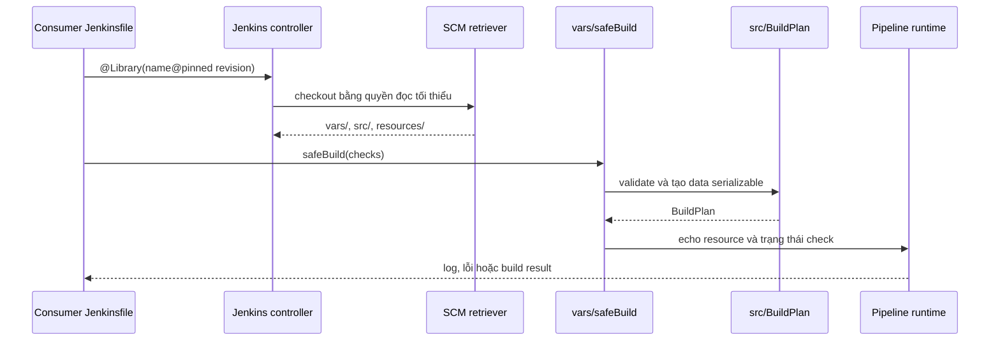

<Callout type="warn" title="Shared Library là code thực thi">
  Người có thể sửa repository library hoặc cấu hình một trusted global library có thể thay đổi hành vi của nhiều Pipeline. Ví dụ trong bài không có credential, endpoint hay thao tác phát hành; hãy dùng controller và agent lab cô lập trước khi áp dụng policy cho môi trường thật.
</Callout>

## Mục lục

- [Khi nào dùng Shared Library?](#khi-nào-dùng-shared-library)
- [Cấu trúc và cách Jenkins tìm library](#cấu-trúc-và-cách-jenkins-tìm-library)
  - [Sơ đồ thư mục](#sơ-đồ-thư-mục)
  - [Bảng vùng mã nguồn](#bảng-vùng-mã-nguồn)
  - [Nạp library và thời điểm nạp](#nạp-library-và-thời-điểm-nạp)
  - [Phạm vi cấu hình và trust](#phạm-vi-cấu-hình-và-trust)
- [Viết global variable và custom step an toàn](#viết-global-variable-và-custom-step-an-toàn)
  - [`vars/`, `def call` và help](#vars-def-call-và-help)
  - [Façade mỏng, validation và allowlist](#façade-mỏng-validation-và-allowlist)
  - [`src/`, resource và luồng gọi](#src-resource-và-luồng-gọi)
- [CPS, serialization và lỗi](#cps-serialization-và-lỗi)
- [Versioning và governance](#versioning-và-governance)
  - [Pin revision và compatibility](#pin-revision-và-compatibility)
  - [Owner, quyền SCM và credential boundary](#owner-quyền-scm-và-credential-boundary)
  - [Release, migration và rollback](#release-migration-và-rollback)
- [Lab local mock không có secret](#lab-local-mock-không-có-secret)
  - [Tạo repository tạm có guard](#tạo-repository-tạm-có-guard)
  - [Kiểm tra tĩnh và chạy trên Jenkins lab](#kiểm-tra-tĩnh-và-chạy-trên-jenkins-lab)
  - [Dọn sandbox có guard](#dọn-sandbox-có-guard)
- [Khắc phục sự cố](#khắc-phục-sự-cố)
- [Checklist áp dụng](#checklist-áp-dụng)
- [Tự kiểm tra](#tự-kiểm-tra)
- [Nguồn Jenkins chính thức](#nguồn-jenkins-chính-thức)
- [Đọc tiếp](#đọc-tiếp)

## Khi nào dùng Shared Library?

Shared Library là repository SCM chứa Groovy và resource mà Jenkins có thể nạp vào Pipeline. Nó phù hợp khi nhiều `Jenkinsfile` cần cùng một hợp đồng, chẳng hạn `safeBuild(checks: ['unit'])`, thay vì sao chép một đoạn Groovy vào từng repository. Mục tiêu là tái sử dụng **hành vi đã review**, không phải tạo một nơi để caller gửi Groovy, shell command, class name hoặc URL tùy ý vào để thực thi.

Bắt đầu với một API nhỏ và có ý định rõ. Ví dụ `safeBuild` diễn đạt một quy ước kiểm tra; `runAnything` che giấu hành vi và mở rộng bề mặt review. Library không thay thế [Jenkinsfile](/docs/pipelines/jenkinsfile), agent isolation hay kiểm soát credential: source gọi library vẫn là một phần trust boundary của build.

## Cấu trúc và cách Jenkins tìm library

### Sơ đồ thư mục

```text
ci-standards/
├── vars/
│   ├── safeBuild.groovy              # Global variable: safeBuild(...)
│   └── safeBuild.txt                 # Help hiển thị cho global variable
├── src/
│   └── org/acme/ci/
│       └── BuildPlan.groovy          # Logic Groovy thuần theo package
├── resources/
│   └── org/acme/ci/
│       └── banner.txt                # Dữ liệu tĩnh, không nhạy cảm
├── README.md                          # Contract, owner, cách dùng
├── CHANGELOG.md                       # Thay đổi theo release
└── LICENSE                            # Chính sách sử dụng nếu tổ chức cần
```

Jenkins quy ước tên file dưới `vars/` thành tên global variable. Vì vậy `vars/safeBuild.groovy` được gọi là `safeBuild`; đặt tên lower camel case, ngắn và hướng theo ý định để consumer đọc Jenkinsfile không cần biết cấu trúc nội bộ. Class dưới `src/` phải có đường dẫn khớp `package`, ví dụ `src/org/acme/ci/BuildPlan.groovy` khai báo `package org.acme.ci`.

### Bảng vùng mã nguồn

| Cấu trúc | Mục đích | Jenkins/consumer dùng như thế nào | Rủi ro cần kiểm soát |
| --- | --- | --- | --- |
| `vars/` | Điểm vào DSL hoặc global variable thân thiện với Jenkinsfile. | File `safeBuild.groovy` xuất `safeBuild`; `def call` cho phép gọi như hàm. | Nhét logic lớn, nhận closure/code/command tùy ý, hoặc nhầm đây là sandbox. |
| `vars/name.txt` | Help cho global variable tương ứng. | Nội dung mô tả input, output, lỗi và ví dụ gọi. | Để help lệch contract thực tế hoặc ghi dữ liệu nội bộ nhạy cảm. |
| `src/` | Class Groovy theo package; nơi đặt validation, model và quy tắc thuần. | Import khi library đã được biết lúc compile; unit test không cần Jenkins runtime. | Giữ `steps`, stream, client hoặc object plugin qua checkpoint. |
| `resources/` | Template, thông điệp hay dữ liệu tĩnh không nhạy cảm. | Đọc theo path, ví dụ `libraryResource('org/acme/ci/banner.txt')`. | Lưu secret, key, token hoặc cấu hình môi trường nhạy cảm. |
| Root files | Công bố contract, owner, license, version, migration và changelog. | Reviewer/consumer đọc trước khi nâng version. | Tag không bất biến, thiếu owner hoặc không có đường rollback. |

`vars/` chỉ là cơ chế discovery và API convention. Nó không tạo ranh giới quyền giữa `vars/` và `src/`; trust của library áp dụng cho code library mà Jenkins nạp.

### Nạp library và thời điểm nạp

Có ba cách nạp chính. Chọn cách tường minh mặc định để revision hiện trong diff của Jenkinsfile.

| Cách | Khi library được biết | Dùng tốt khi | Giới hạn và rủi ro |
| --- | --- | --- | --- |
| `@Library('ci-standards@v1.2.0') _` | Trước khi Jenkins biên dịch Pipeline script. | Gọi global variable trong `vars/` và import class từ `src/`. | Cần cấu hình library/retriever trước; pin tag hoặc SHA thay vì branch di động. |
| Implicit loading | Jenkins cấu hình nạp sẵn. | API nền tảng nhỏ, ổn định, owner rõ và version policy được công bố. | Che dependency/revision khỏi Jenkinsfile; không bật chỉ để sửa lỗi tên biến. |
| `library` step | Runtime, sau khi script đã bắt đầu chạy. | Trường hợp version đã được chọn từ dữ liệu nội bộ đã kiểm soát. | Không thể dùng để làm class `src/` có sẵn cho `import` compile-time; không lấy tên/version từ parameter, branch hay input không tin cậy. |

Ví dụ consumer an toàn nạp rõ revision. Annotation đứng trước `import`, vì `BuildPlan` phải có trên classpath khi script được biên dịch. Dấu `_` đưa global variables dưới `vars/` vào script.

```groovy
@Library('ci-standards@v1.2.0') _

import org.acme.ci.BuildPlan

pipeline {
  agent { label 'linux && ci-sandbox' }

  stages {
    stage('Verify') {
      steps {
        safeBuild(checks: ['unit', 'lint'])
      }
    }
  }
}
```

`library` step vẫn cần library name và revision đã được policy cho phép. Nó nạp muộn nên không giải quyết được `import` ở ví dụ trên. Không xây dynamic loader bằng `evaluate`, `load` đường dẫn từ input, reflection hay chọn revision từ pull request: các pattern đó biến dữ liệu thành code hoặc thay đổi dependency không thể review.

### Phạm vi cấu hình và trust

| Loại | Phạm vi | Trust/runtime | Quy ước an toàn |
| --- | --- | --- | --- |
| Global library | Controller; job phù hợp có thể dùng theo cấu hình. | Có thể được đánh dấu trusted hoặc giữ untrusted. | Chỉ trusted khi API thực sự cần đặc quyền; retriever chỉ có quyền đọc SCM tối thiểu. |
| Folder library | Các job trong cây Folder. | Untrusted và chạy trong Groovy sandbox. | Dùng để phân vùng ownership, không coi Folder là cách vượt sandbox. |
| Automatic library | Jenkins tự nhận diện/nạp theo cấu hình automatic-library của administrator và retriever hỗ trợ. | Phụ thuộc cấu hình library; không phải một nhãn trust riêng. | Công bố naming/revision rule, owner và quyền SCM; review như dependency tự động. |

Global library trusted chạy ngoài Groovy sandbox. Điều đó áp dụng cho `vars/`, `src/` và hành vi chúng kích hoạt, nên quyền ghi repository library và quyền sửa cấu hình global library là quyền nhạy cảm. Folder library luôn untrusted; việc chuyển code vào `vars/` không né Script Approval hay sandbox.

<Callout type="error" title="Không phê duyệt để làm build xanh">
  Script Approval là allowlist signature ở controller, không phải cách cấp quyền chung cho caller. Khi sandbox từ chối một lời gọi, truy vết library/revision/API, đánh giá ACL và tác động trước; thu hẹp API hoặc dùng alternative sandbox-safe nếu có. Không approve theo console log hay yêu cầu của pull request.
</Callout>

## Viết global variable và custom step an toàn

### `vars/`, `def call` và help

Một file `vars/safeBuild.groovy` có `def call(Map options = [:])` cung cấp cú pháp `safeBuild(...)`. File help cùng tên `vars/safeBuild.txt` cần mô tả allowlist, default, kết quả và lỗi để consumer không phải đọc implementation.

```groovy
// vars/safeBuild.groovy
import org.acme.ci.BuildPlan

def call(Map options = [:]) {
  BuildPlan plan = BuildPlan.from(options)
  echo libraryResource('org/acme/ci/banner.txt').trim()
  plan.checks.each { String check ->
    echo "requested-check=${check}"
  }
}
```

```text
safeBuild(checks: ['unit', 'lint'])

Chỉ chấp nhận checks: unit, lint.
Không nhận command, closure, credential hay URL từ caller.
Ném IllegalArgumentException khi input không hợp lệ.
```

`echo` là Pipeline step, nên façade `vars/` là nơi phù hợp để điều phối step và giữ log có ngữ cảnh. Đừng gọi Pipeline step từ constructor, static helper hoặc `@NonCPS` method trong `src/`.

### Façade mỏng, validation và allowlist

Đặt logic thuần vào `src/`; façade chỉ chuyển input đã kiểm tra thành hành vi Pipeline dễ quan sát. `BuildPlan` dưới đây chỉ trả dữ liệu đơn giản, không chạy shell, không biết credential và không giữ Jenkins step context.

```groovy
// src/org/acme/ci/BuildPlan.groovy
package org.acme.ci

class BuildPlan implements Serializable {
  final List<String> checks

  private BuildPlan(List<String> checks) {
    this.checks = checks
  }

  static BuildPlan from(Map options) {
    def allowed = ['unit', 'lint']
    def selected = (options.checks ?: ['unit']) as List

    if (!selected.every { it instanceof String && allowed.contains(it) }) {
      throw new IllegalArgumentException('checks must be unit or lint')
    }

    new BuildPlan(selected.collect { it as String })
  }
}
```

Allowlist chọn **hành vi đã review**, không chỉ lọc ký tự. Ví dụ trên không nhận `command: '...'` rồi gọi `sh`; nếu một build thật cần chạy tool, library nên ánh xạ `unit` hoặc `lint` sang command cố định do owner review. Không nhận closure, Groovy source, tên class, path tùy ý hoặc URL để library thực thi.

Khi validation thất bại, ném lỗi có thể hành động và để build thất bại. Không bắt lỗi rồi in warning/tiếp tục, vì consumer có thể tưởng policy đã được áp dụng. Jenkinsfile caller vẫn chịu scheduler, authorization, sandbox và credential scope của job; library không tự thêm các quyền đó.

### `src/`, resource và luồng gọi

`resources/` dành cho dữ liệu tĩnh không nhạy cảm. `libraryResource` đọc bằng đường dẫn package-like, không phải filesystem path của agent; vì vậy consumer không nên đoán checkout location. Không đặt secret vào resource: resource là một phần revision library và có thể đi qua SCM, cache, log hoặc review.



Luồng này không chứng minh library có thể chạy trên mọi controller. Retriever, version Git/SCM, plugin Pipeline, sandbox policy và Script Approval là behavior runtime cần xác minh riêng trên controller lab. Static unit test chỉ chứng minh contract Groovy; nó không thay thế kiểm tra classpath, retriever hoặc sandbox.

## CPS, serialization và lỗi

Pipeline Groovy dùng CPS để có thể lưu execution state và tiếp tục ở những điểm phù hợp sau gián đoạn. Bất kỳ dữ liệu nào còn sống qua `echo`, `sh`, `sleep`, `input` hay step có thể tạm dừng phải serializable: `String`, number, boolean, `List`/`Map` chứa các kiểu đó, hoặc object `Serializable` đơn giản như `BuildPlan`.

Không giữ `File`, stream, socket, iterator, matcher, thread, client SDK, closure phức tạp hay object Jenkins/plugin qua Pipeline step. Nếu gặp `NotSerializableException`, tách thông tin cần giữ thành dữ liệu đơn giản trước step thay vì tắt khả năng resume.

`@NonCPS` chỉ phù hợp hàm Groovy thuần, ngắn và đồng bộ, chẳng hạn chuẩn hóa một list cục bộ. Hàm đó không được gọi `echo`, `sh`, `node`, `stage`, `sleep`, `error` hay Pipeline step nào; cũng không dùng cho I/O dài hay polling vì nó không có semantics resume như CPS. Giá trị trả về vẫn cần serializable nếu caller giữ nó sau đó.

```groovy
@NonCPS
List<String> normalizeChecks(List values) {
  values
    .findAll { it instanceof String }
    .collect { it.trim().toLowerCase() }
    .findAll { it }
    .unique()
    .sort()
}
```

Tách `@NonCPS` cho phép unit test biến đổi dữ liệu, còn `vars/` chịu trách nhiệm gọi step và báo lỗi. Cảnh báo CPS method mismatch thường chỉ ra đã trộn hai ranh giới này; xem [Thiết kế Jenkins Shared Libraries](/docs/advanced/shared-library-design) để đọc sâu về CPS, API boundary và trust.

## Versioning và governance

### Pin revision và compatibility

| Revision consumer | Khi phù hợp | Tác động quản trị |
| --- | --- | --- |
| `@Library('ci-standards@v1.2.0')` | Release contract ổn định. | Dùng tag bất biến, changelog và quy ước SemVer. |
| `@Library('ci-standards@<full-commit-sha>')` | Cần tái lập/audit đúng một revision, nếu SCM retriever hỗ trợ. | Cập nhật pin qua pull request; ghi nhận SHA trong evidence release. |
| `@Library('ci-standards@main')` | Canary hoặc lab đã kiểm soát. | Branch di động: cùng Jenkinsfile có thể nhận code khác; không dùng làm mặc định production. |

Default version ở cấu hình library là fallback, không phải cam kết tái lập. Administrator cũng có thể khóa khả năng consumer override version; policy này cần được công bố cùng contract. Không di chuyển tag đã phát hành: tạo tag mới cho sửa lỗi hoặc thay đổi API.

Duy trì compatibility matrix trước release: Jenkins LTS được hỗ trợ, Java/runtime khi relevant, plugin Pipeline/SCM retriever liên quan, sandbox mode và consumer canary. Matrix là danh sách version đã được chạy có evidence; không suy ra tương thích chỉ vì Groovy unit test xanh.

### Owner, quyền SCM và credential boundary

Mỗi library cần owner kỹ thuật, owner vận hành, reviewer bắt buộc và đường escalation. Bảo vệ branch/tag, yêu cầu review/CODEOWNERS theo policy, audit quyền ghi SCM và review riêng thay đổi retriever/global-library configuration. Jenkins chỉ nên có credential đọc repository ở phạm vi nhỏ nhất; không dùng token ghi để checkout cho tiện.

Trusted global library là capability đặc quyền. Thiết kế nó như một API hẹp, không nhận command, closure hoặc URL tùy ý; tách phần cần đặc quyền khỏi logic thuần. Untrusted global/folder library vẫn chạy sandbox và có thể gặp approval. Xem [Mô hình bảo mật Jenkins](/docs/security/security-model) để phân biệt sandbox, authorization, agent isolation và credential boundary.

Library không giữ giá trị credential trong `vars/`, `src/`, `resources`, fixture, changelog hay log. Nếu consumer thật sự cần secret, Jenkinsfile bind credential ở stage/closure hẹp nhất theo [Credentials trong Pipeline](/docs/pipelines/credentials); API library chỉ nên nhận dữ liệu không nhạy cảm đã có contract rõ, hoặc để consumer điều phối binding.

### Release, migration và rollback

Quy trình release có thể kiểm toán:

1. Merge revision qua review, rồi chạy unit/contract test và integration trên controller lab.
2. Ghi compatibility matrix, tạo tag bất biến và changelog gắn với commit đã kiểm tra.
3. Nâng một nhóm consumer canary bằng pull request pin version mới; quan sát log/result và contract của họ.
4. Công bố migration: API thay thế, support window, owner và điều kiện bỏ API cũ.
5. Mở rộng dần. Nếu canary lỗi, rollback consumer bằng pull request pin tag/SHA cũ đã biết tốt; không sửa lại tag đã công bố.

Một thay đổi breaking cần major version. Với thay đổi tương thích, có thể thêm API mới, giữ wrapper cũ trong cửa sổ đã công bố và in cảnh báo không chứa dữ liệu nhạy cảm. Trước khi xóa wrapper, tìm consumer theo khai báo `@Library` và lời gọi API, tạo migration PR, chạy contract của consumer và nhận xác nhận từ owner.

## Lab local mock không có secret

Lab này tạo Git repository local trong sandbox do `mktemp` sinh ra, không có remote, credential, Jenkins CLI hay mã không tin cậy. Các lệnh shell bên dưới có thể chạy trên máy lab POSIX có `git`; chúng chỉ tạo dữ liệu trong sandbox mới. Phần cấu hình Jenkins là thao tác UI trên **controller lab cô lập**, không phải script cấu hình production.

### Tạo repository tạm có guard

<Steps>
<Step>

### Tạo sandbox và nội dung library

Chạy nguyên block trong một shell lab và giữ shell đó mở đến lúc cleanup. Prefix, parent, quan hệ thư mục và marker được kiểm tra trước khi tạo nội dung.

```bash
set -eu
umask 077
readonly LAB_PARENT='/tmp'
readonly LAB_PREFIX='jenkins-shared-library-lab.'
LAB_SANDBOX="$(mktemp -d "${LAB_PARENT}/${LAB_PREFIX}XXXXXX")"
readonly LAB_SANDBOX
readonly LAB_REPO="${LAB_SANDBOX}/ci-standards"
readonly LAB_MARKER="${LAB_SANDBOX}/.jenkins-shared-library-lab-marker"

case "$LAB_SANDBOX" in
  "$LAB_PARENT"/"$LAB_PREFIX"*) ;;
  *) printf >&2 'Không tạo lab: prefix sandbox không hợp lệ.\n'; exit 1 ;;
esac
[ "$(dirname -- "$LAB_SANDBOX")" = "$LAB_PARENT" ] || {
  printf >&2 'Không tạo lab: sandbox không là child trực tiếp của /tmp.\n'
  exit 1
}
printf '%s\n' 'jenkins-shared-library-lab-v1' > "$LAB_MARKER"
mkdir -p "$LAB_REPO"/{vars,src/org/acme/ci,resources/org/acme/ci}
cd "$LAB_REPO"
git init -b main
git config user.name 'Lab User'
git config user.email 'lab@example.invalid'

cat > vars/safeBuild.groovy <<'EOF'
import org.acme.ci.BuildPlan

def call(Map options = [:]) {
  BuildPlan plan = BuildPlan.from(options)
  echo libraryResource('org/acme/ci/banner.txt').trim()
  plan.checks.each { String check -> echo "requested-check=${check}" }
}
EOF

cat > vars/safeBuild.txt <<'EOF'
safeBuild(checks: ['unit', 'lint'])
Only unit and lint are accepted. No command, credential, closure, or URL input.
EOF

cat > src/org/acme/ci/BuildPlan.groovy <<'EOF'
package org.acme.ci

class BuildPlan implements Serializable {
  final List<String> checks
  private BuildPlan(List<String> checks) { this.checks = checks }
  static BuildPlan from(Map options) {
    def allowed = ['unit', 'lint']
    def selected = (options.checks ?: ['unit']) as List
    if (!selected.every { it instanceof String && allowed.contains(it) }) {
      throw new IllegalArgumentException('checks must be unit or lint')
    }
    new BuildPlan(selected.collect { it as String })
  }
}
EOF

printf 'Shared Library local mock\n' > resources/org/acme/ci/banner.txt
cat > Jenkinsfile.lab <<'EOF'
@Library('ci-standards@v0.1.0') _

pipeline {
  agent { label 'linux && ci-sandbox' }
  stages {
    stage('Library contract') {
      steps {
        safeBuild(checks: ['unit', 'lint'])
      }
    }
  }
}
EOF

git add vars src resources Jenkinsfile.lab
git commit -m 'Add safe local shared library mock'
git tag v0.1.0
printf 'Lab repository: %s\n' "$LAB_REPO"
```

</Step>
<Step>

### Kiểm tra tĩnh trước Jenkins

Lệnh này chỉ kiểm tra layout/file/Git tag của mock. Nó **không** biên dịch Pipeline, không kiểm tra sandbox, không chạy Jenkins và không chứng minh behavior của plugin/runtime.

```bash
set -eu
test -f "$LAB_REPO/vars/safeBuild.groovy"
test -f "$LAB_REPO/vars/safeBuild.txt"
test -f "$LAB_REPO/src/org/acme/ci/BuildPlan.groovy"
test -f "$LAB_REPO/resources/org/acme/ci/banner.txt"
test -f "$LAB_REPO/Jenkinsfile.lab"
git -C "$LAB_REPO" rev-parse --verify 'v0.1.0^{commit}'
printf 'Static mock layout is present.\n'
```

</Step>
</Steps>

### Kiểm tra tĩnh và chạy trên Jenkins lab

Trên Jenkins lab có Pipeline, Git/SCM retriever phù hợp và một agent `linux && ci-sandbox` không có credential/release access, tạo global library tên `ci-standards` ở trạng thái **untrusted**, tắt implicit loading và trỏ retriever Git tới repository local vừa in ra. Dùng revision `v0.1.0`; không thêm credential và không bật trusted để làm lab chạy.

Tạo Pipeline job lab, đặt script là nội dung `Jenkinsfile.lab`, rồi chạy build. Kết quả runtime mong đợi: Console Output có `Shared Library local mock`, `requested-check=unit`, `requested-check=lint` và build `SUCCESS`. Nếu retriever không hỗ trợ đường dẫn repository local hoặc sandbox yêu cầu approval, dừng ở đó và ghi nhận giới hạn plugin/policy; không tắt sandbox, không approve signature và không đổi agent thành controller.

Phân biệt evidence: kiểm tra tĩnh ở bước trước xác nhận repository mock; unit test (nếu đội có framework Groovy/Pipeline Unit) chỉ xác nhận class/façade theo mock; Jenkins lab mới kiểm tra được lookup library, classpath, `libraryResource`, CPS và sandbox của controller đang dùng. [Kiểm thử Jenkinsfile](/docs/pipelines/testing) trình bày các lớp lint, unit, contract và runtime test; dùng các lớp đó để bổ sung evidence, không thay thế integration trên controller lab của library này.

### Dọn sandbox có guard

Chạy hàm sau trong **cùng shell** đã tạo lab. Nó từ chối cleanup nếu thiếu biến, sai parent `/tmp`, sai prefix, sai quan hệ child/repository/marker hoặc marker không đúng. Hàm đổi thư mục ra `/` trước khi dùng `rm -rf`; không đụng job, workspace, credential, Script Approval hay cấu hình Jenkins.

```bash
cleanup_lab() {
  local expected_marker='jenkins-shared-library-lab-v1'

  if [ -z "${LAB_PARENT:-}" ] || [ -z "${LAB_PREFIX:-}" ] || \
     [ -z "${LAB_SANDBOX:-}" ] || [ -z "${LAB_REPO:-}" ] || \
     [ -z "${LAB_MARKER:-}" ]; then
    printf >&2 'Không dọn dẹp: thiếu biến sandbox.\n'
    return 1
  fi

  case "$LAB_SANDBOX" in
    "$LAB_PARENT"/"$LAB_PREFIX"*) ;;
    *) printf >&2 'Không dọn dẹp: prefix sandbox không hợp lệ.\n'; return 1 ;;
  esac

  if [ "$LAB_PARENT" != '/tmp' ] || \
     [ "$(dirname -- "$LAB_SANDBOX")" != "$LAB_PARENT" ] || \
     [ "$LAB_REPO" != "$LAB_SANDBOX/ci-standards" ] || \
     [ "$LAB_MARKER" != "$LAB_SANDBOX/.jenkins-shared-library-lab-marker" ] || \
     [ ! -d "$LAB_PARENT" ] || [ ! -d "$LAB_SANDBOX" ] || \
     [ ! -d "$LAB_REPO" ] || [ ! -f "$LAB_MARKER" ] || \
     [ "$(cat -- "$LAB_MARKER")" != "$expected_marker" ]; then
    printf >&2 'Không dọn dẹp: guard parent, child hoặc marker thất bại.\n'
    return 1
  fi

  cd / || { printf >&2 'Không dọn dẹp: không thể rời sandbox.\n'; return 1; }
  rm -rf -- "$LAB_SANDBOX"
}

cleanup_lab
```

## Khắc phục sự cố

| Dấu hiệu | Nguyên nhân thường gặp | Cách xử lý an toàn |
| --- | --- | --- |
| `No such global variable` | Sai tên file `vars/`, sai library name/scope hoặc chưa nạp library. | Đối chiếu `vars/safeBuild.groovy`, `@Library`, cấu hình retriever và revision; không bật implicit loading để che dependency. |
| Không import được class `src/` | Annotation không đứng trước `import`, package không khớp path hoặc library được nạp bằng runtime step. | Đưa `@Library` lên trước `import`, đối chiếu `src/org/...` với `package`; dùng khai báo compile-time cho class import. |
| Sandbox từ chối signature | Untrusted/folder library gọi capability bị chặn. | Thu hẹp API hoặc chọn API sandbox-safe; review signature, ACL và owner trước mọi approval. |
| `NotSerializableException` hoặc CPS mismatch | Object không serializable sống qua step, hoặc step bị gọi từ `@NonCPS`. | Chuyển state thành dữ liệu đơn giản, tách hàm thuần và giữ Pipeline step trong phần CPS. |
| Build thay đổi hành vi giữa các lần chạy | Consumer dùng branch/default version di động. | Pin tag bất biến hoặc full commit SHA khi SCM hỗ trợ; upgrade qua pull request và canary. |
| Retriever checkout thất bại | URL/path, tag hoặc quyền đọc SCM sai. | Xác minh revision tồn tại và Jenkins có read access tối thiểu; không thêm token ghi để thử nhanh. |
| Resource không đọc được | Sai path `libraryResource`, resource không thuộc external library hoặc plugin/runtime khác kỳ vọng. | Kiểm tra path package-like và chạy integration trên controller lab; không đọc trực tiếp filesystem agent để thay thế. |

## Checklist áp dụng

- [ ] Repository có `vars/`, `src/`, `resources/` và root files mô tả contract, owner, version/changelog.
- [ ] Tên `vars/` ổn định, có help `.txt`; `def call` nhận input có default và allowlist rõ.
- [ ] Façade `vars/` mỏng; logic thuần, serializable và unit-testable nằm trong `src/`; resource không có secret.
- [ ] `@Library` tường minh pin tag bất biến hoặc SHA phù hợp; branch di động chỉ dùng cho canary/lab có kiểm soát.
- [ ] Import class `src/` chỉ dùng khi library được biết trước compile; runtime `library` step không nhận version từ input không tin cậy.
- [ ] Global trusted capability có API hẹp, owner và review riêng; folder/untrusted library vẫn chịu sandbox và Script Approval được review.
- [ ] Jenkins retriever có quyền SCM read-only tối thiểu; quyền ghi library/configuration có protected branch/tag và audit.
- [ ] Credential chỉ bind ở consumer scope hẹp, không nằm trong library, log, resource, fixture hoặc artifact.
- [ ] Compatibility matrix, unit/contract/integration/canary evidence, migration và rollback pin cũ đều có trước khi công bố.
- [ ] Lab chỉ dùng sandbox `mktemp`, marker/prefix/parent guard và agent lab; không có remote production hay cleanup ngoài sandbox.

## Tự kiểm tra

1. **Vì sao `vars/release.groovy` không tự an toàn hơn `src/...`?** Vì `vars/` là discovery/API convention; trust đến từ cấu hình trusted global hay untrusted/folder library, không đến từ thư mục.
2. **Khi nào dùng `@Library` thay vì `library` step?** Dùng `@Library` khi cần import class `src/` hoặc muốn dependency/revision rõ trước compile. `library` step là runtime và không làm import compile-time có sẵn.
3. **Có thể truyền `params.COMMAND` vào custom step rồi gọi `sh` không?** Không. Hãy map một giá trị allowlist sang hành vi cố định đã review, hoặc thiết kế lại API không nhận command.
4. **Static mock xanh có chứng minh sandbox và retriever hoạt động không?** Không. Nó chỉ chứng minh layout/revision local; cần integration trên Jenkins lab để kiểm tra runtime, plugin, classpath, resource và sandbox.
5. **Rollback release library bằng cách nào?** Đổi consumer về tag/SHA cũ đã biết tốt qua pull request và điều tra revision mới; không di chuyển tag đã phát hành.

## Nguồn Jenkins chính thức

- [Using shared libraries](https://www.jenkins.io/doc/book/pipeline/shared-libraries/) — cấu trúc, nạp, scope, retriever, `vars`, `src` và resources.
- [Pipeline CPS method mismatches](https://www.jenkins.io/doc/book/pipeline/cps-method-mismatches/) — giới hạn CPS, closure và `@NonCPS`.
- [In-process Script Approval](https://www.jenkins.io/doc/book/managing/script-approval/) — đánh giá approval thay vì phê duyệt mù.
- [Jenkins Security](https://www.jenkins.io/doc/book/security/) — authorization, controller/agent và trust boundary.
- [Using credentials](https://www.jenkins.io/doc/book/using/using-credentials/) — scope credential và nguyên tắc không để secret vào Pipeline code.
- [Using a Jenkinsfile](https://www.jenkins.io/doc/book/pipeline/jenkinsfile/) — mô hình Jenkinsfile và Pipeline as Code.

## Đọc tiếp

<Cards>
  <Card title="Thiết kế Shared Libraries nâng cao" href="/docs/advanced/shared-library-design" description="Đào sâu API privileged, CPS, lifecycle release và contract consumer." />
  <Card title="Tổng quan Pipeline" href="/docs/pipelines/overview" description="Ôn execution model, build evidence và vai trò controller/agent." />
  <Card title="Credentials trong Pipeline" href="/docs/pipelines/credentials" description="Bind credential ở scope hẹp mà không đưa secret vào library." />
  <Card title="Mô hình bảo mật Jenkins" href="/docs/security/security-model" description="Lập threat model cho SCM, controller, agent, plugin và code không tin cậy." />
  <Card title="Groovy trong Jenkins Pipeline" href="/docs/advanced/groovy" description="Hiểu sâu CPS, serialization, sandbox và Script Approval." />
</Cards>
