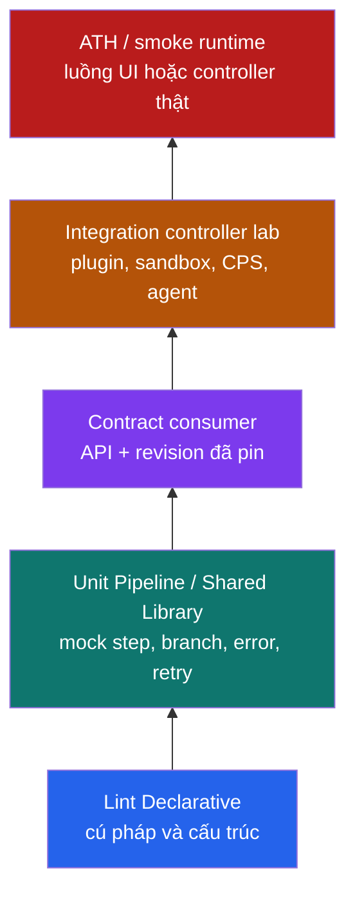

<Callout type="info" title="Phạm vi và nguyên tắc an toàn">
  Trang này kiểm thử mã Pipeline và Shared Library, không xác nhận một bản phát hành ứng dụng. Ví dụ không có secret, không gọi dịch vụ ngoài và không chạy lệnh deploy. Chạy runtime test chỉ trên controller/agent lab cô lập, với Jenkins, plugin, JDK và image đã pin theo ma trận hỗ trợ của đội.
</Callout>

Một Jenkinsfile là code chạy qua parser Declarative, Groovy/CPS, plugin, controller, agent và policy bảo mật. Vì vậy một tầng test duy nhất không đủ: lint cho phản hồi cấu trúc sớm, mock unit test kiểm tra flow, contract bảo vệ consumer, còn controller lab mới cho bằng chứng runtime. Những lớp này bổ sung nhau; không lớp nào tự chứng minh build ứng dụng sẽ pass hoặc Pipeline an toàn.

## Mục lục

- [Mô hình kiểm thử Pipeline](#mô-hình-kiểm-thử-pipeline)
  - [Pyramid và luồng gate](#pyramid-và-luồng-gate)
  - [Bảng quyết định](#bảng-quyết-định)
- [Declarative linter](#declarative-linter)
  - [Linter chứng minh gì và không chứng minh gì](#linter-chứng-minh-gì-và-không-chứng-minh-gì)
  - [UI CLI và HTTP endpoint](#ui-cli-và-http-endpoint)
  - [Xác thực crumb và gate pull request](#xác-thực-crumb-và-gate-pull-request)
- [Unit test Pipeline không side effect](#unit-test-pipeline-không-side-effect)
  - [Mock step context và đường đi](#mock-step-context-và-đường-đi)
  - [Ví dụ với JenkinsPipelineUnit](#ví-dụ-với-jenkinspipelineunit)
  - [Giới hạn của mock](#giới-hạn-của-mock)
- [Kiểm thử Shared Library](#kiểm-thử-shared-library)
  - [Chia bề mặt vars src resources](#chia-bề-mặt-vars-src-resources)
  - [Trust contract pin và CPS](#trust-contract-pin-và-cps)
- [Sandbox runtime và controller test](#sandbox-runtime-và-controller-test)
  - [Thiết kế môi trường disposable](#thiết-kế-môi-trường-disposable)
  - [Integration JenkinsRule và acceptance test](#integration-jenkinsrule-và-acceptance-test)
- [CI gate và checklist](#ci-gate-và-checklist)
- [Lab local an toàn](#lab-local-an-toàn)
  - [Tạo fixture Jenkinsfile vô hại](#tạo-fixture-jenkinsfile-vô-hại)
  - [Validate trên sandbox loopback có giới hạn](#validate-trên-sandbox-loopback-có-giới-hạn)
  - [Dọn fixture có guard](#dọn-fixture-có-guard)
- [Khắc phục sự cố](#khắc-phục-sự-cố)
- [Nguồn tham khảo](#nguồn-tham-khảo)
- [Đọc tiếp](#đọc-tiếp)

## Mô hình kiểm thử Pipeline

### Pyramid và luồng gate

Pyramid dưới đây áp dụng cho **mã điều phối Jenkins**. Đáy chạy nhiều và nhanh; càng lên cao càng gần controller thật, đắt hơn và cần ít case đại diện hơn.



Luồng áp dụng cho một pull request (PR) nên đi từ trái sang phải: lint và unit là required check nhanh; contract chạy trên revision library mà consumer pin; integration/acceptance chạy ở lane lab được kiểm soát. Một lỗi lint không cần chờ controller; một lỗi CPS, sandbox hay plugin không được kết luận là không tồn tại chỉ vì unit test xanh.

### Bảng quyết định

| Lớp | Câu hỏi trả lời | Chạy ở đâu | Bằng chứng pass | Không chứng minh |
| --- | --- | --- | --- | --- |
| **Lint** | Jenkinsfile Declarative có cấu trúc/model hợp lệ? | Controller có Pipeline: Declarative hoặc CLI/endpoint của nó | Exit code/response hợp lệ, output linter | Agent, tool, credential, shell command, security hay build ứng dụng pass |
| **Unit** | Logic branch, parameter, retry và gọi step có đúng contract? | JVM/test runner với mock framework | Assertion về call stack, argument, exception | Plugin/controller thật, SCM, agent, CPS persistence hoặc Script Security runtime |
| **Contract** | Consumer tại revision pin vẫn gọi đúng API library? | Fixture consumer + mock, sau đó lab | API output/error theo version đã công bố | Mọi combination Jenkins/plugin ngoài ma trận hỗ trợ |
| **Integration** | Controller, plugin, sandbox, retriever, resource và agent lab phối hợp đúng? | Controller/agent disposable | Build/log/result/report từ lab | Production capacity, dữ liệu hay credential production |
| **ATH/smoke** | Journey chọn lọc qua UI/controller gần thực tế có hoạt động? | Hạ tầng acceptance cô lập | Kịch bản end-to-end và trace không nhạy cảm | Bao phủ mọi workflow hay an toàn production tuyệt đối |

Chọn ít case đại diện ở tầng runtime: một Jenkinsfile hợp lệ, một đường lỗi có chủ đích, một library revision đã pin và một restart khi code đi qua checkpoint. Đừng dùng acceptance test để thay thế hàng chục unit test thuần.

## Declarative linter

### Linter chứng minh gì và không chứng minh gì

**Declarative linter** do plugin Pipeline: Declarative (Pipeline Model Definition) cung cấp để Jenkins parse và model-validate một Declarative Jenkinsfile trước khi thực thi đầy đủ. Nó phù hợp để phát hiện `agent`, `stages`, directive hoặc nesting sai vị trí.

| Loại kiểm tra | Ví dụ | Linter có làm không? |
| --- | --- | --- |
| Cú pháp/model Declarative | `steps` nằm ngoài `stage`, `agent` thiếu cấu hình | Có, khi controller có plugin/phiên bản phù hợp |
| Semantics runtime | Label agent có executor, `checkout scm` có nguồn, `sh` có toolchain | Không |
| Plugin/step availability | Một step tích hợp đã cài và được cấu hình đúng | Không nên suy ra từ pass linter; xác minh bằng Pipeline Syntax và lab |
| Security/policy | Credential đúng scope, branch/fork có quyền phù hợp, command không exfiltrate | Không |
| Kết quả build | Test ứng dụng, network, artifact, deploy hay rollback thành công | Không |

<Callout type="warn" title="Pass linter không phải chứng nhận an toàn">
  Linter không chạy shell, không cấp agent và không đánh giá ý nghĩa kinh doanh của Groovy trong `script {}`. Một Jenkinsfile linter pass vẫn có thể bị Script Security từ chối, thiếu plugin, nằm queue, dùng sai credential hoặc tạo side effect nguy hiểm khi chạy. PR chỉ được đi tiếp khi các gate sau cũng đạt.
</Callout>

Linter chỉ dành cho Declarative Pipeline; Scripted Pipeline và logic Groovy động cần unit/integration test khác. Cú pháp hợp lệ cũng phụ thuộc version Jenkins và Pipeline: Declarative đang cài. Ghi core/plugin version trong evidence khi một lỗi chỉ tái hiện ở một lane.

### UI CLI và HTTP endpoint

Trước khi tích hợp, kiểm tra controller lab có Jenkins core được hỗ trợ, plugin **Pipeline: Declarative**, endpoint/CLI được quản trị viên cho phép và đường truyền TLS. **Pipeline Syntax** cùng **Declarative Directive Generator** trong UI giúp đối chiếu step/directive với chính instance; chúng không thay linter hay runtime build.

| Cách gọi | Dùng khi | Điều kiện và lưu ý |
| --- | --- | --- |
| UI/Pipeline Syntax | Tác giả cần tra snippet hoặc directive nhanh | Cần quyền UI thích hợp; output phản ánh plugin controller hiện tại, không phải policy production mặc định |
| Jenkins CLI qua SSH | CI/laptop đã được cấp SSH CLI an toàn | SSH CLI phải bật; account có quyền tối thiểu; Jenkins chính thức khuyến nghị giao diện SSH cho linter CLI |
| `jenkins-cli.jar` | Chính sách tổ chức dùng transport CLI khác | Tải JAR từ controller tin cậy, xác minh TLS/auth; không commit file `username:apiToken` |
| `POST /pipeline-model-converter/validate` | Một integration nội bộ cần gọi HTTP | Endpoint của plugin Pipeline Model Definition; gửi multipart form field `jenkinsfile`; auth, crumb và permission phải được xác minh trên controller/proxy/version đang dùng |

Endpoint HTTP của plugin Pipeline Model Definition nhận **form field** tên chính xác `jenkinsfile`, không phải JSON body và không phải endpoint CLI. Mẫu sau là **non-executable** cho tới khi controller sandbox đã xác minh plugin, URL context path, TLS, auth và CSRF behavior. `JENKINS_AUTH_FILE` là file `netrc` do secret manager provision ngoài repository, mode `0600`; token/password không nằm trong URL, argv hay log. Nó chỉ gửi fixture không có secret:

```bash
# Prerequisite: JENKINS_URL là HTTPS URL của controller sandbox;
# JENKINS_AUTH_FILE là netrc file mode 0600 do secret manager provision.
set -eu
: "${JENKINS_URL:?Đặt HTTPS URL controller sandbox}"
: "${JENKINS_AUTH_FILE:?Đặt path netrc ngoài repository}"
: "${JENKINSFILE_PATH:?Đặt path tới Jenkinsfile không chứa secret}"
test -r "$JENKINS_AUTH_FILE"
test -r "$JENKINSFILE_PATH"

curl --fail-with-body --silent --show-error \
  --netrc-file "$JENKINS_AUTH_FILE" \
  --form "jenkinsfile=<${JENKINSFILE_PATH}" \
  "$JENKINS_URL/pipeline-model-converter/validate"
```

Mẫu sau là **non-executable** nếu chưa có controller lab, SSH CLI được bật, port SSH, hostname và account được cấp theo policy. Nó chỉ gửi nội dung Jenkinsfile qua stdin; không có credential trong lệnh.

```bash
# Prerequisite: controller lab đã bật Jenkins SSH CLI; JENKINS_HOST và port là giá trị do lab công bố.
# Non-executable cho tới khi các biến và quyền SSH CLI được provision ngoài repository.
set -eu
: "${JENKINS_HOST:?Đặt hostname controller lab}"
: "${JENKINS_SSH_PORT:?Đặt port SSH CLI controller lab}"
ssh -p "$JENKINS_SSH_PORT" "$JENKINS_HOST" declarative-linter < Jenkinsfile
```

Kết quả thành công thường chứa `Jenkinsfile successfully validated.`; hãy lưu exit status và version controller/plugin cùng PR check. Không hard-code host production, không tắt TLS/CSRF, và không thêm quyền administrator chỉ để linter đi qua.

### Xác thực crumb và gate pull request

HTTP linter là request `POST` tới `/pipeline-model-converter/validate`, với multipart form field `jenkinsfile`. Client dùng browser session/password có thể cần CSRF **crumb** lấy từ cùng controller/session. Jenkins core hiện đại thường miễn crumb cho request xác thực bằng API token, nhưng đây không phải cam kết phổ quát cho plugin endpoint, reverse proxy, security realm hay version khác. Xác minh request thật trên sandbox; đừng tắt CSRF khi gặp `403`.

- Dùng service identity riêng, quyền tối thiểu và credential được quản trị ngoài Git. API token xác thực identity; permission mới quyết định endpoint được gọi.
- Không đặt token/password trong URL, argv, Jenkinsfile, log, artifact hay report. Không in response body có thể phản chiếu nội dung Pipeline.
- Với session/password flow, lấy `crumbRequestField` và `crumb` từ crumb issuer bằng cùng URL/cookie session; gửi lại field runtime đó cho POST bằng client có thể giữ cookie/header ngoài log. Không hard-code tên header, không ghi crumb/cookie vào command history hay process arguments.
- Với API-token flow, chỉ bỏ crumb khi chính controller sandbox xác nhận endpoint này chấp nhận request đó. `401`/`403` cần được phân biệt giữa identity permission, session/crumb, URL canonical, context path và proxy.

Gate PR tối thiểu: checkout Jenkinsfile ở revision PR → linter Declarative nếu file dùng `pipeline {}` → fail check khi parser/model báo lỗi → unit/contract lanes. Linter pass không được là điều kiện duy nhất để merge hoặc cấp credential cho build PR.

## Unit test Pipeline không side effect

Unit test Pipeline chạy Jenkinsfile/library trong một framework mô phỏng Pipeline DSL. [JenkinsPipelineUnit](https://github.com/jenkinsci/JenkinsPipelineUnit) là dự án **bên thứ ba** phổ biến; có thể dùng framework tương thích nếu nó cung cấp mock và assertion tương đương. Không gọi framework đó là Jenkins core hay tài liệu chính thức.

### Mock step context và đường đi

Mock phải mô tả một contract nhỏ, không mô phỏng cả Jenkins. Test các đường đi có policy:

- parameter hợp lệ/không hợp lệ, `when` hoặc branch `main`/feature;
- exception và exit status của step bắt buộc; lỗi phải tiếp tục làm test fail;
- `retry` bao đúng thao tác idempotent và số attempt hữu hạn;
- `withEnv`/environment được thiết lập trong scope mong muốn;
- `sh`, `checkout`, HTTP, deploy, credential binding hay gọi external service đều bị mock/stub — **không** thực hiện side effect thật.

Ví dụ Jenkinsfile Scripted dưới chỉ chọn một check từ allowlist và gọi `sh` bằng chuỗi cố định. Đây là fixture unit test, không phải lệnh production:

```groovy
// vars/runCheck.groovy hoặc fixture Pipeline

def call(String requested = 'unit') {
  def commands = [
    unit: 'printf "unit check\\n"',
    lint: 'printf "lint check\\n"'
  ]
  def command = commands[requested]
  if (command == null) {
    error("Unsupported check: ${requested}")
  }
  withEnv(["CHECK_NAME=${requested}"]) {
    sh command
  }
}
```

### Ví dụ với JenkinsPipelineUnit

Mẫu test dưới là **non-executable** cho đến khi repository test đã thêm JenkinsPipelineUnit, Groovy/JUnit tương thích và API framework đúng version đã pin. Nó đăng ký mock cho `withEnv` và `sh`; callback không mở shell thật. Tên helper có thể thay đổi theo version framework, nên đối chiếu README/API của version pin trước khi chép vào dự án.

```groovy
import com.lesfurets.jenkins.unit.BasePipelineTest
import org.junit.Before
import org.junit.Test

class RunCheckTest extends BasePipelineTest {
  List<String> seen = []

  @Before
  void setUp() {
    super.setUp()
    helper.registerAllowedMethod('withEnv', [List, Closure]) { List env, Closure body ->
      seen.add("env=${env.join(',')}")
      body.call()
    }
    helper.registerAllowedMethod('sh', [String]) { String command ->
      seen.add("sh=${command}")
      null
    }
  }

  @Test
  void unit_check_uses_scoped_environment_and_no_real_shell() {
    def script = loadScript('vars/runCheck.groovy')
    script.call('unit')

    assert seen == [
      'env=CHECK_NAME=unit',
      'sh=printf "unit check\\n"'
    ]
  }

  @Test(expected = Exception)
  void unsupported_check_fails_before_a_shell_call() {
    def script = loadScript('vars/runCheck.groovy')
    script.call('deploy')
  }
}
```

Thêm test riêng cho `retry` bằng mock đếm attempt và cho đường lỗi bằng mock `sh` ném exception. Với parameter hoặc branch, đặt `binding.params`/`binding.env` theo API framework rồi assert stage/step tương ứng. Không dùng retry thực để biến assertion lỗi thành xanh; test phải lưu được lần gọi và lỗi ban đầu.

### Giới hạn của mock

Mock unit test không thay thế một Jenkins controller:

| Không được mock chứng minh | Vì sao cần tầng khác |
| --- | --- |
| Plugin step, classloading hoặc descriptor thật | Chỉ controller lab có đúng plugin/JDK mới nạp được chúng |
| `JenkinsRule`, job config hay UI Jenkins thật | Dùng Jenkins test harness/integration test cho plugin và controller behavior |
| Script Security approval/trust của library | Cần sandbox controller lab và review approval theo policy |
| CPS checkpoint, serialization và resume/restart | Cần chạy qua Pipeline runtime; mock không mô hình hóa chính xác persistence |
| Agent image, workspace, SCM, network hoặc credential | Những thành phần này là runtime infrastructure, không gọi trong unit test |

Không cho test process gọi production/external service để “tăng độ thật”. Nếu cần HTTP contract, chạy một fake server loopback trong harness hoặc một endpoint sandbox allowlist ở integration lane, có timeout và teardown theo build scope.

## Kiểm thử Shared Library

### Chia bề mặt vars src resources

Tách test theo cấu trúc library giúp test nhanh và làm ranh giới capability rõ ràng:

| Vùng | Nên kiểm thử | Cách ưu tiên |
| --- | --- | --- |
| `vars/` | Façade nhận input, gọi step đúng, error message và contract public | Unit mock `echo`, `sh`, `libraryResource`; giữ façade mỏng |
| `src/` | Validation, default, model và conversion thuần Groovy | Unit test Groovy/JUnit trực tiếp, không cần Jenkins step |
| `resources/` | Đường dẫn, template không nhạy cảm và nội dung fixture | Assert resource được nạp đúng, không chứa secret/PII |

Ví dụ `src` nên là class `Serializable` đơn giản, chỉ trả data primitive/List/Map qua checkpoint. `vars` gọi Pipeline step từ context hợp lệ, còn `src` không giữ `steps`, stream, socket, iterator, client SDK hay object Jenkins qua `echo`, `sh`, `input` hoặc `sleep`.

<Callout type="warn" title="vars không phải security boundary">
  `vars/` là cơ chế xuất API thân thiện cho Jenkinsfile, không phải sandbox. Trusted global library có thể chạy ngoài sandbox; folder/untrusted library chịu sandbox như caller. Test phải ghi rõ library được cấu hình trusted hay untrusted, không suy luận trust từ thư mục source.
</Callout>

### Trust contract pin và CPS

Đặt contract giữa library và consumer thành test cases có version:

1. **API contract:** Consumer gọi `safeBuild(checks: ['unit'])` nhận output/error đã công bố; input `deploy` bị từ chối bởi allowlist.
2. **Revision contract:** Consumer fixture khai báo tag hoặc commit SHA library đã pin, không dùng branch di động làm bằng chứng tái lập.
3. **Trust contract:** Cùng fixture chạy trong sandbox untrusted trước. Nếu production cần global trusted capability, test capability tối thiểu của API đó, review owner/SCM/retriever và không dùng trusted để né approval.
4. **CPS contract:** Chỉ dữ liệu serializable sống qua Pipeline step. Chạy integration với checkpoint và, khi library có state dài/chờ step, thêm kịch bản restart/resume.
5. **Consumer matrix:** Chạy các consumer đại diện trên Jenkins/plugin/JDK/image trong support matrix; một case canary trước khi nâng pin cho số đông.

[Thiết kế Jenkins Shared Libraries](/docs/advanced/shared-library-design) giải thích chi tiết `vars`, `src`, `resources`, trust, pin revision, `@NonCPS` và migration. Với Shared Library, “unit xanh” không đủ để kết luận retriever, sandbox hoặc classloading sẽ hoạt động trên controller.

## Sandbox runtime và controller test

### Thiết kế môi trường disposable

Runtime smoke/integration phải chạy trong controller/agent/container disposable hoặc có vòng đời reset được. Ghi lại manifest môi trường cùng kết quả:

- Jenkins core LTS, plugin set và JDK được **pin** theo bản/digest đã phê duyệt; image agent cũng pin digest hoặc version bất biến;
- controller và agent lab tách khỏi production, không có production credential, network route production hoặc shared workspace;
- fixture test là dữ liệu tổng hợp, review được; log, JUnit XML, trace và artifact được redaction trước khi lưu;
- mỗi build dùng workspace, namespace, port và data ID riêng; parallel lane không dùng database/queue/path chung;
- Script Approval và permission của lab được reset về baseline sau test; không approve signature để “cho pass”, không mang approval từ lab sang production;
- artifact/workspace cleanup chỉ nhắm resource của build, chạy sau khi thu evidence và có TTL/garbage collector cho crash path.

Phân biệt tín hiệu: **static/unit** chỉ kiểm tra file và mock; **runtime smoke** là build thật trong sandbox với plugin/agent thật. Linter hoặc test mock xanh không cho phép gọi controller/agent production.

### Integration JenkinsRule và acceptance test

Jenkins Test Harness là framework chính thức cho phát triển Jenkins, dựa trên JUnit. `JenkinsRule` tạo Jenkins tạm để test plugin/job integration; `JenkinsSessionRule` hoặc `RealJenkinsRule` phù hợp hơn khi case cần phiên/restart gần thực tế. Đây là lựa chọn cho code plugin hoặc extension cần kiểm tra controller behavior, không phải thay thế cho Pipeline Unit test thuần.

**Acceptance Test Harness (ATH)** là dự án Jenkins dùng browser thật cho journey end-to-end. Chỉ chạy một số smoke case rủi ro cao trên hạ tầng acceptance cô lập: UI job tạo được, Jenkinsfile sandbox chạy một stage vô hại, hoặc plugin page cần thiết hiển thị. ATH chậm hơn và có nhiều dependency, nên không dùng nó như required check cho mọi chỉnh sửa Groovy nhỏ.

Một kịch bản restart có giá trị khi Pipeline/library giữ state qua `sleep`, `input`, durable task hoặc checkpoint tương tự. Assert result, log và dữ liệu serializable sau resume; không chỉ assert controller khởi động lại. Nếu runtime/project không có JenkinsRule/ATH/plugin cần thiết, ghi lane đó là chưa chạy thay vì gọi snippet là executable.

## CI gate và checklist

Một pipeline CI cho mã Pipeline có thể dùng thứ tự sau:

```text
PR Jenkinsfile / Shared Library
  → check frontmatter/Markdown và link nội bộ tài liệu (nếu thay đổi docs)
  → Declarative lint (chỉ Jenkinsfile Declarative)
  → unit src + vars với mock, không network
  → contract consumer tại revision library pin
  → integration controller lab: sandbox + plugin + agent
  → smoke/ATH chọn lọc hoặc restart lane theo lịch/release
  → publish status, version manifest, report đã redaction
```

Các check required nên chặn merge khi lint, unit hoặc contract fail. Integration/ATH có thể chạy theo branch bảo vệ, release candidate hoặc lịch nếu thời gian/capacity đắt, nhưng phải có owner, SLA, evidence và policy ngăn release khi lane bắt buộc chưa đạt. Không cấp credential release cho PR/fork để làm integration thuận tiện.

### Checklist review

- [ ] Tôi đã chọn lớp test theo rủi ro: lint, unit, contract và runtime không bị lẫn nghĩa.
- [ ] Declarative linter chạy trên controller có Pipeline: Declarative tương thích, hoặc trạng thái chưa chạy được ghi rõ.
- [ ] Linter pass không được diễn giải là build, agent, plugin, credential, security hay deploy an toàn.
- [ ] Unit test mock mọi `sh`, network, credential và step side effect; có case branch, error, retry, parameter và environment scope.
- [ ] Shared Library test riêng façade `vars`, class thuần `src`, resource; consumer pin tag/commit và có contract fixture.
- [ ] Trusted/untrusted library, Script Security và approval được kiểm tra ở controller lab; không có approval mù.
- [ ] State đi qua Pipeline step là serializable; case CPS/restart được thêm khi workflow cần resume.
- [ ] Runtime lane ghi Jenkins/plugin/JDK/image version, dùng agent disposable và không chạm production credentials/network/data.
- [ ] Fixture/report/artifact không có secret hoặc dữ liệu nhạy cảm; trước cleanup, scope/path/marker được xác minh.
- [ ] Parallel test có namespace, port, workspace và dữ liệu riêng; resource bỏ lại có TTL/cleanup guard.

## Lab local an toàn

Lab này chỉ tạo Jenkinsfile text vô hại và kiểm tra các guard local. Nó **không** chứng minh Declarative linter Jenkins, plugin, credential, Script Approval hay agent hoạt động. Không cần network, Docker, Jenkins controller hoặc secret.

### Tạo fixture Jenkinsfile vô hại

Chạy trong shell local. `mktemp` tạo directory duy nhất dưới parent temp; marker liên kết cleanup với chính lần chạy đó. Jenkinsfile chỉ `echo`, không checkout, shell, credential hay external service.

```bash
set -eu
umask 077

readonly LAB_PARENT="${TMPDIR:-/tmp}"
readonly LAB_PREFIX='jenkinsfile-testing-lab.'
LAB_ROOT="$(mktemp -d "${LAB_PARENT}/${LAB_PREFIX}XXXXXX")"
readonly LAB_ROOT
readonly LAB_MARKER="${LAB_ROOT}/.jenkinsfile-testing-lab-marker"
readonly LAB_FILE="${LAB_ROOT}/Jenkinsfile"

case "$LAB_ROOT" in
  "$LAB_PARENT"/"$LAB_PREFIX"*) ;;
  *) printf >&2 'Refuse lab: unexpected temporary prefix.\n'; exit 1 ;;
esac
[ "$(dirname -- "$LAB_ROOT")" = "$LAB_PARENT" ] || {
  printf >&2 'Refuse lab: temporary directory is not a direct child.\n'; exit 1;
}
printf '%s\n' 'jenkinsfile-testing-lab-v1' > "$LAB_MARKER"

cat > "$LAB_FILE" <<'EOF'
pipeline {
  agent none
  stages {
    stage('Static fixture') {
      steps {
        echo 'This fixture has no shell, credential, network, or deployment step.'
      }
    }
  }
}
EOF

test -s "$LAB_FILE"
grep -Fqx "        echo 'This fixture has no shell, credential, network, or deployment step.'" "$LAB_FILE"
printf 'Static fixture verified at a guarded temporary path.\n'
```

### Validate trên sandbox loopback có giới hạn

Muốn gọi linter thật, dùng controller sandbox đã provision riêng và chỉ sau khi administrator xác nhận Pipeline: Declarative, authentication, CSRF policy, CLI/HTTP endpoint và version compatibility. Lệnh sau là **non-executable** cho tới khi các biến được lấy từ secret manager/lab configuration; nó không tạo token, không in credential và chỉ nhắm loopback sandbox.

```bash
# Prerequisite: controller sandbox chỉ bind loopback, HTTPS/CLI policy đã được kiểm tra,
# và JENKINS_AUTH_FILE là file credential do secret manager provision, mode 0600.
set -eu
: "${JENKINS_URL:?Ví dụ: https://127.0.0.1:8443/jenkins}"
: "${JENKINS_AUTH_FILE:?Path tới auth file ngoài repository}"
test -r "$JENKINS_AUTH_FILE"
java -jar jenkins-cli.jar -s "$JENKINS_URL" \
  -auth @"$JENKINS_AUTH_FILE" \
  declarative-linter -f "$LAB_FILE"
```

Không thay auth file bằng chuỗi `user:token` trong command, không dùng `curl -k`, và không chuyển loopback lab thành endpoint công khai. Nếu endpoint HTTP cần crumb, lấy và gửi crumb/cookie theo policy sandbox; không ghi chúng vào terminal/log. Lệnh không chạy được khi thiếu plugin/runtime là trạng thái hợp lệ cần báo rõ, không phải lý do tắt CSRF hoặc dùng account admin.

### Dọn fixture có guard

Chạy hàm này trong cùng shell với bước tạo. Nó từ chối cleanup khi thiếu biến, sai parent/prefix, không phải child trực tiếp, marker không đúng hoặc fixture không có. Không dùng nó để xóa job, controller, volume, workspace Jenkins hay bất kỳ path cố định nào.

```bash
cleanup_lab() {
  local expected_marker='jenkinsfile-testing-lab-v1'

  if [ -z "${LAB_PARENT:-}" ] || [ -z "${LAB_PREFIX:-}" ] || \
     [ -z "${LAB_ROOT:-}" ] || [ -z "${LAB_MARKER:-}" ] || \
     [ -z "${LAB_FILE:-}" ]; then
    printf >&2 'Refuse cleanup: missing lab variables.\n'
    return 1
  fi

  case "$LAB_ROOT" in
    "$LAB_PARENT"/"$LAB_PREFIX"*) ;;
    *) printf >&2 'Refuse cleanup: invalid prefix.\n'; return 1 ;;
  esac

  if [ "$(dirname -- "$LAB_ROOT")" != "$LAB_PARENT" ] || \
     [ "$LAB_MARKER" != "$LAB_ROOT/.jenkinsfile-testing-lab-marker" ] || \
     [ "$LAB_FILE" != "$LAB_ROOT/Jenkinsfile" ] || \
     [ ! -d "$LAB_ROOT" ] || [ ! -f "$LAB_MARKER" ] || \
     [ ! -f "$LAB_FILE" ] || \
     [ "$(cat -- "$LAB_MARKER")" != "$expected_marker" ]; then
    printf >&2 'Refuse cleanup: parent, fixture, or marker guard failed.\n'
    return 1
  fi

  cd / || return 1
  rm -rf -- "$LAB_ROOT"
}

cleanup_lab
```

## Khắc phục sự cố

| Dấu hiệu | Nguyên nhân thường gặp | Hướng xử lý an toàn |
| --- | --- | --- |
| Linter báo `No such DSL method` hoặc directive không hợp lệ | Plugin Pipeline: Declarative thiếu/không tương thích, hoặc Jenkinsfile dùng Scripted/step plugin | Kiểm tra core/plugin trên controller lab và Pipeline Syntax; không sửa bằng cách tắt validation |
| HTTP linter trả `401`/`403` | Sai identity permission, crumb/session, context path hoặc proxy | Kiểm tra HTTPS URL canonical, permission tối thiểu, crumb flow; không tắt CSRF hay cấp admin |
| Unit test báo method chưa đăng ký | Mock framework không có step/signature đó | Đăng ký mock tối thiểu và assert argument; không thay mock bằng call service thật |
| Unit pass nhưng controller fail | Khác plugin, classloader, sandbox, CPS hoặc agent runtime | Tạo fixture integration trên support matrix và lưu version manifest |
| `NotSerializableException`/CPS mismatch | Object không serializable sống qua Pipeline step, hoặc step bị gọi trong `@NonCPS` | Chỉ giữ data đơn giản, tách hàm thuần; kiểm tra restart/resume trên lab |
| `Scripts not permitted` | Sandbox chặn signature của Jenkinsfile/library untrusted | Truy vết source và giảm capability; chỉ review Script Approval theo owner/policy |
| Test song song flaky | Chia sẻ port, workspace, namespace, fixture hoặc agent resource | Cô lập ID theo build, giới hạn concurrency, đo CPU/RAM/disk và thêm TTL cleanup |
| Report có dữ liệu nhạy cảm | Fixture/log/trace phản chiếu secret hoặc data thật | Dừng publish, redact/rotate theo incident policy và chuyển sang dữ liệu tổng hợp |

## Nguồn tham khảo

### Jenkins chính thức

- [Pipeline development tools and Declarative linter](https://www.jenkins.io/doc/book/pipeline/development/) — linter CLI/HTTP và công cụ phát triển Pipeline.
- [Pipeline syntax](https://www.jenkins.io/doc/book/pipeline/syntax/) — Declarative directives và Pipeline DSL.
- [Using a Jenkinsfile](https://www.jenkins.io/doc/book/pipeline/jenkinsfile/) — Jenkinsfile, runtime và credential handling.
- [In-process Script Approval](https://www.jenkins.io/doc/book/managing/script-approval/) — Groovy Sandbox và quyết định approval.
- [Jenkins test harness](https://www.jenkins.io/doc/developer/testing/) — JUnit, JenkinsRule, integration và test pyramid cho Jenkins development.
- [Jenkins acceptance-test-harness](https://github.com/jenkinsci/acceptance-test-harness) — repository ATH cho UI/end-to-end tests.
- [Pipeline CPS method mismatches](https://www.jenkins.io/doc/book/pipeline/cps-method-mismatches/) — serialization, CPS và giới hạn runtime.
- [CSRF Protection](https://www.jenkins.io/doc/book/security/csrf-protection/) — crumb, session và API token behavior.

### Bên thứ ba

- [JenkinsPipelineUnit](https://github.com/jenkinsci/JenkinsPipelineUnit) — framework mock/unit test cho Jenkins Pipeline; kiểm tra version/API tương thích trước khi dùng.

## Đọc tiếp

<Cards>
  <Card title="Jenkinsfile" href="/docs/pipelines/jenkinsfile" description="Đặt Pipeline as Code trong SCM và dùng Declarative linter đúng giới hạn." />
  <Card title="Declarative Pipeline" href="/docs/pipelines/declarative" description="Kiểm tra directive, agent, stage và post trên controller phù hợp." />
  <Card title="Scripted Pipeline" href="/docs/pipelines/scripted" description="Thiết kế Groovy flow có thể quan sát và xử lý lỗi." />
  <Card title="Credentials trong Pipeline" href="/docs/pipelines/credentials" description="Giữ secret ngoài test fixture và bind chúng đúng scope." />
  <Card title="Xử lý lỗi và Retry" href="/docs/pipelines/error-handling" description="Test đường lỗi, retry, timeout và cleanup mà không xanh giả." />
  <Card title="Thiết kế Shared Libraries" href="/docs/advanced/shared-library-design" description="Thiết kế API, trust boundary, pin revision và CPS cho library." />
  <Card title="Tự động hóa kiểm thử" href="/docs/delivery/test-automation" description="Đặt Pipeline test vào chiến lược unit, integration và end-to-end rộng hơn." />
</Cards>
