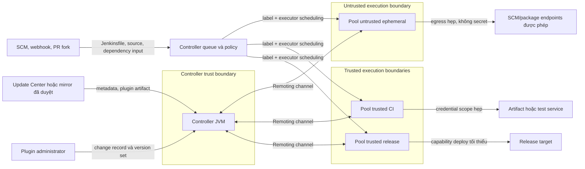

<Callout type="warn" title="Ranh giới của trang này">
  Agent, Shared Library và plugin đều có thể dẫn đến thực thi mã. Không chạy workload không tin cậy trên built-in node/controller, không tắt Groovy sandbox, không phê duyệt Script Approval theo một dòng lỗi, và không cài plugin từ nguồn không được phê duyệt.
</Callout>

Jenkins controller giữ cấu hình, plugin, credentials và quyền điều phối. Agent chạy source, dependency và lệnh build. Vì vậy, an toàn không đến từ một label, một checkbox sandbox hay một plugin manager riêng lẻ; nó đến từ các ranh giới được thiết kế cùng nhau, có evidence và có đường quay lui.

## Mục lục

- [Mục tiêu và nguyên tắc](#mục-tiêu-và-nguyên-tắc)
- [Bản đồ ranh giới tin cậy](#bản-đồ-ranh-giới-tin-cậy)
  - [Sơ đồ controller, agent và supply chain](#sơ-đồ-controller-agent-và-supply-chain)
  - [Label không phải authorization](#label-không-phải-authorization)
- [Chọn pool theo workload](#chọn-pool-theo-workload)
  - [Bảng quyết định workload, agent và capability](#bảng-quyết-định-workload-agent-và-capability)
  - [Static, ephemeral, container và VM](#static-ephemeral-container-và-vm)
  - [Executor, workspace, identity và network](#executor-workspace-identity-và-network)
  - [PR fork, Remoting và reconnect](#pr-fork-remoting-và-reconnect)
- [Script Security: sandbox không phải OS isolation](#script-security-sandbox-không-phải-os-isolation)
  - [Ba mức trust của code](#ba-mức-trust-của-code)
  - [Review Script Approval](#review-script-approval)
  - [CPS và thiết kế Pipeline an toàn](#cps-và-thiết-kế-pipeline-an-toàn)
- [Plugin là code đặc quyền trên controller](#plugin-là-code-đặc-quyền-trên-controller)
  - [Intake plugin dựa trên provenance](#intake-plugin-dựa-trên-provenance)
  - [Pin, dependency, staging và rollback](#pin-dependency-staging-và-rollback)
  - [Plugin health và advisory](#plugin-health-và-advisory)
- [Runbook advisory cho core và plugin](#runbook-advisory-cho-core-và-plugin)
  - [Triage và quyết định cô lập](#triage-và-quyết-định-cô-lập)
  - [Patch, xác minh và truyền thông](#patch-xác-minh-và-truyền-thông)
- [Lab local: đọc manifest plugin giả](#lab-local-đọc-manifest-plugin-giả)
  - [Điều kiện runtime và an toàn](#điều-kiện-runtime-và-an-toàn)
  - [Tạo và kiểm tra manifest không thực thi](#tạo-và-kiểm-tra-manifest-không-thực-thi)
  - [Cleanup có guard](#cleanup-có-guard)
- [Troubleshooting an toàn](#troubleshooting-an-toàn)
- [Checklist go-live](#checklist-go-live)
- [Tự kiểm tra](#tự-kiểm-tra)
- [Nguồn Jenkins chính thức](#nguồn-jenkins-chính-thức)
- [Đọc tiếp](#đọc-tiếp)

## Mục tiêu và nguyên tắc

Sau bài này, bạn có thể:

1. phân loại một workload thành `untrusted-pr`, `trusted-ci` hoặc `trusted-release`, rồi chọn pool, OS identity, credential scope và network egress tương ứng;
2. giải thích vì sao Pipeline Groovy sandbox, Script Approval, authorization và agent isolation là các lớp khác nhau;
3. review một plugin như dependency có khả năng chạy code trong Jenkins JVM, với version set, provenance, dependency graph, advisory và rollback evidence;
4. vận hành advisory theo chuỗi inventory → triage → staging → patch hoặc cô lập có phê duyệt → xác minh → post-incident review.

Nguyên tắc nền tảng là **deny by design**: nếu chưa biết workload có thể tin cậy, agent nào chạy nó, capability nào được inject hoặc đường network nào cần mở, build chưa sẵn sàng để chạy. Một job đứng trong queue vì không có pool phù hợp là tín hiệu thiết kế cần hoàn thiện, không phải lý do bật executor trên controller.

## Bản đồ ranh giới tin cậy

### Sơ đồ controller, agent và supply chain



Controller nhận input từ SCM và supply chain, nhưng không nên thực thi workload đó trên built-in node. Nó chỉ điều phối queue, giữ state và áp dụng policy. Remoting là kênh controller–agent hai chiều, nên agent đã bị chiếm hoặc kết nối sai identity là một security event cần triage, không chỉ là lỗi capacity.

Mermaid được repository cấu hình qua `MermaidDiagram`; khi tái sử dụng trang ở một Fumadocs khác, cần renderer Mermaid tương đương.

### Label không phải authorization

Label trả lời câu hỏi scheduler: *node nào có thể nhận allocation này?* Nó không trả lời *ai được phép sửa job*, *process nào đọc được workspace*, *agent đi được đến đâu*, hoặc *credential nào được phép dùng*.

Ví dụ `trusted-release` chỉ là thuộc tính routing. Người có `Job/Configure` có thể đổi label hoặc Jenkinsfile nếu authorization cho phép. Một host gắn label đó nhưng chia cùng OS user, Docker socket, cache ghi được hoặc egress rộng với PR pool vẫn không phải release boundary. Xem [Authorization & RBAC](/docs/security/authorization) để thiết kế permission, và [Labels & Executors](/docs/agents/labels-executors) để thiết kế scheduling.

## Chọn pool theo workload

### Bảng quyết định workload, agent và capability

Bảng này là policy review, không phải danh sách label để sao chép. Exact permission, credential type và network rule phải được kiểm chứng trên Jenkins core, plugin, OS/container runtime và hệ thống đích đang chạy.

| Workload | Agent/lifecycle phù hợp | Trust và credential | Network/OS/filesystem | Không được suy ra |
| --- | --- | --- | --- | --- |
| PR fork, Jenkinsfile hoặc dependency chưa review | Pool ephemeral riêng; container không privileged hoặc VM disposable theo rủi ro | `untrusted-pr`; không inject credential deploy, registry write hay token nội bộ | OS identity riêng, workspace/cache không chia ghi với tier khác, egress allowlist tối thiểu | Label `untrusted-pr` tự ngăn exfiltration hoặc sandbox tự chặn shell/network |
| CI branch nội bộ đã review | Pool static đã vá hoặc ephemeral CI; toolchain image đã chứng minh provenance | `trusted-ci`; chỉ credential read/use cần cho stage ngắn | User service tối thiểu, cache phân vùng theo project/tier, access tới SCM/artifact/test service cần thiết | Source nội bộ không có dependency độc hại hoặc workspace là private boundary |
| Build/release đã được phê duyệt | Pool hoặc VM release riêng, có drain và canary | `trusted-release`; capability deploy scope nhỏ nhất, owner và expiry rõ | Identity deploy riêng, network chỉ đến release target, storage/artifact ACL và retention rõ | Label release là authorization hoặc approval thay credential/system permission |
| Quản trị plugin/core | Controller qua change control, không phải Pipeline agent | Nhóm admin nhỏ, có backup và separation of duties | Controller host/JENKINS_HOME, mirror và audit route đã được phê duyệt | Plugin có thể được cài từ artifact gửi qua chat hoặc từ job build |

Credential scope phải khớp cả **workload** lẫn **agent**. Một credential scoped đúng folder vẫn thành rủi ro nếu job có thể bị PR không tin cậy sửa để nạp nó, hoặc nếu agent có process/workspace dùng chung. Hướng dẫn scope và binding nằm ở [Credentials & Secrets](/docs/security/credentials-secrets).

### Static, ephemeral, container và VM

**Static/permanent agent** giữ host, work directory và thường cả cache sau build. Nó phù hợp với hardware hoặc toolchain chuyên biệt, nhưng đòi hỏi patch OS/Java, quản lý drift, quota, ownership, wipe/retention và quy trình retire. Chỉ dùng nó cho workload có trust tier ổn định; không luân phiên PR fork và release trên cùng static host để giảm queue.

**Ephemeral agent** được tạo cho một allocation hoặc một khoảng ngắn rồi thu hồi. Lifecycle ngắn giảm dữ liệu tồn dư và giúp rebuild từ image/template, nhưng không tự mạnh hơn nếu template có Docker socket, `hostPath`, privileged mode, IAM rộng hoặc egress toàn mạng. Ghi rõ owner template, image digest, quota, provision timeout và bước dọn sau failure.

**Container** chuẩn hóa toolchain, không mặc định là security boundary. Container chạy root, privileged, dùng host network, mount host filesystem hay nói chuyện với Docker daemon có thể trao quyền host/cluster. **VM** thường là boundary mạnh hơn container thông thường vì tách kernel và disk, nhưng vẫn cần hardening, patch, IAM, DNS/TLS, network segmentation và cleanup. Chọn theo blast radius của workload, không chỉ theo thời gian khởi động.

Image là input thực thi. Dùng reference bất biến đã review, registry/mirror được phê duyệt, SBOM/scan theo policy và provenance có thể truy vết. Một tag có version vẫn cần được resolve thành digest/manifest đã review khi yêu cầu tái lập cao; không dùng tag di động cho pool tin cậy.

### Executor, workspace, identity và network

Executor là slot scheduler, không phải VM, CPU core hay security boundary. Hai executors trên cùng host có thể cùng tranh CPU/RAM/disk và cùng thấy tài nguyên mà OS identity của chúng được phép đọc. Giảm số executor không thay thế user/namespace/VM separation.

Thiết kế mỗi pool bằng bốn câu hỏi:

1. **Identity nào chạy process?** Dùng service account riêng, không phải root/Administrator hoặc account cá nhân. Quyền ghi chỉ vào agent root, workspace và cache đã chỉ định.
2. **Dữ liệu nào tồn tại sau build?** Workspace, cache, artifact, console output và file tạm đều có owner, retention và cleanup. Không archive/glob toàn workspace khi có credential hoặc output từ source không tin cậy.
3. **Network nào thực sự cần?** Egress chỉ tới SCM, package registry, artifact store hoặc test/release endpoint đã duyệt. Không dùng network host hoặc allow-all để chữa một dependency fail.
4. **Capability nào được inject?** Credential được nạp ở closure/stage ngắn nhất trên pool tin cậy. Masking log chỉ giảm lộ tình cờ, không ngăn code đã nhận secret đọc hoặc gửi nó đi.

Khi static agent bị reimage, hỏng hoặc đổi trust tier, dọn workspace/cache theo policy trước khi phục vụ lại. Khi ephemeral agent chết giữa build, giả định cleanup có thể chưa hoàn tất và kết quả/credential runtime cần được đánh giá theo loại workload. Đừng coi xóa container là bằng chứng mọi volume, cache hay artifact đã biến mất.

### PR fork, Remoting và reconnect

PR fork và contributor-controlled source là input không tin cậy, kể cả khi chỉ chạy test. Chúng không được chạy với release credential, Docker socket, privileged mount, kubeconfig đặc quyền, workspace/cache release hoặc route mạng production. Cấu hình SCM/Multibranch quyết định chi tiết trigger và trust của fork theo provider/plugin; kiểm tra behavior trên sandbox cùng plugin set thay vì suy luận từ Jenkinsfile.

Jenkins agent dùng **Remoting** và `agent.jar` để thiết lập channel với controller. Inbound/WebSocket mô tả chiều kết nối, không phải trust level: agent vẫn cần xác minh URL controller canonical, TLS/CA, node identity/secret, Java compatibility, firewall/proxy và remote work directory. Agent reconnect chỉ cho biết channel có thể trở lại; nó không chứng minh build bị gián đoạn đã an toàn, workspace còn đúng, image không drift hay credential không lộ.

Khi reconnect lặp lại, ghi timestamp, node, transport, Java/runtime, DNS/TLS/proxy signal, resource saturation và thay đổi plugin/config gần đó. Sửa nguyên nhân rồi chạy canary không credential. Không tăng retry vô hạn, không mở TCP listener không dùng và không chuyển build sang controller. Đọc [Inbound Agents](/docs/agents/inbound-agents) và [Tổng quan Jenkins Agent](/docs/agents/overview) để thiết kế transport/lifecycle.

## Script Security: sandbox không phải OS isolation

### Ba mức trust của code

| Nguồn code | Cách Jenkins xử lý | Control chính | Nó không bảo vệ |
| --- | --- | --- | --- |
| Jenkinsfile/Pipeline Groovy untrusted | Groovy sandbox giới hạn method, constructor và field được gọi | SCM review, sandbox, Script Approval review, authorization, agent pool không tin cậy | OS, workspace, process con, network egress hoặc secret đã đưa vào agent |
| Trusted Global Shared Library | Code library chạy ngoài sandbox với capability cao hơn | Quyền ghi SCM, quyền cấu hình global library, revision pin, review độc lập, API hẹp | Mọi caller, input hoặc shell action tự động an toàn |
| Java plugin | Code chạy trong Jenkins controller JVM với capability của plugin/controller | Plugin intake, provenance, dependency/advisory, version policy, staging, rollback | Plugin code tự bị Groovy sandbox giới hạn |

`vars/` không phải boundary. Cùng một file `vars/*.groovy` có thể privileged khi nằm trong trusted global library hoặc chịu sandbox khi library untrusted/folder-level. Trust đến từ cấu hình library, scope và người được phép thay đổi source/retriever, không đến từ tên thư mục. Đọc [Thiết kế Jenkins Shared Libraries](/docs/advanced/shared-library-design) trước khi mở rộng library capability.

### Review Script Approval

Khi thấy `Scripts not permitted to use ...`, đừng coi signature trong log là một yêu cầu thao tác. Quy trình review an toàn:

1. **Truy vết nguồn:** xác định Jenkinsfile, library, revision SCM, job/folder và user/change đã đưa lời gọi vào build.
2. **Hiểu capability:** đọc API/method thực sự bị chặn, receiver/argument có thể là gì và tác động lên ACL, filesystem, controller hay dữ liệu build.
3. **Tìm phương án hẹp hơn:** ưu tiên API sandbox-safe, dữ liệu đơn giản hoặc redesign library API. Không dùng `evaluate`, reflection, dynamic class loading hay shell từ input để né sandbox.
4. **Đánh giá caller:** approval có thể làm signature dùng được cho nhiều script sandbox. Với API ACL-aware, review quyền caller và khả năng signature làm bỏ qua ACL theo semantics runtime.
5. **Quyết định có owner:** nếu vẫn cần approval, ghi lý do, scope, reviewer, ngày review lại và rollback. Nếu không chứng minh được an toàn, từ chối.

Không phê duyệt method rộng chỉ vì nó làm build xanh, không phê duyệt theo copy/paste từ Internet, và không tắt sandbox toàn cục. Script Approval là allowlist trên controller; nó không phải authorization cho người dùng/job, cũng không phải cách cô lập process trên agent.

<Callout type="error" title="Sandbox không tự bảo vệ secret hoặc network">
  Pipeline sandbox không chặn một `sh` hợp lệ gửi dữ liệu qua egress mà agent được phép dùng. Nó cũng không làm credential đã inject trở nên không thể đọc bởi code trong stage. Secret scope, trust của SCM, OS identity, workspace/cache và network policy phải được thiết kế riêng.
</Callout>

### CPS và thiết kế Pipeline an toàn

Pipeline Groovy dùng CPS để có thể checkpoint và tiếp tục sau restart. Dữ liệu sống qua `sh`, `sleep`, `input` hoặc Pipeline step khác cần serializable. Giữ `String`, number, boolean, `List`/`Map` đơn giản; không giữ socket, stream, `File`, matcher, iterator, thread hay object plugin qua checkpoint.

`@NonCPS` chỉ phù hợp cho hàm Groovy thuần, ngắn và đồng bộ. Nó không được gọi Pipeline step, làm I/O lâu hoặc xử lý secret. Đừng dùng `@NonCPS`, giảm durability hay tắt sandbox để che `NotSerializableException` hoặc CPS mismatch; tách dữ liệu đơn giản và giữ side effect trong Pipeline step có thể quan sát.

Ví dụ Jenkinsfile lab này route tới pool sandbox, không checkout SCM, không dùng credential và không thực hiện network call:

```groovy
pipeline {
  agent none

  options {
    skipDefaultCheckout(true)
    timeout(time: 2, unit: 'MINUTES')
  }

  stages {
    stage('Quan sát pool sandbox') {
      agent { label 'linux && ci-sandbox && !trusted-release' }
      steps {
        script {
          def checks = ['unit', 'lint']
          echo "checks=${checks.join(',')}"
        }
        sh '''
          set -eu
          printf 'node=%s\n' "$NODE_NAME"
          printf 'workspace-present=%s\n' "${WORKSPACE:+yes}"
        '''
      }
    }
  }
}
```

Nếu label không có agent phù hợp, để build chờ queue và sửa pool lab. Không đổi thành `agent any`, không bật executor controller và không tạo approval để ép ví dụ chạy. Chi tiết CPS, library trust và troubleshooting Groovy có tại [Groovy trong Jenkins Pipeline](/docs/advanced/groovy).

## Plugin là code đặc quyền trên controller

### Intake plugin dựa trên provenance

Cài plugin là đưa code và dependency vào Jenkins controller JVM. Vì vậy, một plugin intake cần trả lời được: capability nào chưa có trong core/plugin set hiện tại, ai sở hữu nó, artifact đến từ đâu, graph dependency thay đổi thế nào và nếu lỗi thì quay lui ra sao.

| Bước intake | Evidence cần giữ | Quyết định an toàn |
| --- | --- | --- |
| Xác định nhu cầu | Use case, owner, controller scope, alternative core/plugin đã có | Không cài plugin trùng chức năng chỉ vì UI tiện |
| Kiểm tra nguồn | Update Center chính thức hoặc mirror đã phê duyệt, metadata snapshot, provenance/integrity theo khả năng nguồn | Không sideload `.hpi`/`.jpi` từ chat, USB, job artifact hoặc host khác |
| Kiểm tra chất lượng | Maintainer, release activity, documentation, adoption và health score trên Jenkins Plugins | Health/adoption là tín hiệu, không phải chứng nhận security |
| Phân tích graph | `shortName:version` hiện tại/đích, `requiredCore`, Java, direct/transitive dependency và consumer | Không nâng một dependency riêng để ép plugin cũ hoạt động |
| Review security | Advisory, version bị ảnh hưởng/sửa, exposure, exploitability và compensating control có expiry | Không bỏ qua advisory vì Pipeline hiện vẫn xanh |
| Staging/approval | Controller cô lập, version set đã resolve, smoke test, backup ID, rollback owner | Không ghép plugin, core, realm và thay đổi policy lớn vào một wave |

Update Center/mirror giúp phân phối metadata và artifact; nó không thay thế review compatibility. Checksum, signature hoặc provenance khi nguồn cung cấp giúp đánh giá integrity/origin, nhưng không chứng minh plugin phù hợp với Jenkins core, Java, Pipeline, agent launcher hoặc dữ liệu controller của bạn.

### Pin, dependency, staging và rollback

Dùng manifest hoặc lock record chứa exact `shortName:version`, trạng thái enable/disable/pin, Jenkins core, Java, image/package digest, source/mirror snapshot và resolved dependency set. Không dùng alias version di động. Pin trong Plugin Manager chỉ hỗ trợ freeze ngắn hạn ở UI; nó không thay thế manifest version-controlled, không giải quyết dependency graph và không miễn advisory review.

Mỗi thay đổi phải qua controller staging tách biệt, cùng baseline core/Java/deployment mode ở mức có ý nghĩa. Test ít nhất startup/plugin load, queue, một agent reconnect, Pipeline smoke, Shared Library nếu dùng, credential binding staging không in giá trị và integration webhook/endpoint sandbox. Backup trước change phải nhất quán và restore path đã được kiểm tra; không cho baseline/candidate cùng ghi một `JENKINS_HOME`.

**Disable** là lựa chọn cô lập đầu tiên: Jenkins không tải plugin sau restart nhưng artifact/config có thể còn. **Remove** không bảo đảm xóa config, history hoặc data migration. Nếu candidate đã migrate data hoặc controller không boot, restore baseline vào home/volume mới theo runbook thay vì chép lẻ file plugin, credential XML hay key giữa các generation.

### Plugin health và advisory

Theo dõi advisory Jenkins cho cả core lẫn plugin. Với mỗi advisory, ghép plugin `shortName:version` trong inventory với affected/fixed range do nguồn chính thức công bố. Sau đó đánh giá exposure thực tế: endpoint/capability có được bật không, actor cần quyền gì, controller có public/agent/network surface nào liên quan, và control nào đang giảm rủi ro.

Không suy ra plugin “an toàn” chỉ từ health score, số lượt cài, icon xanh hoặc không có update UI hôm nay. Các tín hiệu này bổ sung cho advisory, dependency, compatibility, runtime test và ownership. Quy trình toàn diện nằm ở [Quản lý Jenkins plugins](/docs/administration/plugin-management).

## Runbook advisory cho core và plugin

### Triage và quyết định cô lập

1. **Mở record incident/change.** Ghi advisory URL/ID, thời điểm phát hiện, owner, controller scope và hạn xử lý. Không thêm secret, token, URL nội bộ nhạy cảm, memory dump hoặc proof-of-concept khai thác công khai vào record.
2. **Lập inventory.** Xuất `shortName:version`, core, Java, enabled/disabled state, source/mirror, dependency set và owner. Bảo vệ export vì config/log có thể nhạy cảm.
3. **So khớp advisory.** Xác định affected/fixed version theo advisory chính thức, rồi kiểm tra capability bị ảnh hưởng có đang exposed và actor nào có thể đạt điều kiện khai thác.
4. **Phân loại rủi ro.** Ghi exploitability, blast radius, credential/agent/controller impact và compensating controls. Không hạ mức độ chỉ vì chưa thấy exploit.
5. **Chọn action có phê duyệt.** Patch theo version set đã test là ưu tiên. Nếu chưa thể patch, chỉ disable/cô lập plugin/capability khi consumer impact, dependency, backup và rollback đã được owner phê duyệt. Không tự disable plugin production giữa incident chỉ để “an toàn hơn”.

Một advisory có thể cần thay core, plugin hoặc dependency. Không giả định version sửa được chỉ định cho một controller sẽ tương thích controller khác; `requiredCore`, Java, plugin graph và runtime integration quyết định candidate cuối.

### Patch, xác minh và truyền thông

1. **Resolve candidate ở staging.** Tạo version set cụ thể từ nguồn đã duyệt, kiểm tra graph và advisory coverage. Không dùng update-all để lẫn thay đổi không liên quan.
2. **Backup và change window.** Xác minh backup ID, restore drill, restart owner, queue/build handling và rollback criteria trước rollout.
3. **Rollout theo wave nhỏ.** Cài candidate đã phê duyệt, restart có kiểm soát khi cần, theo dõi startup/dependency error và plugin state. Không thử version ngẫu nhiên trên production.
4. **Xác minh hành vi.** Chạy smoke test trên agent sandbox: controller health, node/Remoting reconnect, Pipeline/Shared Library, credential binding staging không lộ secret và integration sandbox. Lưu timestamp, version set, build result và log đã redact.
5. **Truyền thông.** Thông báo owner workload, security/platform/on-call về impact, thời gian, action, rollback state và việc họ cần làm. Không công bố secret hoặc chi tiết khai thác chưa được điều phối.
6. **Đóng và học lại.** Cập nhật inventory/SBOM, advisory status, evidence, exception expiry và follow-up như giảm plugin set, cải thiện mirror, coverage test hoặc network isolation. Làm post-incident review nếu có exploit, outage hoặc rủi ro đáng kể.

## Lab local: đọc manifest plugin giả

### Điều kiện runtime và an toàn

Lab chỉ tạo và đọc một manifest **giả** trên máy local; không có plugin Jenkins thật, không tải artifact, không gọi network, không chạy Jenkins CLI, không tạo credential và không đổi Script Approval/sandbox. Cần shell POSIX có `mktemp`, `awk`, `sort` và `rm`. Nếu dùng Jenkins sandbox bổ sung, runtime còn cần Jenkins LTS, Java/plugin set, agent/container runtime và OS tương ứng; lab tĩnh này không chứng minh các dependency đó tương thích.

Manifest dùng package names giả `training-*` và exact version để luyện inventory format, không phải danh sách plugin để cài. Không thay chúng bằng identifier hay version từ production trong tài liệu/evidence công khai.

### Tạo và kiểm tra manifest không thực thi

```bash
set -eu
umask 077
LAB_PARENT="${TMPDIR:-/tmp}"
LAB_PREFIX='jenkins-agent-plugin-manifest.'
LAB_DIR="$(mktemp -d "${LAB_PARENT}/${LAB_PREFIX}XXXXXX")"
LAB_MARKER="$LAB_DIR/.lab-owned-marker"

case "$LAB_DIR" in
  "$LAB_PARENT"/"$LAB_PREFIX"*) ;;
  *) printf 'Refuse unexpected lab path: %s\n' "$LAB_DIR" >&2; exit 1 ;;
esac
[ "$(dirname -- "$LAB_DIR")" = "$LAB_PARENT" ] || {
  printf 'Refuse non-child lab path.\n' >&2; exit 1;
}

printf '%s\n' 'jenkins-agent-plugin-manifest-v1' > "$LAB_MARKER"
cat > "$LAB_DIR/plugins.lock" <<'EOF'
# Fake training inventory: non-executable and no download URL.
training-scm:1.2.3
training-pipeline:4.5.6
training-agent-launcher:7.8.9
EOF

awk -F: '
  /^[[:space:]]*#/ || NF == 0 { next }
  NF != 2 || $1 !~ /^training-[a-z-]+$/ || $2 !~ /^[0-9]+\.[0-9]+\.[0-9]+$/ { exit 1 }
  { print $1 ":" $2 }
' "$LAB_DIR/plugins.lock" > "$LAB_DIR/validated.lock"
sort "$LAB_DIR/validated.lock"
printf 'Manifest inspected at %s; no plugin was installed.\n' "$LAB_DIR/plugins.lock"
```

Kết quả mong đợi là ba dòng `training-*:x.y.z` đã sắp xếp và một path dưới thư mục tạm. Lệnh chỉ đọc manifest vừa tạo; nó không truyền manifest vào `jenkins-plugin-cli`, Docker, Jenkins controller hay Update Center. Nếu format validation fail, dừng lab và sửa dữ liệu giả; không thay bằng plugin production.

### Cleanup có guard

Chạy cleanup trong **cùng shell** sau khi đã lưu evidence cần thiết. Guard kiểm tra parent, prefix, quan hệ child trực tiếp và marker trước khi xóa đúng directory do `mktemp` tạo. Nó không có wildcard xóa dữ liệu ngoài lab.

```bash
case "${LAB_DIR:-}" in
  "${LAB_PARENT:-/tmp}"/"${LAB_PREFIX:-jenkins-agent-plugin-manifest.}"*) ;;
  *) printf 'Refuse cleanup: unexpected lab directory.\n' >&2; exit 1 ;;
esac

if [ "${LAB_PARENT:-}" != "${TMPDIR:-/tmp}" ] || \
   [ "$(dirname -- "$LAB_DIR")" != "$LAB_PARENT" ] || \
   [ ! -f "${LAB_MARKER:-}" ] || \
   [ "$(cat -- "$LAB_MARKER")" != 'jenkins-agent-plugin-manifest-v1' ]; then
  printf 'Refuse cleanup: parent or marker guard failed.\n' >&2
  exit 1
fi

cd / || exit 1
rm -rf -- "$LAB_DIR"
printf 'Lab cleanup completed.\n'
```

Không dùng cleanup này cho `JENKINS_HOME`, workspace, volume, cache, agent root hay bất kỳ path do người dùng nhập. Nếu không chắc directory còn là lab vừa tạo, không chạy cleanup.

## Troubleshooting an toàn

| Tình huống | Evidence cần kiểm tra | Hành động an toàn | Không làm |
| --- | --- | --- | --- |
| Build PR chờ queue | Label expression, node state, executor và policy pool untrusted | Provision/sửa đúng pool sandbox hoặc để queue chờ | Chạy trên controller hay release pool |
| PR có thể đọc cache/secret | OS identity, mounts, cache key/owner, credential binding và egress | Cô lập pool/cache, dừng cấp credential, rotate nếu có dấu hiệu lộ | Tin rằng label hoặc log masking đủ bảo vệ |
| Agent flap/reconnect | Node/service log, DNS/TLS/proxy, Java, disk/RAM, transport và thay đổi gần đây | Khoanh vùng, sửa nguyên nhân, chạy canary không credential | Mở port/disable TLS/tăng retry vô hạn |
| `Scripts not permitted` | Jenkinsfile/library revision, signature, ACL impact và trusted status | Redesign sandbox-safe hoặc review approval có owner | Approve mù hoặc tắt sandbox |
| `NotSerializableException` | Object sống qua Pipeline step/checkpoint | Chuyển về dữ liệu đơn giản, tách hàm thuần | Dùng `@NonCPS` cho I/O hoặc giảm durability |
| Plugin update không resolve | `requiredCore`, Java, graph, source/mirror, advisory và disk | Quay về staging matrix/manifest đã review | Upload artifact không rõ nguồn hoặc bypass TLS |
| Controller boot fail sau wave | Startup log đã redact, candidate set, migration, backup ID | Dừng rollout, giữ evidence, disable có kiểm soát hoặc restore baseline | Xóa toàn bộ plugins hay trộn credential/key generation |
| Advisory chưa có patch phù hợp | Affected range, exposure, consumer/dependency impact và workaround chính thức | Escalate owner, compensating control có expiry hoặc disable đã duyệt | Công bố secret/PoC hoặc bỏ qua vô thời hạn |

## Checklist go-live

### Agent và workload

- [ ] Built-in node/controller có `0` executor cho workload production; source không tin cậy không chạy trên controller.
- [ ] Mỗi workload có trust tier, pool, lifecycle, OS identity, workspace/cache policy, credential scope, egress rule và owner rõ ràng.
- [ ] PR/fork không dùng chung host/VM, OS user, writable cache, Docker socket, privileged mount, credential release hoặc network production với tier tin cậy.
- [ ] Static agent có patch/drift/cleanup/retire process; ephemeral template có image provenance, quota, retention và xử lý failure/crash.
- [ ] Container/VM boundary được đánh giá theo mount, capability, root user, daemon, IAM và network; không chỉ theo label/type.
- [ ] Remoting URL, TLS/CA, node identity, Java, proxy/firewall, reconnect observability và canary đã được kiểm tra trên runtime thật.

### Groovy, Shared Library và authorization

- [ ] Label được dùng cho scheduling, không bị mô tả như ACL, credential boundary, approval hay network control.
- [ ] Jenkinsfile untrusted giữ sandbox; Script Approval có code/API/ACL review, owner, evidence và rollback.
- [ ] Trusted Global Shared Library có revision pin, protected SCM, quyền ghi/cấu hình hẹp và API privileged tối thiểu.
- [ ] CPS state serializable; `@NonCPS` chỉ xử lý logic thuần và không gọi Pipeline step.
- [ ] Sandbox không bị coi là cơ chế tự bảo vệ OS, process, network, artifact, workspace hay secret.

### Plugin và advisory

- [ ] Plugin set tối thiểu; mỗi plugin có business owner, `shortName:version`, source/mirror, dependency graph, consumer và advisory status.
- [ ] Intake kiểm tra provenance/integrity khi có, maintainer/health/adoption, `requiredCore`, Java, compatibility và release notes.
- [ ] Version set/lock không dùng alias di động; dependency resolved set, staging result, backup ID và rollback owner có thể truy vết.
- [ ] Update theo wave nhỏ, có restart plan và smoke test controller/agent/Pipeline/integration sandbox; không chọn update-all để xử lý một advisory.
- [ ] Disable/remove/restore được phân biệt; data migration, consumer impact và backup generation được đánh giá trước action.
- [ ] Advisory workflow có inventory, triage affected/fixed version, exposure, compensating control expiry, communication và post-incident review.

## Tự kiểm tra

1. Vì sao `agent { label 'trusted-release' }` không đủ để ngăn một PR fork lấy secret deploy?
   - Label chỉ chọn node. Cần tách SCM trust, quyền sửa job, agent/OS identity, credential scope, workspace/cache và network egress.
2. Pipeline Groovy sandbox có làm `sh` trên agent không thể gửi dữ liệu qua network không?
   - Không. Sandbox không thay OS/network isolation. Egress policy và không inject secret vào workload không tin cậy mới giảm capability đó.
3. Khi build báo một signature bị chặn, thao tác đầu tiên là gì?
   - Truy vết code/revision/library gọi API và đánh giá capability/ACL; không approve signature hoặc tắt sandbox để bỏ lỗi.
4. Tại sao plugin cần staging dù đến từ Update Center hoặc mirror được phê duyệt?
   - Provenance/integrity không chứng minh compatibility với core, Java, dependency graph, Pipeline, agent hay migration data của controller.
5. Khi advisory chưa thể patch ngay, vì sao không nên tự remove plugin lập tức?
   - Consumer/dependency và migration có thể làm controller hoặc Pipeline lỗi. Đánh giá exposure, backup, rollback và action cô lập đã được phê duyệt trước.

## Nguồn Jenkins chính thức

- [Controller Isolation](https://www.jenkins.io/doc/book/security/controller-isolation/) — tách controller khỏi workload build và built-in node.
- [Using Jenkins Agents](https://www.jenkins.io/doc/book/using/using-agents/) — agent, executor, workspace và distributed builds.
- [Jenkins Remoting](https://www.jenkins.io/doc/book/managing/remoting/) — giao tiếp controller–agent và `agent.jar`.
- [Configure Global Security: Agents](https://www.jenkins.io/doc/book/system-administration/security-configure-global-security/#agents) — transport agent, TCP listener và WebSocket theo controller.
- [Securing Pipelines](https://www.jenkins.io/doc/book/security/securing-pipelines/) — trust của Jenkinsfile, SCM và credentials trong Pipeline.
- [In-process Script Approval](https://www.jenkins.io/doc/book/managing/script-approval/) — Script Security và review approval.
- [Pipeline Shared Groovy Libraries](https://www.jenkins.io/doc/book/pipeline/shared-libraries/) — trusted/untrusted global và folder library.
- [Pipeline CPS Method Mismatches](https://www.jenkins.io/doc/book/pipeline/cps-method-mismatches/) — CPS, serialization và `@NonCPS`.
- [Managing Plugins](https://www.jenkins.io/doc/book/managing/plugins/) — Plugin Manager, Update Center, dependencies và lifecycle.
- [Jenkins Plugins](https://plugins.jenkins.io/) — metadata plugin, maintainer, health và compatibility information.
- [Jenkins Security Advisories](https://www.jenkins.io/security/advisories/) — advisory Jenkins core và plugin.
- [Jenkins Plugin Installation Manager Tool](https://github.com/jenkinsci/plugin-installation-manager-tool) — manifest/version resolution cho quy trình plugin tái lập.

## Đọc tiếp

<Cards>
  <Card title="Mô hình bảo mật Jenkins" href="/docs/security/security-model" description="Lập threat model cho controller, agent, plugin, credentials và trust boundary." />
  <Card title="Authorization & RBAC" href="/docs/security/authorization" description="Thiết kế permission tối thiểu thay vì dùng label hoặc sandbox làm ACL." />
  <Card title="Credentials & Secrets" href="/docs/security/credentials-secrets" description="Thu hẹp credential scope, binding và blast radius của agent." />
  <Card title="Tổng quan Jenkins Agent" href="/docs/agents/overview" description="Thiết kế lifecycle, capacity, workspace và pool agent." />
  <Card title="Inbound Agents" href="/docs/agents/inbound-agents" description="Vận hành Remoting, WebSocket, TLS và reconnect an toàn." />
  <Card title="Groovy trong Jenkins Pipeline" href="/docs/advanced/groovy" description="Đào sâu sandbox, Script Approval và CPS." />
  <Card title="Quản lý Jenkins plugins" href="/docs/administration/plugin-management" description="Quản lý provenance, version set, staging và rollback plugin." />
</Cards>
