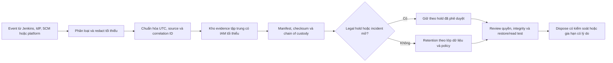

<Callout type="warn" title="Phạm vi và giới hạn">
  Trang này là khung kỹ thuật để thu thập bằng chứng Jenkins, không phải chứng nhận tuân thủ. Thời hạn lưu, legal hold, quy tắc định danh cá nhân và tiêu chuẩn chấp nhận phải do pháp chế, security, records-management và owner dịch vụ của tổ chức quyết định. Xác minh trên runtime Jenkins/plugin đang chạy trước khi dựa vào bất kỳ event hoặc export nào.
</Callout>

Audit có ích khi trả lời được: **ai** đã làm **gì**, **khi nào**, từ **nguồn nào**, đối tượng nào bị tác động, bằng chứng ở đâu và ai bảo quản nó. Jenkins có Console Output, System Log và dữ liệu cấu hình; các nguồn đó rất quan trọng để vận hành nhưng không tự tạo một audit trail đầy đủ, bất biến hay tập trung. Bài này xây dựng chuỗi evidence có thể review mà không đưa secret, `JENKINS_HOME` hay log production vào lab.

## Mục lục

- [Mục tiêu và ranh giới](#mục-tiêu-và-ranh-giới)
- [Audit trail: sự kiện cần chứng minh](#audit-trail-sự-kiện-cần-chứng-minh)
  - [Phân biệt log vận hành với audit event](#phân-biệt-log-vận-hành-với-audit-event)
  - [Trường event, redaction và tính toàn vẹn](#trường-event-redaction-và-tính-toàn-vẹn)
  - [Core và plugin không phải cùng một bảo đảm](#core-và-plugin-không-phải-cùng-một-bảo-đảm)
- [Lịch sử cấu hình và provenance](#lịch-sử-cấu-hình-và-provenance)
  - [Git, JCasC và thay đổi job](#git-jcasc-và-thay-đổi-job)
  - [Diff, rollback và giới hạn filesystem](#diff-rollback-và-giới-hạn-filesystem)
- [Access review và vòng đời identity](#access-review-và-vòng-đời-identity)
  - [Inventory và tái chứng nhận](#inventory-và-tái-chứng-nhận)
  - [Joiner, mover, leaver và ngoại lệ](#joiner-mover-leaver-và-ngoại-lệ)
- [Evidence retention và khả năng phục hồi](#evidence-retention-và-khả-năng-phục-hồi)
  - [Vòng đời evidence](#vòng-đời-evidence)
  - [Control, evidence, owner và retention](#control-evidence-owner-và-retention)
  - [Integrity, kho ngoài và restore test](#integrity-kho-ngoài-và-restore-test)
- [Manifest evidence đã redaction](#manifest-evidence-đã-redaction)
- [Runbook review và incident export](#runbook-review-và-incident-export)
  - [Review định kỳ](#review-định-kỳ)
  - [Xuất evidence cho incident](#xuất-evidence-cho-incident)
- [Lab local chỉ tạo dữ liệu vô hại](#lab-local-chỉ-tạo-dữ-liệu-vô-hại)
  - [Tạo event, manifest và checksum](#tạo-event-manifest-và-checksum)
  - [Kiểm tra redaction và worksheet retention](#kiểm-tra-redaction-và-worksheet-retention)
  - [Cleanup có guard](#cleanup-có-guard)
- [Troubleshooting](#troubleshooting)
- [Checklist và tự kiểm tra](#checklist-và-tự-kiểm-tra)
- [Nguồn chính thức](#nguồn-chính-thức)
- [Đọc tiếp](#đọc-tiếp)

## Mục tiêu và ranh giới

Sau bài này, bạn có thể lập một evidence plan cho Jenkins: phân loại event cần audit, nối event với identity và thay đổi cấu hình, giao owner review, bảo vệ retention/integrity, rồi diễn tập xuất tập evidence tối thiểu đã redaction. Kế hoạch này phải chạy song song với policy của tổ chức; không có một khoảng retention, plugin hay thao tác Jenkins nào tự đáp ứng một framework compliance cụ thể.

Bốn ranh giới cần giữ rõ:

| Khái niệm | Nó trả lời | Không tự chứng minh |
| --- | --- | --- |
| Audit trail | Ai thực hiện action nào, vào lúc nào, trên resource nào | Mọi event đều được Jenkins core ghi, bất biến hoặc đã gửi ra kho tập trung. |
| Build/System log | Code build hoặc controller/plugin đã quan sát gì | Người dùng nào được ủy quyền cho mọi action hay một thay đổi đã được phê duyệt. |
| Configuration history | Desired state và diff cấu hình qua thời gian | File/config không thể bị sửa bởi filesystem administrator. |
| Backup/restore | Khả năng phục hồi data theo RPO/RTO | Chuỗi custody của một audit event hoặc retention pháp lý. |

Time phải so sánh được giữa controller, agent, proxy, IdP và kho evidence. Dùng UTC làm chuẩn, đồng bộ clock bằng NTP hoặc dịch vụ tương đương, và ghi timezone/offset khi export. Timezone hiển thị trong UI không sửa clock; chi tiết vận hành nằm ở [Cấu hình hệ thống Jenkins](/docs/administration/system-configuration).

## Audit trail: sự kiện cần chứng minh

### Phân biệt log vận hành với audit event

**Console Output** kể command/stage của một build. **System Log Recorder** quan sát Java logging trên controller. Log service, agent và reverse proxy giải thích process hoặc transport. Những nguồn này phục vụ chẩn đoán, nhưng không phải lời hứa rằng chúng tạo audit record cho mọi lần đăng nhập, grant quyền hay đổi credential. Xem [Logs & Diagnostics](/docs/administration/logs) để chọn đúng nguồn khi điều tra lỗi.

Một audit event hướng đến accountability. Với mỗi loại action, xác định producer, nơi lưu, ai có thể đọc/xóa và cách nối event với change hoặc incident.

| Event cần theo dõi | Ví dụ câu hỏi | Evidence tối thiểu cần liên kết | Lưu ý |
| --- | --- | --- | --- |
| Login, logout, failure, token/session bất thường | Identity nào đăng nhập thất bại hoặc thành công? | actor/ref IdP, thời gian UTC, source/IP đã được policy cho phép, outcome, request/correlation ID | Không ghi cookie, token, header `Authorization` hoặc password. |
| Permission, group, role, folder policy | Ai cấp/thu hồi quyền nào ở scope nào? | requester, approver, actor thực hiện, principal/group, permission, folder/job scope, change ID | Security realm và authorization strategy cần evidence riêng. |
| Controller/JCasC/global configuration | Cấu hình nào đổi và release nào đã apply? | Git revision, diff đã redact, schema/plugin/core version, approver, thời gian apply, export/hash trước-sau | UI save hoặc reload chỉ là một phần của provenance. |
| Credential metadata | Ai tạo, đổi scope, rotate hay revoke credential ID? | credential ID không nhạy cảm, store scope, owner, action, ticket, timestamp | Không export credential value, encrypted XML hoặc file `secrets/`. |
| Job/folder/Pipeline | Ai đổi definition, trigger, SCM hoặc agent label? | job full name, revision/diff, actor, build/change ID, timestamp | Jenkinsfile revision và job config có thể là hai nguồn khác nhau. |
| Plugin/core deployment | Plugin nào thay version, source và dependency nào đổi? | `shortName:version`, resolved set, advisory/change ID, approver, restart/result | Plugin là code trên controller; UI inventory không thay supply-chain record. |
| Build/deploy | Ai/what triggered run nào và release nào được triển khai? | job/build URL hoặc opaque ref, revision, result, executor/agent tier, deployment approval/reference | Build success không tự chứng minh action được ủy quyền. |

`request_id` hoặc `correlation_id` không nhất thiết do Jenkins core sinh ra. Nó có thể đến từ reverse proxy, IdP, ticket hoặc workflow ngoài. Nếu có field này, xác định producer và uniqueness rule; không bịa giá trị để ghép log. Một event thiếu actor vẫn hữu ích cho diagnostics, nhưng không đủ để kết luận accountability.

### Trường event, redaction và tính toàn vẹn

Thiết kế schema nhỏ, có thể tìm kiếm, không biến evidence thành kho secret. Một record minh họa đã redaction:

```json
{
  "event_id": "evt-lab-00017",
  "timestamp": "2025-03-08T10:14:03Z",
  "event_type": "job.configuration.changed",
  "outcome": "success",
  "actor": "user:training-admin",
  "source": "jenkins-controller-lab",
  "request_id": "chg-lab-2025-03-08-01",
  "resource": "folder:training/job:evidence-demo",
  "change_ref": "git:8f3c2a1",
  "redaction": "no-secret-fields"
}
```

Giữ `actor`, `source`, `timestamp`, `event_type`, `outcome`, resource reference và correlation/request reference theo đúng policy. Source có thể là controller, agent, reverse proxy, IdP, SCM hoặc plugin; không gán tất cả về Jenkins khi event thực tế được producer khác ghi.

Redaction phải xảy ra trước khi evidence đi ra ticket, chat, dashboard rộng quyền hoặc kho incident. Loại hoặc thay thế token, cookie, password, private key, credential value, request body, query string nhạy cảm, header, PII không cần thiết, URL có token và raw Console Output. Masking của plugin là defense-in-depth, không thay manual review: secret có thể đã được encode, ghi trong artifact hoặc xuất hiện ngoài pattern mà plugin biết.

Integrity yêu cầu nhiều lớp: TLS khi truyền, IAM tối thiểu, kho tách quyền với controller, hash/checksum cho object export và log custody cho thao tác upload/download. Hash chứng minh bytes hiện tại khớp manifest; nó không chứng minh producer đáng tin, source snapshot nhất quán hoặc policy hợp lệ. Khi cần tính bất biến mạnh hơn, dùng retention lock/WORM hoặc object immutability ở kho ngoài theo chính sách và thử restore/read path thực tế.

### Core và plugin không phải cùng một bảo đảm

Jenkins core có log và UI/configuration behavior, nhưng không được mô tả ở đây như một audit system toàn diện hay immutable ledger. Các capability audit cụ thể có thể đến từ IdP, reverse proxy, SIEM collector hoặc plugin. Đặt tên producer và version trong control record thay vì chỉ ghi “Jenkins đã audit”.

[Audit Trail plugin](https://plugins.jenkins.io/audit-trail/) có thể ghi một số event theo cấu hình plugin. [Job Configuration History plugin](https://plugins.jenkins.io/jobConfigHistory/) có thể lưu history/diff cấu hình job. Cả hai là **plugin-specific assumptions**: khả năng event, storage, redaction, quyền đọc/xóa, version compatibility và failure behavior phải được xác minh trên sandbox/runtime của tổ chức. Cài plugin theo review supply chain, advisory và rollback trong [Quản lý Jenkins plugins](/docs/administration/plugin-management); không coi plugin được cài là bằng chứng rằng mọi control đã pass.

<Callout type="warn" title="Đừng biến log thành audit bằng tên gọi">
  Không bật System Log ở mức rộng, export toàn bộ Console Output hoặc cài plugin rồi tuyên bố “compliant”. Xác định event matrix, test event thật bằng identity lab, kiểm tra redaction/delivery failure và để policy owner chấp nhận phạm vi còn thiếu.
</Callout>

## Lịch sử cấu hình và provenance

### Git, JCasC và thay đổi job

**Configuration as Code (JCasC)** giúp đưa phần cấu hình mà plugin Configuration as Code hỗ trợ vào YAML reviewable. Git pull request có thể ghi proposer, reviewer, commit, test và release promotion. Nó là nguồn **desired state** tốt, không bao phủ mặc định mọi UI/plugin state, binary plugin, build history, credential value, IdP policy, agent image hay filesystem ngoài controller. Xem [Jenkins Configuration as Code](/docs/administration/jcasc) để biết schema, export, reload và drift.

Dùng hai dòng provenance khi cần:

1. **Controller desired configuration:** JCasC repository, branch/tag/commit, review/change ID, schema export đã redact, plugin/core/image version, validation và thời điểm apply.
2. **Job definition:** Jenkinsfile revision trong SCM; với job cấu hình qua UI/XML/Job DSL, lưu diff, actor, approver, job/folder path và lúc thay đổi. Một multibranch job còn cần phân biệt branch discovery configuration với Jenkinsfile của từng revision.

Job Configuration History hoặc history của SCM có thể bổ sung diff. Đừng gọi chúng là bản ghi core hay thay thế một workflow Git review. Với config high-impact như authorization, credential scope, cloud/agent, webhook hoặc plugin, giữ release baseline và test controller cô lập trước promotion.

### Diff, rollback và giới hạn filesystem

`config.xml` và các file trong `JENKINS_HOME` là dữ liệu controller quan trọng cho backup/restore, không phải API audit bất biến. Administrator có quyền filesystem hoặc backup storage có thể sửa, thay, xóa hoặc khôi phục file/history. Vì vậy, history trong thư mục đó không tự có non-repudiation hay immutability.

Không đưa `config.xml`, `credentials.xml`, thư mục `secrets/`, archive `JENKINS_HOME` hay full export vào ticket để “chứng minh diff”. Những file đó có thể chứa metadata nhạy cảm hoặc material cần để giải mã credential. Thay vào đó, giữ diff đã lọc field secret, hash của artifact bảo vệ, Git/release reference và approver record. Quy trình backup có điểm nhất quán, encryption, RPO/RTO và restore drill được mô tả ở [Backup & Restore Jenkins](/docs/administration/backup-restore).

Rollback là một decision có provenance: ghi baseline release, backup ID, compatibility Jenkins core/Java/plugin, approver, reason và kết quả smoke test. Revert Git không bảo đảm runtime quay lại nếu plugin/core đã migrate state hoặc một thay đổi UI khác tồn tại. Restore trên controller/home cô lập trước, không để hai controller ghi cùng `JENKINS_HOME`.

## Access review và vòng đời identity

### Inventory và tái chứng nhận

Access review đối chiếu **người/capability hiện có** với **mục đích được chấp thuận**. Start từ export hoặc query đã được phép của IdP/Jenkins/authorization strategy, rồi review chéo với owner. Không dump password, API token, cookie, credential value hoặc config export nhạy cảm vào worksheet.

| Inventory cần review | Câu hỏi cần xác nhận | Owner đề xuất |
| --- | --- | --- |
| Identity, group và security realm mapping | User/service account còn hoạt động, group claim có đúng, account nào không thuộc người thật? | Identity/IdP owner và Jenkins owner |
| Role, matrix permission, folder/job scope | Capability nhỏ nhất còn đủ, grant global/parent/regex nào cộng dồn? | Folder/job owner và security reviewer |
| Credential store, ID và consumer | Credential có owner, scope, consumer, rotation/revoke record và target least privilege không? | Credential owner và workload owner |
| Job/folder/Pipeline | Ai có `Configure`, `Build`, `Run`/artifact/workspace capability và có thể thay code/agent? | Product/repository owner |
| Agent/node/pool | Ai quản lý node/launcher, pool nào chạy untrusted/trusted/release workload? | Platform/agent owner |
| Plugin/admin capability | Ai cài plugin, đổi security, Script Approval hoặc controller configuration? | Jenkins platform owner |

Cadence do risk và policy quyết định: review theo lịch, và review event-driven khi đổi vai trò, offboarding, incident, advisory, job/folder move, plugin/security change hoặc credential rotation. Mỗi certification nên ghi review scope, data snapshot time, reviewer, owner decision, finding, expiry và evidence reference. Một spreadsheet không có owner decision là inventory, chưa phải recertification.

Authorization có thể đến từ direct grant, IdP group, global matrix/role, parent folder inheritance, regex role và plugin permission. Đọc [Authorization & RBAC](/docs/security/authorization) trước khi kết luận một user có hoặc không có capability.

### Joiner, mover, leaver và ngoại lệ

- **Joiner:** xác minh identity, manager/workload owner và role nhỏ nhất; test allow/deny ở folder/job sandbox; đặt review date trước khi cấp nếu access tạm.
- **Mover:** so sánh entitlement cũ với responsibility mới. Thu hồi grant/credential/pool cũ trước hoặc cùng lúc với grant mới; không chỉ thêm group mới rồi đợi review định kỳ.
- **Leaver/offboarding:** vô hiệu hóa hoặc loại group, session/token/service mapping theo policy, chuyển ownership của job/credential/automation, xác minh deny và giữ record thu hồi. Xóa Jenkins user không đủ nếu IdP, API token hay quyền hệ thống đích vẫn hiệu lực.
- **Dormant account:** điều tra owner và last-use theo nguồn được phép; disable/revoke theo policy thay vì giả định một account service không dùng.
- **Service account:** có owner là người/đội, purpose, target scope, inventory consumer, rotation và expiry/review. Không dùng account chung không truy được actor.
- **Break-glass:** identity riêng, stored/approved theo policy, logging bắt buộc, dual control khi phù hợp và drill định kỳ. Sau use, mở incident/change review, giảm hoặc revoke capability tạm và rotate material nếu policy yêu cầu.

Separation of duties (SoD) giảm rủi ro một identity vừa sửa Pipeline, tự cấp quyền credential/release, vừa tự phê duyệt. Khi không thể tách người vì quy mô đội, ghi ngoại lệ, compensating control, owner và ngày hết hạn. Ngoại lệ vô thời hạn không phải control có thể review.

## Evidence retention và khả năng phục hồi

### Vòng đời evidence



Sơ đồ nêu lifecycle mong muốn, không khẳng định Jenkins tự gửi, redact, ký hay WORM-lock data. Mỗi mũi tên phải có owner/runtime evidence: collector, integration, IAM policy, store setting, export job hoặc thao tác vận hành.

### Control, evidence, owner và retention

Không có retention period dùng chung cho mọi tổ chức hoặc mọi lớp dữ liệu. Phân loại theo mục đích, sensitivity, contractual/legal requirement, chi phí, backup capability và giá trị điều tra. Legal hold thường tạm dừng disposal cho đúng scope; nó không cho phép thu thập vô hạn hoặc mở rộng quyền đọc.

| Control | Evidence tối thiểu | Owner accountable | Retention/điểm review |
| --- | --- | --- | --- |
| Authentication và access control | IdP/audit event đã redact, group/role snapshot, allow/deny test | Identity + Jenkins owner | Theo policy identity; review theo cadence và event nhân sự |
| Thay đổi config/JCasC | PR/revision, approver, diff đã lọc, apply/export hash, plugin/core version | Platform/config owner | Theo change/records policy; giữ baseline có thể rollback |
| Job/Pipeline/deploy | revision, build metadata tối thiểu, approval/release reference, result | Workload/release owner | Theo traceability và artifact/build policy |
| Credential lifecycle | ID/scope/owner, rotation/revoke ticket, consumer inventory | Credential owner | Theo secret policy; không lưu value trong evidence |
| Audit/security event | schema event, source, timestamp UTC, correlation ID, delivery/parse status | Security operations | Theo detection, investigation và legal policy |
| Artifact/build output | artifact reference, checksum/provenance, ACL, classification | Product/artifact owner | Tách với audit retention; minimize raw output |
| Backup/restore evidence | backup ID, checksum, encryption/IAM evidence, RPO/RTO result, drill record | Backup/service owner | Theo resilience policy, không dùng làm audit archive mặc định |

Data minimization áp dụng ngay từ schema. Ví dụ, event “permission changed” cần principal, scope, approver và result, không cần credential content hoặc toàn bộ request payload. Console log/artifact có thể giữ source, PII hoặc output tool; retention/ACL của chúng phải độc lập với audit event metadata.

### Integrity, kho ngoài và restore test

Centralize selected evidence vào kho ngoài controller để giảm rủi ro một lỗi disk/controller làm mất toàn bộ dấu vết. Kho ngoài có thể là log backend, object store hoặc records system được tổ chức duyệt; Jenkins không cung cấp bảo đảm chung cho collector, SIEM, WORM hay immutable retention của bên ngoài.

Bảo vệ kho bằng encryption in transit/at rest, IAM least privilege, audit quyền đọc/export/xóa, network private, versioning/object lock khi policy cần, và separation giữa người quản lý Jenkins với người có quyền đổi retention. Xác minh behavior khi collector, clock, network hoặc kho đích lỗi: buffer, alert, drop policy, retry và evidence gap phải được ghi nhận thay vì im lặng coi delivery thành công.

Manifest/hash/signature tạo kiểm tra integrity cho bundle đã export. Nếu policy yêu cầu chữ ký, dùng key/identity và quy trình ký được tổ chức quản trị, ghi algorithm/key reference/timestamp và kiểm tra xác minh độc lập. Chain of custody ghi ai/automation nào tạo, redact, hash, upload, truy cập, export hoặc chuyển evidence, cùng thời điểm và location reference. Đừng đặt secret, raw object URL có token hay key material trong manifest.

RPO là lượng dữ liệu tối đa có thể mất chấp nhận được; RTO là thời gian để khôi phục service hoặc evidence availability. Cả hai phải được đo trong restore/read drill: kiểm checksum, quyền IAM, decrypt nếu được phép, load sample manifest, truy vấn record và ghi thời gian thực tế. Một backup thành công không chứng minh restore được; một WORM object không chứng minh công cụ tìm kiếm vẫn đọc được.

## Manifest evidence đã redaction

Ví dụ dưới là manifest cho bundle **giả**. `object_ref` là reference không chứa URL nội bộ, token, PII hay secret. SHA-256 là checksum minh họa; không reuse nó làm giá trị tin cậy cho production.

```json
{
  "manifest_version": "1.0",
  "bundle_id": "audit-lab-2025-03-08-001",
  "created_at": "2025-03-08T10:20:00Z",
  "classification": "internal-security-evidence",
  "source_window": {
    "from": "2025-03-08T10:00:00Z",
    "to": "2025-03-08T10:20:00Z",
    "timezone": "UTC"
  },
  "redaction_status": "reviewed-no-secrets",
  "chain_of_custody": [
    {
      "at": "2025-03-08T10:20:00Z",
      "actor": "automation:audit-lab",
      "action": "generated-and-hashed"
    }
  ],
  "objects": [
    {
      "object_ref": "audit-events.redacted.jsonl",
      "sha256": "9f86d081884c7d659a2feaa0c55ad015a3bf4f1b2b0b822cd15d6c15b0f00a08",
      "record_count": 2,
      "retention_class": "security-event-policy"
    }
  ]
}
```

Sau khi export thật, đối chiếu checksum với manifest bằng công cụ được phê duyệt, kiểm tra signature nếu policy dùng signature, và lưu cả kết quả verify. Không “sửa” mismatch bằng cách tạo lại hash trên object đáng ngờ; giữ object, ghi discrepancy và điều tra producer/custody.

## Runbook review và incident export

### Review định kỳ

<Steps>
<Step>

### Chốt scope và snapshot review

Ghi controller/folder/environment, time window UTC, source systems, reviewer và policy version. Lấy snapshot entitlement/config/plugin inventory từ nguồn được phép; không export `JENKINS_HOME`, credential value, cookies hoặc full raw logs.

</Step>
<Step>

### Đối chiếu entitlement và configuration

So identity/group/role/folder/job/credential/agent inventory với owner roster và change record. So desired JCasC/Git release với export đã redaction, plugin/core version và drift. Mọi missing actor, grant không owner, account dormant, exception quá hạn hoặc delivery gap là finding có owner.

</Step>
<Step>

### Review retention, access và integrity

Kiểm tra classification, retention/legal hold, IAM readers/writers, encryption, object-lock/versioning nếu áp dụng, checksum/manifest và clock/timezone. Lấy một mẫu đã được phép để kiểm tra query/read/restore path; không dùng test này để download dữ liệu production ra laptop.

</Step>
<Step>

### Quyết định và lưu evidence tối thiểu

Owner certifies, revokes, remediates hoặc chấp nhận exception có expiry. Lưu decision, approver, ticket, evidence reference, hash và review date tiếp theo. Hạn chế người đọc review package; diff/config log có thể nhạy cảm dù không chứa secret.

</Step>
</Steps>

### Xuất evidence cho incident

Khi incident mở, export **tối thiểu đủ trả lời câu hỏi** thay vì copy toàn bộ index/log. Dùng incident ID làm correlation reference, một time window có buffer đã ghi, nguồn xác định và analyst có quyền.

1. Xác nhận scope: incident ID, hypothesis, controller/job/folder có liên quan, timezone UTC, window, legal hold và người phê duyệt export.
2. Preserve trước: tạo reference read-only hoặc hold theo policy; ghi source query, count và hash. Không sửa/xóa event gốc để redact.
3. Select: lấy event authentication/permission/config/job/plugin/build cần thiết cùng correlation ID; thêm source record để giải thích producer khác nhau.
4. Redact: review hai người khi policy yêu cầu; loại secret, cookie, token, header, credential value, PII không cần thiết và raw Console Output thừa.
5. Package: tạo manifest gồm query/window, classification, record count, checksum, handling owner và chain-of-custody entry. Mã hóa/chia sẻ qua kênh được phê duyệt.
6. Verify và handoff: người nhận kiểm checksum, acknowledge custody và lưu evidence location/access expiry. Ghi khoảng trống như collector down, clock skew hoặc unknown actor; không che gap bằng suy đoán.

<Callout type="error" title="Không chạy export để tìm secret">
  Incident export không phải lý do tải `JENKINS_HOME`, `credentials.xml`, `secrets/`, full Support Core bundle hoặc toàn bộ Console Output. Nếu có nghi ngờ secret đã lộ, dừng chia sẻ, revoke/rotate theo incident process và cho security owner quyết định phạm vi forensic.
</Callout>

## Lab local chỉ tạo dữ liệu vô hại

Lab chỉ tạo text/JSON marker trong directory mới do `mktemp` sinh ra. Nó không cần Jenkins, không gọi SIEM, không export `JENKINS_HOME`, không đọc log thật, không tạo credential và không gửi network request. Thay `sha256sum` bằng utility checksum tương đương nếu hệ điều hành không có lệnh này.

### Tạo event, manifest và checksum

```bash
set -eu
LAB_PARENT="${TMPDIR:-/tmp}"
LAB_ROOT="$(mktemp -d "${LAB_PARENT%/}/jenkins-audit-evidence.XXXXXX")"
case "$LAB_ROOT" in
  "${LAB_PARENT%/}"/jenkins-audit-evidence.*) ;;
  *) printf 'Refuse unexpected lab path: %s\n' "$LAB_ROOT" >&2; exit 1 ;;
esac

: > "$LAB_ROOT/.lab-owned"
cat > "$LAB_ROOT/audit-events.redacted.jsonl" <<'EOF'
{"event_id":"evt-lab-001","timestamp":"2025-03-08T10:14:03Z","event_type":"login.success","actor":"user:training-admin","source":"jenkins-lab","request_id":"lab-request-01","redaction":"reviewed"}
{"event_id":"evt-lab-002","timestamp":"2025-03-08T10:15:10Z","event_type":"job.configuration.changed","actor":"user:training-admin","source":"jenkins-lab","resource":"job:evidence-demo","change_ref":"git:8f3c2a1","redaction":"reviewed"}
EOF

sha256sum "$LAB_ROOT/audit-events.redacted.jsonl" > "$LAB_ROOT/audit-events.redacted.jsonl.sha256"
CHECKSUM="$(awk '{print $1}' "$LAB_ROOT/audit-events.redacted.jsonl.sha256")"
printf '%s\n' "{\"bundle_id\":\"audit-lab-001\",\"classification\":\"training-only\",\"object\":\"audit-events.redacted.jsonl\",\"sha256\":\"$CHECKSUM\",\"retention_class\":\"lab-delete-after-review\"}" > "$LAB_ROOT/manifest.json"
sha256sum --check "$LAB_ROOT/audit-events.redacted.jsonl.sha256"
printf 'Lab evidence directory: %s\n' "$LAB_ROOT"
```

Kết quả mong đợi: checksum báo `OK`; manifest và JSONL chỉ có marker công khai. `LAB_ROOT` được in để bạn tự kiểm tra trước cleanup. Không thay `LAB_PARENT` bằng `JENKINS_HOME`, workspace, mount volume hay một path production.

### Kiểm tra redaction và worksheet retention

```bash
set -eu
: "${LAB_ROOT:?Run the previous block in the same shell}"
test -f "$LAB_ROOT/.lab-owned"

grep -Eni 'password|secret|token|private[ _-]?key|authorization:' \
  "$LAB_ROOT/audit-events.redacted.jsonl" "$LAB_ROOT/manifest.json" \
  && { printf '%s\n' 'Unexpected sensitive marker: stop and review.' >&2; exit 1; } \
  || printf '%s\n' 'Redaction marker scan: no sensitive terms found.'

cat > "$LAB_ROOT/retention-worksheet.md" <<'EOF'
| Data class | Purpose | Owner | Retention decision | Legal hold? | Disposal evidence |
| --- | --- | --- | --- | --- | --- |
| audit event metadata | training traceability | lab owner | delete after review | no | cleanup guard output |
| build metadata | classify separately in real policy | workload owner | policy decision required | unknown | owner review |
| artifact | classify separately in real policy | artifact owner | policy decision required | unknown | owner review |
| configuration diff | change provenance | platform owner | policy decision required | unknown | approved record |
EOF

printf '%s\n' 'Worksheet created; fill policy decisions with organization owners, not sample values.'
```

Scan này chỉ tìm marker nhạy cảm trong **file lab**; nó không chứng minh redaction production hay phát hiện mọi encoding. Dòng `token` không xuất hiện trong JSON mẫu, và scan có thể dừng nếu bạn tự thêm marker không phù hợp. Worksheet cố ý không ấn định retention phổ quát.

### Cleanup có guard

Chỉ chạy sau khi đã đọc file lab và không còn cần evidence. Cleanup kiểm tra parent, prefix và marker do lab tạo; không có fixed path hay lệnh xóa ngoài directory `mktemp` vừa trả về.

```bash
set -eu
: "${LAB_ROOT:?LAB_ROOT is required}"
LAB_PARENT="${TMPDIR:-/tmp}"
case "$LAB_ROOT" in
  "${LAB_PARENT%/}"/jenkins-audit-evidence.*)
    test -f "$LAB_ROOT/.lab-owned"
    rm -rf -- "$LAB_ROOT"
    printf 'Removed lab directory guarded by prefix and marker.\n'
    ;;
  *)
    printf 'Refuse cleanup outside the lab parent/prefix: %s\n' "$LAB_ROOT" >&2
    exit 1
    ;;
esac
```

## Troubleshooting

| Triệu chứng | Kiểm tra có bằng chứng | Hành động an toàn |
| --- | --- | --- |
| Có Console Output nhưng không thấy actor/change approval | Console là build log; đối chiếu job config, SCM revision, IdP/audit producer và ticket | Ghi evidence gap, không gán actor từ username in một dòng build. |
| Audit plugin không tạo event mong đợi | Plugin short name/version, cấu hình, permission, log delivery và sandbox event matrix | Test ở sandbox và đọc docs plugin; không mô tả behavior plugin như Jenkins core guarantee. |
| History config thiếu hoặc diff khó đọc | JCasC/SCM release, Job Configuration History settings, filesystem/backup access và redaction | Khôi phục provenance từ Git/change record; không export XML/secret để bù history. |
| Hash không khớp manifest | Object ID, custody log, transfer path, checksum algorithm và source copy | Dừng handoff/restore, preserve object và điều tra; không hash lại object đáng ngờ rồi thay manifest. |
| Timestamp lệch giữa nguồn | UTC/offset, NTP health, collector ingestion time và event producer time | Ghi skew/window adjustment rõ ràng; không sửa timestamp gốc để làm timeline khớp. |
| Reviewer không xác định owner của account/service | IdP mapping, job/credential/agent inventory, last-use evidence và HR/service registry | Disable/revoke theo policy hoặc mở finding có expiry; không để account vô chủ đến chu kỳ sau. |
| Legal hold mâu thuẫn disposal | Case scope, legal instruction, data class, store retention lock và access ACL | Escalate legal/records owner; hold chỉ đúng scope và vẫn áp dụng least privilege. |
| Collector/SIEM unavailable | Delivery status, buffer/drop/retry policy, alert, source log và time window | Ghi khoảng trống, repair pipeline theo owner và xem source bằng quyền được phép; không gọi production SIEM từ lab. |

## Checklist và tự kiểm tra

### Checklist review

- [ ] Đã tách Console Output, System Log, service/agent log khỏi audit trail; mỗi event quan trọng có producer và limitation rõ ràng.
- [ ] Event matrix bao gồm login/failure, permission/config/credential/job/plugin change, build/deploy cùng actor, time UTC, source và request/correlation reference khi có.
- [ ] Export/redaction không chứa secret, token, cookie, header nhạy cảm, credential value, private key, raw `JENKINS_HOME` hoặc log production quá mức cần thiết.
- [ ] Audit Trail/Job Configuration History được ghi là capability plugin-specific, có runtime version/configuration evidence, không phải core guarantee.
- [ ] Desired JCasC/Git, job/SCM configuration và `config.xml`/backup được phân biệt; history filesystem không bị gọi là immutable audit.
- [ ] Access review có identity/group/role/folder/credential/job/agent inventory, owner, cadence, recertification evidence và lifecycle joiner-mover-leaver.
- [ ] Dormant, service, break-glass account, SoD và exception có owner, evidence, expiry/review date và revoke path.
- [ ] Logs, metadata, artifact, config, audit event và backup có classification/retention riêng; legal hold và data minimization đã được policy owner review.
- [ ] Kho ngoài có encryption, IAM tối thiểu, custody, integrity check, WORM/immutability khi policy cần, cùng RPO/RTO và restore/read drill evidence.
- [ ] Incident export giới hạn scope, giữ source, redact, hash, ghi custody và nêu evidence gap; không thu thập secret để điều tra.
- [ ] Lab chỉ dùng `mktemp`, dữ liệu vô hại, manifest/checksum/worksheet local và cleanup có parent/prefix/marker guard.

### Tự kiểm tra

1. Vì sao một build Console Output có `Started by user` không đủ thay audit trail? Nêu producer khác cần đối chiếu trước khi kết luận actor và authorization.
2. Audit Trail plugin có phải capability Jenkins core không? Bạn sẽ lưu short name, version, cấu hình, event matrix và delivery test ở đâu?
3. Vì sao Git/JCasC history hoặc Job Configuration History không tự immutable khi filesystem administrator có thể sửa `JENKINS_HOME`?
4. Một service account không có owner, nhưng job vẫn xanh. Những inventory, expiry, target permission và revoke evidence nào còn thiếu?
5. Checksum `OK` chứng minh gì, và không chứng minh gì về snapshot consistency, source trust hoặc legal retention?
6. Khi collector down trong incident window, bạn ghi evidence gap và hạn chế kết luận thế nào thay vì suy đoán event không tồn tại?

## Nguồn chính thức

- [Jenkins: Managing Security](https://www.jenkins.io/doc/book/security/managing-security/) — security realm, authorization và vận hành security.
- [Jenkins: Access Control](https://www.jenkins.io/doc/book/security/access-control/) — permission, scope và review quyền.
- [Jenkins: Viewing logs](https://www.jenkins.io/doc/book/system-administration/viewing-logs/) và [Jenkins System Log](https://www.jenkins.io/doc/book/system-administration/system-log/) — ranh giới log chẩn đoán của controller/build.
- [Jenkins Configuration as Code project](https://www.jenkins.io/projects/jcasc/) và [Configuration as Code plugin](https://plugins.jenkins.io/configuration-as-code/) — desired configuration, schema và runtime plugin.
- [Jenkins: Backing up](https://www.jenkins.io/doc/book/system-administration/backing-up/) — `JENKINS_HOME`, backup và restore considerations.
- [Jenkins: Managing Plugins](https://www.jenkins.io/doc/book/managing/plugins/) và [Jenkins Security Advisories](https://www.jenkins.io/security/advisories/) — lifecycle và advisory của plugin.
- [Audit Trail plugin](https://plugins.jenkins.io/audit-trail/) — capability/configuration phụ thuộc plugin cần xác minh runtime.
- [Job Configuration History plugin](https://plugins.jenkins.io/jobConfigHistory/) — history/diff phụ thuộc plugin, không phải immutable storage.
- [Jenkins: Using Credentials](https://www.jenkins.io/doc/book/using/using-credentials/) — scope, ownership và bảo vệ credential.

## Đọc tiếp

<Cards>
  <Card title="Authorization & RBAC" href="/docs/security/authorization" description="Thiết kế permission, folder scope, recertification và break-glass theo least privilege." />
  <Card title="Credentials & Secrets" href="/docs/security/credentials-secrets" description="Quản lý owner, scope, rotation và evidence credential mà không lộ giá trị." />
  <Card title="Logs & Diagnostics" href="/docs/administration/logs" description="Phân tích Console Output, System Log và centralized logging mà không nhầm chúng với audit trail." />
  <Card title="Jenkins Configuration as Code" href="/docs/administration/jcasc" description="Review desired configuration, schema, drift và rollback qua Git/JCasC." />
  <Card title="Backup & Restore Jenkins" href="/docs/administration/backup-restore" description="Đặt integrity, RPO/RTO và restore drill trong quy trình evidence." />
  <Card title="Quản lý Jenkins plugins" href="/docs/administration/plugin-management" description="Review dependency, advisory và version trước khi dựa vào audit/history plugin." />
</Cards>
