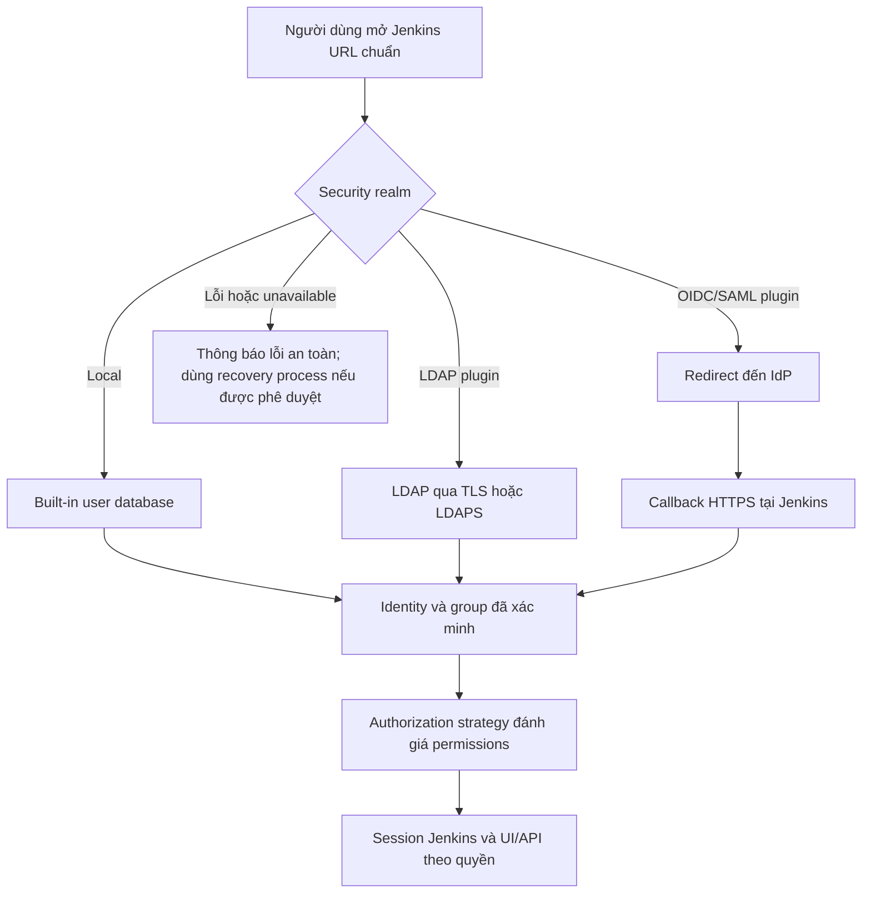

<Callout type="info" title="Phạm vi">
  Authentication (xác thực) trả lời “bạn là ai?”. Authorization (phân quyền) trả lời “bạn được làm gì?”. Trang này chọn và vận hành **security realm** để Jenkins nhận diện người dùng; nó không cấp permission cho user hoặc group.
</Callout>

Jenkins core có built-in user database và các security realm khác được cung cấp qua plugin. LDAP, OpenID Connect (OIDC) và SAML vì vậy phải được xem là tích hợp runtime: phiên bản Jenkins LTS, plugin đã phê duyệt, identity provider (IdP), reverse proxy và cấu hình thực tế cùng quyết định hành vi. Không coi một ví dụ tĩnh là bằng chứng controller đã đăng nhập được.

## Mục lục

- [Mục tiêu và mô hình](#mục-tiêu-và-mô-hình)
  - [Luồng đăng nhập](#luồng-đăng-nhập)
  - [Authentication không phải authorization](#authentication-không-phải-authorization)
- [Chọn security realm](#chọn-security-realm)
  - [Bảng quyết định](#bảng-quyết-định)
  - [Danh tính, vòng đời và session](#danh-tính-vòng-đời-và-session)
- [Built-in user database](#built-in-user-database)
  - [Bootstrap và local account](#bootstrap-và-local-account)
  - [Password policy và ranh giới lưu trữ](#password-policy-và-ranh-giới-lưu-trữ)
- [LDAP](#ldap)
  - [Kết nối, bind và tìm kiếm](#kết-nối-bind-và-tìm-kiếm)
  - [Group mapping và failure behavior](#group-mapping-và-failure-behavior)
- [OIDC và SAML qua plugin](#oidc-và-saml-qua-plugin)
  - [Những điểm cần xác minh](#những-điểm-cần-xác-minh)
  - [Ví dụ claims minh họa](#ví-dụ-claims-minh-họa)
- [Break-glass account](#break-glass-account)
- [Quy trình triển khai và rollback](#quy-trình-triển-khai-và-rollback)
  - [Go-live checklist](#go-live-checklist)
  - [Rollback có kiểm soát](#rollback-có-kiểm-soát)
- [Lab sandbox không chạm IdP production](#lab-sandbox-không-chạm-idp-production)
- [Troubleshooting](#troubleshooting)
- [Nguồn Jenkins chính thức](#nguồn-jenkins-chính-thức)
- [Đọc tiếp](#đọc-tiếp)

## Mục tiêu và mô hình

Một security realm biến bằng chứng đăng nhập thành một Jenkins identity. Bằng chứng đó có thể là password local, LDAP bind, hoặc assertion/token do IdP phát hành. Sau khi xác thực thành công, Jenkins dùng tên identity và các group mà realm/plugin cung cấp làm đầu vào cho authorization strategy đang bật.

### Luồng đăng nhập



Sơ đồ mô tả luồng logic. Callback path, cookie và cách plugin lấy group khác nhau theo plugin/version; hãy lấy chúng từ giao diện và tài liệu của plugin đang chạy.

### Authentication không phải authorization

IdP hoặc LDAP chỉ chứng thực danh tính và có thể trả về group. Nó **không tự cấp** `Overall/Administer`, `Job/Configure`, quyền đọc credential hay bất kỳ permission Jenkins nào. Administrator vẫn phải map user/group ổn định vào authorization strategy, cấp ít quyền nhất và kiểm thử bằng account đại diện.

Ví dụ, claim `groups: ["ci-developers"]` không tự cho phép build. Claim này chỉ hữu ích khi strategy của controller có một rule cụ thể cho group `ci-developers`. Ngược lại, một local account xác thực thành công vẫn không có quyền hữu ích nếu không được cấp permission.

## Chọn security realm

### Bảng quyết định

| Lựa chọn | Phù hợp khi | Điểm mạnh | Rủi ro/vận hành cần chấp nhận | Không nên chọn khi |
| --- | --- | --- | --- | --- |
| Built-in user database | Lab cô lập, controller nhỏ, bootstrap hoặc break-glass có kiểm soát | Ít dependency, có thể đăng nhập khi IdP/LDAP ngoài Jenkins gặp sự cố | Vòng đời user, MFA, password policy, recovery và review phải vận hành riêng; dữ liệu nằm trong ranh giới `JENKINS_HOME` | Nhiều người dùng, joiner/mover/leaver thường xuyên, cần SSO/MFA tập trung |
| LDAP qua plugin | Tổ chức đã có directory, group và quy trình directory đáng tin cậy | Dùng danh tính/group doanh nghiệp, có thể tập trung deprovisioning | Phụ thuộc DNS, CA, TLS, bind/search account, schema và latency; cần failover/timeout rõ ràng | Không có owner directory, endpoint TLS tin cậy hoặc không thể kiểm thử group/search |
| OIDC hoặc SAML qua plugin | IdP có SSO/MFA/conditional access và ứng dụng đã dùng federation | Sign-on tập trung, IdP quản lý MFA và lifecycle | Redirect/callback, issuer/audience, signing keys/certificates, claims, clock và logout phụ thuộc plugin/IdP | Không thể sở hữu callback URL, test IdP change hoặc giữ recovery path ngoài IdP |

Không chọn chỉ theo số lượng tính năng. Hãy chọn đường có owner rõ ràng cho identity lifecycle, hoạt động khi sự cố, và có thể diễn tập trên staging.

### Danh tính, vòng đời và session

Dùng **stable subject/name** làm khóa nhận diện: một subject không đổi theo thời gian tốt hơn display name hoặc email có thể đổi. Xác minh plugin sẽ tạo/ghép Jenkins user theo field nào (`sub`, `NameID`, username LDAP hoặc field khác); đổi field này sau go-live có thể tạo identity mới và làm permission/group mapping không khớp.

- **Provisioning:** xác định ai tạo identity, khi nào user lần đầu xuất hiện ở Jenkins và group nào được phép truy cập. Không cấp quyền theo email cá nhân nếu tổ chức đã có group quản trị được review.
- **Deprovisioning:** nhân sự rời đội phải bị vô hiệu hóa ở IdP/directory, rút khỏi group Jenkins và thu hồi API token/session theo quy trình. Kiểm tra cả service identity, không chỉ người dùng tương tác.
- **Group mapping:** chuẩn hóa tên group và casing. Tránh map một group rộng như toàn công ty vào permission Jenkins; owner group phải review thành viên định kỳ.
- **Session và logout:** xác định TTL session, logout tại Jenkins có kết thúc session IdP hay không, và cách force re-auth/revoke session khi incident. Đây là behavior của plugin/IdP, không phải cam kết chung của Jenkins core.
- **Account recovery:** recovery IdP, recovery Jenkins và break-glass là ba quy trình khác nhau. Không biến reset password qua email chưa kiểm soát thành đường vượt MFA hoặc approval.

## Built-in user database

### Bootstrap và local account

Built-in user database là security realm của Jenkins core để quản lý user local. Nó hữu ích cho lab, bootstrap ban đầu và một local recovery identity theo policy. `initialAdminPassword` chỉ mở khóa setup wizard; nó không phải một account recovery dài hạn. Xem [Thiết lập ban đầu](/docs/installation/initial-setup) để phân biệt bootstrap credential, identity và authorization.

Mô hình local không scale tốt khi nhiều team cần onboarding/offboarding, MFA, conditional access, central audit và group lifecycle. Khi đó, LDAP hoặc federation qua plugin thường giảm việc vận hành thủ công, nhưng chỉ sau khi integration và recovery đã được kiểm thử.

<Callout type="warn" title="Không dùng local account như shared admin">
  Tạo account cá nhân, có owner và mục đích rõ ràng. Không dùng `admin` dùng chung, không ghi password vào shell history, Console Output, ticket hoặc Jenkinsfile. Automation cần service identity riêng với permission hẹp, không dùng password của người quản trị.
</Callout>

### Password policy và ranh giới lưu trữ

Password của local realm là dữ liệu xác thực do controller xử lý; `JENKINS_HOME`, backup và host/volume chứa nó là ranh giới bảo mật quan trọng. Hạn chế quyền đọc filesystem/backup cho service account và quản trị viên được ủy quyền, bảo vệ backup bằng encryption, và không sao chép `JENKINS_HOME` vào nơi người dùng build có thể đọc.

Đừng giả định Jenkins core thay thế password policy doanh nghiệp, MFA hay workflow reset password. Chọn độ dài, password manager, rotation/recovery và review theo policy tổ chức; xác nhận từng capability trong Jenkins LTS và plugin đang dùng trước khi hứa với người dùng. Nếu policy yêu cầu MFA bắt buộc hoặc deprovisioning tức thời ở quy mô lớn, ưu tiên IdP/LDAP thay vì bù bằng local account thủ công.

## LDAP

LDAP integration là **plugin-provided security realm**, không phải feature LDAP native của Jenkins core. Trước khi cấu hình, review [LDAP Plugin](https://plugins.jenkins.io/ldap/) của Jenkins: compatibility với LTS, security advisory, schema và các field chính xác trong UI/JCasC reference của controller.

### Kết nối, bind và tìm kiếm

Dùng TLS cho kết nối directory: `ldaps://` hoặc LDAP với StartTLS tùy khả năng directory/plugin. Controller phải tin CA phát hành certificate LDAP; sửa trust store/CA qua quy trình hạ tầng thay vì tắt certificate validation. DNS cũng phải trả về endpoint directory đã phê duyệt.

Một thiết kế tối thiểu cần trả lời các câu hỏi sau trước khi nhập bất kỳ giá trị nào vào plugin:

| Thành phần | Cần quyết định | Control tối thiểu |
| --- | --- | --- |
| URL directory | Endpoint nào được controller gọi | Dùng hostname nội bộ đã phê duyệt và TLS; không dùng IP/CA tự ký chưa được quản lý |
| Bind identity | Ai được phép tìm user/group | Tài khoản service riêng, read-only, scope dưới base DN cần thiết; secret nằm trong vault/secret source được kiểm soát |
| User search | Cách tìm đúng một user | Base DN hẹp, filter được owner directory review; test ký tự đặc biệt và user trùng tên |
| Group search | Cách lấy group và membership | Base DN/filter hẹp; xác nhận nested group có được plugin hỗ trợ hay không |
| Timeout/failover | Khi directory chậm hoặc một endpoint lỗi | Timeout hữu hạn, endpoint dự phòng theo thiết kế, monitor latency/error; không retry vô hạn trên login |

Không đưa bind password vào JCasC, Git, URL hoặc log. Nếu plugin/configuration-as-code không tích hợp secret source phù hợp, dừng thiết kế và chọn cơ chế secret được đội phê duyệt thay vì đặt password plaintext vào YAML. Schema, field name và khả năng secret interpolation phụ thuộc plugin/runtime.

### Group mapping và failure behavior

Tạo một user test, một group được cấp quyền tối thiểu và một group không có quyền. Kiểm tra Jenkins nhận đúng group name trước khi thay đổi permission production. Dùng group nhỏ theo vai trò, chẳng hạn `ci-platform-operators`, thay vì map một directory group rộng.

Với LDAP outage, quyết định trước behavior mong muốn: login mới có thể thất bại khi directory không phản hồi, còn session đã tồn tại có thể còn hiệu lực đến khi hết hạn tùy plugin/session. Không dựa vào cache như một cam kết bảo mật hoặc availability; đọc tài liệu plugin/version và diễn tập timeout, failover và logout trên staging. Break-glass account đã kiểm thử là đường recovery được kiểm soát, không phải lý do để nới rộng anonymous access hay tắt authentication.

## OIDC và SAML qua plugin

OIDC và SAML đều chuyển xác thực tới IdP, nhưng giao thức và plugin khác nhau. Jenkins core không nên được mô tả là có SSO OIDC/SAML native chỉ vì controller có thể dùng chúng sau khi cài plugin. Ví dụ, [OpenID Connect Authentication plugin](https://plugins.jenkins.io/oic-auth/) và [SAML Plugin](https://plugins.jenkins.io/saml/) là hai integration cần review riêng về version, compatibility, security advisory và cấu hình.

### Những điểm cần xác minh

| Chủ đề | OIDC | SAML | Bằng chứng cần có |
| --- | --- | --- | --- |
| Identity provider | Issuer/discovery endpoint, client registration | IdP metadata, entity ID và signing certificate | Owner IdP phê duyệt application riêng cho Jenkins |
| Redirect/callback | Redirect URI do plugin hiển thị/ghi nhận | Assertion consumer service URL do plugin xác định | URL canonical HTTPS, context path và proxy headers khớp hoàn toàn |
| Đối tượng nhận | Kiểm tra issuer, audience và token signature | Kiểm tra issuer/entity, audience/restriction và assertion signature | Bản ghi cấu hình/test assertion không chứa secret |
| Identity/claims | `sub` ổn định, username/display/email và groups | `NameID` hoặc attribute ổn định và groups | Mapping field đã được kiểm thử với đổi tên/email |
| Thời gian/TLS | Clock skew, JWKS/discovery TLS | Assertion validity, clock skew, metadata/certificate TLS | NTP, DNS và CA đều được kiểm thử trước go-live |
| Logout/session | TTL, re-auth và logout federation tùy plugin/IdP | TTL, single logout nếu plugin/IdP hỗ trợ | Test logout Jenkins/IdP và revocation trong staging |

Callback phải dùng Jenkins URL public/canonical, bao gồm đúng HTTPS và context path. Một callback ghi `http://localhost:8080/` khi người dùng dùng `https://ci.example.invalid/jenkins/` thường gây redirect loop hoặc `redirect_uri` mismatch. Kiểm tra URL, proxy headers và cookie/security settings theo [Reverse proxy và TLS](/docs/installation/reverse-proxy-tls), không chữa bằng cách public cổng controller hoặc hạ TLS.

### Ví dụ claims minh họa

Đoạn JSON dưới đây là **minh họa, không chạy được trực tiếp**. Nó không phải token, không phải metadata IdP, không phải cấu hình plugin và không chứa client secret/private key. Tên claim thực tế phải đối chiếu với plugin, IdP và rule mapping trên controller.

```json
{
  "iss": "https://id.example.invalid/",
  "aud": "jenkins-training",
  "sub": "a4b1d0a6-illustrative-stable-subject",
  "preferred_username": "minh.nguyen",
  "email": "minh.nguyen@example.invalid",
  "groups": ["ci-developers"]
}
```

Ví dụ review mapping an toàn (cũng **minh họa, không phải YAML để áp dụng**) là: dùng `sub`/`NameID` ổn định cho identity, chỉ dùng `groups` từ assertion/token đã xác minh cho group mapping, và đối chiếu `iss` cùng `aud`/audience trước khi tạo session. Không tự map theo `email` nếu email có thể thay đổi hoặc không được IdP xác minh.

## Break-glass account

Break-glass account là một identity Jenkins local hoặc đường quản trị được phê duyệt, chỉ để khôi phục quyền khi IdP/LDAP offline hoặc lỗi federation làm administrator không đăng nhập được. Nó không phải shortcut dùng hằng ngày và không thay thế HA/monitoring của IdP.

Thiết kế break-glass tối thiểu:

1. **Ownership:** chỉ định ít nhất hai owner theo vai trò, approver on-call và người chịu trách nhiệm review; không để account mồ côi hoặc dùng chung vô danh.
2. **Bảo vệ:** password dài/ngẫu nhiên do password manager hoặc vault quản lý, access vault có MFA và audit; không lưu password trong Jenkins, source control, shell history hay ticket. Nếu policy cho phép MFA tại lớp vault/host, kiểm thử đường này khi IdP chính outage.
3. **Kích hoạt:** ticket/incident record, approval phù hợp mức khẩn cấp, lý do, thời điểm, người mở vault và phạm vi thao tác. Dùng từ máy quản trị được phép.
4. **Sau sử dụng:** ghi audit, điều tra nguyên nhân, rotate password, revoke session/API token được tạo tạm và **disable** account sau khi recovery hoàn tất nếu policy thiết kế account disabled-at-rest.
5. **Diễn tập:** kiểm thử định kỳ khi không có sự cố, gồm IdP outage giả lập, login, authorization tối thiểu cần thiết, recovery và disable/rotation. Không diễn tập bằng cách tắt authentication hoặc lock toàn bộ administrator production.

<Callout type="error" title="Không để recovery thành cửa hậu">
  Break-glass không được bỏ qua authorization. Cấp chỉ các permissions recovery đã review, giữ log/audit và kiểm tra account không bị dùng làm đường login thường ngày. Không dùng một password admin chung để “dễ khôi phục”.
</Callout>

## Quy trình triển khai và rollback

Đổi security realm có thể khóa người quản trị hoặc làm user xuất hiện dưới identity khác. Tách thay đổi plugin, IdP/LDAP application, security realm và authorization thành change nhỏ có evidence; không nâng Jenkins core, mọi plugin và SSO trong cùng một lần rollout.

### Go-live checklist

- [ ] Jenkins LTS, LDAP/OIDC/SAML plugin và dependency đã được phê duyệt, pin version theo quy trình quản lý plugin; smoke test đúng runtime đã hoàn thành.
- [ ] Jenkins URL, DNS, certificate chain, NTP/clock và reverse proxy HTTPS đã được xác minh từ mạng người dùng thực tế.
- [ ] Redirect URI/ACS, issuer, audience, signing keys/certificates và claim/attribute mapping đã được IdP owner xác nhận; không có client secret/private key trong Git, log hay tài liệu.
- [ ] Stable subject/name và group names đã được kiểm thử với user, administrator và user không được cấp quyền; authorization rules vẫn theo least privilege.
- [ ] Provisioning, deprovisioning, rename/email change, group removal, session expiry/logout và account recovery có owner cùng test case.
- [ ] LDAP bind/search account có scope read-only tối thiểu; TLS/CA, timeout, failover và outage behavior đã được kiểm thử.
- [ ] Hai administrator cá nhân độc lập hoặc break-glass path đã được kiểm thử offline; vault/MFA, owner, audit, rotation và disable-after-use đã được diễn tập.
- [ ] Monitoring có cảnh báo cho lỗi DNS/TLS, redirect/callback, latency/timeout, login failure và IdP outage mà không log assertion/token/password.

### Rollback có kiểm soát

Trước go-live, export/ghi nhận cấu hình đã biết tốt, plugin version, Jenkins URL, authorization rules, IdP registration và change window. Test rollback trên controller cô lập trước, với account không phải account vừa thay đổi realm.

Nếu login production lỗi, dừng rollout và dùng đường break-glass đã phê duyệt. Khôi phục security realm/configuration đã biết tốt theo change record, rồi xác minh login, group mapping và permission bằng account test. Không tắt security, mở anonymous read/write, xóa authorization hoặc rollback mù bằng cách sửa `JENKINS_HOME` trực tiếp. Với Configuration as Code, kiểm tra reference/export và giới hạn secret trước khi áp dụng; xem [Configuration as Code](/docs/administration/jcasc) để hiểu giới hạn plugin/runtime.

## Lab sandbox không chạm IdP production

Lab này là **config review/mock claim**; nó không gọi LDAP hoặc IdP thật, không tạo token, không chứa secret và không chứng minh plugin đã chạy. Dùng nó trước khi yêu cầu một smoke test riêng trên Jenkins loopback hoặc staging có dữ liệu giả.

1. Tạo một change record chỉ chứa các giá trị giả: issuer `https://id.example.invalid/`, audience `jenkins-training`, stable subject, group `ci-developers` và Jenkins URL sandbox `https://ci.example.invalid/jenkins/`.
2. Với IdP/LDAP owner, review bốn điểm: callback/ACS dự kiến do **plugin thực tế** cung cấp, issuer/audience, stable identity field và group attribute/search scope. Không điền client secret, bind password, private key hay endpoint production.
3. Mô phỏng năm tình huống trên giấy hoặc test fixture: callback sai URL, group không có, certificate không tin cậy, clock lệch và IdP timeout. Mỗi tình huống phải có owner, tín hiệu quan sát được và rollback/recovery step.
4. Khi đã có Jenkins sandbox riêng, chỉ bind nó vào loopback và dùng directory/IdP test với data giả. Cài plugin version đã phê duyệt theo quy trình riêng; smoke test login, logout, group mapping, negative authorization và break-glass. Không public endpoint ra Internet, không tắt authentication và không dùng account admin production.

Kết quả mong đợi của lab là một mapping được review và test plan đủ để runtime owner thực hiện smoke test. Nó không thay thế xác nhận callback path, schema, signature validation, cookie/session hoặc plugin compatibility trên controller đang chạy.

## Troubleshooting

| Triệu chứng | Kiểm tra theo thứ tự | Cách xử lý an toàn |
| --- | --- | --- |
| Redirect loop hoặc `redirect_uri` mismatch | Jenkins URL, HTTPS/proxy headers, context path, redirect URI plugin/IdP | Làm khớp URL canonical và callback do plugin hiển thị; không public controller hay hạ cookie/TLS protection |
| Đăng nhập được nhưng thiếu group/quyền | Stable identity, claim/attribute name, LDAP group search, casing, authorization rule | So sánh mapping bằng user test và group nhỏ; không cấp `Overall/Administer` để che lỗi mapping |
| LDAP TLS/LDAPS lỗi | DNS, endpoint, CA chain/trust store, certificate name, StartTLS/LDAPS mode | Sửa DNS/CA/certificate theo owner hạ tầng; không tắt certificate validation |
| Token/assertion bị từ chối vì thời gian | Clock controller, proxy/IdP, NTP, validity window và timezone log | Đồng bộ clock và đối chiếu timestamp; không nới validation window bừa bãi |
| IdP/LDAP outage hoặc timeout | Status IdP/directory, DNS, route, timeout/failover, session behavior plugin | Kích hoạt incident process và break-glass đã test; không bật anonymous access hoặc retry login vô hạn |
| Không thể logout/revoke như dự kiến | Plugin version, IdP session, Jenkins session TTL và browser cookie | Test và ghi nhận behavior thực tế; force re-auth/revoke theo IdP/plugin policy thay vì giả định single logout |

Khi điều tra, giữ log đủ cho timestamp, request ID, hostname, HTTP status và thông báo đã redact. Không ghi assertion SAML, ID/access token, `Authorization` header, bind password hoặc client secret vào ticket/log để “so sánh nhanh”.

## Nguồn Jenkins chính thức

- [Managing Security](https://www.jenkins.io/doc/book/security/managing-security/) — security realm, authentication và authorization trong Jenkins.
- [Authentication](https://www.jenkins.io/doc/book/security/managing-security/#authentication) — các lựa chọn security realm của Jenkins.
- [Access Control](https://www.jenkins.io/doc/book/security/access-control/) — authorization strategy và permissions, tách biệt với authentication.
- [Initial Settings](https://www.jenkins.io/doc/book/installing/initial-settings/) — bootstrap credential và setup wizard.
- [LDAP Plugin](https://plugins.jenkins.io/ldap/) — integration LDAP, compatibility và tài liệu plugin.
- [OpenID Connect Authentication plugin](https://plugins.jenkins.io/oic-auth/) — integration OIDC qua plugin.
- [SAML Plugin](https://plugins.jenkins.io/saml/) — integration SAML qua plugin.
- [Reverse proxy configuration](https://www.jenkins.io/doc/book/system-administration/reverse-proxy-configuration-with-jenkins/) — URL, headers và callback sau proxy.

## Đọc tiếp

<Cards>
  <Card title="Thiết lập ban đầu" href="/docs/installation/initial-setup" description="Phân biệt bootstrap credential, admin đầu tiên và recovery path." />
  <Card title="Reverse proxy và TLS" href="/docs/installation/reverse-proxy-tls" description="Làm khớp URL, HTTPS, headers và context path cho login callback." />
  <Card title="Configuration as Code" href="/docs/administration/jcasc" description="Review cấu hình controller/plugin và giới hạn secret trước khi áp dụng." />
  <Card title="CLI và HTTP API" href="/docs/administration/cli-rest-api" description="Dùng identity automation, API token và permission hẹp sau khi authentication hoàn tất." />
</Cards>
