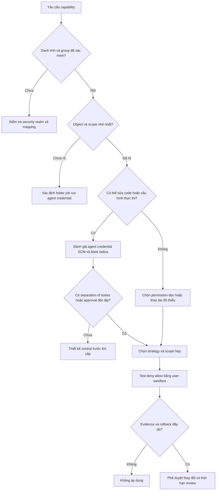

<Callout type="info" title="Phạm vi">
  Trang này nói về **authorization**: Jenkins quyết định danh tính hay group nào được xem, chạy hoặc thay đổi tài nguyên nào. Nó không thay thế identity provider, bảo vệ mạng, cô lập agent hay chính sách credentials. UI, tên role và permission hiển thị có thể thay đổi theo Jenkins core, authorization strategy và plugin đang chạy; luôn xác minh trên controller sandbox cùng version trước khi áp dụng thay đổi thật.
</Callout>

Jenkins là một hệ thống thực thi code, không chỉ là nơi xem trạng thái CI. Một người có thể sửa job, Jenkinsfile hoặc agent có thể biến quyền đó thành đường chạy code với identity và credential mà job nhận được. Vì vậy, RBAC hiệu quả bắt đầu từ scope hẹp nhất và được chứng minh bằng test deny/allow, không phải bằng tên role nghe có vẻ an toàn.

## Mục lục

- [Mô hình authorization của Jenkins](#mô-hình-authorization-của-jenkins)
  - [Security realm khác authorization strategy](#security-realm-khác-authorization-strategy)
  - [Nhóm permission và ý nghĩa của Overall](#nhóm-permission-và-ý-nghĩa-của-overall)
  - [Cây quyết định cấp quyền](#cây-quyết-định-cấp-quyền)
- [Matrix Authorization Strategy](#matrix-authorization-strategy)
  - [Ma trận global và project based](#ma-trận-global-và-project-based)
  - [Kế thừa và anonymous access](#kế-thừa-và-anonymous-access)
  - [Mẫu ma trận để thảo luận](#mẫu-ma-trận-để-thảo-luận)
- [Role Strategy](#role-strategy)
  - [Global item và agent roles](#global-item-và-agent-roles)
  - [Regex pattern và role overlap](#regex-pattern-và-role-overlap)
  - [Mẫu role không cấp quyền production](#mẫu-role-không-cấp-quyền-production)
- [Folder permissions và ranh giới thực tế](#folder-permissions-và-ranh-giới-thực-tế)
  - [Kế thừa theo folder](#kế-thừa-theo-folder)
  - [Folder không tự bảo vệ secret](#folder-không-tự-bảo-vệ-secret)
- [Rà soát permission theo least privilege](#rà-soát-permission-theo-least-privilege)
  - [Ma trận persona scope và evidence](#ma-trận-persona-scope-và-evidence)
  - [Separation of duties và break glass](#separation-of-duties-và-break-glass)
  - [Thay đổi audit và offboarding](#thay-đổi-audit-và-offboarding)
- [Lab loopback kiểm thử policy](#lab-loopback-kiểm-thử-policy)
  - [Điều kiện và guard](#điều-kiện-và-guard)
  - [Snapshot thay đổi và rollback](#snapshot-thay-đổi-và-rollback)
  - [Thiết kế test matrix](#thiết-kế-test-matrix)
  - [Thực hiện test allow deny](#thực-hiện-test-allow-deny)
  - [Dọn lab và ghi evidence](#dọn-lab-và-ghi-evidence)
- [Checklist review trước khi áp dụng](#checklist-review-trước-khi-áp-dụng)
- [Tự kiểm tra](#tự-kiểm-tra)
- [Nguồn Jenkins và plugin chính thức](#nguồn-jenkins-và-plugin-chính-thức)
- [Đọc tiếp](#đọc-tiếp)

## Mô hình authorization của Jenkins

### Security realm khác authorization strategy

**Security realm** trả lời *ai đang đăng nhập*: nó xác thực user và, tùy cơ chế, cung cấp group membership từ Jenkins user database, LDAP, Active Directory hoặc identity provider. **Authorization strategy** trả lời *danh tính đó được làm gì trên object nào*: nó đánh giá permission, như `Job/Read`, với user hoặc group hiện tại và resource được yêu cầu.

Hai lớp có thể độc lập. Ví dụ, LDAP có thể là security realm còn Matrix Authorization Strategy là authorization strategy. Đổi group mapping trong realm có thể làm quyền hiệu lực thay đổi dù matrix không đổi; đổi matrix có thể từ chối user vẫn đăng nhập thành công. Khi điều tra `403`, kiểm tra identity và group đã nhận trước, rồi mới kiểm tra strategy, permission và scope.

<Callout type="warn" title="Đừng nhầm proxy với authorization">
  Reverse proxy, VPN hoặc allowlist IP có thể giảm ai chạm được controller, nhưng không cấp Jenkins permission. Ngược lại, một permission hợp lệ không biến controller thành endpoint công khai. Giữ authentication, authorization, TLS, network policy và CSRF như các kiểm soát độc lập.
</Callout>

### Nhóm permission và ý nghĩa của Overall

Permission Jenkins được kiểm tra trên object và scope liên quan. Tên nhóm là bản đồ để review, không phải danh sách quyền tự động nên cấp cùng nhau.

| Nhóm | Mục đích điển hình | Câu hỏi review tối thiểu |
| --- | --- | --- |
| **Overall** | Quyền ở cấp controller, gồm `Read`, `Manage`, `Administer` và các permission khác tùy core/plugin. | User có cần vào Jenkins nói chung hay cần một tác vụ quản trị đã được tách nhỏ? |
| **Job** | Xem, discover, build, configure, create, delete, move hoặc xem workspace của job/folder. | Có thể chạy hoặc sửa code, trigger, SCM, agent selection hay không? |
| **Run** | Xem build record, log, artifact hoặc thao tác trên một run tùy permission. | Log/artifact có thể chứa dữ liệu nhạy cảm hay dùng để suy ra source không? |
| **View** | Tạo hoặc thay đổi view hiển thị. | View có làm lộ tên hay trạng thái item ngoài scope không? |
| **Agent** | Xem, cấu hình hoặc liên quan đến việc dùng agent, tùy core và build-authorization mode. | Có thể đổi node, launch configuration hoặc đặt workload lên agent tin cậy không? |
| **SCM** | Permission do core/plugin SCM cung cấp cho hành vi liên quan SCM. | Plugin nào thêm permission, webhook hay dữ liệu mới và đã được review chưa? |
| **Credentials** | Xem, tạo, cập nhật hoặc dùng credential tùy store/plugin. | User có thể khiến một job hoặc Pipeline dùng secret không? |

Ba permission **Overall** thường bị diễn giải sai:

- `Overall/Read` là nền tảng để dùng phần lớn Jenkins và API của object user được phép truy cập. Nó **không** tự cấp `Job/Read`, `Job/Build`, `Credentials` hay quyền thay đổi cấu hình. Một số URL tối thiểu vẫn có thể tồn tại không cần `Overall/Read`; extension hoặc plugin phải tự kiểm tra server-side cho thao tác nhạy cảm.
- `Overall/Manage` cho phép một tập con tác vụ quản trị. Nó không tự suy ra mọi permission khác, và tính năng/plugin có thể chưa hỗ trợ nó. Một chức năng có thể cho phép user `Manage` chạm dữ liệu thường bị permission khác bảo vệ, nên cấp nó theo task đã kiểm thử, không coi là “admin an toàn”.
- `Overall/Administer` là đặc quyền toàn diện: có thể cài plugin hoặc dùng Script Console để chạy code. Một instance bị user không tin cậy có quyền này phải được coi là đã compromise; rotate/revoke secret liên quan và điều tra theo incident process. Không cấp nó rộng để xử lý `403` hoặc làm một plugin hoạt động.

`Job/Configure`, `Job/Create`, quyền thay đổi agent, permission plugin và quyền dùng credential đều có thể là đặc quyền gián tiếp. Permission chính xác, implication và object scope phải được tra trong **Permissions** của Jenkins core và UI của instance; plugin có thể bổ sung hoặc đổi behavior.

### Cây quyết định cấp quyền

Dùng cây này cho từng yêu cầu, thay vì bắt đầu bằng role có sẵn:



Cây này là review tĩnh. Nó không chứng minh plugin hoặc Jenkins runtime thực thi đúng policy. Nút hoặc permission UI bị ẩn chỉ là cách trình bày; endpoint và thao tác thay đổi trạng thái vẫn phải bị Jenkins/plugin kiểm tra server-side. Bước `Test deny allow` vẫn bắt buộc trên controller cô lập.

## Matrix Authorization Strategy

[Matrix Authorization Strategy](https://plugins.jenkins.io/matrix-auth/) là plugin cung cấp authorization chi tiết theo permission. Nó phù hợp khi cần thấy rõ ô *principal × permission* và cần policy riêng cho item hoặc agent. Plugin là một dependency: kiểm tra version, dependency, advisory, compatibility với Jenkins core và schema/runtime của chính controller trước mỗi thay đổi.

### Ma trận global và project based

**Global matrix** cấp permission ở toàn controller. Dùng nó thật tiết chế: `Job/Read` global mở rộng khả năng xem ra toàn bộ job, và `Job/Create` global có thể cho tạo item với tên bất kỳ tùy strategy/naming policy. Global matrix phù hợp hơn cho baseline thật sự toàn cục, như mức truy cập Jenkins cần cho một nhóm đã được review.

**Project-based matrix** cho phép cấu hình permission ở item hoặc agent. Với folder, policy có thể tác động folder và các child tùy inheritance đã chọn. Đây là công cụ để giới hạn team vào namespace riêng, không phải lý do để bỏ review quyền sửa job.

Một user có thể nhận quyền từ nhiều hàng principal hoặc nhiều scope. Cấp quyền thường có tính cộng dồn; đừng cố “deny” một role bằng cách bỏ tick ở role khác. Liệt kê toàn bộ direct assignment, group, global grant, parent folder và plugin-specific grant trước khi kết luận user không có quyền.

### Kế thừa và anonymous access

Project-based matrix mặc định kế thừa global configuration và parent entity. Plugin có thể cung cấp các lựa chọn sau theo loại object:

| Lựa chọn kế thừa | Ý nghĩa | Rủi ro cần test |
| --- | --- | --- |
| **Inherit permissions** | Giữ grant global và parent; grant tại object chỉ bổ sung. | Một quyền ở folder cha có thể xuất hiện ở job con ngoài dự tính. |
| **Inherit global configuration only** | Giữ grant global, không lấy grant parent folder. | Baseline global vẫn có hiệu lực; không phải isolated tuyệt đối. |
| **Do not inherit permissions** | Chỉ grant tại object có hiệu lực, trừ `Overall/Administer` vẫn không thể bị loại khỏi item/agent. | Có thể làm maintainer mất quyền cần thiết hoặc bỏ quên evidence/đường recovery. |

Không cấp permission đáng kể cho `anonymous` hoặc `authenticated` chỉ vì lab cần mở nhanh. `anonymous` bao gồm người chưa đăng nhập; `authenticated` có thể gồm mọi account mà realm chấp nhận trong tương lai. Nếu dùng anonymous cho một endpoint/plugin cần thiết, giới hạn capability, xác minh server-side behavior, kiểm tra log truy cập và review lại khi cài plugin hay đổi realm.

<Callout type="error" title="Configure có thể là escalation path">
  Trong project-based matrix, người được `Configure` trên item hoặc agent có thể có đường để cấp cho chính họ những permission khác trên resource đó, tùy cấu hình và inheritance. Không giao `Configure` chỉ vì người dùng cần trigger build; tách người chạy job khỏi người sửa job khi mức tin cậy của source, agent hoặc credential đòi hỏi.
</Callout>

### Mẫu ma trận để thảo luận

Bảng dưới là **mẫu review**, không phải cấu hình để copy vào controller. `team-alpha-sandbox` là namespace giả trong lab; không có permission production, credential hoặc endpoint thật trong ví dụ.

| Principal giả | Overall | Folder `team-alpha-sandbox` | Job con | Agent | Mục đích kiểm thử |
| --- | --- | --- | --- | --- | --- |
| `lab-ci-observer` | `Read` | `Read` | `Read` | Không cấp | Xem namespace và kết quả đã được phép. |
| `lab-ci-runner` | `Read` | `Read` | `Read`, `Build` | Không cấp | Trigger một smoke job vô hại. |
| `lab-ci-maintainer` | `Read` | `Read` | `Read`, `Configure` | Không cấp mặc định | Thử tác động của quyền sửa job trong sandbox. |
| `anonymous` | Không cấp | Không cấp | Không cấp | Không cấp | Xác nhận redirect/deny theo strategy thực tế. |

Nếu maintainer có thể đổi Jenkinsfile, SCM definition, parameter, label hoặc credential binding, phạm vi thực tế rộng hơn một ô `Job/Configure`. Chỉ thêm quyền sau khi đã review code source, trust của agent, credential scope và hệ thống đích.

## Role Strategy

[Role-based Authorization Strategy](https://plugins.jenkins.io/role-strategy/) là plugin tạo role rồi gán role cho user/group từ security realm. Nó hỗ trợ global, item và agent roles. Chọn nó khi đội cần tái sử dụng tập permission theo persona, nhưng đừng coi tên role như enforcement: permission cuối cùng là union của role, assignment, scope và plugin behavior.

### Global item và agent roles

| Loại role | Scope | Cách dùng thận trọng |
| --- | --- | --- |
| **Global role** | Toàn controller. Plugin hỗ trợ các permission như Overall, Agent, Job, Run, View và SCM ở scope global. | Chỉ đặt baseline thật sự cần cho mọi item. Một global `Job/Read` có thể vượt mọi item pattern. |
| **Item role** | Job, Pipeline và Folder khớp regular expression. Có thể gồm permission item như Job, Run hoặc Credentials tùy plugin. | Pattern phải bao gồm folder parent khi user cần đi tới job con; test chính xác tên đầy đủ. |
| **Agent role** | Agent khớp regular expression. | Không dùng để thay thế trust boundary OS/network; review quyền cấu hình/khả năng chạy workload. |

Trong plugin này, permission đặt bằng global role áp dụng ở mọi item và có thể làm policy item role hẹp trở nên vô hiệu về mặt scope. Quyền `Job/Create` ở item role còn phụ thuộc **Role-Based strategy** cho *Restrict project naming* để giới hạn tên item được tạo một cách đáng tin cậy. Khi cấp `Job/Create`, plugin khuyến nghị xem xét cùng `Job/Configure` và `Job/Read` để user thao tác được item vừa tạo; đó là lý do phải đánh giá code-execution risk trước, không phải lời mời cấp cả ba ở production.

### Regex pattern và role overlap

Item/agent role dùng regex để khớp **toàn bộ tên item**. Pattern case-sensitive trừ khi dùng flag như `(?i)`. Folder cần có quyền truy cập chính folder cha; một pattern chỉ khớp job con có thể không đủ để người dùng duyệt tới namespace đó.

| Ý định trong lab | Pattern minh họa | Điều phải xác minh |
| --- | --- | --- |
| Folder và toàn bộ child | `^team-alpha-sandbox($|/.*)` | Khớp folder cùng mọi job con; case và path separator thực tế. |
| Chỉ folder, không child | `^team-alpha-sandbox$` | User không tự thấy/chạy child chỉ nhờ pattern này. |
| Chỉ child của folder | `^team-alpha-sandbox/.*` | Cần một role khác hoặc grant phù hợp cho folder parent. |
| Không phân biệt hoa thường trong lab | `(?i)^team-alpha-sandbox($|/.*)` | Đặt flag có chủ đích; tên child/folder có edge case cần runtime test. |

Tránh regex quá rộng như `.*`, prefix thiếu anchor như `team`, hoặc pattern trùng nhiều team. Một item có thể khớp nhiều roles và permission giao nhau có thể cộng dồn. Khi một user “có quyền lạ”, kiểm tra tất cả group assignment, global role, item role và regex match thay vì chỉ xem role vừa sửa. UI highlight/tooltips hữu ích để quan sát, nhưng test bằng user thật ở sandbox mới xác nhận enforcement.

### Mẫu role không cấp quyền production

Ví dụ chỉ đặt tên policy để review, không phải lệnh hay file cấu hình:

| Role giả | Pattern giả | Permission mục tiêu | Không ngầm cấp |
| --- | --- | --- | --- |
| `lab-alpha-observer` | `^team-alpha-sandbox($|/.*)` | `Job/Read`, `Run/Read` nếu instance có permission phù hợp | Build, Configure, Credentials, Agent/Configure. |
| `lab-alpha-runner` | `^team-alpha-sandbox($|/.*)` | `Job/Read`, `Job/Build`, permission xem run cần thiết | Configure job, tạo job, truy cập workspace. |
| `lab-alpha-agent-viewer` | `^lab-linux-.*` | Chỉ permission xem agent đã được kiểm tra ở UI | Cấu hình agent, đổi launch method, dùng agent như boundary. |

Tên `lab-alpha-runner` không tự hạn chế quyền; pattern và ô permission mới quyết định. Nếu plugin, naming strategy hoặc version không hỗ trợ behavior được kỳ vọng, dừng rollout và điều chỉnh sandbox, không mở `Overall/Administer` để “chữa” lỗi.

## Folder permissions và ranh giới thực tế

Folder tạo namespace cho job, Pipeline, view và một số cấu hình theo plugin. Khi strategy hỗ trợ ACL theo item, folder là scope tự nhiên để cấp quyền cho một team và kế thừa xuống child. Folder không tự tạo tenant isolation và cũng không tự chặn một grant global.

### Kế thừa theo folder

Trước khi đưa folder-based policy vào hiệu lực, trả lời cụ thể:

1. **Ai có quyền vào folder?** User cần permission để thấy/truy cập parent, không chỉ job con.
2. **Child nhận gì?** Ghi rõ strategy/inheritance đang dùng: parent + global, chỉ global, hay grant explicit. Kiểm tra folder lồng nhau từng cấp.
3. **Ai tạo hoặc di chuyển item?** `Job/Create` và `Job/Move` có thể phá giả định pattern/path. Với Role Strategy, kiểm tra naming strategy tương ứng; với Matrix, kiểm tra inheritance và object policy.
4. **Global grant nào vẫn thắng về scope?** Ghi cả role, group hoặc matrix global có `Job/Read`, `Credentials` hay permission liên quan.
5. **Plugin nào thêm object hoặc permission?** Multibranch, SCM, credentials store và folder plugin có thể thêm capability; chỉ tin behavior đã được kiểm thử với bộ plugin đang cài.

Nếu cân nhắc [Folder-based Authorization Strategy](https://plugins.jenkins.io/folder-auth/), đọc trạng thái security advisory trên chính plugin page trước. Trang plugin hiện cảnh báo một lỗ hổng chưa được giải quyết; không đưa plugin đó vào controller chỉ để có mô hình folder. Matrix hoặc Role Strategy cũng không tự an toàn: tất cả plugin authorization cần inventory, advisory review, compatibility test và rollback.

### Folder không tự bảo vệ secret

Folder scope hữu ích để giới hạn object Jenkins, nhưng secret chỉ được bảo vệ khi **credential store scope**, permission Credentials, job/Pipeline configuration, agent isolation và authorization ở hệ thống đích cùng hẹp. Một job trong folder được phép dùng credential rộng, hoặc chạy trên agent có capability khác, vẫn có thể tạo đường đọc/đẩy dữ liệu ngoài folder.

Tương tự, label như `trusted-release` chỉ route scheduler; user có `Job/Configure` có thể đổi label hoặc Pipeline. Label không phải authorization và workspace/cache dùng chung không phải secret boundary. Tách pool/identity/filesystem/network theo trust tier, giới hạn ai sửa job và agent, rồi cấp credential đúng folder/job/stage. Đọc [Labels & Executors](/docs/agents/labels-executors) và [Kiến trúc Jenkins](/docs/getting-started/architecture) để đặt policy quyền trong ranh giới controller–agent thật.

## Rà soát permission theo least privilege

Least privilege không phải “ít ô tick nhất” mà là capability nhỏ nhất đủ cho một nhiệm vụ, ở scope nhỏ nhất, với bằng chứng cho phép và từ chối. Rà soát định kỳ sau khi đổi team, SCM trust, plugin, agent pool, credential hoặc hệ thống đích.

### Ma trận persona scope và evidence

Bảng này là điểm bắt đầu để review với owner; permission exact phải đối chiếu Jenkins/core plugin trên runtime.

| Persona | Permission tối thiểu cần xem xét | Scope | Evidence phải lưu |
| --- | --- | --- | --- |
| Người quan sát CI | `Overall/Read`, `Job/Read`, và `Run/Read` nếu cần xem run/artifact | Folder/team đã được duyệt | Ticket mục đích, group mapping, test xem job được phép và không thấy folder khác. |
| Người chạy job | Quyền observer cộng `Job/Build` trên job cụ thể | Job hoặc folder sandbox, không global mặc định | Owner job, test trigger thành công, test `Configure` bị từ chối, run ID/log đã redaction. |
| Maintainer job | `Job/Read` và `Job/Configure` chỉ khi chịu trách nhiệm source/execution | Folder của team, không agent/global mặc định | SCM review, owner folder, review credential/agent/label, test diff và rollback. |
| Automation identity | API token của identity riêng cùng `Overall/Read` và permission API/job nhỏ nhất | Một endpoint/job/folder xác định | Owner, expiry/rotation, test API deny/allow, token inventory; không lưu token vào ticket/log. |
| Platform operator | Tập permission vận hành đã kiểm thử; có thể cần `Overall/Manage` cho tác vụ hỗ trợ | Controller và task được phê duyệt | Change record, task list, plugin/core version, test rằng capability ngoài task bị từ chối khi có thể. |
| Jenkins administrator | `Overall/Administer` chỉ cho danh tính cá nhân được phê duyệt | Controller | Phê duyệt đặc quyền, MFA/realm evidence, activity audit, backup/rollback và review định kỳ. |

Không suy ra quyền từ persona name. Ví dụ, maintainer không mặc định được đọc credential hay sửa agent; operator có `Manage` không mặc định có mọi quyền đọc/sửa khác. Khi UI không hiện permission mong đợi, xác minh plugin/core feature và version trước, rồi test server-side bằng sandbox.

### Separation of duties và break glass

Tách các quyết định có blast radius lớn khi tổ chức có đủ người và workflow:

- Người đề xuất quyền không là người duy nhất phê duyệt nếu quyền cho phép sửa job, dùng credential, thay agent hoặc quản trị controller.
- Owner workload review nhu cầu nghiệp vụ; Jenkins/platform owner review strategy, plugin và scope; security/identity owner review group mapping hoặc secret khi liên quan.
- Người phát hành không nên vừa sửa Pipeline, vừa tự cấp quyền deploy và vừa là approver duy nhất của thay đổi. Approval Pipeline không thay authorization tại Jenkins hoặc hệ thống đích.

**Break-glass** là đường recovery kiểm soát được, không phải shared admin thường ngày. Dùng danh tính riêng, owner rõ ràng, secret lưu trong vault theo policy, audit bắt buộc và drill định kỳ trên môi trường cô lập. Kiểm tra ít nhất một đường quản trị vẫn hoạt động trước khi đổi realm/strategy. Sau một lần dùng break-glass, ghi incident/change, review phạm vi, rotate/revoke material theo policy và quay về access thường ngày.

<Callout type="warn" title="Không tự khóa administrator">
  Trước khi lưu policy mới, giữ một administrator cá nhân hoặc recovery path đã kiểm thử ở phiên riêng. Không xóa principal quản trị cuối cùng, không thử policy trên production và không dùng `Overall/Administer` rộng để khôi phục một lỗi quyền thông thường.
</Callout>

### Thay đổi audit và offboarding

Mỗi permission change cần một record có thể trả lời *ai yêu cầu, vì sao, ai phê duyệt, thay đổi gì, hiệu lực ở đâu, test gì và quay lui thế nào*. Tối thiểu lưu ticket/change ID, principal/group, role/matrix row, pattern hoặc object path, version Jenkins/plugin, timestamp, reviewer, ảnh/export hoặc config diff đã bảo vệ, và kết quả test deny/allow. Không đưa API token, password, private key, export credential hay URL nội bộ nhạy cảm vào evidence.

Review quyền theo chu kỳ và theo event: nhân sự đổi vai trò/rời đội, group IdP đổi membership, folder/job bị move, agent/credential mới, plugin/core update hoặc advisory. Offboarding phải thu hồi group/role/token/service identity ngay theo policy, xác minh user không còn đăng nhập hay truy cập job, rồi giữ evidence thu hồi. Xóa user trong Jenkins không đủ nếu IdP group, API token, credential mapping hoặc quyền ở hệ thống đích còn hiệu lực.

Cấu hình controller, export và backup là dữ liệu nhạy cảm. Giữ snapshot/diff trong kho được phân quyền; đừng dùng screenshot UI hoặc danh sách role như backup duy nhất. Hướng dẫn ownership, backup và rollback của cấu hình toàn cục có tại [Cấu hình hệ thống Jenkins](/docs/administration/system-configuration).

## Lab loopback kiểm thử policy

Lab này chỉ xác minh enforcement của Jenkins/plugin đang chạy tại chỗ. Nó không chứng minh policy production, tương thích với identity provider thật hoặc an toàn của agent/credential/hệ thống đích. Thực hiện trên controller throwaway, chỉ bind `127.0.0.1`, với `JENKINS_HOME` riêng và user/role giả.

### Điều kiện và guard

- Dùng URL loopback, ví dụ `http://127.0.0.1:8080/`; không mở port ra LAN/Internet, không dùng controller production hay dữ liệu đã sao chép từ production.
- Cài và kích hoạt **một** strategy cần kiểm thử theo plugin/core đã được review. Ghi lại Jenkins core, Java, plugin short name/version và strategy hiện hiệu lực. Plugin UI/capability là runtime assumption, không phải fact tĩnh của bài này.
- Dùng một administrator lab cá nhân đã đăng nhập, cộng một recovery path lab đã kiểm thử ở phiên trình duyệt riêng. Không đăng xuất/xóa cả hai trước khi kết thúc test.
- Tạo folder `team-alpha-sandbox`, smoke job vô hại chỉ in một dòng cố định, và danh tính giả `lab-ci-observer`, `lab-ci-runner`, `lab-ci-maintainer`. Không dùng password, token, credential, SCM thật hoặc agent có quyền deploy.
- Tắt hoặc không cấu hình anonymous grant cho folder/job. Nếu mục tiêu là test anonymous, chỉ kiểm tra behavior xem/deny của namespace lab và giữ recovery session mở.

Đọc [Thiết lập ban đầu](/docs/installation/initial-setup) nếu cần dựng controller local với persistent storage. Lab authorization không yêu cầu cài thêm plugin ngoài strategy đã được phê duyệt; không cài plugin lên production để làm theo ví dụ.

### Snapshot thay đổi và rollback

Trước khi sửa security configuration, ghi lại bằng chứng ở nơi bảo vệ phù hợp: strategy hiện tại, assignment/permission rows, group mapping nhận được, folder path, plugin/core version, thời điểm và administrator thực hiện. Nếu policy được quản lý bằng configuration as code, lưu revision đã biết tốt cùng export/reference của sandbox phù hợp version; không commit secret vào Git.

Xác định rollback **trước** khi bấm Save: quay lại snapshot policy của chính controller lab, xác minh recovery administrator vẫn có quyền, rồi đăng nhập bằng user sandbox để test lại baseline. Không restart, reload hay thay global security chỉ để thử phỏng đoán. Nếu admin mất truy cập, dừng thao tác và dùng recovery path đã chuẩn bị; không hạ authorization toàn controller hay tạo broad administrator như cách chữa lỗi.

### Thiết kế test matrix

Áp dụng mẫu Matrix hoặc Role Strategy tương ứng cho namespace lab, sau đó kiểm tra cả đường được phép lẫn bị từ chối.

| Principal | Thao tác trong `team-alpha-sandbox` | Kết quả mong đợi | Bằng chứng an toàn |
| --- | --- | --- | --- |
| `lab-ci-observer` | Mở folder, job và build record | Cho phép xem đúng scope | URL path đã redaction, timestamp, HTTP status hoặc ảnh không chứa secret. |
| `lab-ci-observer` | Chọn Configure hoặc Build Now | Từ chối | Trang deny/HTTP status và policy row liên quan. |
| `lab-ci-runner` | Chạy smoke job vô hại | Cho phép | Build number, result, console chỉ có dòng cố định. |
| `lab-ci-runner` | Mở Configure, xem job ngoài folder | Từ chối | Kết quả deny ở cả hai scope. |
| `lab-ci-maintainer` | Mở Configure của job lab | Cho phép nếu đó là mục tiêu policy | Diff nhỏ, rồi rollback job về baseline. |
| `lab-ci-maintainer` | Cấu hình agent hoặc truy cập credential ngoài mục tiêu | Từ chối | Trang/API status; không thử đọc secret. |
| Chưa đăng nhập | Mở URL folder/job lab | Redirect login hoặc deny theo strategy | Response/browser behavior; không suy ra từ việc UI ẩn nút. |

Nếu Jenkins che object không được phép bằng `404` thay vì `403`, ghi đó là kết quả runtime của strategy/UI và vẫn kiểm tra policy bằng account sandbox. Status code không một mình chứng minh object tồn tại hay không tồn tại.

### Thực hiện test allow deny

1. Trong cửa sổ administrator lab, tạo policy nhỏ nhất cho đúng test matrix. Dùng folder path/pattern chính xác; với Role Strategy kiểm tra pattern match full name và case, với Matrix kiểm tra inheritance đang chọn.
2. Mở một browser profile/private window riêng cho từng user sandbox. Đăng nhập từng user và thực hiện đúng một thao tác cho mỗi hàng matrix. Không mượn session administrator để suy luận quyền user.
3. Với phép đọc, kiểm tra folder parent, job child và run riêng. Với phép chạy, dùng smoke job không checkout SCM, không bind credential, không gọi network và không chọn agent đặc quyền.
4. Với phép bị từ chối, thử URL/action qua browser. Có thể quan sát endpoint không thay đổi trạng thái như `http://127.0.0.1:8080/whoAmI/api/json` để xác nhận session hiện tại; không dán token/password vào command line, history hoặc evidence.
5. So sánh kết quả với matrix. Nếu một deny thành allow, dừng test, tìm mọi grant cộng dồn (group, global role/matrix, parent folder, inheritance, regex overlap và plugin permission), rồi rollback snapshot. Không nới quyền để làm test “xanh”.
6. Ở phiên recovery, xác minh vẫn vào được **Manage Jenkins** trước và sau Save. Đây là test recovery, không phải lý do mở quyền recovery cho user lab.

### Dọn lab và ghi evidence

Sau khi capture evidence, xóa policy assignment, users/groups giả, job và folder **chỉ của lab** bằng UI hoặc restore snapshot lab. Xác minh `team-alpha-sandbox` không còn xuất hiện với user sandbox và recovery administrator vẫn đăng nhập được. Không chạy lệnh xóa volume, prune hoặc cleanup trên path/storage không tạo riêng cho lab.

Nếu một bước lab có dùng thư mục tạm do shell tạo, chỉ dùng đường dẫn từ `mktemp -d`, kiểm tra nó khác rỗng và nằm dưới thư mục tạm trước khi xóa. Ví dụ guard chỉ áp dụng cho thư mục tạm do chính shell tạo, không áp dụng cho `JENKINS_HOME`, workspace, volume Docker hay đường dẫn do người dùng nhập:

```bash
lab_tmp="$(mktemp -d)"
case "$lab_tmp" in
  /tmp/*) rm -rf -- "$lab_tmp" ;;
  *) printf '%s\n' 'Refuse cleanup outside /tmp' >&2 ; exit 1 ;;
esac
```

Evidence cuối gồm snapshot trước/sau đã redaction, test matrix kết quả, version/plugin, principal giả, approver, rollback result và thời điểm review lại. Các file này không được chứa credential, token, cookie, config export nhạy cảm hoặc identifier production.

## Checklist review trước khi áp dụng

- [ ] Security realm, group mapping và authorization strategy được phân biệt; identity thật của principal đã được xác minh.
- [ ] Object scope nhỏ nhất đã rõ: controller, agent, folder, job, run, view, SCM hoặc credentials.
- [ ] `Overall/Read`, `Overall/Manage` và `Overall/Administer` được đánh giá theo capability thực tế, không theo tên role.
- [ ] Matrix inheritance hoặc Role Strategy global/item/agent role, regex và overlap đã được rà soát cùng mọi group assignment.
- [ ] `anonymous` và `authenticated` không có permission đáng kể nếu không có yêu cầu, owner và test server-side rõ ràng.
- [ ] Folder parent, folder lồng nhau, create/move behavior và grant global đã được kiểm tra; folder không bị coi là secret boundary.
- [ ] Người có `Configure`, quyền agent, SCM, plugin permission hoặc credential scope đã được đánh giá như đường thực thi/đặc quyền gián tiếp.
- [ ] Labels, views, UI visibility và approval không bị dùng thay authorization, isolation hạ tầng hay quyền hệ thống đích.
- [ ] Plugin strategy có version, compatibility, dependency và security advisory review; behavior được xác minh trên runtime sandbox.
- [ ] Có separation of duties, owner, evidence change/audit, expiry/review date, offboarding/revoke path và break-glass drill.
- [ ] Snapshot/export đã bảo vệ, rollback được định nghĩa trước Save và recovery administrator được kiểm thử mà không cấp broad admin.
- [ ] Test matrix có cả allow và deny bằng user browser/API sandbox riêng; log/evidence không chứa secret.

## Tự kiểm tra

1. Security realm và authorization strategy trả lời hai câu hỏi khác nhau nào? Nếu group từ IdP đổi membership, permission hiệu lực có thể thay đổi ra sao khi matrix không đổi?
2. Vì sao `Overall/Manage` không nên được mô tả là “admin an toàn”, và tại sao `Overall/Administer` không phải cách xử lý một `403`?
3. Một item role có pattern `^team-alpha-sandbox/.*` nhưng user không mở được folder cha. Bạn kiểm tra pattern/role nào trước?
4. Vì sao `Job/Configure` trên job dùng credential hoặc agent release có thể là đặc quyền cao hơn tên permission gợi ý?
5. Nêu các grant cần tìm khi user bất ngờ có quyền: direct assignment, group, global policy, parent inheritance, regex overlap và plugin permission. Bạn sẽ chứng minh deny bằng cách nào?
6. Vì sao folder, label `trusted-release` và nút UI bị ẩn không phải secret boundary hoặc authorization enforcement đầy đủ?

## Nguồn Jenkins và plugin chính thức

- [Jenkins Access Control](https://www.jenkins.io/doc/book/security/access-control/) — tách authentication/authorization, common mistakes và scope permission.
- [Jenkins Permissions](https://www.jenkins.io/doc/book/security/access-control/permissions/) — semantics `Overall/Read`, `Overall/Manage`, `Overall/Administer` và các nhóm permission core.
- [Managing Security](https://www.jenkins.io/doc/book/security/managing-security/) — cấu hình security và vận hành controller.
- [Matrix Authorization Strategy](https://plugins.jenkins.io/matrix-auth/) — project-based matrix, inheritance và caveat `Configure`.
- [Role-based Authorization Strategy](https://plugins.jenkins.io/role-strategy/) — global/item/agent roles, pattern và naming strategy.
- [Folder-based Authorization Strategy](https://plugins.jenkins.io/folder-auth/) — thông tin plugin và security warning hiện có; review advisory trước mọi quyết định cài đặt.
- [Jenkins Security Advisories](https://www.jenkins.io/security/advisory/) — advisory Jenkins core và plugin.

## Đọc tiếp

<Cards>
  <Card title="Thiết lập ban đầu" href="/docs/installation/initial-setup" description="Tạo admin đầu tiên, chọn plugin và chuẩn bị recovery trước khi áp dụng policy." />
  <Card title="Cấu hình hệ thống" href="/docs/administration/system-configuration" description="Quản lý global configuration, ownership, backup và rollback có kiểm soát." />
  <Card title="CLI và REST API" href="/docs/administration/cli-rest-api" description="Kiểm thử API với service identity và permission tối thiểu." />
  <Card title="Labels & Executors" href="/docs/agents/labels-executors" description="Phân biệt scheduler label với authorization và security boundary." />
</Cards>
