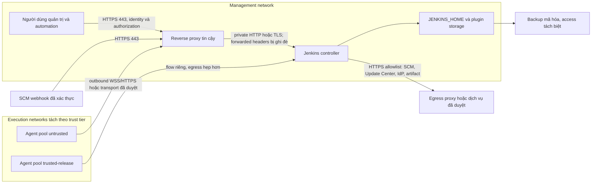

<Callout type="warn" title="Phạm vi và nguyên tắc thay đổi">
  Controller là tài sản đặc quyền: nó giữ cấu hình, plugin, credential metadata và điều phối build. Trang này là baseline để review, không phải danh sách bật/tắt áp dụng mù quáng. Mọi thay đổi phải có owner, cửa sổ thay đổi, backup đã kiểm chứng và xác nhận trên Jenkins LTS cùng plugin đang chạy.
</Callout>

## Mục lục

- [Mục tiêu và ranh giới](#mục-tiêu-và-ranh-giới)
- [Kiến trúc hardening](#kiến-trúc-hardening)
  - [Luồng và hướng kết nối](#luồng-và-hướng-kết-nối)
  - [Network policy không phải authorization](#network-policy-không-phải-authorization)
- [Baseline hardening có bằng chứng](#baseline-hardening-có-bằng-chứng)
- [Phân đoạn mạng và egress](#phân-đoạn-mạng-và-egress)
  - [Mạng quản trị cho UI và API](#mạng-quản-trị-cho-ui-và-api)
  - [Agent pools, DNS và firewall](#agent-pools-dns-và-firewall)
  - [Egress, webhook và SSRF](#egress-webhook-và-ssrf)
- [Đánh giá và giảm tính năng rủi ro](#đánh-giá-và-giảm-tính-năng-rủi-ro)
  - [Quy trình cho từng thay đổi](#quy-trình-cho-từng-thay-đổi)
  - [Danh mục cần review](#danh-mục-cần-review)
- [Quyền filesystem và persistent storage](#quyền-filesystem-và-persistent-storage)
  - [Phân loại dữ liệu và quyền](#phân-loại-dữ-liệu-và-quyền)
  - [Container, volume, umask và SELinux](#container-volume-umask-và-selinux)
- [Headers an toàn sau reverse proxy](#headers-an-toàn-sau-reverse-proxy)
  - [Cấu hình minh họa ở edge](#cấu-hình-minh-họa-ở-edge)
  - [Xác minh proxy, CSRF và giao diện](#xác-minh-proxy-csrf-và-giao-diện)
- [Chuỗi thay đổi có kiểm soát](#chuỗi-thay-đổi-có-kiểm-soát)
- [Lab local: review threat model không chạm Jenkins](#lab-local-review-threat-model-không-chạm-jenkins)
  - [Chuẩn bị fixture an toàn](#chuẩn-bị-fixture-an-toàn)
  - [Đọc kết quả và cleanup có guard](#đọc-kết-quả-và-cleanup-có-guard)
- [Troubleshooting](#troubleshooting)
- [Checklist tự kiểm tra](#checklist-tự-kiểm-tra)
- [Checklist incident và rollback](#checklist-incident-và-rollback)
- [Nguồn Jenkins chính thức](#nguồn-jenkins-chính-thức)
- [Đọc tiếp](#đọc-tiếp)

## Mục tiêu và ranh giới

Hardening controller là giảm khả năng một request, agent, plugin, filesystem hoặc dependency trở thành đường vào cấu hình Jenkins hay capability của build. Nó không biến source code không tin cậy thành an toàn. Controller production nên điều phối; built-in node đặt `0` executor và workload chạy trong agent pool tách biệt theo mức tin cậy.

Sau bài này, bạn có thể lập một baseline có owner và bằng chứng, xác định flow mạng tối thiểu, review thay đổi rủi ro theo version/runtime, và quay lui mà không ghi đè dữ liệu controller. Nền tảng asset, identity và trust boundary được trình bày tại [Mô hình bảo mật Jenkins](/docs/security/security-model) và kiến trúc controller–agent tại [Kiến trúc Jenkins](/docs/getting-started/architecture).

<Callout type="error" title="Không coi controller là public application server">
  Không publish trực tiếp HTTP port của controller ra Internet để tiện truy cập hoặc debug. Đặt UI/API sau HTTPS tại reverse proxy hoặc load balancer đã được tin cậy; upstream controller chỉ nhận từ proxy hoặc mạng quản trị đã định danh.
</Callout>

## Kiến trúc hardening

### Luồng và hướng kết nối



Sơ đồ là threat model khởi điểm, không phải một hợp đồng port cố định. Ghi rõ hostname, proxy hop, DNS resolver, transport agent, destination egress và owner thực tế trước khi viết firewall rule. Một agent WebSocket thường tạo kết nối outbound HTTPS đến proxy; inbound TCP và SSH có hướng kết nối khác, nên phải review theo launch method thay vì chỉ mở một cổng “Jenkins”.

### Network policy không phải authorization

Network segmentation giới hạn **ai có thể chạm network endpoint**. Jenkins authentication và authorization quyết định **identity nào được làm gì** sau khi đã chạm controller. Một allowlist IP không cấp `Job/Build`; một permission hợp lệ cũng không cho phép public controller. Giữ độc lập TLS, realm, authorization strategy, CSRF, firewall và policy agent. Xem chi tiết quyền tại [Authorization & RBAC](/docs/security/authorization) và request mutation tại [CSRF & API Tokens](/docs/security/csrf-api-tokens).

## Baseline hardening có bằng chứng

Bảng này là baseline để giao owner xác nhận, không phải cấu hình chung cho mọi Jenkins. `Evidence` nên là config diff đã bảo vệ, output kiểm tra đã redaction, ticket/change record hoặc kết quả sandbox; không chứa token, cookie, private key hay nội dung `JENKINS_HOME`.

| Control | Threat giảm thiểu | Owner | Evidence cần giữ | Rollback an toàn |
| --- | --- | --- | --- | --- |
| UI/API chỉ qua proxy HTTPS; upstream private | Bypass TLS, header trust và bề mặt Internet trực tiếp | Network/platform | Sơ đồ flow, security-group/firewall review, smoke test URL canonical | Khôi phục rule/proxy đã biết tốt; không public upstream để chữa `502`. |
| Agent pools tách trust tier, controller executor `0` | Code build đọc/ảnh hưởng controller hoặc release capability | Jenkins/CI owner | Node labels, executor setting, job-to-pool matrix, build sandbox | Route job về pool cũ đã kiểm thử; không chuyển workload sang controller. |
| Egress allowlist và DNS/proxy có owner | Download độc hại, exfiltration, SSRF tới dịch vụ nội bộ | Network/security | Danh sách FQDN/destination, flow log đã redact, test DNS/TLS | Khôi phục allowlist phiên bản trước trong cửa sổ; giữ deny log để điều tra. |
| Tính năng/plugin được review theo risk và advisory | Endpoint, protocol hoặc code controller không cần thiết | Jenkins/security | Inventory core/plugin, advisory review, test allow/deny | Re-enable hoặc restore version/config đã biết tốt sau staging; không downgrade trên home đã migrate. |
| Quyền `JENKINS_HOME` và backup tách biệt | Đọc/sửa credential metadata, plugin hoặc config | Host/storage owner | UID/GID/mode/label review, backup ID, restore drill | Khôi phục ACL/ownership cụ thể; không dùng `chmod -R 777`. |
| Header ở edge, URL và proxy trust chain nhất quán | Clickjacking, MIME sniffing, redirect/origin/crumb lỗi | Proxy/Jenkins owner | Rendered config, browser/API/webhook/static-asset smoke test | Revert block header nhỏ đã review; không tắt CSRF để che lỗi. |
| Log, monitoring và advisory cadence | Sự cố không phát hiện hoặc patch không có owner | Operations/security | Alert owner, log retention/ACL, advisory decision record | Khôi phục rule/retention trước; giữ evidence incident theo policy. |

## Phân đoạn mạng và egress

### Mạng quản trị cho UI và API

Đặt controller, UI và API trong mạng quản trị. Người dùng, automation và webhook chỉ đi vào qua reverse proxy/load balancer trên URL HTTPS canonical. Controller bind loopback hoặc private subnet; firewall/security group chỉ cho IP, subnet hoặc identity của proxy đã biết tới upstream. Hướng dẫn URL, context path và forwarded header nằm tại [Reverse Proxy và TLS](/docs/installation/reverse-proxy-tls).

Tách các nhóm sau khi threat model yêu cầu:

- **Management:** browser quản trị, API automation, proxy, controller, backup và observability. Không mở đường trực tiếp từ mạng build không tin cậy vào filesystem hay cổng quản trị controller.
- **Execution:** agent pools riêng cho PR/fork, CI nội bộ và release. Label chỉ là lựa chọn scheduler; ranh giới thật cần identity runtime, filesystem, credential scope và egress riêng.
- **Integration:** SCM, IdP, Update Center/mirror, registry và artifact service. Đặt hostname/CA/proxy contract rõ ràng thay vì dùng Internet mở rộng.

Webhook không phải lý do công khai controller. Reverse proxy là điểm nhận webhook, kiểm tra TLS/hostname/routing theo integration và chuyển đúng request tới controller private. Authentication/authorization trong Jenkins vẫn phải bật; webhook validation cụ thể tùy SCM plugin và version nên phải được kiểm thử trong sandbox.

### Agent pools, DNS và firewall

Chọn flow theo loại agent, rồi allowlist **hướng đi** tối thiểu:

| Flow | Hướng cần đánh giá | Quyết định firewall/DNS | Không được suy ra |
| --- | --- | --- | --- |
| Inbound WebSocket agent | Agent → proxy/controller qua HTTPS | Agent chỉ resolve/gọi hostname controller; mọi proxy hop hỗ trợ WebSocket và timeout đã test | Không cần hoặc không được mở TCP agent port chỉ vì dùng WebSocket. |
| Inbound TCP agent | Agent → TCP port controller đã cấu hình | Fixed port, nguồn agent/VPN được allowlist, controller không public Internet | Một `location` HTTP proxy được WebSocket sẽ chuyển tiếp TCP Remoting. |
| SSH agent | Controller → agent SSH | Controller chỉ tới agent host/port và host key theo policy | Agent có thể tự đi vào UI/API controller nếu flow không yêu cầu. |
| Build dependency | Agent → SCM, registry, artifact, DNS/proxy cần thiết | Allowlist theo từng pool/trust tier; release pool hẹp hơn untrusted pool | Proxy controller tự áp dụng cho process tool trên agent. |

DNS là control thực thi: resolver của controller và từng pool chỉ nên phân giải domain được policy cho phép, phản hồi phải đi qua DNS đáng tin cậy và CA/TLS phải khớp hostname. Không dùng IP tạm để né certificate hoặc DNS. Khi có proxy outbound, cấu hình `NO_PROXY` cho endpoint nội bộ có chủ đích, không dùng nó làm cách né inspection/allowlist.

### Egress, webhook và SSRF

Controller cần egress thực sự cần thiết, ví dụ Update Center/mirror đã duyệt, SCM, IdP, artifact service, time service hoặc proxy của tổ chức. Agent cần egress khác theo toolchain. Danh sách phải có FQDN/destination, port/protocol, purpose, owner, nguồn cấu hình và ngày review.

Giảm SSRF (server-side request forgery) bằng cách không cho controller/plugin đi tới metadata service, RFC1918/private endpoint, loopback hoặc admin API chỉ vì request/URL do người dùng, job parameter hay plugin cung cấp. Ở proxy/egress layer, deny các destination nhạy cảm theo policy; ở Jenkins, review plugin và Pipeline nào nhận URL, webhook endpoint, repository URL hay proxy setting từ input. Không coi chặn egress là thay thế cho patch security advisory hoặc validation input.

<Callout type="warn" title="Update Center và plugin là supply chain">
  Chỉ cho controller tải metadata/plugin từ nguồn hoặc mirror đã được tổ chức phê duyệt. Một egress rule rộng để “cài plugin cho nhanh” tạo capability download code vào controller. Review advisory, version, dependency và staging trước khi thay đổi plugin.
</Callout>

## Đánh giá và giảm tính năng rủi ro

### Quy trình cho từng thay đổi

Không có danh sách “tắt tất cả” an toàn cho mọi Jenkins LTS, plugin và launch method. Một control có thể ở Jenkins core, plugin, reverse proxy, service manifest hoặc không tồn tại trong runtime của bạn. Trước khi đổi, xác định chính xác feature/protocol, consumer, version, dependency và tác động build/integration.

1. **Đánh giá rủi ro:** gắn feature với actor, asset, network flow và advisory hiện hành. Xác nhận feature có tồn tại/đang bật trên controller sandbox cùng version.
2. **Chỉ định owner và impact:** owner Jenkins, network, security hoặc workload phải đồng ý consumer bị ảnh hưởng; thông báo job/team trước change window.
3. **Kiểm thử hẹp:** dùng identity, job, agent và webhook sandbox để kiểm tra cả allow lẫn deny. Chụp version/config trước thay đổi.
4. **Triển khai và quan sát:** áp dụng một thay đổi logic, theo dõi login, queue, agent, plugin log và endpoint liên quan trong thời gian định trước.
5. **Rollback và advisory review:** đặt tiêu chí quay lui, cấu hình/version đã biết tốt và người quyết định. Sau advisory, review core **và** plugin dependency; compensating control không thay patch khi bản vá đã được phê duyệt.

### Danh mục cần review

| Feature hoặc bề mặt | Rủi ro và quyết định có điều kiện | Owner, test và rollback |
| --- | --- | --- |
| Anonymous read | Có thể lộ tên job, build, log, artifact hoặc topology. Mặc định không cấp permission cho `anonymous` nếu không có use case đã phê duyệt. | Authorization owner test bằng browser chưa đăng nhập tại scope thật. Rollback bằng policy snapshot/recovery admin, không mở `Overall/Administer` rộng. |
| CLI, API và legacy endpoint | CLI/REST là bề mặt automation; legacy transport/endpoint có thể khác core/plugin/version. Chỉ giữ client và transport được inventory, xác thực và cần thiết. | API owner test service identity quyền tối thiểu, TLS và deny path. Rollback chỉ khôi phục endpoint/client đã review, đồng thời review advisory. |
| Agent Remoting/protocol | Protocol hoặc inbound port không dùng làm rộng attack surface. Chọn WebSocket, TCP hoặc SSH theo topology; không mô tả một setting là có mặt trên mọi LTS/plugin. | Agent/network owner thử node sandbox và timeout/reconnect. Rollback về transport đã thử, giữ firewall hẹp và không mở cổng diện rộng. |
| Built-in node executors | Build trên controller có thể đọc file, bão hòa tài nguyên hoặc dùng capability controller. Production thường đặt `0`. | CI owner xác nhận queue/label và smoke build trên agent. Rollback là khôi phục capacity agent, không bật controller executor cho workload không tin cậy. |
| Script Approval, sandbox và trusted library | Approve signature hay bypass sandbox có thể biến input thành code đặc quyền. Không approve từ log/ticket mà chưa review revision, API và ACL. | Pipeline/security owner tái hiện ở sandbox và review diff. Rollback bằng xóa approval/thay library version theo change record; đánh giá advisory plugin liên quan. |
| Plugin, formatter hoặc feature không dùng | Plugin là code trong controller; formatter/feature có thể thêm endpoint hoặc XSS/code-execution path. Gỡ/tắt chỉ khi dependency inventory chứng minh không có consumer. | Plugin owner staging với plugin/core pin, test startup và job đại diện. Rollback bằng backup/plan tương thích, không xóa file plugin tùy tiện trong `JENKINS_HOME`. |

Xem [Authentication](/docs/security/authentication), [Authorization & RBAC](/docs/security/authorization), [Credentials & Secrets](/docs/security/credentials-secrets) và [CSRF & API Tokens](/docs/security/csrf-api-tokens) để không nhầm identity, permission, credential hay crumb với network control.

## Quyền filesystem và persistent storage

### Phân loại dữ liệu và quyền

`JENKINS_HOME` là security boundary trên filesystem: thường chứa configuration, job/build metadata, plugin, credential metadata đã mã hóa và material trong `secrets/`. Người đọc/ghi home, plugin hoặc backup có thể có ảnh hưởng vượt quyền Jenkins UI. Dùng service user chuyên dụng, directory ownership và mode tối thiểu; tách quyền host/storage/backup khỏi người chạy build khi có thể.

| Vùng dữ liệu | Owner/access tối thiểu cần thiết | Rủi ro và kiểm tra |
| --- | --- | --- |
| `JENKINS_HOME` config, job, `secrets/` | Service user Jenkins và nhóm quản trị được ủy quyền theo policy | Xác minh owner, mode, ACL, parent traverse và backup encryption; không mount vào agent hoặc workspace dùng chung. |
| Plugin và cache controller | Service user ghi theo lifecycle cài/upgrade đã kiểm soát | Plugin/cache có thể là code hoặc dependency; chỉ update qua change plan, không cho build user ghi. |
| Log controller | Service/runtime ghi; reader là operations/security role cần thiết | Log có thể chứa topology hoặc output nhạy cảm; log rotation, forwarding và ACL riêng. |
| Backup/archive/key material | Backup identity tối thiểu, storage encrypted, restore identity có phân quyền | Backup không phải bản sao “vô hại”; kiểm tra checksum, retention, access audit và restore cô lập. |
| Workspace/cache agent | Identity agent và policy theo trust tier | Không phải backup controller; dọn theo policy, không chia sẻ với agent/job không tin cậy. |

Credential Jenkins được mã hóa vẫn **không** thay thế filesystem boundary. Encryption giúp bảo vệ dữ liệu ở lớp Jenkins, nhưng process/host/backup identity đọc được home hoặc key material vẫn cần bị giới hạn. Không copy `credentials.xml`, `master.key` hay file trong `secrets/` giữa controller/generation. Quy trình backup và restore cô lập nằm tại [Backup & Restore Jenkins](/docs/administration/backup-restore).

### Container, volume, umask và SELinux

Với container, xác minh user/UID/GID mà image thực tế chạy, loại volume (named volume, bind mount, driver từ xa), owner/mode sau restore và security context. Ưu tiên persistent volume chỉ gắn cho controller. Bind mount phải có owner/mode hẹp; mount read-only cho backup reader khi workflow cho phép. Không chạy controller lâu dài bằng `root` để vượt lỗi volume.

`umask` ảnh hưởng file mới tạo nhưng không sửa mode file cũ; owner, ACL, mount option và parent directory vẫn phải được review. Với SELinux/AppArmor, đọc denial, context/label và policy tối thiểu cho đúng mount/service. Không tắt security module hay dùng `chmod 777`/shared writable mount như một cách sửa permission. Ví dụ deployment Docker, named volume và SELinux được giải thích tại [Chạy Jenkins với Docker](/docs/installation/docker); cấu hình service Linux nằm tại [Cài Jenkins trên Linux](/docs/installation/linux).

## Headers an toàn sau reverse proxy

### Cấu hình minh họa ở edge

Headers nên do reverse proxy/load balancer đã được tin cậy sở hữu. Trước khi thêm, inventory header do CDN, WAF, ingress và Jenkins runtime đang phát; Jenkins core/plugin/version có thể thay behavior, vì vậy không khẳng định core tự đặt hay không đặt một header cụ thể. Mẫu Nginx dưới đây chỉ minh họa một block edge, không phải cấu hình hoàn chỉnh để chép vào production:

```nginx
# Minh họa: đặt trong server HTTPS đã có proxy trust chain được review.
# Xác nhận không có lớp edge khác gửi header mâu thuẫn.
add_header X-Content-Type-Options "nosniff" always;

# Chỉ bật sau khi hostname luôn phục vụ HTTPS ổn định.
# add_header Strict-Transport-Security "max-age=31536000" always;

# Bắt đầu bằng frame-ancestors hẹp; test integration có nhúng UI trước rollout.
add_header Content-Security-Policy "frame-ancestors 'self'" always;
```

- **HSTS:** chỉ bật khi HTTPS ổn định cho hostname. `includeSubDomains` hoặc preload ảnh hưởng rộng và khó rollback ở browser; chỉ dùng sau review toàn bộ domain liên quan.
- **`X-Content-Type-Options: nosniff`:** giảm MIME sniffing. Kiểm thử download, artifact/static asset và integration có content type không chuẩn.
- **Clickjacking:** `Content-Security-Policy` với `frame-ancestors` là control hiện đại cho embedding. Nếu dùng `X-Frame-Options`, xác nhận tương thích/bổ sung thay vì gửi policy mâu thuẫn.
- **CSP:** không sao chép một policy “chặt” từ ứng dụng khác. Jenkins UI, Stapler, plugin, inline behavior hoặc integration có thể hỏng. Bắt đầu với mục tiêu hẹp, đo violation và test runtime trước khi mở rộng directive.

### Xác minh proxy, CSRF và giao diện

Proxy là trusted boundary chỉ khi nó **ghi đè** `Host`, `X-Forwarded-Proto`, `X-Forwarded-Host` và `X-Forwarded-Port` (hoặc quy ước tương đương đã chọn) trước controller. Không pass-through header do Internet client tự gửi. `Jenkins URL`, hostname, scheme, port và context path phải khớp; lỗi redirect/origin/crumb thường là tín hiệu sửa trust chain, không phải lý do tắt CSRF.

Sau thay đổi proxy/header, xác minh trong sandbox hoặc change window:

1. browser đăng nhập/đăng xuất qua URL canonical, có và không có context-path slash theo policy;
2. API read-only bằng service identity tối thiểu, rồi một mutation sandbox có flow crumb/token đúng runtime;
3. webhook test đại diện vào path canonical, không gửi credential production;
4. UI, static asset, download artifact đã cho phép, redirect và integration frame đã phê duyệt;
5. inbound WebSocket agent (nếu dùng), access/error log proxy và trạng thái node.

Đây là validation runtime. Static review chỉ chứng minh header/config render đúng ý định; nó không chứng minh Jenkins, plugin, proxy chain hay browser thực thi tương thích.

## Chuỗi thay đổi có kiểm soát

```mermaid
sequenceDiagram
  participant O as Owner thay đổi
  participant S as Security/Network reviewer
  participant J as Jenkins sandbox
  participant P as Proxy/Platform
  participant R as Runtime evidence

  O->>S: Threat model, phạm vi, impact và rollback
  S-->>O: Phê duyệt control/version/advisory review
  O->>J: Chụp baseline và kiểm thử allow/deny
  O->>P: Áp dụng một thay đổi nhỏ trong cửa sổ
  P->>J: Đưa flow/proxy policy mới vào runtime
  J->>R: Login, API, webhook, agent, UI/static-asset smoke test
  alt Tiêu chí pass
    R-->>O: Evidence đã redact; theo dõi sau rollout
  else Tiêu chí fail hoặc tác động không chấp nhận
    O->>P: Rollback config/rule đã biết tốt
    O->>J: Xác nhận phục hồi và mở incident nếu cần
  end
```

Trước change, giữ bản backup nhất quán và đường recovery administrator. Không gộp nâng core, plugin, proxy, authentication và firewall trong một thao tác nếu không có lý do đã review; khi failure xảy ra, cần biết control nào đổi. Đọc [Nâng cấp Jenkins](/docs/installation/upgrade) để xử lý version migration và [Cấu hình hệ thống Jenkins](/docs/administration/system-configuration) cho ownership, drift và change window.

## Lab local: review threat model không chạm Jenkins

Lab này chỉ tạo fixture review trong thư mục tạm do `mktemp` sinh ra. Nó không khởi động Docker/Jenkins, không gọi network, không mở firewall, không sửa `JENKINS_HOME`, không có secret và không chứng minh runtime production. Dùng kết quả như đầu vào cho owner network/Jenkins, sau đó thực hiện validation runtime riêng trên sandbox.

### Chuẩn bị fixture an toàn

```bash
set -euo pipefail
LAB_ROOT="$(mktemp -d "${TMPDIR:-/tmp}/jenkins-controller-hardening.XXXXXX")"
case "$LAB_ROOT" in
  "${TMPDIR:-/tmp}"/jenkins-controller-hardening.*) ;;
  *) printf 'Refuse unexpected lab path: %s\n' "$LAB_ROOT" >&2; exit 1 ;;
esac

: > "$LAB_ROOT/.lab-owned-marker"
cat > "$LAB_ROOT/review.md" <<'EOF'
# Local-only controller hardening review

| Flow | Direction | Allowed destination | Owner | Runtime test |
| --- | --- | --- | --- | --- |
| UI/API | user -> proxy -> controller | HTTPS canonical URL | platform | login + API read-only |
| Webhook | SCM -> proxy -> controller | declared webhook path | SCM owner | signed sandbox event |
| Agent | agent -> controller/proxy | approved transport | CI owner | node online/reconnect |
| Controller egress | controller -> service | approved FQDN only | network | DNS + TLS check |

Decisions to obtain before rollout:
- Is anonymous access required, and what exact permission/resource proves it?
- Which agent pools are untrusted, CI, and release?
- Which plugin/core advisories apply to the pinned inventory?
- Which proxy header and CSP behavior has runtime evidence?
EOF

printf 'Review fixture: %s/review.md\n' "$LAB_ROOT"
```

Mở file local, thay các mô tả chung bằng **reference đã redaction** đến policy/ticket của môi trường, không thay bằng IP production, token, cookie, private key hay dump config. Kết quả mong đợi là fixture có bốn flow và bốn câu hỏi; đây là threat-model/config review, không phải bằng chứng Jenkins đã được harden.

### Đọc kết quả và cleanup có guard

Chỉ cleanup khi đã đọc fixture và không còn cần nó. Lệnh dưới kiểm tra marker, prefix và parent tạm trước khi xóa; nó không nhận fixed path, volume hay `JENKINS_HOME`:

```bash
test -f "$LAB_ROOT/.lab-owned-marker"
case "$LAB_ROOT" in
  "${TMPDIR:-/tmp}"/jenkins-controller-hardening.*)
    rm -rf -- "$LAB_ROOT"
    ;;
  *)
    printf 'Refuse cleanup outside guarded lab path: %s\n' "$LAB_ROOT" >&2
    exit 1
    ;;
esac
```

Nếu guard từ chối hoặc bạn không chắc path thuộc lab, không xóa. Không thay `LAB_ROOT` bằng đường dẫn do người khác cung cấp. Lab cố ý không có image executable; nếu bạn mở rộng nó thành Docker sandbox riêng, pin image theo tag/version hoặc digest đã phê duyệt, bind loopback và áp dụng guard prefix/parent tương tự cho mọi cleanup.

## Troubleshooting

| Dấu hiệu | Kiểm tra theo thứ tự | Hướng xử lý an toàn |
| --- | --- | --- |
| UI/API redirect sang HTTP, `:8080` hoặc host lạ | Jenkins URL, context path, proxy `Host`/forwarded headers, trusted hop | Sửa URL/trust chain và test lại qua proxy; không public upstream hoặc tắt CSRF. |
| `403 No valid crumb` sau proxy | Scheme/host/prefix canonical, session/cookie, crumb issuer, permission | Dùng flow browser/token đúng runtime trong sandbox; không vô hiệu hóa CSRF. |
| Agent offline sau firewall/proxy đổi | Launch method, DNS/TLS, exact direction, WebSocket upgrade/TCP port, timeout và log hai phía | Rollback rule nhỏ hoặc restore flow đã test; không mở Any/Any hay chuyển build về controller. |
| Plugin/update download thất bại | Controller egress DNS/proxy/CA, source/mirror, plugin/core version và advisory | Khôi phục allowlist/CA chính xác hoặc dùng artifact đã duyệt; không bỏ TLS verification. |
| `Permission denied` trong home/volume | Service UID/GID, mount, parent ACL/mode, SELinux/AppArmor denial, restore owner | Sửa đúng object/label sau backup; không chạy root lâu dài hay `chmod -R 777`. |
| UI hoặc asset hỏng sau CSP/header đổi | Response headers từ mọi edge, browser console, Stapler/plugin page, static asset/download | Revert header block đã đổi, thu hẹp policy và kiểm thử sandbox; không suy luận core đã đặt header. |
| Anonymous/API client bị từ chối | Identity, authorization resource/action, endpoint semantics, service token owner | Cấp permission hẹp có evidence hoặc giữ deny; không cấp global administrator. |
| Cảnh báo advisory liên quan plugin/core | Inventory `shortName:version`, exposure, release note, dependency, staging result | Patch theo plan đã review hoặc áp dụng control bù trừ có expiry; không xóa plugin file trực tiếp. |

Khi cần log, thu thập cửa sổ thời gian hẹp và redact trước khi chia sẻ. [Logs & Diagnostics](/docs/administration/logs) và [Monitoring & Metrics](/docs/administration/monitoring) giúp phân biệt log controller, agent, build và tín hiệu vận hành.

## Checklist tự kiểm tra

- [ ] Controller UI/API chỉ nhận traffic qua HTTPS proxy hoặc mạng quản trị; upstream không public trực tiếp.
- [ ] Mỗi flow browser, webhook, agent, controller egress và agent egress có hướng, FQDN/port/transport, owner và evidence.
- [ ] DNS, TLS/CA, firewall/security group và proxy trust chain được review theo từng hop; forwarded header do client không thể pass-through.
- [ ] Tôi không nhầm network policy/label với Jenkins authentication, authorization, credential scope hoặc sandbox.
- [ ] Built-in node/controller có `0` executor cho workload production; pool untrusted, CI và release tách capability phù hợp.
- [ ] Anonymous read, CLI/API, legacy transport, agent protocol, Script Approval và plugin/formatter đã được đánh giá theo runtime/version, không tắt theo danh sách mù.
- [ ] Mỗi change có owner, impact, sandbox test, rollback, advisory review và tiêu chí dừng rollout.
- [ ] `JENKINS_HOME`, plugin/cache, logs, backup và workspace có ownership/ACL/retention riêng; không có `chmod 777`, root workaround hay shared writable mount.
- [ ] Credential được mã hóa không bị nhầm là thay thế cho bảo vệ filesystem, backup key hay trust boundary agent.
- [ ] HSTS chỉ được bật khi HTTPS ổn định; clickjacking/CSP/header được test với UI, Stapler/plugin, API, webhook và static asset.
- [ ] Lab chỉ tạo fixture `mktemp` local, có marker/prefix/parent guard và không chạm controller, host firewall hay secret.

## Checklist incident và rollback

Khi rollout làm mất login, webhook, agent hoặc phát hiện exposure, ưu tiên bảo vệ bằng chứng và giới hạn blast radius hơn là sửa nhiều lớp cùng lúc.

1. **Ổn định:** dừng change tiếp theo, ghi thời điểm UTC, owner, version core/plugin và config/rule vừa áp dụng. Không xóa log, plugin, volume hay backup.
2. **Phân loại:** xác định có phải mất availability, lộ credential, agent compromise, header/proxy lỗi hay advisory exposure. Với nghi ngờ secret, thu hồi/rotate theo incident process thay vì chỉ xóa output.
3. **Cô lập có mục tiêu:** đóng flow/rule mới hoặc disable integration theo runbook đã phê duyệt; không lockout toàn bộ network/admin hoặc public controller để debug.
4. **Rollback:** khôi phục một config/proxy/firewall/plugin plan đã biết tốt. Nếu core/plugin đã migration state, restore backup trước change vào storage cô lập thay vì chỉ hạ binary trên cùng home.
5. **Xác minh phục hồi:** dùng recovery administrator, login URL canonical, API sandbox, webhook đại diện, agent pool, queue, UI/static asset và log/metric trong cửa sổ quan sát.
6. **Đóng vòng:** lưu evidence đã redact, quyết định advisory, nguyên nhân, residual risk và follow-up owner/date. Giữ backup/evidence theo retention; không cho hai controller cùng ghi một `JENKINS_HOME`.

## Nguồn Jenkins chính thức

- [Securing Jenkins](https://www.jenkins.io/doc/book/security/) — điểm bắt đầu cho hardening và vận hành bảo mật.
- [Managing Security](https://www.jenkins.io/doc/book/security/managing-security/) — authentication, authorization, agent protocols và cấu hình security.
- [Access Control](https://www.jenkins.io/doc/book/security/access-control/) — permission, anonymous access và giới hạn của authorization.
- [Controller Isolation](https://www.jenkins.io/doc/book/security/controller-isolation/) — tách workload khỏi controller/built-in node.
- [Reverse proxy configuration](https://www.jenkins.io/doc/book/system-administration/reverse-proxy-configuration-with-jenkins/) — URL, forwarded headers và kiểm thử proxy.
- [Backing up Jenkins](https://www.jenkins.io/doc/book/system-administration/backing-up/) — bảo vệ `JENKINS_HOME`, key material và restore.
- [Using Jenkins agents](https://www.jenkins.io/doc/book/using/using-agents/) — node, executor và lựa chọn kết nối agent.
- [Jenkins Security Advisories](https://www.jenkins.io/security/advisory/) — advisory Jenkins core và plugin để review trước change.
- [Installing Jenkins with Docker](https://www.jenkins.io/doc/book/installing/docker/) — persistent volume, UID/GID và vận hành controller container.

## Đọc tiếp

<Cards>
  <Card title="Mô hình bảo mật Jenkins" href="/docs/security/security-model" description="Lập threat model, xác định asset và ranh giới tin cậy trước hardening." />
  <Card title="Authorization & RBAC" href="/docs/security/authorization" description="Cấp permission hẹp mà không nhầm firewall hay label với authorization." />
  <Card title="Credentials & Secrets" href="/docs/security/credentials-secrets" description="Giữ capability và credential scope hẹp trên agent tin cậy." />
  <Card title="Reverse Proxy và TLS" href="/docs/installation/reverse-proxy-tls" description="Đồng bộ URL, context path, TLS và forwarded headers." />
  <Card title="Backup & Restore Jenkins" href="/docs/administration/backup-restore" description="Bảo vệ và diễn tập khôi phục `JENKINS_HOME` trên môi trường cô lập." />
  <Card title="Nâng cấp Jenkins" href="/docs/installation/upgrade" description="Review advisory, tương thích và rollback dựa trên backup trước thay đổi." />
</Cards>
