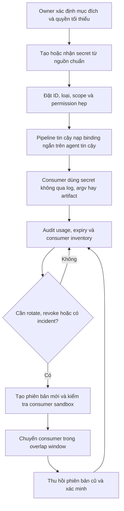

<Callout type="info" title="Phạm vi và giả định">
  Trang này nói về credential do Jenkins và plugin được phê duyệt quản lý. Ví dụ Pipeline giả định agent Linux tin cậy và plugin <strong>Credentials Binding</strong> đã được kiểm tra trên controller đích. Tên credential trong ví dụ chỉ là ID minh họa; không phải secret và không đại diện cho hệ thống production.
</Callout>

Credential giúp một job xác thực với dịch vụ khác mà không đưa giá trị bí mật vào Git. Nó không làm source code, agent, plugin hay process con trở nên đáng tin cậy. Mỗi lần một Pipeline nạp credential là một lần mở quyền sử dụng giá trị đó cho ranh giới thực thi của build.

## Mục lục

- [Mô hình và vòng đời](#mô-hình-và-vòng-đời)
- [Chọn loại credential và phạm vi](#chọn-loại-credential-và-phạm-vi)
  - [Credential ID khác giá trị credential](#credential-id-khác-giá-trị-credential)
  - [Bảng quyết định loại và scope](#bảng-quyết-định-loại-và-scope)
  - [Permission, domain và ranh giới sử dụng](#permission-domain-và-ranh-giới-sử-dụng)
- [Dùng credential trong Pipeline](#dùng-credential-trong-pipeline)
  - [withCredentials cho scope ngắn](#withcredentials-cho-scope-ngắn)
  - [Declarative credentials() theo stage](#declarative-credentials-theo-stage)
  - [File binding, workspace và nhiều executor](#file-binding-workspace-và-nhiều-executor)
- [Ranh giới tin cậy và chống lộ lọt](#ranh-giới-tin-cậy-và-chống-lộ-lọt)
- [Secret manager ngoài Jenkins](#secret-manager-ngoài-jenkins)
  - [Thiết kế tích hợp có kiểm soát](#thiết-kế-tích-hợp-có-kiểm-soát)
  - [Availability, audit và fallback](#availability-audit-và-fallback)
- [Rotation, revocation và incident response](#rotation-revocation-và-incident-response)
  - [Runbook rotation](#runbook-rotation)
  - [Khôi phục, backup và restore](#khôi-phục-backup-và-restore)
- [Lab local không dùng secret thật](#lab-local-không-dùng-secret-thật)
- [Troubleshooting an toàn](#troubleshooting-an-toàn)
- [Checklist trước khi cấp credential](#checklist-trước-khi-cấp-credential)
- [Nguồn Jenkins chính thức](#nguồn-jenkins-chính-thức)
- [Đọc tiếp](#đọc-tiếp)

## Mô hình và vòng đời

Một credential có owner, mục đích, quyền tối thiểu, consumer, thời hạn và đường thu hồi. Jenkins lưu giá trị trong credential store; Pipeline tham chiếu nó bằng ID, rồi plugin binding chỉ nạp nó trong lúc lệnh cần chạy. Sơ đồ dưới đây mô tả lifecycle cần kiểm soát, không phải một API tích hợp secret manager có sẵn trong Jenkins core.



Giá trị credential chỉ nên tồn tại trong memory, environment hoặc file tạm lâu vừa đủ cho consumer. Controller, agent, workspace, console, artifact store, cache, backup và hệ thống log đều có mô hình truy cập khác nhau. Vì vậy “đã mã hóa trong Jenkins” không phải là lý do để bỏ qua trust boundary hoặc vận hành.

## Chọn loại credential và phạm vi

### Credential ID khác giá trị credential

**Credential ID** là định danh không bí mật, ví dụ `lab-publish-token`. Nó có thể xuất hiện trong Jenkinsfile để người review biết job yêu cầu quyền nào. **Giá trị credential** là token, password, private key hoặc nội dung file phía sau ID; không commit, in, gửi trong ticket hay đặt vào JCasC/Git công khai.

ID vẫn cần đặt tên có ý nghĩa và review, vì nó tiết lộ capability hoặc môi trường mà job chạm tới. Một ID mơ hồ không làm giá trị an toàn hơn; nó chỉ làm inventory và incident response khó hơn.

### Bảng quyết định loại và scope

| Nhu cầu | Loại credential/binding phù hợp | Scope mặc định | Ghi chú an toàn |
| --- | --- | --- | --- |
| Token API một giá trị | **Secret text** với `string` | Folder của workload | Token có scope API nhỏ nhất; không ghép vào URL hoặc command line. |
| Đăng nhập có hai trường | **Username with password** với `usernamePassword` | Folder của team dùng registry | Không dựng URL `user:password@host`; coi username là metadata nhạy cảm khi phù hợp. |
| SSH deploy | **SSH Username with private key** với `sshUserPrivateKey` | Folder release hẹp | Giới hạn host/command tại hệ thống đích và kiểm tra host key; không tắt host-key checking. |
| Certificate, signing config hoặc license file | **Secret file** với `file` nếu plugin cung cấp type/binding | Folder hoặc job hẹp | Biến là path tạm, không phải nội dung; không copy, archive hay stash file. |
| Kiểu chuyên biệt, như certificate/provider credential | Credential type do plugin được phê duyệt cung cấp | Theo consumer nhỏ nhất | Xác minh plugin, version, quyền và snippet trên controller thực tế trước khi dùng. |

**System** scope dành cho Jenkins core hoặc plugin dùng nội bộ; Pipeline thông thường không nên phụ thuộc vào nó. **Global** phù hợp khi một capability thật sự cần nhiều job dùng và authorization đã được review. **Folder** cho item con một vùng tổ chức nhỏ hơn; đây thường là điểm bắt đầu an toàn cho team hay môi trường. Chọn scope hẹp nhất vẫn đáp ứng consumer hiện có, thay vì đưa credential vào Global để “tiện”.

### Permission, domain và ranh giới sử dụng

Scope không tự tạo permission. Quyền tạo, cập nhật, xem metadata và sử dụng credential phải được tách theo authorization strategy; người có thể sửa Pipeline/job cần được đánh giá như người có thể biến capability của job thành code thực thi. Cấp quyền dùng credential cho đúng folder/job và role cần thiết, không cấp quyền quản trị credential chỉ để job chạy.

**Domain** của credential, như hostname hoặc URL, chủ yếu giúp UI lọc/gợi ý khi chọn credential. Domain không phải security boundary và không ngăn một consumer hợp lệ dùng credential sai mục đích. Ranh giới thực là permission, folder/job visibility, token scope tại hệ thống đích, network policy và agent trust.

## Dùng credential trong Pipeline

Các binding dưới đây cần plugin [Credentials Binding](https://plugins.jenkins.io/credentials-binding/) và các plugin Pipeline phù hợp. Tên binding, type do plugin cung cấp và hành vi phiên bản là dữ liệu runtime: xác minh bằng **Pipeline Syntax → Snippet Generator** cùng plugin inventory của controller đích, không chỉ dựa vào ví dụ tĩnh này.

### withCredentials cho scope ngắn

Dùng `withCredentials` ngay quanh lệnh cần quyền. Dấu nháy đơn ba trong `sh` để shell, không phải Groovy, mở rộng biến. Không dùng Groovy interpolation như `"${PUBLISH_TOKEN}"`, vì giá trị có thể đi qua xử lý Pipeline trước khi shell chạy.

```groovy
withCredentials([
  string(credentialsId: 'lab-publish-token', variable: 'PUBLISH_TOKEN')
]) {
  sh '''
    set +x
    # Công cụ đọc PUBLISH_TOKEN từ environment nội bộ.
    # Không in biến, không tạo URL/header trên command line.
    ./scripts/publish-release
  '''
}
```

Với username/password, cấp hai biến riêng để client đã review đọc từ environment. Không dùng `--password "$REGISTRY_PASSWORD"`, URL chứa password, hay `curl -H "Authorization: ..."`; những cách này có thể lộ qua process listing, lịch sử lệnh hoặc log tool.

```groovy
withCredentials([
  usernamePassword(
    credentialsId: 'lab-registry-login',
    usernameVariable: 'REGISTRY_USER',
    passwordVariable: 'REGISTRY_PASSWORD'
  )
]) {
  sh '''
    set +x
    # Client nội bộ lấy hai biến từ environment, không từ argv/header command line.
    ./scripts/publish-package
  '''
}
```

### Declarative credentials() theo stage

Trong Declarative Pipeline, `credentials('id')` chỉ hợp lệ ở directive `environment`. Đặt nó ở **stage** cần secret, không ở cấp pipeline nếu các stage khác không cần. Với secret text, biến nhận giá trị secret. Với username/password, Jenkins có thể tạo biến ghép và các biến hậu tố `_USR`/`_PSW`; không in hay ghép chúng vào URL.

```groovy
pipeline {
  agent { label 'trusted-lab-linux' }

  stages {
    stage('Publish') {
      environment {
        PUBLISH_TOKEN = credentials('lab-publish-token')
      }
      steps {
        sh '''
          set +x
          ./scripts/publish-release
        '''
      }
    }
  }
}
```

`credentials()` không thay thế `withCredentials` cho SSH key hoặc secret file. Khi cần loại đó, dùng binding đúng type do plugin hỗ trợ và closure ngắn nhất.

### File binding, workspace và nhiều executor

`sshUserPrivateKey` và `file` tạo file tạm để process đọc. Đường dẫn file không phải giá trị bí mật, nhưng vẫn không nên log hoặc lưu. Đặt binding **ngoài** `dir('output')` để giảm khả năng temporary path nằm dưới workspace có thể browse; chỉ sau đó đổi thư mục làm việc.

```groovy
withCredentials([
  file(credentialsId: 'lab-signing-certificate', variable: 'CERT_FILE')
]) {
  dir('release-output') {
    sh '''
      set +x
      # Tool đọc certificate từ CERT_FILE; không cat, copy hoặc archive file.
      ./scripts/sign-release
    '''
  }
}
```

Credentials Binding dọn binding khi closure kết thúc trong điều kiện bình thường. Crash agent, mất kết nối hoặc process bị giết có thể làm cleanup bị trì hoãn. Workspace tái sử dụng, agent cố định và nhiều executor dùng cùng user/host làm tăng rủi ro process khác đọc environment, file tạm hoặc output sinh ra. Vì vậy:

- giữ closure ngắn; không copy file binding vào workspace;
- không dùng glob archive/stash/cache toàn workspace; chỉ publish output đã biết;
- không chạy PR không tin cậy song song hoặc cùng filesystem/user với build có credential;
- ưu tiên agent ephemeral đã cô lập cho capability nhạy cảm và dọn output build trong `post { always { ... } }` sau khi binding rời scope.

## Ranh giới tin cậy và chống lộ lọt

Pipeline tin cậy là Pipeline mà Jenkinsfile, Shared Library, dependency, plugin, agent image và process con trong stage đã được chấp nhận để sử dụng capability đó. Một PR từ fork hoặc branch không được tin cậy có thể sửa script để đọc environment/file, gửi dữ liệu ra ngoài hoặc nhét dữ liệu vào artifact. Không cấp credential release/production cho PR như vậy; chỉ thực hiện publish/deploy sau merge vào branch được bảo vệ hoặc approval có chủ đích, trên agent/network tách biệt.

<Callout type="error" title="Masking không phải security boundary">
  Credentials Binding có thể che một số giá trị và biến thể trong Console Output. Masking không ngăn code có credential gửi nó ra network, ghi file, encode lại, đọc process/environment hay đưa nó vào report. Đừng dùng masking để biện minh cho việc chạy code không tin cậy với secret.
</Callout>

Các đường lộ lọt cần chặn theo thiết kế:

- không commit hoặc inject giá trị vào `Jenkinsfile`, Git, JCasC public, build parameter, commit message hay ticket;
- không `echo`, `printenv`, `env`, `set`, `cat`, shell tracing `set -x`, Groovy interpolation hoặc verbose debug khi binding còn hiệu lực;
- không truyền secret qua argv, query URL, header command-line, artifact, workspace, test report, cache, notification hoặc diagnostic bundle;
- không chạy source/PR không tin cậy trên agent có credential, và không chạy workload đó trên built-in node/controller;
- nếu tool bắt buộc nhận token qua URL, argv hoặc log verbose, thay integration hoặc cô lập lại design; đừng coi đó là chấp nhận được vì console có masking.

Xem [Kiến trúc Jenkins](/docs/getting-started/architecture) để đặt controller, agent, executor và workspace vào đúng ranh giới. Hướng dẫn chi tiết về binding Pipeline nằm ở [Credentials trong Pipeline](/docs/pipelines/credentials).

## Secret manager ngoài Jenkins

Jenkins core không tự bảo đảm một kết nối native đến mọi vault hay cloud secret manager. Việc lấy secret ngoài cần **plugin/adapter** phù hợp, version đã review và cấu hình của chính hệ secret manager. Xem plugin là code trên controller: đánh giá maintainer, advisory, dependency, permission và yêu cầu Jenkins core/Java trước khi cài theo quy trình [Quản lý Jenkins plugins](/docs/administration/plugin-management).

### Thiết kế tích hợp có kiểm soát

Chọn rõ **source of truth**: hệ secret manager giữ và rotate giá trị; Jenkins giữ reference/metadata hoặc nhận giá trị runtime theo adapter đã được phê duyệt. Không tạo hai nơi cùng được phép thay đổi một secret rồi đoán precedence khi lỗi.

Một tích hợp khả dụng cần các thành phần sau:

| Thành phần | Câu hỏi cần chốt | Kiểm soát tối thiểu |
| --- | --- | --- |
| Plugin/adapter | Adapter hỗ trợ credential type và Jenkins/plugin version nào? | Pin version, review release note/advisory, thử trên controller cô lập. |
| Identity/IAM | Controller hoặc agent nào được đọc secret nào? | Service identity riêng, quyền đọc path/field tối thiểu, không dùng admin token dùng chung. |
| Network/TLS | Runtime có đi được đến endpoint đã duyệt không? | Egress allowlist, DNS/CA/TLS hợp lệ, không tắt certificate verification. |
| Retrieval | Secret được cấp lúc startup, lúc binding hay theo cache nào? | Ưu tiên credential ngắn hạn khi provider hỗ trợ; đặt TTL, giới hạn retry và quan sát expiry. |
| Audit | Ai đã đọc, đổi, revoke và dùng capability? | Audit ở secret manager, Jenkins change record và log đã redact với retention/ACL phù hợp. |

Xác minh bằng runtime trên sandbox: exact Jenkins core/JDK, plugin/adapter version, service identity, network policy và behavior khi token hết hạn. Một cấu hình tĩnh hợp lệ không chứng minh IAM, DNS, TLS, availability hay capability consumer đã hoạt động.

### Availability, audit và fallback

External manager có thể làm build thất bại vì provider outage, DNS, TLS, IAM hoặc rate limit. Xác định trước fail-closed/fail-open theo từng capability; với deploy hoặc quyền production, mặc định an toàn thường là **không lấy được thì không chạy thao tác nhạy cảm**. Retry có backoff và timeout giới hạn; không lặp vô hạn hay log request/response có thể chứa secret.

Fallback phải được quyết định trước incident. Một bản sao dài hạn trong Global credentials để “phòng vault hỏng” thường phá source of truth, làm rotation khó và mở blast radius. Nếu có fallback được phê duyệt, ghi owner, scope, expiry, audit, thời điểm dùng và quy trình xóa sau sự cố; kiểm thử nó trên sandbox như một capability riêng.

## Rotation, revocation và incident response

Rotation thay giá trị theo lịch hoặc sự kiện mà consumer vẫn hoạt động. Revocation vô hiệu hóa ngay capability khi không còn được phép dùng hoặc có nghi ngờ lộ lọt. Cả hai cần inventory consumer: job/folder, Shared Library, external integration, owner, môi trường, credential ID/reference, quyền đích và lịch chạy. Không thể rotate an toàn khi không biết ai còn dùng phiên bản cũ.

### Runbook rotation

<Steps>
<Step>

### Lập kế hoạch và kiểm tra ảnh hưởng

Xác định owner, lý do rotate, source of truth, credential ID/reference, consumer inventory, quyền tối thiểu, thời gian hết hạn và rollback owner. Đánh giá nơi credential có thể đã đi qua: log, artifact, cache, workspace, backup và hệ thống đích. Không ghi old/new value vào change record.

</Step>
<Step>

### Tạo phiên bản mới và thử ngoài production

Tạo secret/token/key mới tại source of truth với quyền hẹp. Nếu hệ thống đích cho phép, dùng overlap window có thời hạn để phiên bản cũ và mới cùng hợp lệ. Cập nhật reference/runtime mapping theo adapter đã review, rồi chạy smoke test trên agent sandbox tin cậy mà chỉ kiểm tra trạng thái thao tác hoặc metadata an toàn.

</Step>
<Step>

### Chuyển consumer có kiểm soát

Promote từng nhóm consumer theo change window. Theo dõi audit/event, lỗi xác thực và expiry mà không dump environment hay bật log nhạy cảm. Nếu consumer fail, dừng rollout; không dán giá trị mới vào Jenkinsfile để “xác nhận nhanh”.

</Step>
<Step>

### Thu hồi, xác minh và dọn inventory

Sau overlap window, revoke token/key/version cũ ở source of truth. Xác minh bằng audit rằng không còn request hợp lệ dùng phiên bản cũ, đánh dấu consumer đã chuyển và xóa reference/credential cũ theo policy. Cập nhật ngày rotate kế tiếp, owner và evidence đã redact.

</Step>
</Steps>

Khi nghi ngờ lộ lọt, coi đó là incident thay vì chỉ xóa console line. Dừng hoặc cô lập consumer khi cần, revoke/invalidate token, key, session hoặc service identity tại hệ thống phát hành; sau đó rotate secret, giới hạn egress/IAM nếu cần và điều tra phạm vi đã phát tán. Đánh giá log, artifact, cache, workspace, backup, notification và bản sao Git; người nhận các dữ liệu đó có thể cần được thông báo theo quy trình tổ chức. Chỉ mở lại capability sau khi owner xác nhận consumer mới và control bù trừ.

### Khôi phục, backup và restore

Credential metadata mã hóa và key trong `JENKINS_HOME/secrets/` phải thuộc **cùng backup generation**. Không chép lẻ `credentials.xml`, `master.key` hay file secrets giữa controller/generation để chữa lỗi; điều đó có thể làm credential không đọc được hoặc phá ranh giới bảo mật. Backup cần encryption, access control, retention, audit và restore drill trên controller cô lập.

Restore một controller có thể đưa trở lại reference/credential đã bị revoke ở external manager, hoặc khôi phục một token Jenkins cũ đã hết hạn. Sau restore, đối chiếu generation, source of truth, plugin/adapter version và trạng thái revocation trước khi cho job chạy. Runbook đầy đủ nằm ở [Backup & Restore Jenkins](/docs/administration/backup-restore); khi chẩn đoán, thu thập metadata/redacted evidence theo [Logs & Diagnostics](/docs/administration/logs), không export secret để debug.

## Lab local không dùng secret thật

Lab này kiểm tra presence, length, scope và cleanup; nó không xác minh giá trị bí mật, không gọi vault, cloud hay endpoint production. Trên controller local cô lập, ghi lại trong lab record: image Jenkins bằng **immutable digest**, Jenkins core, JDK runtime, version Credentials Binding/Pipeline và agent image/runtime. Không dùng tag di động làm bằng chứng pin.

Administrator của lab có thể tạo một **Secret text** tại folder sandbox với ID `lab-marker-only` và giá trị công khai, vô hại `jenkins-training-marker-v1`. Đây là marker kiểm thử, không phải credential có quyền. Dùng agent riêng có label `credential-lab` và không checkout repository ngoài.

```groovy
pipeline {
  agent { label 'credential-lab' }

  stages {
    stage('Verify harmless marker') {
      steps {
        withCredentials([
          string(credentialsId: 'lab-marker-only', variable: 'LAB_MARKER')
        ]) {
          sh '''
            set +x
            test -n "$LAB_MARKER"
            test "${#LAB_MARKER}" -eq 26

            LAB_ROOT="$(mktemp -d "${TMPDIR:-/tmp}/jenkins-credential-lab.XXXXXX")"
            : > "$LAB_ROOT/lab-owned.marker"
            test -f "$LAB_ROOT/lab-owned.marker"

            case "$LAB_ROOT" in
              "${TMPDIR:-/tmp}"/jenkins-credential-lab.*)
                test -f "$LAB_ROOT/lab-owned.marker" && rm -rf -- "$LAB_ROOT"
                ;;
              *)
                printf '%s\\n' 'Refuse cleanup outside the lab prefix.' >&2
                exit 1
                ;;
            esac
          '''
        }
      }
    }
  }

  post {
    always {
      deleteDir()
    }
  }
}
```

`test` chỉ trả exit status; Pipeline không in marker, path hay environment. `mktemp`, prefix `jenkins-credential-lab.`, marker file và parent guard giới hạn cleanup vào directory vừa tạo. `deleteDir()` chỉ dọn output workspace của lab sau binding; nó không phải lý do để copy file credential vào workspace.

Kết quả mong đợi là stage `SUCCESS`, không có giá trị marker, `printenv`, artifact, network call hoặc file lab còn lại. Nếu ID/binding/plugin không tồn tại, dừng lab và sửa setup trên controller sandbox; không thay bằng secret thật hay tăng quyền Global.

## Troubleshooting an toàn

| Triệu chứng | Kiểm tra có bằng chứng | Không làm | Hành động an toàn |
| --- | --- | --- | --- |
| Không thấy credential trong job | ID, type, folder scope, permission và configuration/job context | Chuyển ngay sang Global hoặc gửi giá trị qua chat | Nhờ owner kiểm tra metadata và policy; thu hẹp scope đúng consumer nếu cần. |
| `withCredentials`/binding không được nhận diện | Plugin Credentials Binding, type-provider plugin, Pipeline Syntax và version runtime | Sao chép binding từ blog rồi bỏ qua lỗi | Cài/pin plugin qua quy trình review và lấy snippet từ controller sandbox. |
| External manager trả xác thực/timeout | IAM identity, path/reference, TTL, DNS/CA/TLS, egress và audit timestamp | In token, retry vô hạn hoặc tắt TLS | Fail closed cho capability nhạy cảm, dùng request ID/thời điểm để điều tra ở provider. |
| File binding hoặc archive có rủi ro | `dir` nesting, glob artifact/stash/cache, agent lifecycle và executor sharing | `cat` file hoặc archive toàn workspace để xem | Chỉ kiểm tra metadata an toàn trong closure, thu hẹp output và dùng agent cô lập. |
| Nghi ngờ secret đã lộ | Consumer, logs, artifacts, cache, backup, SCM history và audit hệ đích | Chỉ xóa dòng console hoặc tin masking | Revoke/invalidate, rotate, giới hạn capability và làm incident response theo owner. |
| Credential lỗi sau restore | Backup generation, `secrets/` và metadata cùng generation, plugin/core compatibility | Trộn file key/credential từ controller khác | Restore lại bản nhất quán vào controller cô lập, rồi kiểm tra reference/expiry an toàn. |

## Checklist trước khi cấp credential

- [ ] Credential có owner, mục đích, hệ thống đích, consumer inventory, quyền tối thiểu, expiry và lịch rotation/revocation.
- [ ] ID rõ nghĩa nhưng giá trị không có trong Jenkinsfile, Git, JCasC public, ticket, parameter hay log.
- [ ] Type/binding do Jenkins hoặc plugin đã pin hỗ trợ được xác minh trên controller runtime; plugin advisory và compatibility đã review.
- [ ] System, Global hoặc Folder scope được chọn theo consumer nhỏ nhất; permission quản lý và sử dụng được tách theo least privilege.
- [ ] Domain chỉ được dùng như gợi ý UI, không được coi là security boundary.
- [ ] `withCredentials` hoặc `credentials()` chỉ nạp trong stage/closure ngắn; không có Groovy interpolation, argv, query URL, header command-line hay tracing secret.
- [ ] File/SSH binding không bị copy, archive, stash, cache hoặc để chung workspace/user với workload không tin cậy; agent cleanup có kế hoạch khi failure/crash.
- [ ] PR/branch không tin cậy không chạy với credential release/production, không dùng built-in node và không dùng chung agent với build tin cậy.
- [ ] External manager, nếu có, có adapter/plugin, IAM, network/TLS, audit, TTL, availability/fail-closed và fallback đã được kiểm thử; source of truth rõ ràng.
- [ ] Rotation có overlap window, inventory và bằng chứng revoke; incident response có bước invalidate token/key và đánh giá backup/restore.
- [ ] Backup/restore giữ credential metadata và key cùng generation, được mã hóa và diễn tập trên controller cô lập.

## Nguồn Jenkins chính thức

- [Using credentials](https://www.jenkins.io/doc/book/using/using-credentials/) — credential store, type, scope và permission.
- [Credentials Binding plugin](https://plugins.jenkins.io/credentials-binding/) — `withCredentials`, masking và lưu ý file/workspace.
- [Using a Jenkinsfile: handling credentials](https://www.jenkins.io/doc/book/pipeline/jenkinsfile/#handling-credentials) — `credentials()` trong Declarative Pipeline.
- [Managing Security](https://www.jenkins.io/doc/book/security/managing-security/) — authentication, authorization và quyền quản trị Jenkins.
- [Managing Plugins](https://www.jenkins.io/doc/book/managing/plugins/) — review plugin, dependency và lifecycle cập nhật.
- [Jenkins Security Advisories](https://www.jenkins.io/security/advisories/) — advisory cho Jenkins core và plugin.
- [Backing up Jenkins](https://www.jenkins.io/doc/book/system-administration/backing-up/) — bảo vệ `JENKINS_HOME`, key và restore drill.

## Đọc tiếp

<Cards>
  <Card title="Credentials trong Pipeline" href="/docs/pipelines/credentials" description="Áp dụng binding ngắn, file safety và trust boundary trong Jenkinsfile." />
  <Card title="Kiến trúc Jenkins" href="/docs/getting-started/architecture" description="Hiểu controller, agent, executor và workspace trước khi cấp capability." />
  <Card title="Quản lý Jenkins plugins" href="/docs/administration/plugin-management" description="Đánh giá adapter/plugin, pin version và security advisory." />
  <Card title="Backup & Restore Jenkins" href="/docs/administration/backup-restore" description="Bảo vệ credential metadata và key cùng một backup generation." />
  <Card title="Logs & Diagnostics" href="/docs/administration/logs" description="Chẩn đoán mà không đưa secret vào log hoặc diagnostic bundle." />
</Cards>
