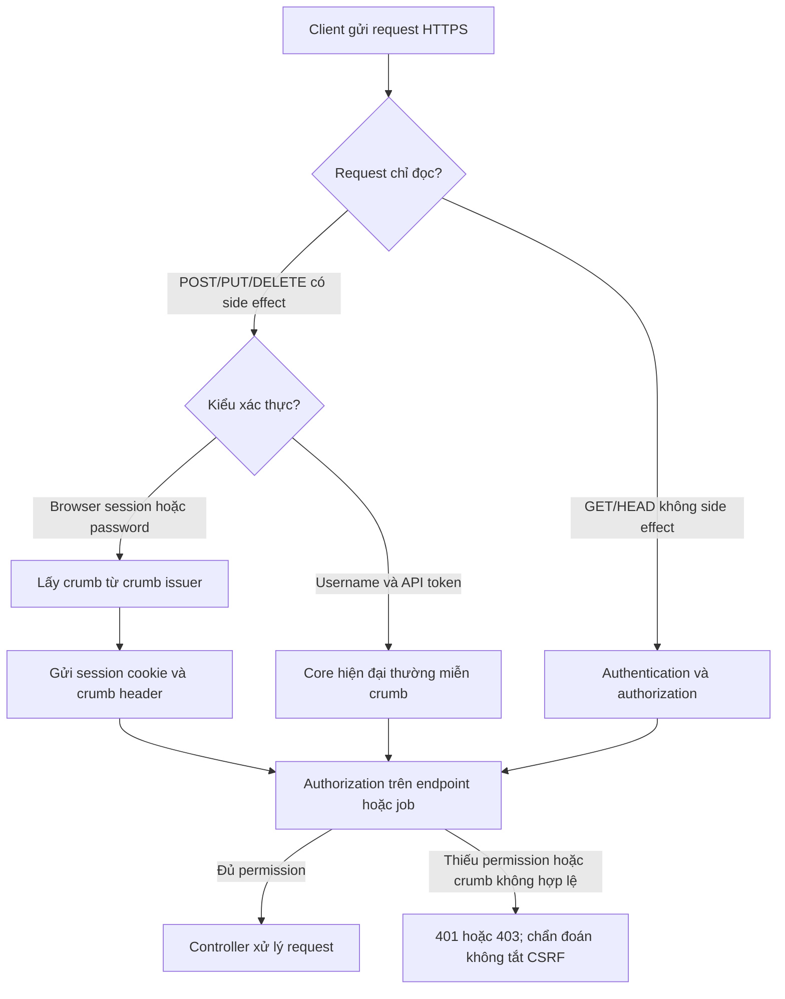

<Callout type="info" title="Phạm vi và nguyên tắc">
  Trang này áp dụng cho Jenkins controller đã bật authentication và authorization. Ví dụ chỉ dùng hostname <code>.invalid</code>, loopback hoặc sandbox; không gọi production. Giữ CSRF Protection bật và xử lý lỗi tại client, URL/proxy hoặc permission thay vì vô hiệu hóa kiểm soát toàn cục.
</Callout>

## Mục lục

- [Mục tiêu](#mục-tiêu)
- [Mô hình request và quyết định](#mô-hình-request-và-quyết-định)
  - [Luồng crumb và API token](#luồng-crumb-và-api-token)
  - [Chọn cơ chế theo client](#chọn-cơ-chế-theo-client)
- [CSRF crumb](#csrf-crumb)
  - [Threat model và request thay đổi trạng thái](#threat-model-và-request-thay-đổi-trạng-thái)
  - [Crumb issuer, endpoint và vòng đời](#crumb-issuer-endpoint-và-vòng-đời)
  - [Proxy, context path và lỗi crumb](#proxy-context-path-và-lỗi-crumb)
- [API token Jenkins](#api-token-jenkins)
  - [Danh tính, permission và token scope](#danh-tính-permission-và-token-scope)
  - [Vòng đời vận hành](#vòng-đời-vận-hành)
  - [Nơi lưu và đường lộ cần tránh](#nơi-lưu-và-đường-lộ-cần-tránh)
- [Gọi API an toàn](#gọi-api-an-toàn)
  - [Pipeline dùng HTTP Request Plugin](#pipeline-dùng-http-request-plugin)
  - [Curl với file xác thực được bảo vệ](#curl-với-file-xác-thực-được-bảo-vệ)
  - [Status, timeout, redirect và retry](#status-timeout-redirect-và-retry)
- [Lab sandbox](#lab-sandbox)
  - [Worksheet loopback không cần Jenkins](#worksheet-loopback-không-cần-jenkins)
  - [Kiểm tra trên controller sandbox khi có](#kiểm-tra-trên-controller-sandbox-khi-có)
  - [Cleanup có guard](#cleanup-có-guard)
- [Checklist trước khi tích hợp](#checklist-trước-khi-tích-hợp)
- [Nguồn Jenkins chính thức](#nguồn-jenkins-chính-thức)
- [Đọc tiếp](#đọc-tiếp)

## Mục tiêu

Sau bài này, bạn có thể phân biệt **CSRF crumb** với **API token**. Crumb chứng minh một request thay đổi trạng thái đến từ ngữ cảnh hợp lệ; nó không cấp quyền. API token xác thực một danh tính Jenkins thay cho password; permission của danh tính đó mới quyết định API được phép làm gì.

Bạn cũng có thể thiết kế automation có identity riêng, TLS, endpoint allowlist, timeout và xử lý retry không tạo thêm side effect.

## Mô hình request và quyết định

### Luồng crumb và API token



Sơ đồ mô tả Jenkins core. Plugin, security realm, crumb issuer thay thế, reverse proxy và phiên bản controller có thể làm thay đổi chi tiết runtime; hãy xác minh trên instance trước khi automation ghi dữ liệu.

### Chọn cơ chế theo client

| Client và mục đích                         | Xác thực phù hợp             | Crumb                                                                | Điều phải xác minh                                                                   |
| ------------------------------------------ | ---------------------------- | -------------------------------------------------------------------- | ------------------------------------------------------------------------------------ |
| Trình duyệt của người dùng, đọc trang      | Browser session/cookie       | Không cho GET/HEAD chỉ đọc                                           | GET thực sự không có side effect; account có `Read` cần thiết.                       |
| Trình duyệt gửi form hoặc thao tác UI      | Browser session/cookie       | Cần cho thao tác thay đổi                                            | Crumb issuer, cookie phiên hiện tại, header/field crumb và permission thao tác.      |
| Script/agent automation gọi API Jenkins    | Service identity + API token | Jenkins core hiện đại miễn crumb cho request xác thực bằng API token | Core, plugin/SSO/proxy và endpoint trên chính controller có giữ semantics này không. |
| Client dùng password hoặc session thủ công | Identity được cấp phép       | Lấy crumb rồi gửi lại cùng cookie/session                            | Cookie jar bảo vệ, TTL session và crumb; không dùng password trong URL/argv.         |

`GET` không tự động an toàn chỉ vì method của nó là GET: endpoint thiết kế đúng không được thay đổi state khi đọc. Ngược lại, build trigger, thay đổi config, delete hoặc các API `POST`/`PUT`/`DELETE` là mutation và cần authorization server-side, dù client có crumb hay token.

## CSRF crumb

### Threat model và request thay đổi trạng thái

CSRF (Cross-Site Request Forgery) xảy ra khi một user đã đăng nhập Jenkins mở một site khác, site đó khiến browser gửi request mang cookie Jenkins của nạn nhân. Nếu Jenkins chỉ tin cookie, kẻ tấn công có thể cố trigger build hoặc sửa cấu hình với quyền của user.

Jenkins gọi CSRF token là **crumb**. Crumb bổ sung bằng chứng mà site thứ ba không thể tùy ý đọc từ Jenkins. Form submission và request tương tự làm thay đổi trạng thái phải gửi crumb. Crumb không thay authentication, authorization, input validation hay `@RequirePOST` của plugin endpoint.

<Callout type="warn" title="Không sửa lỗi bằng cách tắt CSRF">
  `403 No valid crumb` là tín hiệu kiểm tra request method, session, crumb issuer, Jenkins URL, context path, forwarded headers và permission. Không vô hiệu hóa CSRF Protection toàn controller, kể cả với mạng nội bộ tin cậy.
</Callout>

### Crumb issuer, endpoint và vòng đời

**Default Crumb Issuer** tạo crumb gắn với user và web session; tùy cấu hình nó còn xét client IP. Jenkins core công bố crumb qua `/crumbIssuer/api/...`; JSON thường là `/crumbIssuer/api/json` và trả `crumbRequestField` cùng `crumb`. Client dùng chính tên field trả về làm HTTP header hoặc form field, thay vì hard-code `Jenkins-Crumb`.

Với browser/session hoặc username/password, chuỗi đúng là:

1. gọi crumb endpoint qua **cùng base URL**;
2. giữ `Set-Cookie` trong cookie jar được bảo vệ;
3. gửi lại cookie phiên và crumb cho mutation kế tiếp;
4. lấy crumb mới khi session hết hạn, user đổi, issuer/config đổi hoặc controller từ chối crumb cũ.

Crumb có thể hết hiệu lực khi session đổi; đừng lưu nó như credential dài hạn hoặc đưa vào log. Plugin có thể cung cấp issuer khác, chẳng hạn issuer có policy IP khác, nên không suy luận cấu trúc/hash hay thời gian sống từ response.

### Proxy, context path và lỗi crumb

Nếu URL ngoài là `https://ci.example.invalid/jenkins/`, cả request crumb và request API phải dùng prefix `/jenkins/`. Proxy cần chuyển đúng `Host`, scheme/port và context path để Jenkins nhận diện URL công khai nhất quán. Cookie/session, redirect và các kiểm tra origin có thể hỏng nếu browser vào một URL còn client API dùng URL khác.

Khi `403 No valid crumb` xảy ra sau proxy, kiểm tra theo thứ tự: URL canonical trong **Manage Jenkins → System**, prefix Jenkins/proxy, `Host` và forwarded scheme/port do edge đáng tin cậy ghi đè, cookie/session, sau đó crumb issuer. Không tin forwarded header do client Internet tự gửi và không public upstream controller để thử.

## API token Jenkins

### Danh tính, permission và token scope

API token là credential của **một user Jenkins** và thay password của user đó cho scripted client. Tạo service identity riêng cho integration, không dùng token của nhân viên hoặc shared administrator. Identity vẫn chịu authorization strategy và permission trên controller, folder, job hoặc endpoint.

| Khái niệm                 | Ý nghĩa thực tế                                                            | Không có nghĩa là                                                             |
| ------------------------- | -------------------------------------------------------------------------- | ----------------------------------------------------------------------------- |
| Permission của identity   | Ví dụ `Overall/Read`, `Job/Read`, `Job/Build` trên đúng folder/job         | Token có quyền độc lập hoặc mặc định là administrator.                        |
| Permission endpoint/job   | Endpoint cụ thể còn yêu cầu quyền tương ứng; plugin có thể thêm permission | Có `Overall/Read` là được trigger mọi job.                                    |
| Token Jenkins core        | Một secret xác thực user, có tên để vận hành/audit và có thể thu hồi       | Arbitrary fine-grained scope gắn trực tiếp vào từng token trong Jenkins core. |
| Scope của plugin/provider | OAuth, cloud hoặc plugin có thể định nghĩa scope riêng                     | Scope đó là semantics chung của mọi API token Jenkins.                        |

Nói ngắn gọn: cụm “token scope” trong Jenkins core thường phải được tách thành **identity permission** và **endpoint/job permission**. Chỉ nói token có scope riêng khi plugin hoặc provider đang dùng có tài liệu chứng minh điều đó.

### Vòng đời vận hành

1. **Tạo:** owner tạo token cho service identity theo UI/API được tổ chức phê duyệt, đặt tên mô tả một integration. Giá trị token chỉ được hiển thị/lưu vào secret manager đúng thời điểm tạo.
2. **Lưu:** đưa token vào secret store hoặc Jenkins Credentials bảo vệ. Một integration dùng một token; không tái dùng token publish, observability và deploy.
3. **Cấp quyền:** chỉ cấp permission nhỏ nhất trên folder/job/endpoint cần gọi. Thử identity đó trong sandbox thay vì xác nhận bằng account admin.
4. **Audit:** ghi owner, integration, credential ID hoặc token name, permission, ngày tạo, lần dùng/rotation theo năng lực audit của instance. Không ghi giá trị token.
5. **Rotate:** tạo token thay thế, cập nhật một consumer tại một thời điểm, xác minh request sandbox, rồi revoke token cũ sau cửa sổ chuyển đổi.
6. **Revoke:** thu hồi ngay token của integration ngừng dùng, nhân sự rời vai trò hoặc nghi ngờ lộ. Điều tra log, artifact và process có thể đã nhận token; xóa log không thu hồi bản sao.

Dùng HTTPS/TLS với certificate/CA được tin cậy cho mọi token request. Không dùng `curl -k`, `ignoreSslErrors: true`, redirect sang host khác hay một proxy có certificate không được kiểm soát để “chữa” lỗi kết nối.

### Nơi lưu và đường lộ cần tránh

Token không được xuất hiện trong URL, query string, Git, Jenkinsfile, shell history, command-line/argv, `Authorization` header do shell dựng, console log, artifact, workspace, test report, ticket hay process listing. Cũng không coi environment variable là an toàn tuyệt đối: process con, debug dump và user cùng host có thể đọc nó tùy môi trường.

Với Pipeline, ưu tiên `httpRequest(authentication: 'credential-id', ...)` hoặc một client có secret descriptor/file được bảo vệ. Với tool bắt buộc dùng `curl`, dùng file xác thực do secret system tạo ngoài repository, quyền đọc tối thiểu; không dùng `curl -u user:token` hoặc `-H "Authorization: Bearer $TOKEN"`.

## Gọi API an toàn

### Pipeline dùng HTTP Request Plugin

Ví dụ này giả định **HTTP Request Plugin** đã được phê duyệt, `lab-api-client` là credential **Username with password** trong đó password là API token của service identity sandbox, và job đích đã được owner chuẩn bị. `authentication` chỉ là credential ID: plugin đọc secret từ Jenkins credential store, không nạp nó vào Groovy hay shell argv.

Host được cố định trong Jenkinsfile như một allowlist một phần tử; không ghép URL từ parameter hoặc input. TLS verification giữ bật, redirect bị từ chối để credential không theo sang đích khác, response body không in console và status ngoài `2xx` làm step thất bại. Kiểm tra `followRedirects`, `authentication` và các tham số trên **Pipeline Syntax → Snippet Generator** của version plugin đang chạy.

```groovy
pipeline {
  agent { label 'sandbox-linux' }

  options {
    skipDefaultCheckout(true)
    timeout(time: 3, unit: 'MINUTES')
  }

  stages {
    stage('Read-only preflight: retry giới hạn') {
      steps {
        script {
          retry(2) {
            httpRequest(
              authentication: 'lab-api-client',
              consoleLogResponseBody: false,
              followRedirects: false,
              httpMode: 'GET',
              ignoreSslErrors: false,
              timeout: 10,
              url: 'https://ci-lab.example.invalid/jenkins/api/json',
              validResponseCodes: '200'
            )
          }
        }
      }
    }

    stage('Mutation có REQUEST_ID') {
      steps {
        script {
          def requestId = 'lab-request-001'
          try {
            def response = httpRequest(
              authentication: 'lab-api-client',
              consoleLogResponseBody: false,
              contentType: 'APPLICATION_FORM',
              followRedirects: false,
              httpMode: 'POST',
              ignoreSslErrors: false,
              requestBody: "REQUEST_ID=${requestId}",
              timeout: 15,
              url: 'https://ci-lab.example.invalid/jenkins/job/sandbox-api/buildWithParameters',
              validResponseCodes: '200:299'
            )
            echo "Sandbox request accepted; HTTP status ${response.status}; request ID ${requestId}."
          } catch (Exception failure) {
            echo "POST was not confirmed; inspect sandbox queue/build using REQUEST_ID=${requestId}."
            throw failure
          }
        }
      }
    }
  }
}
```

`retry(2)` chỉ bao request `GET` idempotent. Không retry `POST` sau timeout, reset hoặc lỗi không rõ server đã nhận request chưa: Jenkins Remote API không cung cấp idempotency key chung cho mọi mutation. Job sandbox phải tự lưu/kiểm tra `REQUEST_ID` ở nơi bền vững và không lặp side effect khi gặp lại cùng ID. Sau lỗi mơ hồ, chỉ dùng GET để tìm queue/build theo quy ước của job rồi điều tra trước khi gửi lại.

`httpRequest` là plugin, không phải Jenkins core; credential type, redirect behavior, response code của endpoint và compatibility phải được kiểm tra trên sandbox sau mỗi thay đổi plugin/core. Không thêm custom auth header hoặc token vào code chỉ để tránh giới hạn của plugin.

### Curl với file xác thực được bảo vệ

Khi không thể dùng client credential-aware, file `netrc` do secret manager provision ngoài repository là lựa chọn giảm lộ token qua argv. File phải thuộc service user, mode `0600`, có hostname khớp chính xác allowlist. Nội dung file là secret nên không `cat`, commit, archive hoặc in trong lab. Descriptor của file nêu machine `ci-lab.example.invalid` và login `sandbox-api-client`; dòng password được secret manager provision trực tiếp vào file, không xuất hiện trong tài liệu hay script.

Đặt biến không chứa secret và lấy crumb vào cookie jar tạm có quyền chặt chẽ. JSON crumb không in ra; crumb không phải API token nhưng vẫn là dữ liệu phiên cần tránh log.

```bash
#!/usr/bin/env bash
set -euo pipefail
umask 077

JENKINS_URL='https://ci-lab.example.invalid/jenkins'
JENKINS_AUTH_FILE="$HOME/.config/jenkins/lab-api.netrc"
COOKIE_JAR="$(mktemp)"
trap 'rm -f "$COOKIE_JAR"' EXIT

crumb_json=$(curl --fail-with-body --silent --show-error \
  --connect-timeout 5 --max-time 20 \
  --netrc-file "$JENKINS_AUTH_FILE" \
  --cookie-jar "$COOKIE_JAR" \
  "$JENKINS_URL/crumbIssuer/api/json")
crumb_field=$(printf '%s' "$crumb_json" | jq -er '.crumbRequestField')
crumb_value=$(printf '%s' "$crumb_json" | jq -er '.crumb')

# Chỉ gọi endpoint sandbox đã phê duyệt; token vẫn chỉ nằm trong netrc file.
curl --fail-with-body --silent --show-error \
  --connect-timeout 5 --max-time 20 \
  --netrc-file "$JENKINS_AUTH_FILE" \
  --cookie "$COOKIE_JAR" \
  --request POST \
  --header "$crumb_field: $crumb_value" \
  --data 'REQUEST_ID=lab-request-001' \
  "$JENKINS_URL/job/sandbox-api/buildWithParameters" \
  --output /dev/null
```

Header crumb là bắt buộc cho flow session/password và không chứa API token. Token không được shell-expand vào command. Với API-token authentication, Jenkins core hiện đại thường miễn crumb; đoạn này cố ý lấy crumb để tương thích controller yêu cầu crumb. Nếu `curl` báo non-zero hoặc timeout, không in `crumb_json`, cookie, header hay netrc và không retry POST mù.

### Status, timeout, redirect và retry

| Tình huống                          | Hành động client                                                                    | Không làm                                             |
| ----------------------------------- | ----------------------------------------------------------------------------------- | ----------------------------------------------------- |
| `200` cho GET                       | Parse trường cần thiết; chỉ retry lỗi tạm thời với backoff/jitter có giới hạn.      | Lấy toàn bộ API response hoặc poll mỗi giây.          |
| `201`, `302` hoặc `303` từ mutation | Xem là request có thể đã được nhận; theo queue/build bằng GET và `REQUEST_ID`.      | Coi là build đã hoàn tất.                             |
| `401`                               | Kiểm tra host, service identity, token còn hiệu lực và secret descriptor.           | Dán token vào URL, `curl -u` hay log để thử.          |
| `403`                               | Tách permission từ crumb/session/proxy; kiểm tra crumb issuer và URL canonical.     | Cấp `Overall/Administer` hoặc tắt CSRF.               |
| `429`, `5xx`, reset, timeout        | Backoff cho GET; với POST, quan sát trạng thái trước khi quyết định xử lý thủ công. | Retry mutation tự động không có hợp đồng idempotency. |
| `3xx` redirect                      | Từ chối redirect, kiểm tra host/scheme/context path và allowlist.                   | Theo redirect có thể mang auth sang host khác.        |

Luôn đặt connect timeout, tổng timeout, TLS verification và hostname allowlist. Audit nên ghi service identity, credential ID/token name, endpoint đã chuẩn hóa, `REQUEST_ID`, HTTP status và thời gian; tuyệt đối không ghi token, cookie, crumb, authorization header, request body nhạy cảm hay response đầy đủ.

## Lab sandbox

### Worksheet loopback không cần Jenkins

Lab tĩnh dưới đây kiểm tra rằng client gửi GET/POST đến **loopback** và phân biệt method, không kiểm tra crumb issuer thật. Chạy trong thư mục tạm riêng, không chứa credential/token và không có process production.

```bash
set -euo pipefail
LAB_ROOT="${TMPDIR:-/tmp}/jenkins-csrf-lab-$$"
mkdir -p "$LAB_ROOT"
printf 'GET is read-only worksheet\n' > "$LAB_ROOT/index.html"
python3 -m http.server 18080 --bind 127.0.0.1 --directory "$LAB_ROOT" &
LAB_PID=$!
trap 'kill "$LAB_PID" 2>/dev/null || true; rm -rf -- "$LAB_ROOT"' EXIT
sleep 1

curl --fail --silent --show-error --connect-timeout 2 --max-time 5 \
  http://127.0.0.1:18080/ >/dev/null
post_status=$(curl --silent --output /dev/null --write-out '%{http_code}' \
  --connect-timeout 2 --max-time 5 --request POST http://127.0.0.1:18080/)
test "$post_status" = '501'
printf 'Worksheet verified: GET=200, POST=%s; this is not a Jenkins crumb test.\n' "$post_status"
```

Kết quả mong đợi: GET trả `200`, còn Python static server từ chối POST bằng `501`. Đây là bằng chứng method/loopback và timeout của worksheet, không phải bằng chứng CSRF Jenkins hoạt động.

### Kiểm tra trên controller sandbox khi có

Chỉ thực hiện khi có controller sandbox HTTPS, service identity quyền tối thiểu, job disposable `sandbox-api` được owner phê duyệt và một credential đã provision. Không tạo token trong script, không dùng job production, không sửa global security hay plugin.

1. Dùng request GET `/api/json` với `httpRequest(authentication: 'lab-api-client', ...)` để kiểm tra TLS, allowlist, identity và `Overall/Read`.
2. Với session/password flow, gọi `/crumbIssuer/api/json`, giữ cookie jar và gửi header field đúng response cho POST. Ghi nhận `403 No valid crumb` khi cố ý bỏ crumb **chỉ trên sandbox**, sau đó ghi nhận POST có crumb theo job disposable.
3. Với API-token flow, thử POST cùng service identity trên controller đó. Jenkins core hiện đại thường chấp nhận không crumb; nếu nhận `403`, ghi version core, issuer, auth/proxy/plugin context và dùng flow crumb khi policy instance yêu cầu. Không kết luận từ một controller sang controller khác.
4. Sau mỗi POST, dùng GET kiểm tra queue/build và `REQUEST_ID`; timeout không đủ bằng chứng request chưa đến controller.

Không phải environment nào cũng có HTTP Request Plugin, `jq`, Python, crumb issuer mặc định hoặc job nhận `REQUEST_ID`. Đây là giới hạn runtime/plugin của lab; thay thế bằng client/version mà instance công bố, rồi lặp lại kiểm tra trong sandbox.

### Cleanup có guard

Lab loopback tự dọn đúng thư mục có prefix `jenkins-csrf-lab-` qua `trap`. Nếu cleanup thủ công, chỉ xóa sau khi guard xác nhận path nằm dưới thư mục tạm và basename mang prefix đó:

```bash
case "${LAB_ROOT:-}" in
  "${TMPDIR:-/tmp}"/jenkins-csrf-lab-*) rm -rf -- "$LAB_ROOT" ;;
  *) printf 'Refuse cleanup outside the guarded sandbox path.\n' >&2; exit 1 ;;
esac
```

Không dùng cleanup để xóa job/controller, credential, token, volume, build history hay dữ liệu ngoài marker sandbox.

## Checklist trước khi tích hợp

- [ ] Mutation dùng POST/PUT/DELETE theo contract và authorization server-side; CSRF Protection vẫn bật.
- [ ] Browser/session flow giữ crumb cùng session cookie, dùng `crumbRequestField` runtime và xử lý expiry.
- [ ] API token thuộc service identity riêng; permission hẹp ở folder/job/endpoint và không được mô tả sai là arbitrary core token scope.
- [ ] Token có owner, token name/credential ID, inventory, audit, kế hoạch rotate và revoke.
- [ ] Token không có trong URL, Git, argv, shell history, direct auth header, log, artifact, workspace, report hay process listing.
- [ ] HTTPS, CA/certificate, hostname allowlist, context path, proxy headers và redirect behavior đã được kiểm tra trên instance.
- [ ] Client có timeout, non-2xx handling và backoff giới hạn; chỉ retry GET hoặc mutation có contract idempotency đã xác minh.
- [ ] HTTP Request Plugin, crumb issuer, security realm, SSO/proxy và endpoint/job semantics đã được xác minh trong sandbox sau thay đổi version.
- [ ] Lab chỉ chạm loopback/sandbox marker; cleanup guard không thể xóa dữ liệu khác.

## Nguồn Jenkins chính thức

- [CSRF Protection](https://www.jenkins.io/doc/book/security/csrf-protection/) — crumb issuer, session và miễn crumb cho API token trong Jenkins core.
- [Remote Access API](https://www.jenkins.io/doc/book/using/remote-access-api/) — HTTP API, authentication, response và API token được ưu tiên.
- [API token](https://www.jenkins.io/doc/book/using/using-credentials/#api-token) — token của user và credential store.
- [Access Control](https://www.jenkins.io/doc/book/security/access-control/) — authentication, authorization và permission.
- [Jenkins CLI](https://www.jenkins.io/doc/book/managing/cli/) — lựa chọn CLI/transport và authentication theo controller.
- [HTTP Request Plugin](https://plugins.jenkins.io/http_request/) — khả năng `httpRequest` và compatibility plugin cần kiểm tra runtime.

## Đọc tiếp

<Cards>
  <Card title="Credentials trong Pipeline" href="/docs/pipelines/credentials" description="Nạp credential đúng scope và tránh lộ secret trong Pipeline." />
  <Card title="CLI & REST API" href="/docs/administration/cli-rest-api" description="Thiết kế remote API, queue polling và mutation có kiểm soát." />
  <Card title="Reverse Proxy & TLS" href="/docs/installation/reverse-proxy-tls" description="Làm khớp URL public, prefix và forwarded headers với Jenkins." />
  <Card title="Authentication" href="/docs/security/authentication" description="Chọn identity và cơ chế đăng nhập trước khi cấp token automation." />
</Cards>
