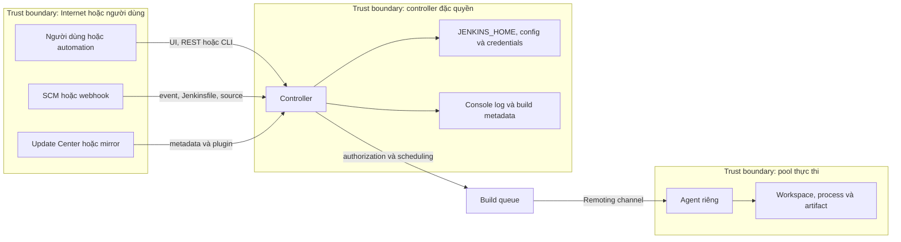

<Callout type="warn" title="Phạm vi của bài học">
  Đây là mô hình để phân tích và review, không phải hướng dẫn nới quyền để một build chạy được. Không tắt security, không phê duyệt Script Approval chỉ vì build báo lỗi, và không dùng credential hay controller production cho lab.
</Callout>

## Mục lục

- [Mục tiêu đo được](#mục-tiêu-đo-được)
- [Mô hình: tài sản, luồng và ranh giới](#mô-hình-tài-sản-luồng-và-ranh-giới)
  - [Sơ đồ threat-model](#sơ-đồ-threat-model)
  - [Bảng tài sản và kiểm soát](#bảng-tài-sản-và-kiểm-soát)
- [Attack surface của Jenkins](#attack-surface-của-jenkins)
- [Identity trước, quyền sau](#identity-trước-quyền-sau)
  - [Security realm là nguồn identity](#security-realm-là-nguồn-identity)
  - [Authorization strategy quyết định permission](#authorization-strategy-quyết-định-permission)
  - [Least privilege và deny-by-default](#least-privilege-và-deny-by-default)
  - [Đọc permission mà không cấp quá tay](#đọc-permission-mà-không-cấp-quá-tay)
- [Controller, agent và code không tin cậy](#controller-agent-và-code-không-tin-cậy)
  - [Built-in node không phải agent cô lập](#built-in-node-không-phải-agent-cô-lập)
  - [Remoting, workspace và network](#remoting-workspace-và-network)
  - [Sandbox, Script Approval và plugin](#sandbox-script-approval-và-plugin)
- [Secret và các kiểm soát dễ bị hiểu nhầm](#secret-và-các-kiểm-soát-dễ-bị-hiểu-nhầm)
- [Ví dụ Jenkinsfile không có secret](#ví-dụ-jenkinsfile-không-có-secret)
- [Lab local: worksheet threat-model](#lab-local-worksheet-threat-model)
  - [Điều kiện và an toàn](#điều-kiện-và-an-toàn)
  - [Tạo inventory có thể lặp lại](#tạo-inventory-có-thể-lặp-lại)
  - [Đọc kết quả và quyết định](#đọc-kết-quả-và-quyết-định)
- [Troubleshooting an toàn](#troubleshooting-an-toàn)
- [Checklist review](#checklist-review)
- [Tự kiểm tra](#tự-kiểm-tra)
- [Nguồn Jenkins chính thức](#nguồn-jenkins-chính-thức)
- [Đọc tiếp](#đọc-tiếp)

## Mục tiêu đo được

Sau bài này, bạn có thể:

1. lập bảng threat model cho một Jenkins controller, liệt kê ít nhất tám attack surface và gắn mỗi bề mặt với một asset, actor, trust boundary, control và evidence;
2. phân biệt chính xác **security realm** (ai là identity sau authentication) với **authorization strategy** (identity đó được phép làm gì), rồi chỉ ra vì sao đổi lớp này không thay thế lớp kia;
3. phân loại một workload vào `untrusted`, `trusted-ci` hoặc `trusted-release`, và giải thích vì sao built-in node của controller không phù hợp với hai loại đầu;
4. review một Jenkinsfile để tìm secret, quyền ngầm, đường input thành code và giả định sai về label, crumb hoặc log masking;
5. đề xuất một permission tối thiểu có evidence, thay vì cấp `Overall/Administer` hoặc mở rộng toàn cục để xử lý một lỗi đơn lẻ.

## Mô hình: tài sản, luồng và ranh giới

Threat model bắt đầu bằng câu hỏi: **ai có thể đưa dữ liệu nào vào đâu, rồi dữ liệu đó có thể tác động tài sản nào?** Jenkins có giá trị cao vì controller tập trung cấu hình job, plugin, credentials, lịch sử build và quyền điều phối. Một thay đổi Jenkinsfile, webhook hoặc plugin có thể đi xa hơn một request UI thông thường.

### Sơ đồ threat-model



Mũi tên là luồng cần review, không khẳng định mọi dữ liệu đều đi qua controller theo cùng cách. Artifact Manager, launcher và plugin có thể đổi đường dữ liệu. Khi triển khai thật, vẽ thêm DNS, reverse proxy, registry, artifact store, secret manager và network egress đang có; không suy đoán từ sơ đồ chung.

### Bảng tài sản và kiểm soát

| Tài sản hoặc bề mặt             | Actor có thể tác động                | Trust boundary                    | Control ưu tiên                                                         | Evidence cần giữ                                             |
| ------------------------------- | ------------------------------------ | --------------------------------- | ----------------------------------------------------------------------- | ------------------------------------------------------------ |
| UI/Stapler và REST API          | user, browser, API client            | Internet/người dùng → controller  | HTTPS, authentication, authorization, CSRF cho phiên browser            | cấu hình security, access review, log đã redaction           |
| CLI và automation token         | automation, operator                 | client → controller               | API token theo owner, scope quyền tối thiểu, rotation/revocation        | owner, quyền thực tế, thời hạn review                        |
| Webhook/SCM và Jenkinsfile      | SCM provider, contributor, fork      | source không tin cậy → job/agent  | xác thực webhook theo tích hợp, branch/review policy, pool untrusted    | event ID, revision, job policy, queue/node record            |
| Plugin và Update Center         | admin, mirror operator, upstream     | supply chain → controller         | allowlist, provenance, version set đã review, advisory process          | `shortName:version`, source/mirror, advisory, staging result |
| `JENKINS_HOME` và credentials   | controller process, host admin       | controller → filesystem           | quyền filesystem tối thiểu, backup được kiểm chứng, host isolation      | backup ID, ownership, restore drill                          |
| Remoting controller–agent       | agent process, network attacker      | controller → execution pool       | agent identity, TLS/transport đúng, firewall tối thiểu, pool separation | node log, version/transport, network rule review             |
| Workspace, cache, artifact, log | build code, người có quyền đọc build | agent/job → dữ liệu tồn lưu       | per-tier isolation, retention, cleanup, artifact ACL, redaction         | retention policy, access review, scan result                 |
| Network egress từ agent         | build dependency, script độc hại     | agent → external/internal service | egress allowlist, identity riêng, DNS/proxy policy                      | flow log, allowlist, owner                                   |

`Evidence` không phải ảnh chụp màn hình duy nhất. Một thay đổi an toàn cần dữ liệu có thể đối chiếu: revision Jenkinsfile, record quyền, node/pool, plugin version, log đã loại secret và kết quả test sandbox.

## Attack surface của Jenkins

Attack surface là tập các điểm mà input, code, identity hoặc kết nối có thể đi vào hệ thống. Không phải điểm nào cũng mở ra Internet; một cổng chỉ nội bộ vẫn là attack surface nếu actor khác trust level có thể chạm tới nó.

| Bề mặt                 | Rủi ro điển hình                                                           | Câu hỏi review                                                                  |
| ---------------------- | -------------------------------------------------------------------------- | ------------------------------------------------------------------------------- |
| UI/Stapler             | request làm đổi configuration, endpoint plugin có lỗi, session bị lạm dụng | Có HTTPS, realm và strategy hoạt động; người dùng nào thật sự cần endpoint này? |
| REST API và CLI        | token bị lộ hoặc client có quyền rộng                                      | Token thuộc owner nào, có quyền nào và có thể thu hồi không?                    |
| Webhook/SCM            | event giả, thay Jenkinsfile/source, PR fork                                | Trigger được xác thực thế nào; revision nào được chạy trên pool nào?            |
| Plugins                | mã trên controller, dependency dễ tổn thương, cấu hình endpoint mới        | Có cần plugin không; source, version, dependency, advisory và owner là gì?      |
| Update Center/mirror   | metadata/artifact bị thay hoặc tải không kiểm soát                         | Chỉ endpoint đã duyệt được dùng; có provenance và staging không?                |
| Controller–agent       | agent giả mạo/bị chiếm, transport sai, lộ secret agent                     | Agent có được quản trị; controller URL/TLS/firewall có đúng không?              |
| Filesystem             | đọc/ghi `JENKINS_HOME`, plugin, workspace, cache tồn dư                    | User chạy Jenkins có quyền tối thiểu; backup/restore có cùng generation không?  |
| Network                | egress để exfiltrate, lateral movement, service nội bộ tin cậy nhầm        | Mỗi pool chỉ đến được các destination cần thiết chưa?                           |
| Log/artifact/workspace | secret hoặc dữ liệu cross-job bị đọc lại                                   | Ai đọc được build; retention, ACL và cleanup có kiểm chứng không?               |

Đừng giảm threat model thành danh sách port. `Jenkinsfile`, dependency build và plugin cũng là input có khả năng dẫn đến code execution. Ngược lại, một label như `trusted-release` chỉ giúp scheduler chọn pool; nó không xác thực người gọi và không tự tạo ACL, network policy hay sandbox.

## Identity trước, quyền sau

### Security realm là nguồn identity

**Authentication** trả lời “bạn là ai?”. Jenkins dùng **security realm** để xác minh và nạp identity, ví dụ tài khoản nội bộ, LDAP hoặc identity provider. Kết quả là principal/user và các group claim mà realm cung cấp.

Security realm không quyết định user đó được đọc job, trigger build hay quản lý plugin. Một realm hoạt động tốt nhưng authorization strategy quá rộng vẫn có thể cấp quá nhiều quyền. Ngược lại, strategy chặt nhưng realm nhận nhầm group vẫn cho ra quyết định sai.

### Authorization strategy quyết định permission

**Authorization** trả lời “identity này được làm gì trên resource nào?”. Authorization strategy ánh xạ user/group đã xác thực — và có thể cả `anonymous` — sang permission Jenkins. Strategy có thể là ma trận quyền, role-based strategy do plugin cung cấp, hoặc strategy khác đã được đội vận hành phê duyệt.

Luồng đúng là:

```text
request → security realm xác thực identity → authorization strategy kiểm permission
        → Jenkins/plugin thực hiện hoặc từ chối action → audit/log đã redaction
```

Đổi security realm có thể đổi danh sách user/group. Đổi authorization strategy có thể đổi policy quyền. Hai thay đổi phải được review và kiểm thử riêng; không “sửa authorization” bằng cách tạo một user admin mới, cũng không “sửa authentication” bằng cách gán thêm `Overall/Administer`.

### Least privilege và deny-by-default

**Deny-by-default** nghĩa là permission không được cấp thì action bị từ chối. Bắt đầu với quyền đọc/ thao tác nhỏ nhất cần cho một role, rồi thêm đúng permission dựa trên use case và evidence. Đặc biệt, không cấp một quyền global chỉ vì một job/folder cần nó.

**Least privilege** áp dụng theo bốn chiều:

- **identity:** group hoặc service account có owner rõ ràng, không dùng account chung;
- **resource:** cấp tại folder/job/node/view hẹp nhất mà strategy hỗ trợ;
- **action:** đọc, build, cấu hình, xóa, replay là các hành động khác nhau;
- **thời gian:** token, membership, exception và access review có expiry/chu kỳ kiểm tra.

`anonymous` là identity đặc biệt đại diện request chưa đăng nhập. Nếu cấp `Overall/Read` hay `Job/Read` cho `anonymous`, bạn chủ động công khai phần tương ứng theo strategy; điều đó không phải “chỉ mở trang login”. Với controller nội bộ, mặc định an toàn là không cấp anonymous access trừ khi có yêu cầu đã review.

### Đọc permission mà không cấp quá tay

Tên permission và quan hệ ngụ ý có thể thay đổi theo Jenkins core, plugin và authorization strategy. Trước khi cấp, mở bảng quyền của **đúng controller đang review**, kiểm tra bản ghi UI/help và test bằng identity sandbox. Bảng sau là nghĩa vận hành cần phân biệt, không phải một template cấp quyền để copy nguyên xi.

| Nhóm permission | Nó kiểm soát                                                                                     | Không đồng nghĩa với                                                                                       |
| --------------- | ------------------------------------------------------------------------------------------------ | ---------------------------------------------------------------------------------------------------------- |
| `Overall`       | quyền tổng quát như vào Jenkins (`Read`) và quản trị toàn hệ thống (`Administer`)                | `Overall/Read` không tự cho đọc mọi job; `Administer` không phải quyền sửa lỗi build mặc định              |
| `Job`           | khám phá/đọc job, trigger build, cấu hình, xóa và có thể đọc workspace tùy permission            | `Job/Build` không biến người gọi thành admin; `Job/Workspace` có thể lộ source/file tạm nên rất nhạy cảm   |
| `Agent`         | tạo/cấu hình/kết nối/ngắt hoặc dùng agent theo permission được strategy/UI trình bày             | label không phải permission; quyền agent không thay thế OS, SSH, Remoting hay network control              |
| `View`          | tạo, đọc, cấu hình hoặc xóa một view                                                             | view chỉ tổ chức/hiển thị job; không phải ranh giới bảo vệ job hoặc artifact                               |
| `Run`           | thao tác trên một build run, như đọc metadata, cập nhật, xóa hoặc replay khi capability được cài | quyền Run không mặc nhiên cho sửa Jenkinsfile/job; replay Pipeline có thể làm chạy code khác và cần review |

`Overall/Administer` là quyền toàn cục có tác động lớn: thay security, plugin, nodes, credentials và cấu hình controller. Chỉ cấp cho một nhóm quản trị nhỏ, có owner và quy trình break-glass. Không cấp nó cho developer, service account webhook hoặc job chỉ vì thiếu một permission hẹp.

<Callout type="idea" title="Quy trình cấp quyền có evidence">
  Ghi use case, identity/group, resource path, action cần làm, permission tối thiểu, owner, ngày review và test bằng account sandbox. Nếu không chỉ ra resource/action cụ thể, yêu cầu chưa sẵn sàng để cấp quyền.
</Callout>

## Controller, agent và code không tin cậy

### Built-in node không phải agent cô lập

Controller điều phối queue, lưu configuration/build metadata và thường giữ plugin cùng credential. **Built-in node** là nơi chạy executor trên chính host/process boundary của controller. Vì vậy, nó không phải một agent tách biệt: build shell, source, dependency và Jenkinsfile chạy ở đây có thể tác động tài nguyên controller.

Trong production, đặt số executor của built-in node/controller là `0` và route workload sang agent riêng. Một agent riêng vẫn không tự an toàn; nó chỉ tạo nơi để áp dụng identity OS, image/VM, filesystem, network policy và lifecycle phù hợp cho workload đó.

| Loại code hoặc actor                     | Pool phù hợp                                               | Điều không được suy ra                                        |
| ---------------------------------------- | ---------------------------------------------------------- | ------------------------------------------------------------- |
| Code PR/fork hoặc repository chưa review | agent ephemeral/sandbox không credential, egress tối thiểu | `agent { label 'untrusted' }` tự cô lập mọi thứ               |
| CI của branch nội bộ đã review           | pool CI riêng, credential chỉ đọc khi thật sự cần          | branch nội bộ không có dependency độc hại                     |
| Release đã phê duyệt                     | pool release tách biệt, identity deploy tối thiểu          | label release là authorization hoặc bypass approval           |
| Admin/plugin code                        | controller theo change-control; plugin là mã đặc quyền     | trusted admin/plugin có thể bỏ qua review, advisory và backup |

### Remoting, workspace và network

Agent Java giao tiếp với controller qua **Remoting**. Đây là trust boundary hai chiều: controller giao work cho agent, còn agent gửi log/trạng thái và có thể ảnh hưởng độ tin cậy của hệ điều phối. Chỉ kết nối agent được quản trị; xác minh controller URL, transport/TLS, identity agent, network path, Java/plugin compatibility theo runtime của môi trường.

Workspace không phải sandbox. Build chạy cùng user OS, cache ghi chung, Docker socket, volume host hoặc network rộng có thể biến agent dùng chung thành đường đọc chéo/lateral movement. Tách untrusted, CI thường và release bằng pool/identity/namespace hoặc VM phù hợp; dọn workspace và phân vùng cache theo trust tier. Artifact và console log cũng cần ACL/retention vì chúng có thể chứa source, manifest hoặc output nhạy cảm.

### Sandbox, Script Approval và plugin

Pipeline Groovy sandbox giới hạn các API mà code không tin cậy gọi được. **Script Approval** là allowlist chữ ký ở controller, không phải nút sửa build và không phải authorization boundary cho user/job. Không approve signature từ log, ticket hoặc Internet mà chưa truy vết nguồn code, API, ACL và tác động.

Trusted Global Shared Library và plugin là code có đặc quyền hơn Jenkinsfile sandbox. Mọi thay đổi ở chúng cần owner, version được review, kiểm thử staging và quy trình advisory. Đừng đổi một Jenkinsfile untrusted thành “an toàn” bằng cách đặt logic đó vào library trusted; chỉ di chuyển policy nhỏ, đã review, có API hẹp vào vùng trusted.

## Secret và các kiểm soát dễ bị hiểu nhầm

Credentials chỉ nên được inject ở stage/job/folder cần thiết, cho agent/pool tin cậy và trong thời gian tối thiểu. Không đưa secret vào Jenkinsfile, tham số, command line, environment dump, artifact, cache hoặc console output. Log masking giảm lộ tình cờ, nhưng không ngăn code đã nhận secret đọc, mã hóa hoặc gửi nó ra ngoài.

CSRF crumb bảo vệ request state-changing theo ngữ cảnh browser/session. Crumb **không** xác thực một người dùng, không cấp quyền và không thay thế API token cho automation. API token xác thực client theo user/identity gắn với token; action vẫn chịu authorization strategy.

Tóm lại, các cơ chế sau không thể thay thế nhau:

| Cơ chế                 | Nó giúp gì                                     | Nó không phải                             |
| ---------------------- | ---------------------------------------------- | ----------------------------------------- |
| Security realm         | xác thực và nạp identity/group                 | authorization strategy                    |
| Authorization strategy | quyết định permission cho identity/resource    | sandbox cho build code                    |
| Label                  | route scheduler đến node có thuộc tính         | ACL hoặc trust boundary đầy đủ            |
| CSRF crumb             | giảm CSRF cho request browser phù hợp          | authentication/authorization              |
| Masking                | giảm xuất hiện vô ý của chuỗi secret trong log | secret isolation hoặc egress control      |
| Pipeline sandbox       | hạn chế một số Groovy API                      | review, OS isolation hay quyền credential |

## Ví dụ Jenkinsfile không có secret

Jenkinsfile Declarative này dùng pool sandbox, không checkout SCM, không binding credential và chỉ tạo artifact chứa metadata không nhạy cảm. Nó là ví dụ cho **lab controller/agent** có sẵn; không phải cấu hình tự cài plugin, agent hay security.

```groovy
pipeline {
  agent none

  options {
    skipDefaultCheckout(true)
    timeout(time: 2, unit: 'MINUTES')
  }

  stages {
    stage('Quan sát trust tier') {
      agent { label 'linux && ci-sandbox && !trusted-release' }

      steps {
        sh '''
          set -eu
          printf 'node=%s\n' "$NODE_NAME" > security-model-evidence.txt
          printf 'workspace-present=%s\n' "${WORKSPACE:+yes}" >> security-model-evidence.txt
          cat security-model-evidence.txt
        '''
      }
    }
  }

  post {
    always {
      archiveArtifacts artifacts: 'security-model-evidence.txt', allowEmptyArchive: true
    }
  }
}
```

Label trên là guardrail scheduler, không phải quyết định authorization. Trước khi chạy, xác nhận pool `ci-sandbox` không có credential release, Docker socket, volume host đặc quyền hay egress production. Nếu label không tồn tại, build nên chờ trong queue; không đổi thành `agent any` hoặc bật executor controller để ép ví dụ chạy.

## Lab local: worksheet threat-model

Lab này không kết nối Jenkins, Internet hay SCM. Nó chỉ tạo worksheet dưới một thư mục tạm do `mktemp` sinh ra, rồi bạn điền inventory của **môi trường lab giả định**. Không cần credential thật, không thay global security, không approve script và không xóa tài nguyên.

### Điều kiện và an toàn

- Chạy trên máy local với shell POSIX và `mktemp`; lệnh không yêu cầu quyền quản trị.
- Không thay giá trị `<owner>`, `<evidence>` bằng token, URL nội bộ, secret, IP production hoặc log chưa redaction.
- Thư mục lab có prefix `jenkins-security-model.` và được in ra để tự kiểm tra. Lab cố ý **không** có cleanup tự động.
- Nếu muốn dùng worksheet cho Jenkins thật, chỉ nhập ID/revision đã redaction và thực hiện access review theo quy trình tổ chức; không chạy lệnh từ worksheet trên controller.

### Tạo inventory có thể lặp lại

```bash
set -eu
LAB_DIR="$(mktemp -d -t jenkins-security-model.XXXXXX)"
case "$LAB_DIR" in
  /tmp/jenkins-security-model.*) ;;
  *) printf 'Refuse unexpected lab path: %s\n' "$LAB_DIR" >&2; exit 1 ;;
esac

cat > "$LAB_DIR/threat-model.md" <<'EOF'
# Jenkins security-model worksheet (local-only)

| Surface | Asset | Actor | Boundary | Control | Evidence |
| --- | --- | --- | --- | --- | --- |
| UI/REST | controller config | <owner> | user -> controller | authz + HTTPS | <redacted record> |
| SCM/webhook | Jenkinsfile/source | contributor | SCM -> job/agent | revision + pool tier | <event/revision> |
| plugin/update | controller code | plugin admin | supply chain -> controller | review + advisory | <shortName:version> |
| Remoting | agent channel | agent service | controller -> agent | identity + network | <node log ref> |
| workspace/log/artifact | build data | build reader | agent/job -> storage | ACL + retention | <policy ref> |

## Decisions
- Built-in node executors: 0 for production workload.
- Untrusted workload pool: no credential, no release network, no privileged mount.
- Open question: <one question with an owner and review date>.
EOF

printf 'Worksheet created: %s\n' "$LAB_DIR/threat-model.md"
printf '%s\n' 'Open it in a local editor; no Jenkins resource was changed.'
```

Kết quả mong đợi là một đường dẫn dưới `/tmp/jenkins-security-model.*` và file `threat-model.md`. Lệnh chỉ ghi vào thư mục mới do `mktemp` tạo. Không có `rm`, Docker, network request, Jenkins CLI hay credential trong lab này.

### Đọc kết quả và quyết định

1. Thêm đủ các dòng còn thiếu: CLI/API token, filesystem `JENKINS_HOME`, agent network egress và mỗi kho artifact/cache thực tế. Mỗi dòng cần actor và evidence, không chỉ tên control.
2. Với mỗi flow, đánh dấu actor là `anonymous`, user đã xác thực, automation, contributor, admin, plugin hoặc agent. Sau đó ghi realm tạo identity nào và strategy kiểm permission nào.
3. Chọn pool cho từng workflow. Nếu dòng nào chạy code untrusted trên built-in node hoặc pool release, đó là finding cần thiết kế lại trước khi chạy.
4. Chuyển finding thành action nhỏ có owner: thu hẹp `Job/Workspace`, tách cache, review plugin version, bỏ anonymous permission, hoặc thêm evidence cho token. Không giải quyết bằng quyền global.
5. Giữ worksheet như evidence local hoặc đưa vào hệ thống review đã được phê duyệt sau khi redaction. Khi không còn cần, tự xóa **đúng thư mục lab đã in ra** bằng quy trình local của bạn; lab không cung cấp lệnh cleanup để tránh xóa nhầm.

## Troubleshooting an toàn

| Tình huống                                      | Kiểm tra                                                                           | Hành động an toàn                                                                        |
| ----------------------------------------------- | ---------------------------------------------------------------------------------- | ---------------------------------------------------------------------------------------- |
| User đăng nhập nhưng không đọc được job         | realm đã nhận đúng user/group; `Overall/Read` và `Job/Read` tại resource thực tế   | sửa mapping/group hoặc cấp permission hẹp đã review; không cấp admin                     |
| API client bị từ chối                           | owner token, identity gắn token, permission action, crumb expectation của endpoint | dùng token của service account tối thiểu theo tài liệu endpoint; không tắt CSRF toàn cục |
| Build untrusted chờ queue                       | label/pool, executor, node online và policy isolation                              | provision/sửa pool sandbox; không chạy trên built-in node                                |
| Sandbox báo signature bị cấm                    | Jenkinsfile/library/revision gọi API nào, ACL và tác động                          | thay API an toàn hoặc mở review có owner; không approve mù                               |
| Có khả năng secret xuất hiện trong log/artifact | console, artifact, workspace/cache ACL và egress                                   | dừng cấp secret cho flow, thu hồi/rotate theo quy trình, giữ evidence đã redaction       |
| Plugin hoặc Update Center có advisory           | `shortName:version`, advisory, dependency và controller exposure                   | dừng thay đổi tùy tiện, đánh giá patch/compensating control ở staging với security owner |

## Checklist review

- [ ] Threat model có UI/Stapler, REST, CLI, webhook/SCM, plugin, Update Center, controller/agent, filesystem/network, log/artifact/workspace.
- [ ] Mỗi surface có asset, actor, boundary, control và evidence có thể truy vết.
- [ ] Security realm và authorization strategy được ghi thành hai lớp; group mapping và permission được kiểm thử tách biệt.
- [ ] `anonymous` không có quyền ngoài yêu cầu đã review; `Overall/Administer` chỉ thuộc nhóm quản trị nhỏ có owner.
- [ ] Quyền `Job/Workspace`, `Run`/replay, Agent và View đã được đánh giá theo tác động thật; không coi View là ranh giới bảo vệ.
- [ ] Built-in node/controller không nhận production workload; code untrusted và release có pool/identity/network riêng.
- [ ] Labels chỉ dùng cho scheduling; CSRF crumb, masking và sandbox không bị ghi nhầm là authorization boundary.
- [ ] Credentials không nằm trong Jenkinsfile, log, artifact, cache hay command line; masking không được coi là cách ngăn exfiltration.
- [ ] Plugin/update có source, version, dependency, advisory, owner và evidence staging; plugin được coi là code controller.
- [ ] Workspace/cache/artifact/log có ACL, retention và isolation theo trust tier.
- [ ] Không có thay đổi global security, approval hoặc cleanup phá hủy nào được thực hiện chỉ để hoàn thành lab.

## Tự kiểm tra

1. **Một user đăng nhập LDAP thành công nhưng không thấy job `release`. Cần đổi security realm hay authorization strategy?**
   - Gợi ý: realm đã xác thực identity. Kiểm tra group mapping rồi review `Overall/Read`/`Job` permission tại folder/job; đây chủ yếu là quyết định authorization.
2. **Có thể dùng label `trusted-release` làm ranh giới ngăn PR fork đọc secret không?**
   - Đáp án: không. Label chỉ route scheduler. Cần pool/identity/credential scope, filesystem và network isolation; PR phải không được cấp secret release.
3. **Crumb hợp lệ có chứng minh caller được phép `Job/Configure` không?**
   - Đáp án: không. Crumb giảm CSRF trong ngữ cảnh phù hợp; authorization vẫn kiểm permission của identity.
4. **Vì sao `Job/Workspace` cần review kỹ hơn `Job/Read`?**
   - Gợi ý: workspace có thể còn source, file tạm hoặc output nhạy cảm; đọc job/build không đồng nghĩa cần đọc filesystem thực thi.
5. **Build báo `Scripts not permitted`. Hành động đầu tiên là gì?**
   - Đáp án: truy vết Jenkinsfile/library/revision và API bị gọi, đánh giá tác động/ACL; không approve signature hoặc tắt sandbox để bỏ lỗi.

## Nguồn Jenkins chính thức

- [Jenkins Security](https://www.jenkins.io/doc/book/security/) — điểm bắt đầu cho mô hình và thực hành security.
- [Securing Jenkins](https://www.jenkins.io/doc/book/security/managing-security/) — security realm, authorization strategy và cấu hình security.
- [Access Control](https://www.jenkins.io/doc/book/security/access-control/) — permission, authorization và nguyên tắc access control.
- [CSRF Protection](https://www.jenkins.io/doc/book/security/csrf-protection/) — crumb và giới hạn của cơ chế CSRF.
- [Securing Pipeline](https://www.jenkins.io/doc/book/security/securing-pipelines/) — trust của Pipeline, credentials và code từ SCM.
- [Controller Isolation](https://www.jenkins.io/doc/book/security/controller-isolation/) — tách workload khỏi controller/built-in node.
- [Using Jenkins Agents](https://www.jenkins.io/doc/book/using/using-agents/) — agent, node, executor và distributed builds.
- [In-process Script Approval](https://www.jenkins.io/doc/book/managing/script-approval/) — cách đánh giá yêu cầu approval.
- [Jenkins Security Advisories](https://www.jenkins.io/security/advisories/) — advisory cho core và plugin.

## Đọc tiếp

<Cards>
  <Card title="Kiến trúc Jenkins" href="/docs/getting-started/architecture" description="Ôn controller, agent, queue, workspace và ranh giới thực thi." />
  <Card title="Tổng quan Jenkins Agent" href="/docs/agents/overview" description="Thiết kế pool, labels, lifecycle và isolation cho workload." />
  <Card title="Chọn agent cho Pipeline" href="/docs/pipelines/agents" description="Route stage vào agent phù hợp mà không nhầm label với authorization." />
  <Card title="Groovy trong Jenkins Pipeline" href="/docs/advanced/groovy" description="Hiểu sandbox, Script Approval và trusted shared library." />
  <Card title="Quản lý Jenkins plugins" href="/docs/administration/plugin-management" description="Review plugin supply chain, advisory và thay đổi có kiểm soát." />
</Cards>
